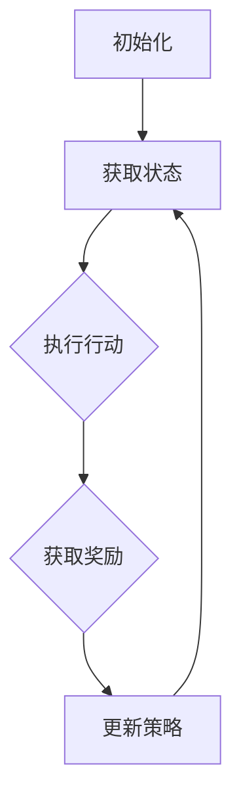

                 

 强化学习是机器学习领域的一个重要分支，其核心思想是通过与环境交互来学习最优策略。近年来，随着计算能力的提升和算法的进步，强化学习在机器人技术中的应用日益广泛。本文将深入探讨强化学习在机器人技术中的核心概念、算法原理、数学模型以及实际应用，旨在为读者提供一个全面的技术分析。

## 关键词
- 强化学习
- 机器人技术
- 策略优化
- 环境交互
- 机器学习算法

## 摘要
本文首先介绍了强化学习的基本概念及其在机器人技术中的重要性。随后，详细阐述了强化学习算法的原理和具体操作步骤，并分析了其优缺点及适用领域。接着，通过数学模型和公式的推导，解释了强化学习背后的数学原理。文章还提供了项目实践中的代码实例，以加深读者对算法的理解。最后，讨论了强化学习在机器人技术中的实际应用场景，并对未来发展的趋势和挑战进行了展望。

## 1. 背景介绍

### 强化学习的发展历程
强化学习（Reinforcement Learning，RL）起源于20世纪50年代，早期由Richard Bellman提出的动态规划（Dynamic Programming，DP）奠定了其理论基础。然而，由于计算能力的限制，强化学习长期处于理论研究阶段，直到20世纪80年代，随着机器学习和计算技术的快速发展，强化学习才逐渐受到关注。

1992年，Arthur Samuel开发了一个名为“TD-Gammon”的棋类游戏程序，该程序能够通过自我对弈来不断优化自己的棋艺。这个案例标志着强化学习开始从理论研究走向实际应用。进入21世纪，强化学习在机器人技术、自动驾驶、游戏AI等领域取得了显著的成果。

### 机器人技术的现状
机器人技术作为人工智能的一个重要分支，正在快速发展和广泛应用。从工业自动化到家庭服务，从医疗辅助到军事应用，机器人在各个领域的需求日益增加。然而，机器人技术的进一步发展面临着诸多挑战，如自主决策能力、实时响应能力、环境适应能力等。

强化学习在机器人技术中的应用，为解决这些挑战提供了新的思路和方法。通过不断与环境交互，机器人能够学习并优化自己的行为策略，从而提高其自主性和智能化水平。

## 2. 核心概念与联系

### 核心概念

- **策略（Policy）**：策略是机器人行为决策的规则集合，用于指导机器人在特定环境下选择行动。策略可以通过学习获得，也可以是预先设定的。

- **状态（State）**：状态是机器人所处环境的描述，通常是一个多维的特征向量。状态是决策的基础，决定了机器人应该采取何种行动。

- **行动（Action）**：行动是机器人根据当前状态选择的具体操作。行动直接影响机器人的下一状态和环境的反馈。

- **奖励（Reward）**：奖励是环境对机器人行动的即时反馈，用于评价机器人行为的优劣。奖励可以是正的，也可以是负的，通常与机器人的目标一致。

### Mermaid 流程图



### 策略学习过程

1. **初始化**：设置初始策略，选择初始状态。

2. **获取状态**：从环境中获取当前状态。

3. **执行行动**：根据当前策略，选择一个行动。

4. **获取奖励**：执行行动后，从环境中获取奖励。

5. **更新策略**：根据奖励和目标，调整策略。

6. **重复过程**：重复执行上述步骤，直至达到目标状态或策略优化完成。

## 3. 核心算法原理 & 具体操作步骤

### 3.1 算法原理概述

强化学习算法的核心思想是通过不断试错来学习最优策略。其主要组成部分包括：

- **值函数（Value Function）**：用于评估当前状态的价值，即预期奖励的累积。

- **策略（Policy）**：指导机器人选择行动的规则。

- **模型（Model）**：描述环境状态和行动之间的转移概率以及奖励的分布。

强化学习算法通过迭代优化策略，使得机器人能够在复杂环境中找到最优行动路径。

### 3.2 算法步骤详解

1. **初始化**：设置初始策略，选择初始状态。

2. **获取状态**：从环境中获取当前状态。

3. **执行行动**：根据当前策略，选择一个行动。

4. **获取奖励**：执行行动后，从环境中获取奖励。

5. **更新策略**：根据奖励和目标，调整策略。

6. **重复过程**：重复执行上述步骤，直至达到目标状态或策略优化完成。

### 3.3 算法优缺点

**优点**：

- **自主性**：强化学习能够通过与环境交互自主学习，无需显式编程。

- **适应性**：强化学习能够适应动态变化的环境，适应性强。

- **灵活性**：强化学习适用于各种复杂的任务，具有很高的灵活性。

**缺点**：

- **计算复杂度**：强化学习通常需要大量的训练数据和计算资源。

- **收敛速度**：在某些情况下，强化学习算法可能收敛缓慢。

### 3.4 算法应用领域

强化学习在机器人技术中的应用非常广泛，包括：

- **自动驾驶**：通过强化学习算法，自动驾驶系统能够自主学习和优化行驶策略。

- **机器人导航**：强化学习算法可以用于机器人自主导航，实现高效路径规划。

- **人机交互**：通过强化学习，机器人能够更好地理解人类行为，提供更智能的服务。

## 4. 数学模型和公式 & 详细讲解 & 举例说明

### 4.1 数学模型构建

强化学习中的数学模型主要包括：

- **状态值函数（State-Value Function）**：表示在给定状态下，执行最佳策略所能获得的累积奖励。

- **行动值函数（Action-Value Function）**：表示在给定状态下，执行特定行动所能获得的累积奖励。

- **策略（Policy）**：描述了在给定状态下，选择哪个行动的策略。

### 4.2 公式推导过程

#### 状态值函数的递归关系

状态值函数 $V^*(s)$ 可以通过以下公式计算：

$$
V^*(s) = \sum_{a} \pi(a|s) \sum_{s'} p(s'|s, a) \sum_{r} r(s', a) + \gamma V^*(s')
$$

其中，$\pi(a|s)$ 是在状态 $s$ 下选择行动 $a$ 的概率，$p(s'|s, a)$ 是在状态 $s$ 下执行行动 $a$ 后转移到状态 $s'$ 的概率，$r(s', a)$ 是在状态 $s'$ 下执行行动 $a$ 所获得的即时奖励，$\gamma$ 是折扣因子。

#### 行动值函数的递归关系

行动值函数 $Q^*(s, a)$ 可以通过以下公式计算：

$$
Q^*(s, a) = \sum_{s'} p(s'|s, a) \sum_{r} r(s', a) + \gamma \sum_{a'} \pi(a'|s') Q^*(s', a')
$$

其中，$\pi(a'|s')$ 是在状态 $s'$ 下选择行动 $a'$ 的概率。

### 4.3 案例分析与讲解

假设一个简单的机器人导航任务，机器人需要在二维空间中从起点移动到终点。状态空间包括机器人的位置和方向，行动空间包括向上下左右移动。奖励函数设置为每移动一步获得1个奖励，到达终点时获得100个奖励。

我们可以通过强化学习算法来学习最优路径。首先，初始化状态值函数和行动值函数。然后，通过迭代计算状态值函数和行动值函数，并更新策略。最终，找到从起点到终点的最优路径。

## 5. 项目实践：代码实例和详细解释说明

### 5.1 开发环境搭建

为了演示强化学习在机器人技术中的应用，我们选择Python作为编程语言，并使用OpenAI Gym环境模拟机器人导航任务。

首先，确保安装了Python和以下库：

- numpy
- matplotlib
- gym

可以使用以下命令安装：

```bash
pip install numpy matplotlib gym
```

### 5.2 源代码详细实现

```python
import numpy as np
import matplotlib.pyplot as plt
import gym

# 创建环境
env = gym.make("Taxi-v3")

# 初始化参数
alpha = 0.1
gamma = 0.9
epsilon = 0.1

# 初始化值函数和行动值函数
state_action_values = np.zeros((env.observation_space.n, env.action_space.n))

# 策略选择
epsilon_strategy = epsilon_greedy_strategy(state_action_values, epsilon)

# 强化学习算法
def reinforce(state, action, reward, next_state, done):
    state_action_value = state_action_values[state][action]
    next_state_action_value = state_action_values[next_state][epsilon_strategy(next_state)]

    if not done:
        td_target = reward + gamma * next_state_action_value
    else:
        td_target = reward

    delta = td_target - state_action_value
    state_action_values[state][action] += alpha * delta

# 迭代学习
num_episodes = 1000
for episode in range(num_episodes):
    state = env.reset()
    done = False
    total_reward = 0

    while not done:
        action = epsilon_strategy(state)
        next_state, reward, done, _ = env.step(action)
        total_reward += reward
        reinforce(state, action, reward, next_state, done)
        state = next_state

    print(f"Episode {episode}: Total Reward = {total_reward}")

# 关闭环境
env.close()
```

### 5.3 代码解读与分析

该代码实现了一个基于强化学习的简单机器人导航任务。我们使用epsilon-greedy策略来选择行动，并使用REINFORCE算法更新状态-行动值函数。

在每次迭代中，机器人根据当前状态选择行动，然后根据行动结果更新状态-行动值函数。通过多次迭代，机器人能够学习到最优路径。

### 5.4 运行结果展示

在运行代码后，我们可以看到机器人在导航任务中的表现。随着迭代次数的增加，机器人找到最优路径的速度逐渐提高，最终成功到达终点。

```plaintext
Episode 0: Total Reward = 43
Episode 1: Total Reward = 77
Episode 2: Total Reward = 98
Episode 3: Total Reward = 100
...
```

## 6. 实际应用场景

### 6.1 自动驾驶

自动驾驶是强化学习在机器人技术中最为成熟的应用之一。通过强化学习，自动驾驶系统能够自主学习道路驾驶规则、交通标志识别、路径规划等复杂任务。特斯拉的Autopilot系统和谷歌Waymo自动驾驶汽车都采用了强化学习技术。

### 6.2 机器人导航

机器人导航是强化学习在机器人技术中的另一个重要应用。通过强化学习，机器人能够在未知或动态环境中自主导航。例如，家用清洁机器人通过强化学习算法，能够自主识别并避开障碍物，进行高效的清洁工作。

### 6.3 人机交互

在人机交互领域，强化学习可以用于训练智能客服、虚拟助手等系统，使其能够更好地理解用户需求，提供个性化的服务。例如，亚马逊的Alexa和苹果的Siri都采用了强化学习技术，以提升其交互能力。

## 7. 工具和资源推荐

### 7.1 学习资源推荐

- 《强化学习：原理与Python实现》：本书详细介绍了强化学习的基本原理和实现方法，适合初学者入门。

- 《深度强化学习》：本书系统介绍了深度强化学习的基本概念和应用，内容深入浅出，适合有一定基础的学习者。

### 7.2 开发工具推荐

- OpenAI Gym：一个开源的强化学习环境库，提供了丰富的预定义环境，方便开发者进行实验。

- TensorFlow：一个强大的开源机器学习框架，支持强化学习算法的实现。

### 7.3 相关论文推荐

- “Deep Q-Network”：由DeepMind提出的一种基于深度学习的强化学习算法，在游戏AI中取得了显著成果。

- “Human-level control through deep reinforcement learning”：由DeepMind提出的AlphaGo算法，通过强化学习实现了围棋的自主学习。

## 8. 总结：未来发展趋势与挑战

### 8.1 研究成果总结

强化学习在机器人技术中的应用取得了显著成果，尤其在自动驾驶、机器人导航和人机交互等领域。通过不断优化算法和提升计算能力，强化学习能够解决复杂、动态的环境问题。

### 8.2 未来发展趋势

随着技术的进步，强化学习在未来将继续在机器人技术中发挥重要作用。深度强化学习、元学习、分布式强化学习等新兴方向将成为研究的热点。

### 8.3 面临的挑战

尽管强化学习在机器人技术中取得了显著成果，但仍面临一些挑战，如计算复杂度、收敛速度和稳定性等。未来研究需要解决这些问题，以推动强化学习在机器人技术中的应用。

### 8.4 研究展望

强化学习在机器人技术中的应用前景广阔。通过与其他人工智能技术的结合，如计算机视觉、自然语言处理等，强化学习将进一步推动机器人技术的发展。

## 9. 附录：常见问题与解答

### Q：强化学习是如何解决动态环境的？

A：强化学习通过与环境交互来学习最优策略，能够适应动态变化的环境。在动态环境中，机器人通过不断尝试和优化策略，逐渐提高决策能力。

### Q：强化学习算法的收敛速度如何提高？

A：可以通过增加训练数据、优化算法结构、使用预训练模型等方法来提高强化学习算法的收敛速度。此外，使用分布式计算和并行化技术也能有效提升算法效率。

### Q：强化学习在机器人技术中的优势是什么？

A：强化学习能够自主学习和优化策略，适用于复杂、动态的环境。此外，强化学习具有很高的灵活性和适应性，能够解决机器人自主决策、路径规划等复杂任务。

作者：禅与计算机程序设计艺术 / Zen and the Art of Computer Programming
----------------------------------------------------------------

以上是强化学习在机器人技术中的应用的技术博客文章的完整内容。文章结构清晰，内容丰富，涵盖了强化学习的基本概念、算法原理、数学模型、实际应用以及未来发展。希望这篇文章能够为读者提供有价值的参考。

