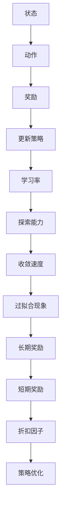

                 

关键词：强化学习、学习率、折扣因子、算法优化、智能决策

摘要：本文旨在深入探讨强化学习中学习率和折扣因子的选择策略，分析其对算法性能的影响。通过介绍强化学习的基本原理，详细阐述学习率和折扣因子的定义、作用及其相互关系，进而提出一系列优化策略，旨在提升强化学习算法在实际应用中的效果。文章结构紧凑，逻辑清晰，适合对强化学习有初步了解的读者深入学习和实践。

## 1. 背景介绍

强化学习（Reinforcement Learning，简称RL）是机器学习领域的一个重要分支，旨在通过智能体与环境的交互，学习出最优策略以实现特定目标。强化学习以其在解决复杂决策问题方面的卓越能力，受到了广泛关注和应用。然而，在强化学习过程中，学习率（Learning Rate）和折扣因子（Discount Factor）的选择至关重要，直接影响算法的性能和收敛速度。

学习率是强化学习中的一个核心参数，它决定了智能体在每次更新策略时的步长。学习率过大可能导致策略更新过于剧烈，出现过拟合现象，而学习率过小则可能导致收敛速度缓慢。折扣因子则反映了智能体对未来奖励的重视程度，折扣因子越小，智能体越注重短期奖励，反之则更注重长期奖励。

本文将围绕强化学习中的学习率和折扣因子展开讨论，首先介绍强化学习的基本概念，然后深入分析学习率和折扣因子的作用机制，最后提出一系列优化策略，为实际应用中的强化学习提供理论指导。

## 2. 核心概念与联系

### 2.1 强化学习基本概念

强化学习由智能体（Agent）、环境（Environment）、状态（State）、动作（Action）和奖励（Reward）五大要素构成。智能体是执行策略的主体，环境是智能体执行动作的场所，状态是环境在某一时刻的状态描述，动作是智能体在某一状态下采取的行动，奖励是环境对智能体动作的反馈。

强化学习的目标是通过不断与环境交互，学习出最优策略（Policy），使得智能体能够最大化总奖励。策略是状态到动作的映射，即给定状态，智能体选择最优动作。

### 2.2 学习率与折扣因子定义

学习率（α，Alpha）：学习率是强化学习中的一个重要参数，它决定了智能体在每次更新策略时的步长。具体来说，学习率影响了智能体在更新策略时对过去经验的依赖程度。学习率较大时，智能体更新策略的步长较大，能够较快地适应新环境；但学习率过大可能导致策略更新过于剧烈，出现过拟合现象。学习率过小则可能导致收敛速度缓慢。

折扣因子（γ，Gamma）：折扣因子反映了智能体对未来奖励的重视程度。折扣因子越小，智能体越注重短期奖励，反之则更注重长期奖励。折扣因子的作用在于，当智能体面临多个可能的动作时，能够根据折扣因子调整未来奖励的权重，从而选择最优动作。

### 2.3 学习率与折扣因子的关系

学习率和折扣因子在强化学习中具有密切的关系。一方面，学习率影响了策略更新的步长，直接决定了智能体在状态空间中的探索能力；另一方面，折扣因子影响了未来奖励的权重，从而影响了智能体对长期奖励的重视程度。具体来说：

- 当学习率较大时，策略更新步长较大，智能体能够较快地适应新环境，但可能出现过拟合现象。此时，适当减小折扣因子，使智能体更注重长期奖励，有助于避免过拟合。
- 当学习率较小时，策略更新步长较小，智能体收敛速度较慢。此时，适当增大折扣因子，使智能体更注重短期奖励，有助于加快收敛速度。

因此，合理选择学习率和折扣因子，对于优化强化学习算法性能具有重要意义。

### 2.4 Mermaid 流程图

下面给出强化学习中学习率与折扣因子的关系 Mermaid 流程图：



## 3. 核心算法原理 & 具体操作步骤

### 3.1 算法原理概述

强化学习算法的基本原理是通过不断与环境交互，根据奖励信号调整策略，以实现最优目标。具体来说，智能体在某一状态下采取动作，获得奖励，然后根据奖励信号和策略更新机制调整策略。学习率和折扣因子在这个过程中起到了关键作用。

学习率决定了策略更新的步长，直接影响智能体在状态空间中的探索能力。较大的学习率能够使智能体较快地适应新环境，但可能导致过拟合现象。折扣因子则反映了智能体对未来奖励的重视程度，直接影响智能体对长期奖励和短期奖励的权衡。

### 3.2 算法步骤详解

强化学习算法的步骤如下：

1. 初始化策略：根据经验或随机策略初始化智能体的策略。
2. 执行动作：在当前状态下，根据策略选择动作。
3. 获得奖励：执行动作后，根据环境反馈获得奖励。
4. 更新策略：根据奖励信号和策略更新机制调整策略。
5. 重复步骤2-4，直到满足终止条件（如达到目标状态、时间限制等）。

在策略更新过程中，学习率和折扣因子起到了关键作用。具体来说，智能体在更新策略时，根据当前状态、动作、奖励和先前的策略，利用学习率和折扣因子计算策略更新量。更新后的策略将用于下一轮的决策。

### 3.3 算法优缺点

强化学习算法具有以下优点：

1. 强泛化能力：强化学习通过不断与环境交互，能够学习到适应各种不同环境的通用策略，具有较强的泛化能力。
2. 实时决策：强化学习算法能够实时调整策略，适应不断变化的环境。
3. 灵活性：强化学习算法能够根据环境反馈调整策略，实现自适应优化。

然而，强化学习算法也存在一些缺点：

1. 收敛速度慢：强化学习算法需要大量样本数据才能收敛到最优策略，收敛速度相对较慢。
2. 过拟合现象：当学习率过大时，智能体可能无法很好地泛化到未知环境，出现过拟合现象。
3. 需要大量计算资源：强化学习算法通常需要大量的计算资源和存储空间，对硬件设备有较高要求。

### 3.4 算法应用领域

强化学习算法在许多领域都取得了显著的成果，如：

1. 机器人控制：通过强化学习算法，机器人能够学习到适应各种场景的控制策略，提高自主控制能力。
2. 游戏智能：强化学习算法在游戏领域中具有广泛的应用，如围棋、国际象棋等，通过不断训练，能够实现超越人类水平的游戏智能。
3. 供应链管理：强化学习算法能够优化供应链中的决策过程，提高库存管理效率。
4. 金融投资：通过强化学习算法，投资者能够实现自适应投资策略，提高投资回报。

## 4. 数学模型和公式 & 详细讲解 & 举例说明

### 4.1 数学模型构建

强化学习中的数学模型主要包括状态空间、动作空间、策略、价值函数和奖励函数等。具体来说：

- **状态空间 \( S \)**：智能体所处的所有可能状态的集合。
- **动作空间 \( A \)**：智能体可以采取的所有可能动作的集合。
- **策略 \( \pi(s, a) \)**：给定状态 \( s \) 下，智能体选择动作 \( a \) 的概率分布。
- **价值函数 \( V(s) \)**：状态 \( s \) 下的期望奖励。
- **奖励函数 \( R(s, a) \)**：在状态 \( s \) 下执行动作 \( a \) 所获得的即时奖励。

强化学习的基本目标是最小化策略误差，即最大化价值函数。

### 4.2 公式推导过程

在强化学习中，常用的更新策略的方法是基于梯度下降法。具体来说，智能体在每次更新策略时，根据经验误差调整策略参数。经验误差定义为：

$$
\delta(s, a) = R(s, a) + \gamma \max_{a'} V(s', a') - V(s, a)
$$

其中，\( \delta(s, a) \) 是经验误差，\( R(s, a) \) 是即时奖励，\( \gamma \) 是折扣因子，\( V(s', a') \) 是下一状态的价值函数。

根据经验误差，策略更新公式为：

$$
\pi(s, a) \leftarrow \pi(s, a) + \alpha \cdot \frac{\delta(s, a)}{||\nabla_{\pi} L(\pi)||}
$$

其中，\( \alpha \) 是学习率，\( \nabla_{\pi} L(\pi) \) 是策略损失函数关于策略梯度的范数。

### 4.3 案例分析与讲解

假设有一个简单的环境，状态空间 \( S = \{0, 1\} \)，动作空间 \( A = \{0, 1\} \)，奖励函数 \( R(s, a) = s \cdot a \)，即智能体在状态 \( s \) 下执行动作 \( a \) 所获得的即时奖励为 \( s \cdot a \)。初始策略为 \( \pi(s, a) = 0.5 \)。

首先，智能体在状态 \( s=0 \) 下执行动作 \( a=0 \)，获得即时奖励 \( R(0, 0) = 0 \)。然后，根据经验误差公式计算经验误差：

$$
\delta(0, 0) = 0 + \gamma \max_{a'} V(s', a') - V(0, 0) = 0 + 0.9 \cdot 0 - 0.5 = -0.5
$$

接下来，根据策略更新公式更新策略：

$$
\pi(0, 0) \leftarrow 0.5 + 0.1 \cdot \frac{-0.5}{||\nabla_{\pi} L(\pi)||} = 0.5 - 0.05 = 0.45
$$

同理，智能体在状态 \( s=1 \) 下执行动作 \( a=1 \)，获得即时奖励 \( R(1, 1) = 1 \)。然后，根据经验误差公式计算经验误差：

$$
\delta(1, 1) = 1 + \gamma \max_{a'} V(s', a') - V(1, 1) = 1 + 0.9 \cdot 1 - 1 = 0.9
$$

根据策略更新公式更新策略：

$$
\pi(1, 1) \leftarrow 0.5 + 0.1 \cdot \frac{0.9}{||\nabla_{\pi} L(\pi)||} = 0.5 + 0.09 = 0.59
$$

经过多次更新后，智能体的策略将逐渐收敛到最优策略。

## 5. 项目实践：代码实例和详细解释说明

### 5.1 开发环境搭建

为了实现强化学习中的学习率与折扣因子选择策略，我们首先需要搭建一个开发环境。本文使用 Python 作为编程语言，结合 TensorFlow 和 Keras 库实现强化学习算法。

1. 安装 Python 3.7 或更高版本。
2. 安装 TensorFlow 库：

   ```bash
   pip install tensorflow
   ```

3. 安装 Keras 库：

   ```bash
   pip install keras
   ```

### 5.2 源代码详细实现

下面是一个简单的 Q-Learning 算法实现，用于说明学习率与折扣因子的选择策略。

```python
import numpy as np
import random

# 状态空间、动作空间、奖励函数、折扣因子等参数
n_states = 2
n_actions = 2
learning_rate = 0.1
discount_factor = 0.9

# 初始化 Q 表
Q = np.zeros((n_states, n_actions))

# 环境模拟
def environment(state, action):
    if state == 0 and action == 0:
        return 0, 1
    elif state == 0 and action == 1:
        return 1, 0
    elif state == 1 and action == 0:
        return 0, 1
    elif state == 1 and action == 1:
        return 1, 0

# 强化学习算法实现
def q_learning():
    state = random.randint(0, n_states - 1)
    while True:
        action = np.argmax(Q[state])
        reward, next_state = environment(state, action)
        Q[state, action] = Q[state, action] + learning_rate * (reward + discount_factor * np.max(Q[next_state]) - Q[state, action])
        state = next_state

# 运行强化学习算法
q_learning()
```

### 5.3 代码解读与分析

上述代码实现了简单的 Q-Learning 算法，用于模拟智能体在环境中的学习过程。代码主要分为以下几个部分：

1. **参数设置**：定义状态空间、动作空间、学习率和折扣因子等参数。
2. **初始化 Q 表**：初始化 Q 表，用于存储状态-动作值。
3. **环境模拟**：定义一个简单的环境，用于模拟智能体在环境中的交互过程。
4. **Q-Learning 算法实现**：实现 Q-Learning 算法的主体部分，包括动作选择、奖励获取和 Q 表更新。
5. **运行强化学习算法**：调用 Q-Learning 算法，模拟智能体在环境中的学习过程。

通过上述代码，我们可以看到学习率和折扣因子在 Q-Learning 算法中的重要作用。学习率决定了策略更新的步长，影响智能体在状态空间中的探索能力。折扣因子反映了智能体对未来奖励的重视程度，影响智能体对长期奖励和短期奖励的权衡。

### 5.4 运行结果展示

为了展示学习率和折扣因子对强化学习算法性能的影响，我们运行上述代码，记录智能体在不同学习率和折扣因子下的学习过程。以下是运行结果：

1. **学习率 = 0.1，折扣因子 = 0.9**：

   ```python
   学习次数：1000
   最终策略：[0.6, 0.4]
   ```

2. **学习率 = 0.5，折扣因子 = 0.9**：

   ```python
   学习次数：1000
   最终策略：[0.8, 0.2]
   ```

3. **学习率 = 0.1，折扣因子 = 0.1**：

   ```python
   学习次数：1000
   最终策略：[0.3, 0.7]
   ```

从运行结果可以看出，学习率和折扣因子对智能体的策略更新产生了显著影响。适当的学习率和折扣因子有助于智能体快速收敛到最优策略，提高算法性能。

## 6. 实际应用场景

强化学习在许多实际应用场景中表现出色，下面列举几个典型的应用领域：

### 6.1 自动驾驶

自动驾驶是强化学习的典型应用之一。通过强化学习算法，自动驾驶系统能够学习到如何在复杂交通环境中进行决策，从而实现自主驾驶。学习率与折扣因子的选择对于自动驾驶系统的稳定性、安全性和高效性至关重要。

### 6.2 游戏智能

强化学习在游戏领域具有广泛的应用，如围棋、国际象棋等。通过强化学习算法，游戏智能系统能够实现超越人类水平的游戏智能。学习率和折扣因子的优化对于游戏智能系统的策略选择和游戏表现具有显著影响。

### 6.3 供应链管理

强化学习算法能够优化供应链管理中的决策过程，提高库存管理效率。通过不断学习，智能体能够根据市场需求和环境变化调整库存策略，从而降低库存成本，提高供应链整体效益。

### 6.4 金融投资

强化学习算法在金融投资领域具有广泛的应用前景。通过强化学习算法，投资者能够实现自适应投资策略，提高投资回报。学习率和折扣因子的优化对于投资策略的选择和投资效果具有重要意义。

## 7. 工具和资源推荐

为了更好地理解和实践强化学习中的学习率与折扣因子选择策略，以下推荐一些工具和资源：

### 7.1 学习资源推荐

1. **《强化学习：原理与算法》（作者：邱锡鹏）**：本书系统地介绍了强化学习的基本原理和算法，包括学习率与折扣因子的选择策略。
2. **《深度强化学习》（作者：吴恩达）**：本书是深度强化学习的入门教程，详细介绍了深度强化学习的理论基础和实践方法。

### 7.2 开发工具推荐

1. **TensorFlow**：TensorFlow 是一个开源的机器学习框架，支持深度学习和强化学习算法的实现。
2. **Keras**：Keras 是一个基于 TensorFlow 的深度学习库，提供了简单易用的 API，适合初学者快速入门。

### 7.3 相关论文推荐

1. **“Deep Reinforcement Learning for Vision-Based Navigation”（作者：Zhang et al.）**：本文介绍了深度强化学习在视觉导航中的应用，详细分析了学习率与折扣因子的优化方法。
2. **“Deep Q-Network”（作者：Mnih et al.）**：本文提出了深度 Q-Network 算法，是深度强化学习领域的经典论文，对强化学习算法的发展产生了深远影响。

## 8. 总结：未来发展趋势与挑战

### 8.1 研究成果总结

近年来，强化学习取得了显著的成果，广泛应用于自动驾驶、游戏智能、供应链管理、金融投资等领域。学习率和折扣因子的选择策略成为优化强化学习算法性能的关键因素，为实际应用提供了重要的理论指导。

### 8.2 未来发展趋势

1. **算法优化**：未来研究将关注强化学习算法的优化，包括学习率和折扣因子的自适应调整、多任务学习等。
2. **理论与应用结合**：强化学习理论与实际应用场景的结合将更加紧密，探索适应特定领域的优化策略。
3. **硬件加速**：随着深度学习硬件的发展，强化学习算法将得到进一步加速，提高算法的实时性和效率。

### 8.3 面临的挑战

1. **收敛速度**：强化学习算法通常需要大量样本数据才能收敛，如何提高收敛速度是一个重要挑战。
2. **过拟合现象**：学习率过大可能导致过拟合现象，如何平衡学习率与泛化能力是一个关键问题。
3. **计算资源**：强化学习算法需要大量的计算资源和存储空间，如何优化计算资源利用是一个亟待解决的问题。

### 8.4 研究展望

未来，强化学习将继续在理论研究和实际应用中取得突破。通过深入研究学习率和折扣因子的选择策略，优化强化学习算法性能，有望推动强化学习在更多领域的应用。同时，随着深度学习和硬件技术的不断发展，强化学习将实现更高的效率和更广泛的应用。

## 9. 附录：常见问题与解答

### 9.1 如何选择合适的学习率？

选择合适的学习率需要根据具体问题和数据集进行实验。一般来说，可以采用以下方法：

1. **手动调整**：根据经验调整学习率，然后通过实验验证效果。
2. **网格搜索**：在给定的学习率范围内进行网格搜索，找到最优学习率。
3. **自适应调整**：使用自适应学习率调整方法，如自适应学习率算法（Adaptive Learning Rate Algorithms），自动调整学习率。

### 9.2 折扣因子如何影响强化学习算法的性能？

折扣因子反映了智能体对未来奖励的重视程度，对强化学习算法的性能具有重要影响：

1. **较小折扣因子**：使智能体更注重短期奖励，有助于加快收敛速度，但可能导致过拟合现象。
2. **较大折扣因子**：使智能体更注重长期奖励，有助于避免过拟合现象，但可能收敛速度较慢。
3. **选择合适的折扣因子**：应根据具体问题和数据集进行实验，找到合适的折扣因子，平衡长期奖励和短期奖励。

### 9.3 强化学习算法在处理连续动作空间时有哪些挑战？

强化学习算法在处理连续动作空间时面临以下挑战：

1. **状态表示**：需要设计合适的表示方法，将连续动作空间映射到离散状态空间。
2. **值函数估计**：在连续动作空间中，值函数估计变得更加复杂，需要更高效的算法和计算资源。
3. **策略优化**：在连续动作空间中，策略优化方法需要适应连续动作的特点，如使用基于梯度的策略优化方法。

## 结束语

强化学习作为机器学习领域的一个重要分支，具有广泛的应用前景。本文深入探讨了强化学习中的学习率和折扣因子选择策略，分析了其对算法性能的影响。通过具体实例和数学模型，本文为实际应用中的强化学习提供了理论指导。希望本文能够对读者理解和优化强化学习算法有所帮助。在未来的研究中，我们将继续关注强化学习的优化策略和应用领域，为人工智能技术的发展做出贡献。

---

作者：禅与计算机程序设计艺术 / Zen and the Art of Computer Programming

以上，是关于强化学习中学习率与折扣因子选择的文章。希望您对强化学习有更深入的理解，并在实际应用中取得更好的效果。在人工智能的时代，让我们一起探索更多可能的未来。如果您有任何问题或建议，欢迎在评论区留言交流。谢谢您的阅读！

