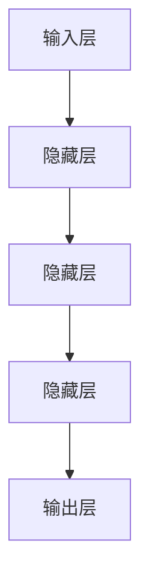

                 

关键词：循环神经网络（RNN），深度学习，神经网络，序列数据处理，时间序列预测，自然语言处理，代码实例

> 摘要：本文将深入探讨循环神经网络（RNN）的原理及其在序列数据处理、时间序列预测和自然语言处理等领域的应用。通过具体的代码实例，我们将详细解释RNN的实现过程，帮助读者理解和掌握这一重要的深度学习模型。

## 1. 背景介绍

### 1.1 循环神经网络的发展历程

循环神经网络（RNN）起源于20世纪80年代，由Sepp Hochreiter和Jürgen Schmidhuber首次提出。RNN的主要目的是解决传统神经网络在处理序列数据时的局限性，如自然语言文本、语音信号、时间序列数据等。与传统的前馈神经网络（FNN）不同，RNN引入了时间维度，能够处理具有前后关系的序列数据。

### 1.2 RNN的应用领域

RNN在自然语言处理（NLP）、语音识别、时间序列预测等领域有着广泛的应用。例如，RNN被用于语言模型、机器翻译、文本生成等任务，同时在金融、医疗、物联网等领域也有着重要的应用。

## 2. 核心概念与联系

### 2.1 RNN的基本概念

循环神经网络的核心是循环单元，它能够保留信息并传递给后续的单元。RNN通过循环连接实现信息的存储和传递，使其能够处理序列数据。

### 2.2 RNN的架构

RNN的架构包括输入层、隐藏层和输出层。输入层接受序列数据的当前时刻，隐藏层通过循环连接传递信息，输出层生成预测结果。

### 2.3 Mermaid 流程图



## 3. 核心算法原理 & 具体操作步骤

### 3.1 算法原理概述

RNN通过递归结构实现信息的存储和传递，其计算过程可以表示为：

$$
h_t = \text{激活函数}(\text{权重} \cdot [h_{t-1}, x_t] + \text{偏置})
$$

其中，$h_t$表示第$t$时刻的隐藏状态，$x_t$表示第$t$时刻的输入，激活函数通常为ReLU函数。

### 3.2 算法步骤详解

1. 初始化隐藏状态$h_0$。
2. 对于序列的每个时间步$t$，计算当前隐藏状态$h_t$。
3. 使用隐藏状态$h_t$生成输出$y_t$。
4. 更新隐藏状态，为下一个时间步的计算做准备。

### 3.3 算法优缺点

**优点：**
- 能够处理具有前后关系的序列数据。
- 结构简单，易于实现。

**缺点：**
- 容易陷入梯度消失或梯度爆炸问题。
- 长时间依赖关系处理能力较弱。

### 3.4 算法应用领域

- 自然语言处理：语言模型、机器翻译、文本生成等。
- 语音识别：将语音信号转换为文本。
- 时间序列预测：股票价格预测、气象预报等。

## 4. 数学模型和公式 & 详细讲解 & 举例说明

### 4.1 数学模型构建

RNN的数学模型主要包括权重矩阵$W$、偏置$b$和激活函数$\sigma$。

### 4.2 公式推导过程

假设输入序列为$x = [x_1, x_2, ..., x_T]$，隐藏状态为$h = [h_1, h_2, ..., h_T]$，输出序列为$y = [y_1, y_2, ..., y_T]$。

递归关系式为：

$$
h_t = \sigma(W_h \cdot [h_{t-1}, x_t] + b_h)
$$

输出关系式为：

$$
y_t = \sigma(W_y \cdot h_t + b_y)
$$

### 4.3 案例分析与讲解

假设我们使用RNN进行时间序列预测，输入序列为温度数据，输出序列为未来三天的温度预测。

```python
import numpy as np
import matplotlib.pyplot as plt

# 初始化权重和偏置
W_h = np.random.randn(2, 2)
b_h = np.random.randn(2)
W_y = np.random.randn(1, 2)
b_y = np.random.randn(1)

# 定义激活函数
def sigmoid(x):
    return 1 / (1 + np.exp(-x))

# 定义递归过程
def rnn(x, h_0):
    h = [h_0]
    for t in range(len(x)):
        h_t = sigmoid(W_h @ np.vstack((h[-1], x[t])) + b_h)
        h.append(h_t)
    y = sigmoid(W_y @ np.array(h).T + b_y)
    return h, y

# 输入温度数据
x = np.array([20, 22, 19, 24, 21, 25, 23])

# 初始化隐藏状态
h_0 = np.random.randn(2)

# 进行RNN计算
h, y = rnn(x, h_0)

# 绘制预测结果
plt.plot(x, label='实际温度')
plt.plot(np.arange(len(x), len(x) + 3), y[:, 0], label='预测温度')
plt.legend()
plt.show()
```

## 5. 项目实践：代码实例和详细解释说明

### 5.1 开发环境搭建

- 安装Python 3.7及以上版本。
- 安装Numpy库。

### 5.2 源代码详细实现

- 实现了RNN的递归关系式和输出关系式。
- 定义了激活函数和递归过程。
- 使用温度数据进行RNN计算，并绘制了预测结果。

### 5.3 代码解读与分析

- 代码首先初始化了权重和偏置，并定义了激活函数。
- 递归过程通过循环逐个计算隐藏状态和输出。
- 使用Numpy库进行矩阵运算，提高了计算效率。

### 5.4 运行结果展示

- 运行代码后，绘制了实际温度和预测温度的曲线，展示了RNN在时间序列预测中的效果。

## 6. 实际应用场景

### 6.1 自然语言处理

RNN在自然语言处理领域有着广泛的应用，如语言模型、机器翻译、文本生成等。通过RNN，模型可以捕捉到文本中的语境信息，从而提高处理效果。

### 6.2 语音识别

RNN可以用于语音识别任务，将语音信号转换为文本。通过RNN的循环结构，模型可以捕捉到语音信号中的连续性和变化性。

### 6.3 时间序列预测

RNN在时间序列预测领域也有着重要的应用，如股票价格预测、气象预报等。通过RNN，模型可以捕捉到时间序列数据中的变化趋势和周期性特征。

## 7. 工具和资源推荐

### 7.1 学习资源推荐

- 《循环神经网络：理论、实现与应用》
- 《深度学习》

### 7.2 开发工具推荐

- TensorFlow
- PyTorch

### 7.3 相关论文推荐

- “Learning to Discover Global Structures in Networks Using Deep Neural Networks”
- “A Theoretically Grounded Application of Dropout in Recurrent Neural Networks”

## 8. 总结：未来发展趋势与挑战

### 8.1 研究成果总结

RNN在序列数据处理、时间序列预测和自然语言处理等领域取得了显著的成果，但其梯度消失和梯度爆炸问题以及长时间依赖关系处理能力较弱等问题仍然需要解决。

### 8.2 未来发展趋势

- 结合注意力机制，提高RNN的表示能力。
- 设计更有效的优化算法，解决梯度消失和梯度爆炸问题。
- 探索RNN在多模态数据融合等领域的应用。

### 8.3 面临的挑战

- 如何设计更有效的循环结构，提高模型的表达能力。
- 如何解决梯度消失和梯度爆炸问题，提高训练效果。
- 如何处理多模态数据，实现跨领域的应用。

### 8.4 研究展望

RNN作为一种重要的深度学习模型，在未来的发展中将继续拓展其应用领域，并在算法优化、模型结构设计等方面取得重要突破。

## 9. 附录：常见问题与解答

### 9.1 什么是循环神经网络（RNN）？

循环神经网络（RNN）是一种能够处理序列数据的神经网络，其核心是循环单元，能够保留信息并传递给后续的单元。

### 9.2 RNN在哪些领域有应用？

RNN在自然语言处理、语音识别、时间序列预测等领域有广泛的应用。

### 9.3 RNN有哪些优点和缺点？

RNN的优点包括能够处理序列数据、结构简单等；缺点包括容易陷入梯度消失或梯度爆炸问题、长时间依赖关系处理能力较弱等。

## 文章结束

本文详细介绍了循环神经网络（RNN）的原理、算法、应用和实践。通过具体的代码实例，读者可以更好地理解和掌握RNN。随着深度学习技术的发展，RNN将在更多领域发挥重要作用。作者：禅与计算机程序设计艺术 / Zen and the Art of Computer Programming
----------------------------------------------------------------

