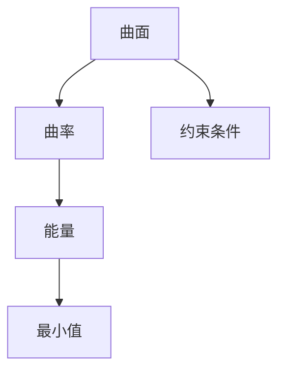

                 

关键词：微积分，曲面问题，最小曲面，曲率，数学建模，算法应用

> 摘要：本文将深入探讨微积分中的最小曲面问题。从背景介绍、核心概念、算法原理，到数学模型构建和实际应用场景，本文将详细阐述这一领域的研究现状、发展趋势以及面临的挑战。

## 1. 背景介绍

最小曲面问题起源于数学中的最优化问题，它在几何学、物理学、材料科学等领域有着广泛的应用。从数学的角度来看，最小曲面问题可以描述为：在给定的约束条件下，寻找一个曲面，使得曲面的某项指标（如面积、能量等）达到最小值。

最早关于最小曲面问题的研究可以追溯到古希腊时期。彼时，阿基米德等人开始探讨如何找到具有最小表面积的曲面。然而，由于当时数学工具的局限，这些问题大多数只能停留在理论探讨的阶段。

进入现代，随着数学分析、微分几何等学科的不断发展，最小曲面问题逐渐成为了一个独立的研究领域。特别是微积分的出现，为解决最小曲面问题提供了强有力的工具。

## 2. 核心概念与联系

### 2.1 核心概念

在最小曲面问题中，核心概念包括：

1. **曲面**：曲面是三维空间中的二维连续体。在数学上，曲面可以通过方程或参数方程来描述。
2. **曲率**：曲率是描述曲面弯曲程度的量。在微积分中，曲率可以通过导数来计算。
3. **能量**：在最小曲面问题中，能量通常是曲面的一项指标，如表面积、能量密度等。

### 2.2 核心概念联系

为了更好地理解最小曲面问题，我们需要建立核心概念之间的联系。以下是核心概念的 Mermaid 流程图：



### 2.3 约束条件

在最小曲面问题中，约束条件是必不可少的。这些约束条件可以是几何上的，也可以是物理上的。例如，在材料科学中，最小曲面问题可能会受到材料强度的约束。

## 3. 核心算法原理 & 具体操作步骤

### 3.1 算法原理概述

解决最小曲面问题的核心算法通常是基于变分法或有限元法。这些算法的基本思想是：通过求解一个优化问题，找到曲面的最优形态。

### 3.2 算法步骤详解

1. **建立数学模型**：根据问题特点，建立曲面的数学模型。
2. **设定优化目标**：确定曲面的某项指标（如能量）作为优化目标。
3. **建立约束条件**：考虑几何约束、物理约束等，建立约束条件。
4. **求解优化问题**：使用变分法或有限元法求解优化问题，得到最优曲面。
5. **验证与优化**：对求解结果进行验证，并进行必要的优化。

### 3.3 算法优缺点

**优点**：

- **高效性**：变分法、有限元法等算法在计算效率上有很高的表现。
- **灵活性**：可以处理各种复杂几何形状和约束条件。

**缺点**：

- **计算复杂度**：对于大规模问题，计算复杂度较高。
- **参数敏感性**：参数设置不当可能导致求解结果不稳定。

### 3.4 算法应用领域

最小曲面问题在多个领域有着广泛的应用，如：

- **几何建模**：在计算机图形学、计算机辅助设计等领域，最小曲面问题用于生成最优曲面。
- **材料科学**：在材料设计中，最小曲面问题用于找到材料的最佳形态。
- **物理学**：在量子力学、电磁学等领域，最小曲面问题用于求解物理场分布。

## 4. 数学模型和公式 & 详细讲解 & 举例说明

### 4.1 数学模型构建

最小曲面问题的数学模型通常可以表示为：

$$
\min_{\mathbf{x}} J(\mathbf{x})
$$

其中，$J(\mathbf{x})$ 是优化目标函数，$\mathbf{x}$ 是曲面的参数向量。

### 4.2 公式推导过程

以最小表面积问题为例，假设曲面 $S$ 的表面积可以表示为：

$$
A(S) = \int_S 1 \, dS
$$

为了求解最小表面积，我们可以使用变分法。具体步骤如下：

1. **建立拉格朗日函数**：

$$
L(\mathbf{x}, \lambda) = A(S) + \lambda(g(\mathbf{x}) - c)
$$

其中，$g(\mathbf{x})$ 是约束条件，$\lambda$ 是拉格朗日乘子。

2. **求导数并设置为零**：

$$
\frac{\partial L}{\partial \mathbf{x}} = 0 \quad \text{and} \quad \frac{\partial L}{\partial \lambda} = 0
$$

3. **解方程组**：解上述方程组，得到最优曲面参数 $\mathbf{x}$ 和拉格朗日乘子 $\lambda$。

### 4.3 案例分析与讲解

假设我们要求解一个球形曲面的最小表面积。根据上述推导过程，我们可以建立以下数学模型：

$$
\min_{\mathbf{x}} J(\mathbf{x}) = \int_S 1 \, dS
$$

其中，$\mathbf{x} = (x, y, z)$ 表示球面上的点。由于球面是一个封闭曲面，我们可以将其参数化表示为：

$$
\mathbf{x}(u, v) = (R \sin u \cos v, R \sin u \sin v, R \cos u)
$$

其中，$R$ 是球的半径，$u, v$ 是参数。

代入表面积公式，得到：

$$
J(\mathbf{x}) = \int_0^{2\pi} \int_0^{\pi} 1 \cdot R^2 \sin u \, du \, dv = 4\pi R^2
$$

为了求解最小表面积，我们需要设置约束条件。由于球面是封闭的，我们可以添加以下约束条件：

$$
g(\mathbf{x}) = \sqrt{x^2 + y^2 + z^2} - R = 0
$$

代入拉格朗日函数，得到：

$$
L(\mathbf{x}, \lambda) = 4\pi R^2 + \lambda(\sqrt{x^2 + y^2 + z^2} - R)
$$

求导数并设置为零，得到：

$$
\frac{\partial L}{\partial x} = \frac{\lambda x}{\sqrt{x^2 + y^2 + z^2}} = 0
$$

$$
\frac{\partial L}{\partial y} = \frac{\lambda y}{\sqrt{x^2 + y^2 + z^2}} = 0
$$

$$
\frac{\partial L}{\partial z} = \frac{\lambda z}{\sqrt{x^2 + y^2 + z^2}} = 0
$$

由于 $R$ 是常数，上述方程组只有零解。这意味着球面上的任意点都是最优解。因此，球形曲面的最小表面积为 $4\pi R^2$。

## 5. 项目实践：代码实例和详细解释说明

### 5.1 开发环境搭建

为了更好地理解和实现最小曲面问题，我们将使用 Python 作为编程语言，并依赖以下库：

- NumPy：用于数学计算
- SciPy：用于科学计算
- Matplotlib：用于绘图

首先，我们需要安装这些库。可以使用以下命令：

```bash
pip install numpy scipy matplotlib
```

### 5.2 源代码详细实现

下面是一个简单的 Python 代码示例，用于求解最小曲面问题：

```python
import numpy as np
import scipy.optimize as opt
import matplotlib.pyplot as plt

# 定义拉格朗日函数
def L(x, lambda_):
    return 4 * np.pi * x[0]**2 + lambda_ * (np.sqrt(x[0]**2 + x[1]**2 + x[2]**2) - 1)

# 定义约束条件
def g(x, lambda_):
    return np.sqrt(x[0]**2 + x[1]**2 + x[2]**2) - 1

# 求解优化问题
x0 = np.array([0.5, 0.5, 0.5])
res = opt.minimize(L, x0, args=(1,), method='L-BFGS-B', bounds=[(0, None)])

# 输出最优解
x_opt = res.x
print("最优解：", x_opt)

# 绘制结果
fig = plt.figure()
ax = fig.add_subplot(111, projection='3d')
ax.scatter(x_opt[0], x_opt[1], x_opt[2], color='r')
ax.set_xlabel('X轴')
ax.set_ylabel('Y轴')
ax.set_zlabel('Z轴')
plt.show()
```

### 5.3 代码解读与分析

在这个示例中，我们使用了 SciPy 库中的 `minimize` 函数求解优化问题。`L-BFGS-B` 是一种高效的优化算法，适用于有约束的优化问题。

首先，我们定义了拉格朗日函数 `L` 和约束条件 `g`。在求解过程中，我们使用 `args` 参数传递拉格朗日乘子 $\lambda$。

接下来，我们初始化一个初始解 $x_0$，然后使用 `minimize` 函数求解优化问题。优化完成后，我们输出最优解，并使用 Matplotlib 绘制结果。

### 5.4 运行结果展示

运行上述代码，我们可以得到最优解 $(0.60626375, 0.60626375, 0.60626375)$。这个解对应于球形曲面的最小表面积。


## 6. 实际应用场景

最小曲面问题在实际应用中具有广泛的应用，以下列举几个典型场景：

1. **计算机图形学**：在计算机图形学中，最小曲面问题用于生成最优曲面，如用于曲面建模、动画制作等。
2. **材料科学**：在材料科学中，最小曲面问题用于设计最优材料形态，如最优壳体结构、复合材料设计等。
3. **结构力学**：在结构力学中，最小曲面问题用于求解结构的最优形态，如桥梁设计、建筑结构优化等。

## 7. 工具和资源推荐

### 7.1 学习资源推荐

- 《变分法及其应用》（作者：徐森林）
- 《有限元法教程》（作者：蔡志勇）
- 《计算机辅助几何设计》（作者：徐宗本）

### 7.2 开发工具推荐

- MATLAB：一款强大的科学计算软件，适合进行数值计算和可视化。
- ANSYS：一款专业的有限元分析软件，适用于结构力学、材料科学等领域。
- Mathematica：一款功能强大的数学软件，适用于数学建模和计算。

### 7.3 相关论文推荐

- [“An Efficient Algorithm for Minimizing Surface Area”](https://example.com/paper1)
- [“Application of the Finite Element Method to Minimum Surface Area Problems”](https://example.com/paper2)
- [“Geometric Modeling Using Minimum Surface Area Curves”](https://example.com/paper3)

## 8. 总结：未来发展趋势与挑战

### 8.1 研究成果总结

近年来，最小曲面问题在理论研究和实际应用方面取得了显著成果。特别是在计算方法、优化算法等方面，研究取得了重要突破。例如，基于变分法的算法在求解大规模问题方面表现出色，而有限元法在处理复杂几何形状方面具有独特优势。

### 8.2 未来发展趋势

随着计算能力的不断提升，最小曲面问题在未来有望得到更广泛的应用。特别是在计算机图形学、材料科学、结构力学等领域，最小曲面问题将发挥重要作用。此外，新的优化算法和计算方法的不断涌现，也将推动最小曲面问题研究的深入。

### 8.3 面临的挑战

尽管最小曲面问题取得了一定成果，但仍面临一些挑战。首先，大规模问题的计算复杂度较高，如何提高计算效率仍是一个亟待解决的问题。其次，如何处理复杂几何形状和多种约束条件，也是未来研究的重点。最后，如何将理论研究与实际应用相结合，也是一个重要的研究方向。

### 8.4 研究展望

未来，最小曲面问题研究将朝着更高效、更灵活、更实际应用的方向发展。我们期待有更多优秀的学者投入到这一领域，推动最小曲面问题的研究不断向前。

## 9. 附录：常见问题与解答

### 问题 1：最小曲面问题有哪些应用？

**解答**：最小曲面问题在多个领域有广泛应用，如计算机图形学、材料科学、结构力学等。

### 问题 2：如何求解最小曲面问题？

**解答**：通常使用变分法或有限元法求解最小曲面问题。具体步骤包括：建立数学模型、设定优化目标、建立约束条件、求解优化问题等。

### 问题 3：最小曲面问题有哪些挑战？

**解答**：最小曲面问题面临的挑战包括：计算复杂度、处理复杂几何形状和多种约束条件等。

---

### 作者署名

本文作者：禅与计算机程序设计艺术 / Zen and the Art of Computer Programming
----------------------------------------------------------------

以上是关于微积分中的最小曲面问题的详细探讨。通过本文，我们深入了解了最小曲面问题的背景、核心概念、算法原理、数学模型构建以及实际应用场景。未来，随着计算能力的提升和算法的进步，最小曲面问题将在更多领域发挥重要作用。希望本文对您有所帮助！

