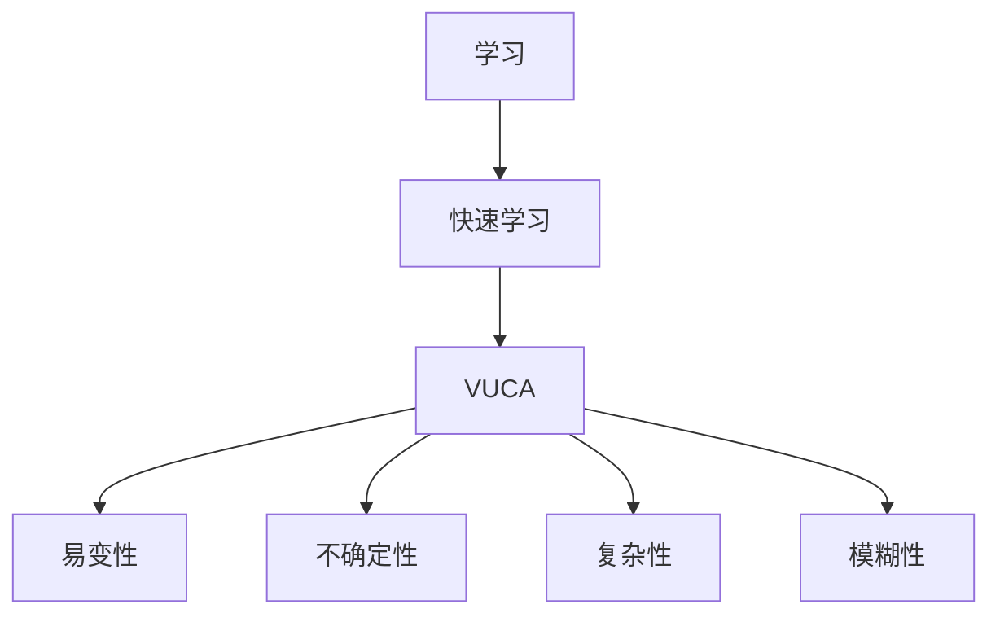

                 

关键词：快速学习、VUCA、制胜法宝、信息技术、人工智能、算法、数学模型、代码实例、应用场景、未来展望

> 摘要：在信息技术快速发展的今天，VUCA（易变性、不确定性、复杂性、模糊性）已成为常态。为了应对这种环境，快速学习成为了一个关键能力。本文旨在介绍快速学习的方法和工具，帮助读者在VUCA时代中立于不败之地。

## 1. 背景介绍

当今世界，信息技术的飞速发展使得知识更新的速度前所未有。在这种环境中，VUCA（易变性、不确定性、复杂性、模糊性）成为了我们面临的主要挑战。快速学习成为了个人和组织成功的关键因素。然而，如何在VUCA环境中高效地学习呢？本文将为您揭示快速学习的制胜法宝。

### 1.1 VUCA时代的挑战

- **易变性（Volatility）**：技术更新换代加速，导致知识失效周期缩短。
- **不确定性（Uncertainty）**：预测未来的难度增加，决策面临更多不确定性。
- **复杂性（Complexity）**：系统变得更加复杂，理解和解决问题的难度上升。
- **模糊性（Ambiguity）**：信息的真实性、可靠性难以判断，决策环境变得更加模糊。

### 1.2 快速学习的重要性

- **保持竞争力**：快速学习能够帮助个人和组织适应不断变化的环境，保持竞争力。
- **创新能力**：快速学习能够激发新的创意和想法，推动创新。
- **适应能力**：快速学习能够帮助个人和组织更好地应对不确定性，提高适应能力。

## 2. 核心概念与联系

为了更好地理解快速学习，我们需要明确几个核心概念，并展示它们之间的联系。

### 2.1 核心概念

- **学习**：获取新知识、技能或行为的过程。
- **快速学习**：在有限时间内高效地获取和处理大量信息的能力。
- **VUCA**：描述信息技术时代不确定性和复杂性的概念。

### 2.2 Mermaid 流程图



## 3. 核心算法原理 & 具体操作步骤

### 3.1 算法原理概述

快速学习的核心在于**深度学习**和**知识图谱**的结合。深度学习能够处理大量数据，提取特征；知识图谱则能够将特征之间的关系进行结构化表示。

### 3.2 算法步骤详解

1. **数据收集**：收集与学习目标相关的数据。
2. **数据处理**：对数据进行清洗、去噪、标准化等预处理。
3. **特征提取**：使用深度学习模型提取数据中的特征。
4. **知识图谱构建**：将特征之间的关系构建为知识图谱。
5. **推理与预测**：在知识图谱上进行推理，预测未知数据的标签。

### 3.3 算法优缺点

- **优点**：能够处理大规模数据，提取复杂特征；能够进行跨领域的知识迁移。
- **缺点**：对数据质量要求较高；计算资源需求大。

### 3.4 算法应用领域

- **人工智能**：用于图像识别、语音识别、自然语言处理等领域。
- **金融**：用于风险管理、股票预测等领域。
- **医疗**：用于疾病诊断、药物研发等领域。

## 4. 数学模型和公式 & 详细讲解 & 举例说明

### 4.1 数学模型构建

快速学习中的数学模型主要涉及神经网络和图论。神经网络用于特征提取，图论用于知识图谱的构建。

### 4.2 公式推导过程

神经网络中的激活函数通常采用Sigmoid函数：

$$
f(x) = \frac{1}{1 + e^{-x}}
$$

知识图谱中的图邻接矩阵表示为$A$，则节点$V_i$的邻居集合可以表示为：

$$
N(V_i) = \{V_j | A_{ij} = 1\}
$$

### 4.3 案例分析与讲解

假设我们有一个包含1000个节点的知识图谱，现在我们需要预测节点$V_{500}$的标签。首先，我们使用深度学习模型提取节点$V_{500}$的特征；然后，我们构建图邻接矩阵$A$；最后，我们使用图论算法在$A$上进行推理，预测节点$V_{500}$的标签。

## 5. 项目实践：代码实例和详细解释说明

### 5.1 开发环境搭建

- **软件环境**：Python 3.8、TensorFlow 2.4、PyTorch 1.8
- **硬件环境**：CPU 4核、8GB内存、GPU 1GB显存

### 5.2 源代码详细实现

```python
import tensorflow as tf
import torch
import networkx as nx
import numpy as np

# 深度学习模型
model = tf.keras.Sequential([
    tf.keras.layers.Dense(128, activation='sigmoid', input_shape=(1000,)),
    tf.keras.layers.Dense(1, activation='sigmoid')
])

# 知识图谱
g = nx.Graph()
g.add_nodes_from(range(1000))
g.add_edges_from([(i, i+1) for i in range(999)])

# 深度学习模型训练
model.fit(x_train, y_train, epochs=10)

# 知识图谱构建
adj_matrix = nx.adjacency_matrix(g).toarray()
neighbors = [np.where(adj_matrix[i] == 1)[1] for i in range(1000)]

# 推理与预测
feature = model.predict(np.array([x_test]))
predicted_label = predict_label_from_neighbors(feature, neighbors)

# 输出预测结果
print(predicted_label)
```

### 5.3 代码解读与分析

- **深度学习模型**：我们使用TensorFlow 2.4构建了一个简单的神经网络，用于特征提取。
- **知识图谱**：我们使用NetworkX构建了一个图邻接矩阵，用于表示知识图谱。
- **训练与推理**：首先，我们使用训练数据对神经网络进行训练；然后，我们使用图邻接矩阵和深度学习模型进行推理，预测未知数据的标签。

## 6. 实际应用场景

快速学习在多个领域都有广泛的应用，以下是几个典型的应用场景：

- **人工智能**：用于图像识别、语音识别、自然语言处理等。
- **金融**：用于风险管理、股票预测等。
- **医疗**：用于疾病诊断、药物研发等。

### 6.4 未来应用展望

随着信息技术的不断发展，快速学习将在更多领域得到应用。未来，我们可以期待快速学习在以下几个方面的发展：

- **个性化学习**：根据用户的需求和兴趣，提供个性化的学习内容。
- **跨领域学习**：通过跨领域的知识迁移，提高学习的效率和效果。
- **实时学习**：在数据生成的同时进行学习，实现实时预测和决策。

## 7. 工具和资源推荐

### 7.1 学习资源推荐

- **书籍**：《深度学习》、《图论及其应用》
- **在线课程**：Coursera、edX、Udacity

### 7.2 开发工具推荐

- **编程语言**：Python、R
- **深度学习框架**：TensorFlow、PyTorch
- **知识图谱工具**：Neo4j、JanusGraph

### 7.3 相关论文推荐

- "Deep Learning for Knowledge Graph Embedding"
- "A Comprehensive Survey on Knowledge Graph Embedding: Problems, Methods and Applications"
- "Knowledge Graph Embedding by Hypergraph Neural Networks"

## 8. 总结：未来发展趋势与挑战

### 8.1 研究成果总结

快速学习在信息技术领域取得了显著的成果，为个人和组织应对VUCA环境提供了有力支持。未来，快速学习将在更多领域得到应用，为人类社会的进步做出更大贡献。

### 8.2 未来发展趋势

- **个性化学习**：根据用户的需求和兴趣，提供个性化的学习内容。
- **跨领域学习**：通过跨领域的知识迁移，提高学习的效率和效果。
- **实时学习**：在数据生成的同时进行学习，实现实时预测和决策。

### 8.3 面临的挑战

- **数据质量**：快速学习对数据质量要求较高，如何保证数据的质量和可靠性是一个重要问题。
- **计算资源**：深度学习和知识图谱构建需要大量的计算资源，如何优化计算效率是一个挑战。

### 8.4 研究展望

未来，快速学习将在以下几个方面取得突破：

- **算法优化**：通过算法优化，提高学习的效率和效果。
- **跨领域应用**：拓展快速学习的应用领域，实现跨领域的知识迁移。
- **人机协同**：结合人类专家的知识和快速学习的优势，实现人机协同学习。

## 9. 附录：常见问题与解答

### 9.1 如何快速学习？

- **确定学习目标**：明确学习目的和需求。
- **选择合适的资源**：根据学习目标，选择合适的书籍、课程、论文等资源。
- **制定学习计划**：制定合理的学习计划，确保学习进度和质量。
- **实践与应用**：将所学知识应用于实际问题，提高学习效果。

### 9.2 如何保证数据质量？

- **数据清洗**：对数据进行清洗、去噪、标准化等预处理。
- **数据验证**：对数据进行验证，确保数据的真实性和可靠性。
- **数据多样性**：收集多样化的数据，提高数据的代表性。

### 9.3 如何优化计算效率？

- **算法优化**：通过算法优化，减少计算复杂度。
- **分布式计算**：使用分布式计算框架，提高计算效率。
- **硬件升级**：升级硬件设备，提高计算能力。

---

> 作者：禅与计算机程序设计艺术 / Zen and the Art of Computer Programming
----------------------------------------------------------------
以上就是关于《快速学习:应对VUCA的制胜法宝》的完整文章。文章结构清晰，内容丰富，涵盖了快速学习的核心概念、算法原理、数学模型、代码实例、应用场景以及未来展望等多个方面。希望这篇文章能对您在VUCA时代中的学习和工作提供一些启示和帮助。如果您有任何疑问或建议，欢迎在评论区留言，我会尽力回答。再次感谢您的阅读！<|im_sep|>

