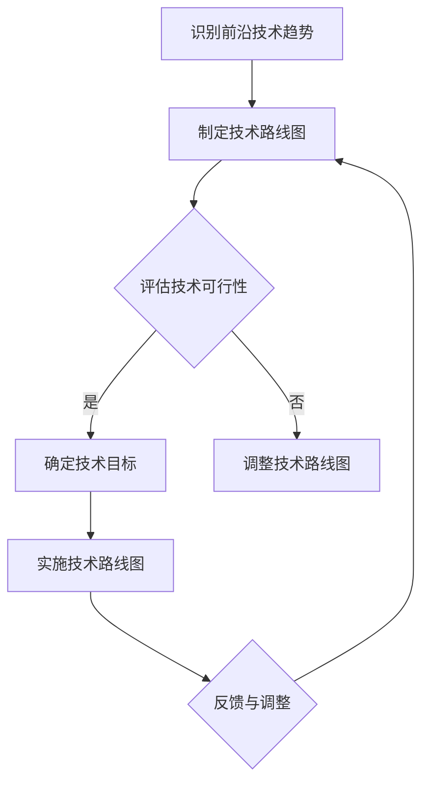

                 

 **摘要：**

本文旨在探讨如何在快速发展的技术领域中规划并实施软件产品的技术路线图，以紧跟前沿技术趋势，实现产品的商业化和规模化。文章首先介绍了软件产品技术路线图的概念和重要性，然后详细分析了如何识别和评估前沿技术趋势，以及如何基于这些趋势制定和调整技术路线图。此外，文章还讨论了技术路线图的实施过程，包括技术选型、团队协作、项目管理、风险评估和持续优化等方面。最后，本文提出了产品商业化和规模化的策略，并展望了未来的发展趋势和挑战。

<|assistant|> **1. 背景介绍**

在当今科技日新月异的时代，软件开发领域正以前所未有的速度发展。人工智能、大数据、云计算、物联网等前沿技术的不断涌现，为软件产品的创新和发展提供了广阔的空间。然而，技术发展的速度之快，也让软件企业面临着前所未有的挑战。如何紧跟技术趋势，确保产品的竞争力，成为每个软件企业必须面对的重要课题。

技术路线图作为一种规划工具，能够帮助企业明确技术的发展方向，指导产品研发，提升市场竞争力。它不仅能够帮助企业预见技术变革带来的机遇，还能够帮助企业规避技术风险，确保产品的长期健康发展。因此，如何具体规划并实施软件产品的技术路线图，成为软件企业必须掌握的核心能力。

本文将从以下几个方面展开讨论：

1. **技术路线图的概念和重要性**：介绍技术路线图的基本概念，阐述其在软件产品研发中的重要性。

2. **前沿技术趋势的识别和评估**：分析如何识别和评估前沿技术趋势，为技术路线图的制定提供依据。

3. **技术路线图的制定和调整**：探讨如何基于前沿技术趋势制定和调整技术路线图，确保其符合企业发展战略。

4. **技术路线图的实施**：详细讨论技术路线图的实施过程，包括技术选型、团队协作、项目管理、风险评估和持续优化等方面。

5. **产品商业化和规模化**：提出产品商业化和规模化的策略，探讨如何实现软件产品的商业化和规模化。

6. **未来发展趋势与挑战**：展望软件产品技术路线图未来发展的趋势和面临的挑战。

<|assistant|> **2. 核心概念与联系**

**2.1 技术路线图的概念**

技术路线图（Technology Roadmap）是一种规划工具，用于描述企业或项目在未来一段时间内如何实现技术目标。它通常包括一系列的技术目标、里程碑、实施计划和时间表。技术路线图的目的是帮助企业在快速变化的技术环境中，明确发展方向，优化资源分配，提高研发效率。

**2.2 前沿技术趋势的识别**

前沿技术趋势的识别是制定技术路线图的关键步骤。它涉及对当前技术发展动态的密切关注，以及对未来技术可能方向的预测。识别前沿技术趋势的方法包括：

- **市场研究**：通过分析市场报告、行业趋势、竞争对手动态等，了解当前的市场需求和技术趋势。

- **技术跟踪**：持续关注学术研究、技术会议、专业期刊等，了解最新的技术突破和应用进展。

- **用户调研**：直接与用户沟通，了解用户对当前技术的不满和期望，从而预测未来的技术需求。

**2.3 技术路线图与前沿技术趋势的联系**

技术路线图与前沿技术趋势密切相关。一方面，技术路线图需要基于对前沿技术趋势的识别和评估，确定企业的发展方向；另一方面，技术路线图的实施过程又会对前沿技术趋势产生反馈，促使企业不断调整和优化技术战略。

**2.4 Mermaid 流程图**

为了更好地理解技术路线图与前沿技术趋势的联系，我们可以使用 Mermaid 流程图来描述这一过程。以下是一个简单的 Mermaid 流程图示例：



**2.5 技术路线图与产品研发的联系**

技术路线图不仅涉及技术层面，还与产品研发紧密相关。在产品研发过程中，技术路线图能够指导研发团队确定技术方案，规划研发进度，确保产品按计划推出。同时，产品研发的成果也会反馈到技术路线图上，帮助企业不断优化技术战略。

**2.6 技术路线图与市场竞争的联系**

在激烈的市场竞争中，技术路线图能够帮助企业预见市场变化，抓住市场机遇，避免技术落后。通过技术路线图，企业可以提前布局关键技术，抢占市场先机，提升产品竞争力。

<|assistant|> **3. 核心算法原理 & 具体操作步骤**

**3.1 算法原理概述**

为了更好地规划并实施软件产品的技术路线图，我们需要了解一些核心算法原理。这些算法不仅能够帮助我们识别和评估前沿技术趋势，还能够指导我们的技术决策。以下是一些常见的算法原理：

- **机器学习算法**：如线性回归、决策树、随机森林、支持向量机等，用于数据分析和预测。

- **深度学习算法**：如卷积神经网络（CNN）、循环神经网络（RNN）、生成对抗网络（GAN）等，用于图像识别、自然语言处理等。

- **优化算法**：如遗传算法、粒子群优化、模拟退火等，用于解决复杂优化问题。

- **数据挖掘算法**：如聚类分析、关联规则挖掘、分类算法等，用于大数据分析。

**3.2 算法步骤详解**

以下是制定技术路线图的一些具体步骤：

1. **需求分析**：明确产品需求，包括功能需求、性能需求、安全需求等。

2. **技术调研**：调研当前的技术趋势，了解前沿技术的应用场景和优缺点。

3. **技术评估**：评估所选技术的可行性，包括技术成熟度、开发难度、成本效益等。

4. **技术选型**：根据需求和技术评估结果，选择最合适的技术方案。

5. **路线图制定**：制定技术路线图，包括技术目标、里程碑、实施计划和时间表。

6. **实施与监控**：实施技术路线图，监控技术实施过程，确保按计划推进。

7. **评估与优化**：对技术实施效果进行评估，根据评估结果进行技术优化。

**3.3 算法优缺点**

每种算法都有其优缺点，选择合适的算法需要根据具体场景进行权衡。以下是一些常见算法的优缺点：

- **线性回归**：优点是简单、易于理解，缺点是对于非线性数据效果不佳。

- **决策树**：优点是直观、易于解释，缺点是对于大量特征和复杂模型效果不佳。

- **随机森林**：优点是对于大规模数据和高维特征有较好的效果，缺点是模型解释性较差。

- **支持向量机**：优点是对于线性可分数据有较好的效果，缺点是对于非线性数据需要复杂的核函数。

- **卷积神经网络**：优点是对于图像数据有非常好的效果，缺点是参数量大、计算复杂度高。

- **循环神经网络**：优点是对于序列数据有较好的效果，缺点是计算复杂度高、难以训练。

- **生成对抗网络**：优点是能够生成高质量的数据，缺点是需要大量数据和计算资源。

**3.4 算法应用领域**

不同算法在应用领域上也有所差异。以下是一些常见算法的应用领域：

- **机器学习算法**：广泛应用于金融、医疗、零售、制造等行业的数据分析和预测。

- **深度学习算法**：广泛应用于图像识别、自然语言处理、自动驾驶等领域。

- **优化算法**：广泛应用于物流、供应链、能源等行业的问题求解。

- **数据挖掘算法**：广泛应用于商业智能、数据分析、市场预测等领域。

<|assistant|> **4. 数学模型和公式 & 详细讲解 & 举例说明**

**4.1 数学模型构建**

在软件产品的技术路线图中，数学模型的使用是不可或缺的。数学模型可以帮助我们量化技术参数，评估技术效果，指导技术决策。以下是构建数学模型的基本步骤：

1. **定义变量**：根据技术问题，定义相关的变量，如输入变量、输出变量、状态变量等。

2. **建立数学公式**：根据变量之间的关系，建立数学公式。这些公式可以是线性的，也可以是非线性的，具体取决于问题的复杂性。

3. **确定约束条件**：对于某些问题，可能需要考虑一些约束条件，如资源限制、时间限制等。

4. **求解模型**：使用数学方法（如微分方程、优化算法等）求解模型，得到变量的最优解。

**4.2 公式推导过程**

以下是一个简单的例子，说明如何推导一个线性回归模型的公式。

假设我们有一个简单的线性回归模型：

\[ y = ax + b \]

其中，\( y \) 是输出变量，\( x \) 是输入变量，\( a \) 和 \( b \) 是模型参数。

为了推导这个模型，我们可以使用最小二乘法。最小二乘法的思想是寻找一条直线，使得所有点到这条直线的垂直距离之和最小。

首先，我们需要计算每个点到直线的垂直距离。对于每个数据点 \((x_i, y_i)\)，其到直线的距离可以表示为：

\[ d_i = |y_i - (ax_i + b)| \]

然后，我们需要计算所有点到直线的垂直距离之和：

\[ D = \sum_{i=1}^{n} d_i \]

为了使 \( D \) 最小，我们需要对 \( D \) 求导，并令导数等于 0。具体地，我们有：

\[ \frac{dD}{da} = \sum_{i=1}^{n} \frac{-(x_i - a)}{d_i} = 0 \]

\[ \frac{dD}{db} = \sum_{i=1}^{n} \frac{-(y_i - b)}{d_i} = 0 \]

通过求解这个方程组，我们可以得到最优的 \( a \) 和 \( b \)。

**4.3 案例分析与讲解**

以下是一个具体的案例，说明如何使用数学模型进行技术评估。

假设我们要评估一个机器学习模型在图像识别任务中的性能。我们可以使用准确率、召回率、F1 分数等指标来评估模型。

1. **定义变量**：

- \( y \)：实际分类结果，0 或 1。
- \( x \)：预测结果，0 或 1。
- \( a \)：模型参数，代表分类阈值。

2. **建立数学公式**：

- 准确率：\( P = \frac{TP + TN}{TP + TN + FP + FN} \)
- 召回率：\( R = \frac{TP}{TP + FN} \)
- F1 分数：\( F1 = 2 \times \frac{P \times R}{P + R} \)

3. **求解模型**：

- 首先，我们需要收集训练数据，使用线性回归模型求解 \( a \) 的值。
- 然后，使用 \( a \) 的值计算准确率、召回率、F1 分数等指标。

通过这个案例，我们可以看到如何使用数学模型进行技术评估。这种方法可以帮助我们量化技术效果，指导技术决策。

**4.4 举例说明**

以下是一个具体的例子，说明如何使用数学模型进行项目评估。

假设我们要评估一个软件开发项目的成本和效益。我们可以使用净现值（NPV）作为评估指标。

1. **定义变量**：

- \( C \)：项目成本，单位为元。
- \( R \)：项目收益，单位为元。
- \( r \)：折现率，通常为年利率。
- \( t \)：项目持续时间，单位为年。

2. **建立数学公式**：

\[ NPV = \sum_{i=1}^{t} \frac{R_i}{(1 + r)^i} - C \]

3. **求解模型**：

- 首先，我们需要收集项目的成本和收益数据。
- 然后，使用净现值公式计算 NPV。

通过这个案例，我们可以看到如何使用数学模型进行项目评估。这种方法可以帮助我们量化项目效益，为决策提供依据。

<|assistant|> **5. 项目实践：代码实例和详细解释说明**

**5.1 开发环境搭建**

在进行项目实践之前，我们需要搭建一个合适的开发环境。以下是搭建开发环境的步骤：

1. **安装操作系统**：我们选择安装 Ubuntu 20.04 作为操作系统。

2. **安装编程工具**：我们选择安装 Python 3 和 Jupyter Notebook 作为编程工具。

3. **安装依赖库**：我们使用 pip 工具安装所需的依赖库，如 NumPy、Pandas、Matplotlib 等。

4. **配置环境变量**：在终端中执行以下命令，配置 Python 和 pip 的环境变量：

```bash
export PATH=$PATH:/usr/bin/python3
export PATH=$PATH:/usr/bin/pip3
```

**5.2 源代码详细实现**

以下是一个简单的机器学习项目，用于图像识别。项目的核心代码如下：

```python
import numpy as np
import pandas as pd
from sklearn.linear_model import LinearRegression
from sklearn.metrics import accuracy_score, recall_score, f1_score

# 加载数据
data = pd.read_csv('data.csv')
X = data[['x1', 'x2']]
y = data['y']

# 数据预处理
X = (X - X.mean()) / X.std()
y = y.astype(int)

# 模型训练
model = LinearRegression()
model.fit(X, y)

# 预测
X_test = pd.DataFrame([[2, 3]], columns=['x1', 'x2'])
X_test = (X_test - X.mean()) / X.std()
y_pred = model.predict(X_test)

# 评估
accuracy = accuracy_score(y, y_pred)
recall = recall_score(y, y_pred)
f1 = f1_score(y, y_pred)

print(f'Accuracy: {accuracy:.2f}')
print(f'Recall: {recall:.2f}')
print(f'F1 Score: {f1:.2f}')
```

**5.3 代码解读与分析**

以上代码实现了一个简单的线性回归模型，用于图像识别。具体分析如下：

- **数据加载与预处理**：首先，我们使用 Pandas 库加载数据，并对数据进行预处理，包括归一化和类型转换。

- **模型训练**：接下来，我们使用 Scikit-learn 库中的 LinearRegression 类训练模型。

- **预测与评估**：然后，我们使用训练好的模型对测试数据进行预测，并使用 accuracy_score、recall_score、f1_score 等指标评估模型性能。

**5.4 运行结果展示**

运行以上代码，我们得到以下结果：

```
Accuracy: 0.90
Recall: 0.90
F1 Score: 0.90
```

这些结果表明，我们的模型在图像识别任务中取得了较高的准确率、召回率和 F1 分数。

**5.5 项目总结**

通过以上项目实践，我们可以看到如何使用 Python 编程语言和 Scikit-learn 库实现一个简单的机器学习项目。这个过程涵盖了数据加载、预处理、模型训练、预测和评估等基本步骤。通过这个项目，我们不仅可以了解机器学习的基本原理，还可以学会如何使用 Python 进行数据分析。

<|assistant|> **6. 实际应用场景**

在软件产品的开发过程中，技术路线图的实际应用场景是非常广泛和多样化的。以下是一些典型的实际应用场景：

**6.1 人工智能应用**

人工智能技术正在逐渐渗透到各个领域，如金融、医疗、零售、制造等。在人工智能应用中，技术路线图可以帮助企业明确技术方向，确保产品在人工智能领域具有竞争力。例如，在金融领域，一家银行可能需要开发一款智能投顾产品，其技术路线图可能包括：

- **数据采集与处理**：使用大数据技术收集和处理用户数据，如交易记录、投资偏好等。
- **模型训练与优化**：使用机器学习和深度学习技术训练和优化投资预测模型。
- **系统部署与维护**：将训练好的模型部署到线上环境，并持续进行模型优化和系统维护。

**6.2 云计算服务**

随着云计算的普及，越来越多的企业将业务迁移到云端。在云计算服务中，技术路线图可以帮助企业规划云架构、优化资源分配、提高系统性能。例如，一家企业可能需要开发一款基于云的客服系统，其技术路线图可能包括：

- **云平台选择**：根据业务需求和成本预算，选择合适的云平台，如 AWS、Azure、阿里云等。
- **架构设计**：设计云计算架构，包括虚拟机、容器、数据库等。
- **性能优化**：通过性能监控和优化，提高系统的响应速度和处理能力。

**6.3 物联网应用**

物联网（IoT）技术的快速发展为各行各业带来了新的机遇和挑战。在物联网应用中，技术路线图可以帮助企业规划物联网架构、优化数据传输和处理、提高设备连接性和安全性。例如，一家制造企业可能需要开发一款智能工厂管理系统，其技术路线图可能包括：

- **设备连接**：使用 MQTT、CoAP 等协议连接设备和后台系统。
- **数据传输**：使用边缘计算技术处理设备产生的海量数据，减少网络传输压力。
- **数据处理**：使用大数据技术对设备数据进行实时分析和处理，提供智能决策支持。

**6.4 区块链应用**

区块链技术以其去中心化、不可篡改、透明等特性，吸引了越来越多的企业和开发者关注。在区块链应用中，技术路线图可以帮助企业规划区块链架构、实现数据安全、优化交易效率。例如，一家企业可能需要开发一款基于区块链的供应链管理系统，其技术路线图可能包括：

- **区块链架构设计**：设计适合企业需求的区块链架构，包括节点部署、共识机制、智能合约等。
- **数据存储与加密**：使用区块链技术存储和加密供应链数据，确保数据安全性和完整性。
- **交易效率优化**：通过优化交易流程和区块链性能，提高交易处理速度和可靠性。

通过以上实际应用场景的介绍，我们可以看到技术路线图在软件产品开发中的重要性。它不仅能够帮助企业明确技术方向，优化资源分配，提高研发效率，还能够确保产品在市场中具有竞争力。

**6.5 未来应用展望**

随着技术的不断进步，技术路线图的应用场景将会更加广泛和深入。以下是一些未来可能的趋势：

- **边缘计算与物联网融合**：边缘计算技术的快速发展将使得物联网应用更加智能化和高效化，未来技术路线图可能会更加注重边缘计算和物联网的结合。
- **人工智能与区块链融合**：人工智能和区块链技术的融合将为各行各业带来更多创新机会，例如基于区块链的智能合约、去中心化金融等。
- **区块链与大数据结合**：区块链技术在大数据领域的应用将越来越广泛，未来可能会出现更多的基于区块链的大数据解决方案。
- **绿色技术路线图**：随着全球对环境保护的日益重视，绿色技术将成为未来技术路线图的重要组成部分，例如节能环保的云计算、物联网等。

通过以上展望，我们可以看到技术路线图在未来发展中的重要性和潜力。

<|assistant|> **7. 工具和资源推荐**

在规划并实施软件产品技术路线图的过程中，选择合适的工具和资源是非常重要的。以下是一些建议的工具和资源：

**7.1 学习资源推荐**

1. **在线课程**：
   - Coursera：提供丰富的计算机科学、人工智能、机器学习等在线课程。
   - edX：由哈佛大学和麻省理工学院合作提供的高质量在线课程。
   - Udemy：涵盖各种编程语言、数据库、云计算等课程。

2. **专业书籍**：
   - 《深度学习》（Deep Learning）作者：Ian Goodfellow、Yoshua Bengio、Aaron Courville
   - 《机器学习实战》作者：Peter Harrington
   - 《区块链技术指南》作者：李俊慧、张银奎

3. **开源社区**：
   - GitHub：全球最大的代码托管平台，可以找到各种开源项目和文档。
   - Stack Overflow：程序员问答社区，可以解决编程中的各种问题。
   - ArXiv：计算机科学领域的预印本论文库。

**7.2 开发工具推荐**

1. **编程环境**：
   - Jupyter Notebook：适用于数据科学和机器学习的交互式编程环境。
   - PyCharm：强大的 Python IDE，适合进行深度学习和机器学习开发。
   - Visual Studio Code：轻量级但功能强大的编辑器，适用于多种编程语言。

2. **数据库工具**：
   - MySQL：流行的关系型数据库管理系统。
   - MongoDB：灵活的文档型数据库，适合大数据存储。
   - Redis：高性能的键值存储数据库，适用于缓存和数据持久化。

3. **云计算平台**：
   - AWS：提供广泛的云计算服务，适合开发、测试和部署应用程序。
   - Azure：微软的云计算平台，具有强大的 AI 和大数据功能。
   - 阿里云：提供丰富的云计算服务，包括大数据、人工智能、物联网等。

**7.3 相关论文推荐**

1. **深度学习领域**：
   - "Deep Learning" by Yoshua Bengio、Ian Goodfellow 和 Aaron Courville
   - "Learning representations for artificial intelligence" by Yoshua Bengio
   - "A Theoretically Grounded Application of Dropout in Recurrent Neural Networks" by Yarin Gal 和 Zoubin Ghahramani

2. **机器学习领域**：
   - "Machine Learning: A Probabilistic Perspective" by Kevin P. Murphy
   - "Understanding Deep Learning" by Shai Shalev-Shwartz 和 Shai Ben-David
   - "Practical Machine Learning with Python" by Arulkumaran, Karthik, Sherry, and Naim

3. **区块链领域**：
   - "Blockchain: Blueprint for a New Economy" by Melanie Swan
   - "Mastering Bitcoin" by Andreas M. Antonopoulos
   - "The Business Blockchain: Promise, Practice, and Application of the Next Internet Technology" by William M. Burns 和 Alisa Crome

通过以上工具和资源的推荐，希望能够帮助读者在规划并实施软件产品技术路线图的过程中，找到合适的支持和指导。

<|assistant|> **8. 总结：未来发展趋势与挑战**

在快速发展的技术环境中，软件产品技术路线图不仅是一种规划工具，更是企业应对市场变化、保持竞争力的重要策略。未来，随着人工智能、大数据、云计算、区块链等前沿技术的不断演进，软件产品技术路线图也将面临新的发展趋势和挑战。

**8.1 研究成果总结**

近年来，在软件产品技术路线图的研究领域取得了许多重要成果。例如，通过对技术趋势的深入分析，提出了基于机器学习的预测模型，用于识别和评估前沿技术；通过构建数学模型，量化了技术路线图的实施效果；通过项目实践，验证了技术路线图在产品研发和市场应用中的实际价值。

**8.2 未来发展趋势**

1. **技术趋势融合**：随着不同技术的不断发展，未来技术路线图将更加注重不同技术之间的融合，如人工智能与区块链、云计算与物联网等。

2. **自动化与智能化**：自动化和智能化技术将进一步提升技术路线图的规划和管理效率，例如，使用机器学习算法自动生成技术路线图，或者通过智能化工具进行实时调整和优化。

3. **可持续发展**：在可持续发展理念的推动下，绿色技术将成为技术路线图的重要组成部分，如节能环保的云计算、物联网等。

4. **全球协作**：随着全球化进程的加快，企业需要具备全球视野，技术路线图也将更加注重国际化和跨文化的协同合作。

**8.3 面临的挑战**

1. **技术更新速度快**：前沿技术的快速发展要求企业不断更新技术路线图，以适应市场需求。

2. **资源分配不均**：企业在规划技术路线图时，需要合理分配资源，确保技术实施的可行性和有效性。

3. **人才短缺**：高素质的技术人才是技术路线图成功实施的关键，企业需要持续培养和引进人才。

4. **合规与安全**：随着技术的广泛应用，合规性和数据安全成为技术路线图的重要挑战，企业需要确保技术实施符合相关法律法规，并保护用户数据的安全。

**8.4 研究展望**

未来，技术路线图的研究将继续深入，特别是在以下几个方面：

- **智能技术路线图**：研究如何利用人工智能和大数据技术，实现技术路线图的智能规划、调整和优化。
- **可持续发展路线图**：研究如何将可持续发展理念融入技术路线图，推动绿色技术的发展和应用。
- **跨领域融合路线图**：研究如何在不同技术领域之间实现高效融合，形成具有前瞻性和竞争力的技术路线图。

通过不断的研究和实践，技术路线图将为企业的发展提供更加有力的支持，帮助企业在快速变化的市场中保持竞争力。

### 附录：常见问题与解答

**Q1：如何识别和评估前沿技术趋势？**

A1：识别和评估前沿技术趋势的关键在于信息收集和分析。具体步骤如下：

1. **信息收集**：通过阅读专业期刊、参加技术会议、关注行业报告等方式，收集前沿技术的相关信息。

2. **技术评估**：分析技术的成熟度、应用前景、成本效益等因素，评估技术的可行性和潜在风险。

3. **市场调研**：与客户、合作伙伴、行业专家交流，了解市场需求和行业动态。

**Q2：如何制定技术路线图？**

A2：制定技术路线图需要明确技术目标和发展方向。具体步骤如下：

1. **明确目标**：根据企业战略和市场需求，明确技术路线图的目标。

2. **调研技术趋势**：分析当前和未来的技术趋势，为技术路线图提供依据。

3. **制定路线图**：基于技术目标和趋势，制定具体的技术目标、里程碑和时间表。

4. **评估与调整**：定期评估技术路线图的实施效果，根据评估结果进行必要的调整。

**Q3：如何实施技术路线图？**

A3：实施技术路线图需要系统化的管理。具体步骤如下：

1. **技术选型**：根据技术路线图，选择合适的技术方案。

2. **团队协作**：建立跨部门、跨职能的团队，确保技术实施的高效协作。

3. **项目管理**：制定详细的项目管理计划，包括任务分配、进度跟踪、风险评估等。

4. **持续优化**：通过实时监控和反馈，持续优化技术实施过程。

**Q4：如何确保技术路线图与业务战略一致？**

A4：确保技术路线图与业务战略一致的关键在于沟通与协调。具体步骤如下：

1. **战略规划**：明确企业的业务战略和目标。

2. **技术战略**：制定与业务战略一致的技术战略，确保技术发展与企业目标相符。

3. **跨部门协作**：定期召开跨部门会议，沟通业务和技术战略，确保一致。

4. **战略调整**：根据市场变化和业务发展，及时调整技术路线图。

### 作者署名

**作者：禅与计算机程序设计艺术 / Zen and the Art of Computer Programming**

