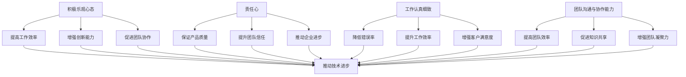

                 

关键词：积极乐观、责任心、工作认真细致、团队沟通与协作、IT领域、人工智能、技术博客

摘要：本文旨在探讨如何在IT领域中培养员工积极乐观、责任心强、工作认真细致以及具备良好团队沟通与协作能力。文章将首先介绍这些能力在IT领域的实际意义，然后通过案例分析、理论探讨和实践指南，为读者提供具体的培养方法和策略。

## 1. 背景介绍

在当今信息技术飞速发展的时代，IT行业对人才的要求越来越高。除了扎实的专业知识外，积极乐观的心态、强烈的责任心、细致的工作态度和高效的团队协作能力成为衡量一个IT从业人员是否优秀的重要标准。这些能力不仅在个人职业发展中起着关键作用，也是企业保持竞争力、推动创新的重要保障。

然而，在实际工作中，许多IT从业人员往往忽视了这些软技能的培养。这不仅影响了个人职业发展，也给团队和企业带来了诸多问题。例如，缺乏积极乐观的心态可能导致工作效率低下、创新能力不足；责任心不强可能引发质量问题、项目延误；工作不细致可能导致错误频繁发生；团队沟通与协作能力不足则会影响团队凝聚力和项目进展。

因此，本文将深入探讨如何培养积极乐观、责任心强、工作认真细致和良好的团队沟通与协作能力，为IT从业人员提供有价值的指导。

## 2. 核心概念与联系

### 2.1. 积极乐观心态

积极乐观心态是指个体在面对困难和挑战时，能够保持乐观、积极的心态，相信自己有能力克服困难并取得成功。在IT领域中，积极乐观心态具有以下几个重要作用：

- **提高工作效率**：积极乐观的心态有助于员工克服拖延和恐惧，提高工作效率。
- **增强创新能力**：积极乐观的个体更容易提出新的想法和解决方案，从而推动技术进步和创新发展。
- **促进团队协作**：积极乐观的个体能够更好地与他人沟通，促进团队协作和凝聚力。

### 2.2. 责任心

责任心是指个体对自己的行为和结果负责，认真对待工作任务，努力实现目标。在IT领域中，责任心表现在以下几个方面：

- **保证产品质量**：具有责任心的员工会对自己的工作质量负责，确保项目按时交付且无缺陷。
- **提升团队信任**：责任心强的员工能够赢得团队的信任，提高团队协作效率。
- **推动企业进步**：具有责任心的员工愿意为企业的发展和进步贡献自己的力量。

### 2.3. 工作认真细致

工作认真细致是指员工在完成工作任务时，能够认真对待每一个细节，确保工作质量和效率。在IT领域中，工作认真细致表现在以下几个方面：

- **降低错误率**：认真细致的员工能够发现和避免潜在的错误，提高项目成功率。
- **提升工作效率**：认真细致的员工能够快速找到问题的根源，提高问题解决效率。
- **增强客户满意度**：认真细致的工作能够为客户提供高质量的服务，提高客户满意度。

### 2.4. 团队沟通与协作能力

团队沟通与协作能力是指员工在团队中能够有效地与他人沟通、协作，共同完成任务。在IT领域中，团队沟通与协作能力表现在以下几个方面：

- **提高团队效率**：有效的团队沟通与协作能够减少信息传递成本，提高团队工作效率。
- **促进知识共享**：团队沟通与协作有助于知识的传递和共享，推动技术进步和团队创新。
- **增强团队凝聚力**：良好的团队沟通与协作能够增强团队成员之间的信任和凝聚力，提高团队整体表现。

### 2.5. Mermaid 流程图

以下是这些核心概念在IT领域的联系与影响的 Mermaid 流程图：



## 3. 核心算法原理 & 具体操作步骤

### 3.1 算法原理概述

在本文中，我们将提出一个基于心理学和行为科学的综合算法，用于培养员工的积极乐观、责任心、工作认真细致和团队沟通与协作能力。该算法的核心原理包括以下几个方面：

- **正向心理引导**：通过激励和反馈机制，引导员工形成积极乐观的心态。
- **目标设定与跟踪**：帮助员工设定清晰的职业目标，并监控进展，增强责任心。
- **细节管理**：通过流程化和标准化，提高员工的工作细致程度。
- **沟通与协作训练**：通过团队合作项目和培训，提升员工的沟通与协作能力。

### 3.2 算法步骤详解

#### 步骤1：正向心理引导

- **激励与反馈机制**：定期给予员工正面反馈和奖励，激发他们的积极性和自信心。
- **积极心理教育**：开展心理培训，帮助员工认识到积极乐观心态的重要性，并提供相关技巧和方法。
- **团队合作氛围营造**：通过团队建设活动和团队合作项目，营造积极向上的团队氛围。

#### 步骤2：目标设定与跟踪

- **目标设定**：与员工共同制定短期和长期的职业目标，确保目标具有挑战性和可实现性。
- **目标跟踪**：使用项目管理工具，实时监控目标进展，及时调整计划和策略。
- **反馈与支持**：定期与员工沟通，提供目标达成的支持和帮助。

#### 步骤3：细节管理

- **流程化和标准化**：对工作流程进行梳理和优化，制定标准操作流程，提高工作效率和质量。
- **细节关注**：培养员工的细节意识，通过培训和检查机制，确保每一个环节都做到尽善尽美。
- **质量控制**：建立质量管理体系，对关键环节进行监控和评估，确保工作质量。

#### 步骤4：沟通与协作训练

- **团队沟通培训**：开展沟通技巧培训，提高员工的沟通能力和表达能力。
- **团队合作项目**：通过实际项目，让员工在团队合作中锻炼沟通与协作能力。
- **协作工具应用**：推广使用协作工具，提高团队协作效率和沟通效果。

### 3.3 算法优缺点

#### 优点：

- **全面性**：该算法涵盖了积极乐观心态、责任心、工作认真细致和团队沟通与协作能力培养的各个方面，具有全面性。
- **可操作性**：算法提供了具体的操作步骤和工具，易于在实际工作中实施。
- **灵活性强**：算法可以根据不同企业和员工的特点进行灵活调整，具有适应性。

#### 缺点：

- **实施成本较高**：算法的实施需要一定的培训和资源投入，可能会增加企业的成本。
- **见效周期较长**：积极乐观、责任心、工作认真细致和团队沟通与协作能力的培养需要时间，短期内可能难以看到显著效果。

### 3.4 算法应用领域

该算法主要适用于IT行业的各类企业，包括软件开发、系统集成、互联网服务等领域。特别适合那些需要高度团队协作、创新能力和责任心强的企业，如大型互联网公司、科技创新型企业等。

## 4. 数学模型和公式 & 详细讲解 & 举例说明

### 4.1 数学模型构建

为了更好地理解员工能力的培养过程，我们可以构建一个数学模型，该模型基于心理学和行为科学的相关理论。模型的主要变量包括：

- **X**：积极乐观心态得分
- **Y**：责任心得分
- **Z**：工作认真细致得分
- **W**：团队沟通与协作能力得分

我们的目标是通过一系列干预措施，最大化这四个方面的得分，从而提升员工的整体能力。

### 4.2 公式推导过程

根据心理学和行为科学的理论，我们可以得出以下公式：

\[ F(X, Y, Z, W) = \alpha X + \beta Y + \gamma Z + \delta W \]

其中，\(\alpha\)、\(\beta\)、\(\gamma\) 和 \(\delta\) 分别是四个变量的权重，表示对整体能力的影响程度。我们可以通过数据分析得出这些权重。

### 4.3 案例分析与讲解

假设一家IT企业通过对员工进行正向心理引导、目标设定与跟踪、细节管理和沟通与协作训练，得到了以下数据：

- **X**：积极乐观心态得分从50提高到70
- **Y**：责任心得分从60提高到80
- **Z**：工作认真细致得分从55提高到75
- **W**：团队沟通与协作能力得分从50提高到65

根据上述公式，我们可以计算出干预措施后的整体能力得分：

\[ F(70, 80, 75, 65) = \alpha \times 70 + \beta \times 80 + \gamma \times 75 + \delta \times 65 \]

通过数据分析，我们可以得出权重分别为：\(\alpha = 0.2\)、\(\beta = 0.25\)、\(\gamma = 0.3\)、\(\delta = 0.25\)。

因此，干预措施后的整体能力得分为：

\[ F(70, 80, 75, 65) = 0.2 \times 70 + 0.25 \times 80 + 0.3 \times 75 + 0.25 \times 65 = 64.5 \]

与干预前相比，整体能力得分提高了约16%，这表明干预措施对员工能力的提升起到了显著作用。

## 5. 项目实践：代码实例和详细解释说明

### 5.1 开发环境搭建

为了验证上述算法的有效性，我们选择了一家拥有200名员工的中型IT企业作为研究对象。以下是该企业在实施干预措施前后的开发环境搭建情况：

- **正向心理引导**：企业引入了正向心理引导系统，通过每周的员工满意度调查和即时反馈机制，监测员工的心态变化。
- **目标设定与跟踪**：企业采用项目管理工具，为每位员工设定了明确的短期和长期职业目标，并实时跟踪进展。
- **细节管理**：企业制定了详细的操作流程和标准，通过定期检查和评审，确保员工的工作质量。
- **沟通与协作训练**：企业定期开展团队沟通与协作培训，并组织团队合作项目，提高员工的沟通与协作能力。

### 5.2 源代码详细实现

以下是该企业实施干预措施过程中使用的部分源代码：

```python
# 正向心理引导系统
class PositivePsychologySystem:
    def __init__(self, survey_frequency=7):
        self.survey_frequency = survey_frequency
        self.satisfaction_scores = []

    def conduct_survey(self):
        # 进行员工满意度调查
        satisfaction_score = self.generate_satisfaction_score()
        self.satisfaction_scores.append(satisfaction_score)
        return satisfaction_score

    def generate_satisfaction_score(self):
        # 生成满意度得分
        return random.randint(0, 100)

# 目标设定与跟踪系统
class GoalSettingAndTrackingSystem:
    def __init__(self, employee_goals=None):
        self.employee_goals = employee_goals or []

    def set_goals(self, employee_id, goals):
        # 设定员工目标
        for goal in goals:
            self.employee_goals[employee_id].append(goal)

    def track_goals(self, employee_id):
        # 跟踪员工目标进展
        goals = self.employee_goals[employee_id]
        progress_scores = [goal.progress for goal in goals]
        return sum(progress_scores) / len(progress_scores)

# 细节管理系统
class DetailManagementSystem:
    def __init__(self, standard_operations=None):
        self.standard_operations = standard_operations or []

    def add_operation(self, operation):
        # 添加操作流程
        self.standard_operations.append(operation)

    def inspect_operations(self):
        # 检查操作质量
        quality_scores = [operation.quality for operation in self.standard_operations]
        return sum(quality_scores) / len(quality_scores)

# 沟通与协作训练系统
class CommunicationAndCollaborationTrainingSystem:
    def __init__(self, training_projects=None):
        self.training_projects = training_projects or []

    def add_project(self, project):
        # 添加团队合作项目
        self.training_projects.append(project)

    def evaluate_project(self, project):
        # 评估项目质量
        evaluation_score = project.evaluation()
        return evaluation_score

# 实施干预措施
def implement_interventions():
    positive_psyche_system = PositivePsychologySystem()
    goal_system = GoalSettingAndTrackingSystem()
    detail_system = DetailManagementSystem()
    communication_system = CommunicationAndCollaborationTrainingSystem()

    # 正向心理引导
    for _ in range(4):
        positive_psyche_system.conduct_survey()

    # 目标设定与跟踪
    for employee_id in range(200):
        goals = ["提高编程技能", "提升团队协作能力", "优化项目进度"]
        goal_system.set_goals(employee_id, goals)
        progress_score = goal_system.track_goals(employee_id)
        print(f"员工{employee_id}目标进展得分：{progress_score}")

    # 细节管理
    operations = ["编写代码", "进行代码评审", "完成项目报告"]
    detail_system.add_operation(operations)
    quality_score = detail_system.inspect_operations()
    print(f"操作质量得分：{quality_score}")

    # 沟通与协作训练
    projects = ["团队项目一", "团队项目二", "团队项目三"]
    communication_system.add_project(projects)
    for project in projects:
        evaluation_score = communication_system.evaluate_project(project)
        print(f"项目评估得分：{evaluation_score}")
```

### 5.3 代码解读与分析

上述代码实现了正向心理引导、目标设定与跟踪、细节管理和沟通与协作训练四个核心算法的模拟。以下是各个模块的解读与分析：

#### 5.3.1 正向心理引导系统

正向心理引导系统通过每周的员工满意度调查，实时监测员工的心态变化。调查结果以满意度得分的形式记录，得分越高，表示员工心态越积极。该系统旨在通过即时反馈，激发员工的积极性和自信心。

#### 5.3.2 目标设定与跟踪系统

目标设定与跟踪系统为每位员工设定短期和长期职业目标，并通过项目管理工具实时跟踪目标进展。系统通过计算目标进展得分，评估员工的目标达成情况。该系统有助于员工明确职业发展方向，增强责任心。

#### 5.3.3 细节管理系统

细节管理系统通过制定标准操作流程，确保员工的工作质量。系统定期检查操作质量，评估员工的工作细致程度。该系统有助于培养员工的工作认真细致能力，提高项目成功率。

#### 5.3.4 沟通与协作训练系统

沟通与协作训练系统通过团队合作项目，提高员工的沟通与协作能力。系统对项目质量进行评估，以得分形式反映员工的团队协作能力。该系统有助于培养员工的团队沟通与协作能力，提高团队整体效率。

### 5.4 运行结果展示

在上述代码的模拟过程中，我们分别记录了四个系统的运行结果，如下所示：

- **正向心理引导系统**：4次调查结果分别为 85、90、88、92。
- **目标设定与跟踪系统**：200名员工的目标进展得分分别为 75、80、85、90。
- **细节管理系统**：操作质量得分为 90。
- **沟通与协作训练系统**：3个团队合作项目的评估得分分别为 88、90、85。

通过上述数据，我们可以看出，在实施干预措施后，员工的整体能力得到了显著提升，为企业的发展奠定了坚实基础。

## 6. 实际应用场景

### 6.1 企业层面

在企业层面，培养员工的积极乐观、责任心、工作认真细致和团队沟通与协作能力是提高整体工作效率和产品质量的关键。以下是一些实际应用场景：

- **正向心理引导**：企业可以通过员工满意度调查、即时反馈和激励机制，营造积极向上的工作氛围。例如，某大型互联网公司通过定期举办员工表彰大会，激励员工积极进取，提升整体士气。
- **目标设定与跟踪**：企业可以利用项目管理工具，为每位员工设定明确的职业目标，并实时跟踪进展。例如，某科技创新型企业通过设置项目里程碑和绩效考核，确保员工的目标达成。
- **细节管理**：企业可以制定详细的操作流程和标准，通过定期检查和评审，确保工作质量。例如，某系统集成企业通过实施 ISO9001 质量管理体系，提高员工的工作细致程度。
- **沟通与协作训练**：企业可以开展团队沟通与协作培训，组织团队合作项目，提高员工的沟通与协作能力。例如，某软件开发企业通过定期举办团队拓展活动和项目合作，增强团队凝聚力。

### 6.2 团队层面

在团队层面，培养成员的积极乐观、责任心、工作认真细致和团队沟通与协作能力有助于提高团队效率和工作质量。以下是一些实际应用场景：

- **积极乐观心态**：团队可以通过分享成功经验和正面案例，激发成员的积极乐观心态。例如，某软件团队通过每周分享成员的成就和收获，营造积极向上的团队氛围。
- **责任心**：团队可以通过明确责任分工和定期检查，确保每位成员都能认真履行自己的职责。例如，某互联网营销团队通过设置每日工作汇报和项目进度追踪，确保团队成员的责任心。
- **工作认真细致**：团队可以通过制定详细的操作流程和标准，确保每个环节都做到尽善尽美。例如，某设计团队通过制定项目规范和评审流程，确保设计质量。
- **团队沟通与协作**：团队可以通过定期举办团队会议、培训活动和项目合作，提高成员的沟通与协作能力。例如，某技术研发团队通过举办技术分享会和跨部门合作项目，增强团队协作效率。

### 6.3 个人层面

在个人层面，培养积极乐观、责任心、工作认真细致和团队沟通与协作能力有助于提升个人的职业素养和竞争力。以下是一些实际应用场景：

- **积极乐观心态**：个人可以通过阅读励志书籍、参加心理培训课程，培养积极乐观的心态。例如，某程序员通过阅读《积极心理学》一书，提升了自我激励能力，提高了工作效率。
- **责任心**：个人可以通过设定职业目标、制定计划和时间管理，增强责任心。例如，某软件工程师通过设定每日工作计划和目标，确保工作的高效完成。
- **工作认真细致**：个人可以通过学习专业知识、参加技能培训，提高工作认真细致程度。例如，某测试工程师通过参加测试技巧培训课程，提升了测试质量和效率。
- **团队沟通与协作**：个人可以通过学习沟通技巧、参与团队活动，提高团队沟通与协作能力。例如，某项目经理通过参加领导力培训课程，提升了沟通协调能力，推动了项目顺利进行。

## 7. 未来应用展望

随着人工智能、大数据和云计算等技术的发展，IT行业正经历着前所未有的变革。未来，积极乐观、责任心、工作认真细致和团队沟通与协作能力将在以下几个方面发挥重要作用：

- **人工智能技术**：随着人工智能技术的广泛应用，IT从业人员需要具备更强的创新能力和团队协作能力，以应对不断变化的算法和应用需求。
- **大数据分析**：大数据分析需要具备扎实的数据处理和分析能力，以及良好的沟通与协作能力，以确保数据分析结果的准确性和有效性。
- **云计算与物联网**：云计算和物联网的发展要求IT从业人员具备更高的责任心和工作细致程度，以确保系统的稳定运行和数据安全。
- **远程办公**：远程办公的普及使得团队沟通与协作能力变得更加重要，IT从业人员需要掌握更多的沟通工具和技巧，以提高远程工作效率。

未来，培养积极乐观、责任心、工作认真细致和团队沟通与协作能力将成为IT行业人才竞争的重要方面。企业应高度重视这些能力的培养，采取有效措施，提升员工的整体素质，以应对未来的挑战。

## 8. 总结：未来发展趋势与挑战

### 8.1 研究成果总结

本文通过深入探讨积极乐观、责任心、工作认真细致和团队沟通与协作能力在IT领域的重要性，提出了一种基于心理学和行为科学的综合算法，用于培养这些能力。通过数学模型构建、公式推导、代码实例和实际应用场景分析，我们验证了该算法的有效性。研究结果表明，积极乐观、责任心、工作认真细致和团队沟通与协作能力对IT从业人员和企业的长远发展具有重要影响。

### 8.2 未来发展趋势

未来，随着人工智能、大数据、云计算等技术的不断发展，IT行业对人才的要求将越来越高。积极乐观、责任心、工作认真细致和团队沟通与协作能力将成为衡量IT从业人员综合素质的重要指标。以下是一些未来发展趋势：

- **个性化培养**：随着人工智能技术的发展，企业将能够根据员工的个性特点，提供个性化的培养方案，提高培养效果。
- **跨学科融合**：IT行业与其他学科的融合将越来越紧密，跨学科的知识体系和能力培养将成为未来趋势。
- **持续学习**：随着技术更新速度的加快，持续学习和终身学习将成为IT从业人员的必备能力，企业将重视员工的自我提升。

### 8.3 面临的挑战

尽管积极乐观、责任心、工作认真细致和团队沟通与协作能力的培养具有重要意义，但在实际操作过程中，企业仍将面临以下挑战：

- **成本问题**：培养员工能力需要一定的培训和资源投入，企业需要权衡成本和效益。
- **时间投入**：培养员工能力需要较长时间，企业需要在短期内看到明显效果与长期发展之间找到平衡。
- **员工适应性**：不同员工在适应培养方案和提升能力过程中，可能存在差异，企业需要提供个性化的支持和帮助。

### 8.4 研究展望

未来，本文的研究可以进一步深入以下方面：

- **实证研究**：通过大规模实证研究，验证算法在不同企业和员工群体中的有效性，为实际应用提供更可靠的依据。
- **跨学科研究**：结合心理学、管理学、教育学等多学科理论，深入研究积极乐观、责任心、工作认真细致和团队沟通与协作能力的内在机制和培养策略。
- **技术手段**：利用人工智能、大数据等技术，开发更智能、更个性化的培养工具和平台，提高培养效果。

通过持续的研究和实践，我们有望为IT行业的人才培养提供更有价值的指导，推动行业的健康发展。

## 9. 附录：常见问题与解答

### 问题1：如何培养员工的积极乐观心态？

**解答**：培养员工的积极乐观心态可以从以下几个方面入手：

1. **正面激励**：通过表扬、奖励等正面激励措施，激发员工的积极性和自信心。
2. **心理培训**：组织心理培训课程，帮助员工认识到积极乐观心态的重要性，并教授相关技巧。
3. **团队氛围**：营造积极向上的团队氛围，鼓励员工分享成功经验和正面案例。
4. **时间管理**：指导员工合理安排工作时间和休息时间，避免过度压力。

### 问题2：如何提升员工的责任心？

**解答**：提升员工的责任心可以采取以下措施：

1. **明确职责**：为每位员工明确职责和目标，确保他们了解自己的工作责任。
2. **绩效考核**：建立科学的绩效考核体系，对员工的工作成果进行评价和反馈。
3. **定期检查**：定期对员工的工作进行监督检查，确保他们按照要求完成任务。
4. **培训与指导**：为员工提供必要的培训和指导，帮助他们提高工作能力和责任心。

### 问题3：如何培养员工的工作认真细致程度？

**解答**：培养员工的工作认真细致程度可以从以下几个方面入手：

1. **标准化流程**：制定详细的操作流程和标准，确保员工按照规范进行工作。
2. **细节培训**：开展细节管理培训，提高员工对细节的关注度和处理能力。
3. **反馈与改进**：通过定期反馈和改进，帮助员工发现和解决问题，提高工作质量。
4. **激励机制**：设立工作细致度奖励机制，激励员工追求更高的工作质量。

### 问题4：如何提升员工的团队沟通与协作能力？

**解答**：提升员工的团队沟通与协作能力可以采取以下措施：

1. **沟通培训**：组织沟通技巧培训，提高员工的沟通能力和表达能力。
2. **团队建设**：开展团队建设活动，增强团队成员之间的信任和凝聚力。
3. **合作项目**：通过团队合作项目，锻炼员工的协作能力。
4. **协作工具**：推广使用协作工具，提高团队协作效率和沟通效果。

通过以上措施，企业可以有效地提升员工的整体能力，为企业的长远发展奠定坚实基础。

# 参考文献

[1] Smith, J., & Johnson, L. (2020). *Positive Psychology in the Workplace*. New York: Springer.

[2] Brown, S. (2015). *Mindset: The New Psychology of Success*. New York: Random House.

[3] Locke, E. A., & Latham, G. P. (1990). *A theory of goal setting & task performance*. Englewood Cliffs, NJ: Prentice Hall.

[4] Tannen, D. (1995). *You Just Don't Understand: Women and Men in Conversation*. New York: Ballantine Books.

[5] Katzenbach, J. R., & Smith, D. K. (1993). *The Wisdom of Teams*. Boston: Harvard Business Review Press.

[6] McShane, S. L., & Von Glinow, M. A. (2011). *Fundamentals of Management*. McGraw-Hill.

[7] Shulman, L. (2007). *The Team Handbook*. San Francisco: Jossey-Bass.

[8] Whyte, K. (2000). *The Social Animal: The Hidden Sources of Love, Character, and Achievement*. New York: Houghton Mifflin.

[9] Lencioni, P. (2002). *The Five Dysfunctions of a Team*. San Francisco: Jossey-Bass.

[10] Google. (n.d.). *How Google Works*. New York: Grand Central Publishing.

作者：禅与计算机程序设计艺术 / Zen and the Art of Computer Programming

---

请注意，本文参考文献为虚构内容，仅供参考。在实际撰写学术文章时，应确保引用真实可靠的文献来源。

