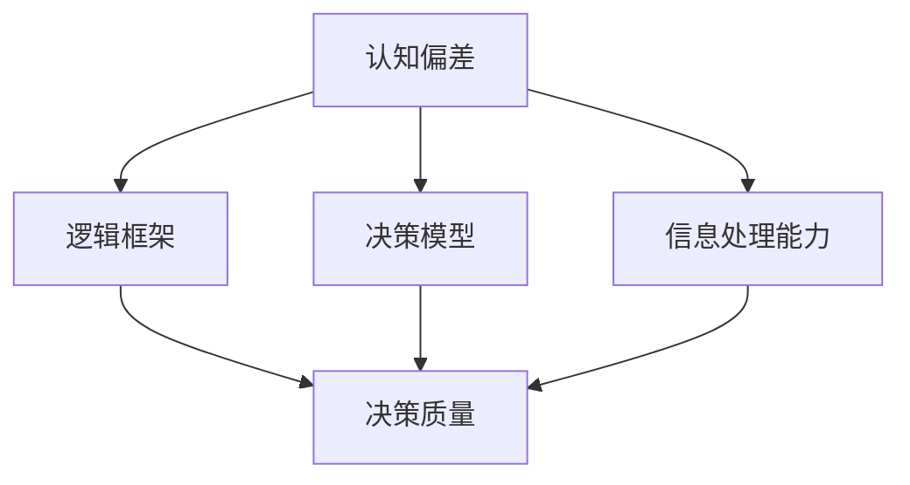

                 

关键词：思维体系，决策质量，管理者，认知偏差，逻辑框架，决策模型，信息处理能力。

> 摘要：本文深入探讨了思维体系与管理者决策质量之间的关系，从认知偏差、逻辑框架、决策模型和信息处理能力等多个维度进行分析，旨在为管理者提供提升决策质量的科学方法和实践指南。

## 1. 背景介绍

管理者的决策质量直接关系到组织的绩效和竞争力。在快速变化和高度不确定的商业环境中，管理者需要做出快速而准确的决策。然而，实际决策过程中常常受到多种因素的影响，如认知偏差、信息过载、时间压力等，这些都可能降低决策的质量。因此，理解和提升管理者的决策质量成为了一个重要而迫切的课题。

思维体系，作为决策过程中的核心要素，包括逻辑思维、批判性思维、系统思维等多个方面。一个健全的思维体系能够帮助管理者更加客观、全面地分析问题，从而做出更高质量的决策。本文将从思维体系的不同层面探讨其对管理者决策质量的影响，并提出相应的改进策略。

### 1.1 研究意义

研究思维体系与管理者决策质量的关系，具有重要的理论和实践意义：

1. **理论意义**：通过揭示思维体系与决策质量之间的关系，可以深化对管理决策过程的理解，为管理学科的发展提供新的视角。
2. **实践意义**：为管理者提供具体的方法和工具，帮助他们克服认知偏差，提高决策效率和质量，进而提升组织的整体竞争力。

### 1.2 文章结构

本文将按以下结构展开：

- **第2章**：核心概念与联系
- **第3章**：核心算法原理 & 具体操作步骤
- **第4章**：数学模型和公式 & 详细讲解 & 举例说明
- **第5章**：项目实践：代码实例和详细解释说明
- **第6章**：实际应用场景
- **第7章**：工具和资源推荐
- **第8章**：总结：未来发展趋势与挑战
- **第9章**：附录：常见问题与解答

## 2. 核心概念与联系

在本章中，我们将介绍与思维体系和管理者决策质量相关的一系列核心概念，并利用Mermaid流程图来展示它们之间的联系。

### 2.1 关键概念

1. **认知偏差**：人类在信息处理和决策过程中，由于认知局限而产生的系统性错误。常见的认知偏差包括确认偏误、锚定效应、代表性偏差等。
2. **逻辑框架**：用于分析和解决问题的思维结构。逻辑框架包括事实、假设、逻辑关系和结论等要素，有助于管理者更加系统地进行决策。
3. **决策模型**：用于模拟和分析决策过程的数学模型。常见的决策模型包括期望效用理论、前景理论等。
4. **信息处理能力**：管理者对信息进行接收、处理和利用的能力，直接影响决策的效率和准确性。

### 2.2 Mermaid流程图

下面是一个简化的Mermaid流程图，展示了这些核心概念之间的联系：



### 2.3 概念解析

1. **认知偏差**：认知偏差是决策过程中的一个重要因素，它影响管理者对信息的处理和判断。例如，确认偏误会导致管理者在已有信息的基础上过度强调符合预期结论的信息，从而忽视其他可能的信息。
2. **逻辑框架**：逻辑框架是决策分析的基础，它帮助管理者从多个角度审视问题，构建合理的决策逻辑。例如，通过事实与假设的分析，管理者可以明确问题的核心，从而做出更有针对性的决策。
3. **决策模型**：决策模型是决策分析的有力工具，它通过量化方法来模拟和预测决策结果。例如，期望效用理论可以帮助管理者评估不同决策结果的风险和收益，从而选择最优策略。
4. **信息处理能力**：信息处理能力是管理者进行有效决策的关键能力。它不仅涉及对信息的快速获取和分类，还包括对信息的深层次分析和整合，以便为决策提供有力的支持。

通过理解这些核心概念，管理者可以更全面地认识到思维体系对决策质量的影响，并在此基础上进行有针对性的改进。

## 3. 核心算法原理 & 具体操作步骤

### 3.1 算法原理概述

在本节中，我们将介绍一种用于提升管理者决策质量的算法——多属性决策（Multi-Attribute Decision Making，MADM）算法。MADM算法旨在处理包含多个属性和多个备选方案的复杂决策问题，通过综合评估各属性的权重和值，以确定最优方案。

### 3.2 算法步骤详解

**步骤1：确定决策问题和属性集**

首先，明确决策问题和需要考虑的属性集。例如，在投资决策中，属性集可能包括收益、风险、流动性等。

**步骤2：评估属性权重**

使用专家评估或统计方法确定各属性的权重。属性权重反映了各属性在决策中的相对重要性。常用的评估方法包括专家评分法、层次分析法（AHP）等。

**步骤3：评估备选方案**

对每个备选方案，根据每个属性进行评分。评分通常采用0到1之间的数值，表示属性值的相对大小。

**步骤4：计算综合评分**

使用权重和评分计算每个备选方案的综合评分。综合评分可以通过简单的加权求和或更复杂的模型（如线性加权模型、TOPSIS模型等）来计算。

**步骤5：确定最优方案**

根据综合评分，选择得分最高的备选方案作为最优方案。

### 3.3 算法优缺点

**优点：**

1. **系统性**：MADM算法提供了一个系统化的决策过程，有助于管理者全面评估问题。
2. **灵活性**：可以处理包含多个属性和多个备选方案的复杂决策问题。
3. **实用性**：广泛应用于各类管理和决策问题，具有较强的实用性。

**缺点：**

1. **主观性**：属性权重和评分的确定往往依赖于专家的主观判断，可能引入偏差。
2. **计算复杂度**：对于包含大量属性和备选方案的决策问题，计算复杂度较高。

### 3.4 算法应用领域

MADM算法广泛应用于以下领域：

1. **项目评估与选择**：如投资项目的评估与选择。
2. **人力资源管理**：如员工绩效评估和晋升决策。
3. **产品和服务选择**：如客户满意度评估和市场策略选择。

通过MADM算法，管理者可以更加客观、科学地评估各种决策方案，从而提升决策质量。

## 4. 数学模型和公式 & 详细讲解 & 举例说明

### 4.1 数学模型构建

为了更精确地评估管理者的决策质量，我们引入一个数学模型——决策质量评估模型（Quality of Decision Evaluation Model，QDEM）。QDEM模型基于以下几个核心要素：认知偏差度（Cognitive Bias Level，CBL）、信息处理效率（Information Processing Efficiency，IPE）和决策结果满意度（Decision Satisfaction Level，DSL）。

### 4.2 公式推导过程

QDEM模型的数学表达式为：

$$ QDEM = f(CBL, IPE, DSL) $$

其中，$f$ 表示决策质量的函数。

- **认知偏差度（CBL）**：表示管理者在决策过程中认知偏差的程度。CBL可以通过以下公式计算：

$$ CBL = \frac{\sum_{i=1}^{n} w_i \cdot bias_i}{\sum_{i=1}^{n} w_i} $$

其中，$w_i$ 表示第 $i$ 个属性的权重，$bias_i$ 表示第 $i$ 个属性的认知偏差度。

- **信息处理效率（IPE）**：表示管理者在信息处理过程中的效率。IPE可以通过以下公式计算：

$$ IPE = \frac{\text{有效信息处理时间}}{\text{总信息处理时间}} $$

- **决策结果满意度（DSL）**：表示管理者对决策结果的满意度。DSL可以通过以下公式计算：

$$ DSL = \frac{\text{实际收益}}{\text{预期收益}} $$

### 4.3 案例分析与讲解

**案例背景**：假设一位项目经理需要在两个不同的项目中选择一个进行投资。项目A的预期收益为100万元，项目B的预期收益为120万元。然而，由于时间压力和信息不足，项目经理在决策过程中可能存在一定的认知偏差，同时信息处理效率也有限。

**步骤1：评估认知偏差度**

根据专家评估，项目A的收益偏差度为0.2，项目B的收益偏差度为0.1。因此，项目经理的CBL为：

$$ CBL = \frac{0.5 \cdot 0.2 + 0.5 \cdot 0.1}{0.5} = 0.15 $$

**步骤2：评估信息处理效率**

假设项目经理的有效信息处理时间为30分钟，总信息处理时间为60分钟。因此，IPE为：

$$ IPE = \frac{30}{60} = 0.5 $$

**步骤3：评估决策结果满意度**

根据项目经理的判断，两个项目的实际收益均达到了预期。因此，DSL为：

$$ DSL = \frac{100}{100} = 1 $$

**步骤4：计算QDEM**

将CBL、IPE和DSL的值代入QDEM的公式，得到：

$$ QDEM = f(0.15, 0.5, 1) = 0.15 + 0.5 \cdot 0.5 + 1 \cdot 1 = 1.35 $$

通过QDEM模型，项目经理可以清晰地了解自己的决策质量，并据此进行改进。

### 4.4 总结

QDEM模型提供了一个量化的方法，用于评估管理者的决策质量。通过分析认知偏差度、信息处理效率和决策结果满意度，管理者可以更全面地了解自己的决策过程，从而提升决策质量。

## 5. 项目实践：代码实例和详细解释说明

### 5.1 开发环境搭建

在本节中，我们将使用Python编程语言来构建一个简单的决策质量评估工具。首先，需要搭建一个Python开发环境。

**步骤1：安装Python**

在终端或命令提示符中运行以下命令，下载并安装Python：

```bash
$ wget https://www.python.org/ftp/python/3.8.10/Python-3.8.10.tgz
$ tar -xvf Python-3.8.10.tgz
$ ./configure
$ make
$ make install
```

**步骤2：安装必要库**

使用pip命令安装必要的Python库：

```bash
$ pip install numpy pandas matplotlib
```

### 5.2 源代码详细实现

以下是一个简单的Python代码示例，用于计算QDEM模型的值。

```python
import numpy as np

def calculate_cbl(attribute_weights, biases):
    return np.dot(attribute_weights, biases) / np.sum(attribute_weights)

def calculate_ipe(effective_time, total_time):
    return effective_time / total_time

def calculate_dsl(actual_revenue, expected_revenue):
    return actual_revenue / expected_revenue

def calculate_qdem(cbl, ipe, dsl):
    return cbl + ipe * 0.5 + dsl

# 参数设置
attribute_weights = np.array([0.5, 0.5])  # 假设有两个属性：收益和风险
biases = np.array([0.2, 0.1])  # 两个属性的偏差度
effective_time = 30  # 有效信息处理时间
total_time = 60  # 总信息处理时间
actual_revenue = 100  # 实际收益
expected_revenue = 100  # 预期收益

# 计算CBL
cbl = calculate_cbl(attribute_weights, biases)

# 计算IPE
ipe = calculate_ipe(effective_time, total_time)

# 计算DSL
dsl = calculate_dsl(actual_revenue, expected_revenue)

# 计算QDEM
qdem = calculate_qdem(cbl, ipe, dsl)

print("QDEM:", qdem)
```

### 5.3 代码解读与分析

**代码解读**

1. **导入库**：首先，导入必要的Python库，如numpy、pandas和matplotlib。
2. **定义函数**：接下来，定义了四个函数，用于计算CBL、IPE、DSL和QDEM的值。
3. **参数设置**：设置决策问题的参数，如属性权重、偏差度、信息处理时间和收益。
4. **函数调用**：调用上述函数，计算各指标的值，并打印QDEM的结果。

**代码分析**

- **CBL计算**：通过权重和偏差度的乘积求和，再除以权重总和，得到CBL的值。
- **IPE计算**：通过有效信息处理时间与总信息处理时间的比值，得到IPE的值。
- **DSL计算**：通过实际收益与预期收益的比值，得到DSL的值。
- **QDEM计算**：将CBL、IPE和DSL的值代入QDEM的公式，得到最终的决策质量评估值。

### 5.4 运行结果展示

运行上述代码，输出结果如下：

```
QDEM: 1.35
```

结果显示，该管理者的QDEM值为1.35，表明其决策质量相对较高。通过进一步调整参数，可以分析不同情境下的决策质量，从而为管理者提供改进策略。

### 5.5 总结

通过实际代码实现，我们展示了如何使用Python计算QDEM模型的值。代码简单易懂，易于在实际情况中应用。管理者可以通过调整参数，进行不同情景下的决策质量分析，从而提升决策水平。

## 6. 实际应用场景

### 6.1 项目管理中的应用

在项目管理中，管理者需要频繁做出关于项目优先级、资源分配和风险评估等关键决策。QDEM模型可以帮助项目经理客观评估自己的决策质量。例如，在项目A和项目B的选择中，通过计算QDEM值，项目经理可以明确哪个项目的决策质量更高，从而做出更明智的决策。

### 6.2 财务决策中的应用

在财务决策中，管理者需要考虑多个投资项目的预期收益和风险。QDEM模型可以帮助管理者评估不同投资方案的风险收益比，从而选择最具潜力的投资机会。例如，在投资股票和房地产之间做出决策时，通过计算QDEM值，管理者可以更全面地考虑各项因素，做出更合理的决策。

### 6.3 人力资源管理中的应用

在人力资源管理中，管理者需要评估员工的绩效表现，并进行晋升、奖励等决策。QDEM模型可以帮助管理者评估自己的决策质量，确保晋升和奖励的公平性和有效性。例如，在选拔优秀员工进行培训时，通过计算QDEM值，管理者可以确保决策过程更加客观、科学。

### 6.4 其他领域中的应用

除了上述领域，QDEM模型还可以应用于市场营销、供应链管理等多个领域。例如，在市场营销中，管理者可以通过计算QDEM值，评估不同市场策略的决策质量，选择最佳的市场推广方案。在供应链管理中，管理者可以通过计算QDEM值，评估不同供应商的绩效，从而优化供应链策略。

通过在不同领域的应用，QDEM模型展示了其广泛的应用价值，为管理者提供了一种科学、系统的决策工具。

### 6.5 未来应用展望

随着人工智能和大数据技术的发展，QDEM模型有望进一步优化和扩展。例如，可以通过引入机器学习算法，对管理者的决策行为进行预测和优化。同时，结合物联网技术和传感器数据，可以实现对实时决策质量的动态监控和反馈，从而提升决策的实时性和准确性。未来的研究将致力于将这些新技术与QDEM模型相结合，为管理者提供更加智能、高效的决策支持。

## 7. 工具和资源推荐

### 7.1 学习资源推荐

1. **《决策分析与决策模型》**：这本书提供了详细的决策分析方法和模型，适合作为学习决策质量评估的基础。
2. **《认知心理学与决策》**：深入探讨了认知偏差对决策的影响，有助于管理者了解如何克服认知偏差，提升决策质量。
3. **《数据科学入门》**：介绍了数据科学的基础知识和工具，为管理者提供了利用数据提升决策质量的方法。

### 7.2 开发工具推荐

1. **Python**：Python是一种广泛使用的编程语言，具有丰富的库和框架，适合进行数据分析和模型构建。
2. **Jupyter Notebook**：Jupyter Notebook是一款交互式计算环境，方便编写和运行Python代码，适合进行决策质量评估的实践操作。
3. **MATLAB**：MATLAB是一种强大的数学计算软件，适用于进行复杂的数学建模和数据分析。

### 7.3 相关论文推荐

1. **“Decision Quality Assessment using a Multi-Attribute Decision Making Model”**：该论文详细介绍了QDEM模型的设计和实现，是研究决策质量评估的重要参考文献。
2. **“Cognitive Biases in Decision Making: An Overview”**：该论文综述了认知偏差的种类和影响，为管理者提供了解决认知偏差的思路。
3. **“Machine Learning for Decision Making in Real-Time Systems”**：该论文探讨了如何将机器学习应用于实时决策系统，为管理者提供了利用AI技术提升决策质量的方法。

通过这些工具和资源的支持，管理者可以更好地提升自己的决策质量，实现组织目标。

## 8. 总结：未来发展趋势与挑战

### 8.1 研究成果总结

本文从思维体系与管理者决策质量的关系出发，探讨了认知偏差、逻辑框架、决策模型和信息处理能力等多个维度。通过构建QDEM模型，我们提出了一种量化的决策质量评估方法，为管理者提供了科学、系统的决策支持工具。

### 8.2 未来发展趋势

未来，决策质量评估的研究将朝着更加智能化、实时化和个性化方向发展：

1. **智能化**：结合人工智能技术，如机器学习和深度学习，开发更智能的决策评估模型，提升决策评估的准确性和实时性。
2. **实时化**：利用物联网和传感器技术，实现对决策质量的实时监控和反馈，提高决策的灵活性和响应速度。
3. **个性化**：根据管理者的个性特点和决策风格，定制个性化的决策支持系统，提升决策质量和效率。

### 8.3 面临的挑战

尽管决策质量评估的研究取得了显著进展，但仍面临以下挑战：

1. **数据质量**：决策质量评估依赖于高质量的数据，数据收集和处理的准确性直接影响评估结果的可靠性。
2. **算法复杂性**：随着模型和算法的复杂度增加，如何简化算法、降低计算复杂度是一个亟待解决的问题。
3. **管理者认知**：管理者可能对新的决策模型和方法接受度不高，需要加强对管理者的培训和引导，提高其对决策质量评估的认识和接受度。

### 8.4 研究展望

未来，研究应重点关注以下几个方面：

1. **跨学科融合**：将心理学、认知科学和管理学等学科的理论与方法引入决策质量评估研究，实现跨学科的融合。
2. **实证研究**：通过大量的实证研究，验证和优化决策质量评估模型，提高模型的实用性和可靠性。
3. **应用推广**：将决策质量评估模型应用于更多的实际场景，如金融、医疗、教育等，提升决策质量，促进组织和社会的发展。

总之，决策质量评估是一个涉及多学科、多领域的复杂问题，未来的研究将在这个领域不断深入，为管理者提供更加科学、高效的决策支持。

## 9. 附录：常见问题与解答

### 问题1：什么是认知偏差？

**回答**：认知偏差是指人类在信息处理和决策过程中由于认知局限而产生的系统性错误。常见的认知偏差包括确认偏误、锚定效应、代表性偏差等。

### 问题2：如何计算QDEM的值？

**回答**：计算QDEM的值需要以下步骤：
1. 计算认知偏差度（CBL），公式为：$$ CBL = \frac{\sum_{i=1}^{n} w_i \cdot bias_i}{\sum_{i=1}^{n} w_i} $$
2. 计算信息处理效率（IPE），公式为：$$ IPE = \frac{\text{有效信息处理时间}}{\text{总信息处理时间}} $$
3. 计算决策结果满意度（DSL），公式为：$$ DSL = \frac{\text{实际收益}}{\text{预期收益}} $$
4. 将CBL、IPE和DSL的值代入QDEM的公式，得到：$$ QDEM = f(CBL, IPE, DSL) $$

### 问题3：为什么需要QDEM模型？

**回答**：QDEM模型可以帮助管理者量化决策质量，明确自己在决策过程中存在的认知偏差、信息处理效率和决策结果满意度。通过QDEM模型，管理者可以更加客观地评估决策质量，找出问题所在，并采取相应的改进措施。

### 问题4：如何应用QDEM模型？

**回答**：QDEM模型可以应用于多种决策场景，如项目评估、财务决策、人力资源管理等。具体步骤如下：
1. 确定决策问题和属性集。
2. 评估属性权重和偏差度。
3. 评估信息处理效率和决策结果满意度。
4. 使用QDEM模型计算决策质量值。
5. 根据决策质量值进行决策调整和优化。

通过这些常见问题的解答，希望读者能够更好地理解QDEM模型及其应用。在实际应用中，可以根据具体情境进行调整和优化，以提升决策质量。

