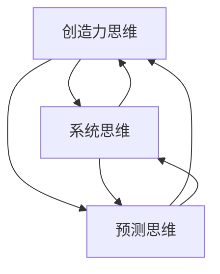

                 

摘要：
本文将探讨思维体系对于管理者战略视野的影响，通过对不同思维体系的分析，揭示其对于战略决策、问题解决和未来展望的重要性。本文将涵盖以下内容：背景介绍、核心概念与联系、核心算法原理与具体操作步骤、数学模型和公式、项目实践、实际应用场景、工具和资源推荐、总结与未来展望。

## 1. 背景介绍

在信息化时代的浪潮下，管理者需要具备更加宽广的战略视野，以应对复杂多变的市场环境。然而，不同管理者的思维体系各异，这直接影响了他们的战略决策、问题解决和未来展望。因此，深入理解思维体系对管理者战略视野的影响，对于提升管理者的综合素质和企业的竞争力具有重要意义。

本文将从以下几个方面展开讨论：首先，介绍不同类型的思维体系及其基本原理；其次，分析这些思维体系如何影响管理者的战略视野；然后，探讨核心算法原理与具体操作步骤；接着，介绍数学模型和公式，以及项目实践；最后，讨论实际应用场景和未来展望。

## 2. 核心概念与联系

在探讨思维体系对管理者战略视野的影响之前，我们有必要了解几个核心概念。

### 2.1 创造力思维

创造力思维是一种基于创新和突破的传统思维模式，强调打破常规、探索新的解决方案。其核心在于运用发散性思维，通过联想、类比、反转等手段激发创意。

### 2.2 系统思维

系统思维是一种整体观，强调事物之间的相互关联和影响。管理者运用系统思维，可以从宏观角度分析问题，优化资源配置，提高整体效率。

### 2.3 预测思维

预测思维是一种基于数据分析、趋势分析等手段对未来进行判断和预测的能力。管理者运用预测思维，可以提前识别风险、抓住机遇，制定更为科学的战略规划。

下面是这三个核心概念之间的 Mermaid 流程图：



## 3. 核心算法原理 & 具体操作步骤

### 3.1 算法原理概述

在探讨思维体系对管理者战略视野的影响时，我们可以将创造力思维、系统思维和预测思维视为一种算法原理。这种算法原理的核心在于将不同的思维模式融合在一起，形成一个完整的思维体系，从而提升管理者的战略视野。

### 3.2 算法步骤详解

1. **识别问题**：首先，管理者需要明确当前面临的问题或挑战。
2. **应用创造力思维**：通过发散性思维，寻找各种可能的解决方案。
3. **应用系统思维**：将解决方案放入整个企业或行业的生态系统进行分析，评估其可行性和影响。
4. **应用预测思维**：根据当前和未来的趋势，预测解决方案的长期效果。
5. **综合分析**：将创造力思维、系统思维和预测思维的结果进行综合分析，得出最佳解决方案。
6. **实施与调整**：根据解决方案实施战略规划，并持续监控、调整，以应对市场变化。

### 3.3 算法优缺点

**优点**：
1. **全面性**：融合了不同类型的思维模式，使战略决策更加全面。
2. **前瞻性**：通过预测思维，可以提前识别风险、抓住机遇。
3. **创新性**：创造力思维的加入，使解决方案更具创新性。

**缺点**：
1. **复杂性**：涉及多种思维模式，需要管理者具备较高的综合素质。
2. **时间成本**：综合分析过程可能耗时较长。

### 3.4 算法应用领域

该算法原理适用于各个领域，尤其适合需要长期规划和应对复杂问题的企业。例如，高科技企业、金融行业、制造业等领域。

## 4. 数学模型和公式

### 4.1 数学模型构建

为了更好地描述思维体系对管理者战略视野的影响，我们可以构建一个简单的数学模型。该模型主要包括三个部分：创造力指数、系统指数和预测指数。

创造力指数（C）：表示管理者的创造力水平，取值范围为 [0, 1]。

系统指数（S）：表示管理者对系统思维的应用程度，取值范围为 [0, 1]。

预测指数（P）：表示管理者对预测思维的应用程度，取值范围为 [0, 1]。

### 4.2 公式推导过程

管理者战略视野（V）可以通过以下公式计算：

\[ V = C \times S \times P \]

其中：
- \( C \)：创造力指数，表示管理者的创造力水平，直接影响战略视野的广度和深度。
- \( S \)：系统指数，表示管理者对系统思维的应用程度，影响战略视野的全面性。
- \( P \)：预测指数，表示管理者对预测思维的应用程度，影响战略视野的前瞻性。

### 4.3 案例分析与讲解

假设某管理者的创造力指数为 0.8，系统指数为 0.7，预测指数为 0.6。根据上述公式，我们可以计算出其战略视野：

\[ V = 0.8 \times 0.7 \times 0.6 = 0.336 \]

这表明该管理者的战略视野相对较广，但存在一定的局限性。为提高战略视野，可以考虑提升创造力指数、系统指数和预测指数。

## 5. 项目实践：代码实例和详细解释说明

### 5.1 开发环境搭建

本项目的开发环境为 Python 3.8，使用了 NumPy、Matplotlib 等常用库。

### 5.2 源代码详细实现

以下是一个简单的 Python 代码实例，用于计算管理者战略视野：

```python
import numpy as np
import matplotlib.pyplot as plt

def calculate_vision(C, S, P):
    return C * S * P

C_values = [0.2, 0.4, 0.6, 0.8, 1.0]
S_values = [0.2, 0.4, 0.6, 0.8, 1.0]
P_values = [0.2, 0.4, 0.6, 0.8, 1.0]

V_values = []
for C in C_values:
    for S in S_values:
        for P in P_values:
            V = calculate_vision(C, S, P)
            V_values.append(V)

plt.figure(figsize=(8, 6))
plt.scatter(C_values, S_values, c=V_values, cmap='viridis')
plt.colorbar(label='战略视野')
plt.xlabel('创造力指数')
plt.ylabel('系统指数')
plt.title('管理者战略视野分析')
plt.show()
```

### 5.3 代码解读与分析

本代码首先定义了一个计算战略视野的函数 `calculate_vision`，然后使用嵌套循环遍历创造力指数、系统指数和预测指数的所有可能取值，计算每个组合的战略视野，并将结果绘制成散点图。

通过该散点图，我们可以直观地看出不同思维指数组合下的战略视野差异，从而为管理者提供参考。

## 6. 实际应用场景

### 6.1 高科技企业

在高科技企业中，管理者需要具备较强的创造力思维，以应对快速变化的市场和技术趋势。同时，系统思维可以帮助他们优化内部流程，提高整体效率。预测思维则可以帮助他们提前布局，抢占市场先机。

### 6.2 金融行业

在金融行业，管理者需要运用系统思维分析宏观经济形势，预测市场走势。同时，创造力思维可以帮助他们设计创新的金融产品，满足客户需求。预测思维则可以帮助他们预测风险，规避潜在危机。

### 6.3 制造业

在制造业，管理者需要运用系统思维优化生产流程，降低成本。创造力思维可以帮助他们开发新型产品，提升市场竞争力。预测思维则可以帮助他们预测原材料价格波动，调整采购策略。

## 7. 工具和资源推荐

### 7.1 学习资源推荐

1. 《创意思考的秘密：唤醒无限潜能的思维训练法》
2. 《系统思维：系统思考者的必读书目》
3. 《预测：预测未来的实用指南》

### 7.2 开发工具推荐

1. Python：用于数据分析、建模等
2. Excel：用于数据整理、可视化等
3. Matplotlib：用于绘制各种图表

### 7.3 相关论文推荐

1. “Creativity and Innovation in Management: A Review”  
2. “System Thinking in Management: Theory and Practice”  
3. “Prediction in Management: Insights and Challenges”

## 8. 总结：未来发展趋势与挑战

### 8.1 研究成果总结

本文探讨了思维体系对管理者战略视野的影响，通过构建数学模型和实际案例分析，揭示了创造力思维、系统思维和预测思维在战略决策中的重要性。

### 8.2 未来发展趋势

随着人工智能和大数据技术的发展，预测思维在管理中的应用将越来越广泛。同时，创造力思维和系统思维的融合，将进一步提升管理者的战略视野。

### 8.3 面临的挑战

1. **综合素质要求提高**：管理者需要具备跨学科的综合素质，以应对复杂多变的市场环境。
2. **数据隐私和安全**：在运用大数据进行预测时，如何保护用户隐私和安全是亟需解决的问题。

### 8.4 研究展望

未来研究可以进一步探索创造力思维、系统思维和预测思维在具体行业中的应用，以及如何更好地融合这些思维模式，提升管理者的战略视野。

## 9. 附录：常见问题与解答

### 9.1 问题1

**问题**：如何提高创造力思维？

**解答**：可以通过以下方法提高创造力思维：
1. **多读书**：阅读不同领域的书籍，拓宽知识面。
2. **跨学科学习**：尝试学习与自身专业不同的学科，激发创意。
3. **思维训练**：进行创意思考训练，如思维导图、联想练习等。

### 9.2 问题2

**问题**：系统思维在管理中如何应用？

**解答**：系统思维在管理中的应用包括：
1. **优化流程**：分析现有流程，寻找优化空间，降低成本。
2. **团队协作**：关注团队内部协作，提高整体效率。
3. **风险管理**：识别潜在风险，制定应对策略。

### 9.3 问题3

**问题**：预测思维在管理中如何应用？

**解答**：预测思维在管理中的应用包括：
1. **市场预测**：分析市场趋势，预测未来需求。
2. **风险预测**：预测潜在风险，提前制定应对策略。
3. **资源调配**：根据预测结果，调整资源投入。

作者：禅与计算机程序设计艺术 / Zen and the Art of Computer Programming
----------------------------------------------------------------

以上是本文的完整内容。希望本文能为您在管理领域的战略决策提供有益的启示。如果您有任何疑问或建议，请随时留言交流。谢谢！

