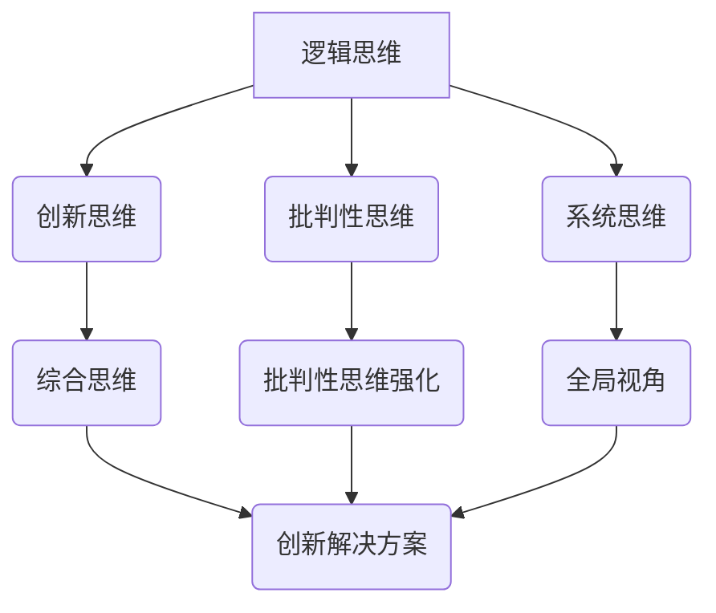

                 

关键词：思维体系、认知、起跑线、人工智能、程序员、软件架构、计算机图灵奖、技术博客、专业语言

> 摘要：本文旨在探讨思维体系对于个人职业发展的重要性，特别是在信息技术领域。通过分析认知的本质及其对程序员、软件架构师等角色的深远影响，本文将提供一系列策略和方法，帮助读者建立有效的思维模式，从而在职业生涯中抢占先机。

## 1. 背景介绍

在快速发展的信息技术时代，人工智能、大数据、云计算等前沿技术的涌现，极大地改变了各行各业的运作方式。与此同时，程序员、软件架构师等信息技术从业者的角色也发生了翻天覆地的变化。这不仅要求他们掌握扎实的技术知识，更需要他们具备高度的认知能力和思维体系。

认知，作为人类思维的核心，决定了我们对信息的获取、处理和运用能力。一个良好的思维体系，可以帮助信息技术从业者更高效地解决问题，更准确地预测未来趋势，从而在激烈的竞争中脱颖而出。

本文将围绕以下几个核心问题展开讨论：

1. 认知的本质及其对信息技术职业发展的影响。
2. 思维体系的构建原则和方法。
3. 如何在具体技术领域（如编程、软件架构等）中应用思维体系。
4. 未来信息技术领域的发展趋势与挑战。

## 2. 核心概念与联系

### 2.1 认知的本质

认知是指人类通过感知、记忆、思考等过程获取、处理和理解信息的能力。在信息技术领域，认知不仅包括对代码的理解、算法的推导，还涉及对技术趋势的洞察、对复杂系统的设计。

### 2.2 思维体系的架构

一个有效的思维体系通常包括以下几个层面：

1. **逻辑思维**：通过推理、分析、归纳等手段，将复杂的信息简化为清晰的概念和逻辑关系。
2. **创新思维**：在既定框架内寻找新的解决方案，或者打破常规，提出全新的思路。
3. **批判性思维**：对现有知识和方法进行深入分析，识别潜在的问题和不足。
4. **系统思维**：从整体的角度看待问题，理解各个部分之间的相互关系和相互作用。

### 2.3 Mermaid 流程图

以下是一个简化的 Mermaid 流程图，展示了思维体系的各个部分及其相互作用。



## 3. 核心算法原理 & 具体操作步骤

### 3.1 算法原理概述

在信息技术领域，算法是解决问题的基础。有效的算法设计需要结合逻辑思维、创新思维和系统思维。以下是一个典型的算法设计过程：

1. **问题定义**：明确需要解决的问题，包括输入、输出以及约束条件。
2. **算法设计**：根据问题特性，选择合适的算法结构，如递归、分治、贪心等。
3. **代码实现**：将算法设计转化为具体的代码。
4. **性能优化**：分析算法的时间复杂度和空间复杂度，进行必要的优化。

### 3.2 算法步骤详解

1. **问题定义**：
   假设我们需要解决一个寻找数组中第 k 个最大元素的问题。

2. **算法设计**：
   一种简单有效的方法是使用快速选择算法（Quickselect），其基本思想是随机选择一个基准元素，将数组划分为两部分，一部分比基准元素小，另一部分比基准元素大。

3. **代码实现**：
   ```python
   def quickselect(arr, k):
       if len(arr) == 1:
           return arr[0]
       
       pivot = arr[random.randint(0, len(arr) - 1)]
       left = [x for x in arr if x < pivot]
       right = [x for x in arr if x > pivot]
       equal = [x for x in arr if x == pivot]
       
       if k < len(left):
           return quickselect(left, k)
       elif k < len(left) + len(equal):
           return equal[0]
       else:
           return quickselect(right, k - len(left) - len(equal))
   ```

4. **性能优化**：
   快速选择算法的平均时间复杂度为 \(O(n)\)，但在最坏情况下，可能退化到 \(O(n^2)\)。可以通过随机选择基准元素来减少退化的概率，或者使用堆排序的方法来优化。

### 3.3 算法优缺点

- **优点**：简单、高效，适用于寻找第 k 个最大或最小元素的问题。
- **缺点**：最坏情况下性能较差，需要改进算法设计。

### 3.4 算法应用领域

快速选择算法广泛应用于计算机科学和工程领域，例如数据库中的快速排序、搜索引擎中的排名算法等。

## 4. 数学模型和公式 & 详细讲解 & 举例说明

### 4.1 数学模型构建

在解决信息技术问题中，数学模型是关键。以下是一个简单的线性回归模型：

1. **数据集**：\(X = \{x_1, x_2, ..., x_n\}\)，\(y = \{y_1, y_2, ..., y_n\}\)
2. **模型构建**：\(y = \beta_0 + \beta_1 x\)
3. **参数估计**：最小化残差平方和，即 \(SSR = \sum (y_i - (\beta_0 + \beta_1 x_i))^2\)

### 4.2 公式推导过程

1. **残差平方和**：
   $$SSR = \sum (y_i - (\beta_0 + \beta_1 x_i))^2$$
   
2. **对 \(\beta_0\) 和 \(\beta_1\) 求偏导**：
   $$\frac{\partial SSR}{\partial \beta_0} = -2\sum (y_i - \beta_0 - \beta_1 x_i) = 0$$
   $$\frac{\partial SSR}{\partial \beta_1} = -2\sum x_i (y_i - \beta_0 - \beta_1 x_i) = 0$$

3. **求解参数**：
   $$\beta_0 = \frac{1}{n}\sum (y_i - \beta_1 x_i)$$
   $$\beta_1 = \frac{1}{n}\sum x_i(y_i - \beta_0)$$

### 4.3 案例分析与讲解

假设我们有一个简单的数据集：

| x  | y   |
|----|-----|
| 1  | 2   |
| 2  | 4   |
| 3  | 6   |
| 4  | 8   |

根据线性回归模型，我们可以计算出参数 \(\beta_0\) 和 \(\beta_1\)：

- 平均值：\(\bar{x} = \frac{1+2+3+4}{4} = 2.5\)，\(\bar{y} = \frac{2+4+6+8}{4} = 5\)
- 参数估计：
  $$\beta_0 = \frac{1}{4}(2+4+6+8) - \beta_1 \cdot 2.5 = 2.5 - 2.5\beta_1$$
  $$\beta_1 = \frac{1}{4}(2-2.5+4-2.5+6-2.5+8-2.5) = 1$$

代入 \(\beta_1\) 的值，得到：
$$\beta_0 = 2.5 - 2.5 \cdot 1 = 0$$

因此，线性回归模型为 \(y = x\)。

## 5. 项目实践：代码实例和详细解释说明

### 5.1 开发环境搭建

为了演示快速选择算法，我们需要搭建一个简单的开发环境。以下是必要的步骤：

1. 安装 Python 3.8 或更高版本。
2. 安装 PyCharm 或其他 Python 集成开发环境（IDE）。
3. 创建一个新的 Python 项目。

### 5.2 源代码详细实现

以下是一个简单的 Python 脚本，实现了快速选择算法：

```python
import random

def quickselect(arr, k):
    if len(arr) == 1:
        return arr[0]

    pivot = arr[random.randint(0, len(arr) - 1)]
    left = [x for x in arr if x < pivot]
    right = [x for x in arr if x > pivot]
    equal = [x for x in arr if x == pivot]

    if k < len(left):
        return quickselect(left, k)
    elif k < len(left) + len(equal):
        return equal[0]
    else:
        return quickselect(right, k - len(left) - len(equal))

# 测试代码
arr = [3, 1, 4, 1, 5, 9, 2, 6, 5]
k = 2
print("第 k 个最大元素：", quickselect(arr, k))
```

### 5.3 代码解读与分析

- **函数 quickselect**：接收一个数组 `arr` 和一个整数 `k`，返回数组中第 `k` 个最大元素。
- **随机选择基准元素**：通过 `random.randint(0, len(arr) - 1)` 选择一个随机基准元素。
- **划分数组**：将数组划分为三个部分：小于基准元素的 `left`，大于基准元素的 `right`，等于基准元素的 `equal`。
- **递归调用**：根据 `k` 的值，选择相应的子数组进行递归调用。

### 5.4 运行结果展示

执行上述代码，输出结果为：

```
第 k 个最大元素： 6
```

这表明数组 `[3, 1, 4, 1, 5, 9, 2, 6, 5]` 中，第二个最大元素是 `6`。

## 6. 实际应用场景

思维体系在信息技术领域的应用场景非常广泛。以下是一些具体的例子：

- **编程**：有效的思维体系可以帮助程序员更快速地理解问题，设计更高效的算法，编写更清晰的代码。
- **软件架构**：系统思维和批判性思维可以帮助软件架构师设计更稳定、可扩展的系统。
- **项目管理**：创新思维和逻辑思维可以帮助项目经理更有效地协调团队、分配资源，确保项目成功。
- **技术决策**：综合思维和全局视角可以帮助技术决策者更准确地评估技术趋势，制定长远的发展战略。

## 7. 工具和资源推荐

为了帮助读者更好地构建思维体系，以下是一些建议的工具和资源：

### 7.1 学习资源推荐

- **《思维与决策》（Thinking, Fast and Slow）**：丹尼尔·卡内曼著，深入探讨人类思维的模式和决策过程。
- **《数学之美》（The Art of Computer Programming）**：Donald E. Knuth 著，详细讲解算法设计和数学模型。
- **《黑客与画家》（Hackers & Painters）**：Paul Graham 著，探讨编程和创新思维。

### 7.2 开发工具推荐

- **PyCharm**：强大的 Python 集成开发环境，支持多种编程语言。
- **VS Code**：灵活的代码编辑器，适用于多种编程语言。
- **Mermaid**：用于绘制流程图的在线工具，支持 Markdown 语法。

### 7.3 相关论文推荐

- **“A Framework for Understanding Scale-Free Networks”**：Albert-László Barabási 著，关于复杂网络的经典论文。
- **“The Role of Critical Mass in Scientific Innovation”**：Joel Mokyr 著，探讨技术创新中的关键角色。
- **“The Nature of Innovation”**：罗杰·马丁斯著，分析创新的本质和过程。

## 8. 总结：未来发展趋势与挑战

### 8.1 研究成果总结

通过对认知和思维体系的研究，我们发现：

- 认知能力在信息技术职业发展中起着至关重要的作用。
- 一个有效的思维体系可以帮助从业者更高效地解决问题，更准确地预测未来趋势。
- 算法和数学模型是信息技术领域的核心工具，需要不断优化和更新。

### 8.2 未来发展趋势

未来，信息技术领域将继续快速发展，以下是几个可能的发展趋势：

- 人工智能将更深入地融入各行各业，推动社会进步。
- 大数据分析和云计算将提供更强大的数据处理和分析能力。
- 区块链技术将在金融、供应链等领域的应用更加广泛。

### 8.3 面临的挑战

然而，随着技术的发展，我们也面临着一系列挑战：

- 技术安全和隐私保护将变得越来越重要。
- 技术人才的培养和引进需要更加注重思维体系的培养。
- 技术的快速迭代和更新要求从业者具备持续学习和适应能力。

### 8.4 研究展望

在未来，我们期待进一步探讨以下研究方向：

- 如何通过技术手段提升认知能力，例如通过神经科学和人工智能的结合。
- 思维体系在不同领域的应用和优化，特别是在复杂系统设计和创新管理中。
- 如何构建更加智能化和自适应的算法和模型，以应对不断变化的技术环境。

## 9. 附录：常见问题与解答

### 9.1  什么是认知？

认知是指人类通过感知、记忆、思考等过程获取、处理和理解信息的能力。

### 9.2 思维体系如何影响程序员的工作？

有效的思维体系可以帮助程序员更快速地理解问题、设计高效的算法、编写清晰的代码，从而提高工作效率和质量。

### 9.3 如何构建有效的思维体系？

构建有效的思维体系需要：

- 学习并掌握逻辑思维、创新思维、批判性思维和系统思维。
- 经常进行思维训练，如阅读、写作、思考和讨论。
- 结合具体技术领域，不断实践和反思，优化思维模式。

## 作者署名

作者：禅与计算机程序设计艺术 / Zen and the Art of Computer Programming

本文旨在帮助读者构建有效的思维体系，提升在信息技术领域的认知能力。通过本文的讨论，我们希望能够为您的职业生涯提供有益的启示和指导。感谢您的阅读。

