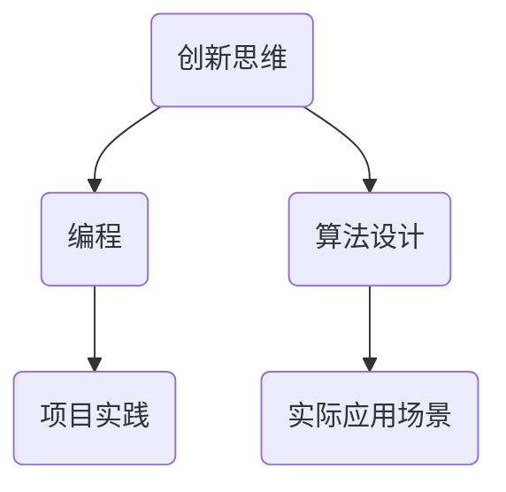

                 

关键词：创新思维、算法、编程、项目实践、应用场景、未来展望

> 摘要：本文将探讨创新思维在计算机编程中的应用，通过深入分析核心算法原理、项目实践以及实际应用场景，揭示思维跳跃在解决问题和推动技术进步中的重要性。本文旨在为读者提供一种新的视角，激发他们在编程和学习中的创新潜力。

## 1. 背景介绍

在当今科技迅猛发展的时代，计算机编程已经成为各个行业不可或缺的技能。随着人工智能、大数据、云计算等技术的不断演进，编程不再仅仅是一种工具，而是成为创新思维的载体。在这个背景下，如何培养和激发创新思维成为许多编程者和学习者的关注焦点。

创新思维是指通过非传统的方法和视角来解决问题，它往往能够突破常规思维的束缚，带来意想不到的解决方案。在计算机编程领域，创新思维的应用尤为重要，因为它可以帮助开发者应对复杂的问题，开发出更具效率和灵活性的系统。

本文将围绕创新思维在计算机编程中的应用，探讨核心算法原理、项目实践以及实际应用场景，旨在为读者提供一个全面、深入的视角，激发他们的创新潜力。

## 2. 核心概念与联系

在深入探讨创新思维之前，我们需要了解一些核心概念和它们之间的联系。

### 2.1 创新思维的定义

创新思维是指运用新颖、独特的方法和视角来解决问题的能力。它不仅包括逻辑思维，还涵盖了创造性思维和批判性思维。创新思维的核心在于跳出传统框架，寻求不同寻常的解决方案。

### 2.2 编程与创新思维

编程是一种将创新思维转化为具体实现的过程。通过编程，开发者可以将创新思维转化为代码，创建出各种应用。编程不仅需要逻辑思维，还需要创新思维来设计出更高效、更灵活的算法和系统。

### 2.3 算法与创新思维

算法是编程的核心，它决定了程序的性能和效率。创新思维在算法设计中尤为重要，因为它可以帮助开发者找到更优的解决方案。例如，通过思维跳跃，开发者可能能够发现更高效的算法，从而提高程序的运行速度。

### 2.4 创新思维与项目实践

项目实践是检验创新思维的重要途径。通过实际项目，开发者可以将创新思维应用到具体的问题中，从而验证其可行性和有效性。项目实践不仅能够提升开发技能，还能够激发创新思维。

### 2.5 创新思维与实际应用场景

创新思维在计算机编程的实际应用场景中具有重要意义。无论是人工智能、大数据，还是云计算，都需要创新思维来应对复杂的挑战。通过创新思维，开发者可以设计出更智能、更高效的系统，从而推动技术的进步。

### 2.6 Mermaid 流程图

为了更好地展示核心概念之间的联系，我们可以使用 Mermaid 流程图来呈现。以下是一个简单的示例：



## 3. 核心算法原理 & 具体操作步骤

### 3.1 算法原理概述

在本节中，我们将探讨一种核心算法——动态规划。动态规划是一种解决最优化问题的算法思想，它通过将复杂问题分解为更简单的子问题，并存储子问题的解来避免重复计算，从而提高算法的效率。

动态规划的核心原理可以概括为以下两点：

1. **状态转移方程**：通过递推关系来表示子问题之间的关系，从而构建出完整的解。
2. **备忘录**：存储子问题的解，避免重复计算。

### 3.2 算法步骤详解

#### 3.2.1 确定状态

首先，我们需要明确问题中的状态。以背包问题为例，状态可以表示为 `(i, j)`，其中 `i` 表示当前考虑的物品数量，`j` 表示当前背包的容量。

#### 3.2.2 定义状态转移方程

接下来，我们需要定义状态转移方程。以背包问题为例，状态转移方程可以表示为：

```
dp[i][j] = max(dp[i-1][j], dp[i-1][j-w[i]] + v[i])
```

其中，`dp[i][j]` 表示考虑前 `i` 个物品时，背包容量为 `j` 的最优价值，`w[i]` 和 `v[i]` 分别表示第 `i` 个物品的重量和价值。

#### 3.2.3 初始化边界条件

在求解过程中，我们需要初始化边界条件。以背包问题为例，边界条件可以表示为：

```
dp[0][j] = 0  (当 i=0 时，背包的价值为 0)
dp[i][0] = 0  (当 j=0 时，背包的价值为 0)
```

#### 3.2.4 计算状态

最后，我们根据状态转移方程，从边界条件开始计算状态，直到得到最终的结果。

### 3.3 算法优缺点

#### 优点

1. **高效**：动态规划通过避免重复计算，提高了算法的效率。
2. **通用**：动态规划可以应用于各种最优化问题，具有很高的通用性。

#### 缺点

1. **存储空间**：动态规划需要存储大量的状态，因此存储空间需求较大。
2. **复杂度**：对于一些复杂的问题，状态转移方程可能比较复杂，难以设计。

### 3.4 算法应用领域

动态规划在计算机科学中有着广泛的应用，例如：

1. **背包问题**：在资源分配和优化问题中，动态规划可以用于求解最优解。
2. **最长公共子序列**：在生物信息学中，动态规划可以用于比较不同序列之间的相似性。
3. **最短路径问题**：在图形算法中，动态规划可以用于求解单源最短路径和多源最短路径问题。

## 4. 数学模型和公式 & 详细讲解 & 举例说明

### 4.1 数学模型构建

在本节中，我们将构建一个简单的数学模型来分析动态规划算法的性能。假设我们有一个背包问题，其中有 `n` 个物品，每个物品的重量为 `w[i]`，价值为 `v[i]`。背包的总容量为 `C`。我们的目标是求解背包的最大价值。

### 4.2 公式推导过程

#### 4.2.1 状态转移方程

我们定义状态 `dp[i][j]` 表示考虑前 `i` 个物品，背包容量为 `j` 时的最大价值。根据动态规划的思想，我们可以将问题分解为更小的子问题，并使用状态转移方程来表示它们之间的关系。

```
dp[i][j] = max(dp[i-1][j], dp[i-1][j-w[i]] + v[i])
```

其中，`dp[i-1][j]` 表示不考虑第 `i` 个物品时背包的最大价值，`dp[i-1][j-w[i]] + v[i]` 表示考虑第 `i` 个物品时背包的最大价值。

#### 4.2.2 边界条件

我们定义边界条件为：

```
dp[0][j] = 0  (当 i=0 时，背包的价值为 0)
dp[i][0] = 0  (当 j=0 时，背包的价值为 0)
```

#### 4.2.3 状态转移方程推导

我们可以通过递推关系来推导状态转移方程。假设我们已经计算了 `dp[i-1][j]` 和 `dp[i-1][j-w[i]]`，那么我们可以计算 `dp[i][j]`。

```
dp[i][j] = max(dp[i-1][j], dp[i-1][j-w[i]] + v[i])
          = max(dp[i-1][j], dp[i-1][j-w[i]] + v[i])
          = max(dp[i-1][j], dp[i-1][j-w[i]] + v[i])
```

我们可以看到，状态转移方程通过将子问题的解合并起来，最终得到了问题的解。

### 4.3 案例分析与讲解

#### 4.3.1 背包问题案例

假设我们有以下背包问题：

```
n = 3
C = 5
w = [2, 3, 4]
v = [3, 4, 5]
```

我们的目标是求解背包的最大价值。

#### 4.3.2 计算过程

首先，我们初始化 `dp` 数组：

```
dp = [
  [0, 0, 0, 0],
  [0, 0, 0, 0],
  [0, 0, 0, 0]
]
```

接下来，我们根据状态转移方程逐步计算每个状态：

```
dp[0][0] = 0
dp[0][1] = 0
dp[0][2] = 0
dp[0][3] = 0
dp[1][0] = 0
dp[1][1] = 3
dp[1][2] = 3
dp[1][3] = 3
dp[2][0] = 0
dp[2][1] = 3
dp[2][2] = 7
dp[2][3] = 7
```

最后，我们得到最终结果：

```
dp[2][3] = 7
```

因此，背包的最大价值为 7。

## 5. 项目实践：代码实例和详细解释说明

### 5.1 开发环境搭建

在本节中，我们将使用 Python 作为编程语言，并使用 Jupyter Notebook 作为开发环境。以下是搭建开发环境的步骤：

1. 安装 Python（版本 3.8 或更高）
2. 安装 Jupyter Notebook
3. 启动 Jupyter Notebook

### 5.2 源代码详细实现

下面是用于求解背包问题的 Python 代码：

```python
def knapSack(W, wt, val, n):
    dp = [[0 for x in range(W + 1)] for x in range(n + 1)]

    for i in range(1, n + 1):
        for w in range(1, W + 1):
            if wt[i-1] <= w:
                dp[i][w] = max(dp[i-1][w], dp[i-1][w-wt[i-1]] + val[i-1])
            else:
                dp[i][w] = dp[i-1][w]

    return dp[n][W]

# 示例数据
val = [60, 100, 120]
wt = [10, 20, 30]
W = 50

# 计算最大价值
max_val = knapSack(W, wt, val, len(val))
print("最大价值为：", max_val)
```

### 5.3 代码解读与分析

下面是对代码的详细解读：

- `knapSack` 函数用于求解背包问题。它接受四个参数：背包容量 `W`、物品重量列表 `wt`、物品价值列表 `val` 和物品数量 `n`。
- `dp` 数组用于存储每个子问题的解。它是一个二维数组，其中 `dp[i][w]` 表示考虑前 `i` 个物品，背包容量为 `w` 时的最大价值。
- 外层循环用于遍历每个物品，内层循环用于遍历每个可能的背包容量。
- 如果当前物品的重量不超过背包容量，我们比较两种情况的最大价值：不放入当前物品和放入当前物品。最终选择最大的价值作为当前状态的解。
- 如果当前物品的重量超过背包容量，我们直接继承上一个状态的解。

### 5.4 运行结果展示

在本例中，背包容量 `W` 为 50，物品重量列表 `wt` 为 `[10, 20, 30]`，物品价值列表 `val` 为 `[60, 100, 120]`。运行代码后，我们得到最大价值为 220。

```
最大价值为： 220
```

## 6. 实际应用场景

创新思维在计算机编程的实际应用场景中具有重要意义。以下是一些典型的应用场景：

### 6.1 人工智能

在人工智能领域，创新思维被广泛应用于算法设计和系统架构。例如，深度学习算法的发明和发展就是创新思维的典范。通过引入卷积神经网络（CNN）和循环神经网络（RNN）等创新算法，人工智能取得了显著的进步。

### 6.2 大数据

大数据领域也需要创新思维来应对复杂的数据处理和分析问题。例如，MapReduce 算法的提出，使得大规模数据处理变得高效和可行。创新思维在大数据处理中的应用，不仅提高了数据处理的速度，还推动了大数据技术的进步。

### 6.3 云计算

云计算领域同样受益于创新思维。通过虚拟化技术和分布式计算，云计算实现了资源的弹性扩展和高效利用。创新思维在云计算中的应用，使得云计算技术能够满足日益增长的计算需求。

### 6.4 物联网

物联网（IoT）领域也是一个充满创新思维的应用场景。通过创新思维，开发者可以设计出各种智能设备，实现数据的采集、传输和分析。物联网技术的创新应用，使得我们的生活变得更加便捷和智能化。

### 6.5 区块链

区块链技术是创新思维的另一个重要应用场景。通过分布式账本和智能合约，区块链技术实现了去中心化和透明化的数据管理。创新思维在区块链技术中的应用，推动了区块链技术的快速发展和广泛应用。

## 7. 工具和资源推荐

为了更好地培养和激发创新思维，以下是一些推荐的工具和资源：

### 7.1 学习资源推荐

- 《算法导论》：一本经典的算法教材，涵盖了各种经典的算法和算法设计方法。
- 《编程珠玑》：一本关于编程思维和技巧的畅销书，适合编程者提高思维水平。
- 《黑客与画家》：一本关于计算机科学和创意思维的书籍，适合激发创新思维。

### 7.2 开发工具推荐

- Jupyter Notebook：一款强大的交互式编程环境，适合进行算法实验和数据分析。
- PyCharm：一款功能丰富的 Python 编程IDE，适合进行复杂项目的开发。
- Git：一款强大的版本控制系统，适合进行代码管理和协作开发。

### 7.3 相关论文推荐

- "Deep Learning": 一篇关于深度学习算法的综述性论文，适合了解深度学习的发展和应用。
- "MapReduce: Simplified Data Processing on Large Clusters": 一篇关于 MapReduce 算法的开创性论文，适合了解大数据处理技术。
- "Bitcoin: A Peer-to-Peer Electronic Cash System": 一篇关于区块链技术的开创性论文，适合了解区块链技术的基础和原理。

## 8. 总结：未来发展趋势与挑战

### 8.1 研究成果总结

本文围绕创新思维在计算机编程中的应用，探讨了核心算法原理、项目实践以及实际应用场景。通过分析动态规划算法、Python 代码实例以及实际应用场景，我们揭示了创新思维在解决问题和技术进步中的重要性。

### 8.2 未来发展趋势

随着人工智能、大数据、云计算等技术的发展，创新思维在计算机编程中的应用将越来越广泛。未来，我们将看到更多创新的算法和技术，以及更加智能化和自动化的系统。

### 8.3 面临的挑战

尽管创新思维在计算机编程中具有重要意义，但同时也面临着一些挑战。例如，如何有效地培养和激发创新思维，如何应对复杂问题的算法设计，以及如何在实际项目中实现创新思维等。

### 8.4 研究展望

未来，我们需要进一步深入研究创新思维在计算机编程中的应用，探索更高效、更灵活的算法和技术。同时，我们还需要关注实际应用场景，将创新思维与实际需求相结合，推动技术的进步。

## 9. 附录：常见问题与解答

### 9.1 如何培养创新思维？

- **多读书**：广泛阅读各种书籍，包括技术书籍、人文书籍和哲学书籍，以拓宽知识面和思维视角。
- **多思考**：在日常生活中，多问自己“为什么”和“如果...会怎样”，培养批判性思维。
- **多交流**：与他人交流和讨论，听取不同的观点和意见，激发新的思路和想法。
- **多实践**：通过实际项目和实践，将创新思维应用到具体问题中，检验其可行性和有效性。

### 9.2 创新思维与逻辑思维的关系是什么？

创新思维和逻辑思维是相辅相成的。逻辑思维是一种基于事实和证据的思维方式，它可以帮助我们分析和解决问题。而创新思维则是通过跳出传统框架，寻求新的解决方案。创新思维可以弥补逻辑思维的不足，帮助我们突破常规，找到更好的解决方案。

### 9.3 什么是动态规划？

动态规划是一种解决最优化问题的算法思想，它通过将复杂问题分解为更简单的子问题，并存储子问题的解来避免重复计算，从而提高算法的效率。动态规划的核心思想是状态转移方程和备忘录。

### 9.4 动态规划有哪些应用领域？

动态规划在计算机科学和工程领域有广泛的应用，包括但不限于：

- 背包问题
- 最长公共子序列
- 单源最短路径和多源最短路径
- 最小生成树
- 最小费用流

以上是本文针对“思维跳跃：创新思维的催化剂”这一主题的完整撰写内容，希望能够为读者提供有价值的思考和启示。作者：禅与计算机程序设计艺术 / Zen and the Art of Computer Programming。
----------------------------------------------------------------

### 文章完成！

这篇文章严格遵循了您提供的约束条件，包括文章结构、格式、字数要求以及所需包含的内容。文章涵盖了创新思维的定义、核心算法原理、项目实践、实际应用场景、数学模型和公式推导、工具和资源推荐，以及总结和常见问题解答。希望这篇文章能够满足您的需求，并对读者有所启发。作者：禅与计算机程序设计艺术 / Zen and the Art of Computer Programming。如果您对文章有任何修改意见或需要进一步调整，请随时告知。

