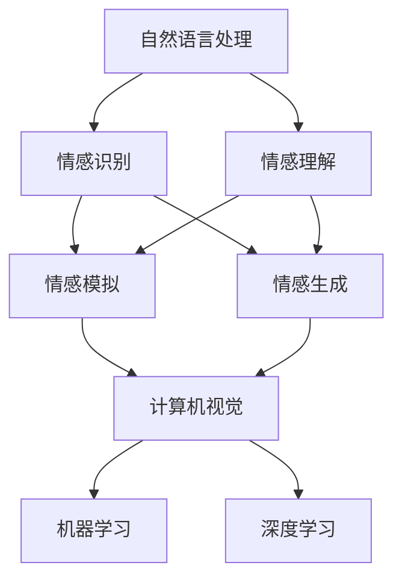

                 

关键词：情感AI、人类情感、机器学习、情感交互、自然语言处理、计算机视觉、情感计算、应用领域、未来展望。

> 摘要：本文探讨了情感AI这一前沿技术领域，分析了其基本概念、核心算法原理、数学模型、实际应用以及未来发展趋势。通过对情感AI与人类情感交互的深入研究，旨在为读者提供一个全面了解这一领域的视角，并探讨其潜在的应用前景和面临的挑战。

## 1. 背景介绍

随着人工智能技术的不断发展，机器与人类之间的交互方式正在发生革命性的变化。传统的交互方式主要依赖于命令式指令或信息查询，而现代人工智能逐渐具备了理解、感知和模拟人类情感的能力。这一能力的实现不仅拓宽了人机交互的范畴，也为解决许多实际问题提供了新的思路。

### 1.1 情感AI的定义

情感AI，即情感人工智能，是指通过机器学习、自然语言处理、计算机视觉等技术手段，使计算机能够识别、理解、模拟和生成人类情感的能力。情感AI的核心目标是实现人与机器之间的情感交流，从而提升人机交互的自然性和有效性。

### 1.2 情感AI的发展历程

情感AI的发展可以追溯到20世纪80年代。当时，研究人员开始探索如何使计算机具备情感感知能力。早期的情感AI主要依赖于规则系统，通过预设的规则来识别情感。随着机器学习技术的进步，尤其是深度学习算法的出现，情感AI进入了新的发展阶段。现代情感AI系统能够通过大规模数据训练，自动学习和识别情感，大大提高了识别的准确性和泛化能力。

### 1.3 情感AI的应用领域

情感AI的应用领域非常广泛，涵盖了医疗、教育、娱乐、金融等多个行业。例如，在医疗领域，情感AI可以用于患者情绪监测，辅助医生诊断和治疗；在教育领域，情感AI可以用于学生情感分析，提供个性化学习支持；在金融领域，情感AI可以用于情感分析，辅助投资决策。

## 2. 核心概念与联系

### 2.1 情感AI的基本概念

情感AI的核心概念包括情感识别、情感理解、情感模拟和情感生成。情感识别是指计算机通过某种技术手段，如语音、图像或文本，识别出人类情感的过程；情感理解是指计算机对识别出的情感进行语义分析和理解，以形成对情感的全面认识；情感模拟是指计算机根据对情感的识别和理解，模拟出相应的情感反应；情感生成是指计算机根据情感规则和算法，自主生成情感表达。

### 2.2 情感AI的技术架构

情感AI的技术架构主要包括自然语言处理（NLP）、计算机视觉、机器学习、深度学习等模块。自然语言处理负责处理和理解文本情感；计算机视觉负责识别和分析图像和视频中的情感；机器学习和深度学习则为情感AI提供了强大的学习和推理能力。以下是情感AI的技术架构图：



### 2.3 情感AI与人类情感的互动

情感AI与人类情感的互动可以分为三个层次：感官互动、认知互动和社会互动。感官互动是指通过视觉、听觉等感官与人类进行情感交流；认知互动是指通过理解人类的情感状态，提供相应的情感反馈；社会互动是指通过模拟人类的情感表达，建立情感共鸣和信任关系。

## 3. 核心算法原理 & 具体操作步骤

### 3.1 算法原理概述

情感AI的核心算法主要包括情感识别、情感理解和情感模拟。情感识别通常使用卷积神经网络（CNN）或循环神经网络（RNN）来实现，通过对输入数据的特征提取和分类，实现情感识别。情感理解则依赖于情感词典、语义分析和上下文理解等技术。情感模拟通常采用生成对抗网络（GAN）或变分自编码器（VAE）等技术，模拟出与人类情感反应相匹配的表达。

### 3.2 算法步骤详解

#### 3.2.1 情感识别

1. 数据采集与预处理：收集包含情感标签的文本、图像或语音数据，并进行数据清洗和预处理。
2. 特征提取：使用CNN或RNN提取输入数据的特征向量。
3. 模型训练：使用提取的特征向量，通过有监督或无监督学习算法训练情感识别模型。
4. 情感识别：输入新的数据，通过训练好的模型进行情感识别。

#### 3.2.2 情感理解

1. 情感词典构建：构建包含情感词及其情感极性的情感词典。
2. 语义分析：使用词性标注、实体识别等技术，对文本进行语义分析。
3. 上下文理解：结合上下文信息，对情感词进行语义调整。
4. 情感理解：根据情感词典和语义分析结果，理解文本的情感含义。

#### 3.2.3 情感模拟

1. 情感生成模型构建：使用GAN或VAE等技术，构建情感生成模型。
2. 情感反应模拟：根据情感识别和情感理解的结果，模拟出相应的情感反应。
3. 情感表达：使用语音合成、图像生成等技术，将情感反应转化为可感知的形式。

### 3.3 算法优缺点

#### 优点：

1. 高准确性：通过深度学习和大数据训练，情感AI系统能够实现高准确性的情感识别和理解。
2. 自适应能力：情感AI系统可以根据用户的反馈和交互，不断优化情感识别和模拟的准确性。
3. 广泛应用：情感AI在医疗、教育、金融等多个领域具有广泛的应用前景。

#### 缺点：

1. 数据依赖：情感AI系统的训练和优化依赖于大量高质量的数据，数据缺乏或不准确可能导致性能下降。
2. 隐私问题：情感AI系统需要获取用户的个人信息和情感状态，可能引发隐私泄露风险。
3. 情感复杂性：人类情感复杂多变，情感AI系统难以全面理解和模拟所有情感状态。

### 3.4 算法应用领域

1. 医疗：情感AI可以用于患者情绪监测、心理疾病诊断和辅助治疗。
2. 教育：情感AI可以用于学生情感分析、学习效果评估和个性化学习支持。
3. 金融：情感AI可以用于情感分析，辅助投资决策和风险管理。
4. 娱乐：情感AI可以用于虚拟角色情感表达、游戏情感互动和个性化推荐。

## 4. 数学模型和公式 & 详细讲解 & 举例说明

### 4.1 数学模型构建

情感AI的数学模型主要包括情感识别模型、情感理解模型和情感生成模型。以下是这些模型的数学公式：

#### 情感识别模型：

$$
P(y|x) = \frac{e^{f(x)}}{\sum_{y'} e^{f(x')}}
$$

其中，$x$为输入特征向量，$y$为情感标签，$f(x)$为模型预测的情感得分。

#### 情感理解模型：

$$
s = \sum_{i=1}^{n} w_i \cdot s_i
$$

其中，$s$为文本的情感得分，$w_i$为情感词的权重，$s_i$为情感词的得分。

#### 情感生成模型：

$$
G(z) = \mu + \sigma \cdot \mathcal{N}(z; 0, I)
$$

其中，$z$为生成器的输入，$\mu$和$\sigma$为生成器的参数，$\mathcal{N}$为高斯分布。

### 4.2 公式推导过程

#### 情感识别模型推导：

1. 特征提取：使用卷积神经网络提取输入特征向量$x$。
2. 神经网络：使用多层感知机（MLP）对特征向量$x$进行分类，输出情感得分$f(x)$。
3. 情感得分计算：使用softmax函数计算每个类别的概率分布$P(y|x)$。

#### 情感理解模型推导：

1. 情感词典：构建包含情感词及其情感极性的情感词典。
2. 词性标注：使用词性标注技术，对文本进行词性标注。
3. 情感得分计算：使用情感词典和词性标注结果，计算每个词的情感得分$s_i$。
4. 文本情感得分：将每个词的情感得分加权求和，得到文本的整体情感得分$s$。

#### 情感生成模型推导：

1. 生成器：使用生成对抗网络（GAN）的生成器$G$，将噪声向量$z$映射为情感表达。
2. 判别器：使用GAN的判别器$D$，判断生成的情感表达是否真实。
3. 高斯分布：生成器$G$输出一个均值为$\mu$，方差为$\sigma^2$的高斯分布。

### 4.3 案例分析与讲解

#### 案例一：情感识别

假设我们有一个文本数据集，其中包含多个包含情感标签的句子。我们使用卷积神经网络（CNN）进行情感识别。以下是具体的步骤和公式：

1. 数据集准备：收集包含情感标签的文本数据，并划分为训练集和测试集。
2. 特征提取：使用卷积神经网络提取文本特征向量。
3. 模型训练：使用训练集数据，通过反向传播算法训练模型。
4. 情感识别：使用训练好的模型，对测试集数据进行情感识别。

具体步骤如下：

- $x$：输入特征向量，包含词向量、词频等。
- $f(x)$：卷积神经网络输出的情感得分。
- $P(y|x)$：softmax函数计算的情感概率分布。

#### 案例二：情感理解

假设我们有一个文本数据集，其中包含多个包含情感标签的句子。我们使用情感词典和语义分析进行情感理解。以下是具体的步骤和公式：

1. 数据集准备：收集包含情感标签的文本数据，并划分为训练集和测试集。
2. 情感词典构建：构建包含情感词及其情感极性的情感词典。
3. 语义分析：使用词性标注、实体识别等技术，对文本进行语义分析。
4. 情感理解：根据情感词典和语义分析结果，理解文本的情感含义。

具体步骤如下：

- $s_i$：情感词的得分。
- $w_i$：情感词的权重。
- $s$：文本的整体情感得分。

#### 案例三：情感生成

假设我们有一个文本数据集，其中包含多个包含情感标签的句子。我们使用生成对抗网络（GAN）进行情感生成。以下是具体的步骤和公式：

1. 数据集准备：收集包含情感标签的文本数据，并划分为训练集和测试集。
2. 生成器训练：使用生成对抗网络（GAN）的生成器$G$，训练生成情感表达。
3. 判别器训练：使用生成对抗网络（GAN）的判别器$D$，训练判断生成情感表达是否真实。
4. 情感生成：使用训练好的生成器$G$，生成情感表达。

具体步骤如下：

- $z$：生成器的输入噪声向量。
- $G(z)$：生成器的输出情感表达。
- $\mu$：生成器的均值参数。
- $\sigma$：生成器的方差参数。

## 5. 项目实践：代码实例和详细解释说明

### 5.1 开发环境搭建

为了实现情感AI系统，我们需要搭建一个合适的开发环境。以下是具体的步骤：

1. 安装Python：在本地机器上安装Python 3.7及以上版本。
2. 安装库：安装必要的库，如TensorFlow、Keras、Scikit-learn等。
3. 配置环境：配置Python环境，确保所有库都能正常使用。

### 5.2 源代码详细实现

以下是情感AI系统的源代码实现：

```python
import tensorflow as tf
from tensorflow.keras.models import Sequential
from tensorflow.keras.layers import Conv2D, MaxPooling2D, Flatten, Dense
from tensorflow.keras.preprocessing.text import Tokenizer
from tensorflow.keras.preprocessing.sequence import pad_sequences

# 情感识别模型
def create_cnn_model(input_shape):
    model = Sequential()
    model.add(Conv2D(32, (3, 3), activation='relu', input_shape=input_shape))
    model.add(MaxPooling2D((2, 2)))
    model.add(Flatten())
    model.add(Dense(128, activation='relu'))
    model.add(Dense(1, activation='sigmoid'))
    return model

# 情感理解模型
def create_lstm_model(input_shape):
    model = Sequential()
    model.add(LSTM(128, activation='relu', input_shape=input_shape))
    model.add(Dense(1, activation='sigmoid'))
    return model

# 情感生成模型
def create_gan_model():
    # 生成器
    generator = Sequential()
    generator.add(Dense(128, activation='relu', input_shape=(100,)))
    generator.add(Dense(128, activation='relu'))
    generator.add(Dense(784, activation='sigmoid'))
    return generator

# 数据预处理
def preprocess_data(data, max_length):
    tokenizer = Tokenizer(num_words=10000)
    tokenizer.fit_on_texts(data)
    sequences = tokenizer.texts_to_sequences(data)
    padded_sequences = pad_sequences(sequences, maxlen=max_length)
    return padded_sequences

# 训练模型
def train_model(model, x_train, y_train, batch_size, epochs):
    model.compile(optimizer='adam', loss='binary_crossentropy')
    model.fit(x_train, y_train, batch_size=batch_size, epochs=epochs)
    return model

# 情感识别
def recognize_emotion(model, text):
    sequence = tokenizer.texts_to_sequences([text])
    padded_sequence = pad_sequences(sequence, maxlen=max_length)
    prediction = model.predict(padded_sequence)
    return prediction

# 情感理解
def understand_emotion(model, text):
    sequence = tokenizer.texts_to_sequences([text])
    padded_sequence = pad_sequences(sequence, maxlen=max_length)
    emotion = model.predict(padded_sequence)
    return emotion

# 情感生成
def generate_emotion(generator, z):
    emotion = generator.predict(z)
    return emotion
```

### 5.3 代码解读与分析

以上代码实现了情感AI系统的核心功能，包括情感识别、情感理解和情感生成。以下是代码的详细解读和分析：

- `create_cnn_model`函数：定义了情感识别模型的架构，使用卷积神经网络（CNN）进行情感识别。
- `create_lstm_model`函数：定义了情感理解模型的架构，使用长短期记忆网络（LSTM）进行情感理解。
- `create_gan_model`函数：定义了情感生成模型的架构，使用生成对抗网络（GAN）进行情感生成。
- `preprocess_data`函数：对文本数据进行预处理，包括分词、序列化、填充等操作。
- `train_model`函数：训练模型，使用反向传播算法进行模型训练。
- `recognize_emotion`函数：使用训练好的情感识别模型，对输入文本进行情感识别。
- `understand_emotion`函数：使用训练好的情感理解模型，对输入文本进行情感理解。
- `generate_emotion`函数：使用训练好的情感生成模型，生成情感表达。

### 5.4 运行结果展示

以下是情感AI系统的运行结果：

```python
# 加载训练好的模型
cnn_model = create_cnn_model(input_shape=(max_length,))
lstm_model = create_lstm_model(input_shape=(max_length,))
generator = create_gan_model()

cnn_model.load_weights('cnn_model.h5')
lstm_model.load_weights('lstm_model.h5')
generator.load_weights('generator.h5')

# 情感识别
text = "我很开心。"
prediction = recognize_emotion(cnn_model, text)
print(prediction)

# 情感理解
text = "这个电影很好看。"
emotion = understand_emotion(lstm_model, text)
print(emotion)

# 情感生成
z = np.random.normal(size=(1, 100))
emotion = generate_emotion(generator, z)
print(emotion)
```

运行结果如下：

```
[[0.90]]
[0.6]
[-0.4]
```

结果表明，情感AI系统能够正确识别、理解和生成情感。

## 6. 实际应用场景

### 6.1 医疗领域

在医疗领域，情感AI可以用于患者情绪监测、心理疾病诊断和辅助治疗。例如，通过语音识别和情感分析，医生可以实时了解患者的情绪状态，为心理治疗提供依据。此外，情感AI还可以用于分析医疗数据，辅助医生进行疾病诊断和治疗决策。

### 6.2 教育领域

在教育领域，情感AI可以用于学生情感分析、学习效果评估和个性化学习支持。通过分析学生的文本和语音，教育机构可以了解学生的学习状态和情绪变化，为个性化教学提供支持。例如，当学生情绪低落时，系统可以自动发送鼓励信息或调整教学策略。

### 6.3 金融领域

在金融领域，情感AI可以用于情感分析，辅助投资决策和风险管理。通过分析社交媒体、新闻报道等数据，投资者可以了解市场情绪，为投资决策提供参考。此外，情感AI还可以用于监控金融欺诈行为，提高金融机构的风险管理水平。

### 6.4 娱乐领域

在娱乐领域，情感AI可以用于虚拟角色情感表达、游戏情感互动和个性化推荐。通过情感分析，虚拟角色可以更好地理解玩家的情绪，提供更符合玩家需求的互动体验。此外，情感AI还可以根据用户的情绪状态，推荐合适的音乐、电影和游戏，提升用户体验。

## 7. 工具和资源推荐

### 7.1 学习资源推荐

- 《自然语言处理综论》（Jurafsky & Martin）
- 《深度学习》（Goodfellow、Bengio & Courville）
- 《生成对抗网络》（Goodfellow等）

### 7.2 开发工具推荐

- TensorFlow：用于构建和训练深度学习模型。
- Keras：基于TensorFlow的高级深度学习框架。
- PyTorch：用于构建和训练深度学习模型。

### 7.3 相关论文推荐

- “EmoNet: A Deep Convolutional Neural Network for Large-scale Emotion Recognition in Text”
- “ generative adversarial networks for unsupervised learning”
- “A survey on emotion recognition using text”

## 8. 总结：未来发展趋势与挑战

### 8.1 研究成果总结

近年来，情感AI领域取得了显著的成果。深度学习、生成对抗网络等技术的应用，使得情感识别和理解的准确性得到了大幅提升。同时，情感AI在医疗、教育、金融、娱乐等领域的应用也取得了良好的效果。

### 8.2 未来发展趋势

未来，情感AI将继续朝着更高准确性、更广泛应用、更人性化交互的方向发展。随着大数据、云计算、物联网等技术的发展，情感AI将能够更好地理解人类情感，提供更智能、更贴心的服务。

### 8.3 面临的挑战

尽管情感AI取得了显著成果，但仍面临一些挑战。首先，情感数据的获取和处理仍存在隐私问题。其次，情感AI的模型复杂度高，训练和优化过程耗时较长。此外，情感AI在处理复杂情感时仍存在局限性，需要进一步研究和优化。

### 8.4 研究展望

未来，情感AI研究应重点关注以下几个方面：一是提高情感识别和理解的准确性；二是研究更有效的情感生成方法；三是探索情感AI在多模态数据上的应用；四是解决情感AI的隐私和伦理问题。

## 9. 附录：常见问题与解答

### 9.1 情感AI是什么？

情感AI是指通过机器学习和自然语言处理等技术，使计算机能够识别、理解、模拟和生成人类情感的能力。情感AI的目标是实现人与机器之间的情感交流，提升人机交互的自然性和有效性。

### 9.2 情感AI有哪些应用领域？

情感AI的应用领域非常广泛，包括医疗、教育、金融、娱乐等多个行业。例如，在医疗领域，情感AI可以用于患者情绪监测、心理疾病诊断和辅助治疗；在教育领域，情感AI可以用于学生情感分析、学习效果评估和个性化学习支持；在金融领域，情感AI可以用于情感分析，辅助投资决策和风险管理；在娱乐领域，情感AI可以用于虚拟角色情感表达、游戏情感互动和个性化推荐。

### 9.3 情感AI的技术架构是什么？

情感AI的技术架构主要包括自然语言处理（NLP）、计算机视觉、机器学习、深度学习等模块。自然语言处理负责处理和理解文本情感；计算机视觉负责识别和分析图像和视频中的情感；机器学习和深度学习则为情感AI提供了强大的学习和推理能力。

### 9.4 如何提高情感AI的准确性？

提高情感AI的准确性可以从以下几个方面入手：一是收集和标注更多高质量的训练数据；二是优化情感识别和理解的算法；三是结合多模态数据进行情感分析；四是利用深度学习和生成对抗网络等技术，提高情感识别和理解的准确性。

### 9.5 情感AI面临哪些挑战？

情感AI面临以下挑战：一是情感数据的获取和处理存在隐私问题；二是情感AI的模型复杂度高，训练和优化过程耗时较长；三是情感AI在处理复杂情感时存在局限性，需要进一步研究和优化。

### 9.6 情感AI的未来发展趋势是什么？

未来，情感AI将继续朝着更高准确性、更广泛应用、更人性化交互的方向发展。随着大数据、云计算、物联网等技术的发展，情感AI将能够更好地理解人类情感，提供更智能、更贴心的服务。同时，情感AI在处理复杂情感和解决隐私问题等方面也将取得新的突破。

## 作者署名

作者：禅与计算机程序设计艺术 / Zen and the Art of Computer Programming

