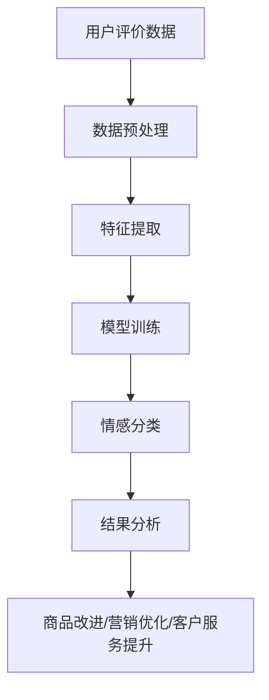

                 

情感分析（Sentiment Analysis），也被称为意见挖掘，是一种自然语言处理（NLP）技术，旨在识别和提取文本中的主观信息。在电商领域，情感分析作为一种强大的工具，能够帮助我们深入了解用户对商品的评价，从而为商品改进、营销策略优化、客户服务提升等提供有力支持。

本文将围绕情感分析在电商领域的应用展开讨论，从核心概念、算法原理、数学模型、项目实践到实际应用场景，以及未来的发展趋势与挑战，全面解析这一技术如何助力电商行业的发展。

## 1. 背景介绍

随着互联网的迅速发展，电商行业已经成为全球经济增长的重要驱动力。然而，消费者对于商品的质量、性能、价格等方面的期望也日益提高。为了满足这些需求，电商企业必须不断创新，优化商品和服务。在这个过程中，用户评价成为了一个宝贵的资源。

用户评价不仅是消费者购物决策的重要参考，也是企业了解市场需求和消费者情感的重要途径。然而，随着评价数据的爆炸式增长，如何高效地分析这些数据，提取有价值的信息，成为了电商企业面临的一大挑战。

情感分析技术的出现，为解决这一问题提供了有效手段。通过对用户评价进行情感分析，电商企业可以快速了解消费者的情感倾向，识别产品优势和不足，从而有针对性地进行商品改进和营销策略调整。

## 2. 核心概念与联系

### 2.1 情感分析的概念

情感分析是一种文本挖掘技术，旨在自动检测和分类文本中的情感倾向。根据情感极性，情感分析可以分为正面情感分析、负面情感分析和中性情感分析。正面情感分析旨在识别文本中的积极情感，负面情感分析则关注文本中的消极情感。

### 2.2 情感分析的架构

情感分析通常包括以下步骤：

1. **数据预处理**：清洗文本数据，去除噪声和无关信息。
2. **特征提取**：从文本中提取有助于情感分类的特征。
3. **模型训练**：使用机器学习算法训练情感分类模型。
4. **情感分类**：对新的文本数据进行情感分类。
5. **结果分析**：分析情感分类结果，提取有价值的信息。

### 2.3 情感分析与电商领域的联系

在电商领域，情感分析的应用主要体现在以下几个方面：

1. **用户评价分析**：通过对用户评价进行情感分析，了解消费者对商品的满意度和不满意度。
2. **商品改进**：根据用户评价的情感分析结果，针对性地改进商品设计和性能。
3. **营销策略优化**：根据用户情感倾向，制定更有效的营销策略。
4. **客户服务提升**：通过情感分析，及时了解客户需求，提供个性化服务。

### 2.4 Mermaid 流程图

下面是情感分析在电商领域的应用流程图：



## 3. 核心算法原理 & 具体操作步骤

### 3.1 算法原理概述

情感分析算法主要分为基于规则的方法和基于机器学习的方法。

- **基于规则的方法**：通过人工定义规则，对文本进行情感分类。这种方法简单直观，但在处理复杂情感时效果不佳。
- **基于机器学习的方法**：使用机器学习算法，从大量标注数据中学习情感分类规则。这种方法具有较强的泛化能力，适用于复杂情感分析。

### 3.2 算法步骤详解

1. **数据收集与预处理**：收集用户评价数据，并进行清洗和预处理，去除噪声和无关信息。
2. **特征提取**：从预处理后的文本中提取特征，如词频、词性、TF-IDF等。
3. **模型选择与训练**：选择合适的机器学习算法（如SVM、朴素贝叶斯、神经网络等）对特征进行训练。
4. **情感分类**：使用训练好的模型对新的用户评价进行情感分类。
5. **结果分析**：分析情感分类结果，提取有价值的信息，如情感分布、情感强度等。

### 3.3 算法优缺点

- **优点**：
  - 高效：能够快速处理大量用户评价数据。
  - 泛化能力强：适用于各种情感分析和多语言情感分析。
  - 可扩展性：可以结合其他NLP技术，如主题建模、文本相似度计算等。

- **缺点**：
  - 数据依赖性：需要大量高质量标注数据。
  - 模型复杂度：训练和优化模型需要大量的计算资源和时间。

### 3.4 算法应用领域

- **电商领域**：用户评价分析、商品改进、营销策略优化、客户服务提升。
- **社交媒体领域**：情感舆情监测、危机管理、品牌声誉分析。
- **金融领域**：股票市场分析、客户满意度评估、风险控制。
- **医疗领域**：患者情绪分析、医疗舆情监测、个性化医疗服务。

## 4. 数学模型和公式 & 详细讲解 & 举例说明

### 4.1 数学模型构建

情感分析中常用的数学模型包括支持向量机（SVM）、朴素贝叶斯（Naive Bayes）、循环神经网络（RNN）等。

- **支持向量机（SVM）**：
  - 目标函数：最小化分类间隔。
  - 分类决策：根据支持向量的线性组合进行分类。
- **朴素贝叶斯（Naive Bayes）**：
  - 基本思想：假设特征之间相互独立。
  - 分类决策：计算每个类别的后验概率，选择概率最大的类别。

### 4.2 公式推导过程

- **支持向量机（SVM）**：
  - 目标函数：
    $$\min_{\boldsymbol{w}, \boldsymbol{b}} \frac{1}{2} ||\boldsymbol{w}||^2 + C \sum_{i=1}^{n} \xi_i$$
  - 分类决策：
    $$y(\boldsymbol{x}_i) = \text{sign}(\boldsymbol{w}^T \boldsymbol{x}_i + \boldsymbol{b})$$
- **朴素贝叶斯（Naive Bayes）**：
  - 后验概率：
    $$P(y=\text{正/负}|\boldsymbol{x}) = \frac{P(\boldsymbol{x}|y=\text{正/负})P(y=\text{正/负})}{P(\boldsymbol{x})}$$
  - 分类决策：
    $$y(\boldsymbol{x}) = \arg\max_y P(y) \prod_{i=1}^{n} P(x_i|y)$$

### 4.3 案例分析与讲解

假设我们有一个用户评价数据集，其中包含正面和负面评价。我们可以使用朴素贝叶斯模型对其进行情感分析。

1. **数据预处理**：将文本数据转换为词袋模型，并提取特征。
2. **特征提取**：计算每个单词的词频，并统计正面和负面评价中的词频。
3. **模型训练**：使用训练集训练朴素贝叶斯模型。
4. **情感分类**：对新的用户评价进行情感分类。
5. **结果分析**：统计正面和负面评价的比例，以及每个类别的后验概率。

通过这个案例，我们可以看到情感分析的基本流程和数学模型的应用。

## 5. 项目实践：代码实例和详细解释说明

### 5.1 开发环境搭建

在开始项目实践之前，我们需要搭建一个合适的开发环境。以下是所需的软件和工具：

- Python 3.x
- Python 包管理器 pip
- NLP 库（如 NLTK、spaCy、TextBlob 等）
- 机器学习库（如 scikit-learn、TensorFlow、PyTorch 等）

安装以上软件和工具后，我们就可以开始编写代码。

### 5.2 源代码详细实现

以下是一个简单的情感分析项目的实现代码：

```python
import nltk
from nltk.corpus import stopwords
from nltk.tokenize import word_tokenize
from sklearn.feature_extraction.text import TfidfVectorizer
from sklearn.model_selection import train_test_split
from sklearn.naive_bayes import MultinomialNB
from sklearn.metrics import accuracy_score, classification_report

# 数据预处理
nltk.download('punkt')
nltk.download('stopwords')

def preprocess_text(text):
    tokens = word_tokenize(text.lower())
    tokens = [token for token in tokens if token.isalpha()]
    tokens = [token for token in tokens if token not in stopwords.words('english')]
    return ' '.join(tokens)

# 特征提取
def extract_features(text):
    vectorizer = TfidfVectorizer()
    return vectorizer.transform([text])

# 模型训练
def train_model(X_train, y_train):
    model = MultinomialNB()
    model.fit(X_train, y_train)
    return model

# 情感分类
def classify_text(model, text):
    features = extract_features(text)
    return model.predict(features)

# 加载数据集
data = [
    ("This product is amazing!", "positive"),
    ("I am very disappointed with this product.", "negative"),
    # 更多数据...
]

X, y = zip(*data)
X = [preprocess_text(text) for text in X]

# 划分训练集和测试集
X_train, X_test, y_train, y_test = train_test_split(X, y, test_size=0.2, random_state=42)

# 训练模型
model = train_model(X_train, y_train)

# 分类测试集
y_pred = classify_text(model, X_test)

# 结果分析
print("Accuracy:", accuracy_score(y_test, y_pred))
print("Classification Report:")
print(classification_report(y_test, y_pred))
```

### 5.3 代码解读与分析

1. **数据预处理**：使用 NLTK 库对文本进行分词、去除停用词和转换为小写。
2. **特征提取**：使用 TF-IDF 向量器将文本转换为特征向量。
3. **模型训练**：使用朴素贝叶斯模型训练分类器。
4. **情感分类**：对新的文本数据进行情感分类。
5. **结果分析**：计算分类准确率，并输出分类报告。

通过这个项目，我们可以看到情感分析的基本实现流程和代码实现。

## 6. 实际应用场景

### 6.1 用户评价分析

用户评价是电商企业了解消费者需求的重要途径。通过情感分析，企业可以快速了解消费者对商品的满意度和不满意度，从而为商品改进提供依据。

- **正面情感分析**：识别用户对商品满意的方面，如产品质量、性能等，为商品改进提供参考。
- **负面情感分析**：识别用户对商品不满意的方面，如物流速度、售后服务等，及时解决客户问题。

### 6.2 商品改进

基于用户评价的情感分析结果，电商企业可以针对性地改进商品设计和性能。例如，针对用户反映的负面情感，企业可以优化商品的功能和售后服务，提高客户满意度。

### 6.3 营销策略优化

情感分析可以帮助企业了解消费者对不同营销策略的偏好，从而优化营销策略。例如，企业可以根据用户情感倾向，调整广告内容、促销活动等，提高营销效果。

### 6.4 客户服务提升

通过情感分析，企业可以实时了解客户的需求和情绪，提供个性化的服务。例如，企业可以针对客户反馈的负面情感，提供及时的解决方案，提升客户满意度。

## 7. 工具和资源推荐

### 7.1 学习资源推荐

- 《自然语言处理综论》（Daniel Jurafsky & James H. Martin）
- 《深度学习》（Ian Goodfellow、Yoshua Bengio、Aaron Courville）
- 《Python 自然语言处理实践》（Steven Lott）

### 7.2 开发工具推荐

- Python
- Jupyter Notebook
- NLTK
- spaCy
- TextBlob
- scikit-learn
- TensorFlow
- PyTorch

### 7.3 相关论文推荐

- "Sentiment Analysis Using Machine Learning Techniques"（机器学习技术在情感分析中的应用）
- "Deep Learning for Sentiment Analysis"（深度学习在情感分析中的应用）
- "Neural Text Classification: A Survey"（神经文本分类技术综述）

## 8. 总结：未来发展趋势与挑战

### 8.1 研究成果总结

情感分析在电商领域的应用取得了显著成果，为用户评价分析、商品改进、营销策略优化、客户服务提升等方面提供了有力支持。

### 8.2 未来发展趋势

1. **多模态情感分析**：结合文本、语音、图像等多模态数据，提高情感分析精度。
2. **低资源情感分析**：针对缺乏标注数据的情况，开发有效的情感分析模型。
3. **实时情感分析**：实现实时情感分析，为电商企业提供更及时的服务。

### 8.3 面临的挑战

1. **数据质量**：情感分析模型的性能依赖于数据质量，如何获取高质量标注数据是一个挑战。
2. **情感理解**：情感分析需要深入理解文本中的情感，目前技术尚不足以完全理解复杂情感。
3. **模型解释性**：如何提高模型的解释性，使企业能够更好地理解和使用情感分析结果。

### 8.4 研究展望

未来，情感分析将在电商领域发挥更大的作用，为企业和消费者提供更加精准和个性化的服务。同时，随着技术的不断进步，情感分析将面临新的挑战，如何应对这些挑战，将决定情感分析在电商领域的未来发展方向。

## 9. 附录：常见问题与解答

### 9.1 情感分析的基本步骤是什么？

情感分析的基本步骤包括数据收集与预处理、特征提取、模型训练、情感分类和结果分析。

### 9.2 哪些算法适用于情感分析？

常用的情感分析算法包括支持向量机（SVM）、朴素贝叶斯（Naive Bayes）、循环神经网络（RNN）、卷积神经网络（CNN）等。

### 9.3 如何评估情感分析模型的性能？

评估情感分析模型性能的主要指标包括准确率、召回率、精确率和F1值。可以使用混淆矩阵、ROC曲线和精确率-召回率曲线等工具进行评估。

### 9.4 情感分析在电商领域的具体应用有哪些？

情感分析在电商领域的具体应用包括用户评价分析、商品改进、营销策略优化、客户服务提升等。

### 9.5 如何获取高质量的标注数据？

获取高质量标注数据的方法包括人工标注、半监督学习和数据增强等。

作者：禅与计算机程序设计艺术 / Zen and the Art of Computer Programming

本文详细介绍了情感分析在电商领域的应用，从背景介绍、核心概念、算法原理、数学模型、项目实践到实际应用场景，全面解析了情感分析技术如何助力电商行业的发展。在未来的研究中，我们期待看到情感分析技术在多模态数据、低资源环境和实时分析等方面的突破。希望本文能为从事相关领域的研究人员和从业者提供有益的参考。

