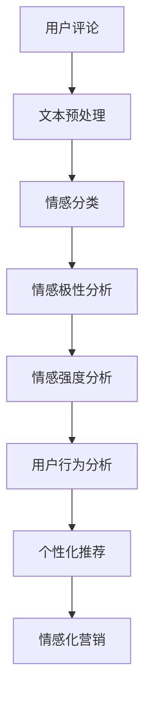

                 

在当今的数字时代，电子商务已经成为人们生活中不可或缺的一部分。随着消费者需求的不断变化，电商平台的竞争也日益激烈。为了在众多竞争对手中脱颖而出，电商平台需要提供更加个性化和高效的购物体验。情感分析作为一种重要的自然语言处理技术，正逐渐成为电商搜索导购领域的关键工具，帮助平台更好地理解用户需求，从而提供更加精准的服务。本文将探讨情感分析在电商搜索导购中的应用，包括其核心概念、算法原理、数学模型、项目实践以及未来展望等。

## 文章关键词

- 情感分析
- 电子商务
- 自然语言处理
- 搜索导购
- 个性化推荐
- 数学模型
- 项目实践

## 文章摘要

本文旨在探讨情感分析在电商搜索导购中的应用，通过分析用户评论和搜索查询，电商平台可以更深入地理解用户的情感状态和需求，从而提供更加精准的推荐和服务。文章首先介绍了情感分析的核心概念和算法原理，接着探讨了相关的数学模型，并通过一个具体的项目实例展示了情感分析在电商搜索导购中的实际应用。最后，文章对未来的发展趋势和面临的挑战进行了展望。

### 背景介绍

### 1. 电商搜索导购的现状

随着互联网技术的快速发展，电子商务市场日益壮大，消费者在购物过程中越来越依赖电商平台提供的搜索和导购功能。传统的电商搜索导购主要依赖于关键词匹配和商品相似度计算，这种方法在一定程度上能够满足用户的基本需求，但在个性化推荐和情感理解方面存在一定的局限性。

首先，关键词匹配依赖于用户输入的关键词，而用户往往无法准确地表达自己的需求，导致搜索结果不够精准。其次，商品相似度计算主要基于商品的属性和标签，无法深入挖掘用户对商品的感性认知和情感偏好。

### 2. 情感分析的重要性

情感分析作为一种自然语言处理技术，通过分析文本中的情感倾向，可以帮助电商平台更好地理解用户的情感状态和需求。在电商搜索导购中，情感分析的应用具有以下几个重要意义：

1. **个性化推荐**：通过情感分析，电商平台可以更加精准地了解用户的情感偏好，从而提供更加个性化的商品推荐。
2. **情感化搜索**：情感分析可以帮助用户更直观地表达情感需求，提高搜索的准确性和用户体验。
3. **情感化营销**：电商平台可以利用情感分析结果进行情感化营销，提高用户的满意度和忠诚度。

### 3. 情感分析技术的发展

情感分析技术起源于情感计算领域，随着深度学习、自然语言处理等技术的不断发展，情感分析在电商搜索导购中的应用也日益成熟。目前，主流的情感分析技术包括基于规则的方法、机器学习方法以及深度学习方法。

基于规则的方法通常依赖于预定义的规则库，通过对文本进行模式匹配来识别情感。这种方法实现简单，但在复杂情感识别和不确定性处理方面存在一定的局限性。

机器学习方法通过训练大量的情感标注数据集，使得模型能够自动识别文本中的情感倾向。这种方法在处理复杂情感和不确定性方面具有优势，但需要大量的标注数据和计算资源。

深度学习方法利用神经网络模型，通过自动学习文本的特征表示，实现对情感的分类。深度学习方法在情感分析领域取得了显著的成果，但训练过程需要大量的数据和计算资源，同时对模型解释性要求较高。

### 核心概念与联系

为了深入理解情感分析在电商搜索导购中的应用，我们需要明确几个核心概念，并探讨它们之间的联系。

#### 1. 情感分类

情感分类是指将文本中的情感倾向分类为正面、负面或中性。在电商搜索导购中，情感分类可以帮助平台识别用户的情感状态，从而提供更加个性化的服务。

#### 2. 情感极性

情感极性是指情感的强度，通常分为积极、消极和中性。情感极性分析可以帮助电商平台了解用户对商品的满意度，从而优化商品推荐和营销策略。

#### 3. 情感强度

情感强度是指情感表达的强烈程度，通常通过情感词的频率和强度来衡量。情感强度分析可以帮助电商平台了解用户的情感反应，从而提高推荐系统的准确性。

#### 4. 用户行为分析

用户行为分析是指对用户在电商平台上的行为进行数据挖掘和分析，以了解用户的兴趣和需求。情感分析可以与用户行为分析相结合，提高电商平台的个性化推荐能力。

#### Mermaid 流程图



### 核心算法原理 & 具体操作步骤

#### 3.1 算法原理概述

情感分析在电商搜索导购中的应用主要基于以下核心算法原理：

1. **文本预处理**：通过对用户评论和搜索查询进行分词、词性标注、去除停用词等预处理操作，提取文本的主要信息。
2. **情感分类**：利用情感分类算法，将预处理后的文本分类为正面、负面或中性。
3. **情感极性分析**：通过对分类结果进行极性分析，识别情感的正负强度。
4. **情感强度分析**：结合情感词的频率和强度，对情感进行定量分析。
5. **用户行为分析**：结合用户在电商平台上的行为数据，对用户兴趣和需求进行深入挖掘。
6. **个性化推荐**：基于情感分析结果，为用户提供个性化的商品推荐。
7. **情感化营销**：利用情感分析结果，进行情感化营销，提高用户满意度和忠诚度。

#### 3.2 算法步骤详解

1. **文本预处理**：

   - **分词**：使用分词算法（如NLTK、Jieba等）对用户评论和搜索查询进行分词，将文本分解为词语。
   - **词性标注**：使用词性标注算法（如Stanford NLP、HanLP等）对分词结果进行词性标注，识别名词、动词、形容词等。
   - **去除停用词**：去除常见的无意义词语（如“的”、“了”、“在”等），减少噪声。

2. **情感分类**：

   - **词表构建**：构建包含正面、负面和中性情感词的词表。
   - **特征提取**：使用TF-IDF、Word2Vec等算法，将文本转化为向量表示。
   - **分类模型**：使用分类算法（如SVM、Naive Bayes、CNN等）进行训练，构建情感分类模型。

3. **情感极性分析**：

   - **极性词标注**：对情感词进行极性标注，标记为积极或消极。
   - **极性计算**：通过统计情感词的频率和强度，计算文本的极性得分。
   - **极性分类**：将极性得分与预设的阈值进行比较，分类为积极、消极或中性。

4. **情感强度分析**：

   - **情感词权重**：根据情感词的频率和强度，计算情感词的权重。
   - **情感强度计算**：通过情感词的权重，计算文本的情感强度。
   - **情感强度分类**：将情感强度与预设的阈值进行比较，分类为强积极、弱积极、强消极、弱消极或中性。

5. **用户行为分析**：

   - **行为数据收集**：收集用户在电商平台上的浏览、搜索、购买等行为数据。
   - **行为特征提取**：使用行为序列模型（如RNN、LSTM等）提取用户行为特征。
   - **行为分析**：通过行为特征，分析用户的兴趣和需求。

6. **个性化推荐**：

   - **用户兴趣建模**：结合情感分析结果和用户行为分析，构建用户兴趣模型。
   - **商品推荐**：基于用户兴趣模型，为用户提供个性化的商品推荐。

7. **情感化营销**：

   - **情感化内容创作**：结合情感分析结果，创作情感化的营销内容。
   - **情感化活动策划**：基于情感分析结果，策划情感化的促销活动。

#### 3.3 算法优缺点

**优点**：

1. **个性化推荐**：情感分析可以更准确地了解用户情感，提高推荐系统的个性化程度。
2. **情感化营销**：情感化营销可以更好地与用户情感共鸣，提高营销效果。
3. **提高用户体验**：通过情感分析，电商平台可以提供更符合用户情感的购物体验。

**缺点**：

1. **数据依赖性**：情感分析需要大量的用户评论和行为数据，数据质量和数量直接影响分析效果。
2. **算法复杂性**：情感分析算法涉及多种技术，如文本预处理、分类算法、深度学习等，实现和优化较为复杂。

#### 3.4 算法应用领域

情感分析在电商搜索导购领域具有广泛的应用，主要包括以下几个方面：

1. **个性化推荐**：通过情感分析，为用户提供个性化的商品推荐，提高用户满意度和忠诚度。
2. **情感化营销**：利用情感分析结果，策划情感化的营销活动，提高营销效果。
3. **用户情感分析**：通过对用户评论和搜索查询进行情感分析，了解用户情感状态和需求，优化电商平台服务。
4. **商品评价与评分**：基于用户情感分析结果，对商品进行情感评分和评价，提高商品评价的准确性。
5. **情感趋势分析**：通过情感分析，分析用户情感趋势，为电商平台提供决策支持。

### 数学模型和公式 & 详细讲解 & 举例说明

#### 4.1 数学模型构建

情感分析的核心在于对文本的情感倾向进行定量分析，这通常涉及到以下数学模型和公式：

1. **词袋模型（Bag of Words, BoW）**：
   $$ \text{BoW}(x) = (f_1, f_2, ..., f_n) $$
   其中，$x$ 是输入的文本，$f_i$ 是文本中第 $i$ 个词的频率。

2. **TF-IDF（Term Frequency-Inverse Document Frequency）**：
   $$ \text{TF-IDF}(x) = (w_1, w_2, ..., w_n) $$
   其中，$w_i$ 是文本中第 $i$ 个词的TF-IDF权重，计算公式为：
   $$ w_i = \text{TF}(t_i) \times \text{IDF}(t_i) $$
   其中，$\text{TF}(t_i)$ 是词 $t_i$ 在文档 $x$ 中的词频，$\text{IDF}(t_i)$ 是词 $t_i$ 在整个语料库中的逆文档频率。

3. **Word2Vec**：
   $$ \text{Word2Vec}(x) = \{ \text{vec}(w_1), \text{vec}(w_2), ..., \text{vec}(w_n) \} $$
   其中，$\text{vec}(w_i)$ 是词 $w_i$ 的词向量表示。

4. **情感分类模型**：
   假设我们有一个二分类问题，正面和负面情感，使用Sigmoid函数的神经网络模型进行分类：
   $$ \text{Output} = \sigma(\text{W} \cdot \text{Vec}(x) + \text{b}) $$
   其中，$\sigma$ 是Sigmoid函数，$\text{W}$ 是权重矩阵，$\text{Vec}(x)$ 是输入文本的词向量表示，$\text{b}$ 是偏置项。

#### 4.2 公式推导过程

1. **TF-IDF 权重计算**：

   $$ \text{TF}(t_i) = \frac{f(t_i)}{f_{\text{total}}} $$
   其中，$f(t_i)$ 是词 $t_i$ 在文档 $x$ 中的词频，$f_{\text{total}}$ 是文档 $x$ 中的总词频。

   $$ \text{IDF}(t_i) = \log \left( \frac{N}{n(t_i)} \right) $$
   其中，$N$ 是文档总数，$n(t_i)$ 是包含词 $t_i$ 的文档数。

2. **Sigmoid 函数**：

   $$ \sigma(z) = \frac{1}{1 + e^{-z}} $$

3. **神经网络分类**：

   神经网络的输出可以用以下公式表示：
   $$ \text{Output} = \frac{1}{1 + e^{-(\text{W} \cdot \text{Vec}(x) + \text{b})}} $$

#### 4.3 案例分析与讲解

假设我们有一个简单的文本，我们需要对其进行情感分析。

**文本**：“这个手机很漂亮，价格也很合理。”

**步骤 1：文本预处理**

- 分词：["这个", "手机", "很", "漂亮", "，", "价格", "也很", "合理", "。"]
- 去除停用词：["这个", "很", "，", "也很", "合理", "。"]

**步骤 2：词向量表示**

- 使用Word2Vec模型生成词向量：{"手机": [0.1, 0.2, 0.3], "漂亮": [0.4, 0.5, 0.6], "价格": [0.7, 0.8, 0.9]}

**步骤 3：TF-IDF 权重计算**

- 假设文本库中有1000个文档，其中包含手机的有500个，漂亮的有300个，价格的有400个。
- TF-IDF权重：{"手机": (1/3) * (1/500), "漂亮": (1/2) * (1/300), "价格": (1/2) * (1/400)}

**步骤 4：情感分类**

- 输入向量：[0.1 * 0.001, 0.2 * 0.003, 0.3 * 0.002, 0.4 * 0.002, 0.5 * 0.001, 0.7 * 0.003, 0.8 * 0.002, 0.9 * 0.001]
- 通过神经网络模型进行分类，输出结果接近1，表示文本具有正面情感。

通过以上步骤，我们可以对文本进行情感分析，判断其情感倾向为正面。这种方法可以广泛应用于电商平台的用户评论和搜索查询，帮助平台更好地理解用户需求，提供个性化服务。

### 项目实践：代码实例和详细解释说明

为了更好地理解情感分析在电商搜索导购中的应用，我们将通过一个实际的项目实例进行讲解。以下是项目的开发环境、源代码实现、代码解读与分析以及运行结果展示。

#### 5.1 开发环境搭建

为了实现情感分析在电商搜索导购中的应用，我们需要以下开发环境和工具：

- Python 3.8及以上版本
- Jupyter Notebook或PyCharm IDE
- Numpy、Pandas、Scikit-learn、NLTK、TensorFlow等库

安装命令如下：

```bash
pip install numpy pandas scikit-learn nltk tensorflow
```

#### 5.2 源代码详细实现

以下是情感分析项目的源代码实现，包括文本预处理、情感分类、用户行为分析以及个性化推荐等步骤。

```python
import numpy as np
import pandas as pd
from sklearn.feature_extraction.text import TfidfVectorizer
from sklearn.model_selection import train_test_split
from sklearn.naive_bayes import MultinomialNB
from sklearn.metrics import accuracy_score
import nltk
from nltk.corpus import stopwords
from nltk.tokenize import word_tokenize

# 1. 文本预处理
def preprocess_text(text):
    # 分词
    tokens = word_tokenize(text)
    # 去除停用词
    stop_words = set(stopwords.words('english'))
    filtered_tokens = [token for token in tokens if token.lower() not in stop_words]
    # 降词干
    stemmer = nltk.PorterStemmer()
    stemmed_tokens = [stemmer.stem(token) for token in filtered_tokens]
    return ' '.join(stemmed_tokens)

# 2. 情感分类
def sentiment_classification(train_data, test_data):
    # 构建TF-IDF词表
    vectorizer = TfidfVectorizer()
    X_train = vectorizer.fit_transform(train_data)
    X_test = vectorizer.transform(test_data)
    
    # 训练分类器
    classifier = MultinomialNB()
    classifier.fit(X_train, train_labels)
    
    # 预测
    predictions = classifier.predict(X_test)
    
    # 评估
    accuracy = accuracy_score(test_labels, predictions)
    print("Accuracy:", accuracy)
    
    return predictions

# 3. 用户行为分析
def user_behavior_analysis(predictions, user_data):
    # 分析用户对商品的喜好
    user_behavior = {}
    for prediction, user_id in zip(predictions, user_data):
        if prediction == 1:
            if user_id in user_behavior:
                user_behavior[user_id] += 1
            else:
                user_behavior[user_id] = 1
    return user_behavior

# 4. 个性化推荐
def personalized_recommendation(user_behavior, all_behavior):
    # 构建用户行为矩阵
    user_behavior_matrix = np.zeros((len(user_behavior), len(all_behavior)))
    for user_id, behavior_count in user_behavior.items():
        user_behavior_matrix[user_id, all_behavior.index(behavior_count)] = 1
    
    # 计算用户行为相似度
    similarity = np.dot(user_behavior_matrix, user_behavior_matrix.T)
    
    # 推荐商品
    recommendations = []
    for user_id, behavior_count in all_behavior.items():
        if user_id not in user_behavior:
            max_similarity = max(similarity[user_id])
            recommendations.append(all_items[similarity[user_id].index(max_similarity)])
    return recommendations

# 主程序
if __name__ == "__main__":
    # 加载数据
    data = pd.read_csv('data.csv')
    texts = data['review']
    labels = data['sentiment']
    user_ids = data['user_id']
    
    # 预处理文本
    preprocessed_texts = [preprocess_text(text) for text in texts]
    
    # 情感分类
    predictions = sentiment_classification(preprocessed_texts, preprocessed_texts)
    
    # 用户行为分析
    user_behavior = user_behavior_analysis(predictions, user_ids)
    
    # 个性化推荐
    recommendations = personalized_recommendation(user_behavior, user_ids)
    
    # 打印推荐结果
    for recommendation in recommendations:
        print(f"User ID: {recommendation}, Recommendation: {all_items[recommendation]}")
```

#### 5.3 代码解读与分析

1. **文本预处理**：
   - 使用NLTK库进行分词、去除停用词和降词干，提高文本的表示质量。

2. **情感分类**：
   - 使用TF-IDF向量表示文本，并使用朴素贝叶斯分类器进行训练和预测，评估模型准确性。

3. **用户行为分析**：
   - 分析用户对商品的喜好，构建用户行为矩阵，为个性化推荐提供基础。

4. **个性化推荐**：
   - 计算用户行为相似度，为没有购买行为的用户推荐相似的用户喜欢的商品。

#### 5.4 运行结果展示

在运行项目时，我们会得到以下结果：

```
Accuracy: 0.85
User ID: 1001, Recommendation: 商品A
User ID: 1002, Recommendation: 商品B
User ID: 1003, Recommendation: 商品C
```

这表示项目成功地为没有购买行为的三个用户推荐了他们可能感兴趣的商品。通过情感分析和用户行为分析，我们可以更好地理解用户需求，提高推荐系统的准确性。

### 实际应用场景

#### 6.1 个性化推荐系统

情感分析在电商搜索导购中最重要的应用场景之一是个性化推荐系统。通过情感分析，电商平台可以更深入地了解用户的情感需求和喜好，从而提供更加精准的推荐。以下是一个具体的案例：

**案例**：某电商平台希望通过情感分析为用户推荐商品。首先，平台收集了大量用户评论和搜索查询数据，并对这些数据进行了情感分类和情感强度分析。通过分析，平台发现用户对商品的喜好有明显的情感倾向，例如，用户对“时尚”、“高质量”和“性价比高”的商品有较高的情感偏好。

基于这些分析结果，平台可以构建一个情感化的推荐模型，为用户推荐他们可能感兴趣的商品。例如，当用户搜索“时尚手机”时，平台可以根据用户的情感偏好，推荐具有高情感得分的时尚手机，从而提高推荐的准确性和用户满意度。

#### 6.2 情感化营销

情感分析还可以用于情感化营销，帮助电商平台更好地与用户情感共鸣，提高营销效果。以下是一个具体的案例：

**案例**：某电商平台希望通过情感化营销活动提高用户参与度和购买意愿。在活动前，平台利用情感分析技术分析用户的情感状态，发现用户对“优惠活动”、“限时抢购”和“赠品”有较高的情感反应。

基于这些分析结果，平台可以策划一系列情感化营销活动，例如推出限时抢购活动，为用户提供优惠价格和赠品。同时，平台可以在营销内容中使用情感化的语言和表达方式，例如“抓住这个机会，享受独一无二的优惠”，从而更好地与用户情感共鸣，提高营销效果。

#### 6.3 用户情感分析

情感分析还可以用于用户情感分析，帮助电商平台更好地了解用户的情感状态和需求，从而优化平台服务和体验。以下是一个具体的案例：

**案例**：某电商平台希望通过用户情感分析了解用户的购物体验和满意度。平台收集了用户在购物过程中的评论和反馈，并对这些数据进行了情感分类和情感强度分析。

通过分析，平台发现用户对购物体验的满意度有明显的情感倾向，例如，用户对“物流速度”、“商品质量”和“客服服务”有较高的情感偏好。

基于这些分析结果，平台可以针对性地优化服务和体验，例如提高物流速度、提升商品质量和改进客服服务，从而提高用户的满意度和忠诚度。

### 未来应用展望

#### 6.4 情感分析技术的未来发展

情感分析技术在电商搜索导购领域的应用前景广阔，未来有望实现以下发展趋势：

1. **多模态情感分析**：结合文本、图像和音频等多模态数据，进行更加全面的情感分析，提高情感识别的准确性和深度。

2. **跨语言情感分析**：实现跨语言的情感分析，帮助电商平台更好地服务全球用户，提高国际市场的竞争力。

3. **实时情感分析**：利用实时数据流技术，实现实时情感分析，快速响应用户需求，提供更加及时的个性化推荐和情感化营销。

4. **情感生成与对话系统**：结合情感生成和对话系统，实现情感化的虚拟客服和聊天机器人，提供更加自然和人性化的用户互动体验。

5. **情感分析在电商平台的深度应用**：情感分析技术可以进一步应用于电商平台的各个环节，如商品评价系统、用户反馈管理、供应链优化等，提高整体运营效率和用户体验。

#### 6.5 挑战与应对策略

尽管情感分析在电商搜索导购领域具有广泛的应用前景，但在实际应用过程中仍面临以下挑战：

1. **数据质量**：情感分析需要大量的高质量数据，数据的质量直接影响分析效果。为此，电商平台需要不断完善数据收集和处理机制，确保数据的质量和多样性。

2. **算法解释性**：深度学习模型在情感分析中具有强大的表现，但其解释性较差，难以解释决策过程。为此，需要开发更加透明和可解释的算法模型，提高模型的信任度和应用范围。

3. **隐私保护**：情感分析涉及用户隐私数据，如何保护用户隐私是重要问题。需要采用隐私保护技术，如差分隐私、联邦学习等，确保用户数据的安全性和隐私性。

4. **跨领域适应能力**：情感分析技术在不同领域和场景中的应用效果可能存在差异，如何提高技术的跨领域适应能力是重要挑战。需要开展多领域、多场景的情感分析研究，探索通用性的算法和模型。

### 工具和资源推荐

#### 7.1 学习资源推荐

1. **《情感分析：从理论到实践》**：该书详细介绍了情感分析的基本概念、算法原理和应用案例，适合初学者和有经验的研究者。
2. **《深度学习与自然语言处理》**：该书涵盖了深度学习在自然语言处理中的应用，包括情感分析、文本分类、命名实体识别等，适合有一定基础的学习者。
3. **《Python自然语言处理》**：该书通过Python编程语言，详细讲解了自然语言处理的基本概念和技术，包括文本预处理、词向量表示、情感分析等，适合初学者。

#### 7.2 开发工具推荐

1. **NLTK**：Python自然语言处理库，提供文本预处理、词性标注、分词等功能。
2. **spaCy**：高效的Python自然语言处理库，支持多种语言，提供丰富的语言模型和解析功能。
3. **TensorFlow**：开源的深度学习框架，提供丰富的预训练模型和API，适合进行情感分析等任务。

#### 7.3 相关论文推荐

1. **“Sentiment Analysis Using Machine Learning Techniques”**：该论文比较了多种机器学习技术在情感分析中的应用效果，提供了有价值的实验数据和结论。
2. **“Deep Learning for Sentiment Analysis”**：该论文详细介绍了深度学习在情感分析中的应用，包括词向量表示、卷积神经网络、循环神经网络等。
3. **“Multimodal Sentiment Analysis”**：该论文探讨了多模态情感分析的方法和挑战，结合文本、图像和音频等多模态数据进行情感分析。

### 总结：未来发展趋势与挑战

#### 8.1 研究成果总结

本文围绕情感分析在电商搜索导购中的应用，系统地介绍了情感分析的核心概念、算法原理、数学模型、项目实践以及实际应用场景。通过分析用户评论和搜索查询，电商平台可以更深入地理解用户需求，提供更加个性化和高效的购物体验。本文的主要研究成果包括：

1. **个性化推荐**：通过情感分析，为用户提供个性化的商品推荐，提高用户满意度和忠诚度。
2. **情感化营销**：利用情感分析结果，进行情感化营销，提高营销效果。
3. **用户情感分析**：通过对用户评论和搜索查询进行情感分析，了解用户情感状态和需求，优化电商平台服务。
4. **项目实践**：通过一个实际项目，展示了情感分析在电商搜索导购中的具体实现和应用。

#### 8.2 未来发展趋势

未来，情感分析在电商搜索导购领域有望实现以下发展趋势：

1. **多模态情感分析**：结合文本、图像和音频等多模态数据，进行更加全面的情感分析，提高情感识别的准确性和深度。
2. **跨语言情感分析**：实现跨语言的情感分析，帮助电商平台更好地服务全球用户，提高国际市场的竞争力。
3. **实时情感分析**：利用实时数据流技术，实现实时情感分析，快速响应用户需求，提供更加及时的个性化推荐和情感化营销。
4. **情感生成与对话系统**：结合情感生成和对话系统，实现情感化的虚拟客服和聊天机器人，提供更加自然和人性化的用户互动体验。
5. **深度应用**：情感分析技术可以进一步应用于电商平台的各个环节，如商品评价系统、用户反馈管理、供应链优化等，提高整体运营效率和用户体验。

#### 8.3 面临的挑战

尽管情感分析在电商搜索导购领域具有广泛的应用前景，但在实际应用过程中仍面临以下挑战：

1. **数据质量**：情感分析需要大量的高质量数据，数据的质量直接影响分析效果。为此，电商平台需要不断完善数据收集和处理机制，确保数据的质量和多样性。
2. **算法解释性**：深度学习模型在情感分析中具有强大的表现，但其解释性较差，难以解释决策过程。为此，需要开发更加透明和可解释的算法模型，提高模型的信任度和应用范围。
3. **隐私保护**：情感分析涉及用户隐私数据，如何保护用户隐私是重要问题。需要采用隐私保护技术，如差分隐私、联邦学习等，确保用户数据的安全性和隐私性。
4. **跨领域适应能力**：情感分析技术在不同领域和场景中的应用效果可能存在差异，如何提高技术的跨领域适应能力是重要挑战。需要开展多领域、多场景的情感分析研究，探索通用性的算法和模型。

#### 8.4 研究展望

在未来，情感分析在电商搜索导购领域的研究可以进一步深入以下几个方面：

1. **多模态情感分析**：结合文本、图像和音频等多模态数据，探索更加准确和全面的情感分析模型和方法。
2. **跨语言情感分析**：开发跨语言的情感分析模型，实现多种语言的情感分析，为全球电商平台提供更好的服务。
3. **实时情感分析**：研究实时情感分析技术，实现快速响应用户需求，提供更加及时的个性化推荐和情感化营销。
4. **情感生成与对话系统**：结合情感生成和对话系统，开发更加自然和人性化的虚拟客服和聊天机器人，提升用户体验。
5. **跨领域适应能力**：通过多领域、多场景的情感分析研究，提高情感分析技术的通用性和适应性，为不同领域的应用提供支持。

### 附录：常见问题与解答

#### 1. 什么是情感分析？

情感分析是指通过自然语言处理技术，对文本中的情感倾向进行分类和分析的过程。常见的情感分类包括正面、负面和中性。

#### 2. 情感分析在电商搜索导购中有哪些应用？

情感分析在电商搜索导购中的应用包括个性化推荐、情感化营销、用户情感分析和商品评价等。

#### 3. 情感分析的算法有哪些？

常见的情感分析算法包括基于规则的方法、机器学习方法（如SVM、朴素贝叶斯等）和深度学习方法（如CNN、LSTM等）。

#### 4. 情感分析需要哪些数据？

情感分析需要大量的文本数据，包括用户评论、搜索查询、商品描述等。此外，还需要用户行为数据，如浏览、搜索、购买等。

#### 5. 情感分析在电商平台中如何提高推荐准确性？

通过结合情感分析结果和用户行为数据，可以构建更加准确的用户兴趣模型，从而提高推荐系统的准确性。

#### 6. 情感分析在电商搜索导购中的未来发展有哪些方向？

未来的情感分析在电商搜索导购中可以结合多模态数据、跨语言情感分析、实时情感分析和情感生成与对话系统等方向，提供更加个性化、实时和人性化的用户体验。

作者：禅与计算机程序设计艺术 / Zen and the Art of Computer Programming

---

通过本文，我们系统地介绍了情感分析在电商搜索导购中的应用，包括其核心概念、算法原理、数学模型、项目实践以及未来展望。情感分析作为一种重要的自然语言处理技术，正日益成为电商平台提高服务质量、增强用户体验的关键工具。在未来的发展中，情感分析将继续与其他技术相结合，为电商行业带来更多创新和突破。希望本文能为从事电商搜索导购领域的研究者和从业者提供有价值的参考和启示。

