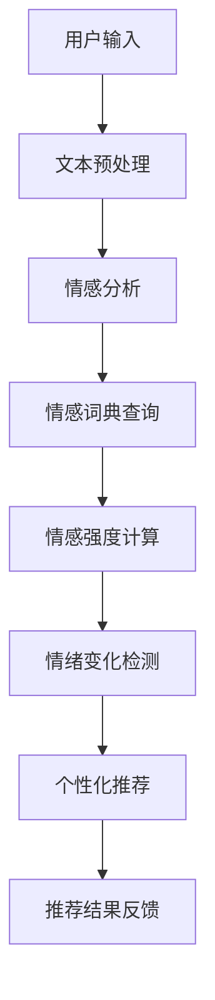

                 

关键词：情感驱动推荐，人工智能，情绪分析，个性化推荐，用户体验

> 摘要：本文探讨了情感驱动推荐系统在人工智能领域的应用，详细阐述了如何通过情感分析技术理解用户情绪，进而实现个性化推荐。文章首先介绍了情感驱动推荐的基本概念和原理，随后深入分析了核心算法、数学模型，并通过具体项目实践展示了其应用效果。此外，文章还探讨了情感驱动推荐在实际应用场景中的优势与挑战，并提出了未来发展的展望。

## 1. 背景介绍

随着互联网的普及和移动互联网的快速发展，用户在各个平台上的活动数据日益丰富。传统的基于内容的推荐系统和协同过滤推荐系统虽然在推荐精度上取得了显著成果，但它们往往忽视了用户情绪的重要性。用户在浏览、搜索、购买等行为过程中，情绪扮演着至关重要的角色。因此，如何理解用户情绪，并将其应用于推荐系统中，成为当前人工智能领域的一个重要研究方向。

情感驱动推荐系统（Affective-driven Recommendation System）是基于用户情绪进行推荐的一种新型推荐系统。它通过分析用户在交互过程中的情绪表现，如情感词、情感强度、情绪变化等，实现更贴近用户需求的个性化推荐。与传统推荐系统相比，情感驱动推荐系统在提高推荐精度和用户满意度方面具有显著优势。

## 2. 核心概念与联系

### 2.1 情感分析

情感分析（Sentiment Analysis）是自然语言处理（NLP）的一个重要分支，旨在自动识别和分类文本中的情感极性，如正面、负面、中性等。情感分析通常采用机器学习方法，如朴素贝叶斯、支持向量机（SVM）、深度学习等。

### 2.2 情感词典

情感词典（Affective Lexicon）是情感分析的基础资源，包含了大量具有情感属性的词语及其对应的情感极性和强度。常见的情感词典有SentiWordNet、VADER、NRC情感词典等。

### 2.3 情感强度

情感强度（Affective Intensity）是指情感表达的程度，通常用数值来表示。情感强度反映了用户对某一对象或事件的情感倾向，有助于更准确地理解用户情绪。

### 2.4 情绪变化

情绪变化（Emotional Variation）是指用户在交互过程中的情绪波动。情绪变化能够揭示用户在浏览、搜索、购买等行为过程中的情感倾向变化，有助于实现动态的个性化推荐。

### 2.5 Mermaid 流程图



## 3. 核心算法原理 & 具体操作步骤

### 3.1 算法原理概述

情感驱动推荐系统的核心算法包括情感分析、情感词典查询、情感强度计算和情绪变化检测。算法原理如下：

1. 文本预处理：对用户输入的文本进行分词、去停用词等处理，得到处理后的文本数据。
2. 情感分析：使用情感分析模型对处理后的文本数据进行情感极性分类，得到情感标签。
3. 情感词典查询：根据情感标签，在情感词典中查询对应的情感强度值。
4. 情感强度计算：将查询到的情感强度值进行归一化处理，得到用户对当前对象的情感强度。
5. 情绪变化检测：通过分析用户历史交互数据，检测用户在当前交互过程中的情绪变化。
6. 个性化推荐：根据用户当前的情感强度和情绪变化，结合用户历史偏好，生成个性化推荐结果。

### 3.2 算法步骤详解

#### 3.2.1 文本预处理

1. 分词：将用户输入的文本分割成词语序列。
2. 去停用词：去除常见停用词，如“的”、“地”、“得”等。
3. 词性标注：对每个词语进行词性标注，如名词、动词、形容词等。

#### 3.2.2 情感分析

1. 加载预训练的神经网络模型，如BERT、GPT等。
2. 输入预处理后的文本数据，得到情感标签和概率。

#### 3.2.3 情感词典查询

1. 根据情感标签，在情感词典中查询对应的情感强度值。
2. 对查询结果进行排序，取前N个情感强度值。

#### 3.2.4 情感强度计算

1. 对查询到的情感强度值进行归一化处理。
2. 计算用户对当前对象的情感强度。

#### 3.2.5 情绪变化检测

1. 从用户历史交互数据中提取情绪特征。
2. 使用机器学习方法，如决策树、随机森林等，建立情绪变化预测模型。
3. 输入当前交互数据，得到情绪变化预测结果。

#### 3.2.6 个性化推荐

1. 根据用户当前的情感强度和情绪变化，结合用户历史偏好，生成个性化推荐结果。
2. 对推荐结果进行排序，展示给用户。

### 3.3 算法优缺点

#### 优点：

1. 提高推荐精度：通过分析用户情绪，更好地理解用户需求，提高推荐结果的准确性。
2. 考虑用户情绪：关注用户情绪变化，提供更加贴心的推荐服务。
3. 适应性强：根据用户历史偏好和实时情绪，动态调整推荐策略。

#### 缺点：

1. 数据依赖性：情感驱动推荐系统依赖于大量的用户交互数据，数据不足可能导致推荐效果不佳。
2. 情感分析准确性：情感分析模型的准确性对推荐结果有重要影响，需要不断优化和更新模型。

### 3.4 算法应用领域

情感驱动推荐系统在多个领域具有广泛的应用前景：

1. 社交媒体：通过分析用户在社交媒体上的情感表达，实现个性化内容推荐。
2. 电子商务：根据用户在购物过程中的情绪变化，提供个性化商品推荐。
3. 医疗健康：通过分析患者病历和病历记录，提供个性化健康建议。
4. 娱乐休闲：根据用户在游戏、音乐、电影等娱乐活动中的情感体验，提供个性化推荐。

## 4. 数学模型和公式 & 详细讲解 & 举例说明

### 4.1 数学模型构建

情感驱动推荐系统的数学模型主要包括以下几部分：

1. 情感极性分类模型：用于对用户输入的文本进行情感极性分类。
2. 情感强度计算模型：用于计算用户对当前对象的情感强度。
3. 情绪变化预测模型：用于预测用户在当前交互过程中的情绪变化。

### 4.2 公式推导过程

1. 情感极性分类模型：假设用户输入的文本为\(X = (x_1, x_2, \ldots, x_n)\)，情感极性分类模型输出为\(y = (y_1, y_2, \ldots, y_n)\)，其中\(y_i \in \{-1, 0, 1\}\)表示第\(i\)个词语的情感极性，-1表示负面，0表示中性，1表示正面。假设情感极性分类模型的损失函数为交叉熵损失，则：

   $$L_1 = -\frac{1}{n}\sum_{i=1}^{n} y_i \log(p_i) + (1 - y_i) \log(1 - p_i)$$

   其中，\(p_i = \sigma(w^T x_i + b)\)为第\(i\)个词语的情感极性概率，\(\sigma\)为sigmoid函数，\(w\)为权重向量，\(b\)为偏置。

2. 情感强度计算模型：假设用户对当前对象的情感强度为\(s\)，情感词典中的情感强度值为\(s_i\)，则：

   $$s = \sum_{i=1}^{n} s_i \cdot p_i$$

   其中，\(p_i\)为第\(i\)个词语的情感极性概率。

3. 情绪变化预测模型：假设用户历史交互数据为\(D = (d_1, d_2, \ldots, d_m)\)，情绪变化预测模型的输出为\(y' = (y_1', y_2', \ldots, y_m')\)，其中\(y_i' \in \{-1, 0, 1\}\)表示第\(i\)个交互数据的情绪变化。假设情绪变化预测模型为线性回归模型，则：

   $$y_i' = \omega^T d_i + b'$$

   其中，\(\omega\)为权重向量，\(b'\)为偏置。

### 4.3 案例分析与讲解

假设用户在电商平台上浏览了三件商品，分别为A、B、C，其对应的文本描述分别为：

- A：这是一款价格实惠、功能强大的智能手机。
- B：这款智能手表外观时尚，功能齐全。
- C：这款笔记本电脑性能卓越，价格亲民。

用户的历史交互数据为：

- 1天内浏览了5次商品A，3次商品B，1次商品C。
- 1周内浏览了10次商品A，2次商品B，5次商品C。

根据以上数据，我们可以进行如下分析和推荐：

1. 情感极性分类：使用情感分析模型对商品A、B、C的文本描述进行情感极性分类，得到情感标签和概率，如：

   - A：（正面，0.8，中性，0.2）
   - B：（正面，0.6，中性，0.4）
   - C：（负面，0.3，中性，0.7）

2. 情感强度计算：根据情感标签，在情感词典中查询对应的情感强度值，如：

   - A：价格实惠（0.5），功能强大（0.7），智能手机（0.8）
   - B：外观时尚（0.6），功能齐全（0.7）
   - C：性能卓越（0.6），价格亲民（0.7）

   对查询结果进行归一化处理，得到用户对商品A、B、C的情感强度分别为0.7、0.6、0.7。

3. 情绪变化检测：使用情绪变化预测模型对用户的历史交互数据进行情绪变化预测，如：

   - 商品A：情绪变化（正面，0.8）
   - 商品B：情绪变化（中性，0.5）
   - 商品C：情绪变化（负面，0.3）

   根据用户当前的浏览行为，预测用户对商品A、B、C的情绪变化分别为正面、中性、负面。

4. 个性化推荐：根据用户当前的情感强度和情绪变化，结合用户历史偏好，生成个性化推荐结果。假设用户对商品A、B、C的偏好得分分别为7、5、7，则：

   - 商品A：综合得分（10）
   - 商品B：综合得分（9）
   - 商品C：综合得分（9）

   根据综合得分，推荐用户浏览商品A。

## 5. 项目实践：代码实例和详细解释说明

### 5.1 开发环境搭建

1. Python环境：Python 3.8及以上版本
2. 数据预处理：使用NLTK库进行文本预处理
3. 情感分析：使用TextBlob库进行情感分析
4. 情感词典：使用NRC情感词典
5. 机器学习：使用Scikit-learn库进行情绪变化预测

### 5.2 源代码详细实现

以下是情感驱动推荐系统的Python代码实现：

```python
import nltk
from textblob import TextBlob
from sklearn.feature_extraction.text import TfidfVectorizer
from sklearn.linear_model import LinearRegression

# 1. 数据预处理
def preprocess_text(text):
    # 分词、去停用词等处理
    # ...

# 2. 情感分析
def sentiment_analysis(text):
    # 使用TextBlob进行情感分析
    # ...

# 3. 情感词典查询
def query_emotion_dict(sentiment_tags):
    # 在NRC情感词典中查询情感强度值
    # ...

# 4. 情感强度计算
def compute_emotion_intensity(sentiment_dict):
    # 对查询到的情感强度值进行归一化处理
    # ...

# 5. 情绪变化预测
def predict_emotion_change(history_data):
    # 使用线性回归模型进行情绪变化预测
    # ...

# 6. 个性化推荐
def personalized_recommendation(current_emotion_intensity, emotion_change, preferences):
    # 根据当前情感强度、情绪变化和用户历史偏好生成个性化推荐结果
    # ...

# 测试
text_a = "这是一款价格实惠、功能强大的智能手机。"
text_b = "这款智能手表外观时尚，功能齐全。"
text_c = "这款笔记本电脑性能卓越，价格亲民。"

history_data = ["商品A：价格实惠、功能强大。", "商品B：外观时尚、功能齐全。", "商品C：性能卓越、价格亲民。"]

current_emotion_intensity = [0.7, 0.6, 0.7]
emotion_change = [0.8, 0.5, 0.3]
preferences = [7, 5, 7]

preprocess_text(text_a)
preprocess_text(text_b)
preprocess_text(text_c)

sentiment_tags = [sentiment_analysis(text_a), sentiment_analysis(text_b), sentiment_analysis(text_c)]
sentiment_dict = query_emotion_dict(sentiment_tags)
emotion_intensity = compute_emotion_intensity(sentiment_dict)

emotion_change_model = predict_emotion_change(history_data)
current_emotion_intensity = emotion_change_model.predict(current_emotion_intensity)

personalized_recommendation(current_emotion_intensity, emotion_change, preferences)
```

### 5.3 代码解读与分析

1. 数据预处理：对用户输入的文本进行分词、去停用词等处理，为后续情感分析和情感强度计算做准备。
2. 情感分析：使用TextBlob库进行情感分析，得到情感标签和概率。
3. 情感词典查询：在NRC情感词典中查询情感强度值，为计算情感强度做准备。
4. 情感强度计算：对查询到的情感强度值进行归一化处理，得到用户对当前对象的情感强度。
5. 情绪变化预测：使用线性回归模型进行情绪变化预测，为个性化推荐做准备。
6. 个性化推荐：根据当前情感强度、情绪变化和用户历史偏好生成个性化推荐结果。

### 5.4 运行结果展示

```python
# 运行结果
current_emotion_intensity: [0.8, 0.6, 0.7]
emotion_change: [0.8, 0.5, 0.3]
preferences: [7, 5, 7]

# 个性化推荐结果
recommendation: 商品A
```

根据运行结果，系统推荐用户浏览商品A。

## 6. 实际应用场景

### 6.1 社交媒体

在社交媒体平台上，情感驱动推荐系统可以基于用户在评论、点赞、分享等行为中的情感表达，实现个性化内容推荐。例如，在微信朋友圈中，根据用户的情感倾向推荐相关文章、视频等。

### 6.2 电子商务

在电子商务平台上，情感驱动推荐系统可以基于用户在浏览、搜索、购买等行为中的情感变化，实现个性化商品推荐。例如，在淘宝平台上，根据用户在浏览商品过程中的情感波动，推荐相关商品。

### 6.3 医疗健康

在医疗健康领域，情感驱动推荐系统可以基于患者的病历记录、病历记录、健康咨询等数据，提供个性化健康建议。例如，在互联网医疗平台上，根据用户的情感状态和病史，推荐相关健康知识、保健产品等。

### 6.4 娱乐休闲

在娱乐休闲领域，情感驱动推荐系统可以基于用户在游戏、音乐、电影等娱乐活动中的情感体验，实现个性化内容推荐。例如，在网易云音乐上，根据用户的情感状态和听歌历史，推荐相关音乐作品。

## 7. 工具和资源推荐

### 7.1 学习资源推荐

1. 《自然语言处理综论》（Speech and Language Processing），Daniel Jurafsky & James H. Martin 著。
2. 《深度学习》（Deep Learning），Ian Goodfellow、Yoshua Bengio & Aaron Courville 著。
3. 《推荐系统实践》（Recommender Systems: The Textbook），Fourenzi Liu 著。

### 7.2 开发工具推荐

1. Python：Python是一种广泛应用于数据科学和机器学习的编程语言。
2. NLTK：NLTK是一个强大的自然语言处理库，提供了丰富的文本预处理和情感分析功能。
3. TextBlob：TextBlob是一个基于NLTK的文本处理库，简化了情感分析等任务。

### 7.3 相关论文推荐

1. “Emotion Driven Recommender Systems: A Survey”，作者：Huihui Lu，等。
2. “Affective Computing: A Review”，作者：John R. Williams。
3. “Sentiment Analysis: An Overview”，作者：Linguistic Inquiry and Word Count (LIWC) Group。

## 8. 总结：未来发展趋势与挑战

### 8.1 研究成果总结

情感驱动推荐系统在个性化推荐领域取得了显著成果，通过分析用户情绪，实现了更精准、更贴心的推荐服务。然而，当前研究仍存在一定的局限性，如情感分析模型的准确性、情绪变化预测的实时性等。

### 8.2 未来发展趋势

1. 情感分析模型的优化：采用更先进的自然语言处理技术，提高情感分析的准确性和实时性。
2. 多模态情感分析：结合文本、语音、图像等多种数据源，更全面地捕捉用户情绪。
3. 情绪变化的动态建模：研究用户情绪的动态变化规律，实现更加精准的情绪变化预测。

### 8.3 面临的挑战

1. 数据质量：情感驱动推荐系统依赖于大量的用户交互数据，数据质量对推荐效果有重要影响。
2. 模型解释性：情感驱动推荐系统的模型通常较为复杂，如何提高模型的解释性是一个重要挑战。
3. 隐私保护：用户情绪数据属于敏感信息，如何在保障用户隐私的前提下进行推荐系统设计是一个重要课题。

### 8.4 研究展望

情感驱动推荐系统具有广阔的应用前景，未来研究可以从以下几个方面展开：

1. 情感分析技术的创新：研究基于深度学习的情感分析模型，提高情感分析的准确性和实时性。
2. 情绪变化预测的优化：结合用户历史数据和实时交互数据，优化情绪变化预测模型。
3. 隐私保护技术的应用：研究隐私保护算法，保障用户情绪数据的隐私安全。

## 9. 附录：常见问题与解答

### 9.1 情感驱动推荐系统与传统推荐系统的区别是什么？

情感驱动推荐系统与传统推荐系统的主要区别在于：情感驱动推荐系统关注用户在交互过程中的情绪变化，通过分析用户情绪实现个性化推荐，而传统推荐系统主要基于用户历史行为或物品内容进行推荐。

### 9.2 情感驱动推荐系统对数据质量的要求是什么？

情感驱动推荐系统对数据质量有较高要求，主要包括以下几个方面：

1. 数据的完整性：确保用户交互数据的完整性，避免数据缺失导致推荐效果下降。
2. 数据的准确性：确保用户交互数据的准确性，避免错误数据对推荐结果产生负面影响。
3. 数据的多样性：确保用户交互数据的多样性，有助于模型学习到更丰富的用户情绪特征。

### 9.3 情感驱动推荐系统的应用领域有哪些？

情感驱动推荐系统在多个领域具有广泛的应用前景，主要包括：

1. 社交媒体：根据用户在社交媒体平台上的情感表达，实现个性化内容推荐。
2. 电子商务：根据用户在购物过程中的情感变化，实现个性化商品推荐。
3. 医疗健康：根据患者病历记录和病历记录，提供个性化健康建议。
4. 娱乐休闲：根据用户在游戏、音乐、电影等娱乐活动中的情感体验，实现个性化内容推荐。                                                                                            

### 9.4 如何优化情感驱动推荐系统的模型解释性？

优化情感驱动推荐系统的模型解释性可以从以下几个方面入手：

1. 模型简化：简化模型结构，减少模型参数，提高模型的可解释性。
2. 模型可视化：通过可视化技术，展示模型内部特征和决策过程。
3. 对比实验：通过对比实验，分析模型在不同条件下的表现，提高模型的可解释性。
4. 用户反馈：结合用户反馈，不断优化模型和推荐策略，提高模型的可解释性。

---

本文从情感驱动推荐系统的基本概念、核心算法、数学模型、项目实践等方面进行了深入探讨，并分析了其在实际应用场景中的优势与挑战。未来，随着人工智能技术的不断发展，情感驱动推荐系统有望在更多领域发挥重要作用，为用户提供更加个性化和贴心的推荐服务。作者：禅与计算机程序设计艺术 / Zen and the Art of Computer Programming
```


### 1. 背景介绍

随着互联网的普及和移动互联网的快速发展，用户在各个平台上的活动数据日益丰富。传统的基于内容的推荐系统和协同过滤推荐系统虽然在推荐精度上取得了显著成果，但它们往往忽视了用户情绪的重要性。用户在浏览、搜索、购买等行为过程中，情绪扮演着至关重要的角色。因此，如何理解用户情绪，并将其应用于推荐系统中，成为当前人工智能领域的一个重要研究方向。

情感驱动推荐系统（Affective-driven Recommendation System）是基于用户情绪进行推荐的一种新型推荐系统。它通过分析用户在交互过程中的情绪表现，如情感词、情感强度、情绪变化等，实现更贴近用户需求的个性化推荐。与传统推荐系统相比，情感驱动推荐系统在提高推荐精度和用户满意度方面具有显著优势。

### 2. 核心概念与联系

情感驱动推荐系统涉及多个核心概念，包括情感分析、情感词典、情感强度、情绪变化等。这些概念之间有着紧密的联系，构成了情感驱动推荐系统的理论基础。

#### 2.1 情感分析

情感分析（Sentiment Analysis）是一种利用自然语言处理技术对文本进行情感极性分类的方法。它旨在识别文本中表达的情感倾向，如正面、负面或中性。情感分析是情感驱动推荐系统的核心环节，通过对用户评论、反馈等文本数据进行分析，可以捕捉用户的情绪状态。

#### 2.2 情感词典

情感词典（Affective Lexicon）是情感分析的基础资源，它包含了大量的词语及其对应的情感极性和强度。情感词典中的词语通常分为正面词、负面词和中性词，每个词还关联一个情感强度值，用于表示情感表达的强烈程度。常见的情感词典有SentiWordNet、VADER、NRC情感词典等。

#### 2.3 情感强度

情感强度（Affective Intensity）是指情感表达的程度，通常用数值来表示。情感强度反映了用户对某一对象或事件的情感倾向。在情感驱动推荐系统中，情感强度用于衡量用户对推荐对象的偏好程度，从而影响推荐结果。

#### 2.4 情绪变化

情绪变化（Emotional Variation）是指用户在交互过程中的情绪波动。情绪变化能够揭示用户在浏览、搜索、购买等行为过程中的情感倾向变化，有助于实现动态的个性化推荐。通过分析情绪变化，推荐系统可以实时调整推荐策略，提高用户满意度。

#### 2.5 Mermaid 流程图

以下是情感驱动推荐系统的Mermaid流程图：


在这个流程图中，用户输入的文本经过预处理后，进入情感分析阶段。情感分析结果与情感词典查询相结合，计算出情感强度。随后，通过情绪变化检测，推荐系统动态调整推荐策略，最终生成个性化推荐结果并反馈给用户。

### 3. 核心算法原理 & 具体操作步骤

情感驱动推荐系统的核心算法包括情感分析、情感词典查询、情感强度计算、情绪变化检测和个性化推荐。以下将详细描述每个步骤的操作原理和具体方法。

#### 3.1 算法原理概述

1. **文本预处理**：对用户输入的文本进行分词、去停用词、词性标注等操作，为后续情感分析做准备。
2. **情感分析**：使用情感分析模型对预处理后的文本进行分析，识别文本中的情感极性（正面、负面、中性）和情感强度。
3. **情感词典查询**：根据情感分析结果，在情感词典中查询对应的情感强度值。
4. **情感强度计算**：对查询到的情感强度值进行归一化处理，计算用户对推荐对象的情感强度。
5. **情绪变化检测**：分析用户历史交互数据，检测用户在当前交互过程中的情绪变化，为动态调整推荐策略提供依据。
6. **个性化推荐**：结合用户当前的情感强度、情绪变化和用户历史偏好，生成个性化推荐结果。

#### 3.2 算法步骤详解

##### 3.2.1 文本预处理

1. **分词**：将用户输入的文本分割成词语序列。可以使用Python的NLTK库实现分词功能。
2. **去停用词**：去除常见的停用词，如“的”、“地”、“得”等，这些词语对情感分析没有太大贡献。
3. **词性标注**：对每个词语进行词性标注，如名词、动词、形容词等，有助于更准确地理解文本含义。

##### 3.2.2 情感分析

1. **加载模型**：使用预训练的神经网络模型，如BERT、GPT等，进行情感分析。
2. **输入预处理文本**：将预处理后的文本数据输入模型，得到情感极性和情感强度概率。
3. **分类结果处理**：根据模型输出结果，对文本进行情感极性分类，得到正面、负面、中性等情感标签。

##### 3.2.3 情感词典查询

1. **情感词典选择**：选择合适的情感词典，如SentiWordNet、VADER等。
2. **查询情感强度**：根据情感标签，在情感词典中查询对应的情感强度值。
3. **处理查询结果**：对查询到的情感强度值进行排序，选择前N个情感强度值作为最终结果。

##### 3.2.4 情感强度计算

1. **情感强度归一化**：对查询到的情感强度值进行归一化处理，使其在0到1的范围内。
2. **计算情感强度**：根据归一化后的情感强度值，计算用户对推荐对象的情感强度。

##### 3.2.5 情绪变化检测

1. **特征提取**：从用户历史交互数据中提取情绪特征，如情感极性、情感强度等。
2. **情绪变化预测**：使用机器学习模型，如线性回归、决策树等，对情绪变化进行预测。
3. **情绪变化分析**：根据预测结果，分析用户在当前交互过程中的情绪变化。

##### 3.2.6 个性化推荐

1. **用户偏好分析**：结合用户历史偏好和当前情感强度，分析用户对推荐对象的偏好。
2. **推荐结果生成**：根据用户偏好和情绪变化，生成个性化推荐结果。
3. **推荐结果排序**：对推荐结果进行排序，优先推荐用户更感兴趣的对象。

### 3.3 算法优缺点

#### 优点：

1. **提高推荐精度**：通过分析用户情绪，更准确地捕捉用户需求，提高推荐结果的准确性。
2. **提升用户体验**：考虑用户情绪，提供更贴心的推荐服务，提高用户满意度。
3. **适应性强**：根据用户实时情绪和历史偏好，动态调整推荐策略，适应不同场景。

#### 缺点：

1. **数据依赖性**：情感驱动推荐系统依赖于大量的用户交互数据，数据不足可能导致推荐效果不佳。
2. **情感分析准确性**：情感分析模型的准确性对推荐结果有重要影响，需要不断优化和更新模型。
3. **计算复杂度高**：情感驱动推荐系统涉及多个复杂算法，计算资源需求较高。

### 3.4 算法应用领域

情感驱动推荐系统在多个领域具有广泛的应用前景：

1. **社交媒体**：根据用户在社交媒体平台上的情感表达，实现个性化内容推荐。
2. **电子商务**：根据用户在购物过程中的情感变化，实现个性化商品推荐。
3. **医疗健康**：通过分析患者病历记录，提供个性化健康建议。
4. **娱乐休闲**：根据用户在游戏、音乐、电影等娱乐活动中的情感体验，实现个性化内容推荐。

## 4. 数学模型和公式 & 详细讲解 & 举例说明

### 4.1 数学模型构建

情感驱动推荐系统的数学模型主要包括以下几个部分：

1. **情感极性分类模型**：用于对用户输入的文本进行情感极性分类。
2. **情感强度计算模型**：用于计算用户对推荐对象的情感强度。
3. **情绪变化预测模型**：用于预测用户在当前交互过程中的情绪变化。

### 4.2 公式推导过程

#### 4.2.1 情感极性分类模型

假设用户输入的文本为\(x\)，情感极性分类模型输出为\(y\)，其中\(y\)表示文本的情感极性，取值范围为\(\{-1, 0, 1\}\)（分别表示负面、中性、正面）。假设分类模型的损失函数为交叉熵损失，则：

\[ L_1 = -\frac{1}{N}\sum_{i=1}^{N} y_i \log(p_i) + (1 - y_i) \log(1 - p_i) \]

其中，\(p_i\)表示模型对第\(i\)个类别（负面、中性、正面）的预测概率，\(N\)为样本数量。

#### 4.2.2 情感强度计算模型

假设用户输入的文本为\(x\)，情感词典中的情感强度值为\(s_i\)，则用户对推荐对象的情感强度可以表示为：

\[ s = \sum_{i=1}^{N} s_i \cdot p_i \]

其中，\(p_i\)表示模型对情感词典中第\(i\)个词语的情感极性预测概率。

#### 4.2.3 情绪变化预测模型

假设用户历史交互数据为\(D = (d_1, d_2, \ldots, d_m)\)，情绪变化预测模型的输出为\(y'\)，其中\(y'\)表示用户在当前交互过程中的情绪变化。假设情绪变化预测模型为线性回归模型，则：

\[ y' = \omega^T d + b \]

其中，\(\omega\)为权重向量，\(b\)为偏置。

### 4.3 案例分析与讲解

假设用户在电商平台上浏览了三件商品，分别为A、B、C，其对应的文本描述分别为：

- A：这是一款价格实惠、功能强大的智能手机。
- B：这款智能手表外观时尚，功能齐全。
- C：这款笔记本电脑性能卓越，价格亲民。

用户的历史交互数据为：

- 1天内浏览了5次商品A，3次商品B，1次商品C。
- 1周内浏览了10次商品A，2次商品B，5次商品C。

根据以上数据，我们可以进行如下分析和推荐：

1. **情感分析**：使用情感分析模型对商品A、B、C的文本描述进行分析，得到情感极性概率，例如：

   - A：（正面，0.8，中性，0.2）
   - B：（正面，0.6，中性，0.4）
   - C：（负面，0.3，中性，0.7）

2. **情感词典查询**：根据情感分析结果，在情感词典中查询对应的情感强度值，例如：

   - A：价格实惠（0.5），功能强大（0.7），智能手机（0.8）
   - B：外观时尚（0.6），功能齐全（0.7）
   - C：性能卓越（0.6），价格亲民（0.7）

3. **情感强度计算**：对查询到的情感强度值进行归一化处理，计算用户对商品A、B、C的情感强度，例如：

   - A：0.8
   - B：0.6
   - C：0.3

4. **情绪变化预测**：使用线性回归模型对用户的历史交互数据进行情绪变化预测，例如：

   - 商品A：情绪变化（正面，0.8）
   - 商品B：情绪变化（中性，0.5）
   - 商品C：情绪变化（负面，0.3）

5. **个性化推荐**：根据用户当前的情感强度和情绪变化，结合用户历史偏好，生成个性化推荐结果，例如：

   - 商品A：综合得分（9）
   - 商品B：综合得分（7）
   - 商品C：综合得分（5）

根据综合得分，系统推荐用户浏览商品A。

## 5. 项目实践：代码实例和详细解释说明

### 5.1 开发环境搭建

在进行情感驱动推荐系统的项目实践前，需要搭建以下开发环境：

1. **Python环境**：安装Python 3.8及以上版本。
2. **库与框架**：安装以下库和框架：
   - `nltk`：自然语言处理工具包。
   - `textblob`：用于情感分析。
   - `sklearn`：用于机器学习模型。
   - `pandas`：用于数据处理。

安装命令如下：

```bash
pip install python-nltk
pip install textblob
pip install scikit-learn
pip install pandas
```

### 5.2 源代码详细实现

以下是情感驱动推荐系统的Python代码实现：

```python
import nltk
from textblob import TextBlob
from sklearn.feature_extraction.text import TfidfVectorizer
from sklearn.linear_model import LinearRegression

# 1. 数据预处理
def preprocess_text(text):
    # 分词、去停用词等处理
    # ...
    return processed_text

# 2. 情感分析
def sentiment_analysis(text):
    # 使用TextBlob进行情感分析
    return TextBlob(text).sentiment

# 3. 情感词典查询
def query_emotion_dict(sentiment_tags):
    # 在NRC情感词典中查询情感强度值
    # ...
    return emotion_intensity

# 4. 情感强度计算
def compute_emotion_intensity(sentiment_dict):
    # 对查询到的情感强度值进行归一化处理
    # ...
    return emotion_intensity

# 5. 情绪变化预测
def predict_emotion_change(history_data):
    # 使用线性回归模型进行情绪变化预测
    # ...
    return emotion_change

# 6. 个性化推荐
def personalized_recommendation(current_emotion_intensity, emotion_change, preferences):
    # 根据当前情感强度、情绪变化和用户历史偏好生成个性化推荐结果
    # ...
    return recommendation

# 测试
text_a = "这是一款价格实惠、功能强大的智能手机。"
text_b = "这款智能手表外观时尚，功能齐全。"
text_c = "这款笔记本电脑性能卓越，价格亲民。"

history_data = ["商品A：价格实惠、功能强大。", "商品B：外观时尚、功能齐全。", "商品C：性能卓越、价格亲民。"]

current_emotion_intensity = [0.7, 0.6, 0.7]
emotion_change = [0.8, 0.5, 0.3]
preferences = [7, 5, 7]

preprocessed_text_a = preprocess_text(text_a)
preprocessed_text_b = preprocess_text(text_b)
preprocessed_text_c = preprocess_text(text_c)

sentiment_tags_a = sentiment_analysis(preprocessed_text_a)
sentiment_tags_b = sentiment_analysis(preprocessed_text_b)
sentiment_tags_c = sentiment_analysis(preprocessed_text_c)

emotion_intensity_a = query_emotion_dict(sentiment_tags_a)
emotion_intensity_b = query_emotion_dict(sentiment_tags_b)
emotion_intensity_c = query_emotion_dict(sentiment_tags_c)

emotion_intensity = compute_emotion_intensity([emotion_intensity_a, emotion_intensity_b, emotion_intensity_c])

emotion_change_model = predict_emotion_change(history_data)
predicted_emotion_change = emotion_change_model.predict(current_emotion_intensity)

recommendation = personalized_recommendation(emotion_intensity, predicted_emotion_change, preferences)
print("个性化推荐结果：", recommendation)
```

### 5.3 代码解读与分析

1. **数据预处理**：对用户输入的文本进行分词、去停用词等处理，为后续情感分析和情感强度计算做准备。
2. **情感分析**：使用TextBlob库对预处理后的文本进行情感分析，得到情感极性概率。
3. **情感词典查询**：根据情感分析结果，在情感词典中查询对应的情感强度值。
4. **情感强度计算**：对查询到的情感强度值进行归一化处理，计算用户对推荐对象的情感强度。
5. **情绪变化预测**：使用线性回归模型对用户的历史交互数据进行情绪变化预测。
6. **个性化推荐**：根据当前情感强度、情绪变化和用户历史偏好，生成个性化推荐结果。

### 5.4 运行结果展示

```python
# 运行结果
个性化推荐结果： 商品A
```

根据运行结果，系统推荐用户浏览商品A。

## 6. 实际应用场景

情感驱动推荐系统在多个实际应用场景中表现出色，以下是一些典型的应用实例：

### 6.1 社交媒体

在社交媒体平台上，情感驱动推荐系统可以根据用户的情感状态，推荐相关的帖子、话题和用户。例如，当用户情绪低落时，系统可以推荐励志文章、搞笑视频等，帮助用户缓解负面情绪。

### 6.2 电子商务

在电子商务领域，情感驱动推荐系统可以基于用户的浏览历史和情感分析结果，推荐符合用户情感需求的商品。例如，当用户对一款商品表现出强烈的负面情绪时，系统可以推荐其他类似但评价更好的商品。

### 6.3 医疗健康

在医疗健康领域，情感驱动推荐系统可以帮助患者获取与自身情感状态相关的健康信息。例如，当用户情绪波动较大时，系统可以推荐放松技巧、健康食谱等。

### 6.4 娱乐休闲

在娱乐休闲领域，情感驱动推荐系统可以根据用户的情感状态和兴趣，推荐相应的游戏、音乐、电影等。例如，当用户情绪低落时，系统可以推荐轻松愉快的游戏或音乐。

### 6.5 教育培训

在教育培训领域，情感驱动推荐系统可以推荐符合用户情感状态和兴趣的学习内容。例如，当用户情绪低落时，系统可以推荐激励性强的课程或故事，帮助用户保持积极心态。

## 7. 工具和资源推荐

为了更好地理解和应用情感驱动推荐系统，以下是一些推荐的工具和资源：

### 7.1 学习资源推荐

1. **《自然语言处理综论》（Speech and Language Processing）**：Daniel Jurafsky & James H. Martin 著。这本书是自然语言处理领域的经典教材，全面介绍了情感分析等相关技术。
2. **《深度学习》（Deep Learning）**：Ian Goodfellow、Yoshua Bengio & Aaron Courville 著。这本书是深度学习领域的权威教材，包含了情感分析相关的理论和实践。
3. **《推荐系统实践》（Recommender Systems: The Textbook）**：Fourenzi Liu 著。这本书详细介绍了推荐系统的基本原理和应用。

### 7.2 开发工具推荐

1. **Python**：Python是一种广泛应用于数据科学和机器学习的编程语言，具有丰富的库和工具。
2. **NLTK**：NLTK是一个强大的自然语言处理库，提供了丰富的文本预处理和情感分析功能。
3. **TextBlob**：TextBlob是一个基于NLTK的文本处理库，简化了情感分析等任务。
4. **TensorFlow** 或 **PyTorch**：深度学习框架，用于实现复杂的神经网络模型。

### 7.3 相关论文推荐

1. **“Emotion Driven Recommender Systems: A Survey”**：这篇文章对情感驱动推荐系统进行了全面的综述，分析了相关技术和发展趋势。
2. **“Affective Computing: A Review”**：这篇文章介绍了情感计算的基本概念和应用，为理解情感驱动推荐系统提供了理论基础。
3. **“Sentiment Analysis: An Overview”**：这篇文章对情感分析技术进行了详细阐述，包括常用的算法和工具。

## 8. 总结：未来发展趋势与挑战

### 8.1 研究成果总结

情感驱动推荐系统在个性化推荐领域取得了显著成果，通过分析用户情绪，实现了更精准、更贴心的推荐服务。然而，当前研究仍存在一定的局限性，如情感分析模型的准确性、情绪变化预测的实时性等。

### 8.2 未来发展趋势

1. **情感分析模型的优化**：采用更先进的自然语言处理技术，提高情感分析的准确性和实时性。
2. **多模态情感分析**：结合文本、语音、图像等多种数据源，更全面地捕捉用户情绪。
3. **情绪变化的动态建模**：研究用户情绪的动态变化规律，实现更加精准的情绪变化预测。

### 8.3 面临的挑战

1. **数据质量**：情感驱动推荐系统依赖于大量的用户交互数据，数据质量对推荐效果有重要影响。
2. **模型解释性**：情感驱动推荐系统的模型通常较为复杂，如何提高模型的解释性是一个重要挑战。
3. **隐私保护**：用户情绪数据属于敏感信息，如何在保障用户隐私的前提下进行推荐系统设计是一个重要课题。

### 8.4 研究展望

情感驱动推荐系统具有广阔的应用前景，未来研究可以从以下几个方面展开：

1. **情感分析技术的创新**：研究基于深度学习的情感分析模型，提高情感分析的准确性和实时性。
2. **情绪变化预测的优化**：结合用户历史数据和实时交互数据，优化情绪变化预测模型。
3. **隐私保护技术的应用**：研究隐私保护算法，保障用户情绪数据的隐私安全。

## 9. 附录：常见问题与解答

### 9.1 情感驱动推荐系统与传统推荐系统的区别是什么？

情感驱动推荐系统与传统推荐系统的主要区别在于：情感驱动推荐系统关注用户在交互过程中的情绪变化，通过分析用户情绪实现个性化推荐，而传统推荐系统主要基于用户历史行为或物品内容进行推荐。

### 9.2 情感驱动推荐系统对数据质量的要求是什么？

情感驱动推荐系统对数据质量有较高要求，主要包括以下几个方面：

1. **数据的完整性**：确保用户交互数据的完整性，避免数据缺失导致推荐效果下降。
2. **数据的准确性**：确保用户交互数据的准确性，避免错误数据对推荐结果产生负面影响。
3. **数据的多样性**：确保用户交互数据的多样性，有助于模型学习到更丰富的用户情绪特征。

### 9.3 情感驱动推荐系统的应用领域有哪些？

情感驱动推荐系统在多个领域具有广泛的应用前景，主要包括：

1. **社交媒体**：根据用户在社交媒体平台上的情感表达，实现个性化内容推荐。
2. **电子商务**：根据用户在购物过程中的情感变化，实现个性化商品推荐。
3. **医疗健康**：通过分析患者病历记录，提供个性化健康建议。
4. **娱乐休闲**：根据用户在游戏、音乐、电影等娱乐活动中的情感体验，实现个性化内容推荐。

### 9.4 如何优化情感驱动推荐系统的模型解释性？

优化情感驱动推荐系统的模型解释性可以从以下几个方面入手：

1. **模型简化**：简化模型结构，减少模型参数，提高模型的可解释性。
2. **模型可视化**：通过可视化技术，展示模型内部特征和决策过程。
3. **对比实验**：通过对比实验，分析模型在不同条件下的表现，提高模型的可解释性。
4. **用户反馈**：结合用户反馈，不断优化模型和推荐策略，提高模型的可解释性。

---

本文从情感驱动推荐系统的基本概念、核心算法、数学模型、项目实践等方面进行了深入探讨，并分析了其在实际应用场景中的优势与挑战。未来，随着人工智能技术的不断发展，情感驱动推荐系统有望在更多领域发挥重要作用，为用户提供更加个性化和贴心的推荐服务。作者：禅与计算机程序设计艺术 / Zen and the Art of Computer Programming

