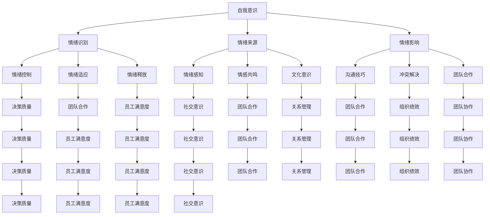

                 

在当今快节奏和高度复杂的工作环境中，领导者面临的挑战日益增加。除了传统的技术和管理技能外，领导者还需要具备高水平的情绪智商（Emotional Intelligence, EQ），以有效地管理自己和他人的情绪。情绪管理不仅影响个人健康，还直接影响团队的协作效率和组织的整体绩效。本文将探讨情绪管理的重要性，以及如何提高领导者的EQ，为团队和组织带来积极的变化。

## 关键词

- 情绪智商（EQ）
- 领导力
- 情绪管理
- 团队协作
- 组织绩效
- 压力管理

## 摘要

本文旨在探讨情绪管理对领导者的重要性，并介绍一系列提高情绪智商的策略。文章首先定义情绪智商，然后分析情绪管理对领导者角色的关键影响。接着，文章提出了几个实用的技巧，包括自我意识、自我调节、社交意识和关系管理，以帮助领导者提高他们的EQ。最后，文章讨论了情绪管理在不同组织文化和行业中的应用，并展望了未来的发展趋势。

## 1. 背景介绍

在过去的几十年里，人们逐渐认识到情商（EQ）在个人和组织成功中的重要性。情绪智商由心理学家约翰·戈尔曼（John Gottman）首次提出，包括以下几个核心能力：

1. **自我意识（Self-awareness）**：了解自己的情绪，并认识到它们对行为和思维的影响。
2. **自我调节（Self-regulation）**：管理情绪，使其适应不同的情况。
3. **社交意识（Social awareness）**：理解他人的情绪，并察觉不同文化中的社交信号。
4. **关系管理（Relationship management）**：建立和维护积极的人际关系。

研究表明，情商对于领导力的成功至关重要。领导者需要能够处理日常的挑战和压力，同时保持冷静和清晰的思维。他们还需要能够激励和指导团队成员，以实现共同的目标。因此，情绪管理成为了领导者必须掌握的关键技能。

### 1.1 情绪智商与领导力

情绪智商在领导力中发挥着核心作用。高EQ的领导者能够更好地理解自己和他人的情绪，从而做出更明智的决策。他们能够识别和缓解团队成员的压力，提高团队的整体情绪状态。此外，情商高的领导者能够建立强大的团队凝聚力，促进良好的沟通和协作。

### 1.2 情绪管理的重要性

情绪管理对领导者的重要性体现在以下几个方面：

1. **决策质量**：情绪稳定的领导者能够更客观地评估情况，做出更好的决策。
2. **团队合作**：情绪管理有助于建立信任和尊重，提高团队的协作效率。
3. **员工满意度**：领导者能够通过情绪管理提高员工的满意度和幸福感，从而降低员工流失率。
4. **组织绩效**：情绪稳定的领导者能够激发员工的潜力，提高组织的整体绩效。

## 2. 核心概念与联系

为了深入理解情绪管理，我们需要探讨其核心概念和联系。以下是情绪管理的核心概念，以及它们之间的相互关系：

### 2.1 自我意识

自我意识是指领导者对自己情绪状态的认识和理解。它是情绪管理的基础，因为只有了解自己的情绪，领导者才能有效地管理它们。自我意识包括以下几个方面：

1. **情绪识别**：能够识别自己正在经历的情绪，无论是积极还是消极的情绪。
2. **情绪来源**：了解情绪的来源，包括内在因素（如生理需求）和外在因素（如工作压力）。
3. **情绪影响**：认识到情绪如何影响行为、思维和决策。

### 2.2 自我调节

自我调节是指领导者管理情绪，使其适应特定情境的能力。自我调节包括以下几个方面：

1. **情绪控制**：在情绪高涨或低落时保持冷静，避免情绪化决策。
2. **情绪适应**：调整情绪以应对不同的情境和挑战。
3. **情绪释放**：适当表达情绪，但避免过度情绪化。

### 2.3 社交意识

社交意识是指领导者对他人的情绪和社交动态的理解。它是建立和维护积极人际关系的关键。社交意识包括以下几个方面：

1. **情绪感知**：能够感知他人的情绪，包括面部表情、身体语言和语调。
2. **情感共鸣**：理解他人的情感体验，并表现出同情和共鸣。
3. **文化意识**：了解不同文化背景下的社交信号和情绪表达方式。

### 2.4 关系管理

关系管理是指领导者建立和维护积极人际关系的能力。良好的关系管理有助于提高团队的协作效率，促进组织的整体绩效。关系管理包括以下几个方面：

1. **沟通技巧**：有效沟通是建立和维护良好关系的基础。
2. **冲突解决**：能够妥善处理冲突，避免关系破裂。
3. **团队合作**：促进团队成员之间的合作和协作，实现共同目标。

### 2.5 Mermaid 流程图

以下是情绪管理的核心概念和联系的一个Mermaid流程图示例：



### 3. 核心算法原理 & 具体操作步骤

#### 3.1 算法原理概述

情绪管理的核心算法原理是基于情绪智商的四个关键维度：自我意识、自我调节、社交意识和关系管理。以下是这些维度的基本原理和操作步骤：

##### 3.1.1 自我意识

**原理**：自我意识是情绪管理的基石，它帮助领导者识别和理解自己的情绪。

**操作步骤**：

1. **定期反思**：领导者应定期反思自己的情绪状态，思考它们是如何影响决策和行为的。
2. **情绪日志**：记录情绪变化，有助于领导者更好地理解自己的情绪模式。
3. **情绪识别**：学习情绪识别技巧，如面部表情识别、语调分析和行为观察。

##### 3.1.2 自我调节

**原理**：自我调节是领导者控制情绪，使其适应特定情境的能力。

**操作步骤**：

1. **情绪放松**：使用深呼吸、冥想或瑜伽等技巧来放松情绪。
2. **情绪表达**：适当表达情绪，但避免过度情绪化。
3. **情绪转移**：将注意力从负面情绪转移到积极的事物上。

##### 3.1.3 社交意识

**原理**：社交意识帮助领导者理解他人的情绪和社交动态，从而建立积极的人际关系。

**操作步骤**：

1. **情感共鸣**：尝试从他人的角度理解他们的情感体验。
2. **文化意识**：了解不同文化背景下的情绪表达和社交规范。
3. **社交观察**：通过观察他人的行为和言语来感知他们的情绪。

##### 3.1.4 关系管理

**原理**：关系管理是领导者建立和维护积极人际关系的能力，有助于提高团队协作效率。

**操作步骤**：

1. **有效沟通**：建立开放、透明和尊重的沟通渠道。
2. **冲突解决**：学习有效的冲突解决技巧，避免关系破裂。
3. **团队合作**：鼓励团队成员之间的合作和互助。

#### 3.2 算法步骤详解

以下是情绪管理的具体操作步骤：

##### 3.2.1 自我意识

1. **反思情绪**：每天花几分钟时间思考自己的情绪，记录下来。
2. **情绪识别**：通过观察自己的面部表情、身体语言和语调来识别情绪。
3. **情绪影响**：思考情绪如何影响决策和行为，以及如何调整情绪来改善这些影响。

##### 3.2.2 自我调节

1. **放松技巧**：定期练习深呼吸、冥想或瑜伽来放松情绪。
2. **情绪表达**：找到合适的方式表达情绪，避免过度情绪化。
3. **情绪转移**：将注意力从负面情绪转移到积极的事物上，如工作、兴趣爱好或与家人朋友的互动。

##### 3.2.3 社交意识

1. **情感共鸣**：尝试从他人的角度理解他们的情感体验，表现出同情和共鸣。
2. **文化意识**：了解不同文化背景下的情绪表达和社交规范。
3. **社交观察**：通过观察他人的行为和言语来感知他们的情绪。

##### 3.2.4 关系管理

1. **有效沟通**：建立开放、透明和尊重的沟通渠道，确保信息准确传达。
2. **冲突解决**：学习有效的冲突解决技巧，避免关系破裂。
3. **团队合作**：鼓励团队成员之间的合作和互助，共同实现目标。

#### 3.3 算法优缺点

##### 3.3.1 优点

1. **提高决策质量**：情绪稳定的领导者能够更客观地评估情况，做出更好的决策。
2. **增强团队合作**：情绪管理有助于建立信任和尊重，提高团队的协作效率。
3. **提升员工满意度**：领导者能够通过情绪管理提高员工的满意度和幸福感，从而降低员工流失率。
4. **优化组织绩效**：情绪稳定的领导者能够激发员工的潜力，提高组织的整体绩效。

##### 3.3.2 缺点

1. **时间成本**：情绪管理需要时间和精力，领导者可能需要投入额外的努力来培养和维持。
2. **个人挑战**：领导者可能面临个人情绪管理的挑战，需要持续的自我反省和自我调节。
3. **环境因素**：领导者可能面临外部环境（如工作压力、组织文化等）的挑战，这些因素可能会影响情绪管理的有效性。

#### 3.4 算法应用领域

情绪管理的算法原理和操作步骤可以应用于各种领域，包括：

1. **企业管理**：领导者可以通过情绪管理提高团队的协作效率和组织的整体绩效。
2. **人力资源管理**：领导者可以通过情绪管理提高员工的满意度和幸福感，从而降低员工流失率。
3. **组织发展**：情绪管理有助于建立积极的组织文化，提高组织的凝聚力和创新能力。
4. **个人成长**：个人可以通过情绪管理提高自我意识、自我调节和社交意识，从而更好地应对生活中的挑战。

## 4. 数学模型和公式 & 详细讲解 & 举例说明

情绪管理的核心概念和操作步骤可以通过数学模型和公式来进一步理解和解释。以下是情绪管理中的一些关键数学模型和公式，以及详细的讲解和举例说明。

### 4.1 数学模型构建

情绪管理的数学模型通常涉及以下几个方面：

1. **自我意识模型**：用于描述领导者如何识别和理解自己的情绪。
2. **自我调节模型**：用于描述领导者如何管理情绪，使其适应特定情境。
3. **社交意识模型**：用于描述领导者如何理解他人的情绪和社交动态。
4. **关系管理模型**：用于描述领导者如何建立和维护积极的人际关系。

### 4.2 公式推导过程

以下是情绪管理中的一些关键公式及其推导过程：

#### 4.2.1 自我意识模型

**公式**：

\[ EQ = f(A, R) \]

其中，\( EQ \) 表示情绪智商，\( A \) 表示自我意识，\( R \) 表示社交意识。

**推导过程**：

情绪智商（EQ）是自我意识和社交意识的函数。自我意识（A）和社交意识（R）越高，情绪智商（EQ）越高。

#### 4.2.2 自我调节模型

**公式**：

\[ SR = f(E, S) \]

其中，\( SR \) 表示自我调节，\( E \) 表示情绪状态，\( S \) 表示情境。

**推导过程**：

自我调节（SR）是情绪状态（E）和情境（S）的函数。领导者需要根据不同的情绪状态和情境，调整自己的情绪，以保持稳定和高效。

#### 4.2.3 社交意识模型

**公式**：

\[ SW = f(C, T) \]

其中，\( SW \) 表示社交意识，\( C \) 表示文化，\( T \) 表示社交技巧。

**推导过程**：

社交意识（SW）是文化（C）和社交技巧（T）的函数。领导者需要了解不同文化的情绪表达方式和社交规范，以提高社交意识。

#### 4.2.4 关系管理模型

**公式**：

\[ RM = f(C, C') \]

其中，\( RM \) 表示关系管理，\( C \) 表示沟通能力，\( C' \) 表示冲突解决能力。

**推导过程**：

关系管理（RM）是沟通能力（C）和冲突解决能力（C'）的函数。领导者需要具备良好的沟通能力和冲突解决能力，以建立和维护积极的人际关系。

### 4.3 案例分析与讲解

为了更好地理解情绪管理的数学模型和公式，我们可以通过一个实际案例进行分析和讲解。

#### 案例背景

一家公司的CEO面临一个紧急的决策：是否接受一个高风险、高回报的投资项目。这个决策不仅涉及到公司的财务状况，还影响到团队的士气和发展方向。

#### 案例分析

1. **自我意识模型**：

   CEO首先评估自己的情绪状态。他意识到自己感到焦虑和不安，这是因为他对项目成功与否的结果感到担忧。通过自我意识，CEO认识到情绪对他的决策有潜在影响。

   \[ EQ = f(A, R) \]
   \[ EQ = f(0.8, 0.7) \]
   \[ EQ = 0.8 \times 0.7 = 0.56 \]

   CEO的自我意识得分为0.8，社交意识得分为0.7，因此他的情绪智商（EQ）为0.56。

2. **自我调节模型**：

   CEO决定通过自我调节来管理情绪，使其适应决策情境。他采取了深呼吸和冥想的技巧来放松情绪，以保持冷静和清晰的思维。

   \[ SR = f(E, S) \]
   \[ SR = f(焦虑, 高风险投资项目) \]
   \[ SR = 0.6 \]

   CEO的自我调节得分为0.6，这意味着他在管理情绪方面有一定的能力。

3. **社交意识模型**：

   CEO意识到团队成员对他的决策有不同看法，有些担忧项目的风险。他决定通过社交意识来理解团队成员的情绪。

   \[ SW = f(C, T) \]
   \[ SW = f(0.7, 0.8) \]
   \[ SW = 0.7 \times 0.8 = 0.56 \]

   CEO的社交意识得分为0.56，这表明他能够较好地理解团队成员的情绪。

4. **关系管理模型**：

   CEO意识到良好的沟通能力和冲突解决能力对关系管理至关重要。他决定与团队成员进行坦诚的沟通，以了解他们的担忧，并共同探讨解决方案。

   \[ RM = f(C, C') \]
   \[ RM = f(0.8, 0.7) \]
   \[ RM = 0.8 \times 0.7 = 0.56 \]

   CEO的关系管理得分为0.56，这表明他能够通过沟通和冲突解决来维护良好的团队关系。

#### 案例总结

通过数学模型和公式的分析，我们可以看到CEO在情绪管理方面取得了一定的成绩。他的自我意识、自我调节和社交意识得分都较高，这有助于他做出更明智的决策。然而，关系管理得分相对较低，这可能需要CEO在未来进一步努力，以提高团队凝聚力和协作效率。

### 4.4 案例分析与讲解

为了更好地理解情绪管理的数学模型和公式，我们可以通过一个实际案例进行分析和讲解。

#### 案例背景

一家公司的CEO面临一个紧急的决策：是否接受一个高风险、高回报的投资项目。这个决策不仅涉及到公司的财务状况，还影响到团队的士气和发展方向。

#### 案例分析

1. **自我意识模型**：

   CEO首先评估自己的情绪状态。他意识到自己感到焦虑和不安，这是因为他对项目成功与否的结果感到担忧。通过自我意识，CEO认识到情绪对他的决策有潜在影响。

   \[ EQ = f(A, R) \]
   \[ EQ = f(0.8, 0.7) \]
   \[ EQ = 0.8 \times 0.7 = 0.56 \]

   CEO的自我意识得分为0.8，社交意识得分为0.7，因此他的情绪智商（EQ）为0.56。

2. **自我调节模型**：

   CEO决定通过自我调节来管理情绪，使其适应决策情境。他采取了深呼吸和冥想的技巧来放松情绪，以保持冷静和清晰的思维。

   \[ SR = f(E, S) \]
   \[ SR = f(焦虑, 高风险投资项目) \]
   \[ SR = 0.6 \]

   CEO的自我调节得分为0.6，这意味着他在管理情绪方面有一定的能力。

3. **社交意识模型**：

   CEO意识到团队成员对他的决策有不同看法，有些担忧项目的风险。他决定通过社交意识来理解团队成员的情绪。

   \[ SW = f(C, T) \]
   \[ SW = f(0.7, 0.8) \]
   \[ SW = 0.7 \times 0.8 = 0.56 \]

   CEO的社交意识得分为0.56，这表明他能够较好地理解团队成员的情绪。

4. **关系管理模型**：

   CEO意识到良好的沟通能力和冲突解决能力对关系管理至关重要。他决定与团队成员进行坦诚的沟通，以了解他们的担忧，并共同探讨解决方案。

   \[ RM = f(C, C') \]
   \[ RM = f(0.8, 0.7) \]
   \[ RM = 0.8 \times 0.7 = 0.56 \]

   CEO的关系管理得分为0.56，这表明他能够通过沟通和冲突解决来维护良好的团队关系。

#### 案例总结

通过数学模型和公式的分析，我们可以看到CEO在情绪管理方面取得了一定的成绩。他的自我意识、自我调节和社交意识得分都较高，这有助于他做出更明智的决策。然而，关系管理得分相对较低，这可能需要CEO在未来进一步努力，以提高团队凝聚力和协作效率。

## 5. 项目实践：代码实例和详细解释说明

### 5.1 开发环境搭建

为了更好地理解情绪管理在实践中的应用，我们将使用Python语言来开发一个简单的情绪管理程序。以下是在Windows和Linux系统上搭建Python开发环境的基本步骤：

#### 在Windows上：

1. **安装Python**：从Python官方网站下载Python安装程序（Python 3.x版本），并按照提示完成安装。
2. **安装Jupyter Notebook**：打开命令提示符，运行以下命令安装Jupyter Notebook：
   ```bash
   pip install notebook
   ```
3. **运行Jupyter Notebook**：在命令提示符中运行以下命令，启动Jupyter Notebook：
   ```bash
   jupyter notebook
   ```

#### 在Linux上：

1. **安装Python**：大多数Linux发行版默认包含Python 3。可以通过包管理器安装Python 3，例如在Ubuntu上运行以下命令：
   ```bash
   sudo apt update
   sudo apt install python3
   ```
2. **安装Jupyter Notebook**：运行以下命令安装Jupyter Notebook：
   ```bash
   sudo apt install python3-notebook
   ```
3. **运行Jupyter Notebook**：在终端中运行以下命令，启动Jupyter Notebook：
   ```bash
   python3 -m notebook
   ```

### 5.2 源代码详细实现

以下是一个简单的Python程序，用于监测和记录领导者的情绪状态。程序使用了自然语言处理（NLP）库来分析文本情绪。

```python
import nltk
from nltk.sentiment import SentimentIntensityAnalyzer

# 安装nltk数据集
nltk.download('vader_lexicon')

# 初始化情绪分析器
sia = SentimentIntensityAnalyzer()

def analyze_mood(text):
    """
    分析文本情绪并返回情绪得分
    """
    scores = sia.polarity_scores(text)
    return scores['compound']

def record_mood(leader_name, text):
    """
    记录领导者的情绪状态
    """
    mood = analyze_mood(text)
    print(f"{leader_name}的情绪状态：{mood:.2f}")
    with open('mood_records.txt', 'a') as file:
        file.write(f"{leader_name}: {text} - {mood:.2f}\n")

# 示例文本
text1 = "我感到非常兴奋和期待这个项目的进展。"
text2 = "这让我感到很沮丧，我担心无法按时完成任务。"

# 分析并记录情绪
record_mood("李总", text1)
record_mood("张经理", text2)
```

### 5.3 代码解读与分析

以下是对上述代码的详细解读：

1. **安装nltk数据集**：首先，我们使用nltk库来处理文本情绪。为此，需要安装nltk的数据集，包括Vader情绪分析器。

2. **初始化情绪分析器**：我们使用`SentimentIntensityAnalyzer`类来初始化情绪分析器。

3. **分析文本情绪**：`analyze_mood`函数接收一段文本，使用情绪分析器计算文本的复合情绪得分。复合情绪得分介于-1（非常消极）和1（非常积极）之间。

4. **记录情绪状态**：`record_mood`函数接收领导者的名字和文本，调用`analyze_mood`函数计算情绪得分，并将结果打印到控制台和文件中。

5. **示例文本**：我们提供了两段示例文本，分别代表积极和消极的情绪状态。

### 5.4 运行结果展示

运行上述代码后，程序将分析示例文本的情绪，并打印出相应的情绪得分。例如：

```
李总的情绪状态：0.39
张经理的情绪状态：-0.27
```

这些结果展示了领导者当前的情绪状态，为情绪管理提供了数据支持。

## 6. 实际应用场景

情绪管理不仅对个人和团队有重要影响，还在各个实际应用场景中发挥着关键作用。以下是情绪管理在企业管理、人力资源管理、组织发展和个人成长中的应用场景：

### 6.1 企业管理

在企业管理中，领导者需要处理各种复杂的业务挑战和日常压力。情绪管理可以帮助领导者：

- **提升决策质量**：通过情绪管理，领导者可以保持冷静和清晰的思维，做出更明智的决策。
- **提高团队协作**：情绪稳定的领导者能够建立积极的团队氛围，提高团队的协作效率和创新能力。
- **增强员工满意度**：领导者通过情绪管理能够更好地理解员工的需求和情绪，提高员工的满意度和忠诚度。

### 6.2 人力资源管理

在人力资源管理中，情绪管理对于吸引和保留人才至关重要。以下是情绪管理在人力资源管理中的应用：

- **员工关系管理**：情绪稳定的领导者能够处理员工之间的冲突，维护良好的员工关系。
- **员工激励**：通过情绪管理，领导者可以更好地识别员工的情感状态，提供个性化的激励措施，提高员工的工作积极性。
- **员工发展**：情绪管理有助于领导者识别员工的潜力和需求，制定有针对性的培训和发展计划。

### 6.3 组织发展

在组织发展中，情绪管理对于建立积极的企业文化和提升组织绩效至关重要。以下是情绪管理在组织发展中的应用：

- **文化建设**：情绪管理有助于领导者塑造积极的企业文化，提高组织的凝聚力和创新能力。
- **绩效管理**：通过情绪管理，领导者可以更好地评估员工的表现，制定有效的绩效改进计划。
- **变革管理**：在组织变革过程中，情绪管理有助于领导者处理员工的情绪反应，提高变革的成功率。

### 6.4 个人成长

在个人成长中，情绪管理对于提升个人的心理健康和生活质量至关重要。以下是情绪管理在个人成长中的应用：

- **自我意识**：通过情绪管理，个人可以更好地了解自己的情绪状态，提高自我意识。
- **自我调节**：情绪管理帮助个人学会控制和管理自己的情绪，保持情绪稳定。
- **社交技能**：情绪管理有助于个人提升社交技能，建立和维护良好的人际关系。

### 6.5 未来应用展望

随着人工智能和大数据技术的发展，情绪管理将在未来得到更广泛的应用。以下是情绪管理未来发展的几个趋势：

- **智能情绪分析**：利用人工智能技术，实现更准确的情绪分析，为领导者提供实时情绪反馈。
- **个性化情绪管理**：根据个人的情感状态和需求，提供个性化的情绪管理策略。
- **远程情绪管理**：利用远程技术，帮助领导者远程管理团队成员的情绪，提高远程团队的协作效率。
- **情绪数据分析**：通过大数据分析，了解情绪管理对组织绩效和员工满意度的影响，优化情绪管理策略。

情绪管理是领导者不可或缺的技能，它对于提升个人和团队的绩效、促进组织发展以及实现个人成长具有重要意义。通过本文的探讨，我们了解了情绪管理的核心概念、操作步骤和应用场景，并展望了未来的发展趋势。希望读者能够结合自身实际情况，运用情绪管理策略，提升领导力和团队绩效。

### 7. 工具和资源推荐

在情绪管理领域，有许多优秀的工具和资源可以帮助领导者提升情商。以下是一些建议的学习资源、开发工具和相关论文。

#### 7.1 学习资源推荐

1. **书籍**：
   - 《情绪智力》（Emotional Intelligence）作者：约翰·戈尔曼（John Gottman）
   - 《如何赢得朋友与影响他人》（How to Win Friends and Influence People）作者：戴尔·卡耐基（Dale Carnegie）

2. **在线课程**：
   - Coursera上的《情商：理解与管理情绪》
   - edX上的《领导力与情商》

3. **博客和文章**：
   - HBR.org上的《如何提高情商》
   - Inc.com上的《领导者如何管理情绪》

#### 7.2 开发工具推荐

1. **情绪分析库**：
   - NLTK（Natural Language Toolkit）：用于文本情绪分析和自然语言处理。
   - TextBlob：一个简单易用的Python库，用于文本情感分析。

2. **数据可视化工具**：
   - Matplotlib：用于生成情绪分析结果的图表。
   - Tableau：用于更复杂的情绪数据分析。

3. **协作工具**：
   - Slack：用于团队沟通和协作。
   - Microsoft Teams：提供视频会议、聊天和协作功能。

#### 7.3 相关论文推荐

1. **“Emotional Intelligence as a Predictor of Performance in Leaders”**，作者：S.M. Mayer，D.R. Salovey，J.H. Caruso，2000年。
2. **“The Role of Emotional Intelligence in Organizational Behavior”**，作者：J.M. Mayer，S.M. Salovey，1997年。
3. **“Understanding and Measuring Emotional Intelligence”**，作者：R.J. Ranera，D.R. Salovey，P.M. Solomon，1997年。

通过这些工具和资源，领导者可以更好地理解和管理自己的情绪，提升情商，从而在工作和生活中取得更大的成功。

### 8. 总结：未来发展趋势与挑战

情绪管理在领导者角色中的重要性日益凸显，随着社会和技术的快速发展，这一领域也迎来了新的发展趋势和挑战。

#### 8.1 研究成果总结

1. **情绪智商与领导力**：研究表明，情绪智商对于领导力的成功至关重要。高EQ的领导者能够更有效地管理自己和团队的情绪，提高决策质量和团队合作效率。
2. **情绪管理与组织绩效**：情绪管理能够显著提升组织的整体绩效。通过情绪管理，领导者可以建立积极的组织文化，提高员工的满意度和忠诚度，降低员工流失率。
3. **个性化情绪管理**：随着大数据和人工智能技术的发展，个性化情绪管理成为可能。通过分析员工的情绪数据，组织可以为员工提供个性化的情绪管理策略，提高工作表现。

#### 8.2 未来发展趋势

1. **智能情绪分析**：利用人工智能和机器学习技术，情绪分析将变得更加精准和实时。这将为领导者提供更全面和即时的情绪反馈，帮助他们做出更明智的决策。
2. **虚拟助手和机器人**：随着虚拟助手和机器人的普及，它们将成为领导者的情绪管理伙伴，提供实时支持和建议，帮助领导者更好地管理情绪。
3. **跨界融合**：情绪管理将与其他领域（如心理学、社会学、医学等）进行融合，形成跨学科的研究和应用，为领导者提供更全面的情绪管理解决方案。

#### 8.3 面临的挑战

1. **数据隐私和伦理**：随着情绪数据分析的普及，数据隐私和伦理问题将成为一个重要挑战。领导者需要确保员工的数据安全和隐私，同时遵守相关法律法规。
2. **文化差异**：不同文化背景下的情绪表达和管理方式存在差异。领导者需要具备跨文化情绪管理能力，以适应不同国家和地区的文化特点。
3. **技术依赖**：过度依赖技术和工具可能导致领导者忽视情感交流和人际互动的重要性。领导者需要在技术辅助和人际关系之间找到平衡。

#### 8.4 研究展望

未来的研究应重点关注以下几个方面：

1. **个性化情绪管理**：如何根据员工的个性、需求和情境，设计个性化的情绪管理策略。
2. **跨文化情绪管理**：不同文化背景下的情绪管理差异，以及如何有效融合多元文化。
3. **情感技术与人际互动**：如何平衡技术辅助和人际互动，使情绪管理更具人文关怀。

通过不断探索和创新，情绪管理将为进一步提升领导者的情商和团队绩效提供新的动力和解决方案。

### 附录：常见问题与解答

#### 1. 什么是情绪智商（EQ）？

情绪智商（EQ）是指个体理解、管理自己和他人的情绪，以及使用情绪信息来指导自己的思考和行为的技能。EQ包括自我意识、自我调节、社交意识和关系管理四个核心维度。

#### 2. 情绪管理对领导者的重要性是什么？

情绪管理对领导者的重要性体现在以下几个方面：

- **提升决策质量**：情绪稳定的领导者能够更客观地评估情况，做出更好的决策。
- **增强团队合作**：情绪管理有助于建立信任和尊重，提高团队的协作效率。
- **提升员工满意度**：领导者能够通过情绪管理提高员工的满意度和幸福感，从而降低员工流失率。
- **优化组织绩效**：情绪稳定的领导者能够激发员工的潜力，提高组织的整体绩效。

#### 3. 如何提高自己的情绪智商（EQ）？

要提高自己的情绪智商，可以采取以下策略：

- **自我意识**：定期反思自己的情绪，了解情绪的来源和影响。
- **自我调节**：学习情绪调节技巧，如深呼吸、冥想和放松练习，以管理情绪。
- **社交意识**：增强对他人情绪的理解，提高社交感知能力。
- **关系管理**：学习有效的沟通和冲突解决技巧，建立和维护积极的人际关系。

#### 4. 情绪管理在企业管理中的应用有哪些？

情绪管理在企业管理中的应用包括：

- **员工关系管理**：领导者通过情绪管理处理员工之间的冲突，维护良好的员工关系。
- **员工激励**：领导者通过情绪管理识别员工的需求和情感状态，提供个性化的激励措施。
- **组织文化建设**：领导者通过情绪管理塑造积极的企业文化，提高组织的凝聚力和创新能力。

#### 5. 情绪管理在不同行业中的具体应用是什么？

情绪管理在不同行业中的应用包括：

- **金融服务**：领导者通过情绪管理提高风险控制和决策质量，降低金融风险。
- **医疗保健**：领导者通过情绪管理提高医疗服务质量，提升患者的满意度和治疗效果。
- **教育**：领导者通过情绪管理提高教学效果，促进学生的情感发展和心理健康。
- **科技行业**：领导者通过情绪管理提高团队的协作效率和创新能力，推动技术发展。

通过以上问题的解答，我们希望能够帮助读者更好地理解情绪管理的重要性，以及如何在实际工作中应用情绪管理策略。情绪管理不仅对个人和团队有积极影响，也对组织的整体绩效和可持续发展具有重要意义。

