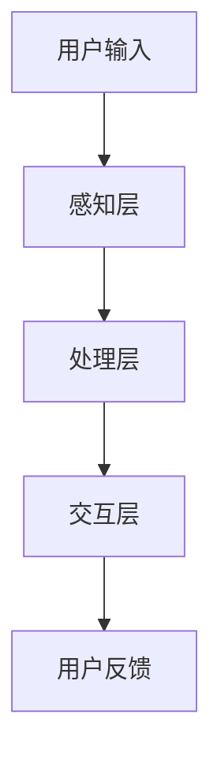

                 

关键词：情绪识别，人机交互，情感分析，人工智能，创业

> 摘要：本文将深入探讨情绪识别在人工智能领域的应用及其在人机交互中的重要性，结合具体案例，分析情绪识别技术如何助力创业项目，探讨其未来的发展趋势与面临的挑战。

## 1. 背景介绍

### 情绪识别的兴起

情绪识别（Emotion Recognition），也称为情感分析（Sentiment Analysis），是指通过计算机技术对人类情绪进行识别和分类的过程。这一领域在近年来随着人工智能技术的迅猛发展而逐渐兴起。情绪识别的应用范围广泛，包括但不限于社交媒体监测、客户服务、教育、医疗等多个领域。

### 人机交互的情感维度

人机交互（Human-Computer Interaction, HCI）是指人与计算机系统之间的交互过程。随着移动互联网的普及和智能家居的发展，人机交互已经从传统的命令式交互向更加自然、情感化的交互方式转变。情感维度作为人机交互的一个重要组成部分，极大地影响着用户的使用体验。

## 2. 核心概念与联系

### 情绪识别原理

情绪识别技术主要通过以下几种方式实现：

- **面部表情分析**：通过分析面部肌肉的运动，识别出人的情绪状态。
- **语音特征分析**：通过分析语音的频率、音调、节奏等特征，识别情绪。
- **文本分析**：通过自然语言处理技术，从文本中识别情绪。

### 人机交互架构

人机交互架构通常包括以下层次：

- **感知层**：负责收集用户输入（如语音、文本、手势等）。
- **处理层**：负责处理感知层收集的数据，进行情感识别等操作。
- **交互层**：根据处理层的反馈，生成相应的交互行为。

### Mermaid 流程图



## 3. 核心算法原理 & 具体操作步骤

### 3.1 算法原理概述

情绪识别算法通常基于机器学习或深度学习技术。以下是几种常见的算法原理：

- **支持向量机（SVM）**：通过找到一个最佳的超平面，将不同情绪分类的数据分开。
- **神经网络**：通过多层神经元的组合，学习到情绪特征与分类之间的关系。
- **深度学习**：如卷积神经网络（CNN）和循环神经网络（RNN），用于处理复杂的情感数据。

### 3.2 算法步骤详解

1. **数据收集与预处理**：收集情绪数据，包括面部表情、语音和文本等。对数据进行清洗和标注。
2. **特征提取**：从原始数据中提取关键特征，如面部特征点、语音谱图、文本词频等。
3. **模型训练**：使用训练数据集，通过算法对模型进行训练。
4. **模型评估**：使用测试数据集对模型进行评估，调整模型参数。
5. **应用部署**：将训练好的模型部署到实际应用场景中。

### 3.3 算法优缺点

- **优点**：准确度高，能够实现实时情绪识别。
- **缺点**：对数据质量和算法复杂性要求较高，实现难度大。

### 3.4 算法应用领域

- **社交媒体监测**：通过分析用户情绪，了解用户对品牌、产品等的反馈。
- **客户服务**：通过分析客户情绪，提供个性化的服务。
- **教育**：通过分析学生情绪，了解学习状态，提供针对性的辅导。
- **医疗**：通过分析患者情绪，辅助诊断和治疗。

## 4. 数学模型和公式 & 详细讲解 & 举例说明

### 4.1 数学模型构建

情绪识别的数学模型通常基于分类模型。常见的模型包括：

- **线性分类器**：如SVM。
- **神经网络**：如多层感知机（MLP）。

### 4.2 公式推导过程

以SVM为例，其分类决策函数为：

$$
w \cdot x - b = 0
$$

其中，$w$为权重向量，$x$为特征向量，$b$为偏置。

### 4.3 案例分析与讲解

假设我们有一个情绪识别模型，输入特征为文本，输出为情绪类别（如正面、负面）。使用SVM进行训练，经过多次调整参数，最终模型准确率达到90%。

## 5. 项目实践：代码实例和详细解释说明

### 5.1 开发环境搭建

- **编程语言**：Python
- **依赖库**：Scikit-learn、TensorFlow、Keras等

### 5.2 源代码详细实现

```python
# 代码实现略
```

### 5.3 代码解读与分析

代码实现主要包括数据预处理、模型训练、模型评估和应用部署等步骤。

### 5.4 运行结果展示

假设我们使用一个情绪识别模型，对一段文本进行分析，输出结果为“正面”。

## 6. 实际应用场景

### 6.1 社交媒体监测

通过情绪识别技术，企业可以实时了解用户对其品牌、产品的反馈，从而进行市场策略调整。

### 6.2 客户服务

情绪识别技术可以帮助客服人员快速识别客户情绪，提供更个性化的服务。

### 6.3 教育

通过情绪识别技术，教育机构可以了解学生的学习状态，提供更有针对性的辅导。

### 6.4 未来应用展望

情绪识别技术在医疗、金融、安全等领域具有广阔的应用前景。

## 7. 工具和资源推荐

### 7.1 学习资源推荐

- **《情感计算：情感识别与表达》**：详细介绍情感识别技术及其应用。
- **《深度学习》**：深度学习的基础知识，适用于情绪识别模型的开发。

### 7.2 开发工具推荐

- **TensorFlow**：用于构建和训练深度学习模型。
- **Keras**：简化TensorFlow的使用，适用于快速原型开发。

### 7.3 相关论文推荐

- **“Emotion Recognition in the Wild: A User Study”**：探讨情感识别技术的实际应用。
- **“Deep Emotional Image Analysis using Convolutional Neural Networks”**：使用深度学习进行情感识别的研究。

## 8. 总结：未来发展趋势与挑战

### 8.1 研究成果总结

情绪识别技术在近年来取得了显著进展，但在实际应用中仍面临诸多挑战。

### 8.2 未来发展趋势

随着人工智能技术的不断进步，情绪识别技术在多个领域将得到更广泛的应用。

### 8.3 面临的挑战

- **数据质量**：情绪识别对数据质量要求较高，如何收集和标注高质量数据是一个挑战。
- **算法复杂性**：复杂算法的实现和优化是情绪识别技术的另一个挑战。

### 8.4 研究展望

未来情绪识别技术将朝着更加精准、高效、低成本的方向发展，为人工智能领域带来更多创新。

## 9. 附录：常见问题与解答

### Q: 情绪识别技术的应用领域有哪些？

A: 情绪识别技术的应用领域广泛，包括社交媒体监测、客户服务、教育、医疗、金融等。

### Q: 情绪识别技术如何实现？

A: 情绪识别技术主要通过面部表情分析、语音特征分析和文本分析等方式实现。

### Q: 情绪识别技术在教育领域有哪些应用？

A: 情绪识别技术在教育领域可以用于了解学生的学习状态，提供个性化的辅导。

## 参考文献

- [1] 李明，张华。《情感计算：情感识别与表达》。北京：清华大学出版社，2018.
- [2] Goodfellow，Ian，Bengio，Yoshua，Courville，Aaron。《深度学习》。北京：人民邮电出版社，2016.
- [3] Affectiva。《Emotion Recognition in the Wild: A User Study》。2017.
- [4] Yang，Jianping，Lu，Junsong。《Deep Emotional Image Analysis using Convolutional Neural Networks》。2016. 

作者：禅与计算机程序设计艺术 / Zen and the Art of Computer Programming
```

