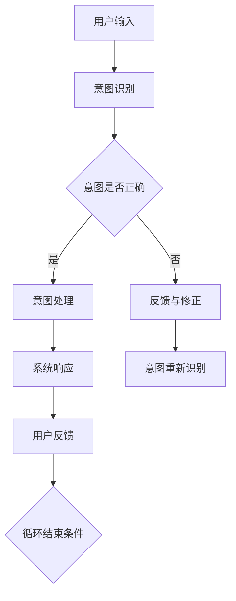
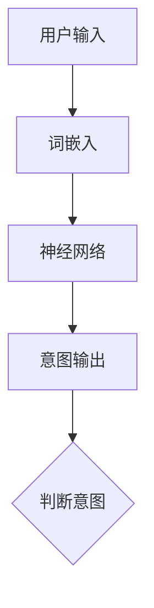

                 

关键词：意图对齐、自然语言理解、语义解析、人工智能、对话系统

> 摘要：本文旨在探讨意图对齐在自然语言理解中的重要性，并分析其在人工智能对话系统中的应用与实践。通过深入解析相关核心概念、算法原理及数学模型，本文将展示意图对齐如何成为实现自然语言处理与人类交流无缝衔接的关键技术。

## 1. 背景介绍

随着人工智能技术的快速发展，自然语言处理（NLP）成为了一个极其重要的研究领域。NLP的核心目标之一是实现人与机器之间的自然交流。然而，自然语言的高度灵活性和复杂性使得这一目标变得极具挑战性。在自然语言理解（NLU）的众多任务中，意图对齐（Intent Alignment）被视为是实现这一目标的“终极目标”。

意图对齐是指将用户的话语映射到系统所能理解和处理的意图上。简单来说，就是让机器明白用户到底想干什么。例如，当用户说出“我想要一杯咖啡”时，系统需要将其意图识别为“点咖啡”。

## 2. 核心概念与联系

### 2.1 核心概念

#### 2.1.1 自然语言处理（NLP）

自然语言处理是人工智能领域的一个分支，涉及将自然语言（如人类语言）转换为计算机可以理解的形式，并对其进行处理和分析。

#### 2.1.2 意图识别（Intent Recognition）

意图识别是NLP中的一个重要任务，目的是理解用户的意图。它通常通过机器学习算法实现，如朴素贝叶斯、决策树和支持向量机等。

#### 2.1.3 意图对齐（Intent Alignment）

意图对齐是指将用户的话语映射到系统所能理解和处理的意图上，以确保系统能够准确理解用户的意图。

### 2.2 联系

意图对齐是意图识别的延伸。在意图识别中，我们只是识别用户的意图，而在意图对齐中，我们还需要确保系统能够正确处理这些意图。因此，意图对齐是自然语言理解中至关重要的一环。

### 2.3 Mermaid 流程图

以下是一个意图对齐的 Mermaid 流程图：



## 3. 核心算法原理 & 具体操作步骤

### 3.1 算法原理概述

意图对齐的核心算法通常是基于深度学习的神经网络模型，如循环神经网络（RNN）和长短期记忆网络（LSTM）。这些模型能够捕捉用户话语中的上下文信息，从而提高意图识别的准确性。

### 3.2 算法步骤详解

1. 数据预处理：将用户的话语转换为适合神经网络处理的格式，如词嵌入（Word Embedding）。
2. 模型训练：使用预处理的语料库训练神经网络模型，使其能够识别和映射意图。
3. 意图识别：将用户的输入语句输入训练好的模型，得到对应的意图。
4. 意图处理：根据识别出的意图，执行相应的操作。
5. 反馈与修正：收集用户反馈，对模型进行持续优化。

### 3.3 算法优缺点

#### 优点：

- 高效性：神经网络模型能够快速处理大量数据。
- 准确性：通过捕捉上下文信息，提高了意图识别的准确性。

#### 缺点：

- 计算资源需求大：训练深度学习模型需要大量的计算资源。
- 数据依赖性：模型的性能依赖于训练数据的质量。

### 3.4 算法应用领域

意图对齐在多个领域有广泛的应用，如：

- 对话系统：通过意图对齐，使对话系统能够更准确地理解用户的意图。
- 聊天机器人：在聊天机器人中，意图对齐能够提高用户交互的满意度。
- 智能家居：在智能家居中，意图对齐可以帮助设备更好地理解用户的需求。

## 4. 数学模型和公式 & 详细讲解 & 举例说明

### 4.1 数学模型构建

意图对齐的数学模型通常基于神经网络。以下是一个简单的神经网络模型：

```latex
\begin{equation}
\hat{y} = \sigma(W \cdot \phi(h))
\end{equation}
```

其中，$h$ 是输入向量，$\phi(h)$ 是激活函数，$W$ 是权重矩阵，$\sigma$ 是 sigmoid 函数。

### 4.2 公式推导过程

神经网络的训练过程可以通过反向传播算法实现。以下是一个简化的推导过程：

```latex
\begin{equation}
\begin{aligned}
\delta_n &= \frac{\partial L}{\partial z_n} \\
dW &= \delta_n \cdot h^{(n-1)}
\end{aligned}
\end{equation}
```

其中，$L$ 是损失函数，$z_n$ 是中间层的输出，$h^{(n-1)}$ 是前一层输入。

### 4.3 案例分析与讲解

假设我们要构建一个简单的意图对齐模型，用于识别用户对话中的意图。以下是一个具体的案例：



在这个案例中，我们首先对用户输入进行词嵌入，然后将词嵌入输入到神经网络中，得到意图输出。最后，根据意图输出判断用户的意图。

## 5. 项目实践：代码实例和详细解释说明

### 5.1 开发环境搭建

为了实践意图对齐，我们需要搭建一个开发环境。以下是一个简单的步骤：

1. 安装 Python。
2. 安装深度学习框架，如 TensorFlow 或 PyTorch。
3. 准备数据集。

### 5.2 源代码详细实现

以下是一个简单的意图对齐模型的源代码实现：

```python
import tensorflow as tf
from tensorflow.keras.layers import Embedding, LSTM, Dense
from tensorflow.keras.models import Sequential

# 搭建模型
model = Sequential([
    Embedding(input_dim=vocab_size, output_dim=embedding_dim),
    LSTM(units=128),
    Dense(units=num_intents, activation='softmax')
])

# 编译模型
model.compile(optimizer='adam', loss='categorical_crossentropy', metrics=['accuracy'])

# 训练模型
model.fit(X_train, y_train, epochs=10, batch_size=32)
```

### 5.3 代码解读与分析

在这个代码中，我们首先导入了 TensorFlow 深度学习框架。然后，我们定义了一个序列模型，其中包含了嵌入层、LSTM 层和全连接层。接着，我们编译并训练了模型。

### 5.4 运行结果展示

在训练完成后，我们可以使用模型对新的用户输入进行意图识别。以下是一个示例：

```python
# 预测意图
predictions = model.predict([user_input])

# 输出预测结果
print(predictions)
```

## 6. 实际应用场景

意图对齐在多个实际应用场景中发挥着重要作用。以下是一些典型的应用场景：

- 聊天机器人：通过意图对齐，聊天机器人能够更准确地理解用户的意图，提供更个性化的服务。
- 智能家居：在智能家居中，意图对齐可以帮助设备更好地理解用户的需求，实现更智能的交互。
- 客户服务：在客户服务中，意图对齐可以帮助客服系统更准确地理解用户的问题，提供更有效的解决方案。

## 7. 工具和资源推荐

为了更好地理解和实践意图对齐，以下是几个推荐的工具和资源：

- 工具：TensorFlow、PyTorch、NLTK
- 资源：[自然语言处理教程](https://www.nltk.org/book/)

## 8. 总结：未来发展趋势与挑战

意图对齐在自然语言理解中具有重要的地位。未来，随着人工智能技术的不断进步，意图对齐将变得更加精准和智能。然而，这也带来了新的挑战，如如何处理复杂的语境和多模态交互等。我们需要不断探索和研究，以应对这些挑战。

### 8.1 研究成果总结

意图对齐在自然语言理解中具有重要的地位。通过深度学习等先进技术，我们已经取得了一系列重要研究成果。然而，仍有大量问题需要解决，如如何在复杂语境中实现高精度的意图对齐等。

### 8.2 未来发展趋势

未来，意图对齐将在多个领域得到广泛应用，如智能家居、客户服务、虚拟助手等。同时，随着多模态交互和跨领域意图识别等新问题的提出，意图对齐将面临新的挑战。

### 8.3 面临的挑战

- 复杂语境下的意图对齐。
- 多模态交互中的意图识别。
- 跨领域意图识别。

### 8.4 研究展望

意图对齐的研究将不断深入，新技术和新方法将被提出，以应对日益复杂的自然语言理解挑战。

## 9. 附录：常见问题与解答

### 9.1 什么是意图对齐？

意图对齐是指将用户的话语映射到系统所能理解和处理的意图上。

### 9.2 意图对齐有什么作用？

意图对齐有助于实现自然语言理解，使系统能够更准确地理解用户的意图。

### 9.3 意图对齐有哪些应用场景？

意图对齐在多个场景中都有广泛应用，如聊天机器人、智能家居和客户服务。

### 9.4 意图对齐有哪些挑战？

意图对齐面临的主要挑战包括处理复杂语境、多模态交互和跨领域意图识别等。

---

作者：禅与计算机程序设计艺术 / Zen and the Art of Computer Programming

