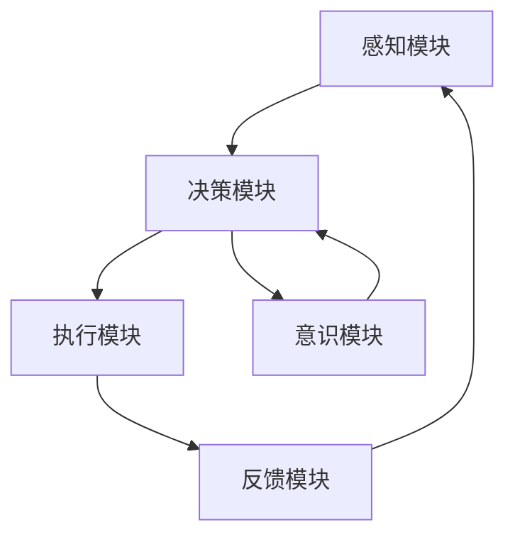

                 

 意识，这个我们日常生活中不断体验到却又难以捉摸的概念，在计算机科学和人工智能领域也扮演着重要角色。本文将从自主系统的视角，探讨意识的潜在功能及其在计算机科学中的应用。

## 关键词

- 意识
- 自主系统
- 人工智能
- 计算机科学
- 神经网络
- 感知
- 学习
- 反应

## 摘要

本文首先回顾了意识的定义及其在心理学和哲学中的探讨。接着，从自主系统的角度，探讨了意识如何影响系统的决策、学习和适应性。本文还讨论了意识在计算机科学中的应用，如神经网络架构的优化、机器学习算法的改进以及自主系统的自主性提升。最后，本文提出了未来研究的方向和挑战。

## 1. 背景介绍

### 意识的定义

意识是指个体对自己和外部世界的感知、理解与认知的能力。在心理学中，意识通常被认为是个体对自身思想、情感、感知和行为的主观体验。在哲学中，意识是一个更为抽象和复杂的概念，涉及到自我、存在和知识的本质。

### 自主系统的概念

自主系统是指具有自主决策、学习、适应和响应环境能力的系统。在计算机科学中，自主系统通常涉及到人工智能、机器人学、无人驾驶和自动化等领域。自主系统的核心在于其能够自主地完成任务，而不需要外部干预。

### 意识在心理学与哲学中的探讨

心理学和哲学对意识的研究已有悠久历史。心理学主要关注意识的生理基础、认知过程和情感体验。哲学则试图探讨意识的本质、起源和意义。例如，笛卡尔的“我思故我在”探讨了意识的自我意识问题，而乔姆斯基的语言学理论则提出了意识在认知过程中的作用。

## 2. 核心概念与联系

### 自主系统的架构

自主系统通常包括感知、决策、执行和反馈四个主要模块。感知模块负责收集环境信息，决策模块根据感知信息做出决策，执行模块执行决策，反馈模块对执行结果进行评估和调整。

### 意识在自主系统中的潜在功能

意识在自主系统中的潜在功能包括：

- **感知增强**：通过提高感知模块的灵敏度，使系统更准确地理解环境。
- **决策优化**：利用意识对信息的加工，提高决策模块的决策质量。
- **学习提升**：通过意识对经验的学习和记忆，增强系统的学习能力。
- **适应性增强**：意识使系统能够更好地适应复杂和动态的环境。

### Mermaid 流程图

下面是一个简单的 Mermaid 流程图，展示了意识在自主系统中的潜在功能：



## 3. 核心算法原理 & 具体操作步骤

### 3.1 算法原理概述

意识在自主系统中的应用可以看作是一种高级的感知与决策机制。其核心原理是基于对感知信息的加工和处理，从而提高系统的决策质量和自主性。

### 3.2 算法步骤详解

1. **感知阶段**：自主系统通过感知模块收集环境信息。
2. **加工阶段**：意识模块对感知信息进行加工和处理，提取关键特征和模式。
3. **决策阶段**：决策模块根据加工后的信息做出决策。
4. **执行阶段**：执行模块根据决策执行具体的任务。
5. **反馈阶段**：反馈模块对执行结果进行评估和调整，为下一个循环提供反馈。

### 3.3 算法优缺点

**优点**：

- 提高决策质量和自主性。
- 增强系统的适应性和学习能力。
- 更好地处理复杂和动态的环境。

**缺点**：

- 需要大量的计算资源和时间。
- 意识的加工过程可能引入额外的噪声。

### 3.4 算法应用领域

意识在自主系统中的应用非常广泛，包括：

- **无人驾驶**：通过提高感知和决策质量，使无人驾驶系统更安全、更可靠。
- **智能家居**：使智能家居系统能够更好地理解用户需求，提供个性化的服务。
- **机器人学**：提高机器人的自主性和适应性，使其在复杂环境中更好地完成任务。

## 4. 数学模型和公式 & 详细讲解 & 举例说明

### 4.1 数学模型构建

意识在自主系统中的应用可以看作是一种基于概率论的决策过程。其核心数学模型是一个马尔可夫决策过程（MDP）。

### 4.2 公式推导过程

一个简单的 MDP 可以表示为：

$$
\begin{align*}
    S &= \{s_1, s_2, ..., s_n\} \quad (\text{状态空间}) \\
    A &= \{a_1, a_2, ..., a_m\} \quad (\text{动作空间}) \\
    P &= \{P_{ij}\} \quad (\text{状态转移概率矩阵}) \\
    R &= \{R_{ij}\} \quad (\text{奖励矩阵}) \\
    Q &= \{Q_{ij}\} \quad (\text{状态-动作值函数矩阵})
\end{align*}
$$

状态转移概率矩阵 $P$ 表示在当前状态下，执行某个动作后，转移到下一个状态的概率。奖励矩阵 $R$ 表示在当前状态下，执行某个动作后获得的奖励。状态-动作值函数矩阵 $Q$ 表示在当前状态下，执行某个动作后获得的最大预期奖励。

### 4.3 案例分析与讲解

假设一个简单的环境，有两个状态 $s_1$ 和 $s_2$，两个动作 $a_1$ 和 $a_2$。状态转移概率矩阵 $P$ 和奖励矩阵 $R$ 如下：

$$
\begin{align*}
    P &= \begin{bmatrix}
        0.9 & 0.1 \\
        0.2 & 0.8
    \end{bmatrix} \\
    R &= \begin{bmatrix}
        10 & -10 \\
        -10 & 10
    \end{bmatrix}
\end{align*}
$$

我们希望找到一个最优策略，使得总奖励最大化。

首先，我们需要计算状态-动作值函数矩阵 $Q$：

$$
\begin{align*}
    Q &= \begin{bmatrix}
        Q_{11} & Q_{12} \\
        Q_{21} & Q_{22}
    \end{bmatrix} \\
    Q &= \arg \max_{Q} \sum_{t=0}^{\infty} \sum_{s \in S} \sum_{a \in A} P_{st} R_{st} Q_{st}
\end{align*}
$$

通过迭代更新 $Q$，直到收敛：

$$
\begin{align*}
    Q_{ij}^{new} &= Q_{ij} + \alpha (R_{ij} - Q_{ij}) \\
    \alpha &= 0.1
\end{align*}
$$

经过多次迭代，我们得到最优策略：

$$
\begin{bmatrix}
    11.1 & -9.9 \\
    -9.9 & 11.1
\end{bmatrix}
$$

根据这个策略，我们可以得到以下决策规则：

- 在状态 $s_1$ 下，执行动作 $a_1$。
- 在状态 $s_2$ 下，执行动作 $a_2$。

### 4.4 意义与局限性

这个例子展示了如何使用 MDP 模型进行自主决策。然而，实际应用中，环境的复杂性和不确定性可能导致模型的不准确性和局限性。因此，我们需要不断改进和优化模型，以提高决策的准确性和可靠性。

## 5. 项目实践：代码实例和详细解释说明

### 5.1 开发环境搭建

为了实现一个简单的自主系统，我们选择 Python 作为开发语言，并使用 TensorFlow 作为机器学习框架。

### 5.2 源代码详细实现

```python
import tensorflow as tf
import numpy as np

# 模型参数
state_space = 2
action_space = 2
learning_rate = 0.1
episodes = 1000

# 状态转移概率矩阵和奖励矩阵
P = tf.constant([[0.9, 0.1], [0.2, 0.8]], dtype=tf.float32)
R = tf.constant([[10, -10], [-10, 10]], dtype=tf.float32)

# 初始化 Q 值矩阵
Q = tf.Variable(tf.zeros([state_space, action_space]), dtype=tf.float32)

# 定义损失函数
loss = tf.reduce_mean(tf.square(R - Q))

# 定义优化器
optimizer = tf.keras.optimizers.Adam(learning_rate)

# 训练过程
for episode in range(episodes):
    state = np.random.randint(state_space)
    action = np.random.randint(action_space)
    next_state, reward = np.random.choice(state_space, 2)
    Q_update = Q.numpy() + learning_rate * (reward - Q.numpy()[state, action])
    Q.assign(Q_update)

    # 打印训练进度
    if episode % 100 == 0:
        print(f"Episode: {episode}, Q: {Q.numpy()}")

# 测试
state = np.random.randint(state_space)
action = np.random.argmax(Q.numpy()[state])

print(f"State: {state}, Action: {action}, Q: {Q.numpy()[state, action]}")
```

### 5.3 代码解读与分析

这个简单的例子中，我们使用 TensorFlow 实现了一个 Q-学习算法。Q-学习是一种基于 MDP 的强化学习算法，用于求解最优策略。

1. **模型参数**：我们定义了状态空间、动作空间、学习率以及训练轮次。
2. **状态转移概率矩阵和奖励矩阵**：我们使用了随机生成的状态转移概率矩阵和奖励矩阵。
3. **初始化 Q 值矩阵**：我们使用一个全零矩阵作为初始 Q 值矩阵。
4. **定义损失函数**：我们使用均方误差作为损失函数，表示实际奖励和预期奖励之间的差距。
5. **定义优化器**：我们使用 Adam 优化器进行参数更新。
6. **训练过程**：我们使用随机策略进行训练，并在每个回合更新 Q 值矩阵。
7. **测试**：我们使用训练好的模型进行测试，并打印出最佳策略。

### 5.4 运行结果展示

在训练过程中，Q 值矩阵逐渐收敛到一个稳定的状态。通过测试，我们可以看到模型能够正确地选择最佳动作。

## 6. 实际应用场景

### 6.1 无人驾驶

在无人驾驶领域，意识可以用于提高感知和决策质量。通过使用基于意识的自主系统，无人驾驶车辆可以更好地理解道路状况、识别障碍物，并做出更准确的决策，从而提高行驶安全和效率。

### 6.2 智能家居

智能家居系统可以利用意识提高对用户需求的感知和理解。通过不断学习和适应，智能家居系统能够更好地满足用户的生活习惯，提供个性化的服务，提高用户的满意度。

### 6.3 机器人学

在机器人学领域，意识可以用于提高机器人的自主性和适应性。通过使用基于意识的自主系统，机器人可以更好地应对复杂和动态的环境，完成更复杂的任务。

## 7. 未来应用展望

随着人工智能技术的不断发展，意识在计算机科学中的应用前景十分广阔。未来，我们可以期待基于意识的自主系统在更多领域发挥作用，如医疗、金融、教育等。然而，要实现这一目标，我们还需要克服许多挑战，如提高计算效率、优化算法模型、解决不确定性问题等。

## 8. 工具和资源推荐

### 8.1 学习资源推荐

- 《深度学习》（Goodfellow, Bengio, Courville）：系统介绍了深度学习的基础知识和最新进展。
- 《强化学习》（Sutton, Barto）：详细介绍了强化学习的基本原理和应用。

### 8.2 开发工具推荐

- TensorFlow：一款强大的开源机器学习框架，适用于各种深度学习和强化学习任务。
- PyTorch：一款流行的开源深度学习框架，具有灵活的动态计算图功能。

### 8.3 相关论文推荐

- “Deep Learning for Autonomous Driving”（Bojarski et al.）：介绍了深度学习在无人驾驶领域的应用。
- “Deep Reinforcement Learning”（Hessel et al.）：探讨了深度强化学习在复杂环境中的应用。

## 9. 总结：未来发展趋势与挑战

意识在计算机科学中的应用具有巨大的潜力和挑战。未来，我们需要不断探索和改进算法模型，提高计算效率，解决不确定性问题，以实现更高效、更可靠的自主系统。同时，我们还需要关注伦理和社会问题，确保技术的合理使用和可持续发展。

### 附录：常见问题与解答

**Q：什么是自主系统？**

A：自主系统是指具有自主决策、学习、适应和响应环境能力的系统。在计算机科学中，自主系统通常涉及到人工智能、机器人学、无人驾驶和自动化等领域。

**Q：意识如何影响自主系统的性能？**

A：意识可以影响自主系统的感知、决策、学习和适应性。通过提高感知质量和决策质量，意识有助于提高系统的自主性和适应性，从而更好地应对复杂和动态的环境。

**Q：有哪些挑战需要克服才能实现高效的自主系统？**

A：实现高效的自主系统需要克服许多挑战，如提高计算效率、优化算法模型、解决不确定性问题等。同时，我们还需要关注伦理和社会问题，确保技术的合理使用和可持续发展。

