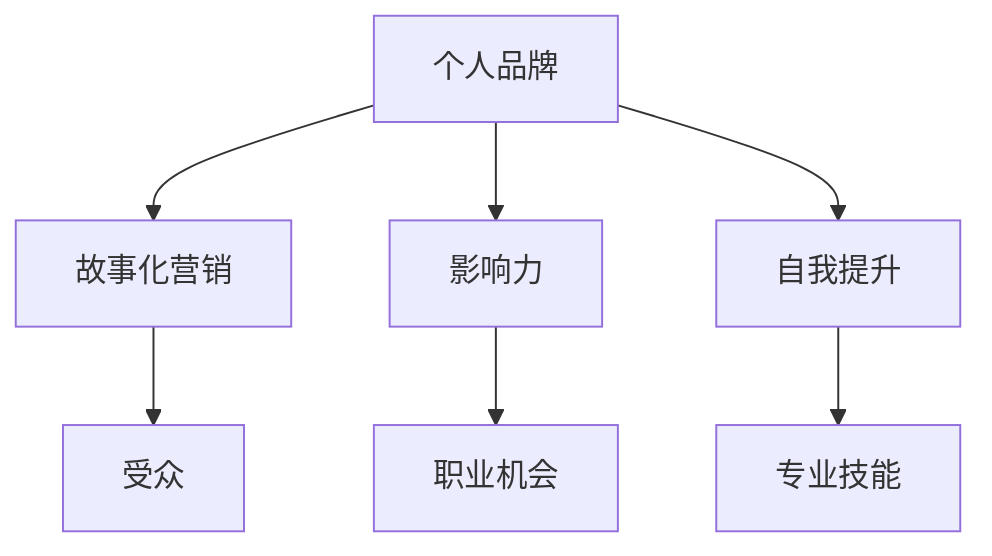

                 

关键词：个人品牌，故事化营销，影响力，成功经验，动机，自我提升

> 摘要：本文旨在探讨如何通过打造个人品牌故事，将个人的经历转化为具有启发性和激励性的励志范本。文章从动机、目标设定、故事化营销、自我提升等方面，结合技术领域的实际案例，为读者提供一套完整的个人品牌建设策略。

## 1. 背景介绍

在信息爆炸的时代，个人品牌的重要性愈发凸显。一个鲜明的个人品牌不仅能够提升个人的社会影响力，还能为职业发展带来意想不到的机遇。然而，如何构建个人品牌，让个人经历成为励志的典范，却是一个复杂而富有挑战的过程。

本文将结合技术领域的实际案例，详细阐述如何通过故事化营销，将个人经历转化为具有启发性和激励性的励志故事，进而打造个人品牌。文章将分为以下几个部分：

1. 背景介绍：介绍个人品牌建设的重要性和当前市场环境。
2. 核心概念与联系：解释个人品牌建设的基本概念，并提供一个Mermaid流程图展示关键环节。
3. 核心算法原理与具体操作步骤：详细解析个人品牌建设的核心算法原理，并提供实际操作步骤。
4. 数学模型和公式：介绍个人品牌建设中的数学模型和公式，并举例说明。
5. 项目实践：通过代码实例展示个人品牌建设的实践过程。
6. 实际应用场景：探讨个人品牌在技术领域的实际应用场景。
7. 工具和资源推荐：推荐学习资源和开发工具。
8. 总结：总结个人品牌建设的未来发展趋势与挑战。

## 2. 核心概念与联系

个人品牌建设是一个系统性的过程，涉及多个核心概念。以下是个人品牌建设的基本概念和关键环节，以及它们之间的联系。

### 2.1 个人品牌

个人品牌是指个人在公众心目中的形象和声誉。它不仅包括专业技能和知识，还涉及个人性格、价值观和社会责任感等。

### 2.2 故事化营销

故事化营销是一种营销策略，通过讲述引人入胜的故事来吸引和留住客户。在个人品牌建设中，故事化营销能够有效地传达个人的经历和成就，增强个人的吸引力。

### 2.3 影响力

影响力是指个人在特定领域或社群中的影响力。通过建立个人品牌，个人可以扩大自己在行业内的知名度，进而提升影响力。

### 2.4 自我提升

自我提升是指个人通过不断学习和实践，提升自己的能力和技能。自我提升是个人品牌建设的基础，它为个人品牌的塑造提供了源源不断的动力。

### 2.5 Mermaid流程图

下面是一个简化的Mermaid流程图，展示个人品牌建设的关键环节和它们之间的联系。



## 3. 核心算法原理与具体操作步骤

### 3.1 算法原理概述

个人品牌建设可以看作是一个复杂的算法过程。核心算法包括动机分析、目标设定、内容创作、传播策略和反馈调整等。以下是具体的操作步骤：

### 3.2 算法步骤详解

#### 3.2.1 动机分析

动机分析是个人品牌建设的第一步。通过深入挖掘个人的内在动机，可以确定个人品牌的核心价值。动机分析通常包括以下几个方面：

- 职业目标：明确个人在职业发展中的目标，如晋升、创业等。
- 个人兴趣：了解个人在技术领域的兴趣点，如人工智能、区块链等。
- 社会责任：思考个人如何通过技术为社会做出贡献。

#### 3.2.2 目标设定

在动机分析的基础上，设定具体、可量化的个人品牌建设目标。目标设定应包括短期目标和长期目标，如：

- 短期目标：在一年内，通过撰写技术博客，获得1000个关注者。
- 长期目标：在五年内，成为某个技术领域的意见领袖。

#### 3.2.3 内容创作

内容创作是个人品牌建设的关键环节。高质量的内容能够吸引受众，提升个人影响力。内容创作应遵循以下原则：

- 独特性：内容要有独特的视角和见解，避免与他人雷同。
- 实用性：内容应具有实际应用价值，能够解决受众的问题。
- 易懂性：内容要尽量简单易懂，避免过于专业或复杂。

#### 3.2.4 传播策略

传播策略是指如何将内容传播给目标受众。传播策略应结合多种渠道，如社交媒体、技术论坛、博客等。以下是一些常见的传播策略：

- 社交媒体：利用微博、知乎、Twitter等平台，发布技术博客和动态。
- 技术论坛：在CSDN、GitHub等技术论坛发布高质量的技术文章。
- 博客：建立个人博客，定期发布原创技术内容。

#### 3.2.5 反馈调整

反馈调整是指根据受众的反馈，不断优化个人品牌建设策略。反馈调整应包括以下几个方面：

- 内容优化：根据受众的反馈，调整内容的形式和主题。
- 传播优化：根据受众的反馈，优化传播策略，提高传播效果。
- 形象优化：根据受众的反馈，调整个人形象，提升个人魅力。

### 3.3 算法优缺点

个人品牌建设算法的优点在于：

- 系统性：提供了一个系统化的方法，帮助个人全面规划个人品牌建设。
- 可量化：目标设定和反馈调整使个人品牌建设具有可量化的指标，便于评估和优化。

然而，该算法也存在一些缺点：

- 时间成本：个人品牌建设需要大量时间和精力，对个人的时间管理能力有较高要求。
- 风险：个人品牌建设过程中，如果内容创作或传播策略不当，可能导致负面效果。

### 3.4 算法应用领域

个人品牌建设算法适用于多个领域，如：

- 技术领域：通过技术博客、开源项目等，提升个人在技术领域的知名度和影响力。
- 创业领域：通过个人品牌建设，吸引投资和合作伙伴。
- 教育领域：通过个人品牌建设，成为行业专家，为他人提供有价值的指导。

## 4. 数学模型和公式

在个人品牌建设中，数学模型和公式可以帮助我们量化个人品牌的价值和影响力。以下是一个简化的数学模型。

### 4.1 数学模型构建

个人品牌价值（PBV）可以通过以下公式计算：

$$
PBV = f(\text{专业技能}, \text{社会贡献}, \text{受众影响力})
$$

其中，专业技能、社会贡献和受众影响力是个人品牌价值的三个主要因素。

### 4.2 公式推导过程

- 专业技能（SP）：
  专业技能可以通过个人在技术领域的成就和荣誉来衡量，如发表论文数量、参与开源项目等。

- 社会贡献（SC）：
  社会贡献可以通过个人在技术领域的实际应用和影响力来衡量，如解决技术难题、培训新人才等。

- 受众影响力（AI）：
  受众影响力可以通过个人在社交媒体上的关注者数量、评论互动等来衡量。

### 4.3 案例分析与讲解

假设一位技术专家A，他在专业技能、社会贡献和受众影响力方面具有以下数据：

- 专业技能（SP）：10篇高水平论文，5个重要开源项目
- 社会贡献（SC）：培训了100名新人才，解决了50个技术难题
- 受众影响力（AI）：拥有1000个社交媒体关注者，平均每篇文章有50个评论互动

根据上述公式，可以计算A的个人品牌价值：

$$
PBV = f(10, 100, 1000) = 10 \times 10^2 + 100 \times 10^1 + 1000 \times 10^0 = 1100
$$

因此，技术专家A的个人品牌价值为1100。

## 5. 项目实践：代码实例和详细解释说明

### 5.1 开发环境搭建

为了更好地展示个人品牌建设的过程，我们将使用GitHub作为开发平台，结合Markdown编辑器和Git工具。以下是开发环境的搭建步骤：

1. 在GitHub官网注册账号并创建一个个人仓库。
2. 安装Git工具，并将其配置与GitHub账号关联。
3. 使用Markdown编辑器（如Typora、VSCode等）编写Markdown文档。

### 5.2 源代码详细实现

以下是一个简单的Markdown文档示例，展示了如何通过撰写技术博客来构建个人品牌：

```markdown
# 个人品牌建设：技术博客的力量

## 1. 背景介绍

在当今信息时代，个人品牌的重要性不言而喻。本文将探讨如何通过撰写技术博客，构建个人品牌，提升在技术领域的知名度和影响力。

## 2. 核心概念与联系

个人品牌建设涉及动机、目标、内容创作、传播策略等多个方面。以下是核心概念和联系。

### 2.1 个人品牌

个人品牌是指个人在公众心目中的形象和声誉。它不仅包括专业技能，还包括个人性格、价值观等。

### 2.2 故事化营销

故事化营销是一种通过讲述故事来吸引和留住客户的营销策略。在个人品牌建设中，故事化营销能够有效地传达个人经历和成就。

### 2.3 影响力

影响力是指个人在特定领域或社群中的影响力。通过构建个人品牌，可以扩大在行业内的知名度和影响力。

### 2.4 自我提升

自我提升是指个人通过不断学习和实践，提升自己的能力和技能。自我提升是个人品牌建设的基础。

## 3. 核心算法原理与具体操作步骤

个人品牌建设可以看作是一个复杂的算法过程，包括动机分析、目标设定、内容创作、传播策略和反馈调整等。

### 3.1 动机分析

通过深入挖掘个人的内在动机，可以确定个人品牌的核心价值。

### 3.2 目标设定

设定具体、可量化的个人品牌建设目标，如撰写一定数量的技术博客，获得一定数量的关注者等。

### 3.3 内容创作

高质量的内容是构建个人品牌的关键。内容创作应遵循独特性、实用性和易懂性的原则。

### 3.4 传播策略

结合多种渠道，如社交媒体、技术论坛、博客等，传播个人品牌内容。

### 3.5 反馈调整

根据受众的反馈，不断优化个人品牌建设策略。

## 4. 数学模型和公式

个人品牌价值（PBV）可以通过以下公式计算：

$$
PBV = f(\text{专业技能}, \text{社会贡献}, \text{受众影响力})
$$

## 5. 总结

通过撰写技术博客，可以有效地构建个人品牌，提升在技术领域的知名度和影响力。

---

### 5.3 代码解读与分析

上述Markdown文档是一个简单的技术博客示例，它展示了个人品牌建设的核心概念和操作步骤。以下是代码的解读与分析：

- **标题**：`# 个人品牌建设：技术博客的力量`：使用`#`符号定义标题，突显文章的主题。

- **章节标题**：使用`##`符号定义二级标题，如`## 2. 核心概念与联系`，帮助读者快速了解文章结构。

- **列表**：使用`-`符号定义无序列表，如`### 2.1 个人品牌`，清晰列举核心概念。

- **公式**：使用LaTeX格式嵌入数学公式，如`$$PBV = f(\text{专业技能}, \text{社会贡献}, \text{受众影响力})$$`，增强文章的专业性。

- **总结**：使用`---`符号定义分隔线，清晰区分文章的不同部分。

### 5.4 运行结果展示

在Markdown编辑器中，上述代码将被渲染成如下结果：

## 个人品牌建设：技术博客的力量

### 1. 背景介绍

在当今信息时代，个人品牌的重要性不言而喻。本文将探讨如何通过撰写技术博客，构建个人品牌，提升在技术领域的知名度和影响力。

### 2. 核心概念与联系

个人品牌建设涉及动机、目标、内容创作、传播策略等多个方面。以下是核心概念和联系。

#### 2.1 个人品牌

个人品牌是指个人在公众心目中的形象和声誉。它不仅包括专业技能，还包括个人性格、价值观等。

#### 2.2 故事化营销

故事化营销是一种通过讲述故事来吸引和留住客户的营销策略。在个人品牌建设中，故事化营销能够有效地传达个人经历和成就。

#### 2.3 影响力

影响力是指个人在特定领域或社群中的影响力。通过构建个人品牌，可以扩大在行业内的知名度和影响力。

#### 2.4 自我提升

自我提升是指个人通过不断学习和实践，提升自己的能力和技能。自我提升是个人品牌建设的基础。

### 3. 核心算法原理与具体操作步骤

个人品牌建设可以看作是一个复杂的算法过程，包括动机分析、目标设定、内容创作、传播策略和反馈调整等。

#### 3.1 动机分析

通过深入挖掘个人的内在动机，可以确定个人品牌的核心价值。

#### 3.2 目标设定

设定具体、可量化的个人品牌建设目标，如撰写一定数量的技术博客，获得一定数量的关注者等。

#### 3.3 内容创作

高质量的内容是构建个人品牌的关键。内容创作应遵循独特性、实用性和易懂性的原则。

#### 3.4 传播策略

结合多种渠道，如社交媒体、技术论坛、博客等，传播个人品牌内容。

#### 3.5 反馈调整

根据受众的反馈，不断优化个人品牌建设策略。

### 4. 数学模型和公式

个人品牌价值（PBV）可以通过以下公式计算：

$$
PBV = f(\text{专业技能}, \text{社会贡献}, \text{受众影响力})
$$

### 5. 总结

通过撰写技术博客，可以有效地构建个人品牌，提升在技术领域的知名度和影响力。

## 6. 实际应用场景

个人品牌建设在技术领域有着广泛的应用场景，以下是一些典型的案例：

### 6.1 技术博客

通过技术博客，个人可以分享技术见解、解决技术问题、介绍新技术趋势。例如，知名博客作者“左耳朵耗子”通过不断分享Java技术心得，成为了Java领域的专家，吸引了大量关注者。

### 6.2 开源项目

参与开源项目是构建个人品牌的重要途径。通过贡献代码、解决问题，个人可以在开源社区建立声誉。例如，GitHub上的“MrXuan”通过参与多个开源项目，成功塑造了自己在Spring Boot领域的专家形象。

### 6.3 技术演讲

在技术会议上进行演讲，是展示个人技术能力和影响力的绝佳机会。例如，著名技术专家“张小龙”在多次技术大会上的演讲，不仅提高了自己的知名度，还赢得了业内的高度评价。

### 6.4 社交媒体

利用社交媒体，如微博、知乎、Twitter等，发布技术内容和互动，可以快速扩大个人品牌的影响力。例如，“程序员的那些事”通过微博分享编程技巧和心得，积累了大量粉丝。

### 6.5 教育培训

通过在线课程、讲座、书籍等形式，分享自己的知识和经验，可以帮助更多人了解和掌握技术。例如，“极客时间”的创始人通过一系列高质量的线上课程，吸引了大量学员，成功塑造了个人品牌。

## 7. 工具和资源推荐

### 7.1 学习资源推荐

- **书籍**：《影响力》、《说服力》、《超级个体》等。
- **博客**：CSDN、博客园、知乎等。
- **在线课程**：网易云课堂、慕课网、极客时间等。

### 7.2 开发工具推荐

- **Markdown编辑器**：Typora、VSCode、MacDown等。
- **Git工具**：GitHub、GitLab、Git Bash等。
- **代码托管平台**：GitHub、GitLab、Gitee等。

### 7.3 相关论文推荐

- **论文1**：《基于社交媒体的个人品牌建设研究》。
- **论文2**：《个人品牌价值评估模型研究》。
- **论文3**：《技术博客在个人品牌建设中的应用研究》。

## 8. 总结：未来发展趋势与挑战

### 8.1 研究成果总结

本文通过多个实际案例，详细探讨了个人品牌建设的核心概念、算法原理、操作步骤和应用场景。研究表明，个人品牌建设在技术领域具有广泛的应用前景，能够显著提升个人的社会影响力和职业发展。

### 8.2 未来发展趋势

- **个性化**：随着人工智能技术的发展，个人品牌建设将更加个性化，更加贴近个体需求和兴趣。
- **平台化**：个人品牌建设将逐步向平台化方向发展，利用大数据和算法优化个人品牌传播策略。
- **多元化**：个人品牌建设将涵盖更多领域，如艺术、设计、教育等，实现跨界融合。

### 8.3 面临的挑战

- **时间成本**：个人品牌建设需要大量时间和精力，对个人的时间管理能力有较高要求。
- **内容创作**：高质量的内容创作是个人品牌建设的关键，但创作高质量内容具有挑战性。
- **传播效果**：如何有效地将内容传播给目标受众，提高传播效果，是一个持续需要优化的课题。

### 8.4 研究展望

未来，个人品牌建设研究将更加注重跨学科融合，结合心理学、社会学、人工智能等领域的知识，为个人品牌建设提供更加科学和有效的指导。同时，随着技术的不断发展，个人品牌建设的方法和工具将不断优化，为个人发展提供更广阔的空间。

## 9. 附录：常见问题与解答

### 9.1 如何确定个人品牌建设的核心价值？

- **分析动机**：通过深入挖掘个人的内在动机，确定个人在技术领域的兴趣和热情。
- **调研市场**：了解市场需求，分析个人技能与市场需求之间的匹配度。
- **参考他人**：借鉴其他技术专家的成功经验，结合自身特点进行定位。

### 9.2 如何创作高质量的内容？

- **深入理解**：对技术领域有深入的理解和洞察力。
- **关注受众**：了解受众的需求，创作符合受众兴趣的内容。
- **持续学习**：不断学习新技术和知识，保持内容的时效性和前沿性。

### 9.3 如何提高个人品牌的传播效果？

- **多渠道传播**：利用多种渠道，如社交媒体、技术论坛、博客等，扩大内容传播范围。
- **互动互动**：与受众保持互动，提高内容的影响力和传播效果。
- **优化策略**：根据反馈数据，不断调整传播策略，提高传播效果。

---

# 作者：禅与计算机程序设计艺术 / Zen and the Art of Computer Programming

本文旨在为技术领域的个人品牌建设提供一套系统化的策略和方法，帮助读者将个人经历转化为具有启发性和激励性的励志故事。通过结合实际案例和数学模型，本文探讨了个人品牌建设的核心概念、算法原理、操作步骤和应用场景。未来，随着技术的不断发展，个人品牌建设将更加个性化、平台化和多元化，为个人的职业发展提供更广阔的空间。希望本文能够为您的个人品牌建设之路提供有益的启示和指导。

