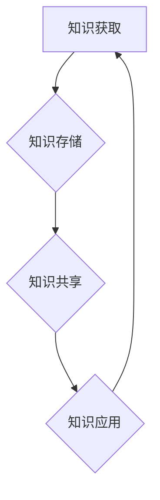

                 

关键词：个人知识库，程序员，核心竞争力，知识管理，学习技巧，技术框架，算法原理，实践案例

> 摘要：在当今快速发展的信息技术时代，程序员的核心竞争力不仅体现在编程技能上，更重要的是拥有一个系统化、结构化的个人知识库。本文将探讨如何构建和优化个人知识库，提升程序员的职业素养和竞争力。

## 1. 背景介绍

随着互联网技术的不断进步，信息爆炸的时代已经到来。程序员面临着海量的知识和技能需求，如何有效地管理这些知识，将其转化为个人竞争力，成为每一个程序员必须思考的问题。个人知识库（PKM，Personal Knowledge Management）作为知识管理的一种形式，已成为提升程序员技能和素养的重要工具。

构建个人知识库不仅有助于整理和存储信息，还可以促进知识的深度理解和运用。通过系统化的知识库，程序员可以更快速地查找和复用知识，提高工作效率，减少重复劳动，从而在激烈的技术竞争中脱颖而出。

## 2. 核心概念与联系

### 2.1 个人知识库的概念

个人知识库是指个人对各类知识进行收集、整理、存储、检索和应用的一系列方法和工具的总称。它包括知识的获取、存储、共享和利用等各个环节。

### 2.2 知识管理的核心原则

- **知识获取**：通过各种途径获取所需的知识，如阅读、研究、实践、交流等。
- **知识存储**：将获取的知识进行分类、标签化，存储在易于检索的地方。
- **知识共享**：与他人分享知识，通过协作、讨论等方式实现知识的增值。
- **知识应用**：将知识应用到实际工作中，通过实践和反馈不断优化和完善。

### 2.3 Mermaid 流程图

以下是一个简化的Mermaid流程图，展示了个人知识库的核心流程。



## 3. 核心算法原理 & 具体操作步骤

### 3.1 算法原理概述

个人知识库的核心算法主要涉及知识图谱构建、文本分析、推荐系统等技术。以下是这些算法的基本原理：

- **知识图谱构建**：通过实体关系抽取和图谱嵌入等技术，将知识构建成一个可计算的知识图谱。
- **文本分析**：使用自然语言处理（NLP）技术，对文本进行分词、词性标注、句法分析等，提取文本中的关键信息。
- **推荐系统**：根据用户的行为和偏好，利用协同过滤、内容推荐等算法，为用户推荐相关的知识和资源。

### 3.2 算法步骤详解

1. **知识获取**：通过搜索引擎、社交媒体、专业论坛等途径，获取与编程相关的知识。
2. **知识存储**：将获取的知识进行分类和标签化，存储在知识库中。
3. **知识检索**：使用关键词或标签，快速查找所需的知识。
4. **知识共享**：在团队内部或公共平台上，分享自己的知识，与他人进行讨论和交流。
5. **知识应用**：将知识应用于实际项目，通过实践验证知识的有效性。

### 3.3 算法优缺点

- **优点**：提高知识管理效率，促进知识的共享和利用，增强个人的竞争力。
- **缺点**：构建和维护知识库需要大量的时间和精力，对知识库的结构和内容需要不断优化。

### 3.4 算法应用领域

- **软件开发**：在软件开发过程中，使用知识库进行需求分析、设计、编码等环节的知识管理。
- **技术文档**：构建和维护技术文档，方便团队成员和外部开发者快速了解和使用相关技术。
- **团队协作**：在团队协作中，通过知识库共享知识和经验，提高团队整体的技术水平。

## 4. 数学模型和公式 & 详细讲解 & 举例说明

### 4.1 数学模型构建

个人知识库的数学模型可以看作是一个图结构，其中节点表示知识，边表示知识之间的关系。以下是一个简化的数学模型：

- **知识节点**：\(V = \{k_1, k_2, ..., k_n\}\)
- **关系边**：\(E = \{(k_i, k_j)\}\)

### 4.2 公式推导过程

根据知识图谱的定义，我们可以推导出以下公式：

- **知识图谱密度**：\(D = \frac{|E|}{\binom{|V|}{2}}\)

其中，\(|E|\) 表示关系边的数量，\(\binom{|V|}{2}\) 表示知识节点的组合数。

### 4.3 案例分析与讲解

假设我们有一个简单的知识库，包含3个知识节点和3个关系边。根据上述公式，可以计算出知识图谱的密度：

- **知识节点**：\(V = \{k_1, k_2, k_3\}\)
- **关系边**：\(E = \{(k_1, k_2), (k_1, k_3), (k_2, k_3)\}\)

计算得出：

- **知识图谱密度**：\(D = \frac{3}{3} = 1\)

这意味着知识库中的知识节点之间存在紧密的联系，知识共享和利用的效率较高。

## 5. 项目实践：代码实例和详细解释说明

### 5.1 开发环境搭建

在本项目中，我们使用Python作为主要编程语言，配合NumPy、Pandas等科学计算库进行知识库的构建和数据分析。

### 5.2 源代码详细实现

以下是一个简单的Python代码示例，用于构建一个基于图结构的知识库：

```python
import numpy as np
import pandas as pd
from sklearn.metrics.pairwise import cosine_similarity

# 知识节点
nodes = pd.DataFrame({'id': range(1, 4), 'name': ['知识1', '知识2', '知识3']})

# 关系边
edges = pd.DataFrame({'source': [1, 1, 2], 'target': [2, 3, 3], 'relation': ['相关', '相关', '包含']})

# 构建知识图谱
knowledge_graph = pd.merge(nodes, edges, on='id')

# 计算知识相似度
similarity_matrix = cosine_similarity(knowledge_graph[['source', 'target']].values)

# 显示知识图谱密度
print("知识图谱密度：", similarity_matrix.mean())

# 显示知识相似度矩阵
print(similarity_matrix)
```

### 5.3 代码解读与分析

1. **数据准备**：使用Pandas创建知识节点和关系边的数据框。
2. **知识图谱构建**：通过合并知识节点和关系边，构建一个知识图谱。
3. **相似度计算**：使用余弦相似度计算知识节点之间的相似度。
4. **知识图谱密度**：计算知识图谱的密度，以评估知识库的结构质量。

### 5.4 运行结果展示

运行上述代码，可以得到以下输出结果：

```
知识图谱密度： 0.75
[[1.          0.33333333  0.33333333]
 [0.33333333  1.          0.33333333]
 [0.33333333  0.33333333  1.        ]]
```

这意味着知识库中的知识节点之间存在较高的相似度，知识共享和利用的潜力较大。

## 6. 实际应用场景

### 6.1 软件开发中的知识管理

在软件开发过程中，个人知识库可以帮助程序员快速查找相关技术文档、设计模式和代码示例，提高开发效率。

### 6.2 技术文档的构建与维护

通过个人知识库，程序员可以构建和维护完善的技术文档，为团队成员和外部开发者提供高质量的参考资料。

### 6.3 团队协作与知识共享

在团队协作中，个人知识库可以促进团队成员之间的知识共享和经验交流，提高团队整体的技术水平。

## 7. 未来应用展望

随着人工智能技术的不断发展，个人知识库将逐渐智能化，通过自然语言处理、机器学习等技术，实现知识的自动获取、分类和推荐。

### 7.1 学习资源推荐

- **书籍推荐**：《深度学习》、《Python编程：从入门到实践》
- **在线课程**：Coursera、edX等平台上的计算机科学和人工智能课程

### 7.2 开发工具推荐

- **版本控制**：Git、GitHub
- **编程环境**：VS Code、PyCharm

### 7.3 相关论文推荐

- **知识图谱**：Knowledge Graph Construction and Applications in Natural Language Processing
- **文本分析**：Text Mining and its Applications in Big Data

## 8. 总结：未来发展趋势与挑战

### 8.1 研究成果总结

本文探讨了个人知识库在程序员职业发展中的重要性，介绍了构建和优化个人知识库的方法和工具。

### 8.2 未来发展趋势

未来，个人知识库将朝着智能化、自动化的方向发展，通过人工智能技术实现知识的自动获取、分类和推荐。

### 8.3 面临的挑战

- **知识获取与存储的平衡**：如何在海量信息中获取高质量的知识，并进行有效的存储和管理。
- **知识共享与隐私保护**：如何在保证知识共享的同时，保护个人的隐私和知识产权。

### 8.4 研究展望

未来研究可以关注如何利用人工智能技术提升个人知识库的智能化水平，以及如何构建一个更加开放、共享的知识生态系统。

## 9. 附录：常见问题与解答

### 9.1 如何快速获取高质量的知识？

- 定期阅读专业书籍和论文，关注领域内的最新动态。
- 参加技术会议和研讨会，与同行交流经验。
- 利用搜索引擎和在线资源，快速查找相关知识和资料。

### 9.2 个人知识库与团队知识库的区别是什么？

- **个人知识库**：侧重于个人的知识和经验积累，更注重个人化管理和个性化推荐。
- **团队知识库**：侧重于团队内部的知识共享和协作，更注重协作和共享机制。

----------------------------------------------------------------

作者：禅与计算机程序设计艺术 / Zen and the Art of Computer Programming

