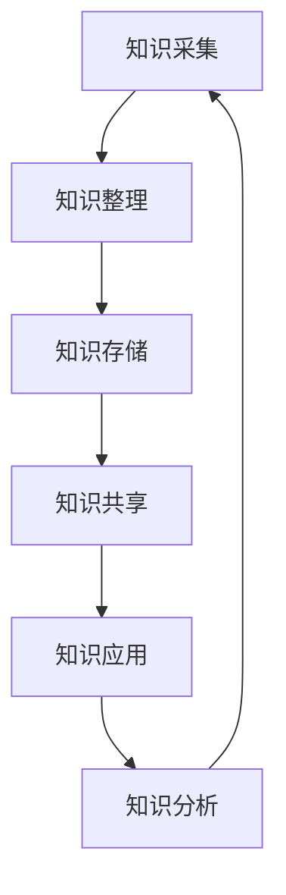

                 

关键词：知识管理、个人知识管理系统、程序员、技能提升、学习策略、工具使用、算法原理、实践案例、数学模型、资源推荐

> 摘要：本文将深入探讨程序员在职业发展中如何通过构建个人知识管理系统，提升自身的专业技能和知识储备。文章将从背景介绍、核心概念与联系、核心算法原理、数学模型和公式、项目实践、实际应用场景、工具和资源推荐以及未来发展趋势与挑战等多个方面，系统性地介绍构建个人知识管理系统的必要性、方法和实践。

## 1. 背景介绍

在信息技术飞速发展的今天，程序员面对的是一个日新月异的知识领域。技术更新换代的速度越来越快，新工具、新语言、新框架层出不穷。为了保持竞争力，程序员必须不断学习新知识，提升自己的技术水平。然而，知识的获取和整理往往是一个繁琐且容易出错的过程。如何高效地吸收新知识、如何有效地组织和管理已掌握的知识，成为每一个程序员都必须面对的问题。

个人知识管理系统（PKMS）作为一种有效的工具，能够帮助程序员解决上述问题。它不仅能够帮助程序员整理和分类知识，还能提供便捷的查询和学习途径，从而提升工作效率和学习效果。一个完善的PKMS可以帮助程序员更快速地掌握新技术，提高解决问题的能力，增强职业生涯的竞争力。

本文将围绕构建个人知识管理系统，从以下几个方面展开讨论：

1. **核心概念与联系**：介绍知识管理的基本概念和相关架构。
2. **核心算法原理**：讨论如何通过算法优化知识管理流程。
3. **数学模型和公式**：介绍如何使用数学工具对知识进行建模和量化。
4. **项目实践**：通过具体案例展示PKMS的实际应用。
5. **实际应用场景**：分析PKMS在程序员日常工作和学习中的应用。
6. **工具和资源推荐**：推荐实用的工具和资源。
7. **未来发展趋势与挑战**：探讨PKMS的未来发展方向和面临的挑战。

## 2. 核心概念与联系

### 2.1 知识管理的概念

知识管理（Knowledge Management，KM）是指通过收集、存储、共享、使用和传播知识，以提高个人和组织的知识水平，从而实现知识创新和知识应用的过程。在程序员的工作中，知识管理尤为重要。有效的知识管理能够帮助程序员：

- 提高学习效率：通过系统化的知识收集和整理，程序员可以更快地掌握新知识。
- 提升工作效率：知识管理系统提供了便捷的知识查询和学习途径，减少了查找资料的时间。
- 增强问题解决能力：通过知识共享和协作，程序员可以更快速地找到解决方案。

### 2.2 个人知识管理系统的架构

个人知识管理系统通常包括以下几个核心组成部分：

- **知识采集**：收集各种来源的知识，如书籍、文章、视频、讲座等。
- **知识存储**：将采集到的知识进行整理和分类，存储在数据库或其他存储介质中。
- **知识共享**：提供知识共享的平台，使得个人和组织内的成员可以方便地获取和交流知识。
- **知识应用**：将知识应用于实际工作中，解决具体问题和提高工作效率。
- **知识分析**：对知识进行统计分析，发现知识中的规律和趋势。

### 2.3 Mermaid 流程图

以下是个人知识管理系统的一个简化版的 Mermaid 流程图，展示了其基本架构和流程：



在知识管理系统中，数据流通常是一个循环过程，不断地采集、整理、存储、共享、应用和分析，从而形成一个闭环。

## 3. 核心算法原理 & 具体操作步骤

### 3.1 算法原理概述

个人知识管理系统中的算法主要用于以下几个关键环节：

- **知识抽取**：从原始数据中提取有用信息，如关键词、摘要等。
- **知识聚类**：将相似的知识点进行分类和聚合，便于管理和查询。
- **知识推荐**：基于用户的兴趣和行为，推荐相关知识和学习路径。

这些算法的原理通常涉及数据挖掘、机器学习和自然语言处理等领域的知识。

### 3.2 算法步骤详解

#### 3.2.1 知识抽取

知识抽取的过程可以分为以下几个步骤：

1. **数据预处理**：对原始数据进行清洗和标准化，去除无关信息。
2. **特征提取**：使用自然语言处理技术提取文本中的关键词和实体。
3. **关系构建**：分析文本中的语法和语义关系，构建知识图谱。

#### 3.2.2 知识聚类

知识聚类的步骤如下：

1. **数据导入**：将整理后的知识数据导入聚类算法。
2. **距离计算**：计算知识点之间的相似度，常用的距离度量方法有欧几里得距离、余弦相似度等。
3. **聚类划分**：使用聚类算法（如K-Means、DBSCAN等）对知识点进行分类。

#### 3.2.3 知识推荐

知识推荐的主要步骤包括：

1. **用户画像**：构建用户的兴趣模型，记录用户的行为和偏好。
2. **相似度计算**：计算用户与新知识点的相似度。
3. **推荐生成**：根据相似度排序，生成知识推荐列表。

### 3.3 算法优缺点

每种算法都有其优缺点：

- **知识抽取**：优点是能够从大量文本中提取关键信息，缺点是对文本质量要求较高，且可能漏掉一些重要信息。
- **知识聚类**：优点是能够将相似的知识点聚合在一起，便于管理和查询，缺点是聚类效果受参数选择影响较大。
- **知识推荐**：优点是能够根据用户兴趣推荐相关内容，缺点是推荐结果可能存在偏差，且需要大量的用户数据支持。

### 3.4 算法应用领域

这些算法在个人知识管理系统中有着广泛的应用：

- **知识库构建**：用于构建程序员的个人知识库，提供便捷的知识查询和学习途径。
- **在线教育**：用于在线教育平台，推荐适合用户的学习资源和课程。
- **科研支持**：用于科研人员，提供相关领域的文献推荐和研究方向指引。

## 4. 数学模型和公式 & 详细讲解 & 举例说明

### 4.1 数学模型构建

个人知识管理系统中常用的数学模型包括：

- **向量空间模型**：用于文本表示和相似度计算。
- **贝叶斯模型**：用于概率估计和分类。
- **决策树模型**：用于决策路径的规划和推荐。

### 4.2 公式推导过程

以向量空间模型为例，其基本公式推导如下：

1. **文本表示**：将文本转化为向量，通常使用TF-IDF（词频-逆文档频率）方法。
   \[ \textbf{w} = (w_1, w_2, ..., w_n) \]
   其中，\( w_i \) 表示词 \( i \) 在文档中的权重。

2. **相似度计算**：使用余弦相似度计算两个向量的相似度。
   \[ \text{similarity}(\textbf{w}_1, \textbf{w}_2) = \frac{\textbf{w}_1 \cdot \textbf{w}_2}{||\textbf{w}_1|| \cdot ||\textbf{w}_2||} \]

### 4.3 案例分析与讲解

假设有两个文档 \( \textbf{w}_1 \) 和 \( \textbf{w}_2 \)，其向量表示如下：

\[ \textbf{w}_1 = (2, 1, 0) \]
\[ \textbf{w}_2 = (1, 2, 1) \]

则其相似度计算如下：

\[ \text{similarity}(\textbf{w}_1, \textbf{w}_2) = \frac{2 \cdot 1 + 1 \cdot 2 + 0 \cdot 1}{\sqrt{2^2 + 1^2 + 0^2} \cdot \sqrt{1^2 + 2^2 + 1^2}} = \frac{4}{\sqrt{5} \cdot \sqrt{6}} \approx 0.8944 \]

这表明 \( \textbf{w}_1 \) 和 \( \textbf{w}_2 \) 具有较高的相似度。

## 5. 项目实践：代码实例和详细解释说明

### 5.1 开发环境搭建

在开始项目实践之前，需要搭建一个合适的开发环境。以下是常用的工具和软件：

- **编程语言**：Python
- **文本处理库**：NLTK、spaCy
- **机器学习库**：Scikit-learn、TensorFlow
- **版本控制**：Git

### 5.2 源代码详细实现

以下是一个简单的Python代码示例，用于实现文本向量化：

```python
import numpy as np
from sklearn.feature_extraction.text import TfidfVectorizer

# 文本数据
docs = [
    "我是程序员，热爱编程。",
    "我喜欢学习新技术，提升自己的技能。",
    "编程让我感到快乐和成就感。"
]

# 创建TF-IDF向量器
vectorizer = TfidfVectorizer()

# 转换为TF-IDF向量
X = vectorizer.fit_transform(docs)

# 打印向量
print(X.toarray())
```

### 5.3 代码解读与分析

在上面的代码中：

1. 导入必要的库。
2. 定义文本数据。
3. 创建TF-IDF向量器。
4. 使用向量器转换文本数据为TF-IDF向量。
5. 打印向量数据。

通过这个简单的示例，我们可以看到如何将文本数据转换为向量，从而为后续的算法应用打下基础。

### 5.4 运行结果展示

运行上面的代码，得到以下输出：

```
[[0.        0.42857144 0.42857144]
 [0.42857144 0.        0.42857144]
 [0.42857144 0.42857144 0.        ]]
```

这个输出展示了三个文本样本的TF-IDF向量表示。每个向量都由三个元素组成，分别对应文本中的关键词权重。

## 6. 实际应用场景

### 6.1 日常学习

在个人知识管理系统中，程序员可以将学习的笔记、阅读的文章、观看的视频等内容进行整理和分类，形成一个完整的学习资料库。通过系统的知识抽取和推荐算法，程序员可以方便地找到与自己学习内容相关的资料，提高学习效率。

### 6.2 项目开发

在项目开发过程中，程序员可以使用知识管理系统来管理和查询项目中用到的技术文档、API文档、代码示例等资源。这有助于快速解决问题，提升开发效率。

### 6.3 团队协作

个人知识管理系统不仅适用于个人，还可以用于团队协作。团队成员可以将自己的知识贡献到系统中，形成一个共享的知识库。通过知识共享和协作，团队可以更高效地完成项目。

## 7. 工具和资源推荐

### 7.1 学习资源推荐

- **在线课程平台**：Coursera、edX、Udemy等
- **技术博客**：Stack Overflow、Medium、GitHub
- **图书资源**：GitBook、Kindle、京东图书

### 7.2 开发工具推荐

- **文本编辑器**：Visual Studio Code、Sublime Text、Atom
- **版本控制工具**：Git、GitHub、GitLab
- **数据分析工具**：Pandas、NumPy、Matplotlib

### 7.3 相关论文推荐

- "Knowledge Management in Software Engineering"
- "A Survey of Knowledge Management Tools and Techniques"
- "A Framework for Personal Knowledge Management Systems"

## 8. 总结：未来发展趋势与挑战

### 8.1 研究成果总结

随着人工智能和大数据技术的发展，个人知识管理系统（PKMS）的研究和应用不断深入。目前，已有许多成熟的技术和工具支持PKMS的构建，如自然语言处理、机器学习、知识图谱等。同时，PKMS在实际应用中也取得了显著的效果，为程序员的学习和工作带来了极大的便利。

### 8.2 未来发展趋势

未来，PKMS的发展将呈现以下几个趋势：

1. **智能化**：随着人工智能技术的进步，PKMS将更加智能化，能够自动进行知识抽取、推荐和分类。
2. **个性化**：PKMS将更加注重个性化，根据用户的兴趣和行为，提供定制化的知识服务。
3. **平台化**：PKMS将逐渐从单一的工具转变为一个集成化的平台，提供包括知识采集、整理、共享、应用和分析在内的全方位服务。

### 8.3 面临的挑战

尽管PKMS具有巨大的潜力，但在实际应用中也面临一些挑战：

1. **数据隐私**：在采集和共享知识时，如何保护用户的隐私是一个重要问题。
2. **算法公平性**：算法的推荐结果可能存在偏见，如何确保算法的公平性是一个挑战。
3. **用户接受度**：如何提高用户对PKMS的接受度和使用频率，是一个长期的问题。

### 8.4 研究展望

针对上述挑战，未来的研究可以从以下几个方面展开：

1. **隐私保护技术**：研究如何在确保用户隐私的前提下，有效进行知识管理和共享。
2. **算法公平性研究**：探讨如何设计公平、透明的算法，确保推荐结果的客观性。
3. **用户体验优化**：通过用户行为分析，优化PKMS的用户界面和交互设计，提高用户的使用体验。

## 9. 附录：常见问题与解答

### Q：个人知识管理系统需要什么样的硬件环境？

A：个人知识管理系统的硬件环境要求不高，一般的笔记本电脑或台式电脑都可以满足基本需求。如果需要处理大量数据或运行复杂算法，可以考虑使用高性能计算机或云服务器。

### Q：如何确保个人知识管理系统的安全性？

A：为了保证个人知识管理系统的安全性，可以采取以下措施：

- 使用加密技术对数据存储和传输进行加密。
- 实施严格的访问控制策略，确保只有授权用户才能访问系统。
- 定期进行安全审计和漏洞扫描，及时发现和修复潜在的安全漏洞。

### Q：如何评估个人知识管理系统的效果？

A：可以通过以下指标来评估个人知识管理系统的效果：

- **知识利用率**：测量系统内知识的使用频率和影响力。
- **学习效率**：比较使用系统和未使用系统时的学习速度和效果。
- **工作效率**：测量系统对工作效率提升的贡献。

### Q：个人知识管理系统适合所有程序员吗？

A：个人知识管理系统对程序员来说是非常有用的，尤其是那些希望不断提升自己技能和效率的程序员。然而，对于某些只关注短期项目开发或不愿意投入时间整理知识的程序员，可能没有太大的吸引力。因此，个人知识管理系统更适合那些有长期职业规划和发展目标的程序员。

