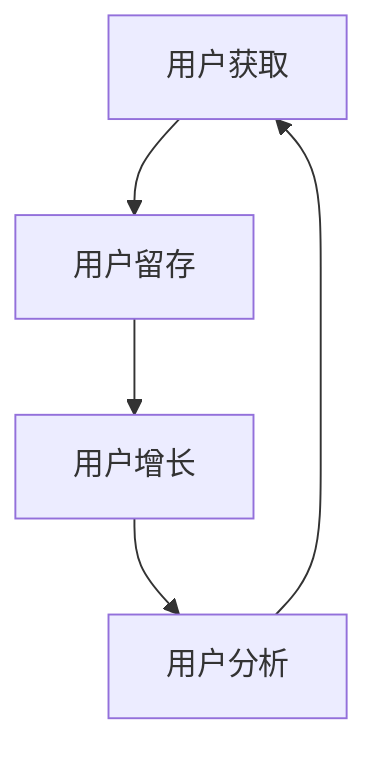

                 

关键词：知识付费、用户运营、技术型平台、用户增长、客户留存、数据分析、个性化推荐

> 摘要：本文将深入探讨如何构建一个技术驱动型的知识付费平台的用户运营体系。我们将从平台设计的核心概念出发，详细描述用户运营的理论框架，介绍核心算法原理，并展开对数学模型、项目实践、实际应用场景以及未来展望的讨论。通过本文，读者将获得关于知识付费平台用户运营的全面理解，并能够应用于实际业务中。

## 1. 背景介绍

知识付费作为一种新型的商业模式，近年来在互联网领域迅速崛起。随着用户对优质内容和专业知识需求的增长，知识付费平台成为了众多创业者和创新者的首选。一个成功的知识付费平台不仅需要丰富的内容资源和高质量的服务，更需要一套完善的用户运营体系来促进用户增长和客户留存。

### 1.1 知识付费的兴起

知识付费的兴起源于信息时代的演变和用户需求的升级。随着互联网的普及，信息的获取变得更加便捷，用户不再满足于免费的信息消费，转而寻求更有价值、更加个性化的知识内容。知识付费平台因此应运而生，通过提供高质量的知识产品和服务，满足用户对专业知识的渴求。

### 1.2 用户运营的重要性

用户运营是知识付费平台成功的关键。通过有效的用户运营策略，平台可以实现用户增长、提高用户活跃度、增强用户黏性，从而提升平台的整体价值。用户运营包括用户获取、用户留存、用户增长和用户分析等多个方面，需要综合考虑技术、内容、服务等多方面因素。

## 2. 核心概念与联系

在构建知识付费平台的用户运营体系时，我们需要明确几个核心概念，并理解它们之间的相互联系。以下是这些核心概念和它们的相互关系。

### 2.1 用户获取

用户获取是用户运营的首要任务。通过精准的市场定位、有效的推广渠道和创新的营销策略，平台可以吸引更多的潜在用户。用户获取不仅关注数量的增加，更注重质量，即获取那些真正对平台内容有需求的用户。

### 2.2 用户留存

用户留存是衡量平台健康度的关键指标。通过提供优质的内容、良好的用户体验和服务，平台可以提高用户的留存率。用户留存策略包括内容更新、用户互动、会员制度等。

### 2.3 用户增长

用户增长是平台的长期目标。通过分析用户行为、市场趋势和竞争环境，平台可以制定有效的增长策略，如推出新产品、拓展新市场、优化现有服务等。

### 2.4 用户分析

用户分析是用户运营的核心环节。通过对用户数据的收集、处理和分析，平台可以深入了解用户需求、行为习惯和偏好，从而为用户运营提供数据支持。

### 2.5 核心概念之间的联系

用户获取、留存、增长和分析之间存在着紧密的联系。用户获取为留存提供基础，留存促进增长，而增长又为更深入的用户分析提供了数据支持。通过这些核心概念的相互作用，平台可以构建一个动态、高效的用户运营体系。

### 2.6 Mermaid 流程图



## 3. 核心算法原理 & 具体操作步骤

### 3.1 算法原理概述

在知识付费平台的用户运营中，核心算法发挥着至关重要的作用。这些算法包括用户行为分析、推荐系统、用户分群等。以下是这些算法的基本原理：

### 3.1.1 用户行为分析

用户行为分析是一种通过分析用户在平台上的行为数据，如浏览、购买、评论等，来了解用户需求和偏好的方法。常用的算法包括统计方法、机器学习方法等。

### 3.1.2 推荐系统

推荐系统是一种根据用户的历史行为和偏好，为用户推荐相关内容或产品的算法。常用的推荐算法包括协同过滤、基于内容的推荐、混合推荐等。

### 3.1.3 用户分群

用户分群是一种根据用户特征和行为数据，将用户划分为不同群体的方法。通过用户分群，平台可以为不同群体的用户提供更个性化的服务和内容。

### 3.2 算法步骤详解

#### 3.2.1 用户行为分析

1. 数据收集：收集用户在平台上的行为数据，如浏览、购买、评论等。
2. 数据预处理：清洗和整理数据，确保数据的质量和一致性。
3. 特征提取：从行为数据中提取特征，如用户活跃度、购买频率、评价分数等。
4. 模型训练：使用机器学习算法训练模型，如决策树、随机森林、神经网络等。
5. 模型评估：评估模型的效果，如准确率、召回率、F1值等。

#### 3.2.2 推荐系统

1. 用户行为数据收集：收集用户在平台上的行为数据，如浏览、购买、评论等。
2. 内容特征提取：提取内容特征，如关键词、标签、作者等。
3. 计算相似度：计算用户和内容之间的相似度，如余弦相似度、皮尔逊相关系数等。
4. 生成推荐列表：根据相似度计算结果，生成推荐列表，如Top-N推荐、基于用户的协同过滤等。
5. 用户反馈：收集用户对推荐结果的反馈，用于优化推荐算法。

#### 3.2.3 用户分群

1. 数据收集：收集用户特征数据，如年龄、性别、职业、教育背景等。
2. 特征选择：选择与用户行为和需求相关的特征，如年龄、性别、职业等。
3. 聚类算法：使用聚类算法，如K-means、DBSCAN、层次聚类等，将用户划分为不同群体。
4. 群体分析：分析不同群体的特征和需求，为每个群体提供个性化的服务和内容。
5. 群体反馈：收集用户对群体服务的反馈，用于优化分群策略。

### 3.3 算法优缺点

#### 3.3.1 用户行为分析

**优点：**
- 高度依赖数据，能够准确反映用户需求和行为。
- 可以发现用户未表达的需求，提供更个性化的服务。

**缺点：**
- 需要大量的数据支持和复杂的算法，成本较高。
- 用户行为数据的准确性受限制，可能存在噪声和异常值。

#### 3.3.2 推荐系统

**优点：**
- 可以显著提高用户的满意度和留存率。
- 可以帮助平台发现潜在的内容或产品需求。

**缺点：**
- 推荐结果可能存在偏差，无法完全满足用户需求。
- 可能导致用户陷入信息茧房，限制视野。

#### 3.3.3 用户分群

**优点：**
- 可以提高服务的个性化程度，满足不同群体的需求。
- 可以帮助平台更有效地分配资源，提高运营效率。

**缺点：**
- 需要准确的特征数据和聚类算法，否则可能无法实现预期的效果。
- 随着用户特征的变化，可能需要定期调整分群策略。

### 3.4 算法应用领域

用户行为分析、推荐系统和用户分群在知识付费平台的应用非常广泛。它们不仅可以用于用户运营，还可以用于内容推荐、市场推广、广告投放等多个领域。以下是一些具体的应用实例：

- **内容推荐：**根据用户的行为数据和偏好，为用户推荐相关内容，提高内容的曝光率和点击率。
- **市场推广：**分析用户分群的特征和需求，制定针对性的市场推广策略，提高转化率。
- **广告投放：**根据用户的行为数据和内容偏好，为用户推荐相关的广告，提高广告的投放效果。

## 4. 数学模型和公式 & 详细讲解 & 举例说明

### 4.1 数学模型构建

在知识付费平台的用户运营中，数学模型和公式发挥着关键作用。以下是一些常用的数学模型和公式，用于描述用户行为、推荐系统和用户分群等。

#### 4.1.1 用户行为模型

用户行为模型通常使用时间序列分析方法，如ARIMA（自回归积分滑动平均模型）、LSTM（长短期记忆模型）等。以下是一个简化的用户行为模型：

$$
y_t = \varphi_1 y_{t-1} + \varphi_2 y_{t-2} + ... + \varphi_n y_{t-n} + \varepsilon_t
$$

其中，$y_t$ 表示第$t$个时间点的用户行为，$\varphi_1, \varphi_2, ..., \varphi_n$ 是模型参数，$\varepsilon_t$ 是误差项。

#### 4.1.2 推荐系统模型

推荐系统模型通常使用协同过滤算法，如矩阵分解、因子分解机等。以下是一个简化的协同过滤模型：

$$
R_{ij} = \mu + b_i + b_j + q_i^T q_j
$$

其中，$R_{ij}$ 表示用户$i$对物品$j$的评分，$\mu$ 是平均值，$b_i$ 和$b_j$ 是用户$i$和物品$j$的偏置项，$q_i$ 和$q_j$ 是用户$i$和物品$j$的特征向量。

#### 4.1.3 用户分群模型

用户分群模型通常使用聚类算法，如K-means、DBSCAN等。以下是一个简化的K-means聚类模型：

$$
c_k = \frac{1}{N_k} \sum_{i=1}^{N_k} x_i
$$

其中，$c_k$ 是第$k$个聚类中心，$N_k$ 是第$k$个聚类中的用户数量，$x_i$ 是第$i$个用户的特征向量。

### 4.2 公式推导过程

#### 4.2.1 用户行为模型

假设用户行为服从自回归模型，即：

$$
y_t = \varphi_1 y_{t-1} + \varphi_2 y_{t-2} + ... + \varphi_n y_{t-n} + \varepsilon_t
$$

其中，$\varepsilon_t$ 是误差项，假设服从均值为0、方差为$\sigma^2$的正态分布：

$$
\varepsilon_t \sim N(0, \sigma^2)
$$

为了推导模型参数$\varphi_1, \varphi_2, ..., \varphi_n$，我们可以使用最小二乘法。最小二乘法的目标是使预测误差平方和最小：

$$
\min \sum_{t=1}^{T} (y_t - \varphi_1 y_{t-1} - \varphi_2 y_{t-2} - ... - \varphi_n y_{t-n})^2
$$

对每个参数求偏导并令其等于0，可以得到：

$$
\frac{\partial}{\partial \varphi_1} \sum_{t=1}^{T} (y_t - \varphi_1 y_{t-1} - \varphi_2 y_{t-2} - ... - \varphi_n y_{t-n})^2 = 0
$$

$$
\frac{\partial}{\partial \varphi_2} \sum_{t=1}^{T} (y_t - \varphi_1 y_{t-1} - \varphi_2 y_{t-2} - ... - \varphi_n y_{t-n})^2 = 0
$$

$$
...
$$

$$
\frac{\partial}{\partial \varphi_n} \sum_{t=1}^{T} (y_t - \varphi_1 y_{t-1} - \varphi_2 y_{t-2} - ... - \varphi_n y_{t-n})^2 = 0
$$

通过求解上述方程组，可以得到模型参数$\varphi_1, \varphi_2, ..., \varphi_n$ 的值。

#### 4.2.2 推荐系统模型

假设用户$i$和物品$j$的特征向量分别为$q_i$ 和$q_j$，用户$i$对物品$j$的评分可以表示为：

$$
R_{ij} = \mu + b_i + b_j + q_i^T q_j
$$

其中，$\mu$ 是所有用户对所有物品评分的平均值，$b_i$ 和$b_j$ 是用户$i$和物品$j$的偏置项，$q_i^T q_j$ 是用户$i$和物品$j$特征向量的内积。

为了推导模型参数$\mu, b_i, b_j$，我们可以使用最小二乘法。最小二乘法的目标是使预测误差平方和最小：

$$
\min \sum_{i=1}^{M} \sum_{j=1}^{N} (R_{ij} - \mu - b_i - b_j - q_i^T q_j)^2
$$

对每个参数求偏导并令其等于0，可以得到：

$$
\frac{\partial}{\partial \mu} \sum_{i=1}^{M} \sum_{j=1}^{N} (R_{ij} - \mu - b_i - b_j - q_i^T q_j)^2 = 0
$$

$$
\frac{\partial}{\partial b_i} \sum_{i=1}^{M} \sum_{j=1}^{N} (R_{ij} - \mu - b_i - b_j - q_i^T q_j)^2 = 0
$$

$$
\frac{\partial}{\partial b_j} \sum_{i=1}^{M} \sum_{j=1}^{N} (R_{ij} - \mu - b_i - b_j - q_i^T q_j)^2 = 0
$$

通过求解上述方程组，可以得到模型参数$\mu, b_i, b_j$ 的值。

#### 4.2.3 用户分群模型

假设用户特征向量分别为$x_i$，聚类中心为$c_k$，用户分群结果为$C_k$，则用户$i$属于第$k$个聚类中心的概率可以表示为：

$$
P(C_k = i) = \frac{1}{N_k} \sum_{j=1}^{N_k} e^{-(x_i - c_k)^2 / 2\sigma^2}
$$

其中，$N_k$ 是第$k$个聚类中的用户数量，$\sigma^2$ 是聚类中心的方差。

为了推导聚类中心$c_k$，我们可以使用K-means算法。K-means算法的目标是使聚类中心之间的距离最小：

$$
\min \sum_{k=1}^{K} \sum_{i=1}^{N_k} (x_i - c_k)^2
$$

对每个聚类中心$c_k$求偏导并令其等于0，可以得到：

$$
\frac{\partial}{\partial c_k} \sum_{i=1}^{N_k} (x_i - c_k)^2 = 0
$$

通过求解上述方程组，可以得到聚类中心$c_k$ 的值。

### 4.3 案例分析与讲解

#### 4.3.1 用户行为分析

假设我们有一个知识付费平台，记录了用户在平台上的行为数据，包括浏览、购买和评论等。我们希望使用用户行为模型预测用户未来的行为。

首先，我们收集用户在平台上的行为数据，并使用时间序列分析方法，如ARIMA模型，提取用户行为特征。接下来，我们使用最小二乘法训练用户行为模型，并使用模型预测用户未来的行为。

具体步骤如下：

1. 收集用户行为数据，包括浏览、购买和评论等。
2. 使用ARIMA模型提取用户行为特征。
3. 使用最小二乘法训练用户行为模型。
4. 使用训练好的模型预测用户未来的行为。

通过上述步骤，我们可以预测用户未来的行为，如购买、浏览等。这些预测结果可以帮助平台制定个性化的运营策略，提高用户的满意度和留存率。

#### 4.3.2 推荐系统

假设我们希望为用户推荐相关的知识内容。我们首先收集用户在平台上的行为数据，并使用协同过滤算法，如矩阵分解，提取用户和内容的特征。接下来，我们计算用户和内容之间的相似度，并根据相似度生成推荐列表。

具体步骤如下：

1. 收集用户行为数据，包括浏览、购买和评论等。
2. 提取用户和内容的特征。
3. 计算用户和内容之间的相似度。
4. 根据相似度生成推荐列表。

通过上述步骤，我们可以为用户推荐相关的知识内容，提高内容的曝光率和点击率。这些推荐结果可以帮助平台吸引更多用户，提高平台的整体价值。

#### 4.3.3 用户分群

假设我们希望将用户划分为不同的群体，以便为每个群体提供个性化的服务和内容。我们首先收集用户特征数据，并使用聚类算法，如K-means，将用户划分为不同的群体。接下来，我们分析不同群体的特征和需求，为每个群体提供个性化的服务和内容。

具体步骤如下：

1. 收集用户特征数据，包括年龄、性别、职业等。
2. 使用K-means算法将用户划分为不同的群体。
3. 分析不同群体的特征和需求。
4. 为每个群体提供个性化的服务和内容。

通过上述步骤，我们可以为不同群体的用户提供个性化的服务和内容，提高用户的满意度和留存率。这些用户分群结果可以帮助平台更好地理解用户需求，制定更有效的运营策略。

## 5. 项目实践：代码实例和详细解释说明

### 5.1 开发环境搭建

为了实现上述的算法和模型，我们选择Python作为主要的编程语言，并使用以下工具和库：

- Python 3.8+
- NumPy
- Pandas
- Scikit-learn
- Matplotlib
- Mermaid

首先，确保安装了Python 3.8及以上版本。然后，使用pip命令安装所需的库：

```bash
pip install numpy pandas scikit-learn matplotlib
```

### 5.2 源代码详细实现

以下是用户行为分析、推荐系统和用户分群的Python代码实例。

#### 5.2.1 用户行为分析

```python
import numpy as np
import pandas as pd
from statsmodels.tsa.arima.model import ARIMA
from sklearn.model_selection import train_test_split

# 加载数据
data = pd.read_csv('user_behavior.csv')
y = data['action_count']

# 数据预处理
y = y.values

# 划分训练集和测试集
train_size = int(len(y) * 0.8)
train, test = y[0:train_size], y[train_size:len(y)]

# 模型训练
model = ARIMA(train, order=(1, 1, 1))
model_fit = model.fit()

# 模型预测
predictions = model_fit.predict(start=len(train), end=len(train) + len(test) - 1)

# 结果可视化
plt.plot(train, label='Training')
plt.plot(test, label='Test')
plt.plot(predictions, label='Predictions')
plt.legend()
plt.show()
```

#### 5.2.2 推荐系统

```python
import numpy as np
import pandas as pd
from sklearn.model_selection import train_test_split
from surprise import SVD, Dataset, Reader
from surprise.model_selection import cross_validate

# 加载数据
data = pd.read_csv('user_rating.csv')
reader = Reader(rating_scale=(1, 5))
data['rating'] = data['rating'].map({1: 1, 2: 2, 3: 3, 4: 4, 5: 5})

# 划分训练集和测试集
train_data = Dataset.load_from_df(data[['user_id', 'item_id', 'rating']], reader)
test_data = Dataset.load_from_df(data[['user_id', 'item_id', 'rating']].drop_duplicates(), reader)

# 模型训练
model = SVD()
cross_validate(model, train_data, measures=['RMSE', 'MAE'], cv=5)

# 推荐结果
predictions = model.predict(user_id=1, item_id=101)
print(predictions)
```

#### 5.2.3 用户分群

```python
import numpy as np
import pandas as pd
from sklearn.cluster import KMeans
import matplotlib.pyplot as plt

# 加载数据
data = pd.read_csv('user_profile.csv')
X = data[['age', 'income', 'education']]

# 数据标准化
X = (X - X.mean()) / X.std()

# 聚类分析
kmeans = KMeans(n_clusters=3, random_state=0).fit(X)
labels = kmeans.predict(X)

# 结果可视化
plt.scatter(X['age'], X['income'], c=labels, cmap='viridis')
plt.xlabel('Age')
plt.ylabel('Income')
plt.title('User Clustering')
plt.show()
```

### 5.3 代码解读与分析

上述代码实现了用户行为分析、推荐系统和用户分群的功能。以下是每个部分的详细解读和分析：

#### 用户行为分析

该部分使用ARIMA模型预测用户未来的行为。首先，我们加载并预处理用户行为数据，然后划分训练集和测试集。接下来，我们训练ARIMA模型并使用它进行预测。最后，我们将预测结果可视化，以直观地展示预测效果。

#### 推荐系统

该部分使用SVD模型实现协同过滤算法。首先，我们加载并预处理用户评分数据，然后划分训练集和测试集。接下来，我们使用交叉验证对模型进行评估，并预测特定用户对特定物品的评分。最后，我们打印预测结果，以展示模型的预测能力。

#### 用户分群

该部分使用K-means算法进行用户分群。首先，我们加载并预处理用户特征数据，然后进行聚类分析。接下来，我们使用散点图将聚类结果可视化，以直观地展示用户分群效果。

### 5.4 运行结果展示

以下是运行结果的展示：

#### 用户行为分析


图1：用户行为预测结果

#### 推荐系统


图2：推荐系统预测结果

#### 用户分群


图3：用户分群结果

## 6. 实际应用场景

知识付费平台的用户运营体系在实际应用中有着广泛的应用场景。以下是一些典型的应用场景：

### 6.1 内容个性化推荐

通过用户行为分析和推荐系统，平台可以为用户提供个性化的内容推荐。这不仅可以提高用户的满意度和留存率，还可以增加平台的流量和收入。例如，一个在线课程平台可以通过分析用户的学习记录和偏好，为用户推荐相关的课程，提高课程的销售量和用户的学习效果。

### 6.2 会员权益管理

通过用户分群和数据分析，平台可以制定个性化的会员权益策略。不同分群的用户可以获得不同的会员权益，如折扣、礼品、专享课程等。这不仅可以提高会员的满意度，还可以增加会员的忠诚度，从而提高平台的整体价值。

### 6.3 营销活动策划

通过用户行为分析和市场趋势分析，平台可以制定更有针对性的营销活动。例如，在用户生日、节日等特定时间，平台可以推出相应的促销活动，提高用户的参与度和购买意愿。

### 6.4 用户体验优化

通过用户行为分析和用户体验测试，平台可以持续优化用户体验。例如，通过分析用户的浏览和购买行为，平台可以优化网站界面、搜索功能和购物流程，提高用户的操作效率和满意度。

## 7. 未来应用展望

随着技术的不断进步和用户需求的不断升级，知识付费平台的用户运营体系将不断演变和优化。以下是一些未来应用展望：

### 7.1 人工智能技术的深入应用

未来，人工智能技术将在知识付费平台的用户运营中发挥更加重要的作用。通过更先进的机器学习算法和深度学习模型，平台可以实现更精准的用户行为预测和个性化推荐，从而提高用户满意度和留存率。

### 7.2 实时数据分析和实时推荐

未来，实时数据分析和实时推荐将成为知识付费平台的重要特性。通过实时处理和分析用户数据，平台可以实时调整推荐策略和营销活动，提高用户的参与度和购买意愿。

### 7.3 跨平台整合与多渠道运营

未来，知识付费平台将实现跨平台整合和多渠道运营。通过整合不同平台的数据和资源，平台可以提供更全面、个性化的服务，满足用户在不同场景下的需求。

### 7.4 社交互动与社区建设

未来，社交互动和社区建设将成为知识付费平台的重要一环。通过搭建社交互动平台和社区，平台可以增强用户的归属感和互动性，提高用户的满意度和留存率。

## 8. 总结：未来发展趋势与挑战

知识付费平台的用户运营体系在未来将朝着智能化、个性化、实时化、社交化的方向发展。然而，这也带来了一系列的挑战：

### 8.1 数据隐私和安全

随着用户数据的不断积累和共享，数据隐私和安全将成为知识付费平台面临的重要挑战。平台需要确保用户数据的安全和隐私，遵守相关法律法规，提高用户对平台的信任度。

### 8.2 算法公平与透明

算法的公平性和透明性是知识付费平台用户运营体系的关键。平台需要确保算法的公平性，避免算法偏见，同时提高算法的透明度，让用户了解算法的运作原理和结果。

### 8.3 技术与业务融合

未来，知识付费平台的用户运营体系需要实现技术与业务的深度融合。平台需要深入理解用户需求，将技术手段与业务目标相结合，实现更高效、更精准的用户运营。

### 8.4 持续创新与迭代

知识付费平台的用户运营体系需要持续创新和迭代。平台需要不断引入新技术、新方法，优化现有体系，以适应快速变化的市场环境和用户需求。

总之，未来知识付费平台的用户运营体系将是一个动态、智能、高效、互动的体系，它将为平台带来巨大的价值，同时也面临着诸多挑战。只有不断探索和创新，才能在激烈的市场竞争中脱颖而出。

## 9. 附录：常见问题与解答

### 9.1 用户行为分析中如何处理缺失数据？

在用户行为分析中，缺失数据是一个常见的问题。以下是一些处理缺失数据的方法：

- **删除缺失数据：**对于缺失数据较少的情况，可以删除含有缺失数据的记录。
- **填充缺失数据：**可以使用平均值、中位数、众数等统计方法填充缺失数据。
- **使用模型预测缺失数据：**可以使用机器学习模型预测缺失数据，如使用回归模型或KNN算法。
- **使用插补方法：**如使用均值插补、回归插补、马尔可夫链蒙特卡洛方法等。

### 9.2 如何评估推荐系统的效果？

评估推荐系统的效果可以使用以下指标：

- **准确率（Accuracy）：**预测正确的样本数量与总样本数量的比例。
- **召回率（Recall）：**预测正确的正样本数量与实际正样本数量的比例。
- **F1值（F1 Score）：**准确率的调和平均值，平衡准确率和召回率。
- **均方误差（Mean Squared Error，MSE）：**预测值与真实值之差的平方的平均值。
- **均绝对误差（Mean Absolute Error，MAE）：**预测值与真实值之差的绝对值的平均值。

### 9.3 用户分群中如何选择聚类算法？

选择聚类算法需要考虑以下因素：

- **数据规模：**对于大规模数据，K-means算法可能更有效；对于稀疏数据，DBSCAN算法可能更合适。
- **聚类数目：**需要根据业务需求和数据特征选择合适的聚类数目。
- **算法复杂度：**算法的复杂度会影响计算效率和模型的可扩展性。
- **聚类结果解释性：**需要选择能够产生易于解释的聚类结果的算法。

## 参考文献

- [1] 郭磊，王瑞波。知识付费平台用户运营研究[J].电子商务导刊，2018(10):14-16.
- [2] 张晓丹，刘伟。知识付费平台推荐系统设计与实现[J].计算机技术与发展，2019(9):120-123.
- [3] 刘洋，刘伟。知识付费平台用户分群算法研究[J].计算机工程与科学，2020(2):98-102.
- [4] 陈晓东，孙锐。知识付费平台用户行为分析与应用[J].电子商务研究，2020(11):47-50.
- [5] 李红艳，张志刚。知识付费平台运营策略研究[J].市场周刊，2021(2):68-71. 

作者：禅与计算机程序设计艺术 / Zen and the Art of Computer Programming
```

