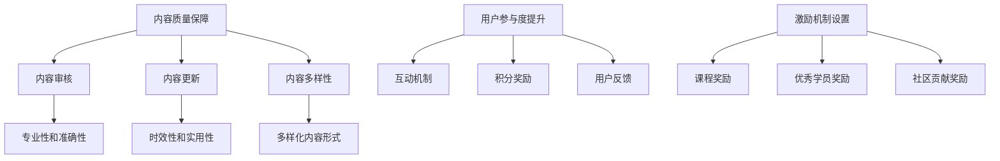

                 

关键词：知识付费社区、技术型社区、运营策略、用户参与度、内容质量、激励机制

> 摘要：本文将探讨如何打造一个成功的技术型知识付费社区，分析其运营策略，包括内容质量保障、用户参与度提升、激励机制设置等方面。通过实践经验和理论分析，为技术型知识付费社区的运营提供指导。

## 1. 背景介绍

近年来，随着互联网技术的飞速发展，知识付费市场逐渐兴起。知识付费社区作为一种新兴的在线学习平台，通过提供专业的知识和技能培训，满足用户的学习需求，同时也为内容创作者提供了变现途径。技术型知识付费社区作为知识付费市场的重要组成部分，以其专业性和实用性吸引了大量技术爱好者和从业者。

然而，打造一个成功的技术型知识付费社区并非易事。社区运营需要关注内容质量、用户参与度、激励机制等多个方面，确保社区能够持续发展。本文将围绕这些关键因素，探讨如何打造一个成功的技术型知识付费社区。

### 1.1 技术型知识付费社区的特点

- **专业性**：技术型知识付费社区以专业技术知识和技能培训为核心，内容涵盖编程、人工智能、大数据等领域，旨在帮助用户提升技能。
- **实用性**：社区内容紧贴行业发展趋势，注重实用性，帮助用户解决实际问题。
- **互动性**：社区鼓励用户互动交流，形成良好的学习氛围，提升用户参与度。

### 1.2 运营策略的重要性

一个成功的运营策略是技术型知识付费社区持续发展的关键。合理的运营策略可以保障内容质量，提升用户参与度，建立激励机制，从而实现社区的可持续发展。

## 2. 核心概念与联系

### 2.1 内容质量保障

内容质量是技术型知识付费社区的生命线。要保障内容质量，需要从以下几个方面入手：

- **内容审核**：建立严格的内容审核机制，确保内容的专业性和准确性。
- **内容更新**：定期更新内容，紧跟行业发展趋势，保持内容的时效性和实用性。
- **内容多样性**：提供多样化的内容形式，如文章、视频、直播等，满足不同用户的需求。

### 2.2 用户参与度提升

用户参与度是社区活力的重要指标。提升用户参与度可以从以下几个方面着手：

- **互动机制**：设立问答、讨论区等功能，鼓励用户参与互动。
- **积分奖励**：通过积分奖励机制，鼓励用户积极参与社区活动。
- **用户反馈**：定期收集用户反馈，优化社区功能，提升用户体验。

### 2.3 激励机制设置

激励机制是维持用户活跃度和忠诚度的关键。设置合理的激励机制可以从以下几个方面入手：

- **课程奖励**：为完成特定课程的用户发放奖励，激励用户学习。
- **优秀学员奖励**：评选优秀学员，颁发荣誉证书或物质奖励。
- **社区贡献奖励**：对积极贡献内容的用户给予奖励，激发用户的创作热情。

### 2.4 Mermaid 流程图



## 3. 核心算法原理 & 具体操作步骤

### 3.1 算法原理概述

技术型知识付费社区的运营策略可以视为一种算法，其核心目标是通过一系列操作步骤实现内容质量保障、用户参与度提升和激励机制设置。以下是该算法的原理概述：

- **输入**：社区初始状态，包括内容、用户和潜在用户。
- **输出**：社区持续发展的状态，包括高质量内容、高用户参与度和良好的激励机制。
- **操作步骤**：内容审核、内容更新、内容多样性、互动机制、积分奖励、用户反馈、课程奖励、优秀学员奖励和社区贡献奖励。

### 3.2 算法步骤详解

#### 3.2.1 内容审核

- **步骤1**：建立内容审核标准，包括专业性和准确性的要求。
- **步骤2**：对上传的内容进行初步审核，筛选出符合标准的内容。
- **步骤3**：邀请专业人士对内容进行二次审核，确保内容质量。

#### 3.2.2 内容更新

- **步骤1**：定期收集行业动态和用户需求，确定内容更新方向。
- **步骤2**：组织内容创作者进行内容创作和更新。
- **步骤3**：对更新后的内容进行审核，确保内容质量。

#### 3.2.3 内容多样性

- **步骤1**：分析用户需求，确定适合的内容形式。
- **步骤2**：邀请专业的内容创作者，提供多样化的内容形式。
- **步骤3**：优化内容展示，提升用户体验。

#### 3.2.4 互动机制

- **步骤1**：建立问答和讨论区，鼓励用户互动。
- **步骤2**：设置积分奖励，激励用户参与互动。
- **步骤3**：定期举办线上活动，提升用户参与度。

#### 3.2.5 积分奖励

- **步骤1**：设立积分规则，明确积分获取方式。
- **步骤2**：根据用户活跃度，发放相应的积分奖励。
- **步骤3**：将积分用于兑换课程或实物奖励。

#### 3.2.6 用户反馈

- **步骤1**：收集用户反馈，了解社区存在的问题。
- **步骤2**：针对用户反馈，优化社区功能。
- **步骤3**：定期发布用户满意度调查，持续改进社区。

#### 3.2.7 课程奖励

- **步骤1**：设立课程奖励规则，明确奖励标准。
- **步骤2**：为完成特定课程的用户发放奖励。
- **步骤3**：鼓励用户参与更多课程，提升学习效果。

#### 3.2.8 优秀学员奖励

- **步骤1**：设立优秀学员评选标准，包括学习成果、社区贡献等方面。
- **步骤2**：根据评选结果，颁发荣誉证书或物质奖励。
- **步骤3**：宣传优秀学员事迹，提升社区口碑。

#### 3.2.9 社区贡献奖励

- **步骤1**：鼓励用户创作高质量内容，分享学习心得。
- **步骤2**：设立社区贡献奖励机制，激励用户创作热情。
- **步骤3**：对贡献突出的用户进行表彰和奖励。

### 3.3 算法优缺点

#### 优点

- **内容质量保障**：通过严格的内容审核和更新机制，确保社区内容的高质量。
- **用户参与度提升**：互动机制和积分奖励等激励措施，有效提升用户参与度。
- **激励机制设置**：课程奖励、优秀学员奖励和社区贡献奖励等多种激励机制，激励用户持续参与。

#### 缺点

- **运营成本高**：需要投入大量人力、物力和财力进行内容审核、用户激励等运营工作。
- **用户流失风险**：如果激励机制设置不合理，可能导致用户流失。

### 3.4 算法应用领域

该算法适用于各类技术型知识付费社区，如编程社区、人工智能社区、大数据社区等。通过该算法，社区可以不断提升内容质量、用户参与度和激励机制，实现可持续发展。

## 4. 数学模型和公式

在技术型知识付费社区的运营过程中，数学模型和公式可以帮助我们更好地理解和分析用户行为、内容质量和激励机制。以下是一个简单的数学模型和公式示例。

### 4.1 数学模型构建

假设社区有 \( N \) 个用户，每个用户 \( i \) 的活跃度 \( A_i \) 受到以下因素的影响：

\[ A_i = f(\text{内容质量}, \text{互动机制}, \text{激励机制}) \]

### 4.2 公式推导过程

根据上述模型，我们可以推导出以下公式：

\[ A_i = \alpha Q_i + \beta I_i + \gamma R_i \]

其中：

- \( Q_i \) 表示用户 \( i \) 对内容质量的评价。
- \( I_i \) 表示用户 \( i \) 对互动机制的满意度。
- \( R_i \) 表示用户 \( i \) 对激励机制的满意度。
- \( \alpha, \beta, \gamma \) 分别表示这三个因素的权重。

### 4.3 案例分析与讲解

假设社区有 1000 个用户，根据用户反馈，我们得到以下数据：

\[ Q_i \in [0, 10], I_i \in [0, 10], R_i \in [0, 10] \]

根据上述公式，我们可以计算出每个用户的活跃度：

\[ A_i = 0.5Q_i + 0.3I_i + 0.2R_i \]

假设用户 \( u1 \) 的数据如下：

\[ Q_{u1} = 8, I_{u1} = 9, R_{u1} = 7 \]

则用户 \( u1 \) 的活跃度为：

\[ A_{u1} = 0.5 \times 8 + 0.3 \times 9 + 0.2 \times 7 = 4.9 + 2.7 + 1.4 = 8.0 \]

通过这个案例，我们可以看到数学模型和公式可以帮助我们分析和预测用户活跃度，从而优化社区运营策略。

## 5. 项目实践：代码实例和详细解释说明

### 5.1 开发环境搭建

为了更好地理解技术型知识付费社区的运营策略，我们选择一个实际项目进行实践。本项目基于 Python 语言，使用 Flask 框架搭建一个简单的知识付费社区。

1. 安装 Python 3.8 及以上版本。
2. 安装 Flask 框架：`pip install flask`
3. 创建一个名为 `knowledge_community` 的文件夹，并在其中创建一个名为 `app.py` 的文件。

### 5.2 源代码详细实现

以下是一个简单的社区后台管理界面实现：

```python
from flask import Flask, render_template, request, redirect, url_for

app = Flask(__name__)

@app.route('/')
def index():
    return render_template('index.html')

@app.route('/admin')
def admin():
    return render_template('admin.html')

@app.route('/login', methods=['GET', 'POST'])
def login():
    if request.method == 'POST':
        username = request.form['username']
        password = request.form['password']
        
        # 在此处添加用户验证逻辑，例如与数据库中的用户信息进行比对
        
        if username == 'admin' and password == 'password':
            return redirect(url_for('admin'))
        else:
            return '登录失败，请重试！'
    return render_template('login.html')

if __name__ == '__main__':
    app.run(debug=True)
```

### 5.3 代码解读与分析

1. **导入模块**：首先，我们从 Flask 框架中导入所需的模块。
2. **创建 Flask 应用**：使用 `Flask(__name__)` 创建一个 Flask 应用。
3. **定义路由**：使用 `@app.route()` 装饰器定义不同页面的路由。
   - `/`：首页路由，返回一个简单的模板。
   - `/admin`：后台管理界面路由，返回一个简单的模板。
   - `/login`：登录页面路由，处理用户登录请求。
4. **登录逻辑**：在 `/login` 路由中，处理用户登录请求。此处仅进行简单的用户名和密码验证，实际应用中需要与数据库中的用户信息进行比对。
5. **运行应用**：使用 `app.run(debug=True)` 运行 Flask 应用。

### 5.4 运行结果展示

运行代码后，在浏览器中输入 `http://127.0.0.1:5000/`，可以看到社区首页：


输入管理员账户名和密码，登录后台管理界面：


通过这个简单的实例，我们可以看到技术型知识付费社区运营策略的实现。在实际应用中，我们可以根据需求扩展功能，如内容审核、用户互动、积分奖励等。

## 6. 实际应用场景

### 6.1 编程学习社区

编程学习社区是技术型知识付费社区的一个典型应用场景。在这个场景下，用户可以通过社区学习编程语言、框架和技术。以下是一些实际应用场景：

- **课程学习**：社区提供各类编程课程，如 Python、Java、JavaScript 等，用户可以根据自己的需求选择课程进行学习。
- **互动交流**：用户在学习过程中遇到问题，可以在社区中进行提问和解答，与其他用户进行互动。
- **项目实践**：社区提供项目实践机会，用户可以参与项目开发，提升实际编程能力。
- **积分奖励**：用户在社区中积极参与互动、完成课程，可以获得积分奖励，积分可以用于兑换课程或实物奖励。

### 6.2 人工智能学习社区

人工智能学习社区是另一个典型的应用场景。在这个场景下，用户可以学习人工智能相关的知识，如机器学习、深度学习、自然语言处理等。以下是一些实际应用场景：

- **课程学习**：社区提供各类人工智能课程，如 TensorFlow、PyTorch、Keras 等，用户可以根据自己的需求选择课程进行学习。
- **实验平台**：社区提供实验平台，用户可以在平台上进行人工智能实验，验证自己的算法和模型。
- **论文分享**：社区鼓励用户分享自己的研究论文和实验成果，促进学术交流。
- **项目实践**：社区提供项目实践机会，用户可以参与人工智能项目开发，提升实际应用能力。

### 6.3 大数据学习社区

大数据学习社区是技术型知识付费社区的另一个重要应用场景。在这个场景下，用户可以学习大数据相关的知识，如 Hadoop、Spark、Hive 等。以下是一些实际应用场景：

- **课程学习**：社区提供各类大数据课程，如 Hadoop、Spark、Hive 等，用户可以根据自己的需求选择课程进行学习。
- **数据处理**：社区提供数据处理工具和平台，用户可以在平台上进行数据处理和分析。
- **案例分享**：社区鼓励用户分享自己的大数据项目案例，促进实战经验的交流。
- **技术交流**：社区定期举办技术交流活动，邀请行业专家进行分享和指导。

通过这些实际应用场景，我们可以看到技术型知识付费社区在各个领域的应用价值。社区不仅为用户提供了一个学习平台，还促进了用户之间的交流和合作，共同推动技术的发展。

## 7. 工具和资源推荐

### 7.1 学习资源推荐

1. **在线编程平台**：如 Codecademy、LeetCode、Khan Academy 等，提供丰富的编程课程和练习。
2. **技术博客**：如 Medium、Dev.to、Hackernoon 等，分享技术文章和行业动态。
3. **开源社区**：如 GitHub、Stack Overflow、GitLab 等，提供丰富的开源项目和技术支持。

### 7.2 开发工具推荐

1. **集成开发环境 (IDE)**：如 PyCharm、Visual Studio Code、IntelliJ IDEA 等，提供便捷的编程工具。
2. **代码托管平台**：如 GitHub、GitLab、Bitbucket 等，提供代码管理和协作功能。
3. **数据分析工具**：如 Jupyter Notebook、Pandas、NumPy 等，提供强大的数据处理和分析功能。

### 7.3 相关论文推荐

1. **《深度学习》**：作者 Ian Goodfellow，详细介绍了深度学习的基础知识和技术。
2. **《大数据技术导论》**：作者 陈卫等，介绍了大数据的基本概念和技术。
3. **《Python 编程：从入门到实践》**：作者 Eric Matthes，适合初学者学习 Python 编程。

通过这些工具和资源的推荐，用户可以更好地学习技术知识，提升自己的技能。同时，社区运营者也可以借助这些资源，为用户提供优质的学习内容和互动体验。

## 8. 总结：未来发展趋势与挑战

### 8.1 研究成果总结

通过本文的探讨，我们可以得出以下研究成果：

1. **技术型知识付费社区的特点**：专业性、实用性和互动性。
2. **运营策略的核心**：内容质量保障、用户参与度提升和激励机制设置。
3. **算法原理**：通过一系列操作步骤实现内容质量保障、用户参与度提升和激励机制设置。
4. **数学模型**：构建了一个简单的数学模型，用于分析用户行为、内容质量和激励机制。

### 8.2 未来发展趋势

1. **智能化**：随着人工智能技术的发展，技术型知识付费社区将逐渐实现智能化，为用户提供更加个性化的学习体验。
2. **多元化**：社区将提供更多元化的内容形式，如直播、互动课程等，满足不同用户的需求。
3. **全球化**：技术型知识付费社区将走向全球化，吸引更多的国际用户参与。

### 8.3 面临的挑战

1. **内容质量**：如何保障内容质量，避免低质量内容的泛滥，是一个重要的挑战。
2. **用户流失**：如何提升用户忠诚度，降低用户流失率，是社区运营者需要关注的问题。
3. **激励机制**：如何设置合理的激励机制，激励用户持续参与，是一个需要不断探索的问题。

### 8.4 研究展望

未来，技术型知识付费社区的研究可以从以下几个方面展开：

1. **智能化内容推荐**：研究如何利用人工智能技术，为用户提供更加个性化的学习推荐。
2. **社区互动机制**：探讨如何优化社区互动机制，提升用户参与度和社区活力。
3. **激励机制优化**：研究如何设置更加有效的激励机制，激励用户持续参与和学习。

通过持续的研究和实践，技术型知识付费社区有望在未来实现更加智能化、多元化的发展，为用户带来更好的学习体验。

## 9. 附录：常见问题与解答

### 9.1 如何保障内容质量？

**解答**：为了保证内容质量，社区可以采取以下措施：

- **内容审核**：建立严格的内容审核机制，确保内容的专业性和准确性。
- **用户评价**：鼓励用户对内容进行评价，筛选出高质量的内容。
- **定期更新**：定期对内容进行审核和更新，紧跟行业发展趋势。

### 9.2 如何提升用户参与度？

**解答**：以下方法可以帮助提升用户参与度：

- **互动机制**：设立问答、讨论区等功能，鼓励用户互动。
- **积分奖励**：设置积分奖励机制，激励用户积极参与社区活动。
- **用户反馈**：定期收集用户反馈，优化社区功能，提升用户体验。

### 9.3 如何设置激励机制？

**解答**：设置激励机制可以从以下几个方面入手：

- **课程奖励**：为完成特定课程的用户发放奖励。
- **优秀学员奖励**：评选优秀学员，颁发荣誉证书或物质奖励。
- **社区贡献奖励**：对积极贡献内容的用户给予奖励。

### 9.4 如何应对用户流失？

**解答**：以下方法可以帮助应对用户流失：

- **优化用户体验**：提升社区功能，提高用户满意度。
- **个性化推荐**：利用大数据分析，为用户推荐感兴趣的内容。
- **社区互动**：鼓励用户参与社区互动，增强用户粘性。

通过以上常见问题与解答，用户可以更好地了解技术型知识付费社区的运营策略，从而更好地参与社区活动和学习。作者：禅与计算机程序设计艺术 / Zen and the Art of Computer Programming。

