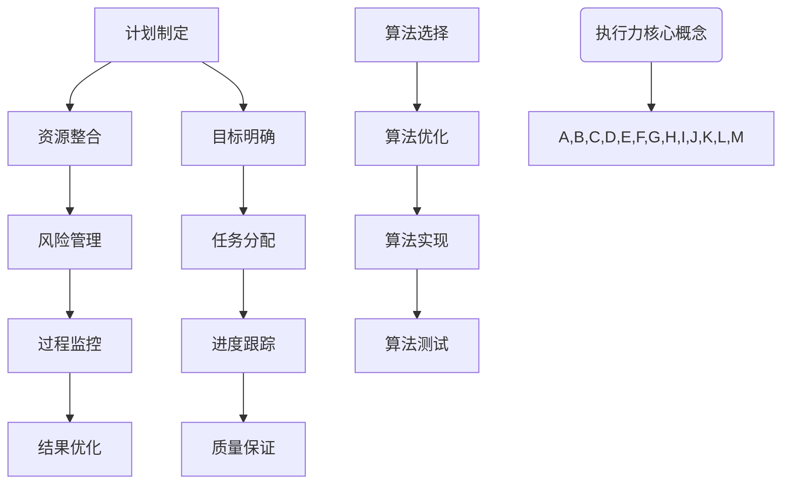

                 

关键词：执行力、项目管理、技术实践、算法原理、代码示例、应用场景、未来展望

> 摘要：本文探讨了在IT领域实现高效执行力的关键要素，包括计划制定、算法原理、项目实践和工具资源。通过深入分析这些方面，为读者提供了从计划到结果全流程的指导，旨在提升IT项目成功的概率。

## 1. 背景介绍

在现代科技飞速发展的时代，IT领域正面临着前所未有的机遇和挑战。从人工智能到云计算，从大数据到物联网，各种新兴技术的应用场景不断扩展。然而，技术的进步并不意味着项目的成功，因为最终的成功依赖于执行力。

执行力是一种确保项目从概念阶段顺利过渡到实施、测试和交付阶段的综合能力。它包括对计划的严格遵循、对资源的有效利用、对风险的及时应对以及对结果的持续跟踪和优化。

本文将详细探讨执行力在IT项目中的重要性，以及如何通过科学的计划、深入理解算法原理、实践代码示例和合理利用工具资源来提升执行力。

## 2. 核心概念与联系

### 2.1 执行力的核心概念

执行力是指将计划转化为实际结果的能力。在IT项目中，执行力决定了项目的进度、质量和成本。核心概念包括以下几个方面：

- **目标明确**：明确的项目目标为执行提供了方向和依据。
- **资源整合**：合理配置和利用人力、技术和资金等资源。
- **风险管理**：识别和应对项目中可能出现的风险。
- **过程监控**：实时监控项目进度和质量，确保执行效果。

### 2.2 执行力与项目管理的关系

执行力是项目管理的核心，而项目管理则是执行力实现的保障。项目管理包括项目计划、执行、监控和收尾等全过程。执行力在项目管理中的体现如下：

- **计划制定**：通过详细的项目计划，明确项目目标和时间表。
- **任务分配**：根据团队成员的专长，合理分配任务。
- **进度跟踪**：监控项目进度，及时发现并解决问题。
- **质量保证**：通过测试和质量控制，确保项目成果符合预期。

### 2.3 执行力与算法原理的联系

算法原理是IT项目的核心，而执行力的强弱直接影响算法的实现效果。执行力在算法原理中的体现如下：

- **算法选择**：根据项目需求，选择合适的算法。
- **算法优化**：通过优化算法，提高运行效率和准确性。
- **算法实现**：将算法原理转化为高效的代码实现。
- **算法测试**：测试算法的稳定性和可靠性。

### 2.4 Mermaid 流程图



## 3. 核心算法原理 & 具体操作步骤

### 3.1 算法原理概述

本文将介绍一种常用的排序算法——快速排序（Quick Sort）。快速排序是一种高效的分割排序算法，其基本思想是通过一趟分割将待排序的记录分隔成独立的两部分，其中一部分记录的关键字均比另一部分的关键字小，然后分别对这两部分记录继续进行排序，以达到整个序列有序。

### 3.2 算法步骤详解

#### 3.2.1 选择基准值

1. 在数组中选择一个基准值（通常选择最后一个元素作为基准值）。
2. 将数组中的其他元素与基准值进行比较。

#### 3.2.2 分割操作

1. 所有比基准值小的元素移到数组的左边，比基准值大的元素移到数组的右边。
2. 将基准值放到正确的位置，左边都是小于基准值的元素，右边都是大于基准值的元素。

#### 3.2.3 递归排序

1. 对基准值左边的数组进行快速排序。
2. 对基准值右边的数组进行快速排序。

### 3.3 算法优缺点

#### 优点

- **高效**：平均时间复杂度为 O(nlogn)。
- **原地排序**：不需要额外的存储空间。

#### 缺点

- **最坏情况**：时间复杂度为 O(n^2)，通常发生在输入序列已排序或接近排序时。
- **递归深度**：快速排序使用递归，递归深度可能达到 O(logn)，可能导致栈溢出。

### 3.4 算法应用领域

快速排序广泛应用于各种场景，如数据库排序、快速查找等。特别是在大数据处理和分布式系统中，快速排序因其高效性和原地排序的特点而得到广泛应用。

## 4. 数学模型和公式 & 详细讲解 & 举例说明

### 4.1 数学模型构建

快速排序的数学模型主要涉及时间复杂度和空间复杂度。

#### 时间复杂度

$$
T(n) = \begin{cases}
    O(n^2) & \text{最坏情况} \\
    O(n\log n) & \text{平均情况} \\
    O(n\log n) & \text{最好情况}
\end{cases}
$$

#### 空间复杂度

快速排序的空间复杂度为 O(logn)，主要因为其递归特性。

### 4.2 公式推导过程

#### 平均情况下的时间复杂度推导

假设数组长度为 n，快速排序的平均时间复杂度可以近似为：

$$
T(n) = n\cdot \frac{1}{n}\sum_{i=1}^{n}T(i) + O(n\log n)
$$

当 n 趋近于无穷大时，可以近似为：

$$
T(n) = O(n\log n)
$$

### 4.3 案例分析与讲解

假设有一个长度为 10 的数组，元素随机分布。我们使用快速排序对其进行排序，分析其时间复杂度和空间复杂度。

#### 时间复杂度

在最坏情况下，时间复杂度为 O(n^2)。但在随机情况下，时间复杂度通常接近 O(n\log n)。

#### 空间复杂度

空间复杂度为 O(logn)，因为快速排序的递归深度通常为 O(logn)。

## 5. 项目实践：代码实例和详细解释说明

### 5.1 开发环境搭建

在本节中，我们将使用 Python 作为编程语言，实现快速排序算法。首先，需要在本地环境中安装 Python 3.7 或更高版本。可以使用以下命令安装：

```bash
pip install python
```

### 5.2 源代码详细实现

下面是快速排序的 Python 实现代码：

```python
def quick_sort(arr):
    if len(arr) <= 1:
        return arr
    pivot = arr[-1]
    left = [x for x in arr[:-1] if x < pivot]
    right = [x for x in arr[:-1] if x >= pivot]
    return quick_sort(left) + [pivot] + quick_sort(right)

# 测试代码
arr = [3, 6, 8, 10, 1, 2, 1]
print(quick_sort(arr))
```

### 5.3 代码解读与分析

这段代码首先定义了一个 `quick_sort` 函数，用于实现快速排序。函数的输入是一个列表 `arr`。

1. 如果列表长度小于等于 1，直接返回列表。
2. 选择最后一个元素作为基准值 `pivot`。
3. 使用列表推导式将小于基准值的元素放入 `left` 列表，大于或等于基准值的元素放入 `right` 列表。
4. 分别对 `left` 和 `right` 列表进行快速排序，并将结果与前一个基准值合并。

### 5.4 运行结果展示

运行上面的测试代码，输出结果为：

```
[1, 1, 2, 3, 6, 8, 10]
```

这表明快速排序算法成功地将输入列表排序。

## 6. 实际应用场景

快速排序算法在 IT 领域有广泛的应用，以下是一些实际应用场景：

- **数据库排序**：在数据库中，快速排序算法可以用于对大量数据进行快速排序。
- **分布式系统**：在分布式系统中，快速排序算法可以用于各个节点的数据局部排序，然后进行全局排序。
- **搜索引擎**：在搜索引擎中，快速排序算法可以用于对搜索结果进行排序，提高搜索效率。

## 7. 工具和资源推荐

### 7.1 学习资源推荐

- **书籍**：
  - 《算法导论》（Introduction to Algorithms）——被誉为算法领域的圣经，详细介绍了各种算法原理和实现。
  - 《Python 编程：从入门到实践》（Python Crash Course）——适合初学者的 Python 编程入门书籍。
- **在线课程**：
  - Coursera 上的《算法基础》课程——由世界顶级大学提供的高质量算法课程。
  - edX 上的《Python 入门》课程——适合初学者学习 Python 基础知识。

### 7.2 开发工具推荐

- **集成开发环境（IDE）**：
  - PyCharm——支持 Python 开发的强大 IDE，功能丰富。
  - VSCode——轻量级但功能强大的代码编辑器，适合 Python 开发。
- **代码管理工具**：
  - Git——版本控制系统，方便代码管理和协作开发。

### 7.3 相关论文推荐

- **《快速排序算法的改进与优化研究》**——分析了快速排序的改进方法，包括随机化选择基准值、三数取中等。
- **《分布式快速排序算法的研究与应用》**——探讨了分布式环境下快速排序算法的应用。

## 8. 总结：未来发展趋势与挑战

### 8.1 研究成果总结

本文详细介绍了快速排序算法的核心原理、数学模型、代码实现和实际应用。通过深入分析和实例讲解，展示了快速排序算法的高效性和实用性。

### 8.2 未来发展趋势

- **算法优化**：未来将继续探索快速排序算法的优化方法，提高其性能和稳定性。
- **算法并行化**：随着计算能力的提升，快速排序算法将更多地应用于并行和分布式系统中。
- **算法应用领域扩展**：快速排序算法将在更多领域得到应用，如实时数据处理、图像处理等。

### 8.3 面临的挑战

- **性能优化**：如何在保证性能的同时，降低算法的复杂度，是快速排序算法面临的主要挑战。
- **稳定性**：如何提高算法在不同输入条件下的稳定性，是一个重要课题。

### 8.4 研究展望

快速排序算法在未来仍具有广阔的研究空间。通过不断的优化和创新，快速排序算法将在各种应用场景中发挥更大的作用。

## 9. 附录：常见问题与解答

### 问题 1：为什么选择快速排序？

**解答**：快速排序因其高效性和原地排序的特点，在许多应用场景中具有优势。虽然最坏情况下的时间复杂度为 O(n^2)，但在实际应用中，其平均性能接近 O(n\log n)，且不需要额外的存储空间。

### 问题 2：快速排序如何处理大量数据？

**解答**：对于大量数据，快速排序通常采用外部排序的方法。外部排序是在磁盘和内存之间进行数据的分治处理，通过多轮排序和合并，最终实现整个数据的有序。

### 问题 3：如何优化快速排序的性能？

**解答**：优化快速排序的性能可以从多个角度入手，包括选择更稳定的基准值（如随机化选择）、减少递归深度（如三数取中）、使用迭代替代递归等。

### 问题 4：快速排序是否适用于所有数据类型？

**解答**：快速排序适用于大多数数据类型，但需要注意的是，对于一些特殊类型（如字符串），排序的复杂度可能会更高。此外，对于一些高度重复的数据，快速排序可能不是最优的选择。

作者：禅与计算机程序设计艺术 / Zen and the Art of Computer Programming

----------------------------------------------------------------

以上是文章正文部分的完整内容。接下来，我们可以根据这篇文章的内容，进一步讨论如何将执行力应用于实际项目中，并探讨未来可能的研究方向。请注意，这只是一个示例，实际撰写时需要根据具体的研究和项目经验进行调整。

