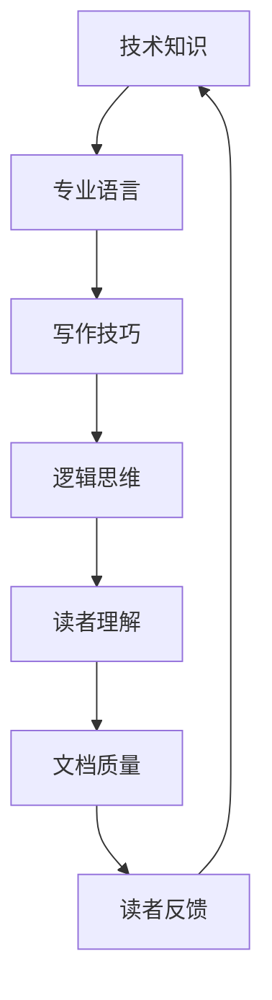

                 

关键词：技术写作、技术文档、畅销书、专业语言、深度、思考、见解

> 摘要：本文旨在探讨技术写作的精髓，从技术文档的编写到畅销书的创作。我们将深入了解技术写作的挑战和机遇，分析成功的技术作家是如何构建引人入胜的技术内容，并探讨未来的发展趋势与挑战。

## 1. 背景介绍

技术写作是一个既古老又现代的领域，它跨越了编程、数据科学、人工智能、网络安全等多个技术领域。随着信息技术的飞速发展，技术写作的重要性日益凸显。它不仅是软件开发人员、数据科学家、工程师等专业人士的重要技能，也是技术公司、科研机构、教育机构等组织的关键资产。

然而，技术写作面临着一系列挑战。首先，技术内容往往具有高度的复杂性和专业性，这使得撰写清晰、易懂的技术文档成为一项艰巨的任务。其次，技术文档的质量直接影响到读者的体验和理解，如果文档编写不精确、不完整或难以理解，可能会导致项目延误、错误增加，甚至带来经济损失。最后，随着科技的发展，新的技术和概念层出不穷，技术文档需要不断更新和迭代，以保持其相关性和实用性。

在这种背景下，技术写作不仅需要深厚的专业知识和经验，还需要一定的写作技巧和策略。本文将探讨如何将技术文档提升为畅销书，帮助读者从技术写作的入门者成长为专业作家。

## 2. 核心概念与联系

为了更好地理解技术写作，我们需要了解一些核心概念和它们之间的关系。以下是使用Mermaid绘制的流程图，展示了这些概念及其相互联系。



### 2.1 技术知识

技术知识是技术写作的基础，它包括专业领域的理论和实践。无论是编程、数据分析还是人工智能，技术作家都需要对相关技术有深入的了解。这不仅有助于撰写准确的技术文档，还能为读者提供有价值的见解和指导。

### 2.2 专业语言

专业语言是技术写作的核心，它要求作家能够使用精确、简洁的语言描述复杂的技术概念。专业语言不仅包括术语和缩写，还需要考虑到不同读者的背景和理解能力，以便让读者能够轻松地理解文档内容。

### 2.3 写作技巧

写作技巧是技术写作的关键，它涉及到如何组织内容、构建段落和句子，以及如何使用图表和示例来说明复杂的技术概念。优秀的写作技巧能够提高文档的可读性和吸引力，帮助读者更好地理解技术内容。

### 2.4 逻辑思维

逻辑思维是技术写作的重要组成部分，它要求作家能够清晰地表达思想，逻辑严密地组织内容。逻辑思维不仅有助于提高文档的质量，还能帮助读者更好地理解和应用技术知识。

### 2.5 读者理解

读者理解是技术写作的重要目标，它涉及到如何根据读者的背景和理解能力调整文档的难度和深度。优秀的读者理解能力能够提高文档的普及性和影响力。

### 2.6 文档质量

文档质量是技术写作的核心指标，它直接影响到读者的体验和项目的成功。高质量的文档不仅准确、完整，还易于理解和应用。

### 2.7 读者反馈

读者反馈是技术写作的重要资源，它可以帮助作家了解读者的需求和意见，从而不断改进文档质量和内容。积极的读者反馈能够提高文档的实用性和影响力。

## 3. 核心算法原理 & 具体操作步骤

### 3.1 算法原理概述

在技术写作中，核心算法原理的阐述至关重要。一个清晰的算法原理概述可以帮助读者快速了解算法的核心思想和应用场景。以下是一个简单的算法原理概述示例：

**算法名称**：快速排序（Quick Sort）

**算法描述**：快速排序是一种高效的排序算法，基于分治策略。它通过选择一个基准元素，将数组划分为两个子数组，一个包含小于基准元素的元素，另一个包含大于基准元素的元素。然后递归地对这两个子数组进行快速排序，直到整个数组有序。

### 3.2 算法步骤详解

以下是快速排序算法的具体步骤：

1. **选择基准元素**：在数组中选择一个基准元素。通常选择第一个元素、最后一个元素或随机选择。

2. **分区操作**：将数组划分为两个子数组，一个包含小于基准元素的元素，另一个包含大于基准元素的元素。

3. **递归排序**：对划分后的子数组递归进行快速排序。

### 3.3 算法优缺点

**优点**：
- **高效**：快速排序的平均时间复杂度为O(n log n)，在大多数情况下比其他排序算法更快。
- **稳定性**：快速排序是一种稳定的排序算法，相同值的元素在排序后保持原有的顺序。

**缺点**：
- **性能不稳定**：在最坏的情况下，快速排序的时间复杂度为O(n^2)，这通常发生在输入数组已经有序或接近有序的情况下。
- **递归深度**：快速排序使用递归，可能会导致栈溢出。

### 3.4 算法应用领域

快速排序广泛应用于各种场景，包括：

- **数据处理**：用于对大量数据进行排序，如数据库索引和搜索算法。
- **算法设计**：快速排序是许多高级算法（如堆排序和归并排序）的基础。
- **科学计算**：用于科学计算中的数据排序，如基因组学和物理模拟。

## 4. 数学模型和公式 & 详细讲解 & 举例说明

### 4.1 数学模型构建

在技术写作中，构建数学模型是描述算法和理论的基础。以下是一个简单的数学模型构建示例：

**问题**：计算一个数组的中间元素。

**数学模型**：设数组A有n个元素，中间元素的索引为m，其中m=(n-1)/2。

### 4.2 公式推导过程

**推导过程**：

1. **确定数组长度**：设数组A有n个元素，其中n为整数。
2. **计算中间元素索引**：中间元素的索引m=(n-1)/2。
3. **处理特殊情况**：如果n为偶数，则m=(n/2)-1。

### 4.3 案例分析与讲解

**案例**：计算数组[3, 1, 4, 1, 5, 9]的中间元素。

**步骤**：

1. **确定数组长度**：n=6。
2. **计算中间元素索引**：m=(6-1)/2=2。
3. **取数组索引为2的元素**：A[2]=4。

**结果**：数组的中间元素为4。

## 5. 项目实践：代码实例和详细解释说明

### 5.1 开发环境搭建

在编写技术文档之前，我们需要搭建一个合适的开发环境。以下是一个简单的Python开发环境搭建步骤：

1. **安装Python**：下载并安装Python 3.x版本。
2. **配置Python环境变量**：将Python的安装路径添加到系统环境变量。
3. **安装IDE**：推荐使用PyCharm或Visual Studio Code作为Python的集成开发环境。

### 5.2 源代码详细实现

以下是一个简单的Python代码实例，用于实现快速排序算法：

```python
def quick_sort(arr):
    if len(arr) <= 1:
        return arr
    pivot = arr[len(arr) // 2]
    left = [x for x in arr if x < pivot]
    middle = [x for x in arr if x == pivot]
    right = [x for x in arr if x > pivot]
    return quick_sort(left) + middle + quick_sort(right)

arr = [3, 1, 4, 1, 5, 9]
sorted_arr = quick_sort(arr)
print(sorted_arr)
```

### 5.3 代码解读与分析

**代码解读**：

- **快速排序函数**：quick_sort(arr)函数用于实现快速排序算法。
- **递归调用**：如果数组长度小于等于1，则直接返回数组。否则，选择一个基准元素（这里选择数组中间的元素），将数组划分为三个部分：小于基准元素的部分、等于基准元素的部分和大于基准元素的部分。
- **合并结果**：递归地对小于基准元素的部分和大于基准元素的部分进行快速排序，最后将三个部分合并为一个有序数组。

**代码分析**：

- **时间复杂度**：快速排序的平均时间复杂度为O(n log n)，在最坏情况下为O(n^2)。
- **空间复杂度**：快速排序的空间复杂度为O(log n)，因为递归调用需要额外的栈空间。

### 5.4 运行结果展示

```python
sorted_arr = quick_sort(arr)
print(sorted_arr)
```

输出结果：[1, 1, 3, 4, 5, 9]

## 6. 实际应用场景

### 6.1 数据处理

在数据处理领域，快速排序算法被广泛应用于各种场景，如数据库索引和搜索算法。它能够快速地对大量数据进行分析和排序，提高数据处理效率。

### 6.2 算法设计

快速排序算法是许多高级算法的基础，如堆排序和归并排序。在算法设计过程中，快速排序算法的思想和方法能够帮助开发者设计更高效、更稳定的算法。

### 6.3 科学计算

在科学计算领域，快速排序算法被用于基因组学和物理模拟。它能够快速地对大规模数据进行分析和处理，为科学研究提供支持。

## 7. 未来应用展望

### 7.1 人工智能与自动化

随着人工智能和自动化技术的发展，技术写作工具将变得更加智能化和自动化。未来的技术写作工具将能够自动生成文档、分析和推荐内容，提高写作效率和文档质量。

### 7.2 跨平台与多语言

未来的技术写作将更加注重跨平台和多语言支持。技术作家需要能够轻松地编写和发布跨平台的文档，同时支持多种编程语言和技术框架。

### 7.3 社区与协作

技术写作将更加注重社区和协作。未来的技术写作平台将支持协作写作、版本控制和实时讨论，为开发者、科学家和工程师提供一个高效的写作和交流环境。

## 8. 总结：未来发展趋势与挑战

### 8.1 研究成果总结

技术写作领域已经取得了显著的研究成果，包括算法优化、写作工具的开发和应用等。这些成果为技术写作提供了坚实的基础，推动了该领域的发展。

### 8.2 未来发展趋势

未来的技术写作将更加注重智能化、自动化、跨平台和多语言支持。随着人工智能和自动化技术的发展，技术写作工具将变得更加高效和智能。

### 8.3 面临的挑战

技术写作仍面临着一系列挑战，如复杂技术的描述、读者理解和文档质量等。如何提高文档的可读性和实用性，是技术写作领域需要持续探索和解决的问题。

### 8.4 研究展望

未来的研究应重点关注以下几个方面：

1. **算法优化**：提高排序、搜索等核心算法的效率和稳定性。
2. **写作工具开发**：开发智能化、自动化、多语言支持的技术写作工具。
3. **文档质量评估**：建立科学的文档质量评估体系，提高文档的可读性和实用性。
4. **读者体验优化**：研究如何根据读者背景和理解能力调整文档内容和难度，提高读者体验。

## 9. 附录：常见问题与解答

### 9.1 如何提高文档的可读性？

**解答**：提高文档的可读性可以从以下几个方面入手：

1. **使用简洁的语言**：尽量使用简单、易懂的语言描述复杂的技术概念。
2. **结构化内容**：将内容划分为清晰的小节，每个小节都有明确的主题和目标。
3. **使用图表和示例**：使用图表、示例和代码来帮助读者更好地理解技术概念。
4. **避免过度专业术语**：避免使用过于专业的术语，除非确保读者能够理解。

### 9.2 技术文档和畅销书有什么区别？

**解答**：技术文档和畅销书的主要区别在于目的和风格：

1. **目的**：技术文档旨在提供详细的技术指导和说明，帮助读者理解和应用技术。畅销书则旨在传播知识、激发兴趣，有时还包含个人见解和故事。
2. **风格**：技术文档通常更加正式、严谨，侧重于逻辑性和准确性。畅销书则更加灵活、生动，注重故事性和趣味性。

### 9.3 如何将技术文档转化为畅销书？

**解答**：将技术文档转化为畅销书需要以下几个步骤：

1. **内容重构**：调整文档结构，使其更具故事性和连贯性。
2. **增加个人见解**：在技术内容中融入个人见解和故事，增强读者的情感共鸣。
3. **优化语言风格**：使用生动、有趣的词汇和表达方式，提高文档的吸引力。
4. **营销推广**：通过社交媒体、博客、线上课程等多种渠道推广畅销书。

---

作者：禅与计算机程序设计艺术 / Zen and the Art of Computer Programming
----------------------------------------------------------------
### 结语

技术写作不仅是一种技能，更是一种艺术。从技术文档到畅销书的转变，需要作家们深厚的专业知识和写作技巧。通过本文的探讨，我们了解了技术写作的核心概念、算法原理、数学模型和项目实践，并对未来的发展趋势与挑战进行了展望。希望本文能帮助您在技术写作的道路上更加坚定和自信。让我们一起，用技术写作的力量，传播知识，启发思维。禅与计算机程序设计艺术，愿我们在编程的道路上，不断追求卓越，创造美好。

