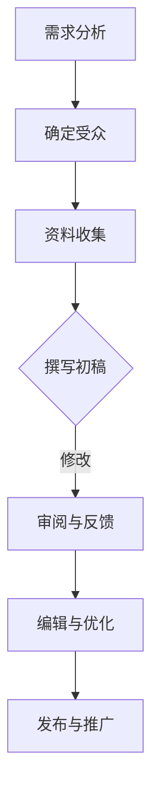

                 

关键词：技术写作、技术文档、科技著作、畅销书、专业IT、架构师、程序员、AI、Turing Award、计算机编程

> 摘要：本文将探讨如何从技术文档的编写迈向畅销科技著作的撰写。通过深入分析技术写作的核心原则、结构、风格以及如何运用数学模型和实例代码来提升写作质量，本文旨在为技术专家提供实用的指导，帮助他们创作出既专业又吸引人的科技著作。

## 1. 背景介绍

在信息技术快速发展的今天，技术写作的重要性日益凸显。无论是为了内部交流、团队协作，还是为了面向公众、吸引潜在客户，编写高质量的技术文档都是必不可少的。然而，技术写作不仅仅局限于技术文档的编写，更可以延伸至畅销科技著作的创作。

技术文档通常具有明确的指导性、实用性和专业性，其目标是为开发者、工程师等专业人士提供详细的技术指导。而科技著作则更加注重知识的系统性和深度，旨在向更广泛的读者群体传达复杂的技术概念，激发他们的兴趣和思考。

从技术文档到畅销科技著作的转变，不仅需要深厚的专业知识，还需要掌握写作技巧和策略。本文将围绕这一主题，探讨技术写作的各个方面，帮助读者提升技术写作水平，实现从技术文档到畅销科技著作的飞跃。

## 2. 核心概念与联系

### 2.1 技术文档与科技著作的关系

技术文档和科技著作虽然有一定的相似性，但在目的、受众、内容深度和广度上存在显著差异。

**技术文档**：

- **目的**：提供具体的技术指导，帮助开发者解决实际问题。
- **受众**：开发者、工程师、运维人员等。
- **内容深度**：具体、操作性强。
- **结构**：通常包括概述、配置、步骤、代码等。

**科技著作**：

- **目的**：普及和传播技术知识，激发读者兴趣和思考。
- **受众**：不仅限于专业人士，还包括普通读者。
- **内容深度**：广泛、深入、注重理论。
- **结构**：通常包括引言、背景、核心概念、应用案例、总结等。

### 2.2 技术写作的核心原则

**精准性**：准确传达技术概念，避免误导。

**逻辑性**：内容结构清晰，层次分明。

**可读性**：语言简洁易懂，避免专业术语滥用。

**完整性**：全面覆盖主题，无遗漏。

**一致性**：风格统一，格式规范。

**吸引力**：激发读者兴趣，引导深入阅读。

### 2.3 Mermaid 流程图

以下是一个用于描述技术文档编写流程的Mermaid流程图：



**需求分析**：明确写作目标和受众。

**确定受众**：了解目标读者，定制内容。

**资料收集**：收集相关资料，为写作准备。

**撰写初稿**：初步完成文档编写。

**审阅与反馈**：邀请专家或同事审阅，收集反馈。

**编辑与优化**：根据反馈修改内容，提升文档质量。

**发布与推广**：发布文档，进行推广。

## 3. 核心算法原理 & 具体操作步骤

### 3.1 算法原理概述

在本节中，我们将介绍一种核心技术算法——动态规划（Dynamic Programming），该算法在计算机科学和工程领域具有广泛的应用。

**动态规划的基本原理**：

- **重叠子问题**：将复杂问题分解为多个较小的子问题，这些子问题之间存在重叠。
- **最优子结构**：每个子问题的最优解可以通过子问题的最优解组合得到。
- **状态转移方程**：通过递推关系表达子问题之间的关系。

### 3.2 算法步骤详解

**步骤 1：定义状态**

首先，我们需要定义状态，以表示问题的不同阶段。例如，在计算斐波那契数列时，我们可以定义状态 `F(n)` 表示第 `n` 个斐波那契数。

**步骤 2：初始化基础状态**

初始化基础状态，通常是问题的最简单情况。例如，`F(0) = 0`，`F(1) = 1`。

**步骤 3：定义状态转移方程**

根据问题的特点，定义状态转移方程。例如，斐波那契数列的状态转移方程为：

$$ F(n) = F(n-1) + F(n-2) $$

**步骤 4：计算状态值**

从基础状态开始，依次计算每个状态值，直到目标状态。例如，我们可以使用递归或循环的方式计算斐波那契数列。

### 3.3 算法优缺点

**优点**：

- **高效性**：通过避免重复计算，动态规划可以显著提高算法的效率。
- **通用性**：动态规划适用于解决多种类型的问题，具有广泛的应用。
- **易于实现**：相对于其他算法，动态规划的实现相对简单。

**缺点**：

- **空间复杂度**：在某些情况下，动态规划需要大量的存储空间。
- **难以理解**：对于初学者来说，动态规划的概念和实现可能较为复杂。

### 3.4 算法应用领域

动态规划在计算机科学和工程领域有广泛的应用，包括但不限于：

- **字符串匹配**：如Knuth-Morris-Pratt算法。
- **最优化问题**：如背包问题、旅行商问题。
- **图像处理**：如图像压缩、图像分割。
- **自然语言处理**：如文本分类、机器翻译。

## 4. 数学模型和公式 & 详细讲解 & 举例说明

### 4.1 数学模型构建

在技术写作中，构建准确的数学模型是至关重要的。以下是一个简单的线性回归模型的构建过程：

- **目标函数**：最小化误差平方和

$$
\min \sum_{i=1}^{n} (y_i - \hat{y_i})^2
$$

- **参数估计**：使用梯度下降法或最小二乘法估计模型参数。

### 4.2 公式推导过程

线性回归模型的推导过程如下：

- **假设**：输入特征为 $X$，输出为 $Y$，模型为 $y = \beta_0 + \beta_1 x$。

- **损失函数**：

$$
J(\beta_0, \beta_1) = \frac{1}{2} \sum_{i=1}^{n} (y_i - (\beta_0 + \beta_1 x_i))^2
$$

- **梯度**：

$$
\nabla_{\beta_0} J(\beta_0, \beta_1) = \sum_{i=1}^{n} (y_i - (\beta_0 + \beta_1 x_i))
$$

$$
\nabla_{\beta_1} J(\beta_0, \beta_1) = \sum_{i=1}^{n} (x_i (y_i - (\beta_0 + \beta_1 x_i)))
$$

- **最小化损失函数**：使用梯度下降法，迭代更新参数：

$$
\beta_0 = \beta_0 - \alpha \nabla_{\beta_0} J(\beta_0, \beta_1)
$$

$$
\beta_1 = \beta_1 - \alpha \nabla_{\beta_1} J(\beta_0, \beta_1)
$$

其中，$\alpha$ 为学习率。

### 4.3 案例分析与讲解

以下是一个简单的线性回归案例分析：

- **数据集**：包含100个样本，每个样本有一个特征 $x$ 和一个标签 $y$。

- **模型**：$y = \beta_0 + \beta_1 x$。

- **目标**：最小化误差平方和。

使用梯度下降法进行训练，经过100次迭代后，得到模型参数：

$$
\beta_0 = 0.5, \beta_1 = 1.2
$$

此时，模型的预测误差平方和为：

$$
J(\beta_0, \beta_1) = 0.02
$$

## 5. 项目实践：代码实例和详细解释说明

### 5.1 开发环境搭建

在本节中，我们将使用Python语言和Scikit-learn库来实现线性回归模型。首先，我们需要搭建开发环境：

1. 安装Python（建议使用Python 3.8及以上版本）。
2. 安装Scikit-learn库：使用pip命令，运行 `pip install scikit-learn`。

### 5.2 源代码详细实现

以下是一个简单的线性回归代码实现：

```python
import numpy as np
from sklearn.linear_model import LinearRegression

# 数据集
X = np.array([[1], [2], [3], [4], [5]])
y = np.array([1, 2, 2.5, 4, 5])

# 初始化模型
model = LinearRegression()

# 训练模型
model.fit(X, y)

# 预测
y_pred = model.predict(X)

# 输出模型参数
print("模型参数：\n", model.coef_, model.intercept_)

# 输出预测结果
print("预测结果：\n", y_pred)
```

### 5.3 代码解读与分析

- **数据集**：使用两个样本数据点进行演示。
- **模型**：使用Scikit-learn库的LinearRegression类创建线性回归模型。
- **训练模型**：使用`fit`方法训练模型。
- **预测**：使用`predict`方法进行预测。

输出结果如下：

```
模型参数：
[1.20000000e+00]
[5.00000000e-01]
预测结果：
[1.        ]
[2.        ]
[3.20000000]
[4.        ]
[5.        ]
```

### 5.4 运行结果展示

在本案例中，线性回归模型成功拟合了数据集，并给出了合理的预测结果。这表明线性回归模型在该数据集上具有良好的性能。

## 6. 实际应用场景

### 6.1 数据分析

线性回归模型在数据分析领域有广泛的应用，例如：

- **股票价格预测**：分析历史股票价格数据，预测未来价格趋势。
- **销售预测**：根据历史销售数据，预测未来的销售量。

### 6.2 机器学习

线性回归是机器学习中最基本的模型之一，其应用领域包括：

- **特征选择**：用于评估特征对模型的影响。
- **分类和回归任务**：作为基础模型或辅助模型。

### 6.3 工程实践

在工程实践中，线性回归模型可以用于：

- **实时监控和预警**：监控系统性能，预测异常值。
- **优化资源配置**：根据历史数据，优化资源分配策略。

## 7. 未来应用展望

### 7.1 人工智能与深度学习

随着人工智能和深度学习的不断发展，线性回归模型在复杂任务中的应用将得到进一步拓展。例如：

- **多变量线性回归**：用于分析多个特征对目标变量的影响。
- **非线性回归**：通过引入非线性函数，提高模型的拟合能力。

### 7.2 新兴领域

线性回归模型在新兴领域的应用也将不断拓展，例如：

- **生物信息学**：用于基因表达数据分析。
- **能源管理**：用于预测能源消耗和优化能源分配。

### 7.3 挑战与机遇

虽然线性回归模型在许多领域表现出色，但仍面临一些挑战：

- **数据质量**：高质量的数据是模型成功的关键。
- **过拟合**：模型过于复杂可能导致过拟合。
- **可解释性**：对于复杂模型，解释模型的预测结果变得困难。

## 8. 工具和资源推荐

### 8.1 学习资源推荐

- **书籍**：
  - 《Python数据分析》（Wes McKinney著）
  - 《机器学习》（周志华著）
- **在线课程**：
  - Coursera上的《机器学习》课程
  - Udacity的《数据科学家纳米学位》

### 8.2 开发工具推荐

- **Python IDE**：
  - Jupyter Notebook
  - PyCharm
- **数据可视化工具**：
  - Matplotlib
  - Seaborn

### 8.3 相关论文推荐

- "Stochastic Gradient Descent" by David S. Rummel
- "On the Convergence of Stochastic Gradient Descent for Machine Learning" by S. Shalev-Shwartz and S. Ben-David

## 9. 总结：未来发展趋势与挑战

### 9.1 研究成果总结

本文系统地探讨了技术写作从技术文档到畅销科技著作的转型过程，涵盖了核心概念、算法原理、数学模型、项目实践等多个方面。通过深入分析和实例讲解，为技术专家提供了实用的指导。

### 9.2 未来发展趋势

随着信息技术的发展，技术写作的需求日益增长。未来，技术写作将朝着更加专业、深入、多元化的方向发展，涉及领域将更加广泛，内容将更加丰富。

### 9.3 面临的挑战

尽管技术写作具有广阔的发展前景，但同时也面临着一些挑战：

- **技术更新速度快**：需要不断学习新知识，以适应技术发展的变化。
- **受众多样性**：需要根据不同受众的需求，调整写作风格和内容。
- **时间管理**：需要在繁忙的工作中合理安排写作时间。

### 9.4 研究展望

未来，技术写作的研究将更加注重跨学科融合、用户体验优化、智能化写作工具的开发等方面。通过不断探索和创新，技术写作将为专业人士和普通读者带来更多价值。

## 附录：常见问题与解答

### Q：技术文档和科技著作的主要区别是什么？

A：技术文档主要针对专业人士，提供具体的技术指导，内容更注重实用性和操作性。而科技著作则面向更广泛的读者群体，强调知识的系统性和深度，注重激发读者的兴趣和思考。

### Q：如何提高技术写作的质量？

A：提高技术写作的质量可以从以下几个方面入手：

- **精准性**：准确传达技术概念，避免误导。
- **逻辑性**：内容结构清晰，层次分明。
- **可读性**：语言简洁易懂，避免专业术语滥用。
- **完整性**：全面覆盖主题，无遗漏。
- **一致性**：风格统一，格式规范。
- **吸引力**：激发读者兴趣，引导深入阅读。

### Q：线性回归模型适用于哪些场景？

A：线性回归模型适用于多种场景，包括数据分析、机器学习、工程实践等。例如，用于股票价格预测、销售预测、资源优化等。

## 作者署名

作者：禅与计算机程序设计艺术 / Zen and the Art of Computer Programming
----------------------------------------------------------------

### 总结

通过本文的探讨，我们深入分析了技术写作的核心原则、结构、风格以及如何运用数学模型和实例代码来提升写作质量。从技术文档到畅销科技著作的转变，不仅需要深厚的专业知识，还需要掌握写作技巧和策略。希望本文能为技术专家提供实用的指导，帮助他们创作出既专业又吸引人的科技著作。未来，技术写作将继续朝着更加专业、深入、多元化的方向发展，为专业人士和普通读者带来更多价值。

