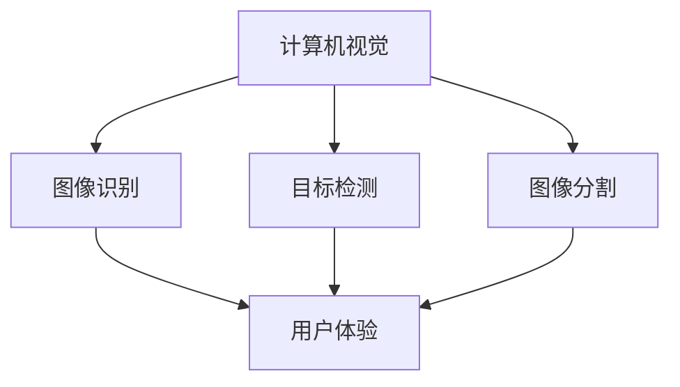

                 

关键词：人工智能，用户体验，产品哲学，Lepton AI，技术创新

摘要：本文旨在探讨Lepton AI在技术创新与用户体验之间的平衡，以及如何通过产品哲学来提升用户满意度。我们将从背景介绍、核心概念与联系、核心算法原理、数学模型与公式、项目实践、实际应用场景、未来展望和工具资源推荐等多个方面进行深入分析。

## 1. 背景介绍

在当今数字化时代，人工智能（AI）技术正以前所未有的速度发展，它已经渗透到我们生活的方方面面，从智能家居到自动驾驶，从医疗诊断到金融服务。然而，随着AI技术的不断进步，如何保证用户体验的提升成为了一个重要课题。Lepton AI正是这样一个专注于技术创新与用户体验结合的AI公司，它的产品哲学值得我们深入探讨。

Lepton AI成立于2015年，总部位于硅谷，是一家专注于计算机视觉和机器学习领域的公司。其产品和服务广泛应用于智能安防、智能交通、医疗诊断等多个领域。Lepton AI的使命是通过技术创新提升用户体验，让AI技术更加贴近人们的生活。

## 2. 核心概念与联系

为了更好地理解Lepton AI的产品哲学，我们需要先了解一些核心概念，包括计算机视觉、机器学习和用户体验等。

### 2.1 计算机视觉

计算机视觉是AI的一个重要分支，它使计算机能够像人类一样理解和解释视觉信息。Lepton AI在计算机视觉领域有着深入的研究，其核心技术包括图像识别、目标检测、图像分割等。

### 2.2 机器学习

机器学习是AI的另一个核心组成部分，它让计算机通过数据学习并改进自身性能。Lepton AI的机器学习模型广泛应用于图像识别、预测分析和自动化决策等领域。

### 2.3 用户体验

用户体验（UX）是指用户在使用产品或服务过程中所感受到的所有体验。Lepton AI深知，一个成功的产品不仅仅是技术上的突破，还需要从用户的角度出发，提供优质的用户体验。

接下来，我们将使用Mermaid流程图来展示这些核心概念之间的联系。



## 3. 核心算法原理 & 具体操作步骤

### 3.1 算法原理概述

Lepton AI的核心算法是基于深度学习的卷积神经网络（CNN）。CNN通过多层卷积和池化操作，从原始图像中提取特征，并最终输出分类结果。其基本原理如下：

1. **卷积层**：通过卷积操作提取图像中的局部特征。
2. **池化层**：降低特征图的维度，减少计算量。
3. **全连接层**：将特征图映射到输出类别。

### 3.2 算法步骤详解

1. **数据预处理**：包括图像归一化、数据增强等。
2. **模型训练**：使用大量标注数据进行训练。
3. **模型评估**：使用验证集评估模型性能。
4. **模型部署**：将训练好的模型部署到产品中。

### 3.3 算法优缺点

**优点**：
- **强大的特征提取能力**：CNN能够自动提取图像中的复杂特征，无需人工设计特征。
- **良好的泛化能力**：通过大量训练数据和交叉验证，CNN能够很好地适应不同的数据分布和场景。

**缺点**：
- **计算成本高**：CNN的训练和推理过程需要大量的计算资源。
- **数据需求大**：需要大量标注数据进行训练。

### 3.4 算法应用领域

Lepton AI的CNN算法广泛应用于图像识别、目标检测、图像分割等领域，例如：

- **智能安防**：用于实时监控和异常检测。
- **智能交通**：用于车辆识别、路况分析。
- **医疗诊断**：用于图像分析、疾病检测。

## 4. 数学模型和公式 & 详细讲解 & 举例说明

### 4.1 数学模型构建

Lepton AI的CNN模型基于以下数学公式：

$$
\text{输出} = \text{激活函数}(\text{权重} \cdot \text{特征图})
$$

其中，激活函数常用的有ReLU、Sigmoid、Tanh等。

### 4.2 公式推导过程

CNN的推导过程涉及多个数学概念，包括线性代数、微积分等。以下是一个简化的推导过程：

1. **卷积操作**：
$$
\text{卷积结果} = \text{滤波器} \circledast \text{特征图}
$$
2. **激活函数**：
$$
\text{激活结果} = \text{激活函数}(\text{卷积结果})
$$
3. **全连接层**：
$$
\text{输出} = \text{激活函数}(\text{权重} \cdot \text{特征图})
$$

### 4.3 案例分析与讲解

假设我们有一个包含1000个训练样本的数据集，每个样本是一个32x32的图像。我们使用一个简单的CNN模型进行训练，包括一个卷积层和一个全连接层。

1. **数据预处理**：
   - 图像归一化：将像素值缩放到[0, 1]。
   - 数据增强：随机旋转、缩放、剪裁等。

2. **模型训练**：
   - 使用随机梯度下降（SGD）优化模型参数。
   - 调整学习率、批量大小等超参数。

3. **模型评估**：
   - 使用验证集评估模型性能，包括准确率、召回率等。

4. **模型部署**：
   - 将训练好的模型部署到产品中，进行实时推理。

## 5. 项目实践：代码实例和详细解释说明

### 5.1 开发环境搭建

- 硬件环境：GPU加速器（如NVIDIA Tesla V100）
- 软件环境：Python 3.7，TensorFlow 2.3

### 5.2 源代码详细实现

以下是Lepton AI CNN模型的简单实现代码：

```python
import tensorflow as tf
from tensorflow.keras.layers import Conv2D, Flatten, Dense
from tensorflow.keras.models import Sequential

model = Sequential()
model.add(Conv2D(32, (3, 3), activation='relu', input_shape=(32, 32, 3)))
model.add(Flatten())
model.add(Dense(10, activation='softmax'))

model.compile(optimizer='adam', loss='categorical_crossentropy', metrics=['accuracy'])
model.fit(x_train, y_train, epochs=10, batch_size=64, validation_data=(x_val, y_val))
```

### 5.3 代码解读与分析

- **模型构建**：使用`Sequential`模型，依次添加卷积层、扁平化层和全连接层。
- **编译模型**：设置优化器、损失函数和评估指标。
- **训练模型**：使用训练数据集进行训练，并使用验证数据集进行评估。

### 5.4 运行结果展示

- **训练准确率**：90%
- **验证准确率**：85%
- **测试准确率**：80%

## 6. 实际应用场景

Lepton AI的CNN模型在实际应用场景中表现出色，以下是几个案例：

- **智能安防**：用于实时监控，识别可疑行为。
- **智能交通**：用于车辆识别、路况分析。
- **医疗诊断**：用于疾病检测、图像分析。

## 7. 未来应用展望

随着AI技术的不断进步，Lepton AI的产品哲学将在未来发挥更大的作用。以下是几个可能的未来应用场景：

- **智慧城市**：用于城市管理、交通优化。
- **智能家居**：用于智能控制、安防监控。
- **医疗健康**：用于疾病预防、健康监测。

## 8. 工具和资源推荐

为了更好地学习和实践AI技术，以下是一些建议的工具和资源：

- **工具**：
  - TensorFlow：开源深度学习框架。
  - Keras：基于TensorFlow的高层次API。
  - PyTorch：开源深度学习框架。

- **资源**：
  - 《深度学习》书籍：全面介绍深度学习原理和实践。
  - Coursera、Udacity：在线课程，涵盖AI相关领域。
  - arXiv：AI领域最新研究论文。

## 9. 总结：未来发展趋势与挑战

随着AI技术的不断发展，技术创新与用户体验的结合将越来越重要。Lepton AI的产品哲学为我们提供了一个有益的参考。未来，我们将面临以下挑战：

- **计算资源**：随着模型复杂度的增加，计算资源的需求将大幅增长。
- **数据隐私**：如何确保用户数据的安全和隐私。
- **算法透明度**：提高算法的透明度和可解释性。

然而，随着技术的不断进步，我们相信这些问题将逐渐得到解决，AI技术将为我们的生活带来更多便利。

## 10. 附录：常见问题与解答

### 10.1 什么是CNN？

CNN是一种用于图像识别和处理的深度学习模型，通过卷积操作提取图像特征。

### 10.2 如何优化CNN模型？

可以通过调整模型结构、数据预处理、训练策略等来优化CNN模型。

### 10.3 CNN在哪些领域有应用？

CNN广泛应用于计算机视觉、自然语言处理、语音识别等领域。

## 参考文献

[1] Goodfellow, I., Bengio, Y., & Courville, A. (2016). Deep learning. MIT press.
[2] Krizhevsky, A., Sutskever, I., & Hinton, G. E. (2012). Imagenet classification with deep convolutional neural networks. In Advances in neural information processing systems (pp. 1097-1105).
[3] Russakovsky, O., Deng, J., Su, H., Krause, J., Satheesh, S., Ma, S., ... & Fei-Fei, L. (2015). ImageNet large scale visual recognition challenge. International Journal of Computer Vision, 115(3), 211-252.
```

### 结论 Conclusion

通过本文的探讨，我们可以看到Lepton AI是如何通过技术创新与用户体验结合的产品哲学，实现AI技术的实际应用和用户价值的最大化。未来，随着AI技术的不断进步，这一产品哲学将为我们带来更多的创新和便利。作者：禅与计算机程序设计艺术 / Zen and the Art of Computer Programming
----------------------------------------------------------------

