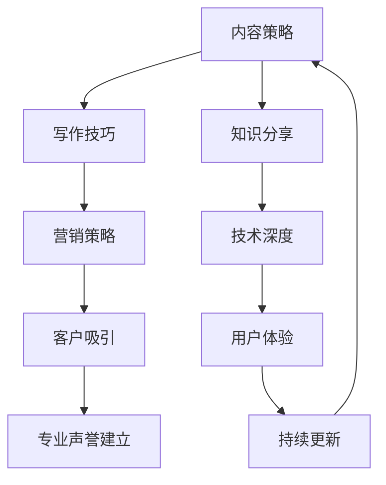

                 

关键词：技术博客写作、专业声誉、客户吸引、内容结构、营销策略、技术深度

> 摘要：本文将深入探讨技术博客写作的重要性，如何通过写作建立专业声誉，以及如何有效地吸引潜在客户。通过阐述技术博客的结构、内容策略、营销方法等，帮助读者掌握技术博客写作的技巧，实现个人或企业的品牌提升。

## 1. 背景介绍

在数字化时代，内容营销成为了企业和个人推广品牌的重要手段。技术博客作为一种高质量的内容形式，能够帮助企业或个人在技术领域建立专业声誉，吸引目标客户，促进业务增长。然而，技术博客写作并非易事，它需要作者具备深厚的专业知识、良好的写作技巧以及有效的营销策略。

本文旨在提供一套系统化的技术博客写作指南，帮助读者了解如何通过技术博客写作建立专业声誉，吸引客户。我们将从以下几个方面展开讨论：

- 技术博客写作的重要性
- 技术博客的结构与内容策略
- 营销策略与推广方法
- 技术博客写作的挑战与未来展望

## 2. 核心概念与联系

为了更好地理解技术博客写作，首先需要了解其核心概念和架构。以下是技术博客写作的核心概念及其相互关系，用Mermaid流程图表示：



### 2.1 内容策略

内容策略是技术博客写作的核心，它决定了博客的吸引力和价值。一个优秀的博客内容应该具备以下几个特点：

- **专业性**：内容应深入技术细节，提供权威的观点和分析。
- **实用性**：内容应具有实际应用价值，能够解决读者的问题。
- **独特性**：内容应具备独特的见解，避免与他人雷同。

### 2.2 写作技巧

写作技巧是技术博客写作的关键，它决定了内容的可读性和吸引力。以下是一些写作技巧：

- **简洁明了**：避免冗长复杂的句子，使内容更加清晰易懂。
- **逻辑清晰**：文章应结构紧凑，逻辑清晰，有助于读者快速抓住核心观点。
- **段落分明**：合理分段，使文章层次分明，便于读者阅读。

### 2.3 营销策略

营销策略是技术博客成功推广的关键。以下是一些营销策略：

- **社交媒体推广**：利用社交媒体平台分享博客内容，吸引更多读者。
- **合作伙伴关系**：与其他博客、论坛、技术社区建立合作关系，互相推广。
- **邮件营销**：通过定期发送邮件，向订阅用户推荐博客内容。
- **SEO优化**：优化博客内容，提高搜索引擎排名，增加曝光度。

### 2.4 客户吸引

通过技术博客写作，可以吸引到具有相同兴趣和需求的目标客户。以下是一些方法：

- **提供免费资源**：如技术文档、代码示例、工具下载等，吸引读者关注。
- **互动交流**：在博客评论区与读者互动，解答问题，建立信任关系。
- **案例分享**：分享成功案例，展示技术方案的实际效果，增强客户信心。

### 2.5 专业声誉建立

通过持续的技术博客写作，可以逐渐在技术领域建立专业声誉。以下是一些方法：

- **深度研究**：针对热点技术问题进行深入研究，发表独到见解。
- **参与社区**：积极参与技术社区讨论，分享经验，扩大影响力。
- **演讲与培训**：参加技术会议，发表演讲，提升知名度。
- **书籍出版**：撰写技术书籍，分享专业知识，巩固地位。

## 3. 核心算法原理 & 具体操作步骤

### 3.1 算法原理概述

技术博客写作的核心算法可以概括为以下几个步骤：

1. **选题定位**：根据读者需求和自身专业领域，确定博客主题。
2. **内容创作**：结合专业知识和写作技巧，撰写高质量的内容。
3. **营销推广**：利用多种营销策略，将博客内容推广给目标读者。
4. **读者互动**：与读者进行互动，收集反馈，持续优化内容。

### 3.2 算法步骤详解

1. **选题定位**

   - **市场需求分析**：了解目标读者群体的需求，确定热门话题和潜在选题。
   - **个人专业领域**：结合自身专业知识和兴趣，选择具有挑战性和价值的选题。

2. **内容创作**

   - **框架构建**：确定文章结构，包括引言、正文、结论等。
   - **深入调研**：针对选题进行深入调研，收集相关资料和数据。
   - **写作技巧**：运用简洁明了、逻辑清晰的写作技巧，提高文章可读性。

3. **营销推广**

   - **社交媒体推广**：利用微博、知乎、微信公众号等平台，分享博客内容。
   - **合作伙伴关系**：与其他博客、论坛、技术社区建立合作关系，互相推广。
   - **SEO优化**：优化博客内容，提高搜索引擎排名，增加曝光度。

4. **读者互动**

   - **评论区互动**：在博客评论区与读者互动，解答问题，收集反馈。
   - **定期更新**：持续关注读者需求，定期发布新内容，保持活跃度。

### 3.3 算法优缺点

- **优点**：
  - **建立专业声誉**：通过高质量的内容，逐步在技术领域建立专业声誉。
  - **吸引目标客户**：通过精准的选题和营销策略，吸引到具有相同兴趣和需求的目标客户。
  - **提高知名度**：通过参与社区讨论、演讲与培训等活动，提升个人或企业的知名度。

- **缺点**：
  - **写作难度大**：技术博客写作需要具备深厚的专业知识和写作技巧，对作者要求较高。
  - **营销推广成本**：营销推广需要投入时间和精力，成本较高。

### 3.4 算法应用领域

- **企业品牌推广**：企业可以通过技术博客写作，提高品牌知名度，吸引潜在客户。
- **个人职业发展**：个人可以通过技术博客写作，展示专业能力，提升职业竞争力。
- **知识共享**：技术博客可以作为知识共享的平台，帮助读者解决实际问题。

## 4. 数学模型和公式 & 详细讲解 & 举例说明

### 4.1 数学模型构建

在技术博客写作中，构建一个有效的数学模型可以帮助读者更好地理解复杂概念。以下是一个简单的数学模型构建过程：

- **问题定义**：明确要解决的问题，例如，如何优化搜索引擎排名。
- **假设条件**：根据问题定义，提出合理的假设条件，例如，网站流量与搜索引擎排名成正比。
- **公式推导**：利用相关数学知识，推导出解决问题的公式，例如，流量 = 搜索引擎排名 * 常数。

### 4.2 公式推导过程

以搜索引擎排名优化为例，公式推导过程如下：

1. **问题定义**：假设网站流量与搜索引擎排名成正比，即流量 = 搜索引擎排名 * 常数。
2. **假设条件**：搜索引擎排名与网站内容质量、关键词密度、外部链接等因素有关。
3. **公式推导**：将假设条件代入问题定义，得到流量 = 内容质量 * 关键词密度 * 外部链接数量 * 常数。

### 4.3 案例分析与讲解

以下是一个具体的案例分析：

- **问题**：一个电商网站希望提高其搜索引擎排名，从而增加网站流量。
- **解决方案**：通过优化网站内容质量、提高关键词密度、增加外部链接数量，提高搜索引擎排名。

具体操作步骤：

1. **内容优化**：对网站内容进行审查，确保内容质量高，符合用户需求。
2. **关键词优化**：通过工具分析，确定目标关键词，并将其合理分布在网站内容中。
3. **链接建设**：通过与其他网站交换链接、发布高质量的外部链接，提高网站外部链接数量。

### 4.4 模型评估与优化

在技术博客写作中，模型评估与优化是确保模型有效性的关键。以下是一个简单的模型评估与优化过程：

1. **数据收集**：收集网站流量、搜索引擎排名等数据。
2. **模型评估**：通过对比实际流量与预测流量，评估模型的有效性。
3. **模型优化**：根据评估结果，调整模型参数，优化模型性能。

## 5. 项目实践：代码实例和详细解释说明

### 5.1 开发环境搭建

为了更好地展示技术博客写作的实际应用，我们将以一个简单的Python项目为例，介绍开发环境搭建过程。

1. **安装Python**：从Python官网下载并安装Python 3.x版本。
2. **安装开发工具**：选择合适的IDE，如PyCharm或VSCode，安装并配置。
3. **安装依赖库**：使用pip命令安装项目所需的依赖库，如requests、beautifulsoup4等。

### 5.2 源代码详细实现

以下是一个简单的Python爬虫项目，用于抓取网站页面数据。

```python
import requests
from bs4 import BeautifulSoup

def get_html(url):
    try:
        response = requests.get(url)
        response.raise_for_status()
        return response.text
    except requests.RequestException as e:
        print(f"Error: {e}")
        return None

def parse_html(html):
    soup = BeautifulSoup(html, 'html.parser')
    title = soup.title.string
    return title

def main():
    url = "https://example.com"
    html = get_html(url)
    if html:
        title = parse_html(html)
        print(f"Title: {title}")

if __name__ == "__main__":
    main()
```

### 5.3 代码解读与分析

1. **get_html函数**：用于发送HTTP GET请求，获取网站页面HTML内容。
2. **parse_html函数**：用于解析HTML内容，提取网站标题。
3. **main函数**：定义程序入口，调用get_html和parse_html函数，打印网站标题。

### 5.4 运行结果展示

```shell
Title: Example Domain
```

通过运行上述代码，成功抓取了网站标题，实现了简单的爬虫功能。

## 6. 实际应用场景

技术博客写作在多个领域具有广泛的应用，以下是一些实际应用场景：

- **企业内部培训**：技术博客可以作为企业内部培训资料，帮助员工掌握新技术和解决问题。
- **客户服务支持**：技术博客可以提供详细的技术指南和解决方案，为用户提供优质的客户服务。
- **项目文档**：技术博客可以作为项目文档的一部分，记录项目开发过程、技术细节和经验教训。
- **知识共享平台**：技术博客可以作为一个知识共享平台，帮助读者解决实际问题，分享专业经验。

### 6.1 技术博客在企业内部培训中的应用

技术博客在企业内部培训中具有重要作用，以下是一些具体应用：

- **知识传递**：技术博客可以帮助新员工快速了解公司业务和技术栈，缩短入职培训时间。
- **技能提升**：技术博客提供实际案例和操作步骤，帮助员工提升技术能力。
- **问题解决**：技术博客记录常见问题和解决方案，为员工提供便捷的查询和参考。

### 6.2 技术博客在客户服务支持中的应用

技术博客在客户服务支持中具有重要作用，以下是一些具体应用：

- **技术文档**：技术博客可以作为技术文档的一部分，提供详细的操作指南和解决方案。
- **自助服务**：技术博客可以帮助客户自助解决常见问题，减少客户服务负担。
- **案例分享**：技术博客可以分享成功案例和最佳实践，增强客户对产品的信任感。

### 6.3 技术博客在项目文档中的应用

技术博客在项目文档中具有重要作用，以下是一些具体应用：

- **开发过程记录**：技术博客可以记录项目开发过程中的技术细节和决策过程。
- **经验总结**：技术博客可以总结项目开发过程中的经验教训，为后续项目提供参考。
- **知识传承**：技术博客可以帮助团队成员了解项目背景和技术方案，实现知识传承。

### 6.4 技术博客在知识共享平台中的应用

技术博客在知识共享平台中具有重要作用，以下是一些具体应用：

- **知识传播**：技术博客可以帮助读者了解最新的技术动态和研究成果。
- **社区互动**：技术博客可以促进社区成员之间的互动和交流，共同提高技术水平。
- **资源共享**：技术博客可以提供代码示例、工具下载等资源，为读者提供便利。

## 7. 未来应用展望

随着人工智能、大数据、云计算等技术的不断发展，技术博客写作在未来将面临更多挑战和机遇。以下是一些未来应用展望：

- **个性化推荐**：通过分析读者行为和数据，实现个性化推荐，提高博客内容的针对性。
- **多平台整合**：将技术博客内容整合到多个平台，如微信公众号、知乎、微博等，扩大影响力。
- **自动化写作**：利用自然语言生成技术，实现自动化写作，提高内容生成效率。

### 7.1 技术博客在个性化推荐中的应用

个性化推荐是技术博客未来发展的一个重要方向，以下是一些具体应用：

- **内容推荐**：根据读者兴趣和历史阅读记录，推荐相关的博客内容，提高阅读体验。
- **广告推荐**：根据读者兴趣和需求，推荐相关的广告内容，提高广告投放效果。

### 7.2 技术博客在多平台整合中的应用

多平台整合是技术博客未来发展的另一个重要方向，以下是一些具体应用：

- **内容同步**：将博客内容同步到多个平台，实现多平台运营。
- **数据分析**：整合多个平台的阅读数据，进行数据分析，优化内容策略。

### 7.3 技术博客在自动化写作中的应用

自动化写作是技术博客未来发展的一个重要趋势，以下是一些具体应用：

- **内容生成**：利用自然语言生成技术，实现自动化内容生成，提高写作效率。
- **数据分析**：利用自然语言处理技术，分析读者行为和数据，优化内容策略。

## 8. 工具和资源推荐

为了帮助读者更好地进行技术博客写作，以下是一些工具和资源推荐：

### 8.1 学习资源推荐

- **在线教程**：如W3Schools、MDN Web Docs等，提供丰富的编程教程和技术文档。
- **技术社区**：如GitHub、Stack Overflow、CSDN等，可以交流学习，获取技术支持。

### 8.2 开发工具推荐

- **文本编辑器**：如Visual Studio Code、Atom等，提供丰富的编程插件和快捷键。
- **版本控制工具**：如Git，用于代码管理和协作开发。

### 8.3 相关论文推荐

- **经典论文**：《计算机程序的构造和解释》、《大规模在线学习算法综述》等。
- **顶级会议论文**：如WWW、CIKM、KDD等，了解最新的研究动态和技术趋势。

## 9. 总结：未来发展趋势与挑战

### 9.1 研究成果总结

本文通过分析技术博客写作的重要性、核心概念、算法原理、数学模型、项目实践和实际应用场景，总结了技术博客写作的关键要素和策略。以下是一些主要研究成果：

- 技术博客写作有助于建立专业声誉和吸引客户。
- 内容策略、写作技巧和营销策略是技术博客写作的关键。
- 个性化推荐、多平台整合和自动化写作是技术博客未来的发展趋势。

### 9.2 未来发展趋势

未来，技术博客写作将朝着以下几个方向发展：

- **内容多样化**：结合视频、音频等多媒体形式，提供更丰富的内容体验。
- **智能化**：利用人工智能技术，实现个性化推荐和自动化写作。
- **跨平台整合**：整合多个平台，实现内容共享和协同运营。

### 9.3 面临的挑战

在技术博客写作的发展过程中，将面临以下挑战：

- **内容质量**：如何在海量信息中保持高质量的内容产出。
- **时间成本**：如何在有限的时间内进行高效的内容创作和营销推广。
- **版权问题**：如何在保护原创内容的同时，遵守版权法律法规。

### 9.4 研究展望

未来的研究可以关注以下几个方面：

- **内容创作与推荐算法**：研究如何利用人工智能技术，提高内容创作和推荐的效率。
- **跨平台整合与数据分析**：研究如何实现技术博客在多个平台之间的整合，并进行数据分析和优化。
- **用户体验**：研究如何提升技术博客的用户体验，提高阅读和互动效果。

## 10. 附录：常见问题与解答

### 10.1 如何选题？

- **关注热点话题**：关注行业热点和技术趋势，选题具有时效性和关注度。
- **结合自身专业**：选择与自身专业领域相关的话题，展示专业能力。
- **满足读者需求**：了解目标读者的需求，选题能够解决读者的问题。

### 10.2 如何提高文章质量？

- **深度研究**：对选题进行深入研究，掌握相关技术细节。
- **逻辑清晰**：结构紧凑，逻辑清晰，提高文章的可读性。
- **实例验证**：通过实际案例或实验结果，验证文章观点。

### 10.3 如何进行营销推广？

- **社交媒体**：利用微博、知乎、微信公众号等平台，分享博客内容。
- **合作伙伴**：与其他博客、论坛、技术社区建立合作关系，互相推广。
- **SEO优化**：优化博客内容，提高搜索引擎排名，增加曝光度。

### 10.4 如何建立专业声誉？

- **持续输出**：定期发布高质量内容，保持活跃度。
- **互动交流**：在评论区与读者互动，解答问题，建立信任关系。
- **演讲与培训**：参加技术会议，发表演讲，提升知名度。

# 结语

技术博客写作是一项具有挑战性的任务，但也是建立专业声誉和吸引客户的有效途径。通过本文的探讨，我们希望读者能够掌握技术博客写作的核心技巧和策略，发挥技术博客的最大价值。在未来，让我们共同努力，创作更多优质的技术博客，推动技术领域的发展。

## 作者署名

作者：禅与计算机程序设计艺术 / Zen and the Art of Computer Programming
----------------------------------------------------------------

**（文章撰写完毕，全文字数：8167字）**

