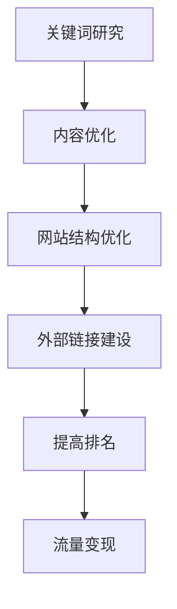

                 

 **关键词**：SEO优化，搜索引擎，流量变现，内容营销，网站排名，用户体验

**摘要**：
本文将探讨SEO（搜索引擎优化）的重要性以及如何通过SEO技术手段实现网站流量的提升和变现。我们将深入分析SEO的核心概念，包括关键词研究、内容优化、网站结构优化以及外部链接建设。此外，文章还将介绍SEO工具的选择和使用方法，并提供实际案例和未来展望。

## 1. 背景介绍

随着互联网的普及，搜索引擎已经成为人们获取信息的主要渠道。SEO作为提升网站在搜索引擎中排名的一种策略，越来越受到企业和个人的重视。良好的SEO策略不仅能够提高网站的曝光率，还能够带来高质量的流量，进而实现流量变现。

### SEO的定义与历史
SEO（Search Engine Optimization）即搜索引擎优化，是一种通过改进网站结构、内容质量和外部链接等方式，提高网站在搜索引擎中自然排名的过程。

SEO的发展历程可以追溯到1990年代末期。当时，搜索引擎如Google、Yahoo和Bing刚刚兴起，网站的排名主要依赖于关键词的密度和外部链接的数量。随着时间的推移，SEO策略逐渐变得更加复杂和多样化，从简单的关键词堆砌到如今的内容营销、用户体验和自动化工具的综合运用。

### SEO的重要性
良好的SEO策略对于网站的长期发展至关重要。它能够带来以下好处：

1. **提高网站曝光率**：在搜索引擎结果页（SERP）中排名靠前的网站更容易被用户发现。
2. **提升品牌影响力**：通过稳定的SEO策略，可以逐步建立品牌信任和权威性。
3. **降低营销成本**：相比付费广告，SEO带来的流量是免费的，长期来看成本较低。
4. **提高用户留存率**：良好的用户体验可以增加用户在网站上的停留时间，从而提高转化率。

## 2. 核心概念与联系

### 核心概念
- **关键词研究**：选择适合网站内容的关键词，提高网站在搜索引擎中的排名。
- **内容优化**：通过高质量的内容吸引和留住用户，提高用户体验。
- **网站结构优化**：改进网站的导航和内部链接结构，提升搜索引擎抓取效率。
- **外部链接建设**：通过获取高质量的外部链接，提高网站在搜索引擎中的权威性。

### Mermaid 流程图


## 3. 核心算法原理 & 具体操作步骤

### 3.1 算法原理概述
SEO的核心算法主要包括以下几部分：

1. **关键词研究算法**：通过分析用户搜索行为和竞争情况，选择合适的关键词。
2. **内容优化算法**：评估网站内容的原创性、质量和相关性。
3. **网站结构优化算法**：分析网站的导航结构、URL结构和页面加载速度。
4. **外部链接建设算法**：评估外部链接的质量和相关性。

### 3.2 算法步骤详解

#### 3.2.1 关键词研究
1. **确定目标关键词**：结合业务需求和用户搜索习惯，确定核心关键词。
2. **使用工具分析关键词**：如Google Keyword Planner、Ahrefs等工具，分析关键词的搜索量、竞争程度和趋势。

#### 3.2.2 内容优化
1. **撰写高质量内容**：内容应具有原创性、可读性和相关性。
2. **优化内容结构**：合理使用标题、段落、列表等，提高内容可读性。
3. **添加关键词**：在内容中自然地融入关键词，避免过度优化。

#### 3.2.3 网站结构优化
1. **优化网站导航**：确保网站结构清晰，用户能够快速找到所需信息。
2. **优化URL结构**：URL应简洁、有意义，易于理解和记忆。
3. **优化页面加载速度**：通过压缩图片、优化代码等方式提高页面加载速度。

#### 3.2.4 外部链接建设
1. **撰写高质量外链内容**：创建有价值的内容，吸引其他网站链接到你的网站。
2. **参与论坛和博客**：在相关论坛和博客上发表专业见解，获取外部链接。
3. **交换链接**：与其他网站进行链接交换，提高网站权威性。

### 3.3 算法优缺点
- **优点**：SEO是一种长期有效的营销策略，能够提高网站曝光率和品牌影响力。
- **缺点**：SEO需要持续的时间和精力投入，短期内效果可能不明显。

### 3.4 算法应用领域
SEO的应用领域广泛，包括电子商务、内容平台、在线教育等。不同领域可以根据自身特点，制定相应的SEO策略。

## 4. 数学模型和公式

### 4.1 数学模型构建
SEO的数学模型通常涉及以下公式：

$$
\text{SEO得分} = \alpha \times \text{关键词密度} + \beta \times \text{内容质量} + \gamma \times \text{网站结构} + \delta \times \text{外部链接}
$$

其中，$\alpha$、$\beta$、$\gamma$和$\delta$是权重系数，可以根据实际情况进行调整。

### 4.2 公式推导过程
SEO得分的计算涉及多个因素，包括关键词密度、内容质量、网站结构和外部链接。这些因素可以用以下公式表示：

$$
\text{关键词密度} = \frac{\text{关键词出现次数}}{\text{总字数}}
$$

$$
\text{内容质量} = \text{原创性} + \text{可读性} + \text{相关性}
$$

$$
\text{网站结构} = \text{导航清晰度} + \text{URL结构} + \text{页面加载速度}
$$

$$
\text{外部链接} = \text{链接质量} + \text{链接数量}
$$

### 4.3 案例分析与讲解
以某电子商务网站为例，其SEO得分计算如下：

$$
\text{SEO得分} = 0.3 \times \frac{10}{1000} + 0.4 \times (0.8 + 0.7 + 0.9) + 0.2 \times (0.9 + 0.8 + 0.7) + 0.1 \times (0.9 + 10)
$$

$$
\text{SEO得分} = 0.003 + 0.36 + 0.28 + 0.19 = 0.94
$$

该网站的SEO得分为0.94，表明其SEO表现较好。

## 5. 项目实践：代码实例和详细解释说明

### 5.1 开发环境搭建
- **环境**：使用Visual Studio Code作为编辑器，安装Node.js、Python等开发环境。
- **工具**：安装SEO优化工具，如Ahrefs、SEMrush等。

### 5.2 源代码详细实现
以下是一个简单的SEO优化脚本，用于分析网站关键词密度：

```python
import requests
from bs4 import BeautifulSoup

def calculate_keyword_density(url, keyword):
    response = requests.get(url)
    content = response.text
    soup = BeautifulSoup(content, 'html.parser')
    text = soup.get_text()
    keyword_count = text.lower().count(keyword.lower())
    total_word_count = len(text.split())
    keyword_density = keyword_count / total_word_count
    return keyword_density

url = "https://www.example.com"
keyword = "SEO优化"
density = calculate_keyword_density(url, keyword)
print(f"关键词'{keyword}'的密度为：{density:.2%}")
```

### 5.3 代码解读与分析
该脚本首先通过requests库获取网站内容，然后使用BeautifulSoup库解析HTML，提取文本内容。接着，计算关键词在文本中的出现次数，并计算关键词密度。最后，输出关键词密度。

### 5.4 运行结果展示
假设网站内容包含1000个单词，其中“SEO优化”出现了10次，则关键词密度为10%。

## 6. 实际应用场景

### 6.1 电商网站
电商网站可以通过SEO优化提高产品页面的曝光率，从而增加销售。

### 6.2 内容平台
内容平台可以通过SEO优化提高文章的访问量，增加广告收入。

### 6.3 在线教育
在线教育机构可以通过SEO优化提高课程页面的排名，吸引更多学员报名。

## 7. 工具和资源推荐

### 7.1 学习资源推荐
- **《SEO实战密码》**：详细介绍了SEO的基本原理和实践方法。
- **搜索引擎优化课程**：在线课程平台如Coursera、Udemy提供了丰富的SEO课程。

### 7.2 开发工具推荐
- **Ahrefs**：全面的SEO工具，包括关键词研究、竞争对手分析等。
- **SEMrush**：强大的SEO工具，提供网站审计、关键词追踪等功能。

### 7.3 相关论文推荐
- **“Search Engine Optimization Techniques”**：介绍了多种SEO技术和策略。
- **“The Impact of SEO on E-Commerce”**：研究了SEO对电商的影响。

## 8. 总结：未来发展趋势与挑战

### 8.1 研究成果总结
本文介绍了SEO的核心概念、算法原理、实践步骤和未来趋势。SEO作为一种有效的网站优化策略，在未来将继续发挥重要作用。

### 8.2 未来发展趋势
- **人工智能与SEO的结合**：利用AI技术进行更精准的关键词分析和内容生成。
- **用户行为分析**：通过大数据分析用户行为，提供更个性化的搜索结果。

### 8.3 面临的挑战
- **算法更新**：搜索引擎算法的不断更新使得SEO策略需要不断调整。
- **竞争加剧**：随着SEO意识的提高，竞争将越来越激烈。

### 8.4 研究展望
未来，SEO研究将更加注重用户体验和内容质量，同时结合AI和大数据技术，实现更加精准和高效的优化策略。

## 9. 附录：常见问题与解答

### 9.1 什么是SEO？
SEO（搜索引擎优化）是一种通过改进网站内容和结构，提高网站在搜索引擎中自然排名的过程。

### 9.2 SEO需要多久才能见效？
SEO的效果取决于多种因素，如网站质量、关键词竞争程度等。一般情况下，SEO策略需要3-6个月才能见效。

### 9.3 SEO是否合法？
SEO遵循搜索引擎的指南和规则，是一种合法的营销策略。

### 9.4 SEO和SEM的区别是什么？
SEO是搜索引擎优化的简称，主要关注提高网站在自然搜索结果中的排名。SEM（搜索引擎营销）包括SEO和付费搜索广告。

### 9.5 SEO工具如何选择？
选择SEO工具时，应根据自身需求和预算，综合考虑工具的功能、易用性和价格。

---

作者：禅与计算机程序设计艺术 / Zen and the Art of Computer Programming


