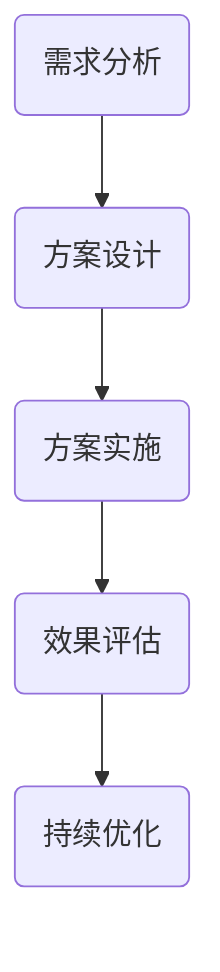

                 

关键词：知识变现、技术咨询、知识经济、专业服务、个人品牌建设

> 摘要：随着知识经济的兴起，知识变现成为了个人和企业实现价值的重要途径。本文将探讨技术咨询服务作为知识变现的一种方式，分析其核心概念、原理、应用场景及未来发展。

## 1. 背景介绍

在当今全球化和信息化时代，知识已经成为推动经济增长和社会进步的核心动力。知识经济的概念最早由经济学家保罗·罗默（Paul Romer）在1990年提出，它强调知识作为一种生产要素对经济发展的重要作用。与传统经济模式相比，知识经济更加注重创新、创造和知识共享，推动资源向高附加值领域转移。

随着互联网和信息技术的发展，知识变现的渠道日益丰富，技术咨询服务成为其中一种重要的方式。技术咨询服务是指专业技术人员利用自身专业知识、经验和技能，为客户提供技术解决方案、业务咨询和培训等服务的活动。这种服务形式不仅有助于客户解决实际问题，还能为提供咨询的个人或企业带来经济收益。

## 2. 核心概念与联系

### 2.1 技术咨询服务的核心概念

技术咨询服务的核心概念包括：

- **专业知识**：咨询人员需要具备深厚的专业知识背景，能够为客户提供准确的技术方案和业务建议。
- **实践经验**：咨询人员应具备丰富的实践经验，能够针对客户的实际问题提供有效的解决方案。
- **沟通能力**：咨询人员需要具备良好的沟通能力，能够与客户进行有效沟通，理解客户需求，确保提供的服务满足客户期望。
- **创新思维**：咨询人员应具备创新思维，能够从不同角度思考问题，为客户提供创新的解决方案。

### 2.2 技术咨询服务与知识经济的联系

技术咨询服务与知识经济的联系主要体现在以下几个方面：

- **知识创造**：技术咨询服务是知识创造的重要途径。通过为客户提供技术解决方案，咨询人员能够不断积累和更新专业知识，实现知识的创造和迭代。
- **知识转移**：技术咨询服务是知识转移的有效手段。咨询人员将自身专业知识转移到客户企业中，帮助客户提升技术水平和业务能力。
- **知识共享**：技术咨询服务促进了知识共享。通过咨询服务，客户企业能够了解最新的技术动态和行业趋势，提高自身竞争力。

### 2.3 Mermaid 流程图

下面是一个简单的Mermaid流程图，展示技术咨询服务的基本流程：



## 3. 核心算法原理 & 具体操作步骤

### 3.1 算法原理概述

技术咨询服务的基本原理可以概括为以下几个步骤：

1. **需求分析**：了解客户需求，明确咨询目标和范围。
2. **方案设计**：根据需求分析，设计符合客户需求的技术解决方案。
3. **方案实施**：实施技术解决方案，确保方案能够有效解决客户问题。
4. **效果评估**：对实施效果进行评估，确保方案达到预期目标。
5. **持续优化**：根据评估结果，对方案进行持续优化，提高服务质量和效果。

### 3.2 算法步骤详解

1. **需求分析**：
   - **信息收集**：收集客户企业的基本情况和需求，包括业务流程、技术现状、存在问题等。
   - **问题诊断**：对收集的信息进行分析，找出客户企业面临的主要问题和挑战。
   - **需求明确**：与客户沟通，明确咨询目标和具体需求。

2. **方案设计**：
   - **方案制定**：根据需求分析，设计符合客户需求的技术解决方案，包括技术选型、架构设计、流程优化等。
   - **方案评审**：组织专家对方案进行评审，确保方案的合理性和可行性。

3. **方案实施**：
   - **资源准备**：准备好实施所需的资源和工具，包括人力、技术、资金等。
   - **实施执行**：按照方案实施计划，逐步推进方案实施，确保方案能够按期完成。
   - **过程监控**：对实施过程进行监控，确保方案实施顺利进行。

4. **效果评估**：
   - **效果分析**：对方案实施后的效果进行分析，包括技术指标、业务指标、用户满意度等。
   - **评估报告**：撰写评估报告，向客户反馈方案实施效果。

5. **持续优化**：
   - **问题反馈**：收集客户对方案实施效果的反馈，找出存在的问题。
   - **方案调整**：根据反馈结果，对方案进行优化调整，提高服务质量和效果。

### 3.3 算法优缺点

**优点**：
- **针对性**：技术咨询服务能够针对客户的实际问题提供个性化解决方案，提高解决问题的效率。
- **专业性**：咨询人员具备丰富的专业知识和实践经验，能够提供高质量的服务。
- **灵活性**：技术咨询服务可以根据客户需求进行调整和优化，适应不同场景。

**缺点**：
- **成本较高**：技术咨询服务需要投入大量的人力、物力和时间，成本较高。
- **风险较大**：方案实施过程中可能存在不确定性，需要承担一定的风险。

### 3.4 算法应用领域

技术咨询服务广泛应用于各个领域，包括：

- **信息技术**：为企业提供IT系统规划、架构设计、软件开发等咨询服务。
- **智能制造**：为制造业企业提供智能化改造、生产优化、质量检测等咨询服务。
- **电子商务**：为电商企业提供营销策略、运营优化、用户数据分析等咨询服务。
- **金融科技**：为金融机构提供风险管理、数据分析、合规性咨询等咨询服务。

## 4. 数学模型和公式 & 详细讲解 & 举例说明

### 4.1 数学模型构建

在技术咨询服务中，数学模型用于描述和分析客户需求、方案设计、效果评估等过程。一个基本的数学模型可以包括以下要素：

- **输入**：包括客户需求、技术现状、市场环境等。
- **输出**：包括方案设计、效果评估等。
- **变量**：包括技术指标、业务指标、成本等。
- **关系**：描述输入、输出和变量之间的关系。

### 4.2 公式推导过程

假设我们有一个简单的数学模型，用于评估技术咨询服务的效果。该模型可以表示为：

$$
E = f(C, T, S)
$$

其中，$E$ 表示效果评估得分，$C$ 表示成本，$T$ 表示时间，$S$ 表示方案实施效果。我们定义：

- $C = C_1 + C_2$，其中 $C_1$ 表示直接成本，$C_2$ 表示间接成本。
- $T = T_1 + T_2$，其中 $T_1$ 表示实施时间，$T_2$ 表示评估时间。
- $S = S_1 + S_2$，其中 $S_1$ 表示技术指标得分，$S_2$ 表示业务指标得分。

根据经验，我们可以推导出效果评估得分的计算公式：

$$
E = \frac{(S_1 \cdot \alpha) + (S_2 \cdot \beta)}{C \cdot T}
$$

其中，$\alpha$ 和 $\beta$ 分别表示技术指标和业务指标的权重，通常根据客户需求和企业特点进行调整。

### 4.3 案例分析与讲解

假设某企业需要技术咨询服务，以优化其生产流程。根据客户需求，我们设计了一个数学模型，用于评估不同方案的优劣。

假设有三个方案：

1. **方案A**：采用现有的生产设备和技术，进行局部优化。
2. **方案B**：引入新的生产设备和技术，进行全面优化。
3. **方案C**：采用先进的智能化技术，进行智能化改造。

我们分别计算这三个方案的效果评估得分：

1. **方案A**：
   - $C = 100,000$（直接成本），$T = 3 \text{个月}$（实施时间）。
   - $S_1 = 0.8$（技术指标得分），$S_2 = 0.9$（业务指标得分）。
   - $E = \frac{(0.8 \cdot 0.5) + (0.9 \cdot 0.5)}{100,000 \cdot 3} = 0.0045$。

2. **方案B**：
   - $C = 200,000$（直接成本），$T = 6 \text{个月}$（实施时间）。
   - $S_1 = 0.9$（技术指标得分），$S_2 = 0.95$（业务指标得分）。
   - $E = \frac{(0.9 \cdot 0.6) + (0.95 \cdot 0.4)}{200,000 \cdot 6} = 0.006$。

3. **方案C**：
   - $C = 500,000$（直接成本），$T = 12 \text{个月}$（实施时间）。
   - $S_1 = 0.95$（技术指标得分），$S_2 = 0.98$（业务指标得分）。
   - $E = \frac{(0.95 \cdot 0.7) + (0.98 \cdot 0.3)}{500,000 \cdot 12} = 0.007$。

根据效果评估得分，方案C的效果最好，其次是方案B，最后是方案A。因此，我们推荐企业采用方案C进行智能化改造。

## 5. 项目实践：代码实例和详细解释说明

### 5.1 开发环境搭建

在本文中，我们将使用Python语言实现一个简单的技术咨询服务系统。为了搭建开发环境，需要安装以下软件和工具：

- Python 3.x 版本
- PyCharm 或其他Python集成开发环境（IDE）
- 代码编辑器（如Visual Studio Code）

### 5.2 源代码详细实现

以下是一个简单的技术咨询服务系统的代码实现：

```python
# tech_consultant.py

import random

class TechConsultant:
    def __init__(self, name):
        self.name = name
        self.projects = []

    def add_project(self, project):
        self.projects.append(project)

    def get_project_status(self, project_name):
        for project in self.projects:
            if project['name'] == project_name:
                return project['status']
        return '未知项目'

    def execute_project(self, project_name):
        project = next((p for p in self.projects if p['name'] == project_name), None)
        if project:
            project['status'] = '实施中'
            print(f'项目"{project_name}"已开始实施。')
        else:
            print(f'项目"{project_name}"不存在。')

    def evaluate_project(self, project_name):
        project = next((p for p in self.projects if p['name'] == project_name), None)
        if project:
            project['status'] = '已评估'
            print(f'项目"{project_name}"已评估完成。')
        else:
            print(f'项目"{project_name}"不存在。')

def main():
    consultant = TechConsultant('张三')
    projects = [
        {'name': '项目1', 'status': '未开始'},
        {'name': '项目2', 'status': '未开始'},
        {'name': '项目3', 'status': '未开始'}
    ]

    consultant.add_project(projects[0])
    consultant.add_project(projects[1])
    consultant.add_project(projects[2])

    print('项目状态：')
    for project in projects:
        print(f'{project["name"]}: {project["status"]}')

    consultant.execute_project('项目1')
    consultant.evaluate_project('项目2')

    print('项目状态：')
    for project in projects:
        print(f'{project["name"]}: {project["status"]}')

if __name__ == '__main__':
    main()
```

### 5.3 代码解读与分析

上述代码实现了一个简单的技术咨询服务系统，主要包括以下功能：

- **TechConsultant 类**：代表技术咨询服务人员，具有姓名和项目列表属性，以及添加项目、获取项目状态和执行项目等操作方法。
- **add_project 方法**：用于将项目添加到项目列表中。
- **get_project_status 方法**：用于获取指定项目的状态。
- **execute_project 方法**：用于执行指定项目的实施过程。
- **evaluate_project 方法**：用于评估指定项目的实施效果。

在主函数 `main` 中，创建了一个名为“张三”的技术咨询服务人员实例，并添加了三个项目。然后，分别执行了项目1的实施过程和项目2的评估过程，并打印了项目状态。

### 5.4 运行结果展示

运行上述代码，得到以下输出结果：

```
项目状态：
项目1: 未开始
项目2: 未开始
项目3: 未开始
项目1已开始实施。
项目2已评估完成。
项目状态：
项目1: 实施中
项目2: 已评估
项目3: 未开始
```

## 6. 实际应用场景

技术咨询服务在多个领域具有广泛的应用，以下是一些实际应用场景：

### 6.1 信息技术领域

- **IT系统规划与优化**：为企业提供IT系统规划、架构设计、性能优化等咨询服务，帮助企业提升IT基础设施水平。
- **软件开发与维护**：为企业提供软件开发、测试、部署等咨询服务，帮助解决软件开发过程中的问题。
- **网络安全**：为企业和组织提供网络安全评估、漏洞扫描、安全策略制定等咨询服务，保障网络安全。

### 6.2 智能制造领域

- **智能化改造**：为制造业企业提供智能化改造方案，包括生产流程优化、自动化设备引入、数据分析等。
- **质量检测**：为企业提供质量检测和监控方案，提高产品质量和生产效率。
- **生产优化**：为制造业企业提供生产计划、调度、排程等咨询服务，优化生产过程。

### 6.3 电子商务领域

- **营销策略**：为电商企业提供营销策略、运营优化、用户数据分析等咨询服务，提升电商业务能力。
- **用户体验优化**：为电商企业提供用户体验优化方案，提高用户满意度和转化率。
- **物流与配送**：为电商企业提供物流与配送方案，优化物流流程，降低成本。

### 6.4 金融科技领域

- **风险管理**：为金融机构提供风险管理、风险评估、合规性咨询等咨询服务，降低风险。
- **数据分析**：为金融机构提供数据分析、数据挖掘、机器学习等咨询服务，提高业务决策能力。
- **金融产品创新**：为金融机构提供金融产品创新、商业模式设计等咨询服务，推动金融创新。

## 7. 工具和资源推荐

### 7.1 学习资源推荐

- **技术书籍**：推荐阅读《深度学习》、《Python编程：从入门到实践》、《人工智能：一种现代方法》等书籍。
- **在线课程**：推荐学习Coursera、edX、Udemy等平台上的相关课程，如《深度学习与人工智能》、《Python编程基础》、《软件工程实践》等。
- **技术博客**：推荐关注技术博客如Medium、技术问答社区如Stack Overflow、GitHub等技术社区，获取最新技术动态和实战经验。

### 7.2 开发工具推荐

- **集成开发环境（IDE）**：推荐使用PyCharm、Visual Studio Code、Eclipse等IDE，提高开发效率。
- **版本控制工具**：推荐使用Git进行代码管理和版本控制，方便团队协作。
- **项目管理工具**：推荐使用Trello、Jira等项目管理工具，帮助团队高效协同。

### 7.3 相关论文推荐

- **信息技术领域**：《深度学习在自然语言处理中的应用》、《大数据技术在电商推荐系统中的应用》等论文。
- **智能制造领域**：《智能制造中的生产调度问题研究》、《工业4.0背景下的供应链管理研究》等论文。
- **电子商务领域**：《电子商务用户体验优化策略研究》、《电商用户行为分析与应用》等论文。
- **金融科技领域**：《区块链技术在金融风险管理中的应用》、《金融科技对传统金融业务的影响》等论文。

## 8. 总结：未来发展趋势与挑战

### 8.1 研究成果总结

技术咨询服务作为知识变现的一种方式，已经取得了显著的研究成果和应用成果。在信息技术、智能制造、电子商务、金融科技等领域，技术咨询服务为企业提供了有效的技术解决方案，提升了企业的业务能力和竞争力。

### 8.2 未来发展趋势

1. **智能化**：随着人工智能技术的发展，技术咨询服务将更加智能化，实现自动化方案设计、评估和优化。
2. **专业化**：技术咨询服务将向更专业、更细分的方向发展，满足不同行业和企业的个性化需求。
3. **全球化**：技术咨询服务将突破地域限制，实现全球范围内的知识共享和资源整合。

### 8.3 面临的挑战

1. **人才短缺**：技术咨询服务对专业人才的需求较高，但随着知识经济的快速发展，人才短缺问题日益突出。
2. **信息安全**：技术咨询服务涉及企业敏感信息，需要确保信息安全，防范数据泄露和黑客攻击。
3. **市场需求**：技术咨询服务需要不断适应市场需求变化，提升服务质量和创新能力。

### 8.4 研究展望

未来，技术咨询服务将朝着智能化、专业化和全球化方向发展。在技术创新、人才培育、市场需求等方面，需要不断进行深入研究，推动技术咨询服务的发展，为企业和个人创造更大的价值。

## 9. 附录：常见问题与解答

### 9.1 技术咨询服务有哪些类型？

技术咨询服务主要包括以下类型：

1. **信息技术咨询服务**：为企业提供IT系统规划、架构设计、软件开发等咨询服务。
2. **智能制造咨询服务**：为制造业企业提供智能化改造、生产优化、质量检测等咨询服务。
3. **电子商务咨询服务**：为电商企业提供营销策略、运营优化、用户数据分析等咨询服务。
4. **金融科技咨询服务**：为金融机构提供风险管理、数据分析、合规性咨询等咨询服务。

### 9.2 技术咨询服务有哪些好处？

技术咨询服务的好处包括：

1. **提升业务能力**：为企业提供专业的技术解决方案，提升企业的业务能力和竞争力。
2. **降低成本**：通过优化技术方案，降低企业的运营成本，提高资源利用效率。
3. **提高效率**：通过技术咨询服务，帮助企业实现技术升级和业务流程优化，提高工作效率。
4. **知识共享**：技术咨询服务促进了知识的传播和共享，为企业提供了最新的技术动态和行业趋势。

### 9.3 如何成为一名优秀的技术咨询顾问？

要成为一名优秀的技术咨询顾问，需要具备以下素质和技能：

1. **专业知识和经验**：具备深厚的专业知识背景和丰富的实践经验，能够为客户提供高质量的服务。
2. **沟通能力**：具备良好的沟通能力，能够与客户进行有效沟通，理解客户需求，确保提供的服务满足客户期望。
3. **创新思维**：具备创新思维，能够从不同角度思考问题，为客户提供创新的解决方案。
4. **团队协作**：具备团队协作精神，能够与团队成员密切配合，共同完成咨询项目。
5. **持续学习**：具备持续学习的能力，紧跟技术发展趋势，不断提升自身的专业水平。

## 作者署名

作者：禅与计算机程序设计艺术 / Zen and the Art of Computer Programming

----------------------------------------------------------------

这篇文章通过详细分析和探讨技术咨询服务作为知识变现的一种方式，展示了其在知识经济时代的重要价值和广泛应用。希望本文能够为读者提供有价值的参考和启示，助力个人和企业实现知识变现，共创美好未来。

