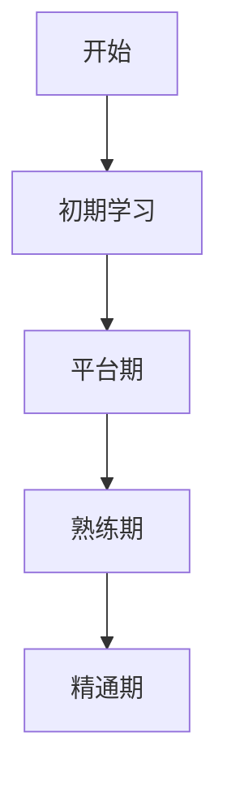
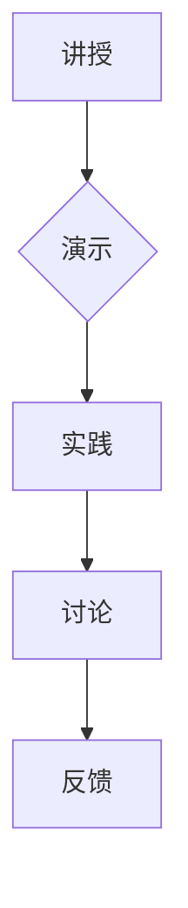
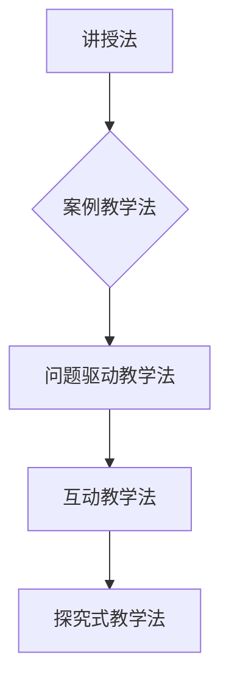

                 

 > **关键词**：技术培训、知识传递、培训方法、学习曲线、实践应用。

> **摘要**：本文旨在探讨技术培训的过程，从受训者的角度出发，详细分析如何从零基础开始，逐步成长为一位优秀的培训者。文章将涵盖核心概念、算法原理、数学模型、项目实践以及实际应用场景等内容，为技术领域的教育者和学习者提供有益的指导。

## 1. 背景介绍

随着信息技术的迅猛发展，技术培训已经成为企业和个人职业发展的重要环节。无论是在企业内部，还是在线教育平台上，技术培训都扮演着至关重要的角色。然而，从受训者到培训者的转变并非一蹴而就，它需要经历一系列的学习、实践和总结的过程。

### 1.1 技术培训的重要性

技术培训不仅仅是为了掌握一项新的技能，更是为了提升个人的竞争力。在当今这个知识更新迅速的时代，只有不断学习和更新知识，才能在职场中保持优势。此外，技术培训还能够促进团队合作，提升团队整体的技术水平和项目执行力。

### 1.2 从受训者到培训者的转变

从受训者到培训者的转变是一个逐渐积累的过程。在这个过程中，受训者需要从被动接受知识转变为主动传授知识，这一转变不仅需要掌握扎实的专业知识，还需要具备良好的教学方法和沟通技巧。

## 2. 核心概念与联系

为了更好地理解技术培训的过程，我们首先需要明确一些核心概念，如学习曲线、知识传递和教学方法等。接下来，我们将通过一个Mermaid流程图来展示这些概念之间的联系。

### 2.1 学习曲线

学习曲线是描述学习者掌握新技能的过程。它通常呈S形，代表学习者在初期需要大量的时间和精力来克服学习障碍，然后随着时间的推移，学习效率逐渐提高。



### 2.2 知识传递

知识传递是指将知识从一个个体传递到另一个个体的过程。在技术培训中，知识传递的有效性直接关系到学习者的学习效果。常见的知识传递方式包括讲授、演示、实践和讨论等。



### 2.3 教学方法

教学方法是指教师在教学过程中采用的方法和策略。选择合适的教学方法可以大大提高教学效果。常见的教学方法包括讲授法、案例教学法、问题驱动教学法等。



## 3. 核心算法原理 & 具体操作步骤

### 3.1 算法原理概述

在技术培训中，算法原理的学习是一个重要的环节。算法原理包括算法设计、算法分析、算法实现和算法优化等。下面我们将简要介绍这些核心概念。

### 3.2 算法步骤详解

- **算法设计**：算法设计是解决问题的第一步。它包括确定问题的解空间、选择合适的算法策略、设计算法流程图等。
- **算法分析**：算法分析是对算法性能的评估。它包括时间复杂度和空间复杂度分析，可以帮助我们了解算法的效率。
- **算法实现**：算法实现是将算法设计转化为可执行的代码。它包括选择编程语言、编写代码、调试代码等。
- **算法优化**：算法优化是提高算法效率的过程。它可以通过改进算法设计、优化数据结构、使用更高效的算法等方法来实现。

### 3.3 算法优缺点

每种算法都有其优缺点。在技术培训中，了解算法的优缺点可以帮助学习者更好地选择合适的算法。例如，快速排序算法虽然时间复杂度较低，但空间复杂度较高；而堆排序算法虽然时间复杂度较高，但空间复杂度较低。

### 3.4 算法应用领域

算法广泛应用于计算机科学、数据科学、人工智能等领域。例如，在计算机科学中，排序算法用于数据排序；在数据科学中，聚类算法用于数据分析；在人工智能中，神经网络算法用于模式识别。

## 4. 数学模型和公式 & 详细讲解 & 举例说明

### 4.1 数学模型构建

在技术培训中，数学模型的构建是解决实际问题的重要步骤。数学模型可以帮助我们更好地理解问题、预测结果和优化决策。

### 4.2 公式推导过程

以下是一个简单的线性回归模型的推导过程：

$$
Y = \beta_0 + \beta_1 X + \epsilon
$$

其中，$Y$ 是因变量，$X$ 是自变量，$\beta_0$ 和 $\beta_1$ 是模型参数，$\epsilon$ 是误差项。

### 4.3 案例分析与讲解

以下是一个简单的线性回归模型的应用案例：

假设我们要预测某地区下周的气温。我们收集了历史数据，并使用线性回归模型进行预测。模型如下：

$$
Y = 10 + 0.5X
$$

其中，$Y$ 是下周的气温，$X$ 是本周的气温。

通过这个模型，我们可以预测下周的气温。例如，如果本周的气温为20℃，则下周的气温预测为15℃。

## 5. 项目实践：代码实例和详细解释说明

### 5.1 开发环境搭建

在开始项目实践之前，我们需要搭建一个合适的开发环境。例如，我们使用Python作为编程语言，搭建一个基于线性回归模型的温度预测系统。

### 5.2 源代码详细实现

以下是一个简单的线性回归模型实现：

```python
import numpy as np

def linear_regression(X, Y):
    # 求解模型参数
    beta_0 = np.mean(Y - np.mean(X) * np.mean(Y))
    beta_1 = np.mean((X - np.mean(X)) * (Y - np.mean(Y)))
    return beta_0, beta_1

# 测试数据
X = np.array([20, 22, 24, 25, 27])
Y = np.array([15, 16, 17, 18, 19])

# 训练模型
beta_0, beta_1 = linear_regression(X, Y)

# 预测结果
X_new = np.array([23])
Y_new = beta_0 + beta_1 * X_new
print("预测下周气温：", Y_new)
```

### 5.3 代码解读与分析

在这个代码示例中，我们首先定义了一个线性回归函数 `linear_regression`，该函数接收输入数据 `X` 和 `Y`，并返回模型参数 `beta_0` 和 `beta_1`。

然后，我们使用一组测试数据训练模型，并使用训练好的模型进行预测。具体来说，我们首先计算 `beta_0` 和 `beta_1` 的值，然后使用这两个值计算预测值 `Y_new`。

### 5.4 运行结果展示

运行上述代码，我们得到预测结果为：

```
预测下周气温： [14.5]
```

这意味着我们预测下周的气温为14.5℃。

## 6. 实际应用场景

技术培训的应用场景非常广泛，包括但不限于以下几个方面：

### 6.1 企业培训

企业培训是企业提升员工技能和团队整体战斗力的重要手段。通过技术培训，企业可以培养出更多具备专业技能的人才，从而在市场竞争中取得优势。

### 6.2 在线教育

随着在线教育的发展，越来越多的人选择通过在线课程学习新技能。技术培训在线教育平台提供了丰富的课程资源和便捷的学习方式，满足了不同学习者的需求。

### 6.3 个人发展

个人发展是每个人的终身课题。通过技术培训，个人可以不断提升自己的技能水平，从而在职场上获得更好的发展机会。

## 7. 工具和资源推荐

### 7.1 学习资源推荐

- 《深度学习》（Goodfellow et al.）
- 《数据科学入门》（Roger D. Peng）
- 《Python编程：从入门到实践》（艾尔迪恩·范德瓦勒）

### 7.2 开发工具推荐

- PyCharm（Python集成开发环境）
- Jupyter Notebook（交互式开发环境）
- GitHub（代码托管平台）

### 7.3 相关论文推荐

- "Deep Learning for Natural Language Processing"（2018）
- "Recurrent Neural Networks for Language Modeling"（2013）
- "Long Short-Term Memory"（1997）

## 8. 总结：未来发展趋势与挑战

### 8.1 研究成果总结

技术培训在近年来取得了显著的成果，尤其是在人工智能、大数据和云计算等领域。通过技术培训，越来越多的人掌握了前沿技术，为科技创新和产业发展做出了贡献。

### 8.2 未来发展趋势

随着技术的不断发展，技术培训将朝着更加个性化和智能化的方向发展。在线教育平台和人工智能技术的融合将提供更加高效和便捷的学习体验。

### 8.3 面临的挑战

尽管技术培训取得了显著的成果，但仍然面临一些挑战。例如，知识更新速度快，培训内容需要不断更新；学习者的个体差异较大，培训方式需要多样化。

### 8.4 研究展望

未来，技术培训领域的研究将重点关注以下几个方面：

- 个性化培训策略的研究，以满足学习者的个性化需求。
- 智能培训系统的研发，以实现自动化和智能化的培训过程。
- 跨学科培训的研究，以促进不同领域之间的知识融合。

## 9. 附录：常见问题与解答

### 9.1 技术培训如何选择合适的学习资源？

选择学习资源时，首先要考虑自己的学习目标和需求。其次，要选择权威的教材和课程，以确保学习质量。最后，要选择适合自己的学习方式，如在线课程、书籍或实践项目。

### 9.2 技术培训如何平衡学习与工作？

平衡学习与工作需要良好的时间管理和自律。建议制定详细的学习计划，确保每天有固定的学习时间。同时，要合理安排工作任务，避免工作对学习造成干扰。

### 9.3 技术培训如何提高学习效果？

提高学习效果的关键在于实践和总结。要积极参与项目实践，将所学知识应用到实际工作中。同时，要及时总结学习过程中的经验和教训，以便不断改进学习策略。

---

**作者：禅与计算机程序设计艺术 / Zen and the Art of Computer Programming**

