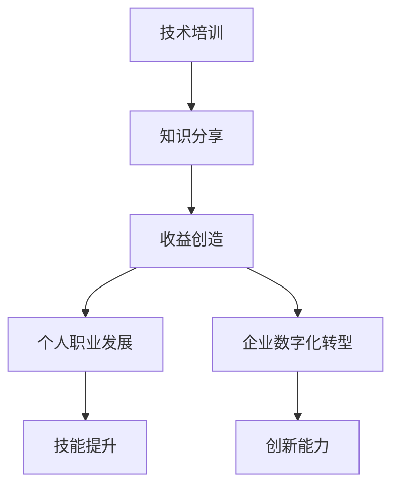

                 

关键词：技术培训、知识分享、收益创造、专业成长、在线教育

> 摘要：本文深入探讨了技术培训在知识分享和收益创造中的重要性。通过分析核心概念、算法原理、数学模型和项目实践，阐述了如何通过技术培训实现个人职业发展和企业数字化转型。本文还展望了未来技术培训的发展趋势，提出了面临的挑战和应对策略。

## 1. 背景介绍

随着信息技术的高速发展，技术培训逐渐成为个人职业发展和企业数字化转型的重要驱动力。在这个知识经济时代，知识的获取和分享变得前所未有的便捷，但同时也面临着信息过载和质量参差不齐的挑战。技术培训不仅能够帮助个人提升专业技能，还能为企业提供持续创新的动力。

### 1.1 技术培训的现状

目前，技术培训的形式多种多样，包括在线教育、线下培训、工作坊、研讨会等。在线教育凭借其灵活性和广泛性，逐渐成为主流。然而，在线教育的质量参差不齐，如何选择合适的学习资源和培训平台成为许多学习者的痛点。

### 1.2 技术培训的重要性

技术培训的重要性体现在以下几个方面：

1. **个人职业发展**：技术培训能够提升个人的专业技能和知识水平，为职业发展提供强有力的支持。
2. **企业数字化转型**：技术培训能够为企业培养具备创新能力的高技能人才，推动企业数字化转型。
3. **知识更新与分享**：技术培训是知识更新和分享的重要途径，有助于构建学习型社会。

## 2. 核心概念与联系

为了更好地理解技术培训的核心概念和联系，我们将使用Mermaid流程图来展示主要概念及其之间的关系。



### 2.1 技术培训

技术培训是指通过系统化的学习过程，使学习者掌握特定的技术知识和技能。技术培训的内容可以涵盖编程、数据分析、人工智能、网络安全等多个领域。

### 2.2 知识分享

知识分享是技术培训的核心目标之一，通过知识分享，学习者可以将学到的知识应用到实际工作中，实现个人职业发展。

### 2.3 收益创造

收益创造是技术培训的另一个重要目标，通过技术培训，学习者可以提升自己的专业技能，从而为企业创造更大的价值。

### 2.4 个人职业发展

个人职业发展是技术培训的直接受益者。通过技术培训，学习者可以实现职位晋升、薪资提升等职业发展目标。

### 2.5 企业数字化转型

企业数字化转型是当前经济发展的大趋势。通过技术培训，企业可以培养出具备创新能力的高技能人才，推动企业的数字化转型。

## 3. 核心算法原理 & 具体操作步骤

### 3.1 算法原理概述

在技术培训中，算法原理是一个重要的组成部分。算法原理不仅可以帮助学习者理解技术背后的逻辑，还能提升学习者解决实际问题的能力。

#### 3.1.1 算法类型

技术培训中的算法可以大致分为以下几类：

1. **排序算法**：如冒泡排序、快速排序、归并排序等。
2. **搜索算法**：如二分搜索、广度优先搜索、深度优先搜索等。
3. **图算法**：如最短路径算法、最小生成树算法等。

#### 3.1.2 算法原理

每种算法都有其独特的原理和特点。以冒泡排序为例，其原理是通过多次遍历待排序的数列，比较相邻元素的大小，若顺序错误则交换，直到整个序列有序。

### 3.2 算法步骤详解

#### 3.2.1 冒泡排序算法步骤

1. 比较相邻的元素。如果第一个比第二个大（升序排序），就交换它们两个；
2. 对每一对相邻元素做同样的工作，从开始第一对到结尾的最后一对。这步做完后，最后的元素会是最大的数；
3. 针对所有的元素重复以上的步骤，除了最后一个；
4. 重复步骤1~3，直到排序完成。

### 3.3 算法优缺点

#### 3.3.1 优点

1. 算法简单易懂，易于实现；
2. 对数据量较小的情况，排序效率较高。

#### 3.3.2 缺点

1. 对于数据量较大的情况，排序效率较低；
2. 需要额外的空间来存储中间结果。

### 3.4 算法应用领域

算法原理在技术培训中广泛应用于各个领域，如数据分析、人工智能、网络编程等。通过掌握算法原理，学习者可以更好地应对复杂的实际问题。

## 4. 数学模型和公式 & 详细讲解 & 举例说明

### 4.1 数学模型构建

在技术培训中，数学模型是一种重要的工具，用于描述和解决实际问题。一个典型的数学模型通常包括以下组成部分：

1. **变量定义**：定义模型中使用的变量及其取值范围；
2. **目标函数**：描述模型的目标，如最大化利润、最小化成本等；
3. **约束条件**：定义模型的约束条件，如资源限制、时间限制等。

### 4.2 公式推导过程

以线性规划问题为例，其数学模型可以表示为：

$$
\begin{aligned}
\min\ z = c^T x \\
\text{subject to} \\
Ax \le b \\
x \ge 0
\end{aligned}
$$

其中，$c$ 是目标函数的系数向量，$x$ 是决策变量向量，$A$ 是约束条件的系数矩阵，$b$ 是约束条件的常数向量。

### 4.3 案例分析与讲解

假设一个企业需要生产两种产品，每种产品都需要两种原材料。为了简化问题，我们假设每种原材料的成本固定，并且生产每种产品所需的原材料数量固定。企业希望最大化利润，同时满足原材料的需求。

根据上述情况，我们可以构建如下的线性规划模型：

$$
\begin{aligned}
\min\ z = 10x_1 + 8x_2 \\
\text{subject to} \\
2x_1 + x_2 \le 20 \\
x_1 + 2x_2 \le 15 \\
x_1, x_2 \ge 0
\end{aligned}
$$

其中，$x_1$ 和 $x_2$ 分别表示生产第一种产品和第二种产品的数量。

通过求解这个线性规划问题，企业可以确定最优的生产计划，从而实现利润最大化。

## 5. 项目实践：代码实例和详细解释说明

### 5.1 开发环境搭建

在开始编写代码之前，我们需要搭建一个合适的开发环境。以Python为例，我们可以使用Anaconda来创建一个Python环境。

1. 安装Anaconda：访问Anaconda官网下载Anaconda安装包，并按照提示进行安装。
2. 创建Python环境：打开终端，输入以下命令创建一个名为`tech_training`的Python环境。

```
conda create --name tech_training python=3.8
```

3. 激活环境：输入以下命令激活`tech_training`环境。

```
conda activate tech_training
```

### 5.2 源代码详细实现

下面是一个简单的Python代码实例，用于实现冒泡排序算法。

```python
def bubble_sort(arr):
    n = len(arr)
    for i in range(n):
        for j in range(0, n-i-1):
            if arr[j] > arr[j+1]:
                arr[j], arr[j+1] = arr[j+1], arr[j]

# 测试代码
arr = [64, 34, 25, 12, 22, 11, 90]
print("原始数组：", arr)
bubble_sort(arr)
print("排序后的数组：", arr)
```

### 5.3 代码解读与分析

1. **函数定义**：`bubble_sort` 函数接收一个数组 `arr` 作为参数。
2. **循环结构**：使用两个嵌套的for循环实现排序。外层循环控制总的遍历次数，内层循环进行相邻元素的比较和交换。
3. **条件判断**：如果当前元素比下一个元素大，则交换它们的位置。
4. **测试代码**：定义一个测试数组 `arr`，调用 `bubble_sort` 函数进行排序，并打印排序后的结果。

### 5.4 运行结果展示

```shell
原始数组： [64, 34, 25, 12, 22, 11, 90]
排序后的数组： [11, 12, 22, 25, 34, 64, 90]
```

## 6. 实际应用场景

技术培训在个人职业发展和企业数字化转型中有着广泛的应用场景。以下是一些典型的应用场景：

### 6.1 个人职业发展

1. **编程技能提升**：通过编程技能培训，个人可以掌握多种编程语言，如Python、Java、C++等，提高在IT行业的竞争力。
2. **数据分析能力**：数据分析是企业决策的重要依据，通过数据分析培训，个人可以掌握数据清洗、数据挖掘等技能，为企业创造价值。
3. **人工智能应用**：人工智能是当前最热门的技术领域之一，通过人工智能培训，个人可以学习到机器学习、深度学习等关键技术，为未来职业发展打下基础。

### 6.2 企业数字化转型

1. **IT基础设施建设**：通过技术培训，企业可以培养出具备IT基础设施建设和运维能力的人才，为企业的数字化转型提供技术保障。
2. **业务流程优化**：通过技术培训，企业可以培养出具备业务流程优化能力的人才，推动企业的运营效率和业务创新。
3. **网络安全防护**：网络安全是企业数字化转型的重要保障，通过技术培训，企业可以培养出具备网络安全防护能力的人才，保护企业的数据安全。

## 7. 工具和资源推荐

### 7.1 学习资源推荐

1. **在线课程平台**：Coursera、edX、Udacity等国际知名在线课程平台提供了丰富的技术培训课程。
2. **技术社区**：Stack Overflow、GitHub、Reddit等技术社区是学习编程和交流经验的绝佳场所。
3. **书籍推荐**：《算法导论》、《Python编程：从入门到实践》、《深度学习》等经典书籍值得推荐。

### 7.2 开发工具推荐

1. **集成开发环境（IDE）**：PyCharm、Visual Studio Code、Eclipse等IDE为开发者提供了丰富的编程工具和功能。
2. **版本控制工具**：Git是广泛使用的版本控制工具，可以帮助开发者管理代码变更和协作开发。
3. **云服务平台**：AWS、Azure、Google Cloud等云服务平台提供了强大的云计算和大数据处理能力。

### 7.3 相关论文推荐

1. **《深度学习：全面指南》**：由弗朗索瓦·肖莱（François Chollet）所著，是深度学习领域的经典著作。
2. **《大规模机器学习》**：由杰弗里·辛顿（Geoffrey Hinton）等人所著，介绍了大规模机器学习的方法和实现。
3. **《编程思想》**：由布鲁斯·艾克（Bruce Eckel）所著，涵盖了编程的核心思想和原则。

## 8. 总结：未来发展趋势与挑战

### 8.1 研究成果总结

技术培训在个人职业发展和企业数字化转型中发挥着重要作用。通过技术培训，个人可以提升专业技能，实现职业发展；企业可以培养高技能人才，推动数字化转型。研究成果表明，技术培训具有显著的收益创造能力。

### 8.2 未来发展趋势

1. **在线教育平台的发展**：随着互联网技术的进步，在线教育平台将更加普及和成熟，提供更加个性化的学习体验。
2. **人工智能辅助教学**：人工智能技术将逐渐应用于教学过程，为学习者提供智能化的学习路径推荐和个性化辅导。
3. **混合式学习模式的兴起**：在线教育与线下培训的结合，将形成一种更加灵活和高效的学习模式。

### 8.3 面临的挑战

1. **培训质量保障**：在线教育平台需要不断提升教学质量，确保学习者的学习效果。
2. **网络安全与隐私保护**：随着技术培训的普及，网络安全和隐私保护成为重要议题。
3. **教育资源分配不均**：城乡教育资源分配不均，如何保障所有学习者都能平等地享受到优质教育资源是一个亟待解决的问题。

### 8.4 研究展望

未来，技术培训将继续深入发展，为个人职业发展和企业数字化转型提供更强有力的支持。研究者应关注以下方向：

1. **人工智能与教育的深度融合**：探索人工智能技术在教育领域的应用，为学习者提供更加智能化的学习体验。
2. **教育公平与质量提升**：研究如何通过技术手段实现教育资源的公平分配和质量提升。
3. **终身学习体系的构建**：构建适应时代发展的终身学习体系，满足个人和社会不断变化的需求。

## 9. 附录：常见问题与解答

### 9.1 如何选择适合自己的技术培训课程？

1. **明确学习目标**：根据自己的职业规划和兴趣选择合适的课程；
2. **查看课程内容**：了解课程的具体内容和教学方式，确保符合自己的学习需求；
3. **参考课程评价**：查看其他学习者的评价，了解课程的质量和实用性。

### 9.2 技术培训对个人职业发展有哪些帮助？

技术培训可以帮助个人：

1. **提升专业技能**：掌握新的技能和知识，提高在职场上的竞争力；
2. **拓展职业领域**：通过学习新的技术，拓宽职业发展道路；
3. **实现职位晋升**：通过技术培训，实现职位晋升和薪资提升。

### 9.3 如何确保技术培训的质量？

1. **选择正规培训机构**：选择有资质、口碑好的培训机构；
2. **关注课程内容**：确保课程内容符合实际需求，能够学以致用；
3. **参与互动和实践**：积极参与课程互动和实践，提高学习效果。

**作者：禅与计算机程序设计艺术 / Zen and the Art of Computer Programming**

