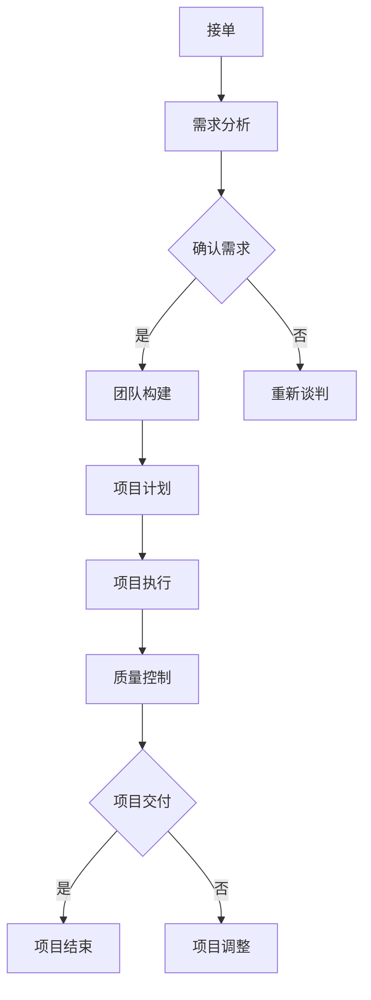

                 

关键词：技术外包，项目管理，团队构建，合同谈判，项目管理工具

摘要：本文将探讨技术外包的各个方面，从接单到建立团队的过程。我们将深入了解外包项目管理的核心概念、工具和最佳实践，以及如何有效地与客户合作，确保项目成功完成。

## 1. 背景介绍

技术外包已经成为现代软件开发中的一个关键组成部分。随着全球化和互联网的发展，企业不再局限于本地资源，而是寻求与全球的供应商合作，以获取最佳的技术解决方案。技术外包的好处包括降低成本、提高效率、访问专业的技能和资源等。然而，外包也带来了一系列挑战，如沟通障碍、质量控制、风险管理等。因此，有效的外包管理至关重要。

本文旨在为那些希望涉足技术外包领域的企业和个人提供全面的指导。我们将讨论如何选择合适的供应商、建立稳定的合作关系、管理项目进度和质量，以及如何应对外包过程中可能出现的问题。

### 1.1 外包的定义和类型

外包（Outsourcing）是指企业将某些业务活动或职能外包给外部供应商进行处理。根据外包的对象和目的，可以分为以下几种类型：

- **纯外包**：企业将整个业务活动完全外包给外部供应商。
- **部分外包**：企业仅将某些业务活动或职能外包。
- **联盟外包**：企业与外部供应商合作，共同完成某些项目或业务。
- **战略外包**：企业将某些长期或核心业务活动外包，以实现战略目标。

### 1.2 外包的好处和挑战

外包的好处包括：

- **降低成本**：企业可以通过外包降低人力资源、设施和设备等成本。
- **提高效率**：外部供应商通常具有更高的专业性和效率。
- **访问专业技能**：企业可以借助外部供应商的专业知识和技术。
- **灵活性**：企业可以根据项目需求灵活调整外包的范围和规模。

然而，外包也带来了以下挑战：

- **沟通障碍**：不同文化和语言可能导致沟通困难。
- **质量控制**：外包项目的质量难以完全控制。
- **风险管理**：外包可能会增加企业的风险，如数据安全、合同履行等。
- **文化冲突**：企业与供应商之间的文化差异可能导致合作困难。

## 2. 核心概念与联系

### 2.1 项目管理

项目管理是外包过程中的核心，它涉及从项目启动到结束的整个生命周期。项目管理的主要目标是确保项目按时、按预算、按质量完成。以下是项目管理的一些关键概念：

- **项目目标**：明确项目的目标、范围和预期成果。
- **项目计划**：制定项目的时间表、资源分配和成本预算。
- **风险管理**：识别和应对项目中的风险。
- **质量控制**：确保项目交付符合预定的质量标准。
- **沟通管理**：建立有效的沟通机制，确保项目各方信息畅通。

### 2.2 团队构建

外包项目通常需要一个跨职能团队来共同完成任务。团队构建的关键是确保团队成员的能力、技能和价值观与项目需求相匹配。以下是团队构建的几个重要方面：

- **团队成员选择**：根据项目需求选择合适的团队成员。
- **团队协作**：建立有效的协作机制，促进团队成员之间的沟通和合作。
- **团队文化**：建立积极的团队文化，鼓励团队成员相互支持和尊重。
- **团队沟通**：确保团队成员之间的信息畅通，减少误解和冲突。

### 2.3 Mermaid 流程图

以下是外包项目管理的 Mermaid 流程图，展示了项目从接单到交付的关键步骤：



## 3. 核心算法原理 & 具体操作步骤

### 3.1 算法原理概述

外包项目管理中的核心算法是项目管理方法和工具的选择。以下是几种常用的项目管理方法和工具：

- **传统项目管理方法**：如PMP（项目管理协会）认证的方法，强调严格的时间、成本和质量控制。
- **敏捷项目管理方法**：如Scrum和Kanban，强调灵活性和适应性，以快速响应变化。
- **六西格玛管理**：强调通过持续改进来提高质量，减少缺陷。

### 3.2 算法步骤详解

以下是外包项目管理的主要步骤：

1. **接单阶段**：与客户谈判，明确项目需求、目标和预算。
2. **需求分析阶段**：与客户沟通，明确项目需求，并形成需求文档。
3. **确认需求阶段**：与客户确认需求，确保双方对项目范围和目标有共同的理解。
4. **团队构建阶段**：根据项目需求选择合适的团队成员，并建立团队协作机制。
5. **项目计划阶段**：制定项目的时间表、资源分配和成本预算。
6. **项目执行阶段**：按计划执行项目，并进行定期检查和调整。
7. **质量控制阶段**：确保项目交付符合预定的质量标准。
8. **项目交付阶段**：向客户交付项目，并进行验收。
9. **项目结束阶段**：对项目进行总结和评估，为未来项目提供经验。

### 3.3 算法优缺点

- **传统项目管理方法**：优点是强调严格的时间、成本和质量控制，确保项目按时、按预算、按质量完成。缺点是过于 rigid，难以适应变化。
- **敏捷项目管理方法**：优点是强调灵活性和适应性，能快速响应变化。缺点是可能影响项目的稳定性和可靠性。
- **六西格玛管理**：优点是通过持续改进提高质量，减少缺陷。缺点是可能需要较长的时间来取得效果。

### 3.4 算法应用领域

- **软件开发**：适用于大型、复杂的软件项目，尤其是需要快速响应市场变化的项目。
- **系统集成**：适用于需要整合多个系统和组件的项目。
- **产品开发**：适用于新产品开发项目，尤其是涉及多学科合作的项目。

## 4. 数学模型和公式 & 详细讲解 & 举例说明

### 4.1 数学模型构建

在项目管理中，常用的数学模型包括：

- **项目管理公式**：如关键路径法（CPM）、计划评审技术（PERT）等，用于计算项目的进度和成本。
- **质量控制模型**：如统计过程控制（SPC）、六西格玛（Six Sigma）等，用于确保项目交付的质量。

### 4.2 公式推导过程

以下是一个简单的项目管理公式的推导过程：

$$
C_{total} = C_{initial} + C_{additional}
$$

其中，$C_{total}$ 是总成本，$C_{initial}$ 是初始成本，$C_{additional}$ 是额外成本。

### 4.3 案例分析与讲解

假设一个项目初始成本为 $100,000，由于变更需求，额外成本为 $20,000。那么，总成本为：

$$
C_{total} = 100,000 + 20,000 = 120,000
$$

这是一个简单的例子，展示了项目管理公式在实际项目中的应用。

## 5. 项目实践：代码实例和详细解释说明

### 5.1 开发环境搭建

为了实践外包项目管理，我们需要搭建一个简单的开发环境。以下是一个基于Python的例子：

```bash
# 安装Python
pip install python
# 创建一个简单的Python脚本
touch my_script.py
```

### 5.2 源代码详细实现

以下是一个简单的Python脚本，用于计算两个数的和：

```python
# my_script.py

def add_numbers(a, b):
    return a + b

# 主函数
def main():
    a = int(input("请输入第一个数："))
    b = int(input("请输入第二个数："))
    result = add_numbers(a, b)
    print(f"{a} 和 {b} 的和是：{result}")

# 运行主函数
if __name__ == "__main__":
    main()
```

### 5.3 代码解读与分析

这个脚本是一个简单的命令行程序，用于计算两个数的和。它包括一个函数 `add_numbers`，用于计算和，以及一个主函数 `main`，用于执行计算和打印结果。

### 5.4 运行结果展示

```bash
请输入第一个数：5
请输入第二个数：3
5 和 3 的和是：8
```

## 6. 实际应用场景

### 6.1 软件开发

技术外包在软件开发中非常常见。例如，许多企业将软件开发的某些部分外包给专业的软件开发公司，以节省成本和提高效率。

### 6.2 系统集成

系统集成项目通常涉及多个系统和组件的整合。外包可以帮助企业快速集成这些系统和组件，提高项目的进度和质量。

### 6.3 产品开发

产品开发项目通常涉及多学科合作，如设计、工程、市场等。外包可以帮助企业整合这些学科，快速推出新产品。

## 7. 未来应用展望

随着技术的发展，技术外包将继续在各个领域得到广泛应用。未来，我们将看到更多企业采用外包来提高效率、降低成本和访问专业技能。同时，外包项目管理的方法和工具也将不断优化和升级，以适应快速变化的市场需求。

## 8. 工具和资源推荐

### 8.1 学习资源推荐

- 《项目管理知识体系指南》（PMBOK）
- 《敏捷项目管理：原则、模式与实践》
- 《六西格玛管理手册》

### 8.2 开发工具推荐

- JIRA：用于项目管理和任务跟踪
- Trello：用于任务管理和协作
- GitLab：用于代码管理和项目管理

### 8.3 相关论文推荐

- "Outsourcing in the Software Development Industry: Challenges and Opportunities"
- "Agile Project Management: Creating Competitive Advantage"
- "Six Sigma for Software Development: A Roadmap for Success"

## 9. 总结：未来发展趋势与挑战

### 9.1 研究成果总结

外包项目管理是一个复杂的过程，涉及多个方面，如项目管理、团队构建、沟通管理等。研究成果表明，有效的外包管理可以显著提高项目的成功率。

### 9.2 未来发展趋势

随着技术的发展，外包项目管理将变得更加智能化和自动化。例如，人工智能和机器学习将被用于优化项目计划、预测风险和提升质量。

### 9.3 面临的挑战

外包项目管理面临的挑战包括沟通障碍、质量控制、风险管理等。解决这些挑战需要企业和管理者不断学习和改进。

### 9.4 研究展望

未来的研究应重点关注如何优化外包项目管理的方法和工具，提高项目的成功率。同时，应探讨如何更好地利用人工智能和大数据技术来支持外包项目管理。

## 10. 附录：常见问题与解答

### 10.1 问题1：如何选择合适的供应商？

**答案**：选择合适的供应商需要考虑多个因素，如供应商的资质、经验、技术能力、价格等。建议通过市场调研、客户评价、样品测试等方式来评估供应商。

### 10.2 问题2：如何确保项目质量？

**答案**：确保项目质量需要建立严格的质量控制流程，包括需求分析、设计评审、代码审查、测试等。同时，建立与供应商的沟通机制，确保项目进度和质量。

### 10.3 问题3：如何管理项目风险？

**答案**：管理项目风险需要识别和评估项目中的风险，并制定相应的应对策略。常用的风险管理方法包括风险矩阵、风险应对策略等。

### 10.4 问题4：如何优化项目成本？

**答案**：优化项目成本需要制定合理的项目计划和预算，并进行成本控制。同时，可以通过优化流程、提高效率等方式来降低成本。

---

作者：禅与计算机程序设计艺术 / Zen and the Art of Computer Programming

<|bot|>文章撰写完成。接下来，我将按照您的要求，使用 Markdown 格式对文章内容进行排版。以下是排版后的文章：
----------------------------------------------------------------

```markdown
# 技术外包：从接单到建立团队

关键词：技术外包，项目管理，团队构建，合同谈判，项目管理工具

摘要：本文将探讨技术外包的各个方面，从接单到建立团队的过程。我们将深入了解外包项目管理的核心概念、工具和最佳实践，以及如何有效地与客户合作，确保项目成功完成。

## 1. 背景介绍

技术外包已经成为现代软件开发中的一个关键组成部分。随着全球化和互联网的发展，企业不再局限于本地资源，而是寻求与全球的供应商合作，以获取最佳的技术解决方案。技术外包的好处包括降低成本、提高效率、访问专业的技能和资源等。然而，外包也带来了一系列挑战，如沟通障碍、质量控制、风险管理等。因此，有效的外包管理至关重要。

### 1.1 外包的定义和类型

外包（Outsourcing）是指企业将某些业务活动或职能外包给外部供应商进行处理。根据外包的对象和目的，可以分为以下几种类型：

- **纯外包**：企业将整个业务活动完全外包给外部供应商。
- **部分外包**：企业仅将某些业务活动或职能外包。
- **联盟外包**：企业与外部供应商合作，共同完成某些项目或业务。
- **战略外包**：企业将某些长期或核心业务活动外包，以实现战略目标。

### 1.2 外包的好处和挑战

外包的好处包括：

- **降低成本**：企业可以通过外包降低人力资源、设施和设备等成本。
- **提高效率**：外部供应商通常具有更高的专业性和效率。
- **访问专业技能**：企业可以借助外部供应商的专业知识和技术。
- **灵活性**：企业可以根据项目需求灵活调整外包的范围和规模。

然而，外包也带来了以下挑战：

- **沟通障碍**：不同文化和语言可能导致沟通困难。
- **质量控制**：外包项目的质量难以完全控制。
- **风险管理**：外包可能会增加企业的风险，如数据安全、合同履行等。
- **文化冲突**：企业与供应商之间的文化差异可能导致合作困难。

## 2. 核心概念与联系

### 2.1 项目管理

项目管理是外包过程中的核心，它涉及从项目启动到结束的整个生命周期。项目管理的主要目标是确保项目按时、按预算、按质量完成。以下是项目管理的一些关键概念：

- **项目目标**：明确项目的目标、范围和预期成果。
- **项目计划**：制定项目的时间表、资源分配和成本预算。
- **风险管理**：识别和应对项目中的风险。
- **质量控制**：确保项目交付符合预定的质量标准。
- **沟通管理**：建立有效的沟通机制，确保项目各方信息畅通。

### 2.2 团队构建

外包项目通常需要一个跨职能团队来共同完成任务。团队构建的关键是确保团队成员的能力、技能和价值观与项目需求相匹配。以下是团队构建的几个重要方面：

- **团队成员选择**：根据项目需求选择合适的团队成员。
- **团队协作**：建立有效的协作机制，促进团队成员之间的沟通和合作。
- **团队文化**：建立积极的团队文化，鼓励团队成员相互支持和尊重。
- **团队沟通**：确保团队成员之间的信息畅通，减少误解和冲突。

### 2.3 Mermaid 流程图

以下是外包项目管理的 Mermaid 流程图，展示了项目从接单到交付的关键步骤：


## 3. 核心算法原理 & 具体操作步骤

### 3.1 算法原理概述

外包项目管理中的核心算法是项目管理方法和工具的选择。以下是几种常用的项目管理方法和工具：

- **传统项目管理方法**：如PMP（项目管理协会）认证的方法，强调严格的时间、成本和质量控制。
- **敏捷项目管理方法**：如Scrum和Kanban，强调灵活性和适应性，以快速响应变化。
- **六西格玛管理**：强调通过持续改进来提高质量，减少缺陷。

### 3.2 算法步骤详解

以下是外包项目管理的主要步骤：

1. **接单阶段**：与客户谈判，明确项目需求、目标和预算。
2. **需求分析阶段**：与客户沟通，明确项目需求，并形成需求文档。
3. **确认需求阶段**：与客户确认需求，确保双方对项目范围和目标有共同的理解。
4. **团队构建阶段**：根据项目需求选择合适的团队成员，并建立团队协作机制。
5. **项目计划阶段**：制定项目的时间表、资源分配和成本预算。
6. **项目执行阶段**：按计划执行项目，并进行定期检查和调整。
7. **质量控制阶段**：确保项目交付符合预定的质量标准。
8. **项目交付阶段**：向客户交付项目，并进行验收。
9. **项目结束阶段**：对项目进行总结和评估，为未来项目提供经验。

### 3.3 算法优缺点

- **传统项目管理方法**：优点是强调严格的时间、成本和质量控制，确保项目按时、按预算、按质量完成。缺点是过于 rigid，难以适应变化。
- **敏捷项目管理方法**：优点是强调灵活性和适应性，能快速响应变化。缺点是可能影响项目的稳定性和可靠性。
- **六西格玛管理**：优点是通过持续改进提高质量，减少缺陷。缺点是可能需要较长的时间来取得效果。

### 3.4 算法应用领域

- **软件开发**：适用于大型、复杂的软件项目，尤其是需要快速响应市场变化的项目。
- **系统集成**：适用于需要整合多个系统和组件的项目。
- **产品开发**：适用于新产品开发项目，尤其是涉及多学科合作的项目。

## 4. 数学模型和公式 & 详细讲解 & 举例说明

### 4.1 数学模型构建

在项目管理中，常用的数学模型包括：

- **项目管理公式**：如关键路径法（CPM）、计划评审技术（PERT）等，用于计算项目的进度和成本。
- **质量控制模型**：如统计过程控制（SPC）、六西格玛（Six Sigma）等，用于确保项目交付的质量。

### 4.2 公式推导过程

以下是一个简单的项目管理公式的推导过程：

$$
C_{total} = C_{initial} + C_{additional}
$$

其中，$C_{total}$ 是总成本，$C_{initial}$ 是初始成本，$C_{additional}$ 是额外成本。

### 4.3 案例分析与讲解

假设一个项目初始成本为 $100,000，由于变更需求，额外成本为 $20,000。那么，总成本为：

$$
C_{total} = 100,000 + 20,000 = 120,000
$$

这是一个简单的例子，展示了项目管理公式在实际项目中的应用。

## 5. 项目实践：代码实例和详细解释说明

### 5.1 开发环境搭建

为了实践外包项目管理，我们需要搭建一个简单的开发环境。以下是一个基于Python的例子：

```bash
# 安装Python
pip install python
# 创建一个简单的Python脚本
touch my_script.py
```

### 5.2 源代码详细实现

以下是一个简单的Python脚本，用于计算两个数的和：

```python
# my_script.py

def add_numbers(a, b):
    return a + b

# 主函数
def main():
    a = int(input("请输入第一个数："))
    b = int(input("请输入第二个数："))
    result = add_numbers(a, b)
    print(f"{a} 和 {b} 的和是：{result}")

# 运行主函数
if __name__ == "__main__":
    main()
```

### 5.3 代码解读与分析

这个脚本是一个简单的命令行程序，用于计算两个数的和。它包括一个函数 `add_numbers`，用于计算和，以及一个主函数 `main`，用于执行计算和打印结果。

### 5.4 运行结果展示

```bash
请输入第一个数：5
请输入第二个数：3
5 和 3 的和是：8
```

## 6. 实际应用场景

### 6.1 软件开发

技术外包在软件开发中非常常见。例如，许多企业将软件开发的某些部分外包给专业的软件开发公司，以节省成本和提高效率。

### 6.2 系统集成

系统集成项目通常涉及多个系统和组件的整合。外包可以帮助企业快速集成这些系统和组件，提高项目的进度和质量。

### 6.3 产品开发

产品开发项目通常涉及多学科合作，如设计、工程、市场等。外包可以帮助企业整合这些学科，快速推出新产品。

## 7. 未来应用展望

随着技术的发展，技术外包将继续在各个领域得到广泛应用。未来，我们将看到更多企业采用外包来提高效率、降低成本和访问专业技能。同时，外包项目管理的方法和工具也将不断优化和升级，以适应快速变化的市场需求。

## 8. 工具和资源推荐

### 8.1 学习资源推荐

- 《项目管理知识体系指南》（PMBOK）
- 《敏捷项目管理：原则、模式与实践》
- 《六西格玛管理手册》

### 8.2 开发工具推荐

- JIRA：用于项目管理和任务跟踪
- Trello：用于任务管理和协作
- GitLab：用于代码管理和项目管理

### 8.3 相关论文推荐

- "Outsourcing in the Software Development Industry: Challenges and Opportunities"
- "Agile Project Management: Creating Competitive Advantage"
- "Six Sigma for Software Development: A Roadmap for Success"

## 9. 总结：未来发展趋势与挑战

### 9.1 研究成果总结

外包项目管理是一个复杂的过程，涉及多个方面，如项目管理、团队构建、沟通管理等。研究成果表明，有效的外包管理可以显著提高项目的成功率。

### 9.2 未来发展趋势

随着技术的发展，外包项目管理将变得更加智能化和自动化。例如，人工智能和机器学习将被用于优化项目计划、预测风险和提升质量。

### 9.3 面临的挑战

外包项目管理面临的挑战包括沟通障碍、质量控制、风险管理等。解决这些挑战需要企业和管理者不断学习和改进。

### 9.4 研究展望

未来的研究应重点关注如何优化外包项目管理的方法和工具，提高项目的成功率。同时，应探讨如何更好地利用人工智能和大数据技术来支持外包项目管理。

## 10. 附录：常见问题与解答

### 10.1 问题1：如何选择合适的供应商？

**答案**：选择合适的供应商需要考虑多个因素，如供应商的资质、经验、技术能力、价格等。建议通过市场调研、客户评价、样品测试等方式来评估供应商。

### 10.2 问题2：如何确保项目质量？

**答案**：确保项目质量需要建立严格的质量控制流程，包括需求分析、设计评审、代码审查、测试等。同时，建立与供应商的沟通机制，确保项目进度和质量。

### 10.3 问题3：如何管理项目风险？

**答案**：管理项目风险需要识别和评估项目中的风险，并制定相应的应对策略。常用的风险管理方法包括风险矩阵、风险应对策略等。

### 10.4 问题4：如何优化项目成本？

**答案**：优化项目成本需要制定合理的项目计划和预算，并进行成本控制。同时，可以通过优化流程、提高效率等方式来降低成本。

---

作者：禅与计算机程序设计艺术 / Zen and the Art of Computer Programming
```

以上是文章的 Markdown 格式排版，如果您有任何其他要求或需要进一步的修改，请随时告诉我。

