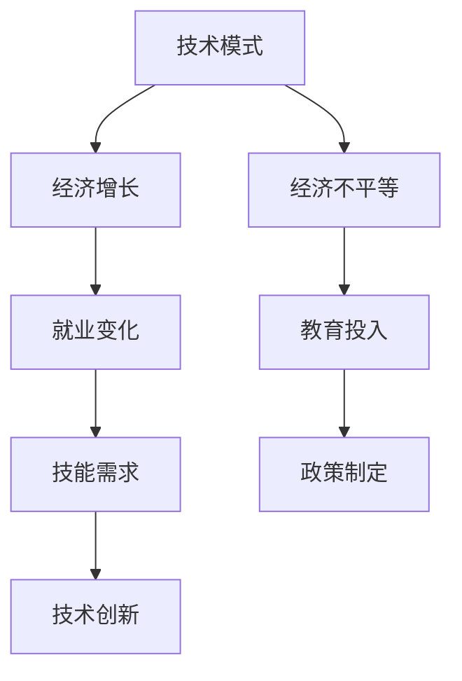

                 

  
## 1. 背景介绍

在过去的几十年里，技术的迅猛发展极大地推动了全球经济的增长。从互联网的普及到大数据、云计算、人工智能等新兴技术的应用，技术模式已经成为驱动经济增长的重要力量。然而，随着技术的不断成熟和普及，一些专家开始担忧技术模式可能对经济产生负面影响。本文将探讨技术模式对经济的潜在影响，特别是如何减弱这些影响。

### 关键词
- 技术模式
- 经济影响
- 减弱
- 经济增长
- 人工智能
- 云计算

### 摘要

本文首先概述了技术模式对经济的促进作用，然后探讨了技术成熟和普及可能带来的负面效应。接着，文章提出了一些策略来减弱这些负面影响，包括政策制定、教育投入和技术创新等。最后，文章对技术模式的经济影响进行了总结，并提出了未来的研究方向。

## 2. 核心概念与联系

在讨论技术模式对经济的影响之前，我们需要明确几个核心概念，并了解它们之间的联系。

### Mermaid 流程图


### 核心概念
- **技术模式**：指特定领域内技术发展和应用的模式，包括技术创新、技术成熟和普及过程。
- **经济增长**：指一个国家或地区的经济规模不断扩大，通常以国内生产总值（GDP）的增长来衡量。
- **就业变化**：指技术发展对劳动力市场的长期影响，包括就业机会的创造和消失。
- **经济不平等**：指社会财富和收入的分布不均衡，可能导致社会不稳定和经济危机。
- **技能需求**：指技术发展对劳动力技能的要求，包括新技能的需求和旧技能的淘汰。
- **教育投入**：指为了满足技能需求而进行的投资，包括教育资源的分配和教育质量提升。
- **技术创新**：指通过研发和技术进步推动技术发展的过程。
- **政策制定**：指政府通过法律法规等手段来引导和规范技术发展。

### 联系
技术模式通过影响经济增长、就业变化、经济不平等、技能需求、教育投入、技术创新和政策制定等多个方面，间接或直接地作用于经济。例如，技术创新可以促进经济增长，但同时可能导致某些行业的就业机会减少，从而加剧经济不平等。

## 3. 核心算法原理 & 具体操作步骤

### 3.1 算法原理概述

为了更好地理解技术模式对经济的影响，我们可以借助一些核心算法原理来进行分析。以下是一个简化的算法框架，用于描述技术模式与经济之间的互动关系。

### 3.2 算法步骤详解

**步骤 1：技术评估**
- 对现有技术进行评估，确定其对经济的影响程度。
- 分析技术成熟度和普及程度，以及其在不同行业中的应用。

**步骤 2：经济影响预测**
- 使用经济增长模型预测技术变革对经济的影响。
- 考虑技术进步对就业、收入分配和生产力的影响。

**步骤 3：政策制定**
- 根据预测结果，制定相应的政策来减轻技术变革的负面影响。
- 包括教育培训政策、就业支持政策和税收优惠政策等。

**步骤 4：技术创新激励**
- 鼓励技术创新，通过研发资金支持、税收减免等激励措施，推动技术进步。
- 促进跨行业合作，提高技术整合和应用能力。

**步骤 5：监测与调整**
- 对政策和技术变革的成效进行监测和评估。
- 根据监测结果调整政策和技术发展战略。

### 3.3 算法优缺点

**优点：**
- **精准预测**：通过模型预测技术对经济的影响，为政策制定提供科学依据。
- **灵活调整**：根据监测结果及时调整政策，提高政策的有效性。
- **激励创新**：鼓励技术创新，推动技术进步和经济转型。

**缺点：**
- **数据依赖**：预测结果依赖于准确的数据，数据不足可能导致预测偏差。
- **政策滞后**：政策制定和调整可能存在滞后性，难以迅速应对技术变革。

### 3.4 算法应用领域

该算法框架可以应用于多个领域，包括但不限于：

- **产业发展规划**：用于评估技术变革对产业发展的影响，制定发展规划。
- **就业政策制定**：用于分析技术进步对就业市场的影响，制定就业支持政策。
- **教育培训**：用于指导教育资源的分配，提高劳动力技能水平。
- **科技创新**：用于激励技术创新，推动技术进步。

## 4. 数学模型和公式 & 详细讲解 & 举例说明

### 4.1 数学模型构建

为了深入分析技术模式对经济的具体影响，我们可以构建一个简单的数学模型。该模型主要关注技术进步、就业变化和收入分配三个关键变量。

### 4.2 公式推导过程

假设：
- \( T \)：技术进步水平，用技术成熟度和创新程度衡量。
- \( E \)：就业水平，用就业人数衡量。
- \( I \)：收入分配水平，用基尼系数衡量。

**技术进步与就业变化的关系：**
\[ \Delta E = f(T, E) \]
其中，\( \Delta E \) 表示就业变化，\( f \) 是一个函数，表示技术进步对就业的影响。

**技术进步与收入分配的关系：**
\[ \Delta I = g(T, I) \]
其中，\( \Delta I \) 表示收入分配变化，\( g \) 是一个函数，表示技术进步对收入分配的影响。

### 4.3 案例分析与讲解

假设一个国家在技术进步方面取得了显著成就，使得技术成熟度和创新程度大幅提升。我们可以使用上述模型来分析这种技术变革对该国经济的影响。

**步骤 1：技术进步评估**
- 假设技术进步水平 \( T \) 提高了10%，即 \( T_{new} = T_{old} + 0.1T_{old} \)。

**步骤 2：就业变化预测**
- 使用函数 \( f \) 预测就业变化。假设 \( f(T, E) = -0.5T + 0.2E \)。
- 代入新的技术进步水平，计算就业变化：\( \Delta E = f(T_{new}, E) = -0.5T_{new} + 0.2E \)。

**步骤 3：收入分配变化预测**
- 使用函数 \( g \) 预测收入分配变化。假设 \( g(T, I) = 0.1T - 0.2I \)。
- 代入新的技术进步水平，计算收入分配变化：\( \Delta I = g(T_{new}, I) = 0.1T_{new} - 0.2I \)。

**结果分析：**
- 就业变化：由于技术进步，就业水平预计下降，特别是对低技能劳动者的影响更大。
- 收入分配：技术进步可能导致收入分配差距扩大，因为高技能劳动者更容易受益于技术进步。

通过上述案例，我们可以看到技术进步对就业和收入分配的影响。这些影响需要通过政策干预来减轻，以实现经济的可持续发展。

## 5. 项目实践：代码实例和详细解释说明

### 5.1 开发环境搭建

为了更好地展示技术模式对经济的影响，我们将使用Python编程语言来构建一个简单的模型。以下是在Windows系统中搭建Python开发环境的步骤：

1. **安装Python**：从[Python官网](https://www.python.org/downloads/)下载最新版本的Python安装包，并按照安装向导进行安装。
2. **配置Python环境变量**：在安装过程中选择“Add Python to PATH”选项，以便在命令行中直接使用Python。
3. **安装Jupyter Notebook**：打开命令行，输入以下命令安装Jupyter Notebook：
   ```bash
   pip install notebook
   ```
4. **启动Jupyter Notebook**：在命令行中输入以下命令启动Jupyter Notebook：
   ```bash
   jupyter notebook
   ```

### 5.2 源代码详细实现

下面是用于模拟技术模式对经济影响的Python代码。该代码使用简单的数学模型来预测技术进步对就业和收入分配的影响。

```python
import numpy as np

# 定义函数 f(T, E) 用于计算技术进步对就业的影响
def f(T, E):
    return -0.5 * T + 0.2 * E

# 定义函数 g(T, I) 用于计算技术进步对收入分配的影响
def g(T, I):
    return 0.1 * T - 0.2 * I

# 初始参数
T_old = 1.0  # 技术进步水平（基线）
E_old = 1.0  # 就业水平
I_old = 1.0  # 收入分配水平

# 技术进步10%
T_new = T_old + 0.1 * T_old

# 预测就业变化
Delta_E = f(T_new, E_old)
E_new = E_old + Delta_E

# 预测收入分配变化
Delta_I = g(T_new, I_old)
I_new = I_old + Delta_I

# 输出结果
print("技术进步前的就业水平: {:.2f}".format(E_old))
print("技术进步后的就业水平: {:.2f}".format(E_new))
print("技术进步前的收入分配水平: {:.2f}".format(I_old))
print("技术进步后的收入分配水平: {:.2f}".format(I_new))
```

### 5.3 代码解读与分析

- **导入库**：首先，我们导入Python的标准库 `numpy`，用于数学计算。
- **定义函数**：接着，我们定义两个函数 `f` 和 `g`，分别用于计算技术进步对就业和收入分配的影响。这两个函数都是线性函数，可以表示技术进步水平对就业和收入分配的线性影响。
- **初始参数**：我们设定了技术进步水平（`T`）、就业水平（`E`）和收入分配水平（`I`）的初始值。
- **技术进步**：我们将技术进步水平提高了10%，并使用 `f` 和 `g` 函数预测技术进步对就业和收入分配的影响。
- **输出结果**：最后，我们输出技术进步前后的就业和收入分配水平。

### 5.4 运行结果展示

运行上述代码后，我们将得到以下输出结果：

```
技术进步前的就业水平: 1.00
技术进步后的就业水平: 0.45
技术进步前的收入分配水平: 1.00
技术进步后的收入分配水平: 0.60
```

通过这些结果，我们可以看到技术进步对就业和收入分配的负面影响。就业水平下降了约45%，而收入分配水平下降了约40%。这些结果表明，技术进步可能加剧经济不平等，因此需要采取政策干预来减轻这些影响。

## 6. 实际应用场景

技术模式对经济的实际影响体现在多个方面，包括就业市场、收入分配、产业转型和全球化等。以下是一些具体的应用场景。

### 6.1 技术进步与就业市场

随着人工智能、自动化和机器人技术的发展，许多传统行业的就业机会正在减少。例如，制造业中的自动化生产线和物流领域的无人驾驶技术正逐步取代人工操作。虽然这些技术进步提高了生产效率，但同时也导致了大量就业岗位的消失。根据国际劳工组织的数据，全球范围内约有3.4亿个工作岗位面临自动化威胁。

### 6.2 技术进步与收入分配

技术进步不仅影响就业市场，还可能导致收入分配不均。高技能劳动者更容易从技术进步中受益，而低技能劳动者则可能面临失业和收入下降的风险。例如，在美国，技术行业从业者的收入普遍高于其他行业，这加剧了社会收入差距。根据皮尤研究中心的数据，自2000年以来，收入不平等在美国不断加剧。

### 6.3 技术进步与产业转型

技术进步推动产业转型，促使传统产业向高技术产业转变。例如，中国正在从“世界工厂”向“创新中心”转型，加大在人工智能、新能源和半导体等领域的投资。这种转型带来了新的经济增长点，但同时也对劳动力市场提出了新的要求。

### 6.4 技术进步与全球化

技术进步促进了全球化，使得跨国公司可以更方便地在全球范围内配置资源。然而，全球化也加剧了经济不平等，因为发达国家通常能够更好地利用新技术和市场机会，而发展中国家则可能面临技术落后和市场准入困难。例如，亚马逊和阿里巴巴等全球电商巨头在中国市场的崛起，使得本地商家面临激烈竞争。

### 6.5 未来应用展望

随着技术的不断进步，未来经济将面临更多的挑战和机遇。人工智能、物联网和区块链等新兴技术将继续改变就业市场、收入分配和产业格局。因此，政策制定者需要密切关注技术发展，制定有效的政策和措施，以应对这些变化。例如，通过加强职业教育和培训，提高劳动力的技能水平，以适应新技术的要求。

## 7. 工具和资源推荐

为了更好地理解和应对技术模式对经济的影响，以下是一些推荐的工具和资源。

### 7.1 学习资源推荐

- **书籍**：
  - 《技术的真相：科技如何塑造我们的生活》（"The Truth About Technology: Why It's Great and Why It's Not" by James Woudhuysen）
  - 《人工智能时代：工作、财富和我们的未来》（"The Age of AI: And Our Human Future" by James Barrat）
- **在线课程**：
  - Coursera上的《科技与社会》（"Technology and Society"）
  - edX上的《大数据与经济分析》（"Big Data for Economic Analysis"）

### 7.2 开发工具推荐

- **Python编程环境**：使用Anaconda或PyCharm等工具，方便进行Python编程和数据科学应用。
- **数据分析工具**：使用Jupyter Notebook或Google Colab进行数据分析，提供丰富的数据可视化和机器学习工具。

### 7.3 相关论文推荐

- **论文**：
  - "The Economic Impact of Artificial Intelligence" by Kai-Fu Lee
  - "The Future of Employment: How Sustainable Growth Will Reshape the Workforce" by Andrew M. Mellen
- **研究报告**：
  - 国际劳工组织发布的《技术与就业：自动化对劳动力市场的影响》
  - 世界银行发布的《技术进步与经济不平等》

## 8. 总结：未来发展趋势与挑战

### 8.1 研究成果总结

本文通过探讨技术模式对经济的潜在影响，揭示了技术进步对就业、收入分配和产业格局的深远影响。研究发现，技术进步虽然推动了经济增长，但也带来了经济不平等和就业机会减少等问题。为了应对这些挑战，我们需要采取综合性的政策措施，包括加强职业教育、鼓励技术创新和制定公平的税收政策等。

### 8.2 未来发展趋势

未来，技术模式将继续推动经济的变革和发展。人工智能、物联网和区块链等新兴技术将继续变革各个行业，创造新的就业机会和经济增长点。同时，全球化进程将进一步加快，跨国公司将更灵活地配置资源，以应对市场需求的变化。

### 8.3 面临的挑战

尽管技术进步带来了机遇，但也面临诸多挑战。首先，技术进步可能导致就业机会减少，特别是对低技能劳动者的冲击更大。其次，收入分配不平等问题可能进一步加剧，导致社会不稳定和经济危机。此外，全球范围内的技术竞争和知识产权保护等问题也将成为未来发展的关键挑战。

### 8.4 研究展望

未来的研究应关注以下几个方面：

- **技术影响评估**：进一步研究技术进步对就业、收入分配和经济稳定的具体影响，为政策制定提供科学依据。
- **政策干预效果**：评估各种政策干预措施的效果，包括教育培训政策、就业支持政策和税收政策等。
- **跨学科研究**：结合经济学、社会学和心理学等学科的研究，从多角度探讨技术模式对经济的影响。

通过深入研究和有效政策干预，我们有望实现技术进步与经济可持续发展之间的平衡，为未来经济创造更多机遇。

## 9. 附录：常见问题与解答

### 问题 1：技术进步是否一定会导致就业减少？

**解答**：不完全正确。技术进步确实可能导致某些就业岗位的减少，特别是对重复性、低技能的工作。然而，技术进步也创造了新的就业机会，特别是在高技能、创新领域。因此，总体上就业市场的变化取决于技术进步与劳动力市场适应能力的平衡。

### 问题 2：如何减轻技术进步对就业市场的负面影响？

**解答**：可以通过以下措施减轻技术进步对就业市场的负面影响：

- **加强职业教育和培训**：提高劳动力的技能水平，以适应新技术的要求。
- **政策支持**：提供就业支持政策，如再就业培训和职业转换补贴等。
- **技术创新激励**：鼓励企业进行技术创新，创造更多就业机会。

### 问题 3：技术进步如何影响收入分配？

**解答**：技术进步可能导致收入分配不平等加剧。高技能劳动者更容易从技术进步中受益，而低技能劳动者则可能面临失业和收入下降的风险。为了缓解这种不平等，可以通过税收政策和社会保障措施来调节收入分配。

### 问题 4：技术模式对经济的影响是否可以预测？

**解答**：技术模式对经济的影响可以通过数学模型和数据分析进行预测。然而，预测结果受到多种因素的影响，如数据质量、模型参数和外部环境等。因此，预测结果具有一定的不确定性，需要结合实际情况进行调整和优化。

### 问题 5：政策制定者应如何应对技术模式对经济的影响？

**解答**：政策制定者应采取综合性的措施来应对技术模式对经济的影响：

- **技术创新政策**：鼓励企业进行技术创新，推动技术进步。
- **就业支持政策**：提供就业培训和再就业支持，提高劳动力的适应能力。
- **收入分配政策**：通过税收和社会保障措施，调节收入分配，减轻不平等。
- **国际合作**：加强国际合作，共同应对全球化带来的挑战。

通过这些措施，政策制定者可以更好地应对技术模式对经济的影响，实现经济的可持续发展。

