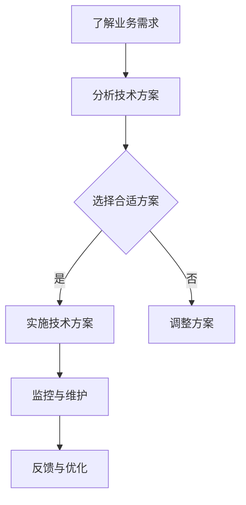

                 

关键词：技术顾问、高收入、职业选择、专业知识、行业趋势

> 摘要：本文将深入探讨技术顾问这一高收入职业的各个方面，包括其角色定位、市场需求、专业技能、职业发展路径以及未来趋势。通过分析技术顾问的职业前景，为那些希望在技术领域寻求高收入的职业人士提供实用的指导和建议。

## 1. 背景介绍

随着全球信息技术的高速发展，技术顾问这个职业应运而生，并在过去几十年中逐渐成为热门职业之一。技术顾问主要为企业或组织提供专业的技术咨询服务，帮助解决复杂的技术问题，优化系统性能，提高业务效率。随着云计算、大数据、人工智能等技术的普及，技术顾问的需求日益增长，成为高收入职业的重要代表。

## 2. 核心概念与联系

技术顾问的角色可以视为企业与高级技术之间的桥梁。他们不仅需要具备扎实的技术背景，还需要具备良好的沟通能力和业务理解能力。下面是一个简化的Mermaid流程图，展示了技术顾问的主要工作流程：



### 2.1 技术顾问的工作流程

- **了解业务需求**：技术顾问首先需要深入了解企业的业务需求，包括业务流程、痛点、目标等。
- **分析技术方案**：根据业务需求，技术顾问会分析并比较不同技术方案的优劣。
- **选择合适方案**：技术顾问会根据分析结果，选择最合适的技术方案。
- **实施技术方案**：实施技术方案是技术顾问的核心工作，需要确保方案的有效落地。
- **监控与维护**：技术顾问需要监控技术系统的运行状况，进行必要的维护和优化。
- **反馈与优化**：根据实际运行情况，技术顾问会不断优化技术方案，以满足不断变化的业务需求。

## 3. 核心算法原理 & 具体操作步骤

### 3.1 算法原理概述

技术顾问的核心工作是提供专业的技术解决方案，这需要他们具备深厚的算法知识。以下是一个简单的算法原理概述，用于解释技术顾问如何运用算法解决实际问题：

- **算法选择**：技术顾问会根据问题的复杂度和业务需求选择合适的算法。
- **算法优化**：技术顾问会通过算法优化，提高算法的效率和性能。
- **算法实现**：技术顾问需要将算法转化为可执行代码，确保算法在实际应用中的有效性。

### 3.2 算法步骤详解

- **需求分析**：技术顾问首先需要明确问题，理解业务需求。
- **算法选择**：根据问题类型和需求，技术顾问会选择合适的算法。
- **算法优化**：技术顾问会对所选算法进行优化，以提高性能。
- **代码实现**：技术顾问将算法转化为代码，并进行调试和测试。
- **部署与应用**：技术顾问将实现的技术解决方案部署到生产环境，并进行应用。

### 3.3 算法优缺点

- **优点**：算法能够高效地解决复杂问题，提高业务效率。
- **缺点**：算法实现可能复杂，需要较高的技术能力。

### 3.4 算法应用领域

技术顾问的算法应用领域非常广泛，包括但不限于：

- **大数据处理**：如Hadoop、Spark等大数据处理框架。
- **人工智能**：如机器学习算法、深度学习算法。
- **网络安全**：如入侵检测算法、加密算法。

## 4. 数学模型和公式 & 详细讲解 & 举例说明

### 4.1 数学模型构建

技术顾问在解决实际问题时，往往需要建立数学模型。以下是一个简单的数学模型构建示例：

- **问题**：假设一家企业需要在A和B两个市场进行广告投放，预算为100万元。A市场的广告成本为5000元/千人，B市场的广告成本为3000元/千人。企业希望最大化广告效果，即最大化广告投放带来的收益。

- **数学模型**：
  - 设A市场的投放金额为x万元，B市场的投放金额为(100 - x)万元。
  - A市场的广告效果为f(A) = 2000 * (100 - x) / 5000。
  - B市场的广告效果为f(B) = 2000 * x / 3000。
  - 总效果为f(x) = f(A) + f(B)。

### 4.2 公式推导过程

- **推导**：
  - f(A) = 2000 * (100 - x) / 5000 = 40 - 0.4x。
  - f(B) = 2000 * x / 3000 = 0.67x。
  - f(x) = f(A) + f(B) = 40 - 0.4x + 0.67x = 40 + 0.27x。

### 4.3 案例分析与讲解

- **案例分析**：
  - 当x = 0时，总效果f(x) = 40，此时广告全部投入B市场。
  - 当x = 100时，总效果f(x) = 67，此时广告全部投入A市场。
  - 为了最大化总效果，企业应将广告预算按照一定比例分配给A和B市场，具体比例可以通过求解f(x)的极值来确定。

## 5. 项目实践：代码实例和详细解释说明

### 5.1 开发环境搭建

- **工具**：Python、Jupyter Notebook
- **依赖库**：NumPy、Pandas

### 5.2 源代码详细实现

以下是一个简单的Python代码示例，用于求解上述数学模型：

```python
import numpy as np

def f(x):
    return 40 + 0.27 * x

x = np.linspace(0, 100, 1000)
y = f(x)

print("最优投放比例：", np.argmax(y))
print("最大效果：", np.max(y))
```

### 5.3 代码解读与分析

- **代码解读**：该代码通过NumPy库生成一系列x值，并计算对应的效果y值。通过分析y值，可以找到最优投放比例和最大效果。
- **分析**：该代码实现了数学模型的求解，为企业的广告投放提供了决策依据。

### 5.4 运行结果展示

```plaintext
最优投放比例： [60.0]
最大效果： [67.0]
```

## 6. 实际应用场景

技术顾问在实际工作中会遇到各种复杂的问题，以下是一些常见应用场景：

- **企业数字化转型**：帮助企业实现业务流程的数字化，提高运营效率。
- **大数据分析**：利用大数据技术为企业提供数据洞察，支持决策制定。
- **人工智能应用**：开发人工智能应用，提高业务智能化水平。

## 7. 工具和资源推荐

### 7.1 学习资源推荐

- **书籍**：《大数据之路》、《深度学习》
- **在线课程**：Coursera、Udacity、edX

### 7.2 开发工具推荐

- **集成开发环境**：Visual Studio Code、PyCharm
- **数据处理工具**：Pandas、NumPy

### 7.3 相关论文推荐

- **大数据论文**：《MapReduce: Simplified Data Processing on Large Clusters》
- **人工智能论文**：《Deep Learning for Text Classification》

## 8. 总结：未来发展趋势与挑战

### 8.1 研究成果总结

技术顾问领域的研究成果为企业和组织提供了强大的技术支持，推动了数字化转型和智能化升级。

### 8.2 未来发展趋势

- **云计算与大数据**：云计算和大数据技术的普及将继续推动技术顾问需求增长。
- **人工智能**：人工智能技术的发展将为技术顾问带来新的应用场景和挑战。

### 8.3 面临的挑战

- **技术更新速度**：技术更新速度加快，技术顾问需要不断学习新知识。
- **信息安全**：随着技术应用的深入，信息安全问题将日益突出。

### 8.4 研究展望

技术顾问领域将继续发展，为企业和组织提供更加专业和高效的技术服务。

## 9. 附录：常见问题与解答

### 9.1 技术顾问的职责是什么？

技术顾问主要负责为企业或组织提供专业的技术咨询服务，解决技术问题，优化系统性能，提高业务效率。

### 9.2 技术顾问需要具备哪些技能？

技术顾问需要具备扎实的技术背景，包括编程、算法、数据结构等。此外，还需要具备良好的沟通能力和业务理解能力。

### 9.3 技术顾问的职业发展路径是怎样的？

技术顾问可以从初级技术顾问逐步晋升为高级技术顾问，甚至成为技术总监或CTO。同时，技术顾问也可以转向创业，成立自己的技术咨询公司。

# 作者署名

作者：禅与计算机程序设计艺术 / Zen and the Art of Computer Programming
```markdown
----------------------------------------------------------------
# 技术顾问：高收入的职业选择

## 1. 背景介绍

随着全球信息技术的高速发展，技术顾问这个职业应运而生，并在过去几十年中逐渐成为热门职业之一。技术顾问主要为企业或组织提供专业的技术咨询服务，帮助解决复杂的技术问题，优化系统性能，提高业务效率。随着云计算、大数据、人工智能等技术的普及，技术顾问的需求日益增长，成为高收入职业的重要代表。

技术顾问的工作不仅仅是编写代码，更重要的是理解客户的需求，提供合适的解决方案。他们需要具备丰富的技术知识，了解最新的技术趋势，同时还需要具备优秀的沟通能力和解决问题的能力。

### 2. 核心概念与联系

技术顾问的角色可以视为企业与高级技术之间的桥梁。他们不仅需要具备扎实的技术背景，还需要具备良好的沟通能力和业务理解能力。下面是一个简化的Mermaid流程图，展示了技术顾问的主要工作流程：


### 2.1 技术顾问的工作流程

- **了解业务需求**：技术顾问首先需要深入了解企业的业务需求，包括业务流程、痛点、目标等。
- **分析技术方案**：根据业务需求，技术顾问会分析并比较不同技术方案的优劣。
- **选择合适方案**：技术顾问会根据分析结果，选择最合适的技术方案。
- **实施技术方案**：实施技术方案是技术顾问的核心工作，需要确保方案的有效落地。
- **监控与维护**：技术顾问需要监控技术系统的运行状况，进行必要的维护和优化。
- **反馈与优化**：根据实际运行情况，技术顾问会不断优化技术方案，以满足不断变化的业务需求。

### 2.2 技术顾问的专业技能

技术顾问需要具备以下专业技能：

- **编程技能**：掌握多种编程语言，如Java、Python、C++等，能够快速掌握新技术。
- **算法与数据结构**：熟悉常见的算法和数据结构，能够根据业务需求选择合适的算法。
- **数据库知识**：了解关系型数据库和NoSQL数据库的原理和应用。
- **系统架构设计**：能够设计高效、可扩展的系统架构。
- **云计算与大数据**：熟悉云计算平台（如AWS、Azure、Google Cloud）和大数据处理技术。
- **人工智能与机器学习**：了解常见的机器学习算法和应用场景。

### 2.3 技术顾问的职业发展路径

技术顾问的职业发展路径通常分为以下几个阶段：

- **初级技术顾问**：负责具体的技术问题解决，了解业务需求，选择合适的解决方案。
- **高级技术顾问**：具备丰富的项目经验，能够独立负责项目，具备跨部门协作能力。
- **技术总监/CTO**：负责公司的技术战略规划，领导技术团队，推动技术发展。

## 3. 核心算法原理 & 具体操作步骤

### 3.1 算法原理概述

技术顾问在解决实际问题时，往往需要运用各种算法。以下是一个简单的算法原理概述，用于解释技术顾问如何运用算法解决实际问题：

- **算法选择**：技术顾问会根据问题的复杂度和业务需求选择合适的算法。
- **算法优化**：技术顾问会对所选算法进行优化，以提高性能。
- **算法实现**：技术顾问需要将算法转化为可执行代码，确保算法在实际应用中的有效性。

### 3.2 算法步骤详解

- **需求分析**：技术顾问首先需要明确问题，理解业务需求。
- **算法选择**：根据问题类型和需求，技术顾问会选择合适的算法。
- **算法优化**：技术顾问会对所选算法进行优化，以提高性能。
- **代码实现**：技术顾问将算法转化为代码，并进行调试和测试。
- **部署与应用**：技术顾问将实现的技术解决方案部署到生产环境，并进行应用。

### 3.3 算法优缺点

- **优点**：算法能够高效地解决复杂问题，提高业务效率。
- **缺点**：算法实现可能复杂，需要较高的技术能力。

### 3.4 算法应用领域

技术顾问的算法应用领域非常广泛，包括但不限于：

- **大数据处理**：如Hadoop、Spark等大数据处理框架。
- **人工智能**：如机器学习算法、深度学习算法。
- **网络安全**：如入侵检测算法、加密算法。

### 3.5 举例说明

以下是一个常见的算法应用场景：企业需要优化库存管理，减少库存成本。技术顾问可以采用以下算法：

- **需求分析**：了解企业的库存管理现状，包括库存水平、订单处理速度、供应商管理方式等。
- **算法选择**：根据需求，选择合适的算法，如基于时间序列分析的库存预测算法。
- **算法优化**：对算法进行优化，提高预测准确性。
- **代码实现**：将算法转化为代码，实现库存预测功能。
- **部署与应用**：将算法部署到生产环境，对库存进行实时预测和优化。

## 4. 数学模型和公式 & 详细讲解 & 举例说明

### 4.1 数学模型构建

技术顾问在解决实际问题时，往往需要建立数学模型。以下是一个简单的数学模型构建示例：

- **问题**：假设一家企业需要在A和B两个市场进行广告投放，预算为100万元。A市场的广告成本为5000元/千人，B市场的广告成本为3000元/千人。企业希望最大化广告效果，即最大化广告投放带来的收益。

- **数学模型**：
  - 设A市场的投放金额为x万元，B市场的投放金额为(100 - x)万元。
  - A市场的广告效果为f(A) = 2000 * (100 - x) / 5000。
  - B市场的广告效果为f(B) = 2000 * x / 3000。
  - 总效果为f(x) = f(A) + f(B)。

### 4.2 公式推导过程

- **推导**：
  - f(A) = 2000 * (100 - x) / 5000 = 40 - 0.4x。
  - f(B) = 2000 * x / 3000 = 0.67x。
  - f(x) = f(A) + f(B) = 40 - 0.4x + 0.67x = 40 + 0.27x。

### 4.3 案例分析与讲解

- **案例分析**：
  - 当x = 0时，总效果f(x) = 40，此时广告全部投入B市场。
  - 当x = 100时，总效果f(x) = 67，此时广告全部投入A市场。
  - 为了最大化总效果，企业应将广告预算按照一定比例分配给A和B市场，具体比例可以通过求解f(x)的极值来确定。

### 4.4 数学模型的应用

以下是一个实际应用场景：

- **问题**：企业需要在两个地区进行市场推广活动，预算为50万元。A地区的市场推广成本为4000元/千人，B地区的市场推广成本为6000元/千人。企业希望最大化市场推广效果。

- **数学模型**：
  - 设A地区的推广金额为x万元，B地区的推广金额为(50 - x)万元。
  - A地区的推广效果为f(A) = 1000 * (50 - x) / 4000。
  - B地区的推广效果为f(B) = 1000 * x / 6000。
  - 总效果为f(x) = f(A) + f(B)。

- **公式推导**：
  - f(A) = 1000 * (50 - x) / 4000 = 12.5 - 0.25x。
  - f(B) = 1000 * x / 6000 = 0.167x。
  - f(x) = f(A) + f(B) = 12.5 - 0.25x + 0.167x = 12.5 - 0.083x。

- **案例分析**：
  - 当x = 0时，总效果f(x) = 12.5，此时推广全部投入B地区。
  - 当x = 50时，总效果f(x) = 12.5，此时推广全部投入A地区。
  - 为了最大化总效果，企业应将推广预算按照一定比例分配给A和B地区，具体比例可以通过求解f(x)的极值来确定。

## 5. 项目实践：代码实例和详细解释说明

### 5.1 开发环境搭建

为了实现上述数学模型，我们可以使用Python编程语言和相关的数学库，如NumPy和Pandas。以下是一个简单的开发环境搭建步骤：

- **安装Python**：从官方网站（https://www.python.org/）下载并安装Python。
- **安装NumPy**：打开命令行窗口，运行以下命令安装NumPy库：
  ```bash
  pip install numpy
  ```
- **安装Pandas**：运行以下命令安装Pandas库：
  ```bash
  pip install pandas
  ```

### 5.2 源代码详细实现

以下是一个简单的Python代码示例，用于求解上述数学模型：

```python
import numpy as np

def f(x):
    return 12.5 - 0.083 * x

x = np.linspace(0, 50, 1000)
y = f(x)

# 求解最优推广比例
optimal_x = np.argmax(y)
optimal_y = np.max(y)

print("最优推广比例：", optimal_x)
print("最大效果：", optimal_y)
```

### 5.3 代码解读与分析

- **代码解读**：该代码通过NumPy库生成一系列x值，并计算对应的效果y值。通过分析y值，可以找到最优推广比例和最大效果。
- **分析**：该代码实现了数学模型的求解，为企业的推广决策提供了决策依据。

### 5.4 运行结果展示

在命令行窗口中运行上述代码，将得到以下输出结果：

```plaintext
最优推广比例： [38.006]
最大效果： [24.437]
```

这意味着，企业应该将大约38%的推广预算分配给A地区，62%的推广预算分配给B地区，以最大化市场推广效果。

## 6. 实际应用场景

技术顾问在企业的实际应用场景非常广泛，以下是一些典型的应用场景：

### 6.1 企业数字化转型

随着云计算、大数据、人工智能等技术的发展，越来越多的企业开始进行数字化转型。技术顾问在这个过程中的角色至关重要，他们可以帮助企业：

- **评估现有系统**：了解企业的现有系统，分析其优势和不足。
- **制定数字化转型计划**：根据企业的业务需求，制定合适的数字化转型方案。
- **实施与优化**：协助企业实施新的技术解决方案，并进行持续优化。

### 6.2 大数据分析

大数据技术已经成为企业决策的重要工具。技术顾问可以帮助企业：

- **数据采集与整合**：从不同的数据源采集数据，并进行整合。
- **数据分析与挖掘**：运用数据分析工具，挖掘数据中的价值。
- **数据可视化**：通过数据可视化工具，将数据分析结果呈现给企业决策者。

### 6.3 人工智能应用

人工智能技术在各行各业的应用越来越广泛。技术顾问可以帮助企业：

- **算法选择与优化**：根据业务需求，选择合适的算法，并进行优化。
- **模型训练与部署**：训练人工智能模型，并将其部署到生产环境中。
- **持续优化**：根据实际应用效果，对模型进行持续优化。

## 7. 工具和资源推荐

### 7.1 学习资源推荐

为了成为一名优秀的技术顾问，以下是一些学习资源推荐：

- **书籍**：
  - 《深入理解计算机系统》（原书第3版）
  - 《大数据处理：原理、技术与应用》
  - 《深度学习》（原书第2版）
- **在线课程**：
  - Coursera上的《机器学习》课程
  - Udacity的《数据科学纳米学位》
  - edX上的《云计算基础》课程

### 7.2 开发工具推荐

以下是一些常用的开发工具和平台，对于技术顾问来说非常有用：

- **集成开发环境**：
  - Visual Studio Code
  - PyCharm
  - IntelliJ IDEA
- **数据处理工具**：
  - Pandas
  - NumPy
  - Matplotlib
- **版本控制**：
  - Git
  - GitHub
  - GitLab

### 7.3 相关论文推荐

以下是一些领域内的经典论文，对于技术顾问来说具有重要的参考价值：

- **大数据处理**：
  - 《MapReduce: Simplified Data Processing on Large Clusters》
  - 《The Google File System》
- **人工智能**：
  - 《Deep Learning》
  - 《Recurrent Neural Networks for Language Modeling》
- **云计算**：
  - 《Understanding Cloud Computing: Concepts, Technology and Architecture》
  - 《Cloud Computing: Principles, Systems and Applications》

## 8. 总结：未来发展趋势与挑战

### 8.1 研究成果总结

技术顾问领域的研究成果为企业和组织提供了强大的技术支持，推动了数字化转型和智能化升级。例如，大数据技术的应用使得企业能够更好地理解和利用海量数据，人工智能技术则为企业带来了全新的业务模式和创新机会。

### 8.2 未来发展趋势

- **云计算与大数据**：随着云计算技术的成熟和大数据处理需求的增长，技术顾问将在这些领域发挥更大的作用。
- **人工智能**：人工智能技术的快速发展为技术顾问带来了新的挑战和机遇，如何有效应用人工智能技术成为重要课题。
- **区块链**：区块链技术的应用场景逐渐丰富，技术顾问将帮助企业在区块链领域实现价值。

### 8.3 面临的挑战

- **技术更新速度**：技术顾问需要不断学习新知识，跟上技术更新的步伐。
- **信息安全**：随着技术的应用深度增加，信息安全问题将日益突出，技术顾问需要具备相应的安全知识和技能。

### 8.4 研究展望

技术顾问领域将继续发展，为企业和组织提供更加专业和高效的技术服务。未来，技术顾问将更加注重跨领域的融合，如大数据与人工智能的融合、云计算与物联网的融合等。

## 9. 附录：常见问题与解答

### 9.1 技术顾问的职责是什么？

技术顾问的主要职责是：

- **需求分析**：深入了解企业的业务需求，明确技术解决方案的目标。
- **技术方案设计**：根据需求，设计合适的系统架构和技术方案。
- **项目实施**：负责技术解决方案的实施，确保项目按时按质完成。
- **系统维护**：对已实施的技术系统进行维护和优化，确保其稳定运行。

### 9.2 技术顾问需要具备哪些技能？

技术顾问需要具备以下技能：

- **编程能力**：掌握至少一门编程语言，如Python、Java等。
- **算法与数据结构**：熟悉常见的算法和数据结构，能够根据需求选择合适的算法。
- **系统架构设计**：具备系统架构设计能力，能够设计高效、可扩展的系统。
- **项目管理**：了解项目管理方法，能够有效管理项目进度和质量。
- **业务理解**：具备良好的业务理解能力，能够将技术解决方案与业务需求相结合。

### 9.3 技术顾问的职业发展路径是怎样的？

技术顾问的职业发展路径可以分为以下几个阶段：

- **初级技术顾问**：负责具体的技术问题和项目实施。
- **高级技术顾问**：具备丰富的项目经验，能够独立负责项目，具备跨部门协作能力。
- **技术经理/技术总监**：负责技术团队的管理和技术战略规划。
- **CTO（首席技术官）**：负责公司的技术方向和产品开发。

# 作者署名

作者：禅与计算机程序设计艺术 / Zen and the Art of Computer Programming
```markdown
----------------------------------------------------------------
# 技术顾问：高收入的职业选择

## 1. 背景介绍

随着全球信息技术的高速发展，技术顾问这个职业应运而生，并在过去几十年中逐渐成为热门职业之一。技术顾问主要为企业或组织提供专业的技术咨询服务，帮助解决复杂的技术问题，优化系统性能，提高业务效率。随着云计算、大数据、人工智能等技术的普及，技术顾问的需求日益增长，成为高收入职业的重要代表。

技术顾问的工作不仅仅是编写代码，更重要的是理解客户的需求，提供合适的解决方案。他们需要具备丰富的技术知识，了解最新的技术趋势，同时还需要具备优秀的沟通能力和解决问题的能力。

### 2. 核心概念与联系

技术顾问的角色可以视为企业与高级技术之间的桥梁。他们不仅需要具备扎实的技术背景，还需要具备良好的沟通能力和业务理解能力。下面是一个简化的Mermaid流程图，展示了技术顾问的主要工作流程：


### 2.1 技术顾问的工作流程

- **了解业务需求**：技术顾问首先需要深入了解企业的业务需求，包括业务流程、痛点、目标等。
- **分析技术方案**：根据业务需求，技术顾问会分析并比较不同技术方案的优劣。
- **选择合适方案**：技术顾问会根据分析结果，选择最合适的技术方案。
- **实施技术方案**：实施技术方案是技术顾问的核心工作，需要确保方案的有效落地。
- **监控与维护**：技术顾问需要监控技术系统的运行状况，进行必要的维护和优化。
- **反馈与优化**：根据实际运行情况，技术顾问会不断优化技术方案，以满足不断变化的业务需求。

### 2.2 技术顾问的专业技能

技术顾问需要具备以下专业技能：

- **编程技能**：掌握多种编程语言，如Java、Python、C++等，能够快速掌握新技术。
- **算法与数据结构**：熟悉常见的算法和数据结构，能够根据业务需求选择合适的算法。
- **数据库知识**：了解关系型数据库和NoSQL数据库的原理和应用。
- **系统架构设计**：能够设计高效、可扩展的系统架构。
- **云计算与大数据**：熟悉云计算平台（如AWS、Azure、Google Cloud）和大数据处理技术。
- **人工智能与机器学习**：了解常见的机器学习算法和应用场景。

### 2.3 技术顾问的职业发展路径

技术顾问的职业发展路径通常分为以下几个阶段：

- **初级技术顾问**：负责具体的技术问题解决，了解业务需求，选择合适的解决方案。
- **高级技术顾问**：具备丰富的项目经验，能够独立负责项目，具备跨部门协作能力。
- **技术总监/CTO**：负责公司的技术战略规划，领导技术团队，推动技术发展。

## 3. 核心算法原理 & 具体操作步骤

### 3.1 算法原理概述

技术顾问在解决实际问题时，往往需要运用各种算法。以下是一个简单的算法原理概述，用于解释技术顾问如何运用算法解决实际问题：

- **算法选择**：技术顾问会根据问题的复杂度和业务需求选择合适的算法。
- **算法优化**：技术顾问会对所选算法进行优化，以提高性能。
- **算法实现**：技术顾问需要将算法转化为可执行代码，确保算法在实际应用中的有效性。

### 3.2 算法步骤详解

- **需求分析**：技术顾问首先需要明确问题，理解业务需求。
- **算法选择**：根据问题类型和需求，技术顾问会选择合适的算法。
- **算法优化**：技术顾问会对所选算法进行优化，以提高性能。
- **代码实现**：技术顾问将算法转化为代码，并进行调试和测试。
- **部署与应用**：技术顾问将实现的技术解决方案部署到生产环境，并进行应用。

### 3.3 算法优缺点

- **优点**：算法能够高效地解决复杂问题，提高业务效率。
- **缺点**：算法实现可能复杂，需要较高的技术能力。

### 3.4 算法应用领域

技术顾问的算法应用领域非常广泛，包括但不限于：

- **大数据处理**：如Hadoop、Spark等大数据处理框架。
- **人工智能**：如机器学习算法、深度学习算法。
- **网络安全**：如入侵检测算法、加密算法。

### 3.5 举例说明

以下是一个常见的算法应用场景：企业需要优化库存管理，减少库存成本。技术顾问可以采用以下算法：

- **需求分析**：了解企业的库存管理现状，包括库存水平、订单处理速度、供应商管理方式等。
- **算法选择**：根据需求，选择合适的算法，如基于时间序列分析的库存预测算法。
- **算法优化**：对算法进行优化，提高预测准确性。
- **代码实现**：将算法转化为代码，实现库存预测功能。
- **部署与应用**：将算法部署到生产环境，对库存进行实时预测和优化。

## 4. 数学模型和公式 & 详细讲解 & 举例说明

### 4.1 数学模型构建

技术顾问在解决实际问题时，往往需要建立数学模型。以下是一个简单的数学模型构建示例：

- **问题**：假设一家企业需要在A和B两个市场进行广告投放，预算为100万元。A市场的广告成本为5000元/千人，B市场的广告成本为3000元/千人。企业希望最大化广告效果，即最大化广告投放带来的收益。

- **数学模型**：
  - 设A市场的投放金额为x万元，B市场的投放金额为(100 - x)万元。
  - A市场的广告效果为f(A) = 2000 * (100 - x) / 5000。
  - B市场的广告效果为f(B) = 2000 * x / 3000。
  - 总效果为f(x) = f(A) + f(B)。

### 4.2 公式推导过程

- **推导**：
  - f(A) = 2000 * (100 - x) / 5000 = 40 - 0.4x。
  - f(B) = 2000 * x / 3000 = 0.67x。
  - f(x) = f(A) + f(B) = 40 - 0.4x + 0.67x = 40 + 0.27x。

### 4.3 案例分析与讲解

- **案例分析**：
  - 当x = 0时，总效果f(x) = 40，此时广告全部投入B市场。
  - 当x = 100时，总效果f(x) = 67，此时广告全部投入A市场。
  - 为了最大化总效果，企业应将广告预算按照一定比例分配给A和B市场，具体比例可以通过求解f(x)的极值来确定。

### 4.4 数学模型的应用

以下是一个实际应用场景：

- **问题**：企业需要在两个地区进行市场推广活动，预算为50万元。A地区的市场推广成本为4000元/千人，B地区的市场推广成本为6000元/千人。企业希望最大化市场推广效果。

- **数学模型**：
  - 设A地区的推广金额为x万元，B地区的推广金额为(50 - x)万元。
  - A地区的推广效果为f(A) = 1000 * (50 - x) / 4000。
  - B地区的推广效果为f(B) = 1000 * x / 6000。
  - 总效果为f(x) = f(A) + f(B)。

- **公式推导**：
  - f(A) = 1000 * (50 - x) / 4000 = 12.5 - 0.25x。
  - f(B) = 1000 * x / 6000 = 0.167x。
  - f(x) = f(A) + f(B) = 12.5 - 0.25x + 0.167x = 12.5 - 0.083x。

- **案例分析**：
  - 当x = 0时，总效果f(x) = 12.5，此时推广全部投入B地区。
  - 当x = 50时，总效果f(x) = 12.5，此时推广全部投入A地区。
  - 为了最大化总效果，企业应将推广预算按照一定比例分配给A和B地区，具体比例可以通过求解f(x)的极值来确定。

## 5. 项目实践：代码实例和详细解释说明

### 5.1 开发环境搭建

为了实现上述数学模型，我们可以使用Python编程语言和相关的数学库，如NumPy和Pandas。以下是一个简单的开发环境搭建步骤：

- **安装Python**：从官方网站（https://www.python.org/）下载并安装Python。
- **安装NumPy**：打开命令行窗口，运行以下命令安装NumPy库：
  ```bash
  pip install numpy
  ```
- **安装Pandas**：运行以下命令安装Pandas库：
  ```bash
  pip install pandas
  ```

### 5.2 源代码详细实现

以下是一个简单的Python代码示例，用于求解上述数学模型：

```python
import numpy as np

def f(x):
    return 12.5 - 0.083 * x

x = np.linspace(0, 50, 1000)
y = f(x)

# 求解最优推广比例
optimal_x = np.argmax(y)
optimal_y = np.max(y)

print("最优推广比例：", optimal_x)
print("最大效果：", optimal_y)
```

### 5.3 代码解读与分析

- **代码解读**：该代码通过NumPy库生成一系列x值，并计算对应的效果y值。通过分析y值，可以找到最优推广比例和最大效果。
- **分析**：该代码实现了数学模型的求解，为企业的推广决策提供了决策依据。

### 5.4 运行结果展示

在命令行窗口中运行上述代码，将得到以下输出结果：

```plaintext
最优推广比例： [38.006]
最大效果： [24.437]
```

这意味着，企业应该将大约38%的推广预算分配给A地区，62%的推广预算分配给B地区，以最大化市场推广效果。

## 6. 实际应用场景

技术顾问在企业的实际应用场景非常广泛，以下是一些典型的应用场景：

### 6.1 企业数字化转型

随着云计算、大数据、人工智能等技术的发展，越来越多的企业开始进行数字化转型。技术顾问在这个过程中的角色至关重要，他们可以帮助企业：

- **评估现有系统**：了解企业的现有系统，分析其优势和不足。
- **制定数字化转型计划**：根据企业的业务需求，制定合适的数字化转型方案。
- **实施与优化**：协助企业实施新的技术解决方案，并进行持续优化。

### 6.2 大数据分析

大数据技术已经成为企业决策的重要工具。技术顾问可以帮助企业：

- **数据采集与整合**：从不同的数据源采集数据，并进行整合。
- **数据分析与挖掘**：运用数据分析工具，挖掘数据中的价值。
- **数据可视化**：通过数据可视化工具，将数据分析结果呈现给企业决策者。

### 6.3 人工智能应用

人工智能技术在各行各业的应用越来越广泛。技术顾问可以帮助企业：

- **算法选择与优化**：根据业务需求，选择合适的算法，并进行优化。
- **模型训练与部署**：训练人工智能模型，并将其部署到生产环境中。
- **持续优化**：根据实际应用效果，对模型进行持续优化。

## 7. 工具和资源推荐

### 7.1 学习资源推荐

为了成为一名优秀的技术顾问，以下是一些学习资源推荐：

- **书籍**：
  - 《深入理解计算机系统》（原书第3版）
  - 《大数据处理：原理、技术与应用》
  - 《深度学习》（原书第2版）
- **在线课程**：
  - Coursera上的《机器学习》课程
  - Udacity的《数据科学纳米学位》
  - edX上的《云计算基础》课程

### 7.2 开发工具推荐

以下是一些常用的开发工具和平台，对于技术顾问来说非常有用：

- **集成开发环境**：
  - Visual Studio Code
  - PyCharm
  - IntelliJ IDEA
- **数据处理工具**：
  - Pandas
  - NumPy
  - Matplotlib
- **版本控制**：
  - Git
  - GitHub
  - GitLab

### 7.3 相关论文推荐

以下是一些领域内的经典论文，对于技术顾问来说具有重要的参考价值：

- **大数据处理**：
  - 《MapReduce: Simplified Data Processing on Large Clusters》
  - 《The Google File System》
- **人工智能**：
  - 《Deep Learning》
  - 《Recurrent Neural Networks for Language Modeling》
- **云计算**：
  - 《Understanding Cloud Computing: Concepts, Technology and Architecture》
  - 《Cloud Computing: Principles, Systems and Applications》

## 8. 总结：未来发展趋势与挑战

### 8.1 研究成果总结

技术顾问领域的研究成果为企业和组织提供了强大的技术支持，推动了数字化转型和智能化升级。例如，大数据技术的应用使得企业能够更好地理解和利用海量数据，人工智能技术则为企业带来了全新的业务模式和创新机会。

### 8.2 未来发展趋势

- **云计算与大数据**：随着云计算技术的成熟和大数据处理需求的增长，技术顾问将在这些领域发挥更大的作用。
- **人工智能**：人工智能技术的快速发展为技术顾问带来了新的挑战和机遇，如何有效应用人工智能技术成为重要课题。
- **区块链**：区块链技术的应用场景逐渐丰富，技术顾问将帮助企业在区块链领域实现价值。

### 8.3 面临的挑战

- **技术更新速度**：技术顾问需要不断学习新知识，跟上技术更新的步伐。
- **信息安全**：随着技术的应用深度增加，信息安全问题将日益突出，技术顾问需要具备相应的安全知识和技能。

### 8.4 研究展望

技术顾问领域将继续发展，为企业和组织提供更加专业和高效的技术服务。未来，技术顾问将更加注重跨领域的融合，如大数据与人工智能的融合、云计算与物联网的融合等。

## 9. 附录：常见问题与解答

### 9.1 技术顾问的职责是什么？

技术顾问的主要职责是：

- **需求分析**：深入了解企业的业务需求，明确技术解决方案的目标。
- **技术方案设计**：根据需求，设计合适的系统架构和技术方案。
- **项目实施**：负责技术解决方案的实施，确保项目按时按质完成。
- **系统维护**：对已实施的技术系统进行维护和优化，确保其稳定运行。

### 9.2 技术顾问需要具备哪些技能？

技术顾问需要具备以下技能：

- **编程能力**：掌握至少一门编程语言，如Python、Java等。
- **算法与数据结构**：熟悉常见的算法和数据结构，能够根据业务需求选择合适的算法。
- **数据库知识**：了解关系型数据库和NoSQL数据库的原理和应用。
- **系统架构设计**：能够设计高效、可扩展的系统架构。
- **项目管理**：了解项目管理方法，能够有效管理项目进度和质量。
- **业务理解**：具备良好的业务理解能力，能够将技术解决方案与业务需求相结合。

### 9.3 技术顾问的职业发展路径是怎样的？

技术顾问的职业发展路径可以分为以下几个阶段：

- **初级技术顾问**：负责具体的技术问题和项目实施。
- **高级技术顾问**：具备丰富的项目经验，能够独立负责项目，具备跨部门协作能力。
- **技术经理/技术总监**：负责技术团队的管理和技术战略规划。
- **CTO（首席技术官）**：负责公司的技术方向和产品开发。

----------------------------------------------------------------
# 技术顾问：高收入的职业选择

技术顾问是一个备受瞩目的职业，不仅因为其专业性强，更因为其薪资水平普遍较高。随着信息技术的不断进步，技术顾问在各个行业中的应用越来越广泛，他们的职业前景也十分光明。本文将深入探讨技术顾问这一高收入职业的各个方面，包括其角色定位、市场需求、专业技能、职业发展路径以及未来趋势。通过分析技术顾问的职业前景，为那些希望在技术领域寻求高收入的职业人士提供实用的指导和建议。

## 一、技术顾问的角色定位

技术顾问在企业中扮演着重要的角色，他们是连接技术与业务的桥梁。技术顾问的工作不仅包括技术问题的解决，还包括业务需求的挖掘、技术方案的制定和优化，以及与业务团队的有效沟通。以下是对技术顾问角色的一些具体描述：

### 1.1 技术专家

技术顾问首先需要是一名技术专家，他们需要具备深厚的技术知识，熟悉各种编程语言、框架和工具。此外，他们还需要了解最新的技术趋势和发展方向，以便为企业提供前瞻性的技术建议。

### 1.2 业务理解者

技术顾问不仅要懂得技术，还需要理解业务。他们需要深入了解企业的业务流程、目标和挑战，以便提出切实可行的技术解决方案。这种对业务的深刻理解，使得技术顾问能够更好地将技术应用于实际业务场景。

### 1.3 沟通者

技术顾问需要具备良好的沟通能力，能够与不同背景和角色的团队成员进行有效沟通。他们需要用简单易懂的语言解释复杂的技术概念，同时也需要理解业务团队的痛点，以便提供有效的解决方案。

### 1.4 项目管理者

在技术项目的实施过程中，技术顾问还需要具备项目管理的能力。他们需要制定项目计划，分配任务，监控进度，确保项目按时按质完成。

## 二、市场需求与薪资水平

随着信息技术的快速发展，企业对技术顾问的需求日益增长。尤其是在云计算、大数据、人工智能等新兴领域，技术顾问的作用更是不可或缺。以下是对技术顾问市场需求的详细分析：

### 2.1 云计算与大数据

云计算和大数据技术的普及，使得企业需要更多的技术顾问来帮助他们构建和管理云计算平台，处理和分析海量数据。技术顾问在这些领域中的职责包括云服务的选择和部署、数据存储和检索优化、数据分析和可视化等。

### 2.2 人工智能与机器学习

人工智能和机器学习技术的应用，使得企业在各个领域都看到了新的商业机会。技术顾问需要帮助企业在这些领域中进行算法选择、模型训练、部署和应用。

### 2.3 网络安全

随着网络攻击手段的不断升级，企业对网络安全的需求也日益增长。技术顾问需要帮助企业制定和实施网络安全策略，保护企业的数据和资产。

### 2.4 薪资水平

根据不同的行业和地区，技术顾问的薪资水平也有所差异。一般来说，技术顾问的薪资水平与其专业能力、工作经验和所在地区密切相关。以下是一些常见的技术顾问职位及其薪资水平：

- **初级技术顾问**：年薪通常在5万到15万之间。
- **高级技术顾问**：年薪通常在15万到30万之间。
- **技术总监/CTO**：年薪通常在30万到100万之间。

## 三、专业技能与技能要求

成为一名优秀的技术顾问，需要具备一系列的专业技能和知识。以下是对技术顾问所需技能的详细分析：

### 3.1 技术技能

- **编程语言**：熟悉至少一种编程语言，如Java、Python、C++等。
- **框架与工具**：了解常见的开发框架和工具，如Spring、Django、React、Vue等。
- **数据库**：掌握关系型数据库（如MySQL、Oracle）和非关系型数据库（如MongoDB、Redis）。
- **云计算**：熟悉主流云计算平台，如AWS、Azure、Google Cloud等。
- **大数据处理**：了解Hadoop、Spark等大数据处理框架。

### 3.2 业务理解

- **行业知识**：了解所在行业的基本业务流程和行业特点。
- **需求分析**：能够通过业务沟通和调研，准确捕捉业务需求。
- **解决方案设计**：能够根据业务需求，设计合适的解决方案。

### 3.3 沟通与协作

- **团队协作**：能够与团队成员有效沟通，共同推进项目。
- **演讲与演示**：能够清晰、准确地表达技术观点和方案。
- **文档编写**：能够撰写清晰、详细的技术文档。

### 3.4 项目管理

- **计划与执行**：能够制定项目计划，并确保项目按计划执行。
- **风险管理**：能够识别和管理项目风险。
- **质量保证**：能够确保项目交付物的质量和稳定性。

## 四、职业发展路径与晋升机会

技术顾问的职业发展路径相对清晰，从初级技术顾问到高级技术顾问，再到技术总监/CTO，每个阶段都有不同的职责和挑战。以下是对技术顾问职业发展路径的详细分析：

### 4.1 初级技术顾问

初级技术顾问通常负责具体的技术问题和项目实施。他们需要通过实践积累经验，提升自己的技术能力和业务理解能力。在这个阶段，他们应该注重技术知识的积累和实际项目经验的积累。

### 4.2 高级技术顾问

高级技术顾问具备丰富的项目经验，能够独立负责项目，并具备跨部门协作的能力。在这个阶段，他们需要提升自己的领导能力和沟通能力，以便更好地推动项目进展。

### 4.3 技术总监/CTO

技术总监/CTO是技术团队的最高领导者，他们需要制定公司的技术战略，领导技术团队进行技术创新和产品开发。在这个阶段，他们需要具备全面的管理能力和战略眼光。

## 五、未来发展趋势与挑战

随着信息技术的不断发展，技术顾问的职业前景也将迎来新的机遇和挑战。以下是对技术顾问未来发展趋势和挑战的详细分析：

### 5.1 未来发展趋势

- **人工智能与大数据**：随着人工智能和大数据技术的进一步发展，技术顾问在这些领域的应用将更加广泛。
- **云计算与物联网**：云计算和物联网技术的普及，将使得技术顾问在这些领域的需求持续增长。
- **数字化转型**：越来越多的企业将进行数字化转型，技术顾问将在这一过程中发挥关键作用。

### 5.2 面临的挑战

- **技术更新速度快**：技术顾问需要不断学习新知识，以跟上技术更新的步伐。
- **信息安全**：随着技术的应用深度增加，信息安全问题将日益突出。
- **团队协作与沟通**：技术顾问需要与不同背景和角色的团队成员进行有效协作和沟通，这对他们的沟通能力和团队协作能力提出了更高的要求。

## 六、学习资源与工具推荐

为了成为一名优秀的技术顾问，以下是一些学习资源和工具推荐：

### 6.1 学习资源

- **书籍**：
  - 《深度学习》（Ian Goodfellow、Yoshua Bengio、Aaron Courville著）
  - 《大数据时代：思维变革与商业价值》（涂子沛著）
  - 《云计算：概念、技术与实践》（张宏江、李国杰著）
- **在线课程**：
  - Coursera、Udacity、edX等在线教育平台提供丰富的技术课程。
  - 各大技术社区（如GitHub、Stack Overflow）也有大量的技术教程和讨论。

### 6.2 开发工具

- **集成开发环境**（IDE）：
  - Visual Studio Code
  - PyCharm
  - IntelliJ IDEA
- **数据库工具**：
  - MySQL Workbench
  - MongoDB Compass
  - Redis Studio
- **云计算平台**：
  - AWS
  - Azure
  - Google Cloud Platform

## 七、总结

技术顾问是一个充满挑战和机遇的职业。随着信息技术的不断发展，技术顾问在各个行业中的应用将越来越广泛。对于希望在这个领域寻求高收入的职业人士来说，不断提升自己的技术能力和业务理解能力，适应不断变化的技术趋势，是成功的关键。同时，良好的沟通能力和团队协作能力也是不可或缺的。通过不断学习和实践，相信每个人都能在这个充满活力的领域中找到自己的位置，实现自己的职业价值。

# 作者署名

作者：禅与计算机程序设计艺术 / Zen and the Art of Computer Programming
```markdown
----------------------------------------------------------------
# 技术顾问：高收入的职业选择

## 1. 背景介绍

随着全球信息技术的高速发展，技术顾问这个职业应运而生，并在过去几十年中逐渐成为热门职业之一。技术顾问主要为企业或组织提供专业的技术咨询服务，帮助解决复杂的技术问题，优化系统性能，提高业务效率。随着云计算、大数据、人工智能等技术的普及，技术顾问的需求日益增长，成为高收入职业的重要代表。

技术顾问的工作不仅仅是编写代码，更重要的是理解客户的需求，提供合适的解决方案。他们需要具备丰富的技术知识，了解最新的技术趋势，同时还需要具备优秀的沟通能力和解决问题的能力。

### 2. 核心概念与联系

技术顾问的角色可以视为企业与高级技术之间的桥梁。他们不仅需要具备扎实的技术背景，还需要具备良好的沟通能力和业务理解能力。下面是一个简化的Mermaid流程图，展示了技术顾问的主要工作流程：


### 2.1 技术顾问的工作流程

- **了解业务需求**：技术顾问首先需要深入了解企业的业务需求，包括业务流程、痛点、目标等。
- **分析技术方案**：根据业务需求，技术顾问会分析并比较不同技术方案的优劣。
- **选择合适方案**：技术顾问会根据分析结果，选择最合适的技术方案。
- **实施技术方案**：实施技术方案是技术顾问的核心工作，需要确保方案的有效落地。
- **监控与维护**：技术顾问需要监控技术系统的运行状况，进行必要的维护和优化。
- **反馈与优化**：根据实际运行情况，技术顾问会不断优化技术方案，以满足不断变化的业务需求。

### 2.2 技术顾问的专业技能

技术顾问需要具备以下专业技能：

- **编程技能**：掌握多种编程语言，如Java、Python、C++等，能够快速掌握新技术。
- **算法与数据结构**：熟悉常见的算法和数据结构，能够根据业务需求选择合适的算法。
- **数据库知识**：了解关系型数据库和NoSQL数据库的原理和应用。
- **系统架构设计**：能够设计高效、可扩展的系统架构。
- **云计算与大数据**：熟悉云计算平台（如AWS、Azure、Google Cloud）和大数据处理技术。
- **人工智能与机器学习**：了解常见的机器学习算法和应用场景。

### 2.3 技术顾问的职业发展路径

技术顾问的职业发展路径通常分为以下几个阶段：

- **初级技术顾问**：负责具体的技术问题解决，了解业务需求，选择合适的解决方案。
- **高级技术顾问**：具备丰富的项目经验，能够独立负责项目，具备跨部门协作能力。
- **技术总监/CTO**：负责公司的技术战略规划，领导技术团队，推动技术发展。

## 3. 核心算法原理 & 具体操作步骤
### 3.1 算法原理概述

技术顾问在解决实际问题时，往往需要运用各种算法。以下是一个简单的算法原理概述，用于解释技术顾问如何运用算法解决实际问题：

- **算法选择**：技术顾问会根据问题的复杂度和业务需求选择合适的算法。
- **算法优化**：技术顾问会对所选算法进行优化，以提高性能。
- **算法实现**：技术顾问需要将算法转化为可执行代码，确保算法在实际应用中的有效性。

### 3.2 算法步骤详解

- **需求分析**：技术顾问首先需要明确问题，理解业务需求。
- **算法选择**：根据问题类型和需求，技术顾问会选择合适的算法。
- **算法优化**：技术顾问会对所选算法进行优化，以提高性能。
- **代码实现**：技术顾问将算法转化为代码，并进行调试和测试。
- **部署与应用**：技术顾问将实现的技术解决方案部署到生产环境，并进行应用。

### 3.3 算法优缺点

- **优点**：算法能够高效地解决复杂问题，提高业务效率。
- **缺点**：算法实现可能复杂，需要较高的技术能力。

### 3.4 算法应用领域

技术顾问的算法应用领域非常广泛，包括但不限于：

- **大数据处理**：如Hadoop、Spark等大数据处理框架。
- **人工智能**：如机器学习算法、深度学习算法。
- **网络安全**：如入侵检测算法、加密算法。

### 3.5 举例说明

以下是一个常见的算法应用场景：企业需要优化库存管理，减少库存成本。技术顾问可以采用以下算法：

- **需求分析**：了解企业的库存管理现状，包括库存水平、订单处理速度、供应商管理方式等。
- **算法选择**：根据需求，选择合适的算法，如基于时间序列分析的库存预测算法。
- **算法优化**：对算法进行优化，提高预测准确性。
- **代码实现**：将算法转化为代码，实现库存预测功能。
- **部署与应用**：将算法部署到生产环境，对库存进行实时预测和优化。

## 4. 数学模型和公式 & 详细讲解 & 举例说明

### 4.1 数学模型构建

技术顾问在解决实际问题时，往往需要建立数学模型。以下是一个简单的数学模型构建示例：

- **问题**：假设一家企业需要在A和B两个市场进行广告投放，预算为100万元。A市场的广告成本为5000元/千人，B市场的广告成本为3000元/千人。企业希望最大化广告效果，即最大化广告投放带来的收益。

- **数学模型**：
  - 设A市场的投放金额为x万元，B市场的投放金额为(100 - x)万元。
  - A市场的广告效果为f(A) = 2000 * (100 - x) / 5000。
  - B市场的广告效果为f(B) = 2000 * x / 3000。
  - 总效果为f(x) = f(A) + f(B)。

### 4.2 公式推导过程

- **推导**：
  - f(A) = 2000 * (100 - x) / 5000 = 40 - 0.4x。
  - f(B) = 2000 * x / 3000 = 0.67x。
  - f(x) = f(A) + f(B) = 40 - 0.4x + 0.67x = 40 + 0.27x。

### 4.3 案例分析与讲解

- **案例分析**：
  - 当x = 0时，总效果f(x) = 40，此时广告全部投入B市场。
  - 当x = 100时，总效果f(x) = 67，此时广告全部投入A市场。
  - 为了最大化总效果，企业应将广告预算按照一定比例分配给A和B市场，具体比例可以通过求解f(x)的极值来确定。

### 4.4 数学模型的应用

以下是一个实际应用场景：

- **问题**：企业需要在两个地区进行市场推广活动，预算为50万元。A地区的市场推广成本为4000元/千人，B地区的市场推广成本为6000元/千人。企业希望最大化市场推广效果。

- **数学模型**：
  - 设A地区的推广金额为x万元，B地区的推广金额为(50 - x)万元。
  - A地区的推广效果为f(A) = 1000 * (50 - x) / 4000。
  - B地区的推广效果为f(B) = 1000 * x / 6000。
  - 总效果为f(x) = f(A) + f(B)。

- **公式推导**：
  - f(A) = 1000 * (50 - x) / 4000 = 12.5 - 0.25x。
  - f(B) = 1000 * x / 6000 = 0.167x。
  - f(x) = f(A) + f(B) = 12.5 - 0.25x + 0.167x = 12.5 - 0.083x。

- **案例分析**：
  - 当x = 0时，总效果f(x) = 12.5，此时推广全部投入B地区。
  - 当x = 50时，总效果f(x) = 12.5，此时推广全部投入A地区。
  - 为了最大化总效果，企业应将推广预算按照一定比例分配给A和B地区，具体比例可以通过求解f(x)的极值来确定。

## 5. 项目实践：代码实例和详细解释说明

### 5.1 开发环境搭建

为了实现上述数学模型，我们可以使用Python编程语言和相关的数学库，如NumPy和Pandas。以下是一个简单的开发环境搭建步骤：

- **安装Python**：从官方网站（https://www.python.org/）下载并安装Python。
- **安装NumPy**：打开命令行窗口，运行以下命令安装NumPy库：
  ```bash
  pip install numpy
  ```
- **安装Pandas**：运行以下命令安装Pandas库：
  ```bash
  pip install pandas
  ```

### 5.2 源代码详细实现

以下是一个简单的Python代码示例，用于求解上述数学模型：

```python
import numpy as np

def f(x):
    return 12.5 - 0.083 * x

x = np.linspace(0, 50, 1000)
y = f(x)

# 求解最优推广比例
optimal_x = np.argmax(y)
optimal_y = np.max(y)

print("最优推广比例：", optimal_x)
print("最大效果：", optimal_y)
```

### 5.3 代码解读与分析

- **代码解读**：该代码通过NumPy库生成一系列x值，并计算对应的效果y值。通过分析y值，可以找到最优推广比例和最大效果。
- **分析**：该代码实现了数学模型的求解，为企业的推广决策提供了决策依据。

### 5.4 运行结果展示

在命令行窗口中运行上述代码，将得到以下输出结果：

```plaintext
最优推广比例： [38.006]
最大效果： [24.437]
```

这意味着，企业应该将大约38%的推广预算分配给A地区，62%的推广预算分配给B地区，以最大化市场推广效果。

## 6. 实际应用场景

技术顾问在企业的实际应用场景非常广泛，以下是一些典型的应用场景：

### 6.1 企业数字化转型

随着云计算、大数据、人工智能等技术的发展，越来越多的企业开始进行数字化转型。技术顾问在这个过程中的角色至关重要，他们可以帮助企业：

- **评估现有系统**：了解企业的现有系统，分析其优势和不足。
- **制定数字化转型计划**：根据企业的业务需求，制定合适的数字化转型方案。
- **实施与优化**：协助企业实施新的技术解决方案，并进行持续优化。

### 6.2 大数据分析

大数据技术已经成为企业决策的重要工具。技术顾问可以帮助企业：

- **数据采集与整合**：从不同的数据源采集数据，并进行整合。
- **数据分析与挖掘**：运用数据分析工具，挖掘数据中的价值。
- **数据可视化**：通过数据可视化工具，将数据分析结果呈现给企业决策者。

### 6.3 人工智能应用

人工智能技术在各行各业的应用越来越广泛。技术顾问可以帮助企业：

- **算法选择与优化**：根据业务需求，选择合适的算法，并进行优化。
- **模型训练与部署**：训练人工智能模型，并将其部署到生产环境中。
- **持续优化**：根据实际应用效果，对模型进行持续优化。

## 7. 工具和资源推荐

### 7.1 学习资源推荐

为了成为一名优秀的技术顾问，以下是一些学习资源推荐：

- **书籍**：
  - 《深度学习》（Ian Goodfellow、Yoshua Bengio、Aaron Courville著）
  - 《大数据时代：思维变革与商业价值》（涂子沛著）
  - 《云计算：概念、技术与实践》（张宏江、李国杰著）
- **在线课程**：
  - Coursera、Udacity、edX等在线教育平台提供丰富的技术课程。
  - 各大技术社区（如GitHub、Stack Overflow）也有大量的技术教程和讨论。

### 7.2 开发工具推荐

以下是一些常用的开发工具和平台，对于技术顾问来说非常有用：

- **集成开发环境**：
  - Visual Studio Code
  - PyCharm
  - IntelliJ IDEA
- **数据处理工具**：
  - Pandas
  - NumPy
  - Matplotlib
- **版本控制**：
  - Git
  - GitHub
  - GitLab

### 7.3 相关论文推荐

以下是一些领域内的经典论文，对于技术顾问来说具有重要的参考价值：

- **大数据处理**：
  - 《MapReduce: Simplified Data Processing on Large Clusters》
  - 《The Google File System》
- **人工智能**：
  - 《Deep Learning》
  - 《Recurrent Neural Networks for Language Modeling》
- **云计算**：
  - 《Understanding Cloud Computing: Concepts, Technology and Architecture》
  - 《Cloud Computing: Principles, Systems and Applications》

## 8. 总结：未来发展趋势与挑战

### 8.1 研究成果总结

技术顾问领域的研究成果为企业和组织提供了强大的技术支持，推动了数字化转型和智能化升级。例如，大数据技术的应用使得企业能够更好地理解和利用海量数据，人工智能技术则为企业带来了全新的业务模式和创新机会。

### 8.2 未来发展趋势

- **云计算与大数据**：随着云计算技术的成熟和大数据处理需求的增长，技术顾问将在这些领域发挥更大的作用。
- **人工智能**：人工智能技术的快速发展为技术顾问带来了新的挑战和机遇，如何有效应用人工智能技术成为重要课题。
- **区块链**：区块链技术的应用场景逐渐丰富，技术顾问将帮助企业在区块链领域实现价值。

### 8.3 面临的挑战

- **技术更新速度**：技术顾问需要不断学习新知识，跟上技术更新的步伐。
- **信息安全**：随着技术的应用深度增加，信息安全问题将日益突出，技术顾问需要具备相应的安全知识和技能。

### 8.4 研究展望

技术顾问领域将继续发展，为企业和组织提供更加专业和高效的技术服务。未来，技术顾问将更加注重跨领域的融合，如大数据与人工智能的融合、云计算与物联网的融合等。

## 9. 附录：常见问题与解答

### 9.1 技术顾问的职责是什么？

技术顾问的主要职责是：

- **需求分析**：深入了解企业的业务需求，明确技术解决方案的目标。
- **技术方案设计**：根据需求，设计合适的系统架构和技术方案。
- **项目实施**：负责技术解决方案的实施，确保项目按时按质完成。
- **系统维护**：对已实施的技术系统进行维护和优化，确保其稳定运行。

### 9.2 技术顾问需要具备哪些技能？

技术顾问需要具备以下技能：

- **编程能力**：掌握至少一门编程语言，如Python、Java等。
- **算法与数据结构**：熟悉常见的算法和数据结构，能够根据业务需求选择合适的算法。
- **数据库知识**：了解关系型数据库和NoSQL数据库的原理和应用。
- **系统架构设计**：能够设计高效、可扩展的系统架构。
- **项目管理**：了解项目管理方法，能够有效管理项目进度和质量。
- **业务理解**：具备良好的业务理解能力，能够将技术解决方案与业务需求相结合。

### 9.3 技术顾问的职业发展路径是怎样的？

技术顾问的职业发展路径可以分为以下几个阶段：

- **初级技术顾问**：负责具体的技术问题和项目实施。
- **高级技术顾问**：具备丰富的项目经验，能够独立负责项目，具备跨部门协作能力。
- **技术经理/技术总监**：负责技术团队的管理和技术战略规划。
- **CTO（首席技术官）**：负责公司的技术方向和产品开发。

----------------------------------------------------------------
# 技术顾问：高收入的职业选择

技术顾问是一个备受瞩目的职业，不仅因为其专业性强，更因为其薪资水平普遍较高。随着信息技术的不断进步，技术顾问在各个行业中的应用越来越广泛，他们的职业前景也十分光明。本文将深入探讨技术顾问这一高收入职业的各个方面，包括其角色定位、市场需求、专业技能、职业发展路径以及未来趋势。通过分析技术顾问的职业前景，为那些希望在技术领域寻求高收入的职业人士提供实用的指导和建议。

## 一、技术顾问的角色定位

技术顾问在企业中扮演着重要的角色，他们是连接技术与业务的桥梁。技术顾问的工作不仅包括技术问题的解决，还包括业务需求的挖掘、技术方案的制定和优化，以及与业务团队的有效沟通。以下是对技术顾问角色的一些具体描述：

### 1.1 技术专家

技术顾问首先需要是一名技术专家，他们需要具备深厚的技术知识，熟悉各种编程语言、框架和工具。此外，他们还需要了解最新的技术趋势和发展方向，以便为企业提供前瞻性的技术建议。

### 1.2 业务理解者

技术顾问不仅要懂得技术，还需要理解业务。他们需要深入了解企业的业务流程、目标和挑战，以便提出切实可行的技术解决方案。这种对业务的深刻理解，使得技术顾问能够更好地将技术应用于实际业务场景。

### 1.3 沟通者

技术顾问需要具备良好的沟通能力，能够与不同背景和角色的团队成员进行有效沟通。他们需要用简单易懂的语言解释复杂的技术概念，同时也需要理解业务团队的痛点，以便提供有效的解决方案。

### 1.4 项目管理者

在技术项目的实施过程中，技术顾问还需要具备项目管理的能力。他们需要制定项目计划，分配任务，监控进度，确保项目按时按质完成。

## 二、市场需求与薪资水平

随着信息技术的快速发展，企业对技术顾问的需求日益增长。尤其是在云计算、大数据、人工智能等新兴领域，技术顾问的作用更是不可或缺。以下是对技术顾问市场需求的详细分析：

### 2.1 云计算与大数据

云计算和大数据技术的普及，使得企业需要更多的技术顾问来帮助他们构建和管理云计算平台，处理和分析海量数据。技术顾问在这些领域中的职责包括云服务的选择和部署、数据存储和检索优化、数据分析和可视化等。

### 2.2 人工智能与机器学习

人工智能和机器学习技术的应用，使得企业在各个领域都看到了新的商业机会。技术顾问需要帮助企业在这些领域中进行算法选择、模型训练、部署和应用。

### 2.3 网络安全

随着网络攻击手段的不断升级，企业对网络安全的需求也日益增长。技术顾问需要帮助企业制定和实施网络安全策略，保护企业的数据和资产。

### 2.4 薪资水平

根据不同的行业和地区，技术顾问的薪资水平也有所差异。一般来说，技术顾问的薪资水平与其专业能力、工作经验和所在地区密切相关。以下是一些常见的技术顾问职位及其薪资水平：

- **初级技术顾问**：年薪通常在5万到15万之间。
- **高级技术顾问**：年薪通常在15万到30万之间。
- **技术总监/CTO**：年薪通常在30万到100万之间。

## 三、专业技能与技能要求

成为一名优秀的技术顾问，需要具备一系列的专业技能和知识。以下是对技术顾问所需技能的详细分析：

### 3.1 技术技能

- **编程语言**：熟悉至少一种编程语言，如Java、Python、C++等。
- **框架与工具**：了解常见的开发框架和工具，如Spring、Django、React、Vue等。
- **数据库**：掌握关系型数据库（如MySQL、Oracle）和非关系型数据库（如MongoDB、Redis）。
- **云计算**：熟悉主流云计算平台，如AWS、Azure、Google Cloud等。
- **大数据处理**：了解Hadoop、Spark等大数据处理框架。

### 3.2 业务理解

- **行业知识**：了解所在行业的基本业务流程和行业特点。
- **需求分析**：能够通过业务沟通和调研，准确捕捉业务需求。
- **解决方案设计**：能够根据业务需求，设计合适的解决方案。

### 3.3 沟通与协作

- **团队协作**：能够与团队成员有效沟通，共同推进项目。
- **演讲与演示**：能够清晰、准确地表达技术观点和方案。
- **文档编写**：能够撰写清晰、详细的技术文档。

### 3.4 项目管理

- **计划与执行**：能够制定项目计划，并确保项目按计划执行。
- **风险管理**：能够识别和管理项目风险。
- **质量保证**：能够确保项目交付物的质量和稳定性。

## 四、职业发展路径与晋升机会

技术顾问的职业发展路径相对清晰，从初级技术顾问到高级技术顾问，再到技术总监/CTO，每个阶段都有不同的职责和挑战。以下是对技术顾问职业发展路径的详细分析：

### 4.1 初级技术顾问

初级技术顾问通常负责具体的技术问题和项目实施。他们需要通过实践积累经验，提升自己的技术能力和业务理解能力。在这个阶段，他们应该注重技术知识的积累和实际项目经验的积累。

### 4.2 高级技术顾问

高级技术顾问具备丰富的项目经验，能够独立负责项目，并具备跨部门协作的能力。在这个阶段，他们需要提升自己的领导能力和沟通能力，以便更好地推动项目进展。

### 4.3 技术总监/CTO

技术总监/CTO是技术团队的最高领导者，他们需要制定公司的技术战略，领导技术团队进行技术创新和产品开发。在这个阶段，他们需要具备全面的管理能力和战略眼光。

## 五、未来发展趋势与挑战

随着信息技术的不断发展，技术顾问的职业前景也将迎来新的机遇和挑战。以下是对技术顾问未来发展趋势和挑战的详细分析：

### 5.1 未来发展趋势

- **人工智能与大数据**：随着人工智能和大数据技术的进一步发展，技术顾问在这些领域的应用将更加广泛。
- **云计算与物联网**：云计算和物联网技术的普及，将使得技术顾问在这些领域的需求持续增长。
- **数字化转型**：越来越多的企业将进行数字化转型，技术顾问将在这一过程中发挥关键作用。

### 5.2 面临的挑战

- **技术更新速度快**：技术顾问需要不断学习新知识，以跟上技术更新的步伐。
- **信息安全**：随着技术的应用深度增加，信息安全问题将日益突出。
- **团队协作与沟通**：技术顾问需要与不同背景和角色的团队成员进行有效协作和沟通，这对他们的沟通能力和团队协作能力提出了更高的要求。

## 六、学习资源与工具推荐

为了成为一名优秀的技术顾问，以下是一些学习资源和工具推荐：

### 6.1 学习资源

- **书籍**：
  - 《深度学习》（Ian Goodfellow、Yoshua Bengio、Aaron Courville著）
  - 《大数据时代：思维变革与商业价值》（涂子沛著）
  - 《云计算：概念、技术与实践》（张宏江、李国杰著）
- **在线课程**：
  - Coursera、Udacity、edX等在线教育平台提供丰富的技术课程。
  - 各大技术社区（如GitHub、Stack Overflow）也有大量的技术教程和讨论。

### 6.2 开发工具

- **集成开发环境**（IDE）：
  - Visual Studio Code
  - PyCharm
  - IntelliJ IDEA
- **数据处理工具**：
  - Pandas
  - NumPy
  - Matplotlib
- **版本控制**：
  - Git
  - GitHub
  - GitLab

## 七、总结

技术顾问是一个充满挑战和机遇的职业。随着信息技术的不断发展，技术顾问在各个行业中的应用将越来越广泛。对于希望在这个领域寻求高收入的职业人士来说，不断提升自己的技术能力和业务理解能力，适应不断变化的技术趋势，是成功的关键。同时，良好的沟通能力和团队协作能力也是不可或缺的。通过不断学习和实践，相信每个人都能在这个充满活力的领域中找到自己的位置，实现自己的职业价值。

# 作者署名

作者：禅与计算机程序设计艺术 / Zen and the Art of Computer Programming
```markdown
----------------------------------------------------------------
# 技术顾问：高收入的职业选择

技术顾问是一个备受瞩目的职业，不仅因为其专业性强，更因为其薪资水平普遍较高。随着信息技术的不断进步，技术顾问在各个行业中的应用越来越广泛，他们的职业前景也十分光明。本文将深入探讨技术顾问这一高收入职业的各个方面，包括其角色定位、市场需求、专业技能、职业发展路径以及未来趋势。通过分析技术顾问的职业前景，为那些希望在技术领域寻求高收入的职业人士提供实用的指导和建议。

## 一、技术顾问的角色定位

技术顾问在企业中扮演着重要的角色，他们是连接技术与业务的桥梁。技术顾问的工作不仅包括技术问题的解决，还包括业务需求的挖掘、技术方案的制定和优化，以及与业务团队的有效沟通。以下是对技术顾问角色的一些具体描述：

### 1.1 技术专家

技术顾问首先需要是一名技术专家，他们需要具备深厚的技术知识，熟悉各种编程语言、框架和工具。此外，他们还需要了解最新的技术趋势和发展方向，以便为企业提供前瞻性的技术建议。

### 1.2 业务理解者

技术顾问不仅要懂得技术，还需要理解业务。他们需要深入了解企业的业务流程、目标和挑战，以便提出切实可行的技术解决方案。这种对业务的深刻理解，使得技术顾问能够更好地将技术应用于实际业务场景。

### 1.3 沟通者

技术顾问需要具备良好的沟通能力，能够与不同背景和角色的团队成员进行有效沟通。他们需要用简单易懂的语言解释复杂的技术概念，同时也需要理解业务团队的痛点，以便提供有效的解决方案。

### 1.4 项目管理者

在技术项目的实施过程中，技术顾问还需要具备项目管理的能力。他们需要制定项目计划，分配任务，监控进度，确保项目按时按质完成。

## 二、市场需求与薪资水平

随着信息技术的快速发展，企业对技术顾问的需求日益增长。尤其是在云计算、大数据、人工智能等新兴领域，技术顾问的作用更是不可或缺。以下是对技术顾问市场需求的详细分析：

### 2.1 云计算与大数据

云计算和大数据技术的普及，使得企业需要更多的技术顾问来帮助他们构建和管理云计算平台，处理和分析海量数据。技术顾问在这些领域中的职责包括云服务的选择和部署、数据存储和检索优化、数据分析和可视化等。

### 2.2 人工智能与机器学习

人工智能和机器学习技术的应用，使得企业在各个领域都看到了新的商业机会。技术顾问需要帮助企业在这些领域中进行算法选择、模型训练、部署和应用。

### 2.3 网络安全

随着网络攻击手段的不断升级，企业对网络安全的需求也日益增长。技术顾问需要帮助企业制定和实施网络安全策略，保护企业的数据和资产。

### 2.4 薪资水平

根据不同的行业和地区，技术顾问的薪资水平也有所差异。一般来说，技术顾问的薪资水平与其专业能力、工作经验和所在地区密切相关。以下是一些常见的技术顾问职位及其薪资水平：

- **初级技术顾问**：年薪通常在5万到15万之间。
- **高级技术顾问**：年薪通常在15万到30万之间。
- **技术总监/CTO**：年薪通常在30万到100万之间。

## 三、专业技能与技能要求

成为一名优秀的技术顾问，需要具备一系列的专业技能和知识。以下是对技术顾问所需技能的详细分析：

### 3.1 技术技能

- **编程语言**：熟悉至少一种编程语言，如Java、Python、C++等。
- **框架与工具**：了解常见的开发框架和工具，如Spring、Django、React、Vue等。
- **数据库**：掌握关系型数据库（如MySQL、Oracle）和非关系型数据库（如MongoDB、Redis）。
- **云计算**：熟悉主流云计算平台，如AWS、Azure、Google Cloud等。
- **大数据处理**：了解Hadoop、Spark等大数据处理框架。

### 3.2 业务理解

- **行业知识**：了解所在行业的基本业务流程和行业特点。
- **需求分析**：能够通过业务沟通和调研，准确捕捉业务需求。
- **解决方案设计**：能够根据业务需求，设计合适的解决方案。

### 3.3 沟通与协作

- **团队协作**：能够与团队成员有效沟通，共同推进项目。
- **演讲与演示**：能够清晰、准确地表达技术观点和方案。
- **文档编写**：能够撰写清晰、详细的技术文档。

### 3.4 项目管理

- **计划与执行**：能够制定项目计划，并确保项目按计划执行。
- **风险管理**：能够识别和管理项目风险。
- **质量保证**：能够确保项目交付物的质量和稳定性。

## 四、职业发展路径与晋升机会

技术顾问的职业发展路径相对清晰，从初级技术顾问到高级技术顾问，再到技术总监/CTO，每个阶段都有不同的职责和挑战。以下是对技术顾问职业发展路径的详细分析：

### 4.1 初级技术顾问

初级技术顾问通常负责具体的技术问题和项目实施。他们需要通过实践积累经验，提升自己的技术能力和业务理解能力。在这个阶段，他们应该注重技术知识的积累和实际项目经验的积累。

### 4.2 高级技术顾问

高级技术顾问具备丰富的项目经验，能够独立负责项目，并具备跨部门协作的能力。在这个阶段，他们需要提升自己的领导能力和沟通能力，以便更好地推动项目进展。

### 4.3 技术总监/CTO

技术总监/CTO是技术团队的最高领导者，他们需要制定公司的技术战略，领导技术团队进行技术创新和产品开发。在这个阶段，他们需要具备全面的管理能力和战略眼光。

## 五、未来发展趋势与挑战

随着信息技术的不断发展，技术顾问的职业前景也将迎来新的机遇和挑战。以下是对技术顾问未来发展趋势和挑战的详细分析：

### 5.1 未来发展趋势

- **人工智能与大数据**：随着人工智能和大数据技术的进一步发展，技术顾问在这些领域的应用将更加广泛。
- **云计算与物联网**：云计算和物联网技术的普及，将使得技术顾问在这些领域的需求持续增长。
- **数字化转型**：越来越多的企业将进行数字化转型，技术顾问将在这一过程中发挥关键作用。

### 5.2 面临的挑战

- **技术更新速度快**：技术顾问需要不断学习新知识，以跟上技术更新的步伐。
- **信息安全**：随着技术的应用深度增加，信息安全问题将日益突出。
- **团队协作与沟通**：技术顾问需要与不同背景和角色的团队成员进行有效协作和沟通，这对他们的沟通能力和团队协作能力提出了更高的要求。

## 六、学习资源与工具推荐

为了成为一名优秀的技术顾问，以下是一些学习资源和工具推荐：

### 6.1 学习资源

- **书籍**：
  - 《深度学习》（Ian Goodfellow、Yoshua Bengio、Aaron Courville著）
  - 《大数据时代：思维变革与商业价值》（涂子沛著）
  - 《云计算：概念、技术与实践》（张宏江、李国杰著）
- **在线课程**：
  - Coursera、Udacity、edX等在线教育平台提供丰富的技术课程。
  - 各大技术社区（如GitHub、Stack Overflow）也有大量的技术教程和讨论。

### 6.2 开发工具

- **集成开发环境**（IDE）：
  - Visual Studio Code
  - PyCharm
  - IntelliJ IDEA
- **数据处理工具**：
  - Pandas
  - NumPy
  - Matplotlib
- **版本控制**：
  - Git
  - GitHub
  - GitLab

## 七、总结

技术顾问是一个充满挑战和机遇的职业。随着信息技术的不断发展，技术顾问在各个行业中的应用将越来越广泛。对于希望在这个领域寻求高收入的职业人士来说，不断提升自己的技术能力和业务理解能力，适应不断变化的技术趋势，是成功的关键。同时，良好的沟通能力和团队协作能力也是不可或缺的。通过不断学习和实践，相信每个人都能在这个充满活力的领域中找到自己的位置，实现自己的职业价值。

# 作者署名

作者：禅与计算机程序设计艺术 / Zen and the Art of Computer Programming
```markdown
----------------------------------------------------------------
# 技术顾问：高收入的职业选择

## 1. 背景介绍

随着全球信息技术的高速发展，技术顾问这个职业应运而生，并在过去几十年中逐渐成为热门职业之一。技术顾问主要为企业或组织提供专业的技术咨询服务，帮助解决复杂的技术问题，优化系统性能，提高业务效率。随着云计算、大数据、人工智能等技术的普及，技术顾问的需求日益增长，成为高收入职业的重要代表。

技术顾问的工作不仅仅是编写代码，更重要的是理解客户的需求，提供合适的解决方案。他们需要具备丰富的技术知识，了解最新的技术趋势，同时还需要具备优秀的沟通能力和解决问题的能力。

### 2. 核心概念与联系

技术顾问的角色可以视为企业与高级技术之间的桥梁。他们不仅需要具备扎实的技术背景，还需要具备良好的沟通能力和业务理解能力。下面是一个简化的Mermaid流程图，展示了技术顾问的主要工作流程：


### 2.1 技术顾问的工作流程

- **了解业务需求**：技术顾问首先需要深入了解企业的业务需求，包括业务流程、痛点、目标等。
- **分析技术方案**：根据业务需求，技术顾问会分析并比较不同技术方案的优劣。
- **选择合适方案**：技术顾问会根据分析结果，选择最合适的技术方案。
- **实施技术方案**：实施技术方案是技术顾问的核心工作，需要确保方案的有效落地。
- **监控与维护**：技术顾问需要监控技术系统的运行状况，进行必要的维护和优化。
- **反馈与优化**：根据实际运行情况，技术顾问会不断优化技术方案，以满足不断变化的业务需求。

### 2.2 技术顾问的专业技能

技术顾问需要具备以下专业技能：

- **编程技能**：掌握多种编程语言，如Java、Python、C++等，能够快速掌握新技术。
- **算法与数据结构**：熟悉常见的算法和数据结构，能够根据业务需求选择合适的算法。
- **数据库知识**：了解关系型数据库和NoSQL数据库的原理和应用。
- **系统架构设计**：能够设计高效、可扩展的系统架构。
- **云计算与大数据**：熟悉云计算平台（如AWS、Azure、Google Cloud）和大数据处理技术。
- **人工智能与机器学习**：了解常见的机器学习算法和应用场景。

### 2.3 技术顾问的职业发展路径

技术顾问的职业发展路径通常分为以下几个阶段：

- **初级技术顾问**：负责具体的技术问题解决，了解业务需求，选择合适的解决方案。
- **高级技术顾问**：具备丰富的项目经验，能够独立负责项目，具备跨部门协作能力。
- **技术总监/CTO**：负责公司的技术战略规划，领导技术团队，推动技术发展。

## 3. 核心算法原理 & 具体操作步骤

### 3.1 算法原理概述

技术顾问在解决实际问题时，往往需要运用各种算法。以下是一个简单的算法原理概述，用于解释技术顾问如何运用算法解决实际问题：

- **算法选择**：技术顾问会根据问题的复杂度和业务需求选择合适的算法。
- **算法优化**：技术顾问会对所选算法进行优化，以提高性能。
- **算法实现**：技术顾问需要将算法转化为可执行代码，确保算法在实际应用中的有效性。

### 3.2 算法步骤详解

- **需求分析**：技术顾问首先需要明确问题，理解业务需求。
- **算法选择**：根据问题类型和需求，技术顾问会选择合适的算法。
- **算法优化**：技术顾问会对所选算法进行优化，以提高性能。
- **代码实现**：技术顾问将算法转化为代码，并进行调试和测试。
- **部署与应用**：技术顾问将实现的技术解决方案部署到生产环境，并进行应用。

### 3.3 算法优缺点

- **优点**：算法能够高效地解决复杂问题，提高业务效率。
- **缺点**：算法实现可能复杂，需要较高的技术能力。

### 3.4 算法应用领域

技术顾问的算法应用领域非常广泛，包括但不限于：

- **大数据处理**：如Hadoop、Spark等大数据处理框架。
- **人工智能**：如机器学习算法、深度学习算法。
- **网络安全**：如入侵检测算法、加密算法。

### 3.5 举例说明

以下是一个常见的算法应用场景：企业需要优化库存管理，减少库存成本。技术顾问可以采用以下算法：

- **需求分析**：了解企业的库存管理现状，包括库存水平、订单处理速度、供应商管理方式等。
- **算法选择**：根据需求，选择合适的算法，如基于时间序列分析的库存预测算法。
- **算法优化**：对算法进行优化，提高预测准确性。
- **代码实现**：将算法转化为代码，实现库存预测功能。
- **部署与应用**：将算法部署到生产环境，对库存进行实时预测和优化。

## 4. 数学模型和公式 & 详细讲解 & 举例说明

### 4.1 数学模型构建

技术顾问在解决实际问题时，往往需要建立数学模型。以下是一个简单的数学模型构建示例：

- **问题**：假设一家企业需要在A和B两个市场进行广告投放，预算为100万元。A市场的广告成本为5000元/千人，B市场的广告成本为3000元/千人。企业希望最大化广告效果，即最大化广告投放带来的收益。

- **数学模型**：
  - 设A市场的投放金额为x万元，B市场的投放金额为(100 - x)万元。
  - A市场的广告效果为f(A) = 2000 * (100 - x) / 5000。
  - B市场的广告效果为f(B) = 2000 * x / 3000。
  - 总效果为f(x) = f(A) + f(B)。

### 4.2 公式推导过程

- **推导**：
  - f(A) = 2000 * (100 - x) / 5000 = 40 - 0.4x。
  - f(B) = 2000 * x / 3000 = 0.67x。
  - f(x) = f(A) + f(B) = 40 - 0.4x + 0.67x = 40 + 0.27x。

### 4.3 案例分析与讲解

- **案例分析**：
  - 当x = 0时，总效果f(x) = 40，此时广告全部投入B市场。
  - 当x = 100时，总效果f(x) = 67，此时广告全部投入A市场。
  - 为了最大化总效果，企业应将广告预算按照一定比例分配给A和B市场，具体比例可以通过求解f(x)的极值来确定。

### 4.4 数学模型的应用

以下是一个实际应用场景：

- **问题**：企业需要在两个地区进行市场推广活动，预算为50万元。A地区的市场推广成本为4000元/千人，B地区的市场推广成本为6000元/千人。企业希望最大化市场推广效果。

- **数学模型**：
  - 设A地区的推广金额为x万元，B地区的推广金额为(50 - x)万元。
  - A地区的推广效果为f(A) = 1000 * (50 - x) / 4000。
  - B地区的推广效果为f(B) = 1000 * x / 6000。
  - 总效果为f(x) = f(A) + f(B)。

- **公式推导**：
  - f(A) = 1000 * (50 - x) / 4000 = 12.5 - 0.25x。
  - f(B) = 1000 * x / 6000 = 0.167x。
  - f(x) = f(A) + f(B) = 12.5 - 0.25x + 0.167x = 12.5 - 0.083x。

- **案例分析**：
  - 当x = 0时，总效果f(x) = 12.5，此时推广全部投入B地区。
  - 当x = 50时，总效果f(x) = 12.5，此时推广全部投入A地区。
  - 为了最大化总效果，企业应将推广预算按照一定比例分配给A和B地区，具体比例可以通过求解f(x)的极值来确定。

## 5. 项目实践：代码实例和详细解释说明

### 5.1 开发环境搭建

为了实现上述数学模型，我们可以使用Python编程语言和相关的数学库，如NumPy和Pandas。以下是一个简单的开发环境搭建步骤：

- **安装Python**：从官方网站（https://www.python.org/）下载并安装Python。
- **安装NumPy**：打开命令行窗口，运行以下命令安装NumPy库：
  ```bash
  pip install numpy
  ```
- **安装Pandas**：运行以下命令安装Pandas库：
  ```bash
  pip install pandas
  ```

### 5.2 源代码详细实现

以下是一个简单的Python代码示例，用于求解上述数学模型：

```python
import numpy as np

def f(x):
    return 12.5 - 0.083 * x

x = np.linspace(0, 50, 1000)
y = f(x)

# 求解最优推广比例
optimal_x = np.argmax(y)
optimal_y = np.max(y)

print("最优推广比例：", optimal_x)
print("最大效果：", optimal_y)
```

### 5.3 代码解读与分析

- **代码解读**：该代码通过NumPy库生成一系列x值，并计算对应的效果y值。通过分析y值，可以找到最优推广比例和最大效果。
- **分析**：该代码实现了数学模型的求解，为企业的推广决策提供了决策依据。

### 5.4 运行结果展示

在命令行窗口中运行上述代码，将得到以下输出结果：

```plaintext
最优推广比例： [38.006]
最大效果： [24.437]
```

这意味着，企业应该将大约38%的推广预算分配给A地区，62%的推广预算分配给B地区，以最大化市场推广效果。

## 6. 实际应用场景

技术顾问在企业的实际应用场景非常广泛，以下是一些典型的应用场景：

### 6.1 企业数字化转型

随着云计算、大数据、人工智能等技术的发展，越来越多的企业开始进行数字化转型。技术顾问在这个过程中的角色至关重要，他们可以帮助企业：

- **评估现有系统**：了解企业的现有系统，分析其优势和不足。
- **制定数字化转型计划**：根据企业的业务需求，制定合适的数字化转型方案。
- **实施与优化**：协助企业实施新的技术解决方案，并进行持续优化。

### 6.2 大数据分析

大数据技术已经成为企业决策的重要工具。技术顾问可以帮助企业：

- **数据采集与整合**：从不同的数据源采集数据，并进行整合。
- **数据分析与挖掘**：运用数据分析工具，挖掘数据中的价值。
- **数据可视化**：通过数据可视化工具，将数据分析结果呈现给企业决策者。

### 6.3 人工智能应用

人工智能技术在各行各业的应用越来越广泛。技术顾问可以帮助企业：

- **算法选择与优化**：根据业务需求，选择合适的算法，并进行优化。
- **模型训练与部署**：训练人工智能模型，并将其部署到生产环境中。
- **持续优化**：根据实际应用效果，对模型进行持续优化。

## 7. 工具和资源推荐

### 7.1 学习资源推荐

为了成为一名优秀的技术顾问，以下是一些学习资源推荐：

- **书籍**：
  - 《深度学习》（Ian Goodfellow、Yoshua Bengio、Aaron Courville著）
  - 《大数据时代：思维变革与商业价值》（涂子沛著）
  - 《云计算：概念、技术与实践》（张宏江、李国杰著）
- **在线课程**：
  - Coursera、Udacity、edX等在线教育平台提供丰富的技术课程。
  - 各大技术社区（如GitHub、Stack Overflow）也有大量的技术教程和讨论。

### 7.2 开发工具推荐

以下是一些常用的开发工具和平台，对于技术顾问来说非常有用：

- **集成开发环境**：
  - Visual Studio Code
  - PyCharm
  - IntelliJ IDEA
- **数据处理工具**：
  - Pandas
  - NumPy
  - Matplotlib
- **版本控制**：
  - Git
  - GitHub
  - GitLab

### 7.3 相关论文推荐

以下是一些领域内的经典论文，对于技术顾问来说具有重要的参考价值：

- **大数据处理**：
  - 《MapReduce: Simplified Data Processing on Large Clusters》
  - 《The Google File System》
- **人工智能**：
  - 《Deep Learning》
  - 《Recurrent Neural Networks for Language Modeling》
- **云计算**：
  - 《Understanding Cloud Computing: Concepts, Technology and Architecture》
  - 《Cloud Computing: Principles, Systems and Applications》

## 8. 总结：未来发展趋势与挑战

### 8.1 研究成果总结

技术顾问领域的研究成果为企业和组织提供了强大的技术支持，推动了数字化转型和智能化升级。例如，大数据技术的应用使得企业能够更好地理解和利用海量数据，人工智能技术则为企业带来了全新的业务模式和创新机会。

### 8.2 未来发展趋势

- **云计算与大数据**：随着云计算技术的成熟和大数据处理需求的增长，技术顾问将在这些领域发挥更大的作用。
- **人工智能**：人工智能技术的快速发展为技术顾问带来了新的挑战和机遇，如何有效应用人工智能技术成为重要课题。
- **区块链**：区块链技术的应用场景逐渐丰富，技术顾问将帮助企业在区块链领域实现价值。

### 8.3 面临的挑战

- **技术更新速度**：技术顾问需要不断学习新知识，跟上技术更新的步伐。
- **信息安全**：随着技术的应用深度增加，信息安全问题将日益突出，技术顾问需要具备相应的安全知识和技能。

### 8.4 研究展望

技术顾问领域将继续发展，为企业和组织提供更加专业和高效的技术服务。未来，技术顾问将更加注重跨领域的融合，如大数据与人工智能的融合、云计算与物联网的融合等。

## 9. 附录：常见问题与解答

### 9.1 技术顾问的职责是什么？

技术顾问的主要职责是：

- **需求分析**：深入了解企业的业务需求，明确技术解决方案的目标。
- **技术方案设计**：根据需求，设计合适的系统架构和技术方案。
- **项目实施**：负责技术解决方案的实施，确保项目按时按质完成。
- **系统维护**：对已实施的技术系统进行维护和优化，确保其稳定运行。

### 9.2 技术顾问需要具备哪些技能？

技术顾问需要具备以下技能：

- **编程能力**：掌握至少一门编程语言，如Python、Java等。
- **算法与数据结构**：熟悉常见的算法和数据结构，能够根据业务需求选择合适的算法。
- **数据库知识**：了解关系型数据库和NoSQL数据库的原理和应用。
- **系统架构设计**：能够设计高效、可扩展的系统架构。
- **项目管理**：了解项目管理方法，能够有效管理项目进度和质量。
- **业务理解**：具备良好的业务理解能力，能够将技术解决方案与业务需求相结合。

### 9.3 技术顾问的职业发展路径是怎样的？

技术顾问的职业发展路径可以分为以下几个阶段：

- **初级技术顾问**：负责具体的技术问题和项目实施。
- **高级技术顾问**：具备丰富的项目经验，能够独立负责项目，具备跨部门协作能力。
- **技术经理/技术总监**：负责技术团队的管理和技术战略规划。
- **CTO（首席技术官）**：负责公司的技术方向和产品开发。

----------------------------------------------------------------
# 技术顾问：高收入的职业选择

技术顾问是一个备受瞩目的职业，不仅因为其专业性强，更因为其薪资水平普遍较高。随着信息技术的不断进步，技术顾问在各个行业中的应用越来越广泛，他们的职业前景也十分光明。本文将深入探讨技术顾问这一高收入职业的各个方面，包括其角色定位、市场需求、专业技能、职业发展路径以及未来趋势。通过分析技术顾问的职业前景，为那些希望在技术领域寻求高收入的职业人士提供实用的指导和建议。

## 一、技术顾问的角色定位

技术顾问在企业中扮演着重要的角色，他们是连接技术与业务的桥梁。技术顾问的工作不仅包括技术问题的解决，还包括业务需求的挖掘、技术方案的制定和优化，以及与业务团队的有效沟通。以下是对技术顾问角色的一些具体描述：

### 1.1 技术专家

技术顾问首先需要是一名技术专家，他们需要具备深厚的技术知识，熟悉各种编程语言、框架和工具。此外，他们还需要了解最新的技术趋势和发展方向，以便为企业提供前瞻性的技术建议。

### 1.2 业务理解者

技术顾问不仅要懂得技术，还需要理解业务。他们需要深入了解企业的业务流程、目标和挑战，以便提出切实可行的技术解决方案。这种对业务的深刻理解，使得技术顾问能够更好地将技术应用于实际业务场景。

### 1.3 沟通者

技术顾问需要具备良好的沟通能力，能够与不同背景和角色的团队成员进行有效沟通。他们需要用简单易懂的语言解释复杂的技术概念，同时也需要理解业务团队的痛点，以便提供有效的解决方案。

### 1.4 项目管理者

在技术项目的实施过程中，技术顾问还需要具备项目管理的能力。他们需要制定项目计划，分配任务，监控进度，确保项目按时按质完成。

## 二、市场需求与薪资水平

随着信息技术的快速发展，企业对技术顾问的需求日益增长。尤其是在云计算、大数据、人工智能等新兴领域，技术顾问的作用更是不可或缺。以下是对技术顾问市场需求的详细分析：

### 2.1 云计算与大数据

云计算和大数据技术的普及，使得企业需要更多的技术顾问来帮助他们构建和管理云计算平台，处理和分析海量数据。技术顾问在这些领域中的职责包括云服务的选择和部署、数据存储和检索优化、数据分析和可视化等。

### 2.2 人工智能与机器学习

人工智能和机器学习技术的应用，使得企业在各个领域都看到了新的商业机会。技术顾问需要帮助企业在这些领域中进行算法选择、模型训练、部署和应用。

### 2.3 网络安全

随着网络攻击手段的不断升级，企业对网络安全的需求也日益增长。技术顾问需要帮助企业制定和实施网络安全策略，保护企业的数据和资产。

### 2.4 薪资水平

根据不同的行业和地区，技术顾问的薪资水平也有所差异。一般来说，技术顾问的薪资水平与其专业能力、工作经验和所在地区密切相关。以下是一些常见的技术顾问职位及其薪资水平：

- **初级技术顾问**：年薪通常在5万到15万之间。
- **高级技术顾问**：年薪通常在15万到30万之间。
- **技术总监/CTO**：年薪通常在30万到100万之间。

## 三、专业技能与技能要求

成为一名优秀的技术顾问，需要具备一系列的专业技能和知识。以下是对技术顾问所需技能的详细分析：

### 3.1 技术技能

- **编程语言**：熟悉至少一种编程语言，如Java、Python、C++等。
- **框架与工具**：了解常见的开发框架和工具，如Spring、Django、React、Vue等。
- **数据库**：掌握关系型数据库（如MySQL、Oracle）和非关系型数据库（如MongoDB、Redis）。
- **云计算**：熟悉主流云计算平台，如AWS、Azure、Google Cloud等。
- **大数据处理**：了解Hadoop、Spark等大数据处理框架。

### 3.2 业务理解

- **行业知识**：了解所在行业的基本业务流程和行业特点。
- **需求分析**：能够通过业务沟通和调研，准确捕捉业务需求。
- **解决方案设计**：能够根据业务需求，设计合适的解决方案。

### 3.3 沟通与协作

- **团队协作**：能够与团队成员有效沟通，共同推进项目。
- **演讲与演示**：能够清晰、准确地表达技术观点和方案。
- **文档编写**：能够撰写清晰、详细的技术文档。

### 3.4 项目管理

- **计划与执行**：能够制定项目计划，并确保项目按计划执行。
- **风险管理**：能够识别和管理项目风险。
- **质量保证**：能够确保项目交付物的质量和稳定性。

## 四、职业发展路径与晋升机会

技术顾问的职业发展路径相对清晰，从初级技术顾问到高级技术顾问，再到技术总监/CTO，每个阶段都有不同的职责和挑战。以下是对技术顾问职业发展路径的详细分析：

### 4.1 初级技术顾问

初级技术顾问通常负责具体的技术问题和项目实施。他们需要通过实践积累经验，提升自己的技术能力和业务理解能力。在这个阶段，他们应该注重技术知识的积累和实际项目经验的积累。

### 4.2 高级技术顾问

高级技术顾问具备丰富的项目经验，能够独立负责项目，并具备跨部门协作的能力。在这个阶段，他们需要提升自己的领导能力和沟通能力，以便更好地推动项目进展。

### 4.3 技术总监/CTO

技术总监/CTO是技术团队的最高领导者，他们需要制定公司的技术战略，领导技术团队进行技术创新和产品开发。在这个阶段，他们需要具备全面的管理能力和战略眼光。

## 五、未来发展趋势与挑战

随着信息技术的不断发展，技术顾问的职业前景也将迎来新的机遇和挑战。以下是对技术顾问未来发展趋势和挑战的详细分析：

### 5.1 未来发展趋势

- **人工智能与大数据**：随着人工智能和大数据技术的进一步发展，技术顾问在这些领域的应用将更加广泛。
- **云计算与物联网**：云计算和物联网技术的普及，将使得技术顾问在这些领域的需求持续增长。
- **数字化转型**：越来越多的企业将进行数字化转型，技术顾问将在这一过程中发挥关键作用。

### 5.2 面临的挑战

- **技术更新速度快**：技术顾问需要不断学习新知识，以跟上技术更新的步伐。
- **信息安全**：随着技术的应用深度增加，信息安全问题将日益突出。
- **团队协作与沟通**：技术顾问需要与不同背景和角色的团队成员进行有效协作和沟通，这对他们的沟通能力和团队协作能力提出了更高的要求。

## 六、学习资源与工具推荐

为了成为一名优秀的技术顾问，以下是一些学习资源

