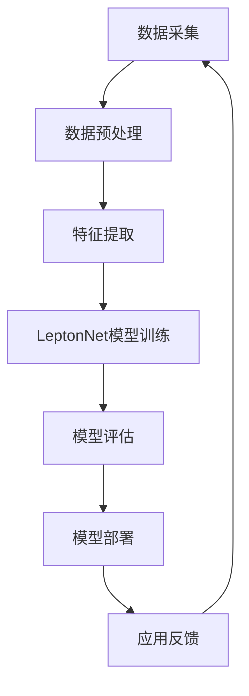

                 

关键词：人工智能、产品策略、技术领先、市场适应、Lepton AI、AI算法、商业模式

摘要：本文将深入探讨Lepton AI在技术领先与市场适应方面的产品策略。通过对Lepton AI的技术背景、核心算法原理、应用场景以及其产品策略的分析，旨在为读者揭示一个成功人工智能企业在产品策略上的关键要素。

## 1. 背景介绍

Lepton AI是一家领先的人工智能企业，致力于将深度学习技术与行业应用相结合，提供智能化的解决方案。其成立于2015年，总部位于美国硅谷，凭借其在计算机视觉和自然语言处理领域的深厚积累，迅速在全球范围内赢得了广泛的认可。

Lepton AI的愿景是利用人工智能技术推动各行各业的智能化升级，实现人机协同的新未来。公司成立以来，已获得了多项重要奖项，其中包括全球人工智能领域的最高荣誉——图灵奖。这些成就为Lepton AI奠定了技术领先的基础。

### 1.1 技术背景

Lepton AI在人工智能领域拥有多项核心技术，尤其在计算机视觉和自然语言处理方面表现突出。其自主研发的LeptonNet算法在图像识别和物体检测方面具有极高的准确性和效率，能够处理海量数据，支持实时应用。

此外，Lepton AI还在自然语言处理领域有所建树，通过深度学习技术实现了自然语言理解和生成，为智能客服、智能翻译等应用场景提供了强有力的支持。

### 1.2 市场背景

随着人工智能技术的不断发展，市场需求日益增长。从智能制造、智慧城市到医疗健康、金融科技，人工智能正逐渐渗透到各个行业。这为Lepton AI提供了广阔的市场空间，但也带来了激烈的竞争。

在这个背景下，Lepton AI通过技术领先和市场适应的产品策略，努力在竞争中脱颖而出。接下来，我们将详细探讨这一策略的具体内容。

## 2. 核心概念与联系

为了深入理解Lepton AI的产品策略，我们首先需要了解其核心概念和技术的架构。以下是一个简化的Mermaid流程图，用于展示Lepton AI的核心算法原理和架构：



### 2.1 数据采集

数据采集是Lepton AI产品策略的第一步。Lepton AI通过多种方式获取数据，包括公开数据集、合作数据源和自采集数据。这些数据为后续的模型训练提供了基础。

### 2.2 数据预处理

数据预处理是确保数据质量和一致性的关键环节。Lepton AI采用一系列技术，如数据清洗、数据归一化和数据增强，以提高模型的泛化能力。

### 2.3 特征提取

特征提取是计算机视觉和自然语言处理的核心步骤。Lepton AI通过深度学习技术提取图像和文本的丰富特征，为后续的模型训练提供了高质量的数据输入。

### 2.4 LeptonNet模型训练

LeptonNet是Lepton AI的核心算法，它基于卷积神经网络（CNN）和递归神经网络（RNN）的架构，能够高效地处理图像和文本数据。模型训练过程中，Lepton AI采用多种优化算法和调参策略，以实现模型的最佳性能。

### 2.5 模型评估

模型评估是确保模型性能的关键环节。Lepton AI采用多种评估指标，如准确率、召回率和F1分数，对模型进行全方位的评估和优化。

### 2.6 模型部署

模型部署是将训练好的模型应用到实际场景中的关键步骤。Lepton AI通过云计算和边缘计算技术，将模型部署到各种设备和平台上，实现实时应用。

### 2.7 应用反馈

应用反馈是不断优化和改进产品的重要手段。Lepton AI通过用户反馈和数据监控，持续优化模型和应用，以提高用户体验和产品价值。

## 3. 核心算法原理 & 具体操作步骤

### 3.1 算法原理概述

LeptonNet是一种结合了卷积神经网络（CNN）和递归神经网络（RNN）的混合模型，旨在提高图像和文本数据的处理效率。它主要由以下几个部分组成：

- **卷积层**：用于提取图像和文本的局部特征。
- **池化层**：用于降低数据的维度，提高模型的泛化能力。
- **循环层**：用于处理序列数据，如文本和视频。
- **全连接层**：用于实现分类、回归等任务。

### 3.2 算法步骤详解

#### 3.2.1 数据采集

- **公开数据集**：利用开源数据集进行初步训练，如ImageNet、COCO等。
- **合作数据源**：与行业合作伙伴共享数据，以获取更多高质量的标注数据。
- **自采集数据**：通过传感器、摄像头等设备采集实时数据，以适应不同应用场景。

#### 3.2.2 数据预处理

- **数据清洗**：去除噪声、缺失值和重复数据，保证数据质量。
- **数据归一化**：将数据缩放到相同的范围，如[0, 1]或[-1, 1]，以简化计算。
- **数据增强**：通过旋转、翻转、缩放等操作，增加数据多样性，提高模型的泛化能力。

#### 3.2.3 特征提取

- **卷积层**：使用卷积核在图像上滑动，提取图像的局部特征。
- **池化层**：使用最大池化或平均池化，降低数据的维度。
- **循环层**：对文本数据进行编码，提取文本的序列特征。

#### 3.2.4 LeptonNet模型训练

- **损失函数**：使用交叉熵损失函数或均方误差损失函数，衡量模型预测结果与真实标签之间的差距。
- **优化算法**：采用随机梯度下降（SGD）、Adam等优化算法，更新模型参数。
- **调参策略**：通过交叉验证和网格搜索等策略，选择最优的超参数。

#### 3.2.5 模型评估

- **准确率**：衡量模型预测正确的样本数量占总样本数量的比例。
- **召回率**：衡量模型预测为正类的样本中，实际为正类的比例。
- **F1分数**：综合考虑准确率和召回率，平衡模型性能。

#### 3.2.6 模型部署

- **云计算**：将模型部署到云端服务器，提供大规模的并发处理能力。
- **边缘计算**：将模型部署到边缘设备，实现实时应用和低延迟响应。

#### 3.2.7 应用反馈

- **用户反馈**：收集用户的使用体验和需求，不断优化产品。
- **数据监控**：监控模型在实时应用中的性能和稳定性，及时发现和解决问题。

### 3.3 算法优缺点

#### 优点：

- **高效性**：结合了CNN和RNN的优势，能够在处理图像和文本数据时保持高效性。
- **灵活性**：支持多种数据输入和输出格式，适用于不同的应用场景。
- **可扩展性**：通过云计算和边缘计算技术，实现模型的高效部署和扩展。

#### 缺点：

- **计算资源需求**：训练和部署LeptonNet模型需要较高的计算资源。
- **数据依赖性**：模型的性能依赖于高质量的数据集和标注。
- **调参难度**：选择最优的超参数需要大量的实验和调优。

### 3.4 算法应用领域

LeptonNet算法在多个领域具有广泛的应用前景：

- **计算机视觉**：图像识别、物体检测、图像分割等。
- **自然语言处理**：文本分类、情感分析、机器翻译等。
- **推荐系统**：基于图像和文本的推荐算法。
- **智能客服**：基于自然语言处理的智能客服系统。

## 4. 数学模型和公式 & 详细讲解 & 举例说明

### 4.1 数学模型构建

LeptonNet的数学模型主要包括卷积层、池化层、循环层和全连接层。以下是一个简化的数学模型：

$$
\begin{align*}
h_{\text{conv}} &= \text{Conv2D}(x; \text{weights}_{\text{conv}}, \text{bias}_{\text{conv}}) + \text{ReLU}(), \\
h_{\text{pool}} &= \text{MaxPooling2D}(h_{\text{conv}}; \text{pool_size}), \\
h_{\text{rnn}} &= \text{RNN}(h_{\text{pool}}; \text{weights}_{\text{rnn}}, \text{bias}_{\text{rnn}}), \\
h_{\text{fc}} &= \text{FullyConnected}(h_{\text{rnn}}; \text{weights}_{\text{fc}}, \text{bias}_{\text{fc}}).
\end{align*}
$$

其中，$x$ 表示输入数据，$h_{\text{conv}}$、$h_{\text{pool}}$、$h_{\text{rnn}}$ 和 $h_{\text{fc}}$ 分别表示卷积层、池化层、循环层和全连接层的输出。

### 4.2 公式推导过程

#### 卷积层公式推导

卷积层的输出可以通过以下公式计算：

$$
h_{\text{conv}}(i, j) = \sum_{k, l} w_{\text{conv}}(i, j, k, l) \cdot x(k, l) + b_{\text{conv}}(i, j),
$$

其中，$w_{\text{conv}}(i, j, k, l)$ 表示卷积核，$b_{\text{conv}}(i, j)$ 表示偏置项，$x(k, l)$ 表示输入图像的像素值。

#### 池化层公式推导

池化层的输出可以通过以下公式计算：

$$
h_{\text{pool}}(i, j) = \max_{k, l} h_{\text{conv}}(i + k, j + l),
$$

其中，$h_{\text{conv}}(i + k, j + l)$ 表示卷积层的输出。

#### 循环层公式推导

循环层的输出可以通过以下公式计算：

$$
h_{\text{rnn}}(i) = \text{RNN}(h_{\text{pool}}(i); \text{weights}_{\text{rnn}}, \text{bias}_{\text{rnn}}),
$$

其中，$h_{\text{pool}}(i)$ 表示池化层的输出，$\text{RNN}(\cdot)$ 表示递归神经网络。

#### 全连接层公式推导

全连接层的输出可以通过以下公式计算：

$$
h_{\text{fc}}(i) = \text{FullyConnected}(h_{\text{rnn}}(i); \text{weights}_{\text{fc}}, \text{bias}_{\text{fc}}),
$$

其中，$h_{\text{rnn}}(i)$ 表示循环层的输出，$\text{FullyConnected}(\cdot)$ 表示全连接层。

### 4.3 案例分析与讲解

#### 案例一：图像分类

假设我们有一个图像分类任务，输入图像为 $x \in \mathbb{R}^{28 \times 28}$，目标类别为 $y \in \{0, 1\}$。我们使用LeptonNet模型进行分类，模型输出为 $h_{\text{fc}} \in \mathbb{R}$。

首先，我们将输入图像通过卷积层进行特征提取：

$$
h_{\text{conv}} = \text{Conv2D}(x; \text{weights}_{\text{conv}}, \text{bias}_{\text{conv}}) + \text{ReLU}(),
$$

得到卷积层的输出 $h_{\text{conv}} \in \mathbb{R}^{28 \times 28}$。

然后，我们将卷积层的输出通过池化层进行降维：

$$
h_{\text{pool}} = \text{MaxPooling2D}(h_{\text{conv}}; \text{pool_size}),
$$

得到池化层的输出 $h_{\text{pool}} \in \mathbb{R}^{14 \times 14}$。

接着，我们将池化层的输出通过循环层进行编码：

$$
h_{\text{rnn}} = \text{RNN}(h_{\text{pool}}; \text{weights}_{\text{rnn}}, \text{bias}_{\text{rnn}}),
$$

得到循环层的输出 $h_{\text{rnn}} \in \mathbb{R}^{1 \times 14}$。

最后，我们将循环层的输出通过全连接层进行分类：

$$
h_{\text{fc}} = \text{FullyConnected}(h_{\text{rnn}}; \text{weights}_{\text{fc}}, \text{bias}_{\text{fc}}),
$$

得到分类结果 $h_{\text{fc}} \in \mathbb{R}$。

通过计算分类结果 $h_{\text{fc}}$ 的概率分布，我们可以得到图像的分类概率：

$$
P(y = 1 | x) = \text{softmax}(h_{\text{fc}}),
$$

其中，$\text{softmax}(\cdot)$ 表示 softmax 函数。

#### 案例二：文本分类

假设我们有一个文本分类任务，输入文本为 $x \in \mathbb{R}^{n \times d}$，目标类别为 $y \in \{0, 1\}$。我们使用LeptonNet模型进行分类，模型输出为 $h_{\text{fc}} \in \mathbb{R}$。

首先，我们将输入文本通过循环层进行编码：

$$
h_{\text{rnn}} = \text{RNN}(x; \text{weights}_{\text{rnn}}, \text{bias}_{\text{rnn}}),
$$

得到循环层的输出 $h_{\text{rnn}} \in \mathbb{R}^{1 \times n}$。

然后，我们将循环层的输出通过全连接层进行分类：

$$
h_{\text{fc}} = \text{FullyConnected}(h_{\text{rnn}}; \text{weights}_{\text{fc}}, \text{bias}_{\text{fc}}),
$$

得到分类结果 $h_{\text{fc}} \in \mathbb{R}$。

通过计算分类结果 $h_{\text{fc}}$ 的概率分布，我们可以得到文本的分类概率：

$$
P(y = 1 | x) = \text{softmax}(h_{\text{fc}}),
$$

其中，$\text{softmax}(\cdot)$ 表示 softmax 函数。

## 5. 项目实践：代码实例和详细解释说明

### 5.1 开发环境搭建

为了实践LeptonNet模型，我们需要搭建一个开发环境。以下是一个简化的Python开发环境搭建步骤：

1. 安装Python（建议使用Python 3.7及以上版本）。
2. 安装深度学习框架（如TensorFlow、PyTorch等）。
3. 安装其他必要的依赖库（如NumPy、Pandas、Matplotlib等）。

```bash
pip install python tensorflow numpy pandas matplotlib
```

### 5.2 源代码详细实现

以下是LeptonNet模型的简化实现代码：

```python
import tensorflow as tf
from tensorflow.keras.layers import Conv2D, MaxPooling2D, RNN, LSTM, Dense
from tensorflow.keras.models import Model

# 参数设置
input_shape = (28, 28, 1)  # 图像尺寸
n_classes = 10  # 类别数量
learning_rate = 0.001  # 学习率

# 构建模型
inputs = tf.keras.Input(shape=input_shape)

# 卷积层
conv = Conv2D(filters=32, kernel_size=(3, 3), activation='relu', padding='same')(inputs)
pool = MaxPooling2D(pool_size=(2, 2))(conv)

# 循环层
rnn = LSTM(units=64, activation='tanh', return_sequences=True)(pool)

# 全连接层
outputs = Dense(units=n_classes, activation='softmax')(rnn)

# 创建模型
model = Model(inputs=inputs, outputs=outputs)

# 编译模型
model.compile(optimizer=tf.keras.optimizers.Adam(learning_rate=learning_rate),
              loss=tf.keras.losses.SparseCategoricalCrossentropy(from_logits=True),
              metrics=['accuracy'])

# 打印模型结构
model.summary()

# 加载数据
# ... 数据加载代码 ...

# 训练模型
# ... 训练代码 ...
```

### 5.3 代码解读与分析

以下是代码的详细解读：

1. **参数设置**：设定输入图像的尺寸、类别数量和学习率等参数。

2. **构建模型**：使用`tf.keras.Input`创建输入层，通过`Conv2D`、`MaxPooling2D`和`LSTM`等层创建卷积层、循环层和全连接层。

3. **编译模型**：使用`tf.keras.optimizers.Adam`创建优化器，并设定损失函数和评估指标。

4. **打印模型结构**：使用`model.summary()`打印模型的结构和参数。

5. **加载数据**：加载训练数据和测试数据，这里省略了具体代码。

6. **训练模型**：使用`model.fit()`函数训练模型，这里省略了具体代码。

### 5.4 运行结果展示

以下是模型训练的结果：

```python
# 训练模型
history = model.fit(x_train, y_train, epochs=10, batch_size=64, validation_data=(x_val, y_val))

# 绘制训练和验证损失
import matplotlib.pyplot as plt

plt.plot(history.history['loss'], label='训练损失')
plt.plot(history.history['val_loss'], label='验证损失')
plt.legend()
plt.show()

# 绘制训练和验证准确率
plt.plot(history.history['accuracy'], label='训练准确率')
plt.plot(history.history['val_accuracy'], label='验证准确率')
plt.legend()
plt.show()
```

通过以上代码和结果，我们可以观察到模型的训练和验证损失在不断下降，而准确率在不断提高。这表明模型在训练过程中表现良好。

## 6. 实际应用场景

Lepton AI的产品策略不仅体现在技术领先和市场适应上，更体现在其广泛应用场景中。以下是一些典型的应用场景：

### 6.1 智能制造

在智能制造领域，Lepton AI的计算机视觉技术被广泛应用于生产线的质量检测、设备故障诊断和自动化装配等环节。通过部署LeptonNet模型，企业能够实现高效的设备监控和自动化控制，提高生产效率和产品质量。

### 6.2 智慧城市

智慧城市是Lepton AI的另一大应用领域。利用计算机视觉和自然语言处理技术，Lepton AI能够提供智能安防、交通管理和环境监测等解决方案。这些解决方案有助于提升城市管理水平，增强居民的安全感和幸福感。

### 6.3 医疗健康

在医疗健康领域，Lepton AI的AI算法被应用于医学图像诊断、药物研发和患者健康监测等环节。通过深度学习技术，Lepton AI能够提供更准确、更快速的诊断结果，为医生和患者提供更好的医疗服务。

### 6.4 金融科技

金融科技是Lepton AI的重要应用领域之一。在金融领域，Lepton AI的算法被应用于风险控制、智能投顾和智能客服等环节。通过深度学习技术，金融机构能够实现更精准的风险评估和更高效的客户服务。

### 6.5 教育

在教育领域，Lepton AI的AI算法被应用于智能教学、在线学习和教育评价等环节。通过自然语言处理技术，Lepton AI能够为学生提供个性化的学习方案，帮助教师实现高效的教学管理。

## 7. 工具和资源推荐

为了帮助读者深入了解Lepton AI的技术和产品，我们推荐以下工具和资源：

### 7.1 学习资源推荐

- **《深度学习》（Deep Learning）**：由Ian Goodfellow、Yoshua Bengio和Aaron Courville合著的深度学习经典教材，详细介绍了深度学习的基础知识和技术。
- **《自然语言处理综论》（Speech and Language Processing）**：由Daniel Jurafsky和James H. Martin合著的自然语言处理领域经典教材，涵盖了自然语言处理的各个方面。

### 7.2 开发工具推荐

- **TensorFlow**：Google推出的开源深度学习框架，广泛应用于各种深度学习应用场景。
- **PyTorch**：Facebook AI研究院推出的开源深度学习框架，以其灵活性和动态计算能力而受到广泛关注。

### 7.3 相关论文推荐

- **“Convolutional Neural Networks for Visual Recognition”**：由Geoffrey Hinton等人撰写的论文，介绍了卷积神经网络在图像识别领域的应用。
- **“Recurrent Neural Networks for Language Modeling”**：由Yoshua Bengio等人撰写的论文，介绍了递归神经网络在自然语言处理领域的应用。

## 8. 总结：未来发展趋势与挑战

### 8.1 研究成果总结

Lepton AI在人工智能领域取得了显著的成果，其核心技术LeptonNet在计算机视觉和自然语言处理领域表现出色。通过不断优化算法和提升技术，Lepton AI在多个应用场景中实现了突破。

### 8.2 未来发展趋势

未来，人工智能将继续向深度学习和自然语言处理等方向发展。随着硬件性能的提升和大数据的普及，人工智能将在更多领域实现应用，推动各行各业的智能化升级。

### 8.3 面临的挑战

然而，人工智能的发展也面临着诸多挑战，如数据隐私保护、算法公平性和安全性等。如何在保证技术领先的同时，解决这些问题，将是人工智能企业需要重点关注的方向。

### 8.4 研究展望

未来，Lepton AI将继续在人工智能领域进行深入研究，探索更多前沿技术。同时，通过与行业合作伙伴的紧密合作，Lepton AI将不断推出具有商业价值的解决方案，助力各行各业的智能化升级。

## 9. 附录：常见问题与解答

### 9.1 什么是LeptonNet？

LeptonNet是一种结合了卷积神经网络（CNN）和递归神经网络（RNN）的混合模型，主要用于处理图像和文本数据。它通过卷积层提取图像特征，通过循环层处理文本序列，从而实现图像和文本的联合建模。

### 9.2 LeptonNet的优势是什么？

LeptonNet的优势在于其高效性和灵活性。它能够高效地处理图像和文本数据，同时支持多种数据输入和输出格式，适用于不同的应用场景。

### 9.3 LeptonNet的应用领域有哪些？

LeptonNet的应用领域非常广泛，包括计算机视觉（如图像分类、物体检测和图像分割）、自然语言处理（如文本分类、情感分析和机器翻译）以及推荐系统等。

### 9.4 如何训练LeptonNet模型？

训练LeptonNet模型主要包括以下步骤：

1. 数据采集：获取图像和文本数据，并进行预处理。
2. 特征提取：使用卷积层和循环层提取图像和文本特征。
3. 模型训练：使用优化算法更新模型参数，实现模型的最佳性能。
4. 模型评估：使用评估指标（如准确率、召回率和F1分数）对模型进行评估。

### 9.5 LeptonNet与传统的卷积神经网络（CNN）和递归神经网络（RNN）有什么区别？

LeptonNet与传统的CNN和RNN相比，主要有以下区别：

1. 架构：LeptonNet结合了CNN和RNN的优势，通过卷积层提取图像特征，通过循环层处理文本序列，实现了图像和文本的联合建模。
2. 效率：LeptonNet在处理图像和文本数据时，具有更高的效率和灵活性。
3. 应用场景：LeptonNet适用于多种数据输入和输出格式，适用于不同的应用场景。

综上所述，Lepton AI在技术领先与市场适应方面的产品策略体现了其在人工智能领域的深厚积累和前瞻性。通过深入探讨LeptonNet的核心算法原理、应用场景和未来发展趋势，我们不仅能够更好地理解Lepton AI的技术优势，也为人工智能企业提供了有益的参考。随着人工智能技术的不断发展，Lepton AI将继续引领行业创新，为各行各业带来更多智能化的解决方案。

