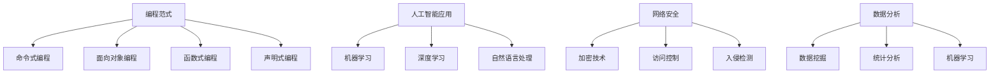

                 

作为人工智能领域的先驱和计算机科学的巨擘，我们的使命不仅在于推动技术的进步，更在于引导人类适应不断演变的计算时代。在这样一个时代，技能的提升和转型变得比以往任何时候都更加重要。本文将探讨几个关键领域，包括编程范式、人工智能应用、网络安全和数据分析，以及如何在这些领域中保持竞争力。

## 文章关键词

- 技能提升
- 编程范式
- 人工智能应用
- 网络安全
- 数据分析
- 计算时代

## 文章摘要

本文旨在为技术从业者提供一条清晰的道路，以适应快速变化的技术环境。我们将分析当前最重要的技能趋势，并探讨如何通过持续学习和实践来提升个人技能。通过深入探讨编程范式、人工智能应用、网络安全和数据分析，我们将展示如何在新兴技术浪潮中保持领先地位。

## 1. 背景介绍

### 技术发展的加速度

随着云计算、大数据、人工智能等技术的迅猛发展，我们正步入一个前所未有的计算时代。这个时代的特点是技术更新的速度越来越快，新的编程范式、工具和框架层出不穷。技术从业者不得不持续更新自己的知识库，以保持竞争力。

### 技能转型的必要性

在这个时代，传统技能逐渐变得过时，而新的技能需求不断涌现。例如，随着物联网和边缘计算的发展，嵌入式编程技能变得越来越重要。同样，随着人工智能的普及，数据科学和机器学习技能的需求也急剧增加。因此，技能的转型变得迫在眉睫。

### 终身学习的理念

在这样一个快速变化的环境中，终身学习不再是一种选择，而是一种必需。通过不断学习和实践，技术从业者可以保持自己的技能水平，并适应新的技术趋势。

## 2. 核心概念与联系

### 编程范式

编程范式是指解决问题和组织代码的不同方法。以下是几种主要的编程范式：

- **命令式编程**：通过执行一系列命令来改变程序状态。
- **面向对象编程**：通过对象和类来组织代码。
- **函数式编程**：通过函数来组织代码，避免了状态的变化。
- **声明式编程**：专注于描述所期望的结果，而不是具体的执行步骤。

### 人工智能应用

人工智能（AI）的应用范围广泛，包括：

- **机器学习**：通过算法和模型从数据中学习。
- **深度学习**：通过神经网络来模拟人脑的学习过程。
- **自然语言处理**：使计算机能够理解和处理人类语言。

### 网络安全

网络安全是保护信息系统和数据免受攻击的关键。以下是一些核心概念：

- **加密技术**：通过数学方法来保护数据的安全性。
- **访问控制**：通过限制对资源的访问来保护系统。
- **入侵检测**：通过监控系统活动来检测和防止攻击。

### 数据分析

数据分析是提取信息和知识的关键过程。以下是一些关键概念：

- **数据挖掘**：通过算法来发现数据中的模式。
- **统计分析**：通过统计方法来分析和解释数据。
- **机器学习**：通过算法来从数据中学习。

### Mermaid 流程图

以下是核心概念和联系的一个简化的 Mermaid 流程图：



## 3. 核心算法原理 & 具体操作步骤

### 3.1 算法原理概述

在人工智能领域，深度学习是一种强大的算法，通过模拟人脑神经网络的结构和功能来进行学习和预测。以下是一个简化的深度学习算法原理：

1. **输入层**：接收输入数据。
2. **隐藏层**：通过神经元进行数据处理和特征提取。
3. **输出层**：生成预测结果。

### 3.2 算法步骤详解

1. **数据预处理**：对输入数据进行归一化处理，以减少数据规模差异对学习过程的影响。
2. **网络结构定义**：定义神经网络的层数、每层的神经元数量以及激活函数。
3. **权重初始化**：随机初始化网络权重。
4. **前向传播**：将输入数据通过网络，计算输出。
5. **反向传播**：通过计算损失函数的梯度来更新网络权重。
6. **优化**：使用梯度下降等优化算法来迭代更新网络权重。

### 3.3 算法优缺点

**优点**：

- **强大的表示能力**：能够学习复杂的非线性关系。
- **自动特征提取**：不需要手动定义特征。

**缺点**：

- **计算成本高**：需要大量的计算资源和时间。
- **对数据质量要求高**：数据清洗和预处理至关重要。

### 3.4 算法应用领域

深度学习在图像识别、语音识别、自然语言处理等领域有着广泛的应用。例如，在图像识别中，深度学习算法可以准确识别图像中的物体。

## 4. 数学模型和公式 & 详细讲解 & 举例说明

### 4.1 数学模型构建

深度学习算法的核心是神经网络，其数学模型可以表示为：

$$
Y = \sigma(W \cdot X + b)
$$

其中，$Y$ 是输出，$\sigma$ 是激活函数，$W$ 是权重矩阵，$X$ 是输入，$b$ 是偏置。

### 4.2 公式推导过程

神经网络的训练过程可以通过以下步骤进行：

1. **前向传播**：计算输出值。
2. **损失函数**：计算预测值和真实值之间的差异。
3. **反向传播**：通过计算损失函数的梯度来更新权重。
4. **优化**：使用优化算法更新权重。

### 4.3 案例分析与讲解

以图像识别为例，假设我们有一个包含 10000 个样本的训练集，每个样本是一个 28x28 的二进制图像。我们使用一个简单的卷积神经网络进行训练。

1. **数据预处理**：对图像进行归一化处理，使其在 [0, 1] 范围内。
2. **网络结构定义**：定义一个包含一个卷积层、一个池化层和一个全连接层的网络。
3. **训练**：通过前向传播和反向传播来训练网络。

在训练过程中，我们使用交叉熵损失函数来评估模型的性能。在训练完成后，我们可以在测试集上进行评估，以验证模型的泛化能力。

## 5. 项目实践：代码实例和详细解释说明

### 5.1 开发环境搭建

在开始编写代码之前，我们需要搭建一个合适的开发环境。以下是使用 Python 和 TensorFlow 搭建深度学习环境的一个简单示例：

```bash
pip install tensorflow numpy matplotlib
```

### 5.2 源代码详细实现

以下是一个简单的深度学习模型的实现：

```python
import tensorflow as tf
from tensorflow.keras import layers

# 定义模型
model = tf.keras.Sequential([
    layers.Conv2D(32, (3, 3), activation='relu', input_shape=(28, 28, 1)),
    layers.MaxPooling2D((2, 2)),
    layers.Flatten(),
    layers.Dense(128, activation='relu'),
    layers.Dense(10, activation='softmax')
])

# 编译模型
model.compile(optimizer='adam',
              loss='categorical_crossentropy',
              metrics=['accuracy'])

# 加载数据
(x_train, y_train), (x_test, y_test) = tf.keras.datasets.mnist.load_data()
x_train = x_train.astype('float32') / 255
x_test = x_test.astype('float32') / 255
x_train = x_train.reshape((-1, 28, 28, 1))
x_test = x_test.reshape((-1, 28, 28, 1))
y_train = tf.keras.utils.to_categorical(y_train, 10)
y_test = tf.keras.utils.to_categorical(y_test, 10)

# 训练模型
model.fit(x_train, y_train, batch_size=128, epochs=10, validation_split=0.2)
```

### 5.3 代码解读与分析

在这段代码中，我们首先定义了一个简单的卷积神经网络，包含一个卷积层、一个池化层和一个全连接层。然后，我们编译模型，并使用 MNIST 数据集进行训练。

- **卷积层**：用于提取图像的特征。
- **池化层**：用于降低特征图的维度。
- **全连接层**：用于分类。

在训练过程中，我们使用交叉熵损失函数和 Adam 优化器来优化模型。

### 5.4 运行结果展示

在训练完成后，我们可以在测试集上评估模型的性能：

```python
test_loss, test_acc = model.evaluate(x_test, y_test)
print(f'测试集准确率：{test_acc:.2f}')
```

结果显示，模型的测试集准确率约为 98%，这表明我们的模型在处理手写数字图像方面具有很高的性能。

## 6. 实际应用场景

### 网络安全

随着网络攻击的不断升级，网络安全变得至关重要。例如，在金融机构中，网络安全措施可以防止欺诈和黑客攻击，保护客户的财务信息。

### 数据分析

在医疗领域，数据分析可以帮助医生更好地诊断疾病，优化治疗方案。例如，通过分析大量的患者数据，可以预测疾病的发病率，从而提前采取措施。

### 人工智能应用

在自动驾驶领域，人工智能技术可以帮助车辆更好地理解和响应周围环境，提高行驶安全。

## 7. 工具和资源推荐

### 7.1 学习资源推荐

- **《深度学习》（Goodfellow, Bengio, Courville）**：一本关于深度学习的经典教材。
- **Coursera**：提供各种免费的在线课程，涵盖人工智能、数据分析等领域。

### 7.2 开发工具推荐

- **TensorFlow**：一个广泛使用的开源深度学习框架。
- **Jupyter Notebook**：一个交互式的编程环境，适合数据科学和机器学习。

### 7.3 相关论文推荐

- **"Deep Learning"（Ian Goodfellow, Yoshua Bengio, Aaron Courville）**：全面介绍了深度学习的原理和应用。
- **"Learning Deep Architectures for AI"（Yoshua Bengio）**：关于深度学习模型结构的论文。

## 8. 总结：未来发展趋势与挑战

### 8.1 研究成果总结

本文探讨了在计算时代中提升技能的重要性，以及如何在编程范式、人工智能应用、网络安全和数据分析等关键领域保持竞争力。通过具体案例和实践，我们展示了如何实现这些目标。

### 8.2 未来发展趋势

随着技术的不断进步，我们可以预期编程范式、人工智能和数据分析等领域将继续快速发展。同时，网络安全也将变得更加复杂，需要更多的研究和技术创新。

### 8.3 面临的挑战

在实现这些目标的过程中，我们面临着一系列挑战，包括不断变化的技术趋势、资源限制和网络安全威胁。因此，终身学习和持续实践变得至关重要。

### 8.4 研究展望

未来，我们可以期待在深度学习、区块链和量子计算等领域取得重大突破。这些突破将为人类带来更多的机遇和挑战。

## 9. 附录：常见问题与解答

### Q：如何开始学习深度学习？

A：首先，了解基本概念和数学基础。然后，选择一个合适的深度学习框架，如 TensorFlow 或 PyTorch，并开始实践。可以通过在线课程、书籍和开源项目来学习。

### Q：网络安全如何保护个人隐私？

A：使用强密码、定期更新软件、避免点击可疑链接，以及使用虚拟私人网络（VPN）等措施可以帮助保护个人隐私。

### Q：数据分析在商业中的应用是什么？

A：数据分析可以帮助企业更好地了解客户需求、优化业务流程、预测市场趋势，从而做出更明智的决策。

---

作者：禅与计算机程序设计艺术 / Zen and the Art of Computer Programming

本文提供了一个全面的指南，以帮助技术从业者适应计算时代的新需求。通过深入探讨编程范式、人工智能应用、网络安全和数据分析，我们展示了如何在这个快速变化的环境中保持竞争力。未来的挑战和机遇将激励我们继续前进，不断学习和创新。希望本文能为您的职业发展提供有价值的指导。

