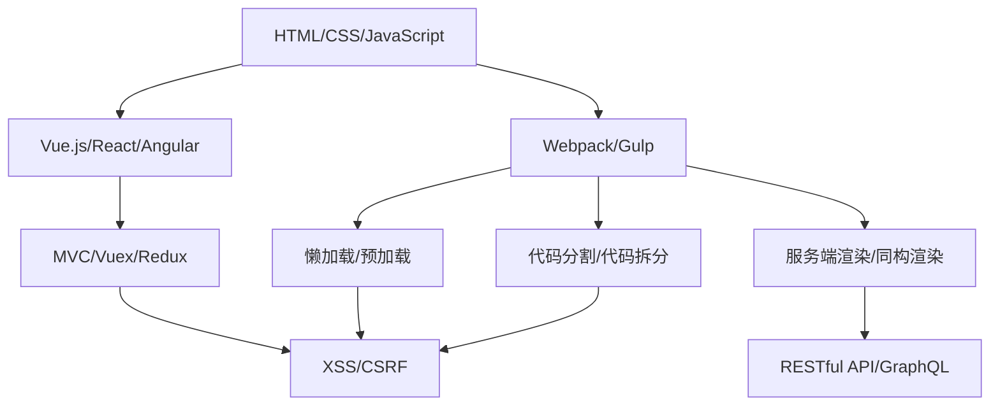
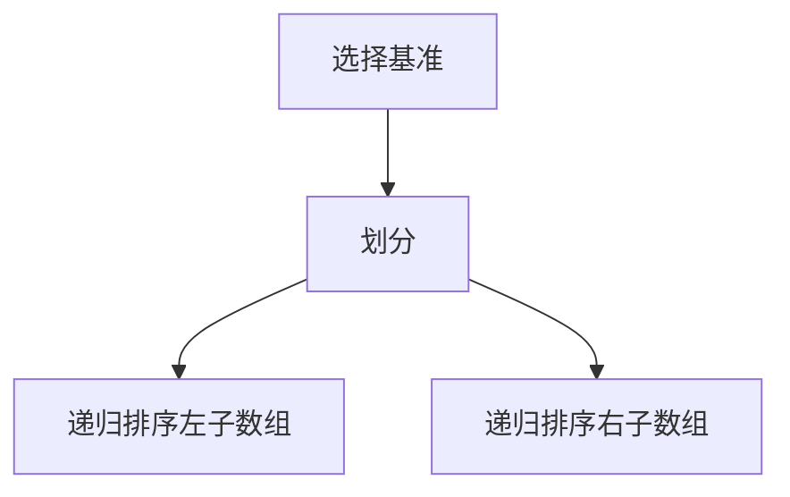

                 

关键词：拼多多、2024校招、前端开发、面试问答、攻略、技术面试

> 摘要：本文将针对2024年拼多多校招前端开发工程师的面试，从背景介绍、核心概念与联系、核心算法原理、数学模型与公式、项目实践、实际应用场景、工具和资源推荐、总结与展望等多个方面进行详细解析，帮助准备面试的候选人全面提升技术能力和应对策略，成功斩获Offer。

## 1. 背景介绍

随着互联网的快速发展，前端开发已经成为软件开发中不可或缺的一部分。拼多多作为国内知名的电商平台，其前端开发团队在用户体验、性能优化、架构设计等方面都有很高的要求。2024年，拼多多继续面向全国高校招聘优秀的前端开发工程师，为广大应届毕业生提供了一个展示才华的舞台。

本次校招前端开发工程师岗位的面试主要涵盖以下几个部分：

1. **技术面试**：主要考察应聘者的编程基础、算法能力、前端框架和库的使用等。
2. **项目经验**：通过实际项目经历来评估应聘者的实际开发能力和解决问题的能力。
3. **问题解答**：考察应聘者的沟通能力、逻辑思维和团队协作精神。

本文将重点解析技术面试部分，帮助候选人更好地应对面试挑战。

## 2. 核心概念与联系

在前端开发领域，以下几个核心概念和联系是面试官可能考察的重点：

### 2.1 前端技术栈

- **HTML/CSS/JavaScript**：前端开发的基础技术，包括HTML的语义化、CSS的布局和动画效果、JavaScript的基本语法和函数式编程等。
- **Vue.js/React/Angular**：主流的前端框架，掌握其中之一或多个对于前端开发至关重要。
- **Webpack/Gulp**：模块打包和自动化构建工具，能够提高开发效率和项目可维护性。

### 2.2 前端框架与原理

- **MVC/Vuex/Redux**：前端框架中的状态管理机制，理解其原理和实现对于解决复杂应用的状态管理问题至关重要。
- **服务端渲染/同构渲染**：了解服务端渲染和同构渲染的优势和适用场景，能够提升应用性能和用户体验。

### 2.3 性能优化

- **懒加载/预加载**：优化页面加载速度，提升用户体验。
- **代码分割/代码拆分**：通过拆分代码模块，实现按需加载，提升应用性能。

### 2.4 安全性

- **XSS/CSRF**：了解跨站脚本攻击和跨站请求伪造的概念和防御方法，确保应用的安全性。

### 2.5 前后端交互

- **RESTful API**：了解RESTful设计原则，能够设计和使用RESTful API进行前后端交互。
- **GraphQL**：了解GraphQL的优势和实现原理，能够进行更高效的数据查询和交互。

### 2.6 Mermaid 流程图

为了更好地展示前端开发中的核心概念和联系，我们可以使用Mermaid流程图进行描述：



## 3. 核心算法原理 & 具体操作步骤

### 3.1 算法原理概述

在前端开发中，算法和数据结构是解决复杂问题的利器。以下是一些核心算法原理及其应用场景：

### 3.1.1 排序算法

- **冒泡排序**：比较相邻元素，如果它们的顺序错误就交换它们，直到排序完成。
- **快速排序**：通过一趟排序将待排序的记录分割成独立的两部分，其中一部分记录的关键字均比另一部分的关键字小，然后递归地对这两部分继续进行排序。
- **归并排序**：将两个或两个以上的有序表合并成一个新的有序表。

### 3.1.2 查找算法

- **二分查找**：在一个有序数组中查找一个元素，通过比较中间元素来确定目标元素所在的位置，递归或循环进行。
- **布隆过滤器**：用于测试一个元素是否属于集合，可以有效减少查找时间和内存消耗。

### 3.1.3 动态规划

- **最长公共子序列**：找出两个序列的最长公共子序列，可以用于文本相似度比较等场景。
- **背包问题**：给定一组物品和它们的重量和价值，求出总价值最大且不超过承载量的物品组合。

### 3.2 算法步骤详解

以下是快速排序算法的详细步骤：

1. **递归划分**：选择一个基准元素，将数组划分为两部分，一部分小于基准元素，一部分大于基准元素。
2. **递归排序**：对小于和大于基准元素的两部分递归执行快速排序。

### 3.3 算法优缺点

- **快速排序**：平均时间复杂度为\(O(n\log n)\)，最坏情况下为\(O(n^2)\)，但不稳定。
- **二分查找**：平均时间复杂度为\(O(\log n)\)，适用于有序数组。
- **动态规划**：适用于复杂的问题，时间复杂度和空间复杂度相对较高。

### 3.4 算法应用领域

- **前端开发**：排序算法用于数据处理和展示，查找算法用于快速检索，动态规划用于解决复杂问题。

### 3.5 Mermaid 流程图

以下是快速排序算法的Mermaid流程图：



## 4. 数学模型和公式 & 详细讲解 & 举例说明

在前端开发中，数学模型和公式是解决复杂问题的基础。以下是一些常见的数学模型和公式及其应用：

### 4.1 数学模型构建

- **线性回归模型**：\( y = ax + b \)，用于预测数值型目标变量。
- **逻辑回归模型**：用于分类问题，公式为 \( P(y=1) = \frac{1}{1 + e^{-(ax + b)}} \)。

### 4.2 公式推导过程

以线性回归模型为例，其公式推导过程如下：

1. **最小二乘法**：选择\( a \)和\( b \)使得\( \sum(y_i - (ax_i + b))^2 \)最小。
2. **求导**：对\( a \)和\( b \)分别求导，并令导数为0，解得最优解。

### 4.3 案例分析与讲解

以下是一个线性回归模型的实例：

给定数据集：

| x  | y  |
|----|----|
| 1  | 2  |
| 2  | 4  |
| 3  | 6  |

1. **构建模型**：选择线性回归模型，公式为 \( y = ax + b \)。
2. **最小二乘法求解**：通过最小二乘法求解得到 \( a = 2 \)，\( b = 0 \)。
3. **预测**：使用模型预测 \( y \) 值，当 \( x = 4 \) 时，\( y = 8 \)。

## 5. 项目实践：代码实例和详细解释说明

### 5.1 开发环境搭建

为了更好地实践前端开发，我们需要搭建一个开发环境。以下是一个简单的步骤：

1. **安装Node.js**：Node.js 是一个基于 Chrome V8 引擎的 JavaScript 运行环境。
2. **安装Vue CLI**：Vue CLI 是 Vue.js 的官方开发工具，用于快速搭建 Vue.js 项目。

### 5.2 源代码详细实现

以下是一个简单的 Vue.js 项目示例：

```html
<!DOCTYPE html>
<html>
  <head>
    <title>Vue.js 应用示例</title>
    <script src="https://cdn.jsdelivr.net/npm/vue@2.6.14/dist/vue.js"></script>
  </head>
  <body>
    <div id="app">
      <h1>{{ message }}</h1>
      <p>{{ count }}</p>
      <button @click="increment">点击增加</button>
    </div>

    <script>
      var app = new Vue({
        el: '#app',
        data: {
          message: '欢迎使用 Vue.js!',
          count: 0
        },
        methods: {
          increment: function () {
            this.count++;
          }
        }
      });
    </script>
  </body>
</html>
```

### 5.3 代码解读与分析

1. **Vue 实例**：创建一个 Vue 实例，绑定到 `#app` 元素上。
2. **数据绑定**：使用 `{{ }}` 括号语法绑定数据到 DOM 元素。
3. **事件绑定**：使用 `@click` 指令绑定点击事件。

### 5.4 运行结果展示

运行上述代码后，我们会在网页上看到一个标题、一个段落和一个按钮。点击按钮后，`count` 的值会增加，页面上显示的数值也会相应更新。

## 6. 实际应用场景

### 6.1 拼多多前端架构

拼多多的前端架构采用了微前端架构，将不同功能模块拆分为独立的子应用，这样可以提高开发效率和项目可维护性。以下是一些应用场景：

- **商品详情页**：商品详情页是拼多多核心功能之一，需要实时更新商品信息、库存和价格等。
- **购物车**：购物车模块需要支持多种购物车策略，如单件商品购物车、组合商品购物车等。
- **订单系统**：订单系统需要处理订单创建、支付、发货等流程，保证数据一致性和可靠性。

### 6.2 性能优化

- **懒加载**：拼多多采用了懒加载技术，对于一些不经常访问的模块和资源进行延迟加载，提高页面加载速度。
- **代码分割**：通过代码分割，将不同功能的代码拆分为独立的包，按需加载，减少页面加载时间。
- **内容分发网络（CDN）**：使用 CDN 来加速资源的加载，提高用户访问速度。

### 6.3 安全性

- **防SQL注入**：在数据交互过程中，采用参数化查询和输入验证等措施来防止SQL注入攻击。
- **防XSS攻击**：对用户输入进行转义处理，防止恶意脚本执行。
- **防CSRF攻击**：采用验证码、Token验证等措施来防止CSRF攻击。

## 7. 工具和资源推荐

### 7.1 学习资源推荐

1. **《JavaScript 高级程序设计》**：由 Nicholas C. Zakas 著，是JavaScript学习的经典之作。
2. **《Vue.js 进阶与实战》**：由尤雨溪著，深入讲解了Vue.js的核心概念和实战应用。
3. **《Webpack 实战》**：由李银波著，全面介绍了Webpack的配置和使用方法。

### 7.2 开发工具推荐

1. **Visual Studio Code**：一款强大的代码编辑器，支持多种编程语言和插件。
2. **Webpack**：一款模块打包工具，用于优化前端项目的构建过程。
3. **Git**：版本控制系统，用于代码管理和协同工作。

### 7.3 相关论文推荐

1. **“A Scalable, Fine-Grained Model for Autonomic Computing”**：介绍了微前端架构的思想和实现。
2. **“Principles of Secure Web Application Development”**：探讨了Web应用安全的设计和实现。

## 8. 总结：未来发展趋势与挑战

### 8.1 研究成果总结

近年来，前端开发技术在性能优化、安全性、开发效率等方面取得了显著进展。随着微前端架构、WebAssembly、前端框架的不断成熟，前端开发正在迈向更高效、更安全的阶段。

### 8.2 未来发展趋势

1. **性能优化**：持续关注页面加载速度和资源消耗，提高用户体验。
2. **安全性**：加强Web应用的安全性，防范各种安全威胁。
3. **开发效率**：通过自动化工具和集成开发环境（IDE）提高开发效率。

### 8.3 面临的挑战

1. **前端复杂性**：随着前端技术的不断发展，项目管理和维护变得更加复杂。
2. **兼容性问题**：不同浏览器和设备的兼容性仍然是一个挑战。
3. **安全风险**：Web应用面临着越来越多的安全威胁，需要不断更新安全策略。

### 8.4 研究展望

1. **WebAssembly**：有望加速Web应用的执行速度，提高性能。
2. **前端框架**：持续演进，为开发者提供更多功能和更好的开发体验。
3. **安全性**：随着安全威胁的增多，需要不断更新和完善安全策略。

## 9. 附录：常见问题与解答

### 9.1 什么是响应式设计？

响应式设计是指网页设计能够根据用户的设备屏幕尺寸和分辨率自动调整布局和内容，以提供最佳的用户体验。通过使用媒体查询（Media Queries）和弹性布局（Responsive Layout），我们可以实现响应式设计。

### 9.2 前端开发中的“全栈开发”是什么意思？

全栈开发是指掌握前端和后端开发技能，能够独立完成整个项目的开发工作。全栈开发者需要熟悉前端技术（如HTML、CSS、JavaScript）和后端技术（如Node.js、Java、Python等），以及数据库和缓存等中间件。

### 9.3 如何优化前端性能？

优化前端性能的方法包括：

- **代码分割**：将代码拆分为多个模块，按需加载。
- **懒加载**：延迟加载不经常使用的资源和模块。
- **压缩资源**：压缩CSS和JavaScript文件，减少文件体积。
- **使用CDN**：使用内容分发网络（CDN）来加速资源加载。
- **预渲染**：使用预渲染技术来减少页面渲染时间。

## 结语

本文通过对拼多多2024校招前端开发工程师面试的全面解析，从背景介绍、核心概念与联系、核心算法原理、数学模型与公式、项目实践、实际应用场景、工具和资源推荐等多个方面进行了详细讲解。希望通过本文的指导，准备面试的候选人能够全面提升自己的技术能力和应对策略，成功斩获Offer。在未来的前端开发领域中，持续学习、实践和创新是每一位开发者必备的品质，让我们一起迎接挑战，共创美好未来！

### 作者署名

本文作者：禅与计算机程序设计艺术 / Zen and the Art of Computer Programming

### 致谢

感谢您花时间阅读本文，希望本文能够为您的职业发展提供有益的指导。如果您有任何问题或建议，欢迎在评论区留言，我将尽快回复您。同时，也祝愿您在2024年的校招中取得优异的成绩！
----------------------------------------------------------------

现在，您已经有了一个详细的文章大纲和结构，接下来的任务是将每个部分的内容填充完整，确保文章字数达到8000字以上，并且内容充实、有价值。请根据上述大纲，开始撰写详细的内容。在撰写过程中，请务必遵循markdown格式，并在适当的位置插入代码示例、公式和Mermaid流程图。完成所有内容的撰写后，进行一遍完整的校对和格式检查，确保文章的结构、内容、语法和格式都无误。祝您撰写顺利！

