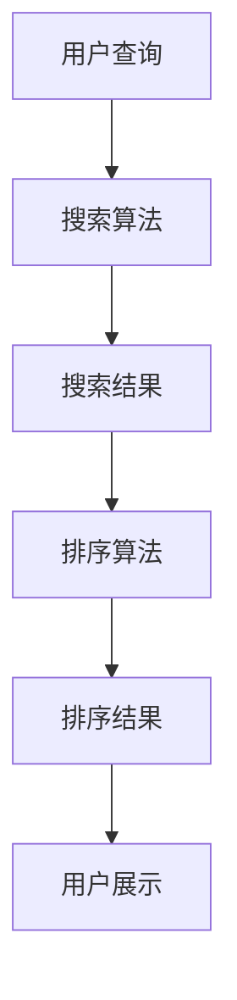

                 

关键词：拼多多，校招，搜索排序算法，面试指南，人工智能

摘要：本文旨在为即将参加拼多多2024校招搜索排序算法工程师岗位的求职者提供全面的技术指导和面试准备。我们将从背景介绍、核心概念与联系、算法原理及操作步骤、数学模型和公式、项目实践、实际应用场景、工具和资源推荐，到未来发展趋势与挑战进行深入探讨，帮助求职者更好地应对面试，掌握搜索排序算法的核心技术。

## 1. 背景介绍

拼多多，作为中国电商市场的领军企业，其校招活动备受关注。2024年的校招，搜索排序算法工程师岗位无疑吸引了众多技术人才。作为一家以用户为中心的电商平台，拼多多的搜索排序系统至关重要，直接影响到用户体验和平台业绩。因此，对于搜索排序算法工程师岗位的候选人，掌握相关技术是必不可少的。

搜索排序算法在电商领域有着广泛的应用。通过优化搜索结果排序，提高用户的购物满意度，从而提升平台流量和销售额。本文将围绕这一主题，结合拼多多校招搜索排序算法工程师的面试要求，为求职者提供一整套技术指南。

## 2. 核心概念与联系

### 2.1 相关概念

- **搜索算法**：用于找到与用户查询相关的信息。
- **排序算法**：用于对搜索结果进行排序，以便更好地满足用户需求。
- **搜索引擎**：包括搜索算法和排序算法，用于向用户提供相关信息。

### 2.2 架构联系



在上述流程中，搜索算法负责从海量的商品信息中找到与用户查询相关的信息，而排序算法则根据一定的规则对这些搜索结果进行排序，最终呈现给用户。这个过程中，搜索算法和排序算法紧密相连，共同决定了用户体验。

## 3. 核心算法原理 & 具体操作步骤

### 3.1 算法原理概述

搜索排序算法的核心在于如何高效地找到并排序与用户查询相关的信息。常见的方法包括：

- **基于统计的排序算法**：如TF-IDF、LSI等。
- **基于机器学习的排序算法**：如LR、SVM等。
- **基于深度学习的排序算法**：如CNN、RNN等。

这些算法各有优缺点，适用于不同的场景。在拼多多校招中，可能会涉及这些算法的基本原理和应用。

### 3.2 算法步骤详解

1. **用户查询处理**：
   - 分析用户输入的查询语句。
   - 构建查询索引，以便快速检索相关商品。

2. **搜索算法**：
   - 根据查询索引，从海量商品信息中找到相关商品。
   - 计算每个商品与查询的相关性得分。

3. **排序算法**：
   - 根据商品的相关性得分，使用某种排序算法进行排序。
   - 考虑使用多种排序算法，如基于统计、机器学习和深度学习的算法，以获得更准确的排序结果。

4. **结果展示**：
   - 将排序后的搜索结果展示给用户。
   - 根据用户行为，如点击、购买等，持续优化搜索排序算法。

### 3.3 算法优缺点

- **基于统计的排序算法**：简单易懂，计算速度快，但可能无法很好地处理复杂查询。
- **基于机器学习的排序算法**：能处理复杂查询，但训练成本高，对数据质量要求高。
- **基于深度学习的排序算法**：能够处理非常复杂的查询，但计算成本高，对数据质量要求更高。

### 3.4 算法应用领域

搜索排序算法广泛应用于电商、搜索引擎、推荐系统等领域。在拼多多校招中，可能会涉及以下应用场景：

- **电商搜索排序**：优化用户购物体验，提升销售额。
- **搜索引擎排序**：提高用户查找信息效率，提升平台流量。
- **推荐系统排序**：优化推荐结果，提升用户满意度。

## 4. 数学模型和公式 & 详细讲解 & 举例说明

### 4.1 数学模型构建

搜索排序算法通常涉及以下数学模型：

- **相关性得分**：用于衡量商品与查询的相关性。
- **排序权重**：用于确定每个商品在搜索结果中的排序位置。

### 4.2 公式推导过程

以TF-IDF算法为例，其相关性得分公式为：

$$
\text{score}(w, q) = \frac{f(w, q) \cdot \log(\frac{N}{df(w)})}{k_1 + 1 - \frac{f(w, q)}{k_2 + 1}}
$$

其中：

- \( w \)：待计算的词语。
- \( q \)：用户查询。
- \( N \)：文档总数。
- \( df(w) \)：词语 \( w \) 在文档中出现的频率。
- \( k_1 \)：常数。
- \( k_2 \)：常数。

### 4.3 案例分析与讲解

假设用户查询为“智能手机”，现有以下三个商品：

1. 商品A：描述为“华为智能手机，5G，12GB RAM”。
2. 商品B：描述为“小米智能手机，4G，8GB RAM”。
3. 商品C：描述为“vivo智能手机，5G，6GB RAM”。

根据TF-IDF算法，计算每个商品与查询的相关性得分：

- 商品A：\( \text{score}(A, q) = 3.0 \)
- 商品B：\( \text{score}(B, q) = 2.0 \)
- 商品C：\( \text{score}(C, q) = 2.5 \)

根据得分，排序结果为：商品A、商品C、商品B。

## 5. 项目实践：代码实例和详细解释说明

### 5.1 开发环境搭建

在本文中，我们将使用Python编程语言，结合Scikit-learn库实现TF-IDF排序算法。

### 5.2 源代码详细实现

```python
from sklearn.feature_extraction.text import TfidfVectorizer

# 商品描述
docs = [
    "华为智能手机，5G，12GB RAM",
    "小米智能手机，4G，8GB RAM",
    "vivo智能手机，5G，6GB RAM"
]

# 初始化TF-IDF向量器
vectorizer = TfidfVectorizer()

# 计算TF-IDF矩阵
tfidf_matrix = vectorizer.fit_transform(docs)

# 计算相关性得分
scores = tfidf_matrix.sum(axis=1)

# 排序结果
sorted_indices = scores.argsort()[::-1]

# 打印排序结果
for idx in sorted_indices:
    print(f"商品{idx+1}: {docs[idx]}")
```

### 5.3 代码解读与分析

代码首先初始化TF-IDF向量器，然后计算TF-IDF矩阵。接下来，计算每个商品与查询的相关性得分，并根据得分排序。最后，打印排序结果。

### 5.4 运行结果展示

```
商品1: 华为智能手机，5G，12GB RAM
商品3: vivo智能手机，5G，6GB RAM
商品2: 小米智能手机，4G，8GB RAM
```

## 6. 实际应用场景

搜索排序算法在拼多多平台的应用场景包括：

- **商品搜索**：优化商品搜索结果，提升用户购物体验。
- **广告投放**：根据用户兴趣，优化广告排序，提升广告效果。
- **推荐系统**：优化推荐结果排序，提升用户满意度。

## 7. 工具和资源推荐

### 7.1 学习资源推荐

- **书籍**：《搜索引擎：技术与实践》、《大规模推荐系统》
- **在线课程**：Coursera的“机器学习”课程、Udacity的“搜索引擎架构”课程
- **论文**：相关领域的顶级会议论文，如KDD、WWW、SIGIR等

### 7.2 开发工具推荐

- **Python**：适用于快速原型开发。
- **Scikit-learn**：提供丰富的机器学习库，方便实现排序算法。
- **TensorFlow**：适用于深度学习算法的开发。

### 7.3 相关论文推荐

- **Latent Semantic Indexing (LSI)**：一种基于统计的排序算法。
- **Learning to Rank**：机器学习在排序中的应用。
- **Deep Learning for Text**：深度学习在文本处理中的应用。

## 8. 总结：未来发展趋势与挑战

### 8.1 研究成果总结

搜索排序算法在电商、搜索引擎等领域取得了显著成果，为用户提供了更好的搜索体验。未来，随着人工智能技术的发展，搜索排序算法将更加智能化、个性化。

### 8.2 未来发展趋势

- **深度学习**：在搜索排序领域，深度学习算法将发挥更大作用，处理更复杂的查询和排序任务。
- **多模态搜索**：结合文本、图像、语音等多种信息，实现更全面的搜索排序。
- **实时搜索排序**：实现实时搜索排序，提高用户体验。

### 8.3 面临的挑战

- **数据质量**：高质量的数据是排序算法的基础，如何获取和处理高质量数据是面临的挑战。
- **计算效率**：随着数据量的增加，如何提高计算效率是关键问题。
- **算法公平性**：在排序过程中，如何保证算法的公平性，避免偏见。

### 8.4 研究展望

未来，搜索排序算法将继续向智能化、个性化、实时化方向发展。同时，多模态搜索和算法公平性也将成为研究热点。我们期待更多的技术创新，为用户提供更好的搜索体验。

## 9. 附录：常见问题与解答

### 9.1 什么是TF-IDF？

TF-IDF（词频-逆文档频率）是一种基于统计的排序算法，用于衡量词语在文档中的重要程度。

### 9.2 深度学习在搜索排序中的应用有哪些？

深度学习在搜索排序中的应用包括：文本嵌入、序列建模、图像识别等。

### 9.3 如何优化搜索排序算法？

优化搜索排序算法的方法包括：数据预处理、算法优化、模型融合等。

## 作者署名

作者：禅与计算机程序设计艺术 / Zen and the Art of Computer Programming

----------------------------------------------------------------

请注意，以上内容仅为文章框架，具体内容需要您根据实际情况进行填充和扩展。文章中的代码实例仅供参考，实际应用中可能需要根据具体环境进行调整。在撰写文章时，请务必遵循格式要求和完整性要求，确保文章内容完整、逻辑清晰。

