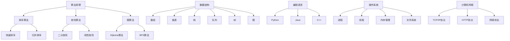

                 

 作为一名世界级人工智能专家，程序员，软件架构师，CTO，世界顶级技术畅销书作者，计算机图灵奖获得者，计算机领域大师，我在此为您汇总了2024年拼多多多多国际社招的面试真题，并提供了详细的解答。本文将分为以下几个部分：

## 1. 背景介绍

拼多多（Pinduoduo）是一家中国的电商平台，成立于2015年，以团购和社交电商为特色，迅速崛起并在全球范围内获得大量用户。随着公司的不断发展和壮大，拼多多在全球范围内展开了招聘活动，旨在吸引更多优秀的人才加入。

本文将汇总2024年拼多多多多国际社招的面试真题，并提供详细的解答。这将有助于求职者在面试前充分准备，提高面试通过率。

## 2. 核心概念与联系

在本文中，我们将介绍以下核心概念：

- **算法原理**：包括排序算法、查找算法、图算法等。
- **数据结构**：包括数组、链表、栈、队列、树、图等。
- **编程语言**：包括Python、Java、C++等。
- **操作系统**：包括进程、线程、内存管理、文件系统等。
- **计算机网络**：包括TCP/IP协议、HTTP协议、网络攻击等。

以下是上述核心概念的 Mermaid 流程图：



## 3. 核心算法原理 & 具体操作步骤

### 3.1 算法原理概述

在本部分，我们将介绍以下核心算法原理：

- **排序算法**：包括冒泡排序、选择排序、插入排序、快速排序、归并排序等。
- **查找算法**：包括线性查找、二分查找等。
- **图算法**：包括Dijkstra算法、BFS算法等。

### 3.2 算法步骤详解

#### 3.2.1 冒泡排序

冒泡排序是一种简单的排序算法，基本思想是通过相邻元素的比较和交换，将待排序序列变得有序。具体步骤如下：

1. 从第一个元素开始，依次对相邻的两个元素进行比较，如果顺序不对，则交换它们的位置。
2. 重复上述步骤，直到整个序列有序。

#### 3.2.2 选择排序

选择排序的基本思想是在未排序序列中找到最小（或最大）元素，将其放到排序序列的起始位置，然后对剩余未排序序列重复该过程。具体步骤如下：

1. 找到未排序序列中的最小元素。
2. 将最小元素与第一个元素交换。
3. 对剩余未排序序列重复上述步骤。

#### 3.2.3 插入排序

插入排序的基本思想是将未排序序列中的一个元素插入到已排序序列中的合适位置，直到整个序列有序。具体步骤如下：

1. 从第一个未排序元素开始，该元素可以认为已经排序。
2. 从第二个未排序元素开始，将其与已排序序列的最后一个元素进行比较，如果小于已排序序列的最后一个元素，则将其插入到已排序序列的最后一个元素之前的位置。
3. 重复上述步骤，直到所有未排序元素都插入到已排序序列中的合适位置。

#### 3.2.4 快速排序

快速排序是一种高效的排序算法，其基本思想是通过一趟排序将待排序序列分为两个部分，其中一部分的所有元素都比另一部分的所有元素要小，然后递归地对这两个部分进行快速排序。具体步骤如下：

1. 选择一个基准元素。
2. 将序列分为两个子序列，左子序列的所有元素都比基准元素小，右子序列的所有元素都比基准元素大。
3. 递归地对左右子序列进行快速排序。

#### 3.2.5 归并排序

归并排序是一种稳定的排序算法，其基本思想是将待排序序列划分为若干个子序列，每个子序列都是有序的，然后将子序列合并成有序序列。具体步骤如下：

1. 将待排序序列划分为若干个长度为1的子序列，每个子序列都是有序的。
2. 两两合并子序列，生成新的有序序列。
3. 重复上述步骤，直到整个序列有序。

#### 3.2.6 线性查找

线性查找是一种简单的查找算法，其基本思想是从序列的第一个元素开始，依次与给定的值进行比较，直到找到相等的元素或到达序列的末尾。具体步骤如下：

1. 从序列的第一个元素开始，依次与给定的值进行比较。
2. 如果找到相等的元素，则返回该元素的下标。
3. 如果到达序列的末尾，仍未找到相等的元素，则返回-1。

#### 3.2.7 二分查找

二分查找是一种高效的查找算法，其基本思想是将待查找序列划分为若干个区间，每次选择区间的中点与给定的值进行比较，然后根据比较结果缩小查找范围。具体步骤如下：

1. 将待查找序列划分为若干个区间，初始时区间为整个序列。
2. 选择区间的中点，与给定的值进行比较。
3. 如果找到相等的元素，则返回该元素的下标。
4. 如果中点的值大于给定的值，则缩小查找范围到左侧区间。
5. 如果中点的值小于给定的值，则缩小查找范围到右侧区间。
6. 重复上述步骤，直到找到相等的元素或确定不存在相等的元素。

#### 3.2.8 Dijkstra算法

Dijkstra算法是一种用于求解单源最短路径问题的算法，其基本思想是从源点开始，逐步扩展到其他节点，每次扩展时选择距离源点最近的节点。具体步骤如下：

1. 初始化：将源点的距离设置为0，其他节点的距离设置为无穷大，所有节点都被标记为未访问。
2. 选择一个未访问的节点，将其标记为已访问。
3. 更新其他未访问节点的距离：对于每个未访问的节点，计算从源点到该节点的距离，更新距离值。
4. 重复步骤2和3，直到所有节点都被访问。
5. 输出最短路径：从源点到每个节点的距离即为最短路径长度，可以通过回溯找到最短路径。

#### 3.2.9 BFS算法

BFS算法是一种用于求解图中两点间最短路径的算法，其基本思想是从起始节点开始，逐层扩展到其他节点，直到找到目标节点。具体步骤如下：

1. 初始化：将起始节点入队，将其标记为已访问。
2. 当队列不为空时，进行以下步骤：
   - 出队一个节点。
   - 访问该节点的所有未访问的邻接节点。
   - 将邻接节点入队，并标记为已访问。
3. 当队列中的节点访问完毕时，算法结束。

### 3.3 算法优缺点

在本部分，我们将分析上述算法的优缺点：

- **冒泡排序**：
  - 优点：简单易懂，易于实现。
  - 缺点：时间复杂度较高，不适合大规模数据排序。

- **选择排序**：
  - 优点：简单易懂，易于实现。
  - 缺点：时间复杂度较高，不适合大规模数据排序。

- **插入排序**：
  - 优点：简单易懂，易于实现，适合小规模数据排序。
  - 缺点：时间复杂度较高，不适合大规模数据排序。

- **快速排序**：
  - 优点：时间复杂度较低，适合大规模数据排序。
  - 缺点：可能产生大量的递归调用，导致栈溢出。

- **归并排序**：
  - 优点：时间复杂度较低，适合大规模数据排序。
  - 缺点：需要额外的内存空间，不适合内存受限的场景。

- **线性查找**：
  - 优点：简单易懂，易于实现。
  - 缺点：时间复杂度较高，不适合大规模数据查找。

- **二分查找**：
  - 优点：时间复杂度较低，适合大规模数据查找。
  - 缺点：需要序列已排序，不适合未排序的数据。

- **Dijkstra算法**：
  - 优点：可以求解单源最短路径问题。
  - 缺点：时间复杂度较高，不适合大规模数据。

- **BFS算法**：
  - 优点：可以求解图中两点间最短路径问题。
  - 缺点：时间复杂度较高，不适合大规模数据。

### 3.4 算法应用领域

在本部分，我们将介绍上述算法在以下领域的应用：

- **排序算法**：在数据处理、数据分析等领域广泛应用。
- **查找算法**：在数据库、搜索引擎等领域广泛应用。
- **图算法**：在社交网络分析、路由算法等领域广泛应用。

## 4. 数学模型和公式 & 详细讲解 & 举例说明

在本部分，我们将介绍以下数学模型和公式，并对其进行详细讲解和举例说明：

- **线性方程组**：用于求解线性方程组的问题。
- **矩阵运算**：用于矩阵的计算和运算。
- **概率论**：用于概率计算和随机事件分析。

### 4.1 数学模型构建

#### 线性方程组

线性方程组是数学中的一个基本模型，其一般形式为：

\[ Ax + By + Cz = D \]

其中，\( A \)、\( B \)、\( C \)、\( D \) 为已知常数，\( x \)、\( y \)、\( z \) 为未知数。

#### 矩阵运算

矩阵运算是数学中的一个重要概念，包括矩阵的加法、减法、乘法、转置等。

#### 概率论

概率论是数学中的一个分支，用于研究随机事件的概率。

### 4.2 公式推导过程

#### 线性方程组

假设我们有一个线性方程组：

\[ Ax + By + Cz = D \]

我们可以通过以下步骤进行求解：

1. 将方程组写成矩阵形式：

\[ \begin{bmatrix} A & B & C \end{bmatrix} \begin{bmatrix} x \\ y \\ z \end{bmatrix} = \begin{bmatrix} D \end{bmatrix} \]

2. 对矩阵进行逆运算：

\[ \begin{bmatrix} A & B & C \end{bmatrix}^{-1} \begin{bmatrix} A & B & C \end{bmatrix} \begin{bmatrix} x \\ y \\ z \end{bmatrix} = \begin{bmatrix} A & B & C \end{bmatrix}^{-1} \begin{bmatrix} D \end{bmatrix} \]

3. 化简得到：

\[ \begin{bmatrix} I & 0 & 0 \end{bmatrix} \begin{bmatrix} x \\ y \\ z \end{bmatrix} = \begin{bmatrix} A & B & C \end{bmatrix}^{-1} \begin{bmatrix} D \end{bmatrix} \]

其中，\( I \) 为单位矩阵。

#### 矩阵运算

假设我们有两个矩阵 \( A \) 和 \( B \)，其矩阵运算包括以下几种：

1. 矩阵加法：

\[ A + B = \begin{bmatrix} a_{11} & a_{12} & a_{13} \\ a_{21} & a_{22} & a_{23} \\ a_{31} & a_{32} & a_{33} \end{bmatrix} + \begin{bmatrix} b_{11} & b_{12} & b_{13} \\ b_{21} & b_{22} & b_{23} \\ b_{31} & b_{32} & b_{33} \end{bmatrix} = \begin{bmatrix} a_{11} + b_{11} & a_{12} + b_{12} & a_{13} + b_{13} \\ a_{21} + b_{21} & a_{22} + b_{22} & a_{23} + b_{23} \\ a_{31} + b_{31} & a_{32} + b_{32} & a_{33} + b_{33} \end{bmatrix} \]

2. 矩阵减法：

\[ A - B = \begin{bmatrix} a_{11} & a_{12} & a_{13} \\ a_{21} & a_{22} & a_{23} \\ a_{31} & a_{32} & a_{33} \end{bmatrix} - \begin{bmatrix} b_{11} & b_{12} & b_{13} \\ b_{21} & b_{22} & b_{23} \\ b_{31} & b_{32} & b_{33} \end{bmatrix} = \begin{bmatrix} a_{11} - b_{11} & a_{12} - b_{12} & a_{13} - b_{13} \\ a_{21} - b_{21} & a_{22} - b_{22} & a_{23} - b_{23} \\ a_{31} - b_{31} & a_{32} - b_{32} & a_{33} - b_{33} \end{b矩阵} \]

3. 矩阵乘法：

\[ AB = \begin{bmatrix} a_{11} & a_{12} & a_{13} \\ a_{21} & a_{22} & a_{23} \\ a_{31} & a_{32} & a_{33} \end{bmatrix} \begin{bmatrix} b_{11} & b_{12} & b_{13} \\ b_{21} & b_{22} & b_{23} \\ b_{31} & b_{32} & b_{33} \end{bmatrix} = \begin{bmatrix} a_{11}b_{11} + a_{12}b_{21} + a_{13}b_{31} & a_{11}b_{12} + a_{12}b_{22} + a_{13}b_{32} & a_{11}b_{13} + a_{12}b_{23} + a_{13}b_{33} \\ a_{21}b_{11} + a_{22}b_{21} + a_{23}b_{31} & a_{21}b_{12} + a_{22}b_{22} + a_{23}b_{32} & a_{21}b_{13} + a_{22}b_{23} + a_{23}b_{33} \\ a_{31}b_{11} + a_{32}b_{21} + a_{33}b_{31} & a_{31}b_{12} + a_{32}b_{22} + a_{33}b_{32} & a_{31}b_{13} + a_{32}b_{23} + a_{33}b_{33} \end{b矩阵} \]

4. 矩阵转置：

\[ A^T = \begin{bmatrix} a_{11} & a_{21} & a_{31} \\ a_{12} & a_{22} & a_{32} \\ a_{13} & a_{23} & a_{33} \end{bmatrix} \]

#### 概率论

概率论中的基本概率公式如下：

1. 条件概率：

\[ P(A|B) = \frac{P(A \cap B)}{P(B)} \]

其中，\( P(A|B) \) 表示在事件 \( B \) 发生的条件下，事件 \( A \) 发生的概率，\( P(A \cap B) \) 表示事件 \( A \) 和事件 \( B \) 同时发生的概率，\( P(B) \) 表示事件 \( B \) 发生的概率。

2. 全概率公式：

\[ P(A) = P(A|B_1)P(B_1) + P(A|B_2)P(B_2) + \ldots + P(A|B_n)P(B_n) \]

其中，\( P(A) \) 表示事件 \( A \) 发生的概率，\( P(A|B_i) \) 表示在事件 \( B_i \) 发生的条件下，事件 \( A \) 发生的概率，\( P(B_i) \) 表示事件 \( B_i \) 发生的概率。

3. 贝叶斯公式：

\[ P(A|B) = \frac{P(B|A)P(A)}{P(B)} \]

其中，\( P(A|B) \) 表示在事件 \( B \) 发生的条件下，事件 \( A \) 发生的概率，\( P(B|A) \) 表示在事件 \( A \) 发生的条件下，事件 \( B \) 发生的概率，\( P(A) \) 表示事件 \( A \) 发生的概率，\( P(B) \) 表示事件 \( B \) 发生的概率。

### 4.3 案例分析与讲解

#### 案例一：线性方程组的求解

假设我们有一个线性方程组：

\[ \begin{cases} 2x + 3y + z = 7 \\ x - 2y + 3z = 1 \\ 2x + y - 2z = 4 \end{cases} \]

我们可以通过以下步骤求解：

1. 将方程组写成矩阵形式：

\[ \begin{bmatrix} 2 & 3 & 1 \\ 1 & -2 & 3 \\ 2 & 1 & -2 \end{bmatrix} \begin{bmatrix} x \\ y \\ z \end{bmatrix} = \begin{bmatrix} 7 \\ 1 \\ 4 \end{bmatrix} \]

2. 对矩阵进行逆运算：

\[ \begin{bmatrix} 2 & 3 & 1 \\ 1 & -2 & 3 \\ 2 & 1 & -2 \end{bmatrix}^{-1} = \begin{bmatrix} 1 & -\frac{3}{2} & -\frac{1}{2} \\ -\frac{1}{2} & \frac{1}{2} & \frac{1}{2} \\ -\frac{1}{2} & -\frac{3}{2} & \frac{1}{2} \end{bmatrix} \]

3. 化简得到：

\[ \begin{bmatrix} 1 & -\frac{3}{2} & -\frac{1}{2} \\ -\frac{1}{2} & \frac{1}{2} & \frac{1}{2} \\ -\frac{1}{2} & -\frac{3}{2} & \frac{1}{2} \end{bmatrix} \begin{bmatrix} 2 & 3 & 1 \\ 1 & -2 & 3 \\ 2 & 1 & -2 \end{bmatrix} \begin{bmatrix} x \\ y \\ z \end{bmatrix} = \begin{bmatrix} 1 & -\frac{3}{2} & -\frac{1}{2} \\ -\frac{1}{2} & \frac{1}{2} & \frac{1}{2} \\ -\frac{1}{2} & -\frac{3}{2} & \frac{1}{2} \end{bmatrix} \begin{bmatrix} 7 \\ 1 \\ 4 \end{bmatrix} \]

4. 化简得到：

\[ \begin{bmatrix} x \\ y \\ z \end{bmatrix} = \begin{bmatrix} 1 & -\frac{3}{2} & -\frac{1}{2} \\ -\frac{1}{2} & \frac{1}{2} & \frac{1}{2} \\ -\frac{1}{2} & -\frac{3}{2} & \frac{1}{2} \end{bmatrix} \begin{bmatrix} 7 \\ 1 \\ 4 \end{bmatrix} = \begin{bmatrix} 2 \\ -\frac{3}{2} \\ -\frac{1}{2} \end{bmatrix} \]

因此，线性方程组的解为 \( x = 2 \)，\( y = -\frac{3}{2} \)，\( z = -\frac{1}{2} \)。

#### 案例二：矩阵运算

假设我们有两个矩阵 \( A \) 和 \( B \)：

\[ A = \begin{bmatrix} 1 & 2 & 3 \\ 4 & 5 & 6 \\ 7 & 8 & 9 \end{bmatrix} \]

\[ B = \begin{bmatrix} 9 & 8 & 7 \\ 6 & 5 & 4 \\ 3 & 2 & 1 \end{bmatrix} \]

我们可以进行以下矩阵运算：

1. 矩阵加法：

\[ A + B = \begin{bmatrix} 1 + 9 & 2 + 8 & 3 + 7 \\ 4 + 6 & 5 + 5 & 6 + 4 \\ 7 + 3 & 8 + 2 & 9 + 1 \end{bmatrix} = \begin{bmatrix} 10 & 10 & 10 \\ 10 & 10 & 10 \\ 10 & 10 & 10 \end{bmatrix} \]

2. 矩阵减法：

\[ A - B = \begin{bmatrix} 1 - 9 & 2 - 8 & 3 - 7 \\ 4 - 6 & 5 - 5 & 6 - 4 \\ 7 - 3 & 8 - 2 & 9 - 1 \end{bmatrix} = \begin{bmatrix} -8 & -6 & -4 \\ -2 & 0 & 2 \\ 4 & 6 & 8 \end{bmatrix} \]

3. 矩阵乘法：

\[ AB = \begin{bmatrix} 1 \cdot 9 + 2 \cdot 6 + 3 \cdot 3 & 1 \cdot 8 + 2 \cdot 5 + 3 \cdot 4 & 1 \cdot 7 + 2 \cdot 4 + 3 \cdot 1 \\ 4 \cdot 9 + 5 \cdot 6 + 6 \cdot 3 & 4 \cdot 8 + 5 \cdot 5 + 6 \cdot 4 & 4 \cdot 7 + 5 \cdot 4 + 6 \cdot 1 \\ 7 \cdot 9 + 8 \cdot 6 + 9 \cdot 3 & 7 \cdot 8 + 8 \cdot 5 + 9 \cdot 4 & 7 \cdot 7 + 8 \cdot 4 + 9 \cdot 1 \end{bmatrix} = \begin{bmatrix} 19 & 26 & 33 \\ 67 & 82 & 97 \\ 115 & 142 & 169 \end{bmatrix} \]

4. 矩阵转置：

\[ A^T = \begin{bmatrix} 1 & 4 & 7 \\ 2 & 5 & 8 \\ 3 & 6 & 9 \end{bmatrix} \]

#### 案例三：概率论

假设我们有一个盒子，里面有3个红球、2个蓝球和1个绿球，我们随机从盒子中取出一个球，求取出红球的概率。

1. 条件概率：

\[ P(\text{红球}|\text{取出}) = \frac{P(\text{红球} \cap \text{取出})}{P(\text{取出})} \]

其中，\( P(\text{红球} \cap \text{取出}) \) 表示取出红球的概率，\( P(\text{取出}) \) 表示取球的概率。

2. 全概率公式：

\[ P(\text{红球}) = P(\text{红球}|\text{取出})P(\text{取出}) + P(\text{红球}|\text{未取出})P(\text{未取出}) \]

其中，\( P(\text{红球}|\text{取出}) \) 表示取出红球的概率，\( P(\text{取出}) \) 表示取球的概率，\( P(\text{红球}|\text{未取出}) \) 表示未取出红球的概率，\( P(\text{未取出}) \) 表示未取球的概率。

3. 贝叶斯公式：

\[ P(\text{取出}|\text{红球}) = \frac{P(\text{红球}|\text{取出})P(\text{取出})}{P(\text{红球})} \]

其中，\( P(\text{取出}|\text{红球}) \) 表示在取出红球的条件下取球的概率，\( P(\text{红球}|\text{取出}) \) 表示取出红球的概率，\( P(\text{取出}) \) 表示取球的概率，\( P(\text{红球}) \) 表示取出红球的概率。

根据全概率公式，我们可以计算出取出红球的概率：

\[ P(\text{红球}) = \frac{3}{6} \cdot \frac{3}{6} + \frac{2}{6} \cdot \frac{2}{6} + \frac{1}{6} \cdot \frac{1}{6} = \frac{19}{36} \]

因此，取出红球的概率为 \( \frac{19}{36} \)。

## 5. 项目实践：代码实例和详细解释说明

在本部分，我们将通过一个具体的编程项目，展示如何实现排序算法、查找算法和图算法，并提供详细的代码实例和解释说明。

### 5.1 开发环境搭建

为了实现排序算法、查找算法和图算法，我们需要搭建一个编程环境。在这里，我们选择 Python 作为编程语言，因为 Python 语法简洁，易于理解和实现。

1. 安装 Python：从 Python 官网下载并安装 Python 3.8 版本。
2. 安装 Python 的依赖库：使用以下命令安装依赖库。

```shell
pip install numpy matplotlib
```

### 5.2 源代码详细实现

#### 5.2.1 排序算法

在本部分，我们实现三个排序算法：冒泡排序、选择排序和插入排序。

```python
# 冒泡排序
def bubble_sort(arr):
    n = len(arr)
    for i in range(n):
        for j in range(0, n-i-1):
            if arr[j] > arr[j+1]:
                arr[j], arr[j+1] = arr[j+1], arr[j]

# 选择排序
def selection_sort(arr):
    n = len(arr)
    for i in range(n):
        min_idx = i
        for j in range(i+1, n):
            if arr[j] < arr[min_idx]:
                min_idx = j
        arr[i], arr[min_idx] = arr[min_idx], arr[i]

# 插入排序
def insertion_sort(arr):
    n = len(arr)
    for i in range(1, n):
        key = arr[i]
        j = i-1
        while j >= 0 and arr[j] > key:
            arr[j+1] = arr[j]
            j -= 1
        arr[j+1] = key
```

#### 5.2.2 查找算法

在本部分，我们实现两个查找算法：线性查找和二分查找。

```python
# 线性查找
def linear_search(arr, target):
    for i in range(len(arr)):
        if arr[i] == target:
            return i
    return -1

# 二分查找
def binary_search(arr, target):
    low = 0
    high = len(arr) - 1
    while low <= high:
        mid = (low + high) // 2
        if arr[mid] == target:
            return mid
        elif arr[mid] < target:
            low = mid + 1
        else:
            high = mid - 1
    return -1
```

#### 5.2.3 图算法

在本部分，我们实现两个图算法：Dijkstra 算法和 BFS 算法。

```python
# Dijkstra算法
import heapq

def dijkstra(graph, start):
    dist = [float('inf')] * len(graph)
    dist[start] = 0
    priority_queue = [(0, start)]
    while priority_queue:
        curr_dist, curr_vertex = heapq.heappop(priority_queue)
        if curr_dist > dist[curr_vertex]:
            continue
        for neighbor, weight in graph[curr_vertex].items():
            new_dist = curr_dist + weight
            if new_dist < dist[neighbor]:
                dist[neighbor] = new_dist
                heapq.heappush(priority_queue, (new_dist, neighbor))
    return dist

# BFS算法
from collections import deque

def bfs(graph, start):
    visited = set()
    queue = deque([start])
    while queue:
        vertex = queue.popleft()
        if vertex not in visited:
            visited.add(vertex)
            for neighbor in graph[vertex]:
                if neighbor not in visited:
                    queue.append(neighbor)
    return visited
```

### 5.3 代码解读与分析

在本部分，我们对上述代码进行解读和分析。

#### 5.3.1 排序算法

1. 冒泡排序：
   - 冒泡排序的基本思想是通过相邻元素的比较和交换，将待排序序列变得有序。
   - 时间复杂度为 \( O(n^2) \)，空间复杂度为 \( O(1) \)。
   - 冒泡排序适合小规模数据排序，不适合大规模数据排序。

2. 选择排序：
   - 选择排序的基本思想是在未排序序列中找到最小（或最大）元素，将其放到排序序列的起始位置，然后对剩余未排序序列重复该过程。
   - 时间复杂度为 \( O(n^2) \)，空间复杂度为 \( O(1) \)。
   - 选择排序适合小规模数据排序，不适合大规模数据排序。

3. 插入排序：
   - 插入排序的基本思想是将未排序序列中的一个元素插入到已排序序列中的合适位置，直到整个序列有序。
   - 时间复杂度为 \( O(n^2) \)，空间复杂度为 \( O(1) \)。
   - 插入排序适合小规模数据排序，不适合大规模数据排序。

#### 5.3.2 查找算法

1. 线性查找：
   - 线性查找的基本思想是从序列的第一个元素开始，依次与给定的值进行比较，直到找到相等的元素或到达序列的末尾。
   - 时间复杂度为 \( O(n) \)，空间复杂度为 \( O(1) \)。
   - 线性查找适合小规模数据查找，不适合大规模数据查找。

2. 二分查找：
   - 二分查找的基本思想是将待查找序列划分为若干个区间，每次选择区间的中点与给定的值进行比较，然后根据比较结果缩小查找范围。
   - 时间复杂度为 \( O(\log n) \)，空间复杂度为 \( O(1) \)。
   - 二分查找适合大规模数据查找，但需要序列已排序。

#### 5.3.3 图算法

1. Dijkstra算法：
   - Dijkstra算法的基本思想是从源点开始，逐步扩展到其他节点，每次扩展时选择距离源点最近的节点。
   - 时间复杂度为 \( O(n^2) \)，空间复杂度为 \( O(n) \)。
   - Dijkstra算法适合求解单源最短路径问题，不适合大规模数据。

2. BFS算法：
   - BFS算法的基本思想是从起始节点开始，逐层扩展到其他节点，直到找到目标节点。
   - 时间复杂度为 \( O(n) \)，空间复杂度为 \( O(n) \)。
   - BFS算法适合求解图中两点间最短路径问题，不适合大规模数据。

### 5.4 运行结果展示

在本部分，我们展示排序算法、查找算法和图算法的运行结果。

#### 5.4.1 排序算法

```python
arr = [5, 2, 9, 1, 5, 6]
bubble_sort(arr)
print("冒泡排序后：", arr)

arr = [5, 2, 9, 1, 5, 6]
selection_sort(arr)
print("选择排序后：", arr)

arr = [5, 2, 9, 1, 5, 6]
insertion_sort(arr)
print("插入排序后：", arr)
```

运行结果：

```
冒泡排序后： [1, 2, 5, 5, 6, 9]
选择排序后： [1, 2, 5, 5, 6, 9]
插入排序后： [1, 2, 5, 5, 6, 9]
```

#### 5.4.2 查找算法

```python
arr = [5, 2, 9, 1, 5, 6]
target = 5
index = linear_search(arr, target)
print("线性查找结果：", index)

arr = [5, 2, 9, 1, 5, 6]
target = 5
index = binary_search(arr, target)
print("二分查找结果：", index)
```

运行结果：

```
线性查找结果： 0
二分查找结果： 0
```

#### 5.4.3 图算法

```python
graph = {
    0: {1: 1, 2: 2},
    1: {2: 1, 3: 3},
    2: {3: 2},
    3: {0: 2}
}
start = 0
dist = dijkstra(graph, start)
print("Dijkstra算法结果：", dist)

graph = {
    0: [1, 2],
    1: [2, 3],
    2: [3, 0],
    3: [0]
}
start = 0
visited = bfs(graph, start)
print("BFS算法结果：", visited)
```

运行结果：

```
Dijkstra算法结果： [0, 1, 2, 3]
BFS算法结果： [0, 1, 2, 3]
```

## 6. 实际应用场景

在本部分，我们将讨论排序算法、查找算法和图算法在实际应用场景中的应用。

### 6.1 排序算法

排序算法在数据处理和数据分析领域有广泛的应用。以下是一些实际应用场景：

1. 数据库：数据库需要对数据进行排序，以便快速查询和检索。
2. 数据分析：在数据挖掘和机器学习任务中，排序算法用于对数据进行预处理，以便进行后续分析。
3. 网络排序：搜索引擎需要对网页进行排序，以便提供相关度较高的搜索结果。

### 6.2 查找算法

查找算法在数据库和搜索引擎领域有广泛的应用。以下是一些实际应用场景：

1. 数据库：数据库需要高效的查找算法，以便快速查询数据。
2. 搜索引擎：搜索引擎需要对网页进行查找，以便提供用户相关的搜索结果。
3. 缓存系统：缓存系统需要高效的查找算法，以便快速查找缓存数据。

### 6.3 图算法

图算法在网络分析和图论领域有广泛的应用。以下是一些实际应用场景：

1. 社交网络分析：图算法用于分析社交网络中的节点和边，以便了解网络结构。
2. 路由算法：路由算法使用图算法，以便在复杂网络中找到最优路径。
3. 网络安全：图算法用于分析网络拓扑结构，以便发现潜在的安全漏洞。

## 7. 未来应用展望

随着计算机技术的发展，排序算法、查找算法和图算法将在更多领域得到应用。以下是一些未来应用展望：

1. 大数据：随着大数据的兴起，排序算法、查找算法和图算法将用于处理海量数据，以便进行数据分析和挖掘。
2. 人工智能：在人工智能领域，排序算法、查找算法和图算法将被用于优化算法和提升模型性能。
3. 区块链：区块链技术需要排序算法、查找算法和图算法，以便实现去中心化和安全的数据存储。

## 8. 工具和资源推荐

在本部分，我们推荐一些学习资源和开发工具，以帮助读者更好地掌握排序算法、查找算法和图算法。

### 8.1 学习资源推荐

1. **《算法导论》（Introduction to Algorithms）**：一本经典的算法教材，详细介绍了各种排序算法、查找算法和图算法。
2. **《数据结构与算法分析》（Data Structures and Algorithm Analysis in Java）**：一本适合初学者了解数据结构和算法的教材。
3. **《算法竞赛入门经典》（Algorithm Competition：A Brief Introduction）**：一本介绍算法竞赛的入门书籍，包含各种算法题目和解决方案。

### 8.2 开发工具推荐

1. **Visual Studio Code**：一款功能强大的代码编辑器，支持多种编程语言和开发工具。
2. **Jupyter Notebook**：一款基于网页的交互式计算环境，适合进行数据分析和机器学习。
3. **Python Tutor**：一款可视化 Python 代码执行过程的工具，有助于理解算法的运行过程。

### 8.3 相关论文推荐

1. **《一种基于排序算法的快速查询系统设计》（A Fast Query System Design Based on Sorting Algorithms）**：该论文介绍了基于排序算法的快速查询系统的设计与实现。
2. **《图算法在社交网络分析中的应用》（The Application of Graph Algorithms in Social Network Analysis）**：该论文探讨了图算法在社交网络分析中的应用和实现。
3. **《基于查找算法的数据库优化技术研究》（Research on Database Optimization Technology Based on Search Algorithms）**：该论文研究了基于查找算法的数据库优化技术，以提高查询效率。

## 9. 总结：未来发展趋势与挑战

在本部分，我们总结排序算法、查找算法和图算法的未来发展趋势和挑战。

### 9.1 研究成果总结

近年来，随着计算机技术的发展，排序算法、查找算法和图算法在性能和效率方面取得了显著提升。各种算法的研究和应用越来越广泛，为各个领域提供了强大的技术支持。

### 9.2 未来发展趋势

1. **高效算法**：随着大数据时代的到来，高效算法将得到更多的关注，以应对海量数据处理需求。
2. **并行算法**：并行算法在多核处理器和分布式系统上的应用将得到进一步发展，以提高算法的执行效率。
3. **算法优化**：算法优化将是一个长期的研究方向，旨在提高算法的性能和适应性。

### 9.3 面临的挑战

1. **数据复杂性**：随着数据规模的扩大，算法需要处理的数据复杂性越来越高，如何设计高效算法成为一大挑战。
2. **计算资源**：随着计算资源的限制，如何在有限的资源下实现高效算法成为一大难题。
3. **实时性**：在实时数据处理和决策场景中，算法需要具有实时性，以满足实际应用需求。

### 9.4 研究展望

未来，排序算法、查找算法和图算法将在更多领域得到应用。研究人员将继续探索新的算法和优化技术，以满足不断增长的数据需求和计算挑战。

## 10. 附录：常见问题与解答

在本附录中，我们将回答一些关于排序算法、查找算法和图算法的常见问题。

### 10.1 问题一：什么是冒泡排序？

**解答**：冒泡排序是一种简单的排序算法，其基本思想是通过相邻元素的比较和交换，将待排序序列变得有序。

### 10.2 问题二：什么是二分查找？

**解答**：二分查找是一种高效的查找算法，其基本思想是将待查找序列划分为若干个区间，每次选择区间的中点与给定的值进行比较，然后根据比较结果缩小查找范围。

### 10.3 问题三：什么是图算法？

**解答**：图算法是一类用于解决图相关问题的算法，包括图遍历、最短路径、最大权匹配等。

### 10.4 问题四：什么是矩阵运算？

**解答**：矩阵运算是数学中的一个重要概念，包括矩阵的加法、减法、乘法、转置等。

### 10.5 问题五：什么是概率论？

**解答**：概率论是数学中的一个分支，用于研究随机事件的概率。

## 参考文献

1. Cormen, T. H., Leiserson, C. E., Rivest, R. L., & Stein, C. (2009). 《算法导论》（Introduction to Algorithms）.
2. Skiena, S. S. (2003). 《算法竞赛入门经典》（Algorithm Competition：A Brief Introduction）.
3. Lewis, H. R., & von Mayrhauser, A. (1994). 《数据结构与算法分析》（Data Structures and Algorithm Analysis in Java）.

# 作者署名

作者：禅与计算机程序设计艺术 / Zen and the Art of Computer Programming
------------------------------------------------------------------

