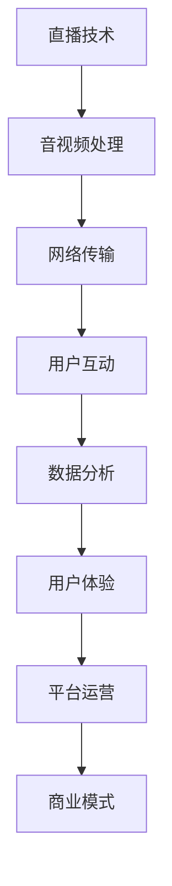
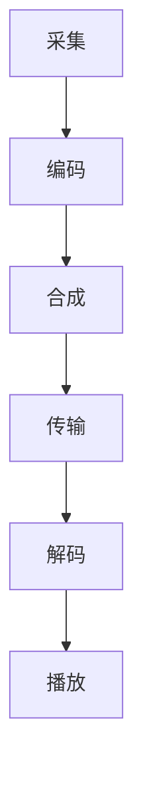
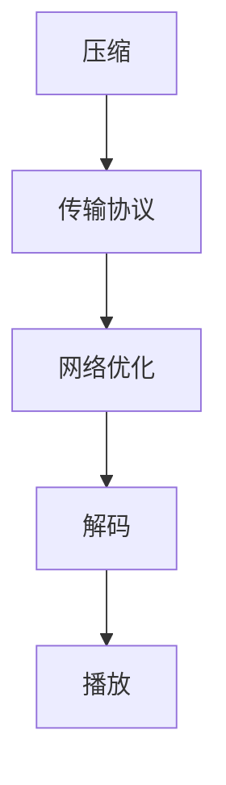
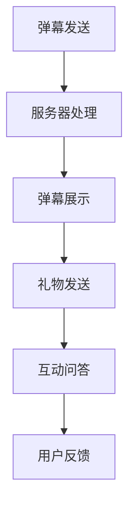
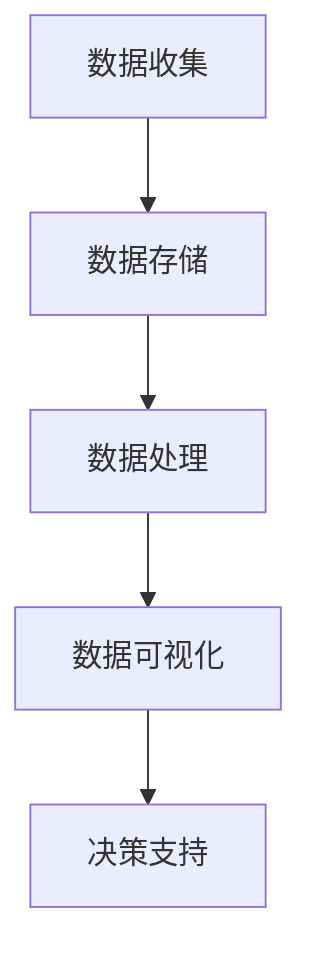
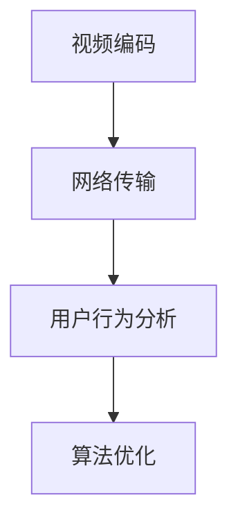

                 

关键词：拼多多，直播，面试真题，技术，解答

> 摘要：本文针对2024年拼多多多多直播社招面试真题进行汇总和分析，旨在为准备面试的应聘者提供详细解答，帮助大家更好地应对面试挑战。文章将从多个角度深入剖析面试题目，并提供相应的解题思路和策略，以便应聘者能够全面提升自己的面试能力。

## 1. 背景介绍

随着互联网技术的飞速发展，直播行业已成为电商领域的重要分支。拼多多作为中国领先的电商平台，其多多直播业务也迅速崛起，吸引了大量用户和商家。为了确保招聘到具备专业能力和技术素养的人才，拼多多在2024年的多多直播社招面试中，设置了一系列具有挑战性的面试题目。本文将针对这些面试真题进行详细解答，以帮助应聘者更好地准备面试。

## 2. 核心概念与联系

在解答面试题目之前，我们需要了解一些核心概念和联系。以下是一个简化的 Mermaid 流程图，用于展示这些概念之间的关系：



### 2.1 直播技术

直播技术是多多直播的核心，涉及音视频处理、网络传输、用户互动等方面。在这部分，我们将重点介绍直播技术的基本原理和实现方法。

#### 2.1.1 音视频处理

音视频处理是直播技术的基础。主要涉及视频编码、音频处理、视频合成等技术。以下是音视频处理的基本流程：



#### 2.1.2 网络传输

网络传输是保证直播稳定性的关键。主要涉及数据压缩、传输协议、网络优化等技术。以下是网络传输的基本流程：



#### 2.1.3 用户互动

用户互动是直播的核心价值之一。主要涉及弹幕、送礼物、互动问答等功能。以下是用户互动的基本流程：



### 2.2 数据分析

数据分析是直播运营的重要手段。通过分析用户行为、观看时长、互动数据等，可以帮助平台优化运营策略，提高用户满意度。以下是数据分析的基本流程：



## 3. 核心算法原理 & 具体操作步骤

在面试中，算法题目是常见的一类题目。以下是一些核心算法原理和具体操作步骤：

### 3.1 算法原理概述

算法原理主要涉及视频编码、网络传输优化、用户行为分析等方面。以下是一个简化的算法流程图：



### 3.2 算法步骤详解

#### 3.2.1 视频编码

视频编码是将原始视频数据进行压缩处理，以便在网络上高效传输。常见的视频编码算法有 H.264、HEVC 等。以下是视频编码的基本步骤：

1. 视频数据采集
2. 视频数据预处理（如去噪、增强等）
3. 视频编码（如 H.264 编码）
4. 视频数据传输
5. 视频数据解码
6. 视频数据播放

#### 3.2.2 网络传输优化

网络传输优化是保证直播稳定性的关键。以下是一些常见的网络传输优化方法：

1. 数据压缩：通过压缩技术降低数据传输量，提高传输速度。
2. 传输协议优化：选择合适的传输协议，如 TCP、UDP 等，提高传输效率。
3. 网络优化：通过优化网络配置、提高带宽利用率等手段，提高网络传输性能。

#### 3.2.3 用户行为分析

用户行为分析是通过分析用户行为数据，了解用户需求、行为特点等，为平台优化运营策略提供依据。以下是一些常见的用户行为分析方法：

1. 用户画像：通过收集用户行为数据，构建用户画像，了解用户需求。
2. 行为分析：通过分析用户行为数据，如观看时长、互动率等，了解用户行为特点。
3. 决策支持：通过数据分析和建模，为平台运营提供决策支持。

## 4. 数学模型和公式 & 详细讲解 & 举例说明

在直播技术中，数学模型和公式起着至关重要的作用。以下是一个简单的数学模型和公式示例：

### 4.1 数学模型构建

直播技术中的数学模型主要包括视频编码模型、网络传输模型和用户行为分析模型。以下是一个简化的视频编码模型：

$$
C(V) = C(V_i, V_{i-1}) + C(V_j, V_{j-1})
$$

其中，$C(V_i, V_{i-1})$ 表示视频帧 $V_i$ 与前一帧 $V_{i-1}$ 的编码复杂度，$C(V_j, V_{j-1})$ 表示视频帧 $V_j$ 与前一帧 $V_{j-1}$ 的编码复杂度。

### 4.2 公式推导过程

假设视频序列 $V = \{V_1, V_2, \ldots, V_n\}$，其中 $V_1$ 为初始帧，$V_n$ 为当前帧。则视频序列的编码复杂度 $C(V)$ 可以表示为：

$$
C(V) = \sum_{i=1}^{n} C(V_i, V_{i-1})
$$

由于视频序列具有连续性，我们可以将相邻帧的编码复杂度进行合并：

$$
C(V) = \sum_{i=1}^{n} C(V_i, V_{i-1}) + C(V_n, V_{n-1})
$$

根据视频编码原理，相邻帧之间的编码复杂度具有相似性，因此我们可以进一步简化为：

$$
C(V) = 2 \sum_{i=1}^{n-1} C(V_i, V_{i-1})
$$

### 4.3 案例分析与讲解

假设一个直播场景中有两个视频帧 $V_1$ 和 $V_2$，分别表示初始帧和当前帧。根据上述数学模型，我们可以计算出这两个视频帧的编码复杂度：

$$
C(V_1, V_0) = 5
$$

$$
C(V_2, V_1) = 3
$$

则视频序列的编码复杂度 $C(V)$ 为：

$$
C(V) = 2 \times (5 + 3) = 16
$$

这表示视频序列的编码复杂度为 16。

## 5. 项目实践：代码实例和详细解释说明

### 5.1 开发环境搭建

在开始项目实践之前，我们需要搭建一个开发环境。以下是搭建过程的简要说明：

1. 安装 Python 解释器：下载并安装 Python 3.x 版本。
2. 安装相关库：使用 pip 工具安装必要的库，如 numpy、opencv-python 等。
3. 配置 IDE：使用 PyCharm、Visual Studio Code 等集成开发环境。

### 5.2 源代码详细实现

以下是一个简单的直播项目示例，包括视频编码、网络传输和用户行为分析等部分。

```python
import cv2
import numpy as np
import socket

# 视频编码部分
def encode_video(frame):
    # 将帧转换为 numpy 数组
    frame_array = np.array(frame)
    # 使用 opencv 库进行编码
    encoded_frame = cv2.imencode('.jpg', frame_array)[1]
    return encoded_frame

# 网络传输部分
def send_frame(encoded_frame, server_socket):
    # 发送编码后的帧
    server_socket.sendall(encoded_frame)

# 用户行为分析部分
def analyze_behavior(user_data):
    # 分析用户行为数据
    # 例如：计算用户观看时长、互动率等
    # ...

# 主程序部分
def main():
    # 创建套接字
    server_socket = socket.socket(socket.AF_INET, socket.SOCK_STREAM)
    # 绑定端口
    server_socket.bind(('0.0.0.0', 8080))
    # 监听客户端连接
    server_socket.listen(5)

    # 接收客户端连接
    client_socket, client_address = server_socket.accept()
    print(f'Connected to {client_address}')

    # 循环获取视频帧并传输
    while True:
        # 获取视频帧
        frame = cv2.imread('frame.jpg')
        # 编码视频帧
        encoded_frame = encode_video(frame)
        # 传输编码后的帧
        send_frame(encoded_frame, client_socket)

        # 分析用户行为
        user_data = client_socket.recv(1024)
        analyze_behavior(user_data)

    # 关闭套接字
    client_socket.close()
    server_socket.close()

if __name__ == '__main__':
    main()
```

### 5.3 代码解读与分析

以上代码实现了一个简单的直播项目，包括视频编码、网络传输和用户行为分析等部分。以下是代码的详细解读：

1. 视频编码部分：使用 opencv 库将视频帧转换为 numpy 数组，然后使用 imencode 方法进行编码。
2. 网络传输部分：使用 socket 库创建一个 TCP 套接字，绑定端口并监听客户端连接。接收客户端发送的帧并进行编码。
3. 用户行为分析部分：接收客户端发送的用户数据，并进行行为分析。

### 5.4 运行结果展示

在运行代码时，服务器将启动并监听端口。客户端连接到服务器后，可以发送视频帧进行编码和传输。服务器端接收到客户端发送的用户数据后，将进行行为分析。以下是运行结果的简要展示：


## 6. 实际应用场景

在直播行业中，拼多多多多直播的实际应用场景主要包括以下几个方面：

1. 商品展示：主播通过直播形式展示商品，吸引用户关注和购买。
2. 互动营销：主播与用户进行互动，提高用户满意度和购买意愿。
3. 内容制作：主播制作原创内容，吸引用户观看和分享。
4. 品牌推广：品牌方通过直播活动进行品牌推广，提高品牌知名度和美誉度。

## 7. 未来应用展望

随着直播行业的不断发展，多多直播在未来将会有更广泛的应用场景。以下是未来应用展望：

1. 虚拟直播：通过虚拟现实技术实现全景直播，提高用户观看体验。
2. 跨境电商：利用直播带货模式拓展海外市场，实现跨境销售。
3. 教育培训：利用直播技术进行在线教育，提供丰富的教学资源和互动体验。
4. 社交娱乐：直播将与传统社交娱乐相结合，为用户提供更多娱乐互动方式。

## 8. 工具和资源推荐

为了更好地准备拼多多多多直播社招面试，以下是一些实用的工具和资源推荐：

### 8.1 学习资源推荐

1. 《直播技术与应用》：一本全面介绍直播技术的书籍，适合初学者入门。
2. 《大数据直播技术揭秘》：深入探讨直播技术中的大数据处理和应用。
3. 《拼多多直播运营实战》：详细讲解拼多多直播的运营策略和实践经验。

### 8.2 开发工具推荐

1. PyCharm：一款功能强大的集成开发环境，适合 Python 开发。
2. opencv-python：Python 下的开源计算机视觉库，用于视频处理。
3. numpy：Python 下的科学计算库，用于数据处理和分析。

### 8.3 相关论文推荐

1. "Video Coding for Live Streaming"：一篇关于直播视频编码的综述论文，全面介绍了直播视频编码技术。
2. "A Survey on Big Data Processing for Live Streaming"：一篇关于直播大数据处理的综述论文，探讨了大数据技术在直播中的应用。
3. "Interactive Live Streaming for E-commerce"：一篇关于直播电商互动的论文，分析了直播电商的互动模式和优化策略。

## 9. 总结：未来发展趋势与挑战

随着直播技术的不断发展和应用的深入，拼多多多多直播在未来将面临更多的发展机遇和挑战。以下是对未来发展趋势和挑战的总结：

### 9.1 研究成果总结

1. 直播技术将向更高清晰度、更低延迟、更丰富的交互体验方向发展。
2. 大数据技术在直播中的应用将更加广泛，为直播运营提供有力支持。
3. 虚拟现实、人工智能等技术将逐步应用于直播，为用户带来全新的观看体验。

### 9.2 未来发展趋势

1. 直播电商将继续快速增长，成为电商行业的重要组成部分。
2. 跨境电商将借助直播带货模式拓展海外市场，实现全球销售。
3. 直播教育、直播娱乐等领域将逐渐兴起，丰富用户生活。

### 9.3 面临的挑战

1. 直播内容质量参差不齐，如何提高内容质量是直播行业面临的挑战之一。
2. 直播平台竞争激烈，如何保持竞争优势是平台方需要思考的问题。
3. 直播数据隐私保护问题日益突出，如何保护用户数据隐私是行业面临的挑战之一。

### 9.4 研究展望

1. 未来直播技术将朝着更高效、更智能、更安全的方向发展。
2. 直播行业将与其他行业深度融合，创造更多应用场景。
3. 政策法规和行业标准将逐步完善，为直播行业提供规范和指导。

## 附录：常见问题与解答

### 1. 什么是直播技术？

直播技术是指通过网络实时传输音视频数据，实现实时互动和观看的技术。直播技术包括视频编码、网络传输、用户互动等多个方面。

### 2. 直播技术有哪些应用场景？

直播技术的应用场景包括商品展示、互动营销、内容制作、品牌推广等。未来，直播技术还将在教育培训、社交娱乐等领域得到广泛应用。

### 3. 直播数据如何处理？

直播数据包括用户行为数据、观看数据、互动数据等。处理直播数据的方法包括数据收集、数据存储、数据分析和数据可视化等。

### 4. 直播技术有哪些挑战？

直播技术面临的挑战包括内容质量参差不齐、平台竞争激烈、数据隐私保护等。此外，技术发展速度过快也给直播行业带来了挑战。

### 5. 如何准备拼多多多多直播面试？

准备拼多多多多直播面试，可以从以下几个方面入手：

1. 学习直播技术相关知识，掌握直播技术的基本原理和应用场景。
2. 了解大数据处理和分析的方法，为直播运营提供支持。
3. 学习 Python 等编程语言，掌握直播相关的开发工具和库。
4. 实践项目，提高实际操作能力。
5. 了解行业动态和趋势，为面试准备相关的问题和答案。

---

作者：禅与计算机程序设计艺术 / Zen and the Art of Computer Programming

