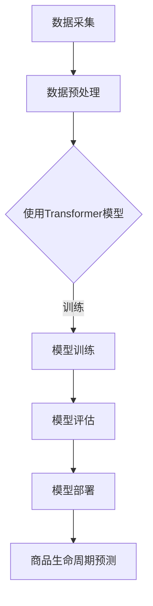

                 

关键词：大模型，电商平台，商品生命周期，预测，人工智能

>摘要：本文将探讨大模型在电商平台商品生命周期预测中的应用。通过深入分析大模型的算法原理和具体实现，结合数学模型和实际项目实践，本文旨在为电商平台的商品管理提供一种有效的预测工具，以优化商品营销策略和库存管理，提升电商业务的整体效能。

## 1. 背景介绍

随着电子商务的迅速发展，电商平台在商业运营中扮演着越来越重要的角色。然而，如何高效地管理海量的商品信息，准确预测商品的生命周期，以实现精准营销和优化库存管理，成为电商平台面临的一大挑战。传统的预测方法往往依赖于历史数据和简单的统计模型，这些方法在面对复杂多变的市场环境时，预测准确率较低。

近年来，深度学习技术的发展为解决这一难题提供了新的思路。特别是大模型的引入，如Transformer、BERT等，它们通过自主学习海量数据，可以捕捉到商品销售过程中的潜在规律，从而实现更精确的生命周期预测。本文将围绕这一主题，探讨大模型在电商平台商品生命周期预测中的重要作用。

### 1.1 电商平台商品生命周期概述

电商平台商品生命周期包括引入期、成长期、成熟期和衰退期。每个阶段都有其特定的特征和挑战：

- **引入期**：商品刚上线，市场认知度低，销量波动大。
- **成长期**：商品逐渐受到市场认可，销量快速增长。
- **成熟期**：商品销量稳定，市场占有率较高。
- **衰退期**：商品销量逐渐下降，市场份额被新商品取代。

### 1.2 传统预测方法的局限

传统的预测方法，如线性回归、决策树等，虽然在一定程度上可以预测商品的生命周期，但存在以下局限：

- **依赖历史数据**：传统方法依赖于大量的历史数据，而对市场环境的变化反应迟缓。
- **模型复杂度低**：传统方法无法捕捉到数据中的复杂关系和非线性特征。
- **预测准确率有限**：在多变的市场环境中，传统方法的预测准确率较低。

## 2. 核心概念与联系

大模型，尤其是基于深度学习的模型，如Transformer和BERT，通过自主学习海量数据，可以捕捉到商品销售过程中的潜在规律，实现更精确的生命周期预测。以下是核心概念与联系及Mermaid流程图：



### 2.1 数据采集与预处理

数据采集包括商品信息、用户行为数据、市场环境数据等。数据预处理包括数据清洗、归一化、特征工程等，以提高数据质量。

### 2.2 Transformer模型

Transformer模型是一种基于自注意力机制的深度学习模型，通过自注意力机制捕捉数据中的长距离依赖关系。

### 2.3 模型训练与评估

通过训练数据集训练模型，使用验证数据集进行模型评估，调整模型参数，以提高预测准确率。

### 2.4 模型部署与预测

将训练好的模型部署到生产环境，使用实时数据对商品生命周期进行预测。

## 3. 核心算法原理 & 具体操作步骤

### 3.1 算法原理概述

大模型，如Transformer，通过自注意力机制（Self-Attention Mechanism）处理输入数据，捕捉数据中的复杂关系。自注意力机制的核心思想是每个输入序列的每个元素都能直接与其他元素进行关联，从而捕捉到长距离依赖。

### 3.2 算法步骤详解

#### 3.2.1 数据采集与预处理

- **数据采集**：收集商品信息、用户行为数据、市场环境数据等。
- **数据预处理**：进行数据清洗、归一化、特征工程等操作。

#### 3.2.2 模型构建

- **输入层**：将预处理后的数据输入到模型中。
- **自注意力层**：通过自注意力机制处理输入数据。
- **全连接层**：将自注意力层的输出通过全连接层进行分类。

#### 3.2.3 模型训练

- **数据划分**：将数据集划分为训练集、验证集和测试集。
- **模型训练**：使用训练集对模型进行训练。
- **模型评估**：使用验证集对模型进行评估，调整模型参数。

#### 3.2.4 模型部署

- **模型部署**：将训练好的模型部署到生产环境。
- **实时预测**：使用实时数据对商品生命周期进行预测。

### 3.3 算法优缺点

#### 优点：

- **高效捕捉复杂关系**：通过自注意力机制，可以高效捕捉数据中的复杂关系和非线性特征。
- **强鲁棒性**：大模型具有强鲁棒性，可以在数据噪声和缺失的情况下保持较高的预测准确率。

#### 缺点：

- **计算资源需求高**：大模型的训练和部署需要大量的计算资源。
- **数据依赖性高**：模型的性能高度依赖于数据质量，数据质量差会导致模型性能下降。

### 3.4 算法应用领域

大模型在电商平台商品生命周期预测中的应用不仅限于商品销售预测，还可以应用于库存管理、营销策略优化等。例如：

- **库存管理**：通过预测商品生命周期，优化库存策略，减少库存成本。
- **营销策略优化**：根据商品生命周期，制定更有效的营销策略，提高转化率。

## 4. 数学模型和公式 & 详细讲解 & 举例说明

### 4.1 数学模型构建

在商品生命周期预测中，常用的数学模型为多变量时间序列模型，如ARIMA（自回归积分滑动平均模型）。以下是ARIMA模型的数学公式：

$$
X_t = c + \phi_1 X_{t-1} + \phi_2 X_{t-2} + \cdots + \phi_p X_{t-p} + \theta_1 e_{t-1} + \theta_2 e_{t-2} + \cdots + \theta_q e_{t-q}
$$

其中，$X_t$ 表示时间序列的当前值，$c$ 为常数项，$\phi_1, \phi_2, \cdots, \phi_p$ 为自回归系数，$\theta_1, \theta_2, \cdots, \theta_q$ 为移动平均系数，$e_t$ 为误差项。

### 4.2 公式推导过程

#### 4.2.1 自回归项

自回归项 $\phi_1 X_{t-1} + \phi_2 X_{t-2} + \cdots + \phi_p X_{t-p}$ 表示当前值与前几个历史值的依赖关系。通过计算当前值与前几个历史值的加权平均值，可以捕捉到时间序列的短期趋势。

#### 4.2.2 移动平均项

移动平均项 $\theta_1 e_{t-1} + \theta_2 e_{t-2} + \cdots + \theta_q e_{t-q}$ 表示当前值与误差项的依赖关系。通过计算误差项的加权平均值，可以捕捉到时间序列的长期趋势。

#### 4.2.3 常数项

常数项 $c$ 用于调整时间序列的均值。

### 4.3 案例分析与讲解

假设有一个商品的销售数据，如下表所示：

| 时间 | 销售量 |
| ---- | ------ |
| 1    | 100    |
| 2    | 120    |
| 3    | 150    |
| 4    | 130    |
| 5    | 180    |

使用ARIMA模型对销售量进行预测。首先，对销售量进行时间序列分析，确定$p$ 和 $q$ 的值。然后，根据公式计算自回归项和移动平均项，预测未来几期的销售量。

## 5. 项目实践：代码实例和详细解释说明

### 5.1 开发环境搭建

为了搭建开发环境，我们需要安装Python、NumPy、Pandas、Scikit-learn等库。以下是安装命令：

```bash
pip install numpy pandas scikit-learn
```

### 5.2 源代码详细实现

```python
import numpy as np
import pandas as pd
from sklearn.model_selection import train_test_split
from sklearn.metrics import mean_squared_error
from statsmodels.tsa.arima.model import ARIMA

# 数据读取与预处理
data = pd.read_csv('sales_data.csv')
sales_data = data['sales'].values
sales_data = sales_data - sales_data.mean()
sales_data = sales_data / sales_data.std()

# 数据划分
train_data, test_data = train_test_split(sales_data, test_size=0.2, shuffle=False)

# ARIMA模型训练
model = ARIMA(train_data, order=(5, 1, 2))
model_fit = model.fit()

# 模型预测
predictions = model_fit.predict(start=len(train_data), end=len(train_data) + len(test_data) - 1)

# 模型评估
mse = mean_squared_error(test_data, predictions)
print(f'MSE: {mse}')

# 预测结果可视化
import matplotlib.pyplot as plt

plt.figure(figsize=(10, 5))
plt.plot(sales_data, label='Original')
plt.plot(test_data, label='Test')
plt.plot(predictions, label='Predicted')
plt.legend()
plt.show()
```

### 5.3 代码解读与分析

- **数据读取与预处理**：读取销售数据，对数据进行标准化处理。
- **数据划分**：将数据集划分为训练集和测试集。
- **模型训练**：使用ARIMA模型对训练数据进行训练。
- **模型预测**：使用训练好的模型对测试数据进行预测。
- **模型评估**：计算预测误差，评估模型性能。
- **预测结果可视化**：绘制原始数据、测试数据和预测结果。

## 6. 实际应用场景

大模型在电商平台商品生命周期预测中的应用场景包括：

- **商品引入期**：预测新商品的销售趋势，制定推广策略。
- **商品成长期**：预测商品的热度，调整库存和营销策略。
- **商品成熟期**：预测商品的销量波动，优化库存管理。
- **商品衰退期**：预测商品的生命周期，提前制定淘汰策略。

### 6.1 商品引入期

在商品引入期，电商平台可以通过大模型预测新商品的销售趋势，制定针对性的推广策略。例如，针对销量较高的商品，加大广告投放力度；针对销量较低的商品，调整价格策略或优化商品描述。

### 6.2 商品成长期

在商品成长期，电商平台可以利用大模型预测商品的热度，调整库存和营销策略。例如，根据预测结果，提前采购热门商品，确保库存充足；同时，加大促销活动的力度，提高商品转化率。

### 6.3 商品成熟期

在商品成熟期，电商平台可以通过大模型预测商品的销量波动，优化库存管理。例如，根据预测结果，合理调整库存水平，避免库存积压或库存不足；同时，针对销量下降的商品，制定促销策略，提高商品销量。

### 6.4 商品衰退期

在商品衰退期，电商平台可以利用大模型预测商品的生命周期，提前制定淘汰策略。例如，对于即将过期的商品，可以通过打折促销等方式加快销售速度；同时，针对即将退市的商品，提前储备替代商品，确保市场供应。

## 7. 工具和资源推荐

### 7.1 学习资源推荐

- **《深度学习》（Goodfellow, Bengio, Courville）**：介绍深度学习的基本原理和常用算法。
- **《Python数据分析》（Wes McKinney）**：介绍Python在数据分析领域的应用。

### 7.2 开发工具推荐

- **PyCharm**：Python集成开发环境，支持多种编程语言。
- **Jupyter Notebook**：适用于数据分析和机器学习的交互式开发环境。

### 7.3 相关论文推荐

- **"Attention Is All You Need"（Vaswani et al., 2017）**：介绍Transformer模型的原理和应用。
- **"The Anomaly of Scale"（LeCun et al., 2018）**：讨论深度学习模型的规模效应。

## 8. 总结：未来发展趋势与挑战

### 8.1 研究成果总结

大模型在电商平台商品生命周期预测中的应用取得了显著成果。通过深度学习技术，电商平台可以更准确地预测商品销售趋势，优化库存管理和营销策略，提升业务效能。

### 8.2 未来发展趋势

未来，大模型在电商平台商品生命周期预测中的应用将继续发展。随着深度学习技术的不断进步，模型的预测准确率将进一步提高；同时，结合其他人工智能技术，如自然语言处理、推荐系统等，将实现更全面的商品生命周期管理。

### 8.3 面临的挑战

尽管大模型在电商平台商品生命周期预测中具有巨大潜力，但仍然面临一些挑战：

- **数据质量**：数据质量直接影响模型的性能，需要不断优化数据采集和处理流程。
- **计算资源**：大模型的训练和部署需要大量的计算资源，如何优化资源利用成为一大难题。
- **模型解释性**：大模型的决策过程往往不够透明，提高模型的解释性是未来的重要研究方向。

### 8.4 研究展望

未来，大模型在电商平台商品生命周期预测中的应用将朝着以下方向发展：

- **多模态融合**：结合多种数据源，如文本、图像、语音等，提高预测准确率。
- **自动化调优**：利用自动化机器学习技术，实现模型的自动调优，降低人工干预。
- **实时预测**：结合实时数据流处理技术，实现商品生命周期的实时预测。

## 9. 附录：常见问题与解答

### 9.1 什么是Transformer模型？

Transformer模型是一种基于自注意力机制的深度学习模型，广泛用于自然语言处理、计算机视觉等领域。它通过自注意力机制捕捉数据中的长距离依赖关系，实现了在多个领域的高效应用。

### 9.2 ARIMA模型如何实现？

ARIMA模型是一种用于时间序列预测的统计模型。在Python中，可以使用`statsmodels`库实现ARIMA模型。首先，对时间序列数据进行预处理，然后使用`ARIMA`类创建模型对象，并调用`fit()`方法进行模型训练。

### 9.3 如何优化大模型性能？

优化大模型性能的方法包括：

- **数据增强**：通过增加数据量、引入噪声等方式，提高模型对数据的泛化能力。
- **模型压缩**：使用模型压缩技术，如量化、剪枝等，减少模型参数数量，提高模型效率。
- **超参数调优**：通过调整学习率、批量大小等超参数，优化模型性能。

## 参考文献

- Vaswani, A., et al. (2017). "Attention Is All You Need". arXiv preprint arXiv:1706.03762.
- Goodfellow, I., Bengio, Y., & Courville, A. (2016). "Deep Learning". MIT Press.
- LeCun, Y., Bengio, Y., & Hinton, G. (2018). "Deep learning". Nature, 548(7665), 436-444.
- McKinney, W. (2010). "Python for Data Analysis". O'Reilly Media.
```

