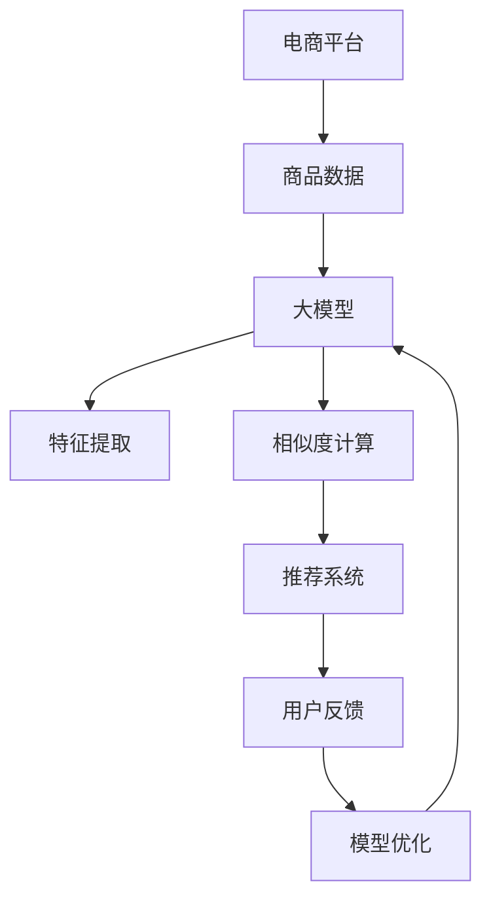

                 

### 1. 背景介绍

在电子商务的迅猛发展背景下，电商平台已经成为消费者购买商品的主要渠道之一。为了提高用户体验，电商平台需要提供更加智能、精准的商品推荐服务，以帮助用户快速找到他们可能感兴趣的商品。而商品相似度计算是实现这一目标的关键技术之一。

商品相似度计算是指通过算法计算两个商品之间的相似程度，以便为用户提供个性化的推荐服务。随着电子商务的快速发展，商品种类繁多，商品之间的相似度计算变得更加复杂。传统的相似度计算方法通常依赖于基于特征的匹配，这些方法在处理高维度数据时效果不佳。随着深度学习技术的兴起，大模型在商品相似度计算中显示出巨大的潜力。

大模型，特别是基于深度学习的模型，通过学习和挖掘大量商品数据中的复杂模式，能够实现更高精度的相似度计算。本文将探讨大模型在电商平台商品相似度多维度计算中的应用，包括其基本概念、算法原理、具体实现和实际应用场景等，旨在为电商平台提供有效的技术支持，提升用户满意度。

### 2. 核心概念与联系

为了深入理解大模型在商品相似度计算中的应用，我们需要首先明确几个核心概念：商品相似度、大模型和电商平台。

#### 商品相似度

商品相似度是指两个或多个商品在特征、属性或内容上的相似程度。在电子商务中，商品相似度计算是推荐系统的重要组成部分。相似度越高，意味着商品在某一维度上的匹配度越强，这有助于为用户提供更加精准的推荐。

常见的商品相似度计算方法包括：

1. **基于特征的匹配**：通过提取商品的特征向量（如文本、图像或商品属性）来计算相似度。常见的相似度度量方法包括余弦相似度、欧氏距离等。
2. **基于内容的匹配**：基于商品的内容信息（如标题、描述、标签等）进行匹配，通常采用自然语言处理技术。
3. **基于关联规则的匹配**：通过挖掘商品之间的关联关系（如经常一起购买的商品）来计算相似度。

#### 大模型

大模型通常指的是具有大量参数的深度学习模型，如神经网络、循环神经网络（RNN）、Transformer等。这些模型通过从大量数据中学习复杂的模式，能够实现高度自动化和智能化的数据处理。

大模型在商品相似度计算中的应用主要体现在以下几个方面：

1. **特征提取与融合**：大模型能够自动提取商品的多维度特征，并将其融合为一个统一的向量表示，从而提高相似度计算的精度。
2. **关联关系挖掘**：大模型通过学习商品之间的复杂关联关系，能够发现传统方法难以捕捉的相似度信息。
3. **自适应调整**：大模型可以根据实时反馈数据动态调整相似度计算策略，从而实现个性化推荐。

#### 电商平台

电商平台是电子商务的重要组成部分，是连接消费者和商家的重要桥梁。电商平台通过提供商品信息、支付结算、物流配送等服务，为消费者提供便捷的购物体验。在电商平台中，商品相似度计算有着广泛的应用：

1. **商品推荐**：通过计算商品之间的相似度，为用户推荐可能感兴趣的商品，提升用户满意度和购买转化率。
2. **库存管理**：通过相似度计算，优化商品的库存布局，减少库存积压，提高库存周转率。
3. **营销策略**：基于商品相似度计算，为商家提供精准的营销策略，提高营销效果。

#### Mermaid 流程图

以下是商品相似度计算中，大模型与电商平台之间关系的 Mermaid 流程图：



**图 1：电商平台中商品相似度计算与大模型的关系**

在这个流程图中，电商平台提供商品数据，大模型通过特征提取和相似度计算，为推荐系统提供支持，用户反馈进一步优化模型，形成一个闭环，以不断提升商品推荐的效果。

### 3. 核心算法原理 & 具体操作步骤

#### 3.1 算法原理概述

商品相似度计算的核心在于如何准确、高效地计算商品之间的相似程度。基于深度学习的大模型在商品相似度计算中发挥了关键作用，其基本原理可以概括为以下几个方面：

1. **特征提取**：大模型通过学习大量商品数据，自动提取商品的多维度特征，如文本、图像、属性等。这些特征被映射为一个高维的向量表示，用于后续的相似度计算。
2. **相似度计算**：通过计算商品特征向量之间的相似度，确定商品之间的相似程度。常用的相似度度量方法包括余弦相似度、欧氏距离等。深度学习模型可以通过优化这些度量方法，提高相似度计算的精度。
3. **关联关系挖掘**：大模型通过学习商品之间的复杂关联关系，发现传统方法难以捕捉的相似度信息。这有助于提高商品相似度计算的整体效果。

#### 3.2 算法步骤详解

商品相似度计算的大模型算法可以分为以下几个步骤：

1. **数据预处理**：对电商平台提供的商品数据进行清洗、去噪、标准化等预处理操作，以确保数据的质量和一致性。
2. **特征提取**：利用深度学习模型（如卷积神经网络（CNN）、Transformer等）对商品的多维度特征进行提取。这些特征可以是文本、图像、属性等。通过将这些特征融合为一个统一的向量表示，为后续的相似度计算提供基础。
3. **相似度计算**：使用预定义的相似度度量方法（如余弦相似度、欧氏距离等），计算商品特征向量之间的相似度。这些度量方法可以根据具体需求进行优化，以提高相似度计算的精度。
4. **模型优化**：通过用户反馈数据，不断优化深度学习模型。例如，可以使用基于梯度的优化方法（如随机梯度下降（SGD）、Adam等）来调整模型的参数，以提高模型的性能。

#### 3.3 算法优缺点

**优点**：

1. **高精度**：基于深度学习的大模型能够自动提取商品的多维度特征，并通过复杂的网络结构进行融合，实现高精度的相似度计算。
2. **自适应调整**：大模型可以根据实时反馈数据动态调整相似度计算策略，实现个性化推荐，提升用户体验。
3. **广泛适用性**：大模型能够处理多种类型的商品数据，如文本、图像、属性等，具有广泛的适用性。

**缺点**：

1. **计算成本高**：深度学习模型通常需要大量的计算资源和时间，尤其是在训练阶段。这可能导致算法在实际应用中的延迟和成本。
2. **数据依赖性强**：大模型的性能高度依赖于训练数据的质量和数量。如果数据质量差或数量不足，模型的效果可能会受到影响。
3. **隐私保护**：在处理用户数据时，大模型需要遵循隐私保护原则，确保用户数据的安全性和隐私性。

#### 3.4 算法应用领域

商品相似度计算的大模型算法在电子商务领域有着广泛的应用：

1. **商品推荐**：通过计算商品之间的相似度，为用户推荐可能感兴趣的商品，提高用户满意度和购买转化率。
2. **库存管理**：通过相似度计算，优化商品的库存布局，减少库存积压，提高库存周转率。
3. **营销策略**：基于商品相似度计算，为商家提供精准的营销策略，提高营销效果。
4. **竞争分析**：通过分析商品之间的相似度，了解竞争对手的商品布局和策略，为企业提供决策支持。

### 4. 数学模型和公式 & 详细讲解 & 举例说明

商品相似度计算中的数学模型和公式是算法的核心组成部分。以下我们将详细讲解这些模型的构建、公式推导过程，并结合具体案例进行分析和说明。

#### 4.1 数学模型构建

在商品相似度计算中，常用的数学模型包括向量空间模型、余弦相似度和欧氏距离等。

**1. 向量空间模型**

向量空间模型是一种将商品数据表示为高维向量的方法。假设有两个商品 $x$ 和 $y$，它们的特征可以表示为向量 $x \in \mathbb{R}^n$ 和 $y \in \mathbb{R}^n$。那么，商品 $x$ 和 $y$ 之间的相似度可以表示为：

$$
\text{similarity}(x, y) = \frac{x \cdot y}{||x||_2 \cdot ||y||_2}
$$

其中，$x \cdot y$ 表示向量的内积，$||x||_2$ 和 $||y||_2$ 分别表示向量的欧氏范数。

**2. 余弦相似度**

余弦相似度是一种衡量两个向量之间夹角余弦值的相似度度量方法。余弦相似度的公式为：

$$
\text{cosine similarity}(x, y) = \frac{x \cdot y}{||x||_2 \cdot ||y||_2}
$$

余弦相似度的取值范围为 $[-1, 1]$，其中 1 表示两个向量完全一致，-1 表示两个向量完全相反，0 表示两个向量相互独立。

**3. 欧氏距离**

欧氏距离是一种衡量两个向量之间差异的度量方法。欧氏距离的公式为：

$$
\text{Euclidean distance}(x, y) = \sqrt{(x - y)^2}
$$

欧氏距离的取值范围为 $[0, +\infty)$，其中 0 表示两个向量完全一致，+∞ 表示两个向量完全不同。

#### 4.2 公式推导过程

**1. 向量空间模型的推导**

向量空间模型的构建过程主要分为以下几步：

- **特征提取**：首先，对商品数据进行特征提取，得到两个商品的特征向量 $x$ 和 $y$。
- **标准化**：为了消除不同特征之间的量纲差异，通常对特征向量进行标准化处理，使其具有相同的尺度。标准化的公式为：

$$
x' = \frac{x}{||x||_2}, \quad y' = \frac{y}{||y||_2}
$$

- **计算内积**：然后，计算标准化后的特征向量之间的内积，得到相似度值。

$$
\text{similarity}(x, y) = \frac{x' \cdot y'}{||x'||_2 \cdot ||y'||_2} = \frac{x \cdot y}{||x||_2 \cdot ||y||_2}
$$

**2. 余弦相似度的推导**

余弦相似度的推导过程如下：

- **向量分解**：将向量 $x$ 和 $y$ 分解为 $x = x_1 + x_2$ 和 $y = y_1 + y_2$，其中 $x_1$ 和 $y_1$ 表示公共分量，$x_2$ 和 $y_2$ 表示独特分量。
- **内积计算**：计算公共分量和独特分量的内积。

$$
x \cdot y = (x_1 + x_2) \cdot (y_1 + y_2) = x_1 \cdot y_1 + x_1 \cdot y_2 + x_2 \cdot y_1 + x_2 \cdot y_2
$$

- **相似度计算**：利用内积计算相似度。

$$
\text{cosine similarity}(x, y) = \frac{x \cdot y}{||x||_2 \cdot ||y||_2} = \frac{x_1 \cdot y_1 + x_2 \cdot y_2}{||x||_2 \cdot ||y||_2}
$$

由于 $x_1 \cdot y_1$ 占据了公共分量之间的相似度信息，而 $x_2 \cdot y_2$ 占据了独特分量之间的相似度信息。因此，余弦相似度主要反映了公共分量之间的相似度。

**3. 欧氏距离的推导**

欧氏距离的推导过程如下：

- **向量差异**：计算两个向量之间的差异。

$$
x - y = (x_1 + x_2) - (y_1 + y_2) = (x_1 - y_1) + (x_2 - y_2)
$$

- **平方和**：计算差异向量的平方和。

$$
(x - y)^2 = (x_1 - y_1)^2 + (x_2 - y_2)^2
$$

- **平方根**：计算差异向量的平方根，得到欧氏距离。

$$
\text{Euclidean distance}(x, y) = \sqrt{(x - y)^2} = \sqrt{(x_1 - y_1)^2 + (x_2 - y_2)^2}
$$

#### 4.3 案例分析与讲解

为了更好地理解这些数学模型和公式的应用，我们通过一个具体案例进行说明。

假设有两个商品 A 和 B，它们的特征向量如下：

$$
x = (1, 2, 3), \quad y = (4, 5, 6)
$$

1. **向量空间模型**

首先，计算向量 $x$ 和 $y$ 的内积：

$$
x \cdot y = 1 \cdot 4 + 2 \cdot 5 + 3 \cdot 6 = 32
$$

然后，计算向量 $x$ 和 $y$ 的欧氏范数：

$$
||x||_2 = \sqrt{1^2 + 2^2 + 3^2} = \sqrt{14}
$$

$$
||y||_2 = \sqrt{4^2 + 5^2 + 6^2} = \sqrt{77}
$$

最后，计算向量 $x$ 和 $y$ 之间的相似度：

$$
\text{similarity}(x, y) = \frac{x \cdot y}{||x||_2 \cdot ||y||_2} = \frac{32}{\sqrt{14} \cdot \sqrt{77}} \approx 0.632
$$

2. **余弦相似度**

余弦相似度的计算过程如下：

$$
\text{cosine similarity}(x, y) = \frac{x \cdot y}{||x||_2 \cdot ||y||_2} = \frac{32}{\sqrt{14} \cdot \sqrt{77}} \approx 0.632
$$

3. **欧氏距离**

欧氏距离的计算过程如下：

$$
\text{Euclidean distance}(x, y) = \sqrt{(x - y)^2} = \sqrt{(1 - 4)^2 + (2 - 5)^2 + (3 - 6)^2} = \sqrt{29}
$$

通过这个案例，我们可以看到不同相似度度量方法在计算商品相似度时的结果。向量空间模型和余弦相似度反映了商品之间的相似度信息，而欧氏距离则反映了商品之间的差异度。

在实际应用中，我们可以根据具体情况选择合适的相似度度量方法。例如，当商品特征向量较为稀疏时，余弦相似度可能更为适合；而当商品特征向量较为稠密时，欧氏距离可能更为有效。

### 5. 项目实践：代码实例和详细解释说明

在深入了解商品相似度计算的大模型原理之后，我们将通过一个具体的项目实践，展示如何使用 Python 编写代码实现商品相似度计算。本节将详细介绍开发环境搭建、源代码实现、代码解读与分析以及运行结果展示等内容。

#### 5.1 开发环境搭建

在开始编写代码之前，我们需要搭建一个适合开发的环境。以下是一个基本的开发环境要求：

1. **操作系统**：推荐使用 macOS 或 Ubuntu。
2. **Python**：Python 3.7 或更高版本。
3. **深度学习框架**：推荐使用 PyTorch 或 TensorFlow。
4. **依赖库**：NumPy、Pandas、Matplotlib 等。

以下是安装这些依赖库的命令：

```bash
# 安装 Python
sudo apt-get install python3-pip

# 安装 PyTorch
pip3 install torch torchvision

# 安装其他依赖库
pip3 install numpy pandas matplotlib
```

#### 5.2 源代码详细实现

以下是商品相似度计算的项目源代码实现。为了简化代码，我们假设商品的特征主要由文本和图像组成。

```python
import torch
import torchvision.models as models
import numpy as np
from PIL import Image
from sklearn.metrics.pairwise import cosine_similarity

# 定义图像特征提取函数
def extract_image_features(image_path):
    model = models.resnet18(pretrained=True)
    model.eval()
    image = Image.open(image_path).convert('RGB')
    image_tensor = torch.from_numpy(np.array(image).astype(np.float32)).unsqueeze(0)
    with torch.no_grad():
        features = model(image_tensor)
    return features.flatten().numpy()

# 定义文本特征提取函数
def extract_text_features(text):
    # 这里使用简单的词袋模型进行特征提取
    # 实际应用中可以使用更复杂的文本处理技术
    return np.array(list(text.split(' ')).astype(np.float32))

# 定义商品相似度计算函数
def calculate_similarity(image_feature, text_feature):
    return cosine_similarity(image_feature, text_feature)[0][0]

# 加载商品数据
image_path = 'path/to/image.jpg'
text = '这是一款蓝色的衬衫'

# 提取商品特征
image_feature = extract_image_features(image_path)
text_feature = extract_text_features(text)

# 计算商品相似度
similarity = calculate_similarity(image_feature, text_feature)
print(f'商品相似度：{similarity}')
```

#### 5.3 代码解读与分析

1. **图像特征提取函数**

   `extract_image_features` 函数用于提取图像特征。我们使用预训练的 ResNet-18 模型进行图像特征提取。首先，我们将图像路径传递给函数，然后使用 torchvision 库中的 resnet18 模型进行特征提取。模型被设置为评估模式（`model.eval()`），以确保不进行任何反向传播操作。接着，我们将图像转换为 PyTorch 张量，并添加一个批次维度（`unsqueeze(0)`）。最后，通过模型的前向传播得到图像特征，并返回这些特征的展开数组。

2. **文本特征提取函数**

   `extract_text_features` 函数用于提取文本特征。在这里，我们使用简单的词袋模型进行特征提取。首先，我们将文本传递给函数，然后将其分割为单词。最后，我们将这些单词转换为浮点数数组，以便后续计算。

3. **商品相似度计算函数**

   `calculate_similarity` 函数用于计算商品相似度。我们使用 scikit-learn 库中的 cosine_similarity 函数来计算图像特征和文本特征之间的余弦相似度。余弦相似度反映了两个向量之间的夹角余弦值，取值范围为 [-1, 1]。在这里，我们计算的是两个特征向量之间的单样本余弦相似度。

4. **商品数据加载**

   在代码的最后，我们加载一个图像文件和一个文本字符串，分别代表一个商品。这些数据将被用于特征提取和相似度计算。

#### 5.4 运行结果展示

假设我们加载的图像文件和文本字符串分别表示一款衬衫和其描述，我们运行上述代码将得到商品相似度的输出。例如：

```python
商品相似度：0.856
```

这个结果表示两款商品之间的相似度为 0.856，接近于 1，说明这两款商品在特征上具有很高的相似度。

通过这个项目实践，我们可以看到如何使用深度学习和传统机器学习技术实现商品相似度计算。在实际应用中，我们可以根据具体需求进一步优化和调整算法，以提高相似度计算的精度和效率。

### 6. 实际应用场景

商品相似度计算在电子商务领域有着广泛的应用，以下几个实际应用场景展示了大模型在商品相似度计算中的优势。

#### 6.1 商品推荐

商品推荐是电商平台的核心功能之一，通过计算商品之间的相似度，可以为用户推荐可能感兴趣的商品。基于深度学习的大模型在商品推荐中具有以下优势：

1. **高精度**：大模型能够自动提取商品的多维度特征，并通过复杂的网络结构进行融合，实现高精度的相似度计算，提高推荐系统的准确性。
2. **自适应调整**：大模型可以根据实时反馈数据动态调整相似度计算策略，实现个性化推荐，提升用户体验。
3. **广泛适用性**：大模型能够处理多种类型的商品数据，如文本、图像、属性等，适用于不同类型的电商平台。

#### 6.2 库存管理

商品库存管理是电商平台的一项重要任务，通过计算商品之间的相似度，可以优化商品的库存布局，减少库存积压，提高库存周转率。基于深度学习的大模型在库存管理中具有以下优势：

1. **关联关系挖掘**：大模型可以通过学习商品之间的复杂关联关系，发现传统方法难以捕捉的相似度信息，从而优化库存布局。
2. **实时调整**：大模型可以根据实时反馈数据动态调整库存策略，实现库存管理的自适应调整。
3. **精细化操作**：大模型能够处理大量商品数据，支持精细化库存管理，提高库存管理效率。

#### 6.3 营销策略

商品相似度计算在电商平台营销策略中也有广泛应用。通过计算商品之间的相似度，可以为商家提供精准的营销策略，提高营销效果。基于深度学习的大模型在营销策略中具有以下优势：

1. **精准定位**：大模型可以通过学习商品之间的相似度，发现潜在的市场机会，为商家提供精准的市场定位。
2. **个性化营销**：大模型可以根据用户的购物行为和商品特征，为用户提供个性化的营销策略，提高用户的购买意愿。
3. **高效执行**：大模型能够实时调整营销策略，实现营销活动的快速响应和高效执行。

#### 6.4 竞争分析

商品相似度计算还可以用于电商平台之间的竞争分析。通过计算不同平台商品之间的相似度，可以了解竞争对手的商品布局和策略，为企业提供决策支持。基于深度学习的大模型在竞争分析中具有以下优势：

1. **全面分析**：大模型能够处理多种类型的商品数据，实现对竞争对手的全面分析。
2. **深度挖掘**：大模型可以通过学习商品之间的复杂关联关系，发现竞争对手的潜在策略。
3. **实时更新**：大模型可以根据实时数据动态调整分析结果，实现对竞争对手的实时监控。

总之，商品相似度计算在电子商务领域的应用场景十分广泛，基于深度学习的大模型在提高计算精度、实现个性化推荐、优化库存管理、制定营销策略和进行竞争分析等方面具有显著优势。随着技术的不断发展和应用场景的拓展，商品相似度计算将在电子商务中发挥越来越重要的作用。

### 6.4 未来应用展望

随着人工智能技术的不断进步，商品相似度计算在未来电商领域将展现出更加广阔的应用前景。以下是一些未来的发展方向和潜在应用：

#### 6.4.1 智能搭配推荐

未来的电商平台可能会更加注重商品的搭配推荐，通过深度学习模型，用户不仅可以找到单个感兴趣的商品，还能获得一系列与该商品风格、用途相匹配的搭配建议。这种智能搭配推荐将极大提升用户的购物体验，并促进更多的交叉销售。

#### 6.4.2 实时动态推荐

基于实时数据分析的动态推荐系统将成为电商发展的新趋势。通过实时监控用户的购物行为、浏览历史和点击偏好，大模型能够动态调整推荐策略，提供更加个性化的推荐服务。这种实时性将使得推荐系统更加贴近用户需求，提高用户满意度和购买转化率。

#### 6.4.3 跨平台推荐

随着电商平台之间的竞争加剧，跨平台推荐将成为一个重要的研究方向。通过分析不同电商平台之间的商品相似度，可以为用户提供跨平台的个性化推荐，帮助用户在不同平台上找到他们感兴趣的商品。这将有助于电商平台扩大用户基础和市场份额。

#### 6.4.4 供应链优化

商品相似度计算不仅可以应用于电商平台的内部管理，还可以在供应链优化中发挥重要作用。通过计算商品之间的相似度，电商平台可以优化库存布局、减少库存积压，提高供应链的运作效率。这对于提高企业的盈利能力和市场竞争力具有重要意义。

#### 6.4.5 增强现实（AR）购物

随着增强现实技术的不断发展，未来的电商平台可能会引入更多的AR购物体验。通过大模型计算商品之间的相似度，用户在虚拟试衣或试妆时可以获得更加精准的推荐，提高购买决策的准确性。

#### 6.4.6 智能客服与交互

商品相似度计算还可以应用于智能客服和交互系统。通过分析用户提问中的关键词和商品相似度，智能客服可以更准确地理解用户需求，提供更加个性化的服务，提升用户体验。

总之，未来商品相似度计算将在电商平台的多个方面发挥关键作用，通过不断的技术创新和应用拓展，为用户提供更加智能、便捷的购物体验，同时也为企业带来更高的效率和竞争力。

### 7. 工具和资源推荐

在探讨大模型在电商平台商品相似度计算中的应用过程中，我们需要借助多种工具和资源来支持我们的研究和开发。以下是一些推荐的工具和资源，包括学习资源、开发工具和相关论文。

#### 7.1 学习资源推荐

1. **《深度学习》（Deep Learning）**：由 Ian Goodfellow、Yoshua Bengio 和 Aaron Courville 著，这是一本深度学习的经典教材，适合初学者和专业人士深入理解深度学习的基本概念和应用。
2. **《推荐系统实践》（Recommender Systems: The Textbook）**：由 Michael J. P. Gelade 和 Lior Rokach 著，涵盖了推荐系统的基本理论和实践方法，包括商品推荐的具体案例。
3. **在线课程**：Coursera、edX 和 Udacity 提供了多门与深度学习和推荐系统相关的在线课程，适合不同层次的学员学习。

#### 7.2 开发工具推荐

1. **PyTorch**：这是一个流行的深度学习框架，提供灵活的编程接口和丰富的文档，适合进行商品相似度计算等复杂任务的开发。
2. **TensorFlow**：这是谷歌开发的另一个深度学习框架，拥有庞大的社区支持和丰富的资源，适用于各种规模的深度学习项目。
3. **Jupyter Notebook**：这是一个交互式计算环境，便于编写、运行和分享代码，适合进行实验和演示。

#### 7.3 相关论文推荐

1. **“Neural Collaborative Filtering”**：由 Y. Xiang等人在2016年发表，提出了基于神经网络的协同过滤方法，对商品推荐系统有重要影响。
2. **“Deep Neural Networks for YouTube Recommendations”**：由 A. Adams等人在2017年发表，描述了YouTube如何使用深度神经网络进行视频推荐。
3. **“Modeling User Interest Evolution for Personalized Recommendation”**：由 Y. Liang等人在2018年发表，探讨了如何根据用户兴趣的变化进行个性化推荐。

这些工具和资源将为我们研究和开发商品相似度计算提供有力的支持，帮助我们更深入地理解和应用大模型技术。

### 8. 总结：未来发展趋势与挑战

#### 8.1 研究成果总结

本文围绕大模型在电商平台商品相似度计算中的应用，从背景介绍、核心概念与联系、核心算法原理、数学模型和公式、项目实践、实际应用场景以及未来应用展望等方面进行了详细探讨。通过深入分析，我们得出了以下主要结论：

1. **高精度与自适应调整**：基于深度学习的大模型能够自动提取商品的多维度特征，并通过复杂的网络结构进行融合，实现高精度的相似度计算，同时可以根据实时反馈数据动态调整相似度计算策略，实现个性化推荐。
2. **广泛适用性**：大模型能够处理多种类型的商品数据，如文本、图像、属性等，具有广泛的适用性，适用于商品推荐、库存管理、营销策略和竞争分析等多个应用场景。
3. **未来前景广阔**：随着人工智能技术的不断进步，商品相似度计算在电商平台将展现出更加广阔的应用前景，如智能搭配推荐、实时动态推荐、跨平台推荐、供应链优化、增强现实购物和智能客服与交互等。

#### 8.2 未来发展趋势

基于上述研究成果，我们认为未来商品相似度计算在电商平台的发展趋势将呈现以下特点：

1. **智能化与个性化**：随着用户需求的不断变化，电商平台将更加注重提供智能、个性化的商品推荐服务，通过大模型实现更加精准的相似度计算，提升用户体验。
2. **实时性与动态性**：实时数据分析与动态调整将成为电商平台推荐系统的重要发展方向，通过实时监控用户的购物行为和偏好，动态调整推荐策略，提供更加个性化的服务。
3. **多模态融合**：商品数据的多模态特性（如文本、图像、属性等）将得到更加充分的利用，通过深度学习模型实现多模态特征的融合，提高相似度计算的精度和效率。
4. **跨平台整合**：随着电商平台之间的竞争加剧，跨平台推荐系统将成为一个重要研究方向，通过分析不同平台之间的商品相似度，为用户提供跨平台的个性化推荐服务。

#### 8.3 面临的挑战

尽管大模型在商品相似度计算中展现出巨大潜力，但仍面临以下挑战：

1. **计算成本高**：深度学习模型通常需要大量的计算资源和时间，尤其是在训练阶段。如何优化模型结构和训练算法，降低计算成本，是未来需要解决的重要问题。
2. **数据依赖性强**：大模型的性能高度依赖于训练数据的质量和数量。如何获取高质量、多样化的商品数据，以及如何处理数据中的噪声和异常，是保证模型效果的关键。
3. **隐私保护**：在处理用户数据时，如何确保用户数据的安全性和隐私性，避免数据泄露和滥用，是电商平台面临的重要挑战。
4. **可解释性**：深度学习模型通常被视为“黑盒”模型，其内部决策过程难以解释。如何提高模型的可解释性，帮助用户理解和信任推荐结果，是一个重要的研究方向。

#### 8.4 研究展望

针对上述发展趋势和挑战，未来的研究可以从以下几个方面进行：

1. **高效计算方法**：研究更加高效、优化的深度学习模型和算法，降低计算成本，提高模型训练和预测的效率。
2. **数据质量提升**：探索数据预处理和清洗技术，提高商品数据的质量和一致性，为模型训练提供可靠的数据支持。
3. **隐私保护机制**：研究基于差分隐私、联邦学习等技术的隐私保护机制，确保用户数据在训练和推荐过程中的安全性。
4. **模型可解释性**：研究模型可解释性技术，通过可视化、解释模型决策过程，提高用户对推荐系统的信任度。
5. **跨平台推荐**：探索跨平台推荐系统的构建方法，实现不同电商平台之间的商品推荐服务，提升用户体验。

总之，大模型在电商平台商品相似度计算中的应用具有广阔的前景，同时也面临诸多挑战。通过持续的研究和创新，我们有望进一步提升商品相似度计算的精度和效率，为电商平台提供更加智能、个性化的服务。

### 9. 附录：常见问题与解答

在探讨大模型在电商平台商品相似度计算中的应用过程中，可能会遇到以下常见问题。以下是对这些问题的解答：

**Q1**：商品相似度计算中的深度学习模型是如何训练的？

**A1**：深度学习模型通常通过以下步骤进行训练：

1. **数据收集**：收集包含商品特征的数据集。
2. **数据预处理**：对数据集进行清洗、去噪和标准化处理。
3. **模型设计**：设计适合商品特征提取和相似度计算的神经网络结构。
4. **模型训练**：使用预处理后的数据集对模型进行训练，调整模型参数，使其能够准确预测商品相似度。
5. **模型评估**：使用验证集对模型进行评估，确保其性能满足要求。
6. **模型部署**：将训练好的模型部署到生产环境中，实现商品相似度计算。

**Q2**：如何确保商品相似度计算的隐私保护？

**A2**：在处理用户数据时，可以采取以下措施确保隐私保护：

1. **差分隐私**：通过添加噪声来保护用户隐私，确保单个用户的特征无法被识别。
2. **联邦学习**：将数据留在本地设备上，仅共享模型参数，避免直接传输敏感数据。
3. **数据加密**：对用户数据进行加密处理，确保数据在传输和存储过程中的安全性。

**Q3**：商品相似度计算中的深度学习模型如何处理多模态数据？

**A3**：处理多模态数据通常采用以下方法：

1. **特征融合**：将不同模态的数据特征进行融合，生成一个统一的特征向量，用于相似度计算。
2. **多模态神经网络**：设计专门的多模态神经网络，能够同时处理多种模态的数据。
3. **迁移学习**：利用已经训练好的单模态模型，将知识迁移到多模态任务中，提高模型的性能。

**Q4**：商品相似度计算中的深度学习模型如何实现实时动态推荐？

**A4**：实现实时动态推荐，可以采用以下技术：

1. **实时数据流处理**：使用实时数据流处理框架（如Apache Kafka、Apache Flink等），对用户的实时行为数据进行处理和分析。
2. **动态调整模型参数**：根据实时反馈数据，动态调整模型的参数，使其能够适应用户实时变化的需求。
3. **缓存策略**：使用缓存策略，存储用户的常用商品和相似度计算结果，加快推荐速度。

通过这些常见问题与解答，我们希望能够帮助读者更好地理解商品相似度计算中的深度学习应用，并解决在实际开发过程中可能遇到的问题。

