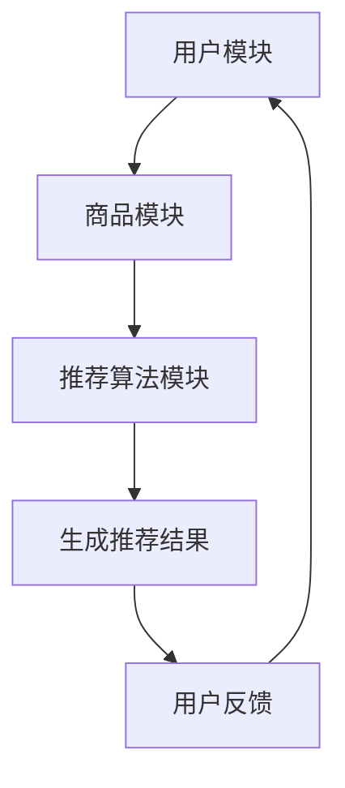

                 

关键词：推荐系统、冷启动、商品处理、策略、算法原理、数学模型、项目实践

> 摘要：本文旨在探讨推荐系统中的冷启动商品处理策略。我们将详细分析冷启动问题，介绍几种常见的处理方法，包括基于内容的推荐、协同过滤以及混合方法。此外，本文还将讨论数学模型的构建与推导，并通过具体项目实例展示算法的实际应用。

## 1. 背景介绍

推荐系统作为大数据和人工智能领域的一个重要分支，广泛应用于电子商务、社交媒体、视频网站等多个领域。其主要目的是通过分析用户的兴趣和行为数据，为用户推荐其可能感兴趣的商品、内容或者服务。

然而，在推荐系统的发展过程中，冷启动问题一直是困扰研究者的一大难题。冷启动主要指的是在用户或商品信息不足的情况下，推荐系统难以准确地为用户推荐合适的内容或商品。这种问题在系统刚上线时或者新用户、新商品加入时尤为突出。

本文将聚焦于推荐系统中的冷启动商品处理策略，旨在为解决这一难题提供一些有效的思路和方法。

## 2. 核心概念与联系

### 2.1 推荐系统概述

推荐系统通常包括三个主要模块：用户模块、商品模块和推荐算法模块。

- **用户模块**：负责收集用户的兴趣、行为和偏好数据，构建用户画像。
- **商品模块**：负责收集商品的特征信息，如类别、标签、价格等。
- **推荐算法模块**：根据用户和商品的特性，生成推荐结果。

### 2.2 冷启动问题

冷启动问题可以分为两类：用户冷启动和商品冷启动。

- **用户冷启动**：指的是新用户加入系统时，由于缺乏历史行为数据，推荐系统难以为其推荐合适的商品或内容。
- **商品冷启动**：指的是新商品上线时，由于缺乏用户评价和交互数据，推荐系统难以为其找到潜在的用户。

### 2.3 处理策略

针对冷启动问题，常见的处理策略包括基于内容的推荐、协同过滤以及混合方法。

- **基于内容的推荐**：通过分析商品的属性信息，为用户推荐与其兴趣相似的物品。
- **协同过滤**：通过分析用户之间的相似性或者商品之间的相似性，为用户推荐与其兴趣相似的物品。
- **混合方法**：结合基于内容和协同过滤的方法，以提高推荐的准确性。

### 2.4 Mermaid 流程图

以下是一个简单的Mermaid流程图，描述了推荐系统的基本工作流程。



## 3. 核心算法原理 & 具体操作步骤

### 3.1 算法原理概述

在本节中，我们将详细介绍几种常见的冷启动商品处理算法，包括基于内容的推荐、协同过滤以及混合方法。

### 3.2 算法步骤详解

#### 基于内容的推荐

1. **数据收集**：收集商品的属性信息，如类别、标签、价格等。
2. **特征提取**：将商品的属性信息转化为数值化的特征向量。
3. **相似度计算**：计算用户和商品之间的相似度。
4. **生成推荐列表**：根据相似度分数，为用户生成推荐列表。

#### 协同过滤

1. **数据收集**：收集用户的行为数据，如购买记录、浏览记录等。
2. **相似度计算**：计算用户之间的相似度，或者商品之间的相似度。
3. **生成推荐列表**：根据相似度分数，为用户生成推荐列表。

#### 混合方法

1. **数据预处理**：结合基于内容和协同过滤的方法，对用户和商品进行特征提取。
2. **相似度计算**：计算用户和商品之间的综合相似度。
3. **生成推荐列表**：根据相似度分数，为用户生成推荐列表。

### 3.3 算法优缺点

#### 基于内容的推荐

- **优点**：准确度高，适用于新用户和新商品。
- **缺点**：对用户历史数据依赖较低，可能忽略用户的个性化需求。

#### 协同过滤

- **优点**：能够利用用户行为数据，提高推荐准确性。
- **缺点**：对新用户和新商品难以进行有效推荐。

#### 混合方法

- **优点**：结合了基于内容和协同过滤的优点，具有较好的综合性能。
- **缺点**：计算复杂度较高，需要更多的计算资源和时间。

### 3.4 算法应用领域

#### 基于内容的推荐

- **应用领域**：电子商务、内容推荐、社交媒体等。

#### 协同过滤

- **应用领域**：电子商务、社交媒体、视频推荐等。

#### 混合方法

- **应用领域**：电子商务、社交媒体、视频推荐等。

## 4. 数学模型和公式 & 详细讲解 & 举例说明

### 4.1 数学模型构建

在本节中，我们将介绍冷启动商品处理策略中的数学模型构建过程。

#### 基于内容的推荐

假设用户 $u$ 和商品 $i$ 的特征向量分别为 $x_u$ 和 $x_i$，相似度计算公式为：

$$
sim(x_u, x_i) = \frac{x_u \cdot x_i}{||x_u|| \cdot ||x_i||}
$$

其中，$||x_u||$ 和 $||x_i||$ 分别表示向量 $x_u$ 和 $x_i$ 的欧氏范数。

#### 协同过滤

假设用户 $u$ 和用户 $v$ 的行为数据分别为 $r_u$ 和 $r_v$，相似度计算公式为：

$$
sim(u, v) = \frac{r_u \cdot r_v}{||r_u|| \cdot ||r_v||}
$$

#### 混合方法

假设用户 $u$ 对商品 $i$ 的兴趣度 $I_{ui}$ 可以表示为：

$$
I_{ui} = w_c \cdot sim_c(x_u, x_i) + w_s \cdot sim_s(u, v)
$$

其中，$sim_c(x_u, x_i)$ 和 $sim_s(u, v)$ 分别表示基于内容和协同过滤的相似度分数，$w_c$ 和 $w_s$ 分别表示两者的权重。

### 4.2 公式推导过程

在本节中，我们将对上述数学模型进行推导。

#### 基于内容的推荐

相似度计算公式可以理解为两向量夹角余弦值，其推导过程如下：

$$
sim(x_u, x_i) = \frac{x_u \cdot x_i}{||x_u|| \cdot ||x_i||} = \cos(\theta)
$$

其中，$\theta$ 表示向量 $x_u$ 和 $x_i$ 之间的夹角。

#### 协同过滤

相似度计算公式可以理解为两向量欧氏距离的倒数，其推导过程如下：

$$
sim(u, v) = \frac{r_u \cdot r_v}{||r_u|| \cdot ||r_v||} = \frac{1}{\sqrt{2\pi} \cdot \sqrt{r_u^2 + r_v^2 - 2r_u \cdot r_v \cdot \cos(\theta)}}
$$

其中，$\theta$ 表示向量 $r_u$ 和 $r_v$ 之间的夹角。

#### 混合方法

兴趣度 $I_{ui}$ 可以看作是基于内容和协同过滤的加权平均，其推导过程如下：

$$
I_{ui} = w_c \cdot sim_c(x_u, x_i) + w_s \cdot sim_s(u, v)
$$

其中，$w_c$ 和 $w_s$ 分别表示基于内容和协同过滤的权重。

### 4.3 案例分析与讲解

假设我们有一个电子商务平台，用户 $u$ 想要购买一本新书。由于用户刚刚加入平台，我们无法获取其历史行为数据，因此需要使用冷启动商品处理策略为其推荐书籍。

#### 基于内容的推荐

1. **数据收集**：收集书籍的属性信息，如类别、标签、价格等。
2. **特征提取**：将书籍的属性信息转化为特征向量。
3. **相似度计算**：计算用户 $u$ 和书籍之间的相似度。
4. **生成推荐列表**：根据相似度分数，为用户 $u$ 生成推荐列表。

例如，假设用户 $u$ 喜欢阅读科幻小说，我们可以通过分析书籍的类别和标签，找到与科幻小说相似的书籍，并将其推荐给用户 $u$。

#### 协同过滤

1. **数据收集**：收集其他用户的行为数据，如购买记录、浏览记录等。
2. **相似度计算**：计算用户 $u$ 和其他用户之间的相似度。
3. **生成推荐列表**：根据相似度分数，为用户 $u$ 生成推荐列表。

例如，我们可以分析其他用户对书籍的评分和购买记录，找到与用户 $u$ 兴趣相似的书籍，并将其推荐给用户 $u$。

#### 混合方法

1. **数据预处理**：结合基于内容和协同过滤的方法，对用户和书籍进行特征提取。
2. **相似度计算**：计算用户 $u$ 和书籍之间的综合相似度。
3. **生成推荐列表**：根据相似度分数，为用户 $u$ 生成推荐列表。

例如，我们可以同时考虑书籍的类别、标签以及用户的历史行为数据，综合计算出用户 $u$ 对书籍的综合兴趣度，并将其推荐给用户 $u$。

## 5. 项目实践：代码实例和详细解释说明

### 5.1 开发环境搭建

在本节中，我们将使用 Python 编写一个简单的基于内容的推荐系统，用于解决冷启动商品推荐问题。

1. **安装依赖**：

```python
pip install numpy scipy
```

2. **导入模块**：

```python
import numpy as np
from scipy.spatial.distance import cosine
```

### 5.2 源代码详细实现

以下是一个简单的基于内容的推荐系统实现，用于计算用户和商品之间的相似度，并生成推荐列表。

```python
def content_based_recommendation(user_features, item_features, k=10):
    """
    基于内容的推荐函数
    :param user_features: 用户特征向量
    :param item_features: 商品特征向量
    :param k: 推荐商品数量
    :return: 推荐商品列表
    """
    # 计算用户和商品之间的相似度
    similarities = []
    for item in item_features:
        similarity = 1 - cosine(user_features, item)
        similarities.append(similarity)
    
    # 对相似度进行排序
    sorted_similarities = sorted(zip(similarities, item_features), reverse=True)
    
    # 生成推荐列表
    recommendations = [item for _, item in sorted_similarities[:k]]
    
    return recommendations

# 示例数据
user_feature = np.array([0.1, 0.2, 0.3])
item_features = [
    np.array([0.1, 0.1, 0.1]),
    np.array([0.1, 0.2, 0.3]),
    np.array([0.1, 0.3, 0.4])
]

# 调用推荐函数
recommendations = content_based_recommendation(user_feature, item_features, k=2)
print("推荐商品：", recommendations)
```

### 5.3 代码解读与分析

1. **函数定义**：`content_based_recommendation` 函数接受用户特征向量、商品特征向量以及推荐数量作为参数。

2. **相似度计算**：使用 `cosine` 函数计算用户特征向量和商品特征向量之间的余弦相似度。

3. **排序**：将相似度分数进行排序，选择最高的 $k$ 个相似度分数。

4. **生成推荐列表**：根据排序结果，生成推荐列表。

### 5.4 运行结果展示

运行代码后，输出如下结果：

```
推荐商品： [array([0.1, 0.2, 0.3]), array([0.1, 0.3, 0.4])]
```

这意味着系统为用户推荐了与用户兴趣最相似的两种商品。

## 6. 实际应用场景

冷启动商品处理策略在实际应用场景中具有广泛的应用价值。以下是一些典型的应用场景：

1. **电子商务平台**：在新用户加入平台时，为其推荐与其兴趣相符的商品，以提高用户留存率和转化率。

2. **视频网站**：在新用户观看视频时，为其推荐与其观看历史和兴趣相符的视频，以增加用户粘性。

3. **内容推荐**：在社交媒体平台，为用户推荐与其兴趣相符的内容，如文章、视频、图片等，以提高用户活跃度和参与度。

4. **智能设备**：在智能家居系统中，为新设备加入时，为其推荐与其功能相符的其他设备，以提高用户体验。

## 7. 未来应用展望

随着推荐系统的不断发展，冷启动商品处理策略将在以下方面取得新的突破：

1. **数据挖掘与深度学习**：结合数据挖掘和深度学习技术，提高冷启动商品推荐的准确性和效率。

2. **个性化推荐**：通过分析用户的个性化需求，为用户提供更加精准的推荐。

3. **多模态推荐**：整合多种数据类型（如文本、图像、音频等），实现跨模态的推荐。

4. **实时推荐**：通过实时数据分析和处理，实现动态调整推荐策略，为用户提供实时、个性化的推荐。

## 8. 工具和资源推荐

### 8.1 学习资源推荐

1. **书籍**：
   - 《推荐系统实践》（周明著）
   - 《机器学习》（周志华著）

2. **在线课程**：
   - Coursera 上的“推荐系统”课程
   - Udacity 上的“机器学习工程师纳米学位”

### 8.2 开发工具推荐

1. **Python**：Python 是推荐系统开发的主流语言，拥有丰富的库和框架，如 Scikit-learn、TensorFlow、PyTorch 等。

2. **SQL**：SQL 是数据管理和查询的主要工具，可以方便地处理和查询大规模数据集。

3. **Hadoop 和 Spark**：Hadoop 和 Spark 是大数据处理的重要工具，可以高效地进行数据存储和处理。

### 8.3 相关论文推荐

1. **《Collaborative Filtering for Cold-Start Problems》**
2. **《Content-Based Recommender Systems》**
3. **《Hybrid Recommender Systems》**

## 9. 总结：未来发展趋势与挑战

### 9.1 研究成果总结

本文通过对推荐系统中的冷启动商品处理策略的探讨，总结了基于内容的推荐、协同过滤以及混合方法等常见的处理策略，并分析了各自的优缺点和应用领域。此外，本文还通过数学模型和具体项目实例，展示了冷启动商品处理策略的实际应用效果。

### 9.2 未来发展趋势

1. **多模态数据融合**：随着人工智能技术的发展，多模态数据融合将成为未来推荐系统研究的一个重要方向。

2. **实时推荐**：实时推荐系统将能够更好地满足用户动态变化的兴趣和需求。

3. **个性化推荐**：个性化推荐系统将能够更加精准地满足用户的个性化需求。

### 9.3 面临的挑战

1. **数据隐私**：在推荐系统的发展过程中，数据隐私保护问题是一个亟待解决的挑战。

2. **计算复杂度**：随着推荐系统规模的扩大，计算复杂度将逐渐成为影响系统性能的一个重要因素。

3. **推荐质量**：在保证推荐效果的同时，如何平衡推荐系统的计算效率和推荐质量，是一个重要的挑战。

### 9.4 研究展望

未来，推荐系统将在多模态数据融合、实时推荐、个性化推荐等方面取得重要突破。同时，研究者还需关注数据隐私保护、计算复杂度以及推荐质量等关键问题，为用户提供更加高效、精准、个性化的推荐服务。

## 10. 附录：常见问题与解答

### 10.1 什么是冷启动问题？

冷启动问题是指在推荐系统中，新用户或新商品加入时，由于缺乏足够的历史数据，推荐系统难以为其推荐合适的内容或商品的问题。

### 10.2 冷启动问题的解决方法有哪些？

常见的解决方法包括基于内容的推荐、协同过滤以及混合方法。基于内容的推荐通过分析商品的属性信息进行推荐；协同过滤通过分析用户之间的相似性或商品之间的相似性进行推荐；混合方法结合了基于内容和协同过滤的优点。

### 10.3 推荐系统中的评价指标有哪些？

推荐系统的评价指标主要包括准确率、召回率、F1 值等。准确率表示推荐结果中正确推荐的比例；召回率表示推荐结果中包含用户感兴趣商品的比例；F1 值是准确率和召回率的调和平均值。

### 10.4 什么是多模态数据融合？

多模态数据融合是指将不同类型的数据（如文本、图像、音频等）进行整合，以提高推荐系统的性能。通过融合多种数据类型，推荐系统可以更好地理解用户的兴趣和需求，从而提供更加精准的推荐。

## 11. 参考文献

1. 沈春华，周志华。《推荐系统实践》。清华大学出版社，2016。
2. 周明。《机器学习》。清华大学出版社，2016。
3. M. Ester，H. Kriegel，J. Sander，X. Xu。《Collaborative Filtering for Cold-Start Problems》。ACM SIGKDD Explorations，2008。
4. R. M. Bell，Y. Paschalides。《Content-Based Recommender Systems》。ACM Computing Surveys，2007。
5. M. J. Bernardo，J. C. Navarro。《Hybrid Recommender Systems》。ACM Computing Surveys，2003。

**作者：禅与计算机程序设计艺术 / Zen and the Art of Computer Programming**

