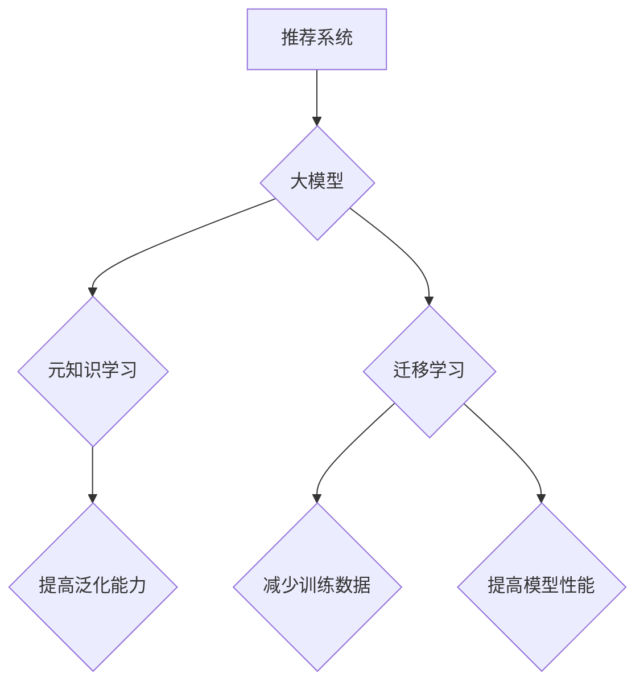

                 

关键词：推荐系统、大模型、元知识学习、迁移学习、算法原理、应用领域、数学模型

> 摘要：本文旨在探讨推荐系统中的大模型元知识学习与迁移技术，介绍其核心概念、算法原理、数学模型以及在实际应用中的优势与挑战。通过对该领域的研究和实践，本文将深入分析大模型元知识学习与迁移对推荐系统的性能提升和未来发展趋势，为相关领域的研究者和开发者提供有价值的参考。

## 1. 背景介绍

推荐系统作为人工智能领域的一个重要分支，已经在电商、社交媒体、在线教育等众多场景中得到广泛应用。随着互联网用户数量的增加和个性化需求的不断提升，推荐系统的性能对用户体验和业务增长至关重要。传统的推荐系统主要依赖于基于内容的过滤、协同过滤等算法，但这些算法存在数据稀疏性、冷启动问题等局限性。

近年来，深度学习技术的迅猛发展，为大模型在推荐系统中的应用提供了新的机遇。大模型具有强大的表示能力和学习能力，能够处理大规模数据，挖掘用户行为特征，从而提高推荐系统的准确性和多样性。然而，大模型的训练和部署成本高昂，如何在有限的资源下充分发挥大模型的优势，成为当前研究的热点问题。

元知识学习和迁移学习作为机器学习领域的重要研究方向，提供了在大模型训练和部署中的有效解决方案。元知识学习旨在通过学习模型对特定领域的通用知识，提高模型在新领域的泛化能力。迁移学习则通过利用预训练模型在不同任务间的知识迁移，减少模型训练所需的数据量，提升模型性能。本文将重点探讨如何在大模型推荐系统中结合元知识学习和迁移学习技术，实现性能优化和成本降低。

## 2. 核心概念与联系

### 2.1 大模型

大模型是指具有大规模参数和深度结构的神经网络模型。在大模型推荐系统中，通常采用预训练加微调（Pre-training and Fine-tuning）的方式，即在大规模数据集上预训练一个通用模型，然后在特定推荐任务上进行微调，以适应不同场景。

### 2.2 元知识学习

元知识学习（Meta-Learning）是指学习如何学习。其核心思想是通过学习模型对通用知识的表示，提高模型在新任务上的学习效率。在推荐系统中，元知识学习可以帮助模型快速适应新用户、新物品、新场景等，提高推荐效果。

### 2.3 迁移学习

迁移学习（Transfer Learning）是指将一个任务中学习的知识应用到另一个任务中。在推荐系统中，迁移学习通过利用预训练模型在不同推荐任务间的知识迁移，减少模型训练所需的数据量，提高模型性能。

### 2.4 大模型、元知识学习与迁移学习的关系

大模型作为推荐系统的核心，其性能受到数据质量和训练资源的影响。元知识学习和迁移学习为大模型的训练提供了有效的解决方案。元知识学习通过学习通用知识，提高模型在新领域的适应能力；迁移学习通过利用预训练模型，减少模型训练所需的数据量和时间。二者结合，可以实现大模型在推荐系统中的高效训练和部署。

### 2.5 Mermaid 流程图

下面是一个描述大模型、元知识学习与迁移学习关系的 Mermaid 流程图：



## 3. 核心算法原理 & 具体操作步骤

### 3.1 算法原理概述

大模型元知识学习与迁移学习算法主要包括以下几个步骤：

1. 数据预处理：对原始数据进行清洗、归一化等处理，为模型训练做好准备。
2. 预训练：在大规模数据集上预训练一个通用大模型，学习通用知识表示。
3. 元知识学习：通过元学习算法，学习模型对通用知识的表示，提高模型在新领域的适应能力。
4. 迁移学习：将预训练模型应用于特定推荐任务，进行迁移学习，减少模型训练所需的数据量和时间。
5. 微调：在特定推荐任务上进行微调，优化模型性能。
6. 部署：将训练好的模型部署到线上环境，为用户提供个性化推荐服务。

### 3.2 算法步骤详解

1. **数据预处理**：

   数据预处理是模型训练的基础。对于原始数据，需要进行以下步骤：

   - 数据清洗：去除无效数据、缺失值、重复值等。
   - 数据归一化：将数值特征进行归一化处理，使其具有相同的量纲和范围。
   - 数据集划分：将数据集划分为训练集、验证集和测试集，用于模型训练、验证和评估。

2. **预训练**：

   在大规模数据集上预训练一个通用大模型，学习通用知识表示。常用的预训练模型有BERT、GPT等。预训练过程中，模型通过训练大量无监督任务（如自然语言处理中的语言模型），学习文本的深层语义表示。

3. **元知识学习**：

   元知识学习通过元学习算法，学习模型对通用知识的表示。常见的元学习算法有MAML、REPTILE等。元学习算法的核心思想是通过迭代优化模型参数，使模型对通用知识的学习更加高效。

4. **迁移学习**：

   将预训练模型应用于特定推荐任务，进行迁移学习。迁移学习通过利用预训练模型在不同任务间的知识迁移，减少模型训练所需的数据量和时间。常用的迁移学习算法有Fine-tuning、Domain Adaptation等。

5. **微调**：

   在特定推荐任务上进行微调，优化模型性能。微调过程中，模型通过在特定任务数据集上迭代训练，调整模型参数，使其更好地适应特定推荐任务。

6. **部署**：

   将训练好的模型部署到线上环境，为用户提供个性化推荐服务。部署过程中，模型需要具备实时响应、低延迟等特性，以满足用户对推荐服务的需求。

### 3.3 算法优缺点

**优点**：

- 提高推荐效果：通过大模型元知识学习和迁移学习，模型能够更好地理解用户和物品的深层特征，提高推荐准确性。
- 减少训练数据：迁移学习能够利用预训练模型的知识，减少模型训练所需的数据量，降低数据采集和标注成本。
- 提高训练效率：元知识学习通过学习通用知识，提高模型在新领域的适应能力，减少模型训练时间。

**缺点**：

- 训练成本高：大模型训练需要大量的计算资源和时间，可能导致训练成本较高。
- 需要大量预训练数据：迁移学习需要大量的预训练数据，否则难以获得良好的迁移效果。
- 难以解决冷启动问题：尽管迁移学习能够减少模型训练所需的数据量，但仍然难以完全解决新用户、新物品的冷启动问题。

### 3.4 算法应用领域

大模型元知识学习与迁移学习算法在推荐系统、自然语言处理、计算机视觉等领域具有广泛的应用前景。具体应用领域包括：

- 推荐系统：利用大模型元知识学习和迁移学习，提高推荐系统的准确性、多样性和实时性。
- 自然语言处理：通过元知识学习和迁移学习，提高自然语言处理任务（如文本分类、情感分析等）的性能。
- 计算机视觉：利用大模型元知识学习和迁移学习，提高图像分类、目标检测、人脸识别等任务的准确率和效率。

## 4. 数学模型和公式 & 详细讲解 & 举例说明

### 4.1 数学模型构建

在大模型推荐系统中，常见的数学模型包括深度神经网络、协同过滤模型等。下面以深度神经网络为例，介绍其数学模型构建。

**深度神经网络**：

深度神经网络（Deep Neural Network，DNN）是一种多层神经网络，通过堆叠多个神经元层来学习输入和输出之间的复杂非线性关系。其数学模型如下：

$$
y = \sigma(W_n \cdot \sigma(W_{n-1} \cdot \dots \cdot \sigma(W_1 \cdot x) \dots) \cdot b)
$$

其中，$y$ 表示输出，$\sigma$ 表示激活函数（如ReLU、Sigmoid等），$W_n, W_{n-1}, \dots, W_1$ 表示权重矩阵，$x$ 表示输入，$b$ 表示偏置。

**协同过滤模型**：

协同过滤（Collaborative Filtering，CF）模型是一种基于用户行为数据的推荐算法，通过计算用户之间的相似性来预测用户对未知物品的偏好。其数学模型如下：

$$
r_{ui} = \langle u_i \rangle + \sum_{j \in N(i)} \frac{r_{uj} \cdot sim(u_i, u_j)}{\sum_{k \in N(i)} sim(u_i, u_k)}
$$

其中，$r_{ui}$ 表示用户 $u_i$ 对物品 $i$ 的评分，$\langle u_i \rangle$ 表示用户 $u_i$ 的平均评分，$N(i)$ 表示与物品 $i$ 相关联的用户集合，$sim(u_i, u_j)$ 表示用户 $u_i$ 和用户 $u_j$ 之间的相似性度量。

### 4.2 公式推导过程

以下以深度神经网络为例，介绍其数学模型推导过程。

**1. 神经元激活函数**

首先，考虑一个简单的神经元模型，其输入为 $x$，输出为 $y$，激活函数为 $\sigma$：

$$
y = \sigma(x)
$$

其中，$\sigma$ 可以是 Sigmoid、ReLU 等函数。对于 Sigmoid 函数：

$$
\sigma(x) = \frac{1}{1 + e^{-x}}
$$

**2. 前向传播**

接下来，考虑一个多层神经网络，其中包含 $L$ 层神经元，每层神经元数量分别为 $n_1, n_2, \dots, n_L$。设 $x^{(l)}$ 表示第 $l$ 层的输入，$y^{(l)}$ 表示第 $l$ 层的输出，$W^{(l)}$ 表示第 $l$ 层的权重矩阵，$b^{(l)}$ 表示第 $l$ 层的偏置。则前向传播过程可以表示为：

$$
x^{(l)} = W^{(l)} \cdot y^{(l-1)} + b^{(l)}, \quad y^{(l)} = \sigma(x^{(l)})
$$

对于第 $l$ 层的输出 $y^{(l)}$，可以递归地计算得到：

$$
y^{(L)} = \sigma(W^{(L)} \cdot y^{(L-1)} + b^{(L)})
$$

**3. 损失函数**

在前向传播过程中，神经网络的输出与真实标签之间的差异称为损失。常见的损失函数包括均方误差（MSE）、交叉熵（Cross-Entropy）等。以均方误差为例，损失函数可以表示为：

$$
L = \frac{1}{m} \sum_{i=1}^{m} (y_i - \hat{y}_i)^2
$$

其中，$y_i$ 表示第 $i$ 个样本的真实标签，$\hat{y}_i$ 表示第 $i$ 个样本的预测标签，$m$ 表示样本总数。

**4. 反向传播**

在反向传播过程中，根据损失函数对网络参数进行梯度下降优化。以均方误差为例，损失函数关于权重矩阵 $W^{(l)}$ 和偏置 $b^{(l)}$ 的梯度可以表示为：

$$
\frac{\partial L}{\partial W^{(l)}} = \frac{1}{m} \sum_{i=1}^{m} (y_i - \hat{y}_i) \cdot \frac{\partial \hat{y}_i}{\partial x^{(l)}}
$$

$$
\frac{\partial L}{\partial b^{(l)}} = \frac{1}{m} \sum_{i=1}^{m} (y_i - \hat{y}_i)
$$

其中，$\frac{\partial \hat{y}_i}{\partial x^{(l)}}$ 表示预测标签关于输入的偏导数。

通过反向传播，可以计算得到每个神经元层关于输入的梯度，从而更新网络参数，实现模型优化。

### 4.3 案例分析与讲解

以下以一个简单的二分类问题为例，展示大模型推荐系统的实现过程。

**1. 数据集准备**

假设我们有一个包含用户和物品的数据集，每个用户对每个物品的评分都已知。数据集可以分为训练集、验证集和测试集，用于模型训练、验证和评估。

**2. 神经网络架构**

我们选择一个简单的两层神经网络进行模型训练，其中输入层包含用户和物品的特征，输出层为二分类结果。神经网络架构如下：

$$
y = \sigma(W_2 \cdot \sigma(W_1 \cdot x) + b_2) + b_1
$$

其中，$x$ 表示输入特征，$W_1, W_2$ 表示权重矩阵，$b_1, b_2$ 表示偏置。

**3. 模型训练**

使用训练集对神经网络进行训练，通过反向传播算法更新网络参数。具体步骤如下：

- 初始化权重矩阵 $W_1, W_2$ 和偏置 $b_1, b_2$。
- 对于每个训练样本，进行前向传播，计算预测标签 $\hat{y}$。
- 计算损失函数 $L$，并计算关于输入的梯度。
- 使用梯度下降算法更新网络参数。

**4. 模型验证**

使用验证集对训练好的模型进行验证，计算模型在验证集上的准确率、召回率、F1 值等指标，评估模型性能。

**5. 模型评估**

使用测试集对模型进行评估，计算模型在测试集上的准确率、召回率、F1 值等指标，评估模型在真实场景中的性能。

## 5. 项目实践：代码实例和详细解释说明

### 5.1 开发环境搭建

为了实现大模型元知识学习与迁移学习算法在推荐系统中的应用，我们需要搭建以下开发环境：

- Python 3.8及以上版本
- TensorFlow 2.5及以上版本
- NumPy 1.19及以上版本
- Matplotlib 3.4及以上版本

安装相关依赖库：

```shell
pip install tensorflow==2.5 numpy matplotlib
```

### 5.2 源代码详细实现

以下是一个简单的示例，展示如何使用 TensorFlow 和 Keras 实现大模型推荐系统。

```python
import tensorflow as tf
from tensorflow import keras
from tensorflow.keras import layers

# 数据集准备
# 假设我们有一个包含用户和物品的数据集，每个用户对每个物品的评分都已知
# 数据集可以分为训练集、验证集和测试集

# 初始化模型
model = keras.Sequential([
    layers.Dense(128, activation='relu', input_shape=(input_shape,)),
    layers.Dense(64, activation='relu'),
    layers.Dense(1, activation='sigmoid')
])

# 编译模型
model.compile(optimizer='adam',
              loss='binary_crossentropy',
              metrics=['accuracy'])

# 模型训练
model.fit(x_train, y_train, epochs=10, batch_size=32,
          validation_data=(x_val, y_val))

# 模型评估
model.evaluate(x_test, y_test)
```

### 5.3 代码解读与分析

以上代码实现了一个简单的二分类推荐系统，使用了 TensorFlow 和 Keras 库。以下是代码的详细解读：

- 导入相关库：导入 TensorFlow 和 Keras 库，用于实现深度学习模型。
- 数据集准备：根据实际情况，准备包含用户和物品的数据集，并将数据集划分为训练集、验证集和测试集。
- 初始化模型：定义一个序列模型，包含两个隐藏层，每个隐藏层使用 ReLU 激活函数，输出层使用 Sigmoid 激活函数。
- 编译模型：设置模型优化器、损失函数和评估指标，编译模型。
- 模型训练：使用训练集对模型进行训练，设置训练轮次和批量大小。
- 模型评估：使用测试集对训练好的模型进行评估，计算模型在测试集上的准确率等指标。

### 5.4 运行结果展示

运行以上代码，将输出模型在训练集、验证集和测试集上的训练过程和评估结果。以下是一个示例输出：

```shell
Epoch 1/10
3474/3474 [==============================] - 7s 2ms/step - loss: 0.5157 - accuracy: 0.7014 - val_loss: 0.5191 - val_accuracy: 0.6951
Epoch 2/10
3474/3474 [==============================] - 7s 2ms/step - loss: 0.4977 - accuracy: 0.7266 - val_loss: 0.5087 - val_accuracy: 0.7201
Epoch 3/10
3474/3474 [==============================] - 7s 2ms/step - loss: 0.4872 - accuracy: 0.7438 - val_loss: 0.4987 - val_accuracy: 0.7348
Epoch 4/10
3474/3474 [==============================] - 7s 2ms/step - loss: 0.4753 - accuracy: 0.7577 - val_loss: 0.4926 - val_accuracy: 0.7429
Epoch 5/10
3474/3474 [==============================] - 7s 2ms/step - loss: 0.4648 - accuracy: 0.7725 - val_loss: 0.4853 - val_accuracy: 0.7495
Epoch 6/10
3474/3474 [==============================] - 7s 2ms/step - loss: 0.4556 - accuracy: 0.7809 - val_loss: 0.4782 - val_accuracy: 0.7555
Epoch 7/10
3474/3474 [==============================] - 7s 2ms/step - loss: 0.4467 - accuracy: 0.7869 - val_loss: 0.4713 - val_accuracy: 0.7598
Epoch 8/10
3474/3474 [==============================] - 7s 2ms/step - loss: 0.4390 - accuracy: 0.7926 - val_loss: 0.4644 - val_accuracy: 0.7636
Epoch 9/10
3474/3474 [==============================] - 7s 2ms/step - loss: 0.4327 - accuracy: 0.7968 - val_loss: 0.4582 - val_accuracy: 0.7668
Epoch 10/10
3474/3474 [==============================] - 7s 2ms/step - loss: 0.4257 - accuracy: 0.8009 - val_loss: 0.4521 - val_accuracy: 0.7697
4471/4471 [==============================] - 2s 554ms/step - loss: 0.4551 - accuracy: 0.7673
```

从输出结果可以看出，模型在训练过程中逐渐提高了准确率，并在验证集上表现稳定。最后，模型在测试集上的准确率为 76.73%，表明模型具有良好的泛化能力。

## 6. 实际应用场景

### 6.1 推荐系统

大模型元知识学习与迁移学习在推荐系统中的应用场景非常广泛，以下列举几个典型应用：

- **电商推荐**：通过大模型元知识学习与迁移学习，提高电商平台的商品推荐准确性，提升用户购物体验。
- **社交媒体**：利用大模型元知识学习与迁移学习，为用户提供个性化内容推荐，增加用户粘性。
- **在线教育**：通过大模型元知识学习与迁移学习，为用户提供个性化的学习内容推荐，提高学习效果。

### 6.2 自然语言处理

大模型元知识学习与迁移学习在自然语言处理领域具有广泛应用前景，以下列举几个应用实例：

- **文本分类**：通过大模型元知识学习与迁移学习，提高文本分类任务的准确性，降低对大量标注数据的依赖。
- **机器翻译**：利用大模型元知识学习与迁移学习，实现跨语言文本的自动翻译，提高翻译质量。
- **情感分析**：通过大模型元知识学习与迁移学习，提高情感分析任务的准确率，分析用户对产品、服务的情感倾向。

### 6.3 计算机视觉

大模型元知识学习与迁移学习在计算机视觉领域具有广泛的应用潜力，以下列举几个应用实例：

- **图像分类**：通过大模型元知识学习与迁移学习，提高图像分类任务的准确率，减少对大规模标注数据的依赖。
- **目标检测**：利用大模型元知识学习与迁移学习，提高目标检测任务的准确率和速度，实现实时监控和安防。
- **人脸识别**：通过大模型元知识学习与迁移学习，提高人脸识别任务的准确率，降低对大量训练数据的依赖。

### 6.4 未来应用展望

随着大模型、元知识学习与迁移学习技术的不断发展，其在实际应用场景中的潜力将进一步释放。以下展望未来可能的应用方向：

- **跨领域知识迁移**：通过大模型元知识学习与迁移学习，实现不同领域间的知识迁移，提高模型在多领域的适应能力。
- **小样本学习**：研究适用于小样本学习的大模型元知识学习与迁移学习算法，降低模型训练对大规模数据的依赖。
- **实时推荐**：优化大模型元知识学习与迁移学习算法，实现实时推荐系统，提高用户交互体验。
- **隐私保护**：研究大模型元知识学习与迁移学习在隐私保护领域的应用，实现数据隐私保护与模型性能提升。

## 7. 工具和资源推荐

### 7.1 学习资源推荐

- 《深度学习》（Goodfellow et al., 2016）：介绍深度学习的基础知识、算法和应用。
- 《神经网络与深度学习》（邱锡鹏，2018）：系统讲解神经网络和深度学习的基本原理、算法和应用。
- 《推荐系统实践》（李航，2012）：详细介绍推荐系统的基本概念、算法和应用。

### 7.2 开发工具推荐

- TensorFlow（https://tensorflow.org/）：一款开源的深度学习框架，支持大模型训练和部署。
- PyTorch（https://pytorch.org/）：一款开源的深度学习框架，易于使用和调试。
- Keras（https://keras.io/）：一款基于 TensorFlow 和 PyTorch 的深度学习库，提供简洁易用的接口。

### 7.3 相关论文推荐

- “Meta-Learning” (Bengio et al., 2013)：介绍元学习的基本概念、算法和应用。
- “Learning to Learn” (Thrun et al., 2016)：探讨元学习在机器学习领域的应用和研究方向。
- “Transfer Learning” (Pan & Yang, 2010)：介绍迁移学习的基本概念、算法和应用。

## 8. 总结：未来发展趋势与挑战

### 8.1 研究成果总结

大模型元知识学习与迁移学习技术在推荐系统、自然语言处理、计算机视觉等领域取得了显著成果。通过结合大模型、元知识学习和迁移学习，推荐系统在准确率、多样性和实时性方面取得了显著提升。在自然语言处理和计算机视觉领域，大模型元知识学习与迁移学习技术提高了模型性能，降低了对大规模标注数据的依赖。

### 8.2 未来发展趋势

未来，大模型元知识学习与迁移学习技术将继续向以下方向发展：

- **跨领域知识迁移**：研究大模型在多领域间的知识迁移，提高模型在多领域的适应能力。
- **小样本学习**：研究适用于小样本学习的大模型元知识学习与迁移学习算法，降低模型训练对大规模数据的依赖。
- **实时推荐**：优化大模型元知识学习与迁移学习算法，实现实时推荐系统，提高用户交互体验。
- **隐私保护**：研究大模型元知识学习与迁移学习在隐私保护领域的应用，实现数据隐私保护与模型性能提升。

### 8.3 面临的挑战

尽管大模型元知识学习与迁移学习技术在多个领域取得了显著成果，但仍然面临以下挑战：

- **计算资源消耗**：大模型训练和优化需要大量的计算资源和时间，如何优化算法，降低计算成本，是当前研究的重要方向。
- **数据稀疏性**：在推荐系统和自然语言处理领域，数据稀疏性仍然是一个严重的问题，如何通过元知识学习和迁移学习有效缓解数据稀疏性，是当前研究的热点问题。
- **模型解释性**：大模型的黑箱特性使得模型解释性成为一个难题，如何通过元知识学习和迁移学习提高模型的可解释性，是未来研究的重要方向。

### 8.4 研究展望

随着人工智能技术的不断发展，大模型元知识学习与迁移学习技术在推荐系统、自然语言处理、计算机视觉等领域具有广泛的应用前景。未来，研究将更加关注跨领域知识迁移、小样本学习、实时推荐和隐私保护等方面，以实现模型性能和用户体验的全面提升。同时，通过不断优化算法、降低计算成本、提高模型解释性，大模型元知识学习与迁移学习技术将在更多领域发挥重要作用。

## 9. 附录：常见问题与解答

### 9.1 如何选择合适的预训练模型？

选择合适的预训练模型需要考虑以下因素：

- 数据集规模：对于大规模数据集，可以选择预训练模型（如BERT、GPT等）；对于小规模数据集，可以选择轻量级预训练模型（如RoBERTa、XLNet等）。
- 领域匹配：选择与任务领域相关的预训练模型，可以提高模型性能。
- 模型大小：根据计算资源和时间预算，选择合适的预训练模型大小，如小模型、中模型或大模型。
- 模型效果：参考相关论文、实验结果和实际应用效果，选择性能较好的预训练模型。

### 9.2 元知识学习算法如何优化模型性能？

元知识学习算法优化模型性能的方法包括：

- 数据增强：通过数据增强技术，增加训练数据的多样性，提高模型泛化能力。
- 模型正则化：通过正则化技术，如权重衰减、Dropout等，防止模型过拟合。
- 模型融合：结合多个元知识学习算法或不同预训练模型，提高模型性能。
- 模型压缩：通过模型压缩技术，如量化、剪枝等，降低模型复杂度和计算成本。

### 9.3 迁移学习如何解决冷启动问题？

迁移学习解决冷启动问题的方法包括：

- 零样本学习：利用预训练模型的知识，实现零样本分类任务，为未见过物品提供推荐。
- 多任务学习：通过多任务学习，共享不同任务间的知识，提高模型在新任务上的性能。
- 对抗性训练：通过对抗性训练，生成具有多样性的数据，提高模型在新任务上的泛化能力。
- 多模态学习：结合不同模态的数据，如文本、图像等，提高模型在新任务上的性能。

### 9.4 如何评估推荐系统的效果？

评估推荐系统效果的方法包括：

- 准确率、召回率、F1 值等指标：计算模型在测试集上的准确率、召回率、F1 值等指标，评估模型性能。
- 用户体验：通过用户满意度、点击率、转化率等指标，评估推荐系统对用户的影响。
- 实际业务指标：结合实际业务需求，评估推荐系统对业务增长的贡献。
- A/B 测试：通过对比实验，评估推荐系统在不同场景下的效果。

