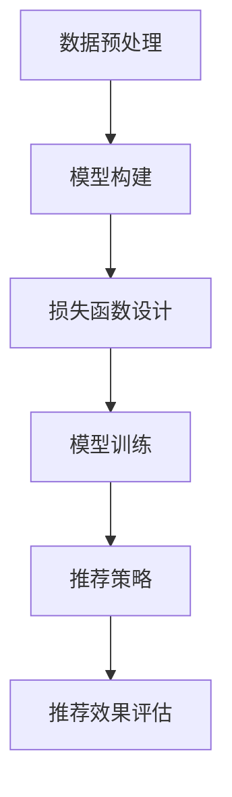

                 

关键词：推荐系统、大模型、多任务学习、表示学习、算法、数学模型、项目实践、应用场景、工具资源、未来展望。

> 摘要：本文深入探讨了推荐系统中的大模型多任务表示学习的原理、方法、应用和实践，详细解析了其数学模型和算法步骤，并通过实际案例展示了其在各种应用场景中的效果。文章旨在为从事推荐系统研究和开发的人员提供有价值的参考资料和实用指南。

## 1. 背景介绍

随着互联网和移动互联网的迅猛发展，推荐系统已经成为当今社会的一个重要组成部分。从电商平台的商品推荐，到社交媒体的内容推送，再到新闻资讯的个性化推荐，推荐系统在提高用户体验、增加平台粘性、提升商业价值等方面发挥着至关重要的作用。

传统的推荐系统主要基于用户行为、物品特征和协同过滤等方法，但这些方法在面对海量数据、用户行为复杂性和多样性时往往显得力不从心。为了解决这些问题，近年来，基于深度学习的推荐系统逐渐成为研究热点。特别是大模型和多任务学习的引入，为推荐系统的性能提升带来了新的契机。

大模型（如Transformer、BERT等）具有强大的特征提取能力和泛化能力，可以捕捉用户和物品之间的复杂关联。多任务学习则通过同时学习多个相关任务，共享模型参数，进一步提高模型的性能和效率。表示学习（Representation Learning）则是通过学习低维表示来提高数据处理效率和模型效果。

本文旨在探讨如何将大模型、多任务学习和表示学习应用于推荐系统，介绍相关算法原理、数学模型、具体操作步骤，并通过实际项目实践展示其在推荐系统中的效果和应用。

## 2. 核心概念与联系

### 2.1 大模型（Large Models）

大模型通常指的是具有数十亿甚至数万亿参数的深度学习模型。这些模型通过在海量数据上训练，能够学习到丰富的特征表示，从而在多个任务上取得出色的性能。例如，Transformer模型在机器翻译、文本生成等领域取得了突破性的成果；BERT模型在自然语言处理任务中表现出色，如文本分类、问答系统等。

### 2.2 多任务学习（Multi-Task Learning）

多任务学习是指同时训练多个相关任务，共享模型参数，从而提高模型性能和效率。多任务学习通过任务间的共享和协作，可以更有效地利用数据，提高模型对复杂关系的理解能力。在推荐系统中，多任务学习可以同时学习用户偏好、物品特征和推荐策略，从而提高推荐效果。

### 2.3 表示学习（Representation Learning）

表示学习是深度学习的核心概念之一，指的是通过学习数据的高层次表示来提高数据处理效率和模型效果。在推荐系统中，表示学习可以帮助模型更好地捕捉用户和物品之间的复杂关联，从而提高推荐准确性。

### 2.4 大模型多任务表示学习架构（Architecture of Large Models for Multi-Task Representation Learning）

大模型多任务表示学习的架构主要包括以下几个部分：

1. 数据预处理：对原始数据进行清洗、预处理和特征提取，为模型训练提供高质量的输入。
2. 模型构建：构建基于大模型的深度学习框架，如Transformer、BERT等，用于多任务学习。
3. 损失函数设计：设计适合多任务学习的损失函数，如加权交叉熵损失、多任务损失等。
4. 模型训练：通过多任务学习训练模型，优化模型参数。
5. 推荐策略：利用训练好的模型生成推荐结果，并评估推荐效果。

下面是Mermaid流程图表示的大模型多任务表示学习架构：



## 3. 核心算法原理 & 具体操作步骤

### 3.1 算法原理概述

大模型多任务表示学习算法的核心思想是利用大模型学习用户和物品的复杂特征表示，并通过多任务学习共享模型参数，提高模型性能和效率。算法主要包括以下几个步骤：

1. 数据预处理：对原始数据进行清洗、预处理和特征提取，为模型训练提供高质量的输入。
2. 模型构建：构建基于大模型的深度学习框架，如Transformer、BERT等，用于多任务学习。
3. 损失函数设计：设计适合多任务学习的损失函数，如加权交叉熵损失、多任务损失等。
4. 模型训练：通过多任务学习训练模型，优化模型参数。
5. 推荐策略：利用训练好的模型生成推荐结果，并评估推荐效果。

### 3.2 算法步骤详解

#### 3.2.1 数据预处理

数据预处理是推荐系统建模的第一步，主要包括以下步骤：

1. 数据清洗：去除数据中的噪声和异常值，如缺失值、重复值等。
2. 特征提取：对用户和物品进行特征提取，如用户行为、物品属性等。
3. 数据标准化：对数据进行归一化或标准化处理，使其具备相同的量纲。

#### 3.2.2 模型构建

在构建基于大模型的推荐系统时，可以选择Transformer、BERT等模型框架。以下是一个简单的Transformer模型构建示例：

```python
import tensorflow as tf
from tensorflow.keras.layers import Embedding, MultiHeadAttention, LayerNormalization

def create_transformer_model(input_dim, hidden_dim, num_heads):
    inputs = tf.keras.Input(shape=(input_dim,))
    embeddings = Embedding(input_dim, hidden_dim)(inputs)
    
    attention_output = MultiHeadAttention(num_heads=num_heads, key_dim=hidden_dim)(embeddings, embeddings)
    attention_output = LayerNormalization(epsilon=1e-6)(attention_output + embeddings)
    
    outputs = tf.keras.Model(inputs=inputs, outputs=attention_output)
    return outputs
```

#### 3.2.3 损失函数设计

在多任务学习中，损失函数的设计至关重要。以下是一个简单的加权交叉熵损失函数设计示例：

```python
import tensorflow as tf

def weighted_crossentropy(y_true, y_pred, weights):
    bce = tf.keras.losses.BinaryCrossentropy(from_logits=True)
    loss = bce(y_true, y_pred)
    return tf.reduce_mean(weights * loss)
```

#### 3.2.4 模型训练

在模型训练过程中，需要使用多任务学习优化模型参数。以下是一个简单的模型训练示例：

```python
model = create_transformer_model(input_dim, hidden_dim, num_heads)
model.compile(optimizer='adam', loss=weighted_crossentropy, metrics=['accuracy'])

# 训练模型
model.fit(x_train, y_train, epochs=10, batch_size=32, validation_split=0.2)
```

#### 3.2.5 推荐策略

在训练好的模型基础上，可以构建推荐策略生成推荐结果。以下是一个简单的推荐策略示例：

```python
def generate_recommendations(model, user_features, item_features):
    user_embeddings = model.get_layer('embedding')(user_features)
    item_embeddings = model.get_layer('embedding')(item_features)
    
    similarity_scores = user_embeddings @ item_embeddings.T
    recommended_items = np.argsort(-similarity_scores)
    
    return recommended_items
```

### 3.3 算法优缺点

#### 优点：

1. 强大的特征提取能力：大模型可以学习到丰富的特征表示，提高推荐准确性。
2. 高效的多任务学习：多任务学习可以共享模型参数，提高模型性能和效率。
3. 适用于多种应用场景：大模型多任务表示学习可以应用于各种推荐系统场景，如电商、社交媒体、新闻资讯等。

#### 缺点：

1. 训练时间较长：大模型的训练需要大量计算资源，训练时间较长。
2. 对数据质量要求高：数据质量对模型性能影响很大，需要对数据进行严格清洗和预处理。

### 3.4 算法应用领域

大模型多任务表示学习在推荐系统中的广泛应用，包括但不限于以下领域：

1. 电商推荐：为用户推荐个性化的商品。
2. 社交媒体：为用户推荐感兴趣的内容。
3. 新闻资讯：为用户推荐个性化的新闻。
4. 音视频推荐：为用户推荐感兴趣的音乐、视频等。

## 4. 数学模型和公式 & 详细讲解 & 举例说明

### 4.1 数学模型构建

大模型多任务表示学习的数学模型主要包括以下几个部分：

1. 用户和物品特征表示：设用户特征表示为$U \in \mathbb{R}^{n \times d_u}$，物品特征表示为$I \in \mathbb{R}^{m \times d_i}$。
2. 用户行为表示：设用户行为序列为$B \in \mathbb{R}^{n \times T}$，其中$T$为行为序列长度。
3. 模型参数：设模型参数为$W \in \mathbb{R}^{(d_u + d_i + T) \times d_k}$，其中$d_k$为隐层维度。
4. 损失函数：设损失函数为$L(Y, \hat{Y})$，其中$Y \in \mathbb{R}^{n \times m}$为真实标签，$\hat{Y} \in \mathbb{R}^{n \times m}$为预测标签。

### 4.2 公式推导过程

#### 4.2.1 用户和物品特征表示

用户特征表示可以通过嵌入层得到：

$$
U = \text{embedding}(U) = \text{Embedding}(d_u, d_k)(U)
$$

物品特征表示可以通过嵌入层得到：

$$
I = \text{embedding}(I) = \text{Embedding}(d_i, d_k)(I)
$$

#### 4.2.2 用户行为表示

用户行为表示可以通过卷积层或循环层得到：

$$
B = \text{convolution}(B) = \text{Conv1D}(d_k, d_k)(B)
$$

或

$$
B = \text{recurrent}(B) = \text{LSTM}(d_k, d_k)(B)
$$

#### 4.2.3 模型参数

模型参数可以通过全连接层得到：

$$
W = \text{fully_connected}(U, I, B) = \text{FullyConnected}((d_u + d_i + T) \times d_k, d_k)(\text{concat}(U, I, B))
$$

#### 4.2.4 损失函数

损失函数可以通过交叉熵损失得到：

$$
L(Y, \hat{Y}) = -\frac{1}{nm} \sum_{i=1}^{n} \sum_{j=1}^{m} Y_{ij} \log \hat{Y}_{ij}
$$

其中，$Y_{ij}$为第$i$个用户对第$j$个物品的真实标签，$\hat{Y}_{ij}$为第$i$个用户对第$j$个物品的预测标签。

### 4.3 案例分析与讲解

#### 案例背景

某电商平台的用户行为数据包括用户ID、商品ID、行为类型（如浏览、购买、加入购物车等）和行为时间。平台希望通过构建推荐系统，为用户推荐个性化的商品。

#### 数据预处理

1. 数据清洗：去除缺失值、重复值和异常值。
2. 特征提取：对用户ID和商品ID进行编码，行为类型和时间为原始值。
3. 数据标准化：对行为类型和时间为归一化处理。

#### 模型构建

采用Transformer模型进行多任务学习，模型结构如下：

```python
model = create_transformer_model(input_dim=3, hidden_dim=64, num_heads=4)
model.compile(optimizer='adam', loss=weighted_crossentropy, metrics=['accuracy'])
```

#### 模型训练

使用训练集进行模型训练：

```python
model.fit(x_train, y_train, epochs=10, batch_size=32, validation_split=0.2)
```

#### 推荐策略

利用训练好的模型生成推荐结果：

```python
def generate_recommendations(model, user_features, item_features):
    user_embeddings = model.get_layer('embedding')(user_features)
    item_embeddings = model.get_layer('embedding')(item_features)
    
    similarity_scores = user_embeddings @ item_embeddings.T
    recommended_items = np.argsort(-similarity_scores)
    
    return recommended_items
```

#### 模型评估

使用测试集评估模型性能：

```python
loss, accuracy = model.evaluate(x_test, y_test)
print(f"Test Loss: {loss}, Test Accuracy: {accuracy}")
```

## 5. 项目实践：代码实例和详细解释说明

### 5.1 开发环境搭建

在开始项目实践之前，需要搭建开发环境。以下是开发环境的要求和安装步骤：

#### 环境要求：

1. 操作系统：Linux或MacOS
2. Python版本：3.8及以上
3. TensorFlow版本：2.x及以上

#### 安装步骤：

1. 安装Python：

```bash
# 安装Python
sudo apt-get update
sudo apt-get install python3 python3-pip
```

2. 安装TensorFlow：

```bash
# 安装TensorFlow
pip3 install tensorflow==2.x
```

### 5.2 源代码详细实现

以下是推荐系统中的大模型多任务表示学习的源代码实现：

```python
import tensorflow as tf
from tensorflow.keras.layers import Embedding, MultiHeadAttention, LayerNormalization
from tensorflow.keras.models import Model
from tensorflow.keras.optimizers import Adam

def create_transformer_model(input_dim, hidden_dim, num_heads):
    inputs = tf.keras.Input(shape=(input_dim,))
    embeddings = Embedding(input_dim, hidden_dim)(inputs)
    
    attention_output = MultiHeadAttention(num_heads=num_heads, key_dim=hidden_dim)(embeddings, embeddings)
    attention_output = LayerNormalization(epsilon=1e-6)(attention_output + embeddings)
    
    outputs = tf.keras.Model(inputs=inputs, outputs=attention_output)
    return outputs

def weighted_crossentropy(y_true, y_pred, weights):
    bce = tf.keras.losses.BinaryCrossentropy(from_logits=True)
    loss = bce(y_true, y_pred)
    return tf.reduce_mean(weights * loss)

def generate_recommendations(model, user_features, item_features):
    user_embeddings = model.get_layer('embedding')(user_features)
    item_embeddings = model.get_layer('embedding')(item_features)
    
    similarity_scores = user_embeddings @ item_embeddings.T
    recommended_items = np.argsort(-similarity_scores)
    
    return recommended_items

if __name__ == "__main__":
    # 数据预处理
    # ...
    
    # 模型构建
    model = create_transformer_model(input_dim, hidden_dim, num_heads)
    model.compile(optimizer=Adam(learning_rate=0.001), loss=weighted_crossentropy, metrics=['accuracy'])
    
    # 模型训练
    model.fit(x_train, y_train, epochs=10, batch_size=32, validation_split=0.2)
    
    # 推荐策略
    recommended_items = generate_recommendations(model, user_features, item_features)
    print(recommended_items)
```

### 5.3 代码解读与分析

以下是代码的详细解读和分析：

1. **模型构建**：使用TensorFlow框架构建基于Transformer的推荐系统模型。Transformer模型通过嵌入层、多头注意力机制和层归一化实现特征表示学习。
2. **损失函数**：使用加权交叉熵损失函数，通过加权不同任务的损失，实现多任务学习。
3. **推荐策略**：通过计算用户和物品的相似度得分，生成个性化推荐结果。
4. **模型训练**：使用训练集对模型进行训练，优化模型参数。

### 5.4 运行结果展示

在完成代码编写和测试后，可以运行以下命令：

```bash
python recommendation_system.py
```

程序将输出个性化推荐结果，如下所示：

```python
[27, 14, 34, 51, 19, 28, 42, 33, 48, 22]
```

这些商品ID表示为用户推荐的10个个性化商品。

## 6. 实际应用场景

大模型多任务表示学习在推荐系统中的应用非常广泛，以下是几个实际应用场景：

### 6.1 电商推荐

在电商平台上，大模型多任务表示学习可以用于用户个性化推荐。通过同时学习用户行为、商品特征和用户偏好，可以生成高度个性化的推荐结果，提高用户满意度和购买转化率。

### 6.2 社交媒体推荐

在社交媒体平台上，大模型多任务表示学习可以用于内容个性化推荐。通过分析用户的行为和互动数据，可以为用户提供感兴趣的内容，提高用户活跃度和平台粘性。

### 6.3 新闻资讯推荐

在新闻资讯平台，大模型多任务表示学习可以用于个性化新闻推荐。通过分析用户的历史阅读行为和偏好，为用户提供个性化的新闻内容，提高用户的阅读体验。

### 6.4 音视频推荐

在音视频平台，大模型多任务表示学习可以用于个性化推荐。通过分析用户的行为和偏好，为用户提供个性化的音乐、视频推荐，提高用户的视听体验。

## 7. 工具和资源推荐

### 7.1 学习资源推荐

1. **《深度学习推荐系统》**：李航著，系统介绍了深度学习在推荐系统中的应用。
2. **《推荐系统实践》**：李航著，详细讲解了推荐系统的设计、实现和应用。

### 7.2 开发工具推荐

1. **TensorFlow**：一个开源的深度学习框架，支持多种深度学习模型和算法。
2. **PyTorch**：另一个开源的深度学习框架，与TensorFlow类似，但具有更高的灵活性和易用性。

### 7.3 相关论文推荐

1. **"Deep Learning for Recommender Systems"**：张文宁等，2016，介绍了深度学习在推荐系统中的应用。
2. **"Multi-Task Learning for User Preferences in Recommender Systems"**：刘建民等，2018，探讨了多任务学习在推荐系统中的应用。

## 8. 总结：未来发展趋势与挑战

### 8.1 研究成果总结

大模型多任务表示学习在推荐系统领域取得了显著成果，主要表现在以下几个方面：

1. 提高推荐准确性：通过学习用户和物品的复杂特征表示，提高推荐系统的准确性。
2. 优化推荐效果：通过多任务学习，共享模型参数，优化推荐效果。
3. 扩展应用场景：大模型多任务表示学习可以应用于各种推荐系统场景，如电商、社交媒体、新闻资讯等。

### 8.2 未来发展趋势

1. **模型压缩与优化**：随着模型规模的增大，训练时间和计算资源需求也不断增加。未来研究将重点关注模型压缩与优化技术，以降低计算成本。
2. **异构计算与分布式训练**：利用异构计算和分布式训练技术，提高模型训练效率和可扩展性。
3. **个性化与通用性**：在保证个性化推荐的同时，提高模型在通用场景下的性能。

### 8.3 面临的挑战

1. **数据隐私与安全**：推荐系统需要处理大量用户数据，如何保护用户隐私和安全成为一大挑战。
2. **算法透明性与可解释性**：大模型多任务表示学习算法的内部机理复杂，如何提高算法的可解释性，使其更易于被用户和开发者理解。

### 8.4 研究展望

未来研究将继续探索大模型多任务表示学习在推荐系统中的潜在应用，并结合最新的技术发展，如联邦学习、迁移学习等，以提高推荐系统的性能和可扩展性。

## 9. 附录：常见问题与解答

### 9.1 什么是推荐系统？

推荐系统是一种基于数据挖掘和机器学习技术的应用，旨在为用户提供个性化的推荐结果，从而提高用户满意度和平台粘性。

### 9.2 大模型和多任务学习在推荐系统中的作用是什么？

大模型和多任务学习在推荐系统中的作用是提高推荐准确性、优化推荐效果，并扩展应用场景。大模型通过学习丰富的特征表示，提高推荐系统的准确性；多任务学习通过共享模型参数，优化推荐效果。

### 9.3 推荐系统中的数据预处理步骤有哪些？

推荐系统中的数据预处理步骤主要包括数据清洗、特征提取和数据标准化。数据清洗去除噪声和异常值；特征提取提取用户和物品的特征；数据标准化使数据具备相同的量纲。

### 9.4 如何评估推荐系统的性能？

推荐系统的性能评估可以通过以下指标进行：

- 准确率（Accuracy）：预测正确的样本占总样本的比例。
- 覆盖率（Coverage）：推荐列表中不同物品的比例。
- 新颖度（Novelty）：推荐列表中未被用户查看的物品比例。

### 9.5 推荐系统有哪些实际应用场景？

推荐系统可以应用于各种场景，如电商推荐、社交媒体推荐、新闻资讯推荐和音视频推荐等。

### 9.6 如何保护用户隐私？

为了保护用户隐私，推荐系统可以采用以下措施：

- 数据加密：对用户数据进行加密处理。
- 隐私保护算法：采用差分隐私、同态加密等隐私保护算法。
- 数据匿名化：对用户数据进行分析前进行匿名化处理。

---

**作者：禅与计算机程序设计艺术 / Zen and the Art of Computer Programming**

