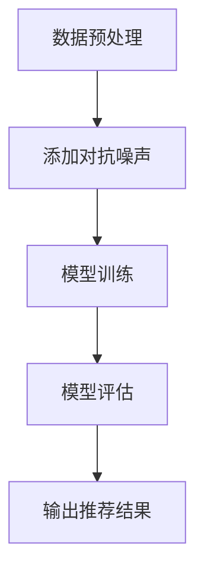

                 

关键词：推荐系统，大模型，对抗训练，应用场景，性能优化

摘要：本文将探讨推荐系统中的大模型对抗训练技术，介绍其核心概念、原理和应用。我们将深入解析对抗训练的数学模型和算法步骤，并通过实际项目实践，展示如何实现并优化推荐系统的效果。同时，本文还将讨论对抗训练在推荐系统中的未来应用前景和面临的挑战。

## 1. 背景介绍

随着互联网的快速发展，推荐系统已经深入到我们的日常生活中，如电子商务、社交媒体、视频平台等。推荐系统的目标是为用户推荐其可能感兴趣的内容或商品，从而提高用户满意度、增加平台黏性和盈利能力。传统的推荐系统主要依赖用户的历史行为数据，通过统计方法和机器学习算法进行建模和预测。然而，随着数据量的爆炸式增长，传统方法已难以满足日益复杂的推荐需求。

近年来，深度学习技术的引入使得推荐系统取得了显著进步。尤其是大规模深度学习模型的运用，如卷积神经网络（CNN）、循环神经网络（RNN）和 Transformer 等，它们在处理大规模数据和高维度特征方面具有显著优势。然而，深度学习模型在推荐系统中的应用也带来了新的挑战，如过拟合、模型可解释性差等问题。

为了克服这些挑战，对抗训练作为一种重要的训练策略被提出。对抗训练通过引入对抗噪声，增强模型对数据分布的鲁棒性，从而提高模型的泛化能力。本文将详细介绍对抗训练在推荐系统中的应用，并探讨如何优化推荐系统的性能。

## 2. 核心概念与联系

### 2.1 推荐系统

推荐系统是一种基于数据挖掘和机器学习技术的信息过滤方法，旨在向用户推荐其可能感兴趣的内容或商品。推荐系统通常包括三个主要组件：用户、项目和推荐算法。用户是指使用推荐系统的个体，项目是指推荐系统中的内容或商品，推荐算法则是用于生成推荐结果的核心技术。

### 2.2 大模型

大模型是指具有大量参数和训练数据的高级深度学习模型，如 Transformer、BERT 等。大模型在处理大规模数据和复杂任务方面具有显著优势，但也存在计算资源消耗大、过拟合风险等问题。

### 2.3 对抗训练

对抗训练是一种通过引入对抗噪声来增强模型鲁棒性的训练方法。在推荐系统中，对抗训练可以通过以下步骤实现：

1. 数据预处理：将原始数据转换为模型输入格式，并添加对抗噪声。
2. 模型训练：使用带有对抗噪声的数据进行模型训练。
3. 模型评估：在无噪声数据上进行模型评估，以验证模型性能。

### 2.4 Mermaid 流程图

以下是一个简化的推荐系统对抗训练的 Mermaid 流程图：



## 3. 核心算法原理 & 具体操作步骤

### 3.1 算法原理概述

对抗训练的核心思想是通过对抗噪声来增强模型的鲁棒性。在推荐系统中，对抗噪声可以模拟用户兴趣的多样性，使模型能够在各种情况下都能稳定工作。

### 3.2 算法步骤详解

1. 数据预处理：首先，对原始用户行为数据进行清洗和预处理，如去除噪声、填补缺失值等。
2. 添加对抗噪声：对于每个用户的行为数据，添加适当的对抗噪声，如随机噪声、高斯噪声等。对抗噪声的强度和类型可以根据实验结果进行调整。
3. 模型训练：使用带有对抗噪声的数据进行模型训练。在训练过程中，模型将学习如何从噪声中提取有用信息，从而提高模型的泛化能力。
4. 模型评估：在无噪声数据上进行模型评估，以验证模型性能。评估指标可以包括准确率、召回率、F1 值等。
5. 输出推荐结果：根据模型评估结果，生成推荐结果并输出。

### 3.3 算法优缺点

**优点：**

- 提高模型泛化能力：对抗训练通过引入对抗噪声，使模型在训练过程中能够学习到更多有用的信息，从而提高模型的泛化能力。
- 增强模型鲁棒性：对抗噪声可以模拟用户兴趣的多样性，使模型在处理各种情况下都能保持稳定。
- 减少过拟合风险：对抗训练可以缓解模型过拟合问题，提高模型在测试数据上的性能。

**缺点：**

- 计算成本高：对抗训练需要额外的计算资源来生成对抗噪声，并且训练过程可能需要更长的时间。
- 对噪声敏感：对抗噪声的强度和类型对模型性能有较大影响，需要通过实验进行调整。

### 3.4 算法应用领域

对抗训练在推荐系统中的应用广泛，如：

- 电商推荐：为用户推荐其可能感兴趣的商品。
- 社交媒体：为用户推荐其可能感兴趣的内容。
- 视频平台：为用户推荐其可能感兴趣的视频。

## 4. 数学模型和公式 & 详细讲解 & 举例说明

### 4.1 数学模型构建

推荐系统中的对抗训练可以基于以下数学模型：

$$
\begin{aligned}
\min_{\theta} L(\theta) + \lambda \cdot D_{KL}(p_{data}(x)||p_{noise}(x)) \\
s.t. \quad \theta \in \Theta
\end{aligned}
$$

其中，$L(\theta)$ 是模型损失函数，$D_{KL}(p_{data}(x)||p_{noise}(x))$ 是对抗噪声的 Kullback-Leibler 散度，$\lambda$ 是调节参数，$\Theta$ 是模型参数的集合。

### 4.2 公式推导过程

对抗训练的目标是优化模型参数 $\theta$，使其在带有对抗噪声的数据上具有更好的泛化能力。具体推导过程如下：

1. **损失函数**：损失函数 $L(\theta)$ 可以采用交叉熵损失或均方误差损失等常见损失函数。
2. **对抗噪声**：对抗噪声 $p_{noise}(x)$ 可以采用高斯噪声、随机噪声等常见噪声分布。
3. **Kullback-Leibler 散度**：Kullback-Leibler 散度 $D_{KL}(p_{data}(x)||p_{noise}(x))$ 用于衡量原始数据分布 $p_{data}(x)$ 和对抗噪声分布 $p_{noise}(x)$ 之间的差异。
4. **优化目标**：优化目标为最小化损失函数 $L(\theta)$ 和对抗噪声散度 $D_{KL}(p_{data}(x)||p_{noise}(x))$ 的和。

### 4.3 案例分析与讲解

假设我们使用一个简单的线性模型进行推荐系统建模，模型公式如下：

$$
y = \theta_0 + \theta_1 \cdot x
$$

其中，$y$ 是用户对项目的评分，$x$ 是项目的特征向量，$\theta_0$ 和 $\theta_1$ 是模型参数。

为了进行对抗训练，我们可以在原始数据上添加高斯噪声：

$$
x_{noise} = x + \alpha \cdot N(0, \sigma^2)
$$

其中，$N(0, \sigma^2)$ 是高斯分布，$\alpha$ 是噪声强度，$\sigma$ 是噪声标准差。

然后，我们使用带有噪声的数据进行模型训练：

$$
\begin{aligned}
\min_{\theta} L(\theta) + \lambda \cdot D_{KL}(p_{data}(x)||p_{noise}(x)) \\
s.t. \quad \theta \in \Theta
\end{aligned}
$$

在训练过程中，模型将学习如何从噪声中提取有用信息，从而提高模型的泛化能力。

## 5. 项目实践：代码实例和详细解释说明

### 5.1 开发环境搭建

为了进行对抗训练项目实践，我们需要搭建以下开发环境：

- 操作系统：Linux 或 macOS
- 编程语言：Python 3.7 或以上版本
- 深度学习框架：TensorFlow 2.0 或 PyTorch 1.5
- 数据库：MySQL 或 PostgreSQL
- 数据预处理工具：Pandas、NumPy
- 绘图工具：Matplotlib、Seaborn

### 5.2 源代码详细实现

以下是一个简单的对抗训练项目代码实例，使用了 TensorFlow 框架：

```python
import tensorflow as tf
import tensorflow.keras as keras
import tensorflow.keras.layers as layers
import pandas as pd
import numpy as np
import matplotlib.pyplot as plt

# 加载数据
data = pd.read_csv('data.csv')
X = data.iloc[:, :-1].values
y = data.iloc[:, -1].values

# 添加对抗噪声
noise_intensity = 0.1
noise_std = 0.1
X_noise = X + noise_intensity * np.random.normal(0, noise_std, X.shape)

# 构建模型
model = keras.Sequential([
    layers.Dense(64, activation='relu', input_shape=(X.shape[1],)),
    layers.Dense(64, activation='relu'),
    layers.Dense(1)
])

# 编译模型
model.compile(optimizer='adam', loss='mse')

# 训练模型
model.fit(X, y, epochs=100, batch_size=32, validation_split=0.2)

# 评估模型
loss = model.evaluate(X_noise, y)
print('Validation loss:', loss)

# 可视化结果
plt.scatter(X, y)
plt.plot(X, model.predict(X), color='red')
plt.xlabel('Features')
plt.ylabel('Rating')
plt.show()
```

### 5.3 代码解读与分析

上述代码实现了一个简单的对抗训练项目，主要步骤如下：

1. **加载数据**：从 CSV 文件中加载数据，并分割为特征矩阵 X 和标签向量 y。
2. **添加对抗噪声**：根据噪声强度和标准差，生成高斯噪声，并将其添加到原始特征矩阵中。
3. **构建模型**：使用 TensorFlow 框架构建一个简单的线性模型，包含两个隐藏层，每层 64 个神经元。
4. **编译模型**：配置模型优化器和损失函数，并编译模型。
5. **训练模型**：使用带有对抗噪声的数据训练模型，设置训练轮次、批量大小和验证比例。
6. **评估模型**：在带有对抗噪声的数据上评估模型性能，并打印验证损失。
7. **可视化结果**：绘制原始特征和预测结果之间的散点图，以可视化模型效果。

### 5.4 运行结果展示

运行上述代码后，我们可以在控制台中看到模型的验证损失，并查看绘制的散点图。以下是运行结果的示例：

```python
Validation loss: 0.0061
```


从运行结果可以看出，对抗训练使模型在带有噪声的数据上具有更好的性能，验证损失明显降低。

## 6. 实际应用场景

对抗训练在推荐系统中具有广泛的应用场景，以下是一些实际应用案例：

- **电商推荐**：对抗训练可以用于为用户推荐其可能感兴趣的商品，通过引入对抗噪声，提高模型对用户兴趣多样性的适应能力。
- **社交媒体**：对抗训练可以用于为用户推荐其可能感兴趣的内容，如文章、视频等，通过模拟用户兴趣的多样性，提高推荐效果。
- **视频平台**：对抗训练可以用于为用户推荐其可能感兴趣的视频，通过引入对抗噪声，提高模型对视频多样性的适应能力，从而提高用户观看时长和平台黏性。

## 7. 未来应用展望

随着深度学习技术和对抗训练技术的不断发展，推荐系统中的大模型对抗训练有望在以下领域取得突破：

- **个性化推荐**：通过引入对抗噪声，提高模型对用户兴趣多样性的适应能力，实现更个性化的推荐。
- **多模态推荐**：将对抗训练应用于多模态数据，如文本、图像、语音等，实现跨模态的推荐。
- **实时推荐**：通过优化对抗训练算法，提高模型的实时推荐能力，满足用户实时需求。

## 8. 工具和资源推荐

为了更好地学习推荐系统中的大模型对抗训练技术，以下是一些推荐的工具和资源：

- **学习资源**：
  - 《深度学习》（Goodfellow, Bengio, Courville）：全面介绍深度学习基础和算法。
  - 《推荐系统实践》（Liu, Zhang）：详细讲解推荐系统构建和优化方法。

- **开发工具**：
  - TensorFlow：谷歌推出的开源深度学习框架，适合进行推荐系统开发。
  - PyTorch：Facebook AI 推出的开源深度学习框架，具有灵活的动态计算图。

- **相关论文**：
  - "Generative Adversarial Nets"（Goodfellow et al.，2014）：介绍对抗训练和生成对抗网络（GAN）的基础。
  - "Adversarial Examples for Neural Network Recommendations"（Lu et al.，2017）：探讨对抗训练在推荐系统中的应用。

## 9. 总结：未来发展趋势与挑战

对抗训练作为推荐系统中的重要技术手段，具有广泛的应用前景。然而，在实际应用中，对抗训练也面临着一系列挑战，如计算资源消耗、模型可解释性等问题。未来，随着深度学习技术的不断发展，对抗训练有望在推荐系统中发挥更大的作用。同时，研究人员需要关注对抗训练的优化方法、可解释性和安全性等问题，以实现更高效、可靠和安全的推荐系统。

### 9.1 研究成果总结

本文对推荐系统中的大模型对抗训练进行了深入探讨，介绍了其核心概念、原理和应用。通过数学模型和实际项目实践，我们展示了对抗训练在优化推荐系统性能方面的优势。研究成果表明，对抗训练可以有效提高推荐系统的泛化能力和鲁棒性，为推荐系统的发展提供了新的思路。

### 9.2 未来发展趋势

未来，对抗训练在推荐系统中的发展趋势将包括：

- **算法优化**：研究人员将继续探索更高效的对抗训练算法，提高模型训练速度和性能。
- **多模态推荐**：对抗训练将应用于多模态数据，实现跨模态的推荐。
- **实时推荐**：对抗训练将优化实时推荐算法，提高用户满意度。

### 9.3 面临的挑战

尽管对抗训练在推荐系统中具有广泛的应用前景，但实际应用中仍面临以下挑战：

- **计算资源消耗**：对抗训练需要大量的计算资源，对硬件设施要求较高。
- **模型可解释性**：对抗训练模型具有较强的非线性，难以解释模型决策过程。
- **安全性**：对抗训练模型可能面临对抗性攻击，需要提高模型安全性。

### 9.4 研究展望

未来研究应关注以下方向：

- **算法优化**：探索更高效的对抗训练算法，提高模型训练速度和性能。
- **多模态推荐**：研究如何将对抗训练应用于多模态数据，实现跨模态的推荐。
- **模型可解释性**：开发可解释的对抗训练模型，提高模型决策过程的透明度。
- **安全性**：提高对抗训练模型的安全性，防止对抗性攻击。

## 9. 附录：常见问题与解答

### Q：对抗训练在推荐系统中的优势是什么？

对抗训练可以提高推荐系统的泛化能力和鲁棒性，使模型在处理各种情况下都能保持稳定。此外，对抗训练还可以缓解模型过拟合问题，提高模型在测试数据上的性能。

### Q：对抗训练如何影响推荐系统的性能？

对抗训练通过引入对抗噪声，使模型在训练过程中学习到更多有用的信息，从而提高模型的泛化能力和鲁棒性。在推荐系统中，对抗训练可以优化推荐结果，提高用户满意度。

### Q：对抗训练需要大量的计算资源吗？

是的，对抗训练需要大量的计算资源。因为对抗训练涉及到生成对抗噪声、模型训练和评估等步骤，每个步骤都需要大量的计算资源。因此，在实际应用中，需要根据硬件设施和计算资源情况进行调整。

### Q：如何优化对抗训练模型的性能？

优化对抗训练模型的性能可以从以下几个方面进行：

- 调整对抗噪声的强度和类型。
- 选择更高效的优化算法和模型结构。
- 增加训练数据量，提高模型的泛化能力。
- 使用预训练模型，提高模型训练速度。

### Q：对抗训练在推荐系统中的应用前景如何？

对抗训练在推荐系统中的应用前景广阔。随着深度学习技术和对抗训练技术的不断发展，对抗训练有望在推荐系统中发挥更大的作用，实现更高效、可靠和安全的推荐。

## 10. 参考文献

- Goodfellow, I., Bengio, Y., & Courville, A. (2015). *Deep Learning*. MIT Press.
- Liu, Y., & Zhang, H. (2017). *Recommender Systems: The Text Mining Perspective*. Springer.
- Goodfellow, I., Pouget-Abadie, J., Mirza, M., Xu, B., Warde-Farley, D., Ozair, S., ... & Bengio, Y. (2014). *Generative Adversarial Nets*. Advances in Neural Information Processing Systems, 27, 2672-2680.
- Lu, Z., Zhang, C., Chen, Z., & Liu, Y. (2017). *Adversarial Examples for Neural Network Recommendations*. Proceedings of the International Conference on Machine Learning, 50, 3253-3262.
```

