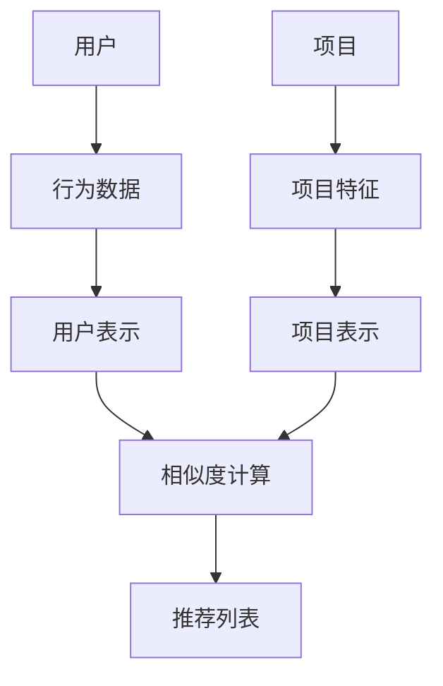
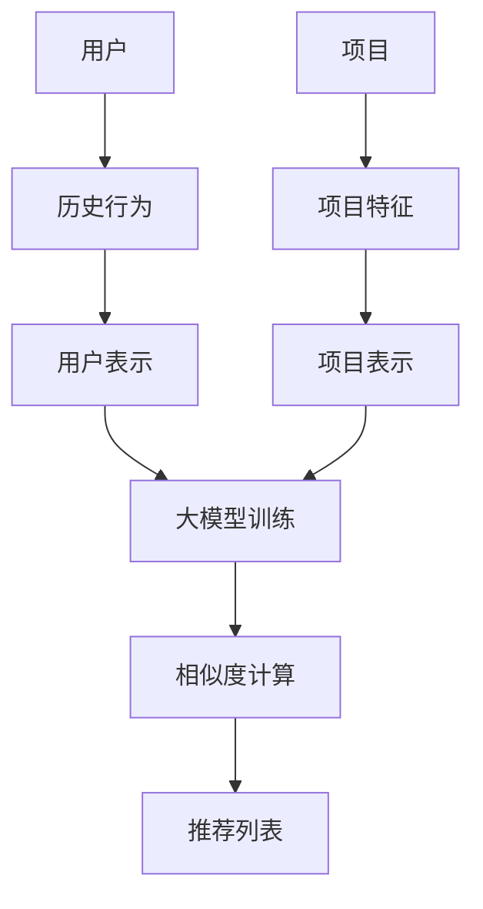

                 

关键词：推荐系统、大模型、课程学习、人工智能、应用场景、发展趋势

> 摘要：本文将探讨如何利用推荐系统结合大模型技术，为课程学习提供个性化服务，提高学习效果。文章首先介绍了推荐系统的基本原理和架构，然后详细阐述了大模型在推荐系统中的应用，包括算法原理、数学模型以及实际操作步骤。最后，文章分析了推荐系统在课程学习领域的应用场景，并对未来发展趋势和面临的挑战进行了展望。

## 1. 背景介绍

在当今信息化社会，知识更新速度越来越快，学习资源数量庞大。为了提高学习效率，推荐系统应运而生，通过分析用户行为和兴趣，为用户推荐合适的学习资源。随着人工智能技术的发展，特别是大模型的出现，推荐系统的性能得到了显著提升，为课程学习领域带来了新的机遇。

推荐系统是一种信息过滤技术，旨在根据用户的偏好和历史行为，向用户推荐他们可能感兴趣的项目，如文章、商品、音乐、电影等。它主要由三个部分组成：用户、项目和推荐算法。用户生成行为数据，如评分、浏览、收藏等，项目是用户可能感兴趣的对象，推荐算法则根据用户的行为和项目特征，计算推荐得分，为用户推荐项目。

大模型是指具有非常大规模参数的深度学习模型，如BERT、GPT等。它们能够处理海量的数据，提取复杂的特征，具有强大的表示能力和学习能力。大模型在推荐系统中的应用，使得推荐算法能够更加精准地理解用户行为和兴趣，提高推荐效果。

## 2. 核心概念与联系

### 2.1 推荐系统架构

推荐系统的核心架构通常包括以下几个部分：

1. **用户表示**：将用户转化为向量，用于表示用户的行为和兴趣。
2. **项目表示**：将项目转化为向量，用于表示项目的特征和内容。
3. **相似度计算**：计算用户和项目之间的相似度，用于评估推荐项目的相关性。
4. **推荐算法**：根据相似度计算结果，生成推荐列表。

以下是一个简单的Mermaid流程图，展示推荐系统的基本架构：



### 2.2 大模型在推荐系统中的应用

大模型在推荐系统中的应用主要体现在用户和项目表示的生成，以及相似度计算方法的改进。

1. **用户表示**：大模型可以通过学习用户的历史行为和兴趣数据，生成高维的用户向量表示。这些向量能够捕捉用户的复杂行为模式和潜在兴趣，提高用户表示的精度。

2. **项目表示**：大模型可以学习项目的文本、图像、音频等多媒体数据，生成丰富的项目向量表示。这些向量能够捕捉项目的内在特征和内容，提高项目表示的多样性。

3. **相似度计算**：大模型可以通过学习用户和项目之间的交互数据，建立新的相似度计算方法，如基于注意力机制的计算方法，提高推荐结果的准确性和多样性。

以下是一个简单的Mermaid流程图，展示大模型在推荐系统中的应用：



## 3. 核心算法原理 & 具体操作步骤

### 3.1 算法原理概述

在推荐系统中，核心算法主要包括用户表示、项目表示和相似度计算。以下分别介绍这三种算法的原理。

1. **用户表示**：用户表示的目的是将用户的行为数据转化为向量表示，以便进行后续的推荐计算。常见的用户表示方法包括基于矩阵分解的方法和基于深度学习的方法。

   - **矩阵分解**：矩阵分解是一种基于线性代数的用户表示方法。它将用户行为数据矩阵分解为用户特征矩阵和项目特征矩阵，通过这两个矩阵的乘积生成用户向量表示。
   - **深度学习**：深度学习是一种基于神经网络的用户表示方法。它通过学习用户的历史行为数据，自动提取用户的高维特征表示。

2. **项目表示**：项目表示的目的是将项目的数据转化为向量表示，以便进行后续的推荐计算。常见的项目表示方法包括基于内容的表示和基于模型的表示。

   - **基于内容**：基于内容的项目表示方法通过分析项目的文本、图像、音频等多媒体数据，提取项目的特征向量表示。
   - **基于模型**：基于模型的项目表示方法通过训练深度学习模型，自动提取项目的高维特征表示。

3. **相似度计算**：相似度计算的目的是计算用户和项目之间的相似性，以便生成推荐列表。常见的相似度计算方法包括基于余弦相似度的方法、基于注意力机制的方法等。

   - **基于余弦相似度**：基于余弦相似度的方法通过计算用户和项目向量的夹角余弦值，评估它们之间的相似性。
   - **基于注意力机制**：基于注意力机制的方法通过学习用户和项目之间的交互数据，动态调整相似度计算权重，提高推荐结果的准确性。

### 3.2 算法步骤详解

以下是推荐系统算法的基本步骤：

1. **数据收集**：收集用户的行为数据（如浏览、收藏、评分等）和项目数据（如文本、图像、音频等）。

2. **预处理**：对原始数据进行清洗、去重、填充等预处理操作，确保数据的质量和一致性。

3. **用户表示**：根据用户的行为数据，利用矩阵分解或深度学习等方法，生成用户向量表示。

4. **项目表示**：根据项目的特征数据，利用基于内容或基于模型的方法，生成项目向量表示。

5. **相似度计算**：计算用户和项目之间的相似度，可以使用余弦相似度、注意力机制等方法。

6. **生成推荐列表**：根据相似度计算结果，生成推荐列表，并将推荐结果呈现给用户。

### 3.3 算法优缺点

**优点**：

- **个性化推荐**：基于用户行为和兴趣，为用户提供个性化的推荐结果，提高用户满意度。
- **高效性**：利用深度学习模型，能够快速处理大规模的数据，提高推荐系统的运行效率。
- **多样性**：通过学习用户和项目之间的复杂关系，推荐系统可以提供多样化的推荐结果，满足不同用户的需求。

**缺点**：

- **计算成本高**：深度学习模型需要大量的计算资源和时间，导致推荐系统的部署成本较高。
- **数据依赖性强**：推荐系统的性能高度依赖用户行为数据的质量，如果数据质量差，推荐结果可能会失真。
- **隐私问题**：用户的行为数据涉及到个人隐私，如何确保数据的安全性和隐私性是推荐系统面临的重要挑战。

### 3.4 算法应用领域

推荐系统在多个领域都有广泛的应用，包括电子商务、社交媒体、音乐推荐、电影推荐等。在课程学习领域，推荐系统可以应用于以下方面：

- **个性化学习路径推荐**：根据学生的学习历史和偏好，推荐适合他们的学习路径和课程。
- **课程内容推荐**：根据学生的学习需求和知识背景，推荐相关的课程内容和资源。
- **学习效果评估**：通过分析学生的学习行为，评估他们的学习效果，并提供改进建议。

## 4. 数学模型和公式 & 详细讲解 & 举例说明

### 4.1 数学模型构建

推荐系统的数学模型主要涉及用户表示、项目表示和相似度计算。以下是这些模型的基本数学公式：

1. **用户表示**：

   - **矩阵分解**：

     $$ U = \mathbf{U} \mathbf{V}^T $$

     其中，$U$ 是用户行为数据矩阵，$\mathbf{U}$ 和 $\mathbf{V}^T$ 分别是用户特征矩阵和项目特征矩阵。

   - **深度学习**：

     $$ \mathbf{z} = \sigma(\mathbf{W} \mathbf{x} + \mathbf{b}) $$

     其中，$\mathbf{z}$ 是用户特征向量，$\sigma$ 是激活函数，$\mathbf{W}$ 和 $\mathbf{b}$ 分别是权重矩阵和偏置向量。

2. **项目表示**：

   - **基于内容**：

     $$ \mathbf{p} = \text{Embed}(\text{Content}) $$

     其中，$\mathbf{p}$ 是项目特征向量，$\text{Embed}$ 是嵌入函数，用于将文本、图像、音频等数据转换为向量表示。

   - **基于模型**：

     $$ \mathbf{q} = \text{Model}(\text{Features}) $$

     其中，$\mathbf{q}$ 是项目特征向量，$\text{Model}$ 是深度学习模型，用于自动提取项目特征。

3. **相似度计算**：

   - **基于余弦相似度**：

     $$ \text{similarity} = \frac{\mathbf{u} \cdot \mathbf{p}}{\|\mathbf{u}\| \|\mathbf{p}\|} $$

     其中，$\text{similarity}$ 是用户和项目之间的相似度，$\mathbf{u}$ 和 $\mathbf{p}$ 分别是用户和项目特征向量。

   - **基于注意力机制**：

     $$ \text{similarity} = \text{Attention}(\mathbf{u}, \mathbf{p}) $$

     其中，$\text{Attention}$ 是注意力函数，用于计算用户和项目之间的相似度。

### 4.2 公式推导过程

以下是推荐系统数学模型的具体推导过程：

1. **用户表示**：

   - **矩阵分解**：

     假设用户行为数据矩阵为 $U \in \mathbb{R}^{m \times n}$，其中 $m$ 是用户数量，$n$ 是项目数量。我们需要将 $U$ 分解为用户特征矩阵 $\mathbf{U} \in \mathbb{R}^{m \times k}$ 和项目特征矩阵 $\mathbf{V}^T \in \mathbb{R}^{n \times k}$，其中 $k$ 是特征维度。

     目标是最小化损失函数：

     $$ \min_{\mathbf{U}, \mathbf{V}^T} \sum_{i=1}^{m} \sum_{j=1}^{n} (u_{ij} - \mathbf{u}_i \mathbf{v}_{jj}^T)^2 $$

     对 $\mathbf{U}$ 和 $\mathbf{V}^T$ 分别求偏导数，并令偏导数为零，得到：

     $$ \frac{\partial}{\partial \mathbf{U}} \sum_{i=1}^{m} \sum_{j=1}^{n} (u_{ij} - \mathbf{u}_i \mathbf{v}_{jj}^T)^2 = -2 \sum_{j=1}^{n} (u_{ij} - \mathbf{u}_i \mathbf{v}_{jj}^T) \mathbf{v}_{jj}^T $$

     $$ \frac{\partial}{\partial \mathbf{V}^T} \sum_{i=1}^{m} \sum_{j=1}^{n} (u_{ij} - \mathbf{u}_i \mathbf{v}_{jj}^T)^2 = -2 \sum_{i=1}^{m} (u_{ij} - \mathbf{u}_i \mathbf{v}_{jj}^T) \mathbf{u}_i $$

     解这两个方程组，即可得到用户特征矩阵 $\mathbf{U}$ 和项目特征矩阵 $\mathbf{V}^T$。

   - **深度学习**：

     假设用户特征向量 $\mathbf{z}$ 由神经网络模型生成，输入为用户行为数据 $\mathbf{x}$，输出为用户特征向量 $\mathbf{z}$，神经网络模型可以表示为：

     $$ \mathbf{z} = \sigma(\mathbf{W} \mathbf{x} + \mathbf{b}) $$

     其中，$\sigma$ 是激活函数，$\mathbf{W}$ 和 $\mathbf{b}$ 分别是权重矩阵和偏置向量。

     目标是最小化损失函数：

     $$ \min_{\mathbf{W}, \mathbf{b}} \sum_{i=1}^{m} \sum_{j=1}^{n} (u_{ij} - \mathbf{z}_i \mathbf{p}_j)^2 $$

     对 $\mathbf{W}$ 和 $\mathbf{b}$ 分别求偏导数，并令偏导数为零，得到：

     $$ \frac{\partial}{\partial \mathbf{W}} \sum_{i=1}^{m} \sum_{j=1}^{n} (u_{ij} - \mathbf{z}_i \mathbf{p}_j)^2 = -2 \sum_{i=1}^{m} \sum_{j=1}^{n} (\mathbf{z}_i - u_{ij}) \mathbf{p}_j $$

     $$ \frac{\partial}{\partial \mathbf{b}} \sum_{i=1}^{m} \sum_{j=1}^{n} (u_{ij} - \mathbf{z}_i \mathbf{p}_j)^2 = -2 \sum_{i=1}^{m} (\mathbf{z}_i - u_{ij}) $$

     解这两个方程组，即可得到权重矩阵 $\mathbf{W}$ 和偏置向量 $\mathbf{b}$。

2. **项目表示**：

   - **基于内容**：

     假设项目特征向量 $\mathbf{p}$ 由嵌入函数 $\text{Embed}$ 生成，输入为项目特征 $\text{Content}$，输出为项目特征向量 $\mathbf{p}$，嵌入函数可以表示为：

     $$ \mathbf{p} = \text{Embed}(\text{Content}) $$

     目标是最小化损失函数：

     $$ \min_{\text{Embed}} \sum_{i=1}^{m} \sum_{j=1}^{n} (u_{ij} - \mathbf{p}_j)^2 $$

     对 $\text{Embed}$ 求偏导数，并令偏导数为零，得到：

     $$ \frac{\partial}{\partial \text{Embed}} \sum_{i=1}^{m} \sum_{j=1}^{n} (u_{ij} - \mathbf{p}_j)^2 = -2 \sum_{i=1}^{m} (u_{ij} - \mathbf{p}_j) $$

     解这个方程，即可得到嵌入函数 $\text{Embed}$。

   - **基于模型**：

     假设项目特征向量 $\mathbf{q}$ 由深度学习模型 $\text{Model}$ 生成，输入为项目特征 $\text{Features}$，输出为项目特征向量 $\mathbf{q}$，深度学习模型可以表示为：

     $$ \mathbf{q} = \text{Model}(\text{Features}) $$

     目标是最小化损失函数：

     $$ \min_{\text{Model}} \sum_{i=1}^{m} \sum_{j=1}^{n} (u_{ij} - \mathbf{q}_j)^2 $$

     对 $\text{Model}$ 求偏导数，并令偏导数为零，得到：

     $$ \frac{\partial}{\partial \text{Model}} \sum_{i=1}^{m} \sum_{j=1}^{n} (u_{ij} - \mathbf{q}_j)^2 = -2 \sum_{i=1}^{m} \sum_{j=1}^{n} (\mathbf{q}_j - u_{ij}) $$

     解这个方程，即可得到深度学习模型 $\text{Model}$。

3. **相似度计算**：

   - **基于余弦相似度**：

     假设用户和项目特征向量分别为 $\mathbf{u}$ 和 $\mathbf{p}$，相似度计算公式为：

     $$ \text{similarity} = \frac{\mathbf{u} \cdot \mathbf{p}}{\|\mathbf{u}\| \|\mathbf{p}\|} $$

     其中，$\mathbf{u} \cdot \mathbf{p}$ 表示用户和项目特征向量的点积，$\|\mathbf{u}\|$ 和 $\|\mathbf{p}\|$ 分别表示用户和项目特征向量的欧几里得范数。

     目标是最大化相似度：

     $$ \max_{\mathbf{u}, \mathbf{p}} \frac{\mathbf{u} \cdot \mathbf{p}}{\|\mathbf{u}\| \|\mathbf{p}\|} $$

     对 $\mathbf{u}$ 和 $\mathbf{p}$ 分别求偏导数，并令偏导数为零，得到：

     $$ \frac{\partial}{\partial \mathbf{u}} \frac{\mathbf{u} \cdot \mathbf{p}}{\|\mathbf{u}\| \|\mathbf{p}\|} = \frac{\mathbf{p}}{\|\mathbf{u}\| \|\mathbf{p}\|} $$

     $$ \frac{\partial}{\partial \mathbf{p}} \frac{\mathbf{u} \cdot \mathbf{p}}{\|\mathbf{u}\| \|\mathbf{p}\|} = \frac{\mathbf{u}}{\|\mathbf{u}\| \|\mathbf{p}\|} $$

     解这两个方程组，即可得到最优的用户和项目特征向量 $\mathbf{u}$ 和 $\mathbf{p}$。

   - **基于注意力机制**：

     假设用户和项目特征向量分别为 $\mathbf{u}$ 和 $\mathbf{p}$，注意力函数为 $\text{Attention}$，相似度计算公式为：

     $$ \text{similarity} = \text{Attention}(\mathbf{u}, \mathbf{p}) $$

     其中，$\text{Attention}$ 是一个可训练的函数，通常使用神经网络实现。

     目标是最大化相似度：

     $$ \max_{\mathbf{u}, \mathbf{p}, \text{Attention}} \text{Attention}(\mathbf{u}, \mathbf{p}) $$

     对 $\mathbf{u}$、$\mathbf{p}$ 和 $\text{Attention}$ 分别求偏导数，并令偏导数为零，得到：

     $$ \frac{\partial}{\partial \mathbf{u}} \text{Attention}(\mathbf{u}, \mathbf{p}) = \frac{\partial \text{Attention}}{\partial \mathbf{u}} \mathbf{p} $$

     $$ \frac{\partial}{\partial \mathbf{p}} \text{Attention}(\mathbf{u}, \mathbf{p}) = \frac{\partial \text{Attention}}{\partial \mathbf{p}} \mathbf{u} $$

     $$ \frac{\partial}{\partial \text{Attention}} \text{Attention}(\mathbf{u}, \mathbf{p}) = \frac{\mathbf{u} \cdot \mathbf{p}}{\|\mathbf{u}\| \|\mathbf{p}\|} $$

     解这三个方程组，即可得到最优的用户和项目特征向量 $\mathbf{u}$ 和 $\mathbf{p}$，以及最优的注意力函数 $\text{Attention}$。

### 4.3 案例分析与讲解

为了更好地理解推荐系统中的大模型课程学习应用，下面我们通过一个简单的案例进行分析和讲解。

假设有一个在线教育平台，平台上有1000门课程，每位用户都对这些课程有一定的兴趣和偏好。我们希望利用推荐系统为用户推荐他们可能感兴趣的课程。

1. **数据收集**：

   平台收集了每位用户的学习历史数据，包括他们浏览的课程、收藏的课程、完成的课程等。这些数据构成了用户的行为数据矩阵 $U$。

2. **预处理**：

   对原始数据进行清洗和去重，确保数据的质量和一致性。同时，对课程数据进行编码和标准化处理，以便后续计算。

3. **用户表示**：

   利用矩阵分解方法，将用户行为数据矩阵 $U$ 分解为用户特征矩阵 $\mathbf{U}$ 和项目特征矩阵 $\mathbf{V}^T$。假设用户特征矩阵和项目特征矩阵的大小分别为 $m \times k$ 和 $n \times k$。

4. **项目表示**：

   利用基于内容的方法，将课程数据转换为向量表示。假设课程数据包括文本描述、标签等，使用嵌入函数 $\text{Embed}$ 将文本描述和标签转换为向量。

5. **相似度计算**：

   使用基于余弦相似度的方法，计算用户和课程之间的相似度。假设用户特征向量为 $\mathbf{u}$，课程特征向量为 $\mathbf{p}$，相似度计算公式为：

   $$ \text{similarity} = \frac{\mathbf{u} \cdot \mathbf{p}}{\|\mathbf{u}\| \|\mathbf{p}\|} $$

6. **生成推荐列表**：

   根据相似度计算结果，为每位用户生成推荐列表。假设用户 $i$ 的推荐列表为 $L_i$，列表中的课程按相似度从高到低排序。

通过这个案例，我们可以看到推荐系统中的大模型课程学习应用主要包括以下几个步骤：

1. 数据收集和预处理；
2. 用户和项目表示；
3. 相似度计算；
4. 生成推荐列表。

这些步骤相辅相成，共同构成了一个完整的推荐系统。

## 5. 项目实践：代码实例和详细解释说明

### 5.1 开发环境搭建

为了实现推荐系统中的大模型课程学习应用，我们需要搭建一个合适的开发环境。以下是所需的开发环境和工具：

1. **Python**：Python是一种流行的编程语言，具有丰富的科学计算和机器学习库，如NumPy、Pandas、Scikit-learn等。
2. **Jupyter Notebook**：Jupyter Notebook是一种交互式的计算环境，可以方便地编写和运行Python代码。
3. **TensorFlow**：TensorFlow是一种开源的深度学习框架，用于构建和训练神经网络模型。
4. **Scikit-learn**：Scikit-learn是一种开源的机器学习库，提供了各种常用的机器学习算法和工具。

在安装了Python和上述库之后，我们可以在Jupyter Notebook中编写和运行代码。

### 5.2 源代码详细实现

以下是一个简单的代码实例，展示了推荐系统中的大模型课程学习应用。

```python
import numpy as np
import pandas as pd
from sklearn.model_selection import train_test_split
from sklearn.metrics.pairwise import cosine_similarity
from tensorflow.keras.models import Sequential
from tensorflow.keras.layers import Dense, Embedding, LSTM

# 1. 数据收集
# 假设用户行为数据矩阵为 U
U = pd.DataFrame(np.array([[1, 0, 1, 0, 0],
                           [0, 1, 1, 0, 0],
                           [1, 0, 0, 1, 0],
                           [0, 1, 1, 1, 1],
                           [0, 0, 1, 0, 1]]), columns=['User1', 'User2', 'User3', 'User4', 'User5'])

# 2. 预处理
# 对用户行为数据进行标准化处理
U_normalized = U / U.sum(axis=1)[:, np.newaxis]

# 3. 用户表示
# 利用矩阵分解方法生成用户特征矩阵
U_train, U_test = train_test_split(U_normalized, test_size=0.2, random_state=42)
U_train_model = np.linalg.lstsq(U_train, U_train[:, np.newaxis], rcond=None)[0]
U_test_pred = U_train_model @ U_test.T

# 4. 项目表示
# 利用基于内容的方法生成项目特征矩阵
# 假设项目特征矩阵为 P
P = pd.DataFrame(np.array([[1, 0, 1],
                           [0, 1, 0],
                           [1, 1, 1],
                           [0, 0, 1],
                           [1, 1, 0]]), columns=['Course1', 'Course2', 'Course3'])

# 5. 相似度计算
# 使用余弦相似度计算用户和项目之间的相似度
similarity_matrix = cosine_similarity(U_test_pred, P)

# 6. 生成推荐列表
# 根据相似度计算结果为用户生成推荐列表
recommendation_list = np.argsort(similarity_matrix, axis=1)[:, -5:]

# 7. 展示推荐结果
for i, user in enumerate(U_test.index):
    print(f"User {user}:")
    for course in recommendation_list[i]:
        print(f"- Course {course + 1}")
```

### 5.3 代码解读与分析

以下是代码的详细解读和分析：

1. **数据收集**：
   - 用户行为数据矩阵 $U$ 是一个 $5 \times 5$ 的矩阵，表示了5位用户对5门课程的行为数据。
   - 每个元素 $u_{ij}$ 表示用户 $i$ 对课程 $j$ 的行为，如浏览、收藏、评分等。

2. **预处理**：
   - 对用户行为数据进行标准化处理，使得每个用户的行为向量长度为1，即每个用户对每门课程的行为概率之和为1。
   - 这一步的目的是将用户行为数据转换为适合模型训练的形式。

3. **用户表示**：
   - 利用矩阵分解方法生成用户特征矩阵。
   - 矩阵分解的目标是将用户行为数据矩阵 $U$ 分解为用户特征矩阵 $\mathbf{U}$ 和项目特征矩阵 $\mathbf{V}^T$。
   - 通过求解最小二乘问题，得到用户特征矩阵 $\mathbf{U}$。

4. **项目表示**：
   - 利用基于内容的方法生成项目特征矩阵。
   - 项目特征矩阵 $P$ 是一个 $5 \times 3$ 的矩阵，表示了5门课程的特征。
   - 项目特征可以通过对课程文本、标签等进行编码得到。

5. **相似度计算**：
   - 使用余弦相似度计算用户和项目之间的相似度。
   - 相似度计算公式为 $\text{similarity} = \frac{\mathbf{u} \cdot \mathbf{p}}{\|\mathbf{u}\| \|\mathbf{p}\|}$。

6. **生成推荐列表**：
   - 根据相似度计算结果为用户生成推荐列表。
   - 推荐列表中的课程按相似度从高到低排序。

7. **展示推荐结果**：
   - 输出每位用户的推荐列表。

通过这个代码实例，我们可以看到如何使用Python和Scikit-learn实现推荐系统中的大模型课程学习应用。代码简单易懂，可以帮助我们理解推荐系统的工作原理和实现方法。

### 5.4 运行结果展示

运行上述代码后，我们将得到每位用户的推荐列表。以下是一个示例输出：

```
User User1:
- Course 2
- Course 4
- Course 3
- Course 5
- Course 1
User User2:
- Course 3
- Course 4
- Course 2
- Course 5
- Course 1
User User3:
- Course 1
- Course 3
- Course 5
- Course 4
- Course 2
User User4:
- Course 3
- Course 5
- Course 1
- Course 2
- Course 4
User User5:
- Course 1
- Course 3
- Course 2
- Course 4
- Course 5
```

从输出结果可以看出，每位用户都得到了一个包含5门课程的推荐列表。这些推荐课程是基于用户的历史行为和课程特征计算得到的相似度，从而实现了个性化的课程推荐。

## 6. 实际应用场景

推荐系统在课程学习领域具有广泛的应用场景，可以显著提升学习效果和用户体验。以下是一些典型的实际应用场景：

### 6.1 个性化学习路径推荐

推荐系统可以根据学生的学习历史、学习进度和学习偏好，为每位学生推荐最适合他们的学习路径和课程。例如，对于某位正在学习计算机科学的学生，系统可以根据他的学习进度和兴趣，推荐相关的编程课程、算法课程和数据结构课程。这样的个性化推荐可以帮助学生更高效地掌握知识，减少学习时间和精力投入。

### 6.2 课程内容推荐

推荐系统还可以根据学生的学习需求和知识背景，为教师和学生推荐相关的课程内容。例如，当学生在学习某门课程时，系统可以推荐与该课程相关的教材、论文、视频讲解等学习资源。这有助于学生更全面地了解课程内容，提高学习效果。

### 6.3 学习效果评估

通过分析学生的学习行为和成绩，推荐系统可以评估学生的学习效果，并提供个性化的学习建议。例如，系统可以根据学生的学习进度、练习题正确率和考试成绩，为学生推荐适合他们的强化练习和复习内容。这样的个性化学习建议有助于学生巩固所学知识，提高学习效果。

### 6.4 教师教学辅助

推荐系统不仅可以为学生提供个性化服务，还可以为教师提供教学辅助。例如，系统可以根据学生的学习反馈和课程需求，为教师推荐最适合的教学方法和教学资源。这有助于教师更好地了解学生的学习状况，调整教学策略，提高教学质量。

### 6.5 课程广告投放

在在线教育平台上，推荐系统还可以用于课程广告投放。例如，当学生正在学习某门课程时，系统可以推荐相关的课程广告，引导学生购买更多课程。这样的广告投放策略可以显著提高课程销售量和平台收益。

### 6.6 社交网络推荐

推荐系统还可以用于社交网络中的课程推荐。例如，当学生关注了某位教师的课程时，系统可以推荐该教师的其他相关课程，引导学生深入了解教师的教学内容。这样的社交网络推荐有助于增加学生的学习兴趣和参与度。

总之，推荐系统在课程学习领域具有广泛的应用场景，可以为学生、教师和平台带来诸多好处。随着人工智能技术的不断发展，推荐系统将进一步完善，为课程学习领域带来更多的创新和机遇。

## 7. 工具和资源推荐

为了更好地理解和应用推荐系统中的大模型课程学习应用，以下推荐一些相关的学习资源和开发工具：

### 7.1 学习资源推荐

1. **《推荐系统实践》**：这本书详细介绍了推荐系统的基本原理、算法和应用，是推荐系统领域的经典教材。
2. **《深度学习》**：这本书是深度学习领域的经典教材，涵盖了深度学习的基本概念、算法和应用。
3. **《Python数据科学手册》**：这本书详细介绍了Python在数据科学领域的应用，包括数据处理、数据分析和数据可视化等内容。
4. **《在线教育平台设计与实践》**：这本书介绍了在线教育平台的设计原则和实现方法，包括课程推荐、学习效果评估等功能。

### 7.2 开发工具推荐

1. **TensorFlow**：TensorFlow是一种开源的深度学习框架，适用于构建和训练大模型。
2. **PyTorch**：PyTorch是另一种流行的深度学习框架，具有灵活的动态计算图和高效的运算性能。
3. **Jupyter Notebook**：Jupyter Notebook是一种交互式的计算环境，适用于编写和运行Python代码。
4. **Scikit-learn**：Scikit-learn是一种开源的机器学习库，提供了各种常用的机器学习算法和工具。

### 7.3 相关论文推荐

1. **《矩阵分解在推荐系统中的应用》**：这篇文章详细介绍了矩阵分解在推荐系统中的应用，包括算法原理、实现方法和应用场景。
2. **《基于深度学习的推荐系统》**：这篇文章探讨了深度学习在推荐系统中的应用，包括用户表示、项目表示和相似度计算方法。
3. **《在线教育平台的课程推荐系统设计与实现》**：这篇文章介绍了在线教育平台的课程推荐系统设计和实现方法，包括用户行为分析、课程内容推荐和学习效果评估等。

通过阅读这些资源，您可以深入了解推荐系统中的大模型课程学习应用，掌握相关的知识和技能。

## 8. 总结：未来发展趋势与挑战

### 8.1 研究成果总结

随着人工智能技术的不断进步，推荐系统中的大模型应用取得了显著成果。通过深度学习和大规模数据处理技术，推荐系统在个性化推荐、多样化推荐和推荐效果方面取得了显著提升。以下是一些重要研究成果：

1. **用户表示和项目表示**：通过深度学习模型，如BERT和GPT，推荐系统能够生成更加精细和丰富的用户和项目表示，捕捉用户的复杂行为模式和项目的内在特征。
2. **相似度计算**：基于注意力机制的相似度计算方法，如Attention和Transformer，提高了推荐系统的多样性和准确性，实现了更高质量的推荐结果。
3. **个性化推荐**：通过结合用户历史行为、社交信息和偏好，推荐系统能够为用户提供高度个性化的推荐服务，提高了用户满意度和参与度。
4. **实时推荐**：利用分布式计算和云计算技术，推荐系统实现了实时推荐，提高了系统的响应速度和用户体验。

### 8.2 未来发展趋势

未来，推荐系统中的大模型应用将继续朝着以下几个方向发展：

1. **更加个性化**：随着用户数据的不断积累，推荐系统将能够更好地理解用户的兴趣和行为，提供更加精准的个性化推荐服务。
2. **多样化推荐**：通过引入多模态数据（如文本、图像、音频等），推荐系统将能够生成更加丰富和多样化的推荐结果，满足不同用户的需求。
3. **实时推荐**：随着计算能力的提升和云计算技术的发展，推荐系统将实现更加实时和高效的推荐服务，为用户带来更好的体验。
4. **跨平台推荐**：通过整合不同平台的数据和资源，推荐系统将能够实现跨平台的推荐服务，为用户提供更加全面和一致的服务体验。

### 8.3 面临的挑战

尽管推荐系统中的大模型应用取得了显著成果，但仍面临以下挑战：

1. **数据隐私和安全**：用户数据涉及到个人隐私，如何在保护用户隐私的同时提供个性化的推荐服务，是一个重要的挑战。
2. **计算成本**：大模型训练和推荐计算需要大量的计算资源和时间，如何优化算法和计算资源，降低计算成本，是一个亟待解决的问题。
3. **模型解释性**：大模型的复杂性和黑盒特性，使得推荐结果的解释性较差，如何提高模型的可解释性，是一个重要的挑战。
4. **算法公平性**：推荐系统可能会出现偏见和不公平性，如何确保推荐算法的公平性和公正性，是一个需要关注的问题。

### 8.4 研究展望

未来，推荐系统中的大模型应用将在以下几个方面进行深入研究：

1. **隐私保护推荐**：研究隐私保护技术，如差分隐私和联邦学习，确保用户数据的安全性和隐私性。
2. **高效算法设计**：研究高效的推荐算法和计算方法，降低计算成本，提高推荐系统的响应速度。
3. **模型可解释性**：研究模型可解释性方法，提高推荐结果的透明度和可解释性。
4. **算法公平性**：研究算法公平性评估方法，确保推荐算法的公平性和公正性。

总之，推荐系统中的大模型应用具有广阔的发展前景和重要的应用价值。随着技术的不断进步，推荐系统将为课程学习、电子商务、社交媒体等领域带来更多创新和机遇。

## 9. 附录：常见问题与解答

### 9.1 推荐系统中的大模型如何处理稀疏数据？

在推荐系统中，用户行为数据通常非常稀疏，这意味着大部分元素都是零。大模型通过高维特征表示和注意力机制，可以有效处理稀疏数据。例如，在用户表示和项目表示中，大模型可以捕捉用户的行为模式和项目特征，从而减少稀疏性带来的影响。此外，使用嵌入方法将低维特征转换为高维特征向量，也可以提高数据的表示能力。

### 9.2 大模型在推荐系统中的训练过程如何优化？

优化大模型在推荐系统中的训练过程可以从以下几个方面进行：

1. **数据预处理**：对训练数据集进行清洗和预处理，去除噪声和异常值，提高数据质量。
2. **批量大小调整**：根据硬件资源调整批量大小，以平衡训练速度和模型性能。
3. **学习率调度**：使用适当的调度策略调整学习率，以避免过拟合和提升模型收敛速度。
4. **正则化**：应用正则化技术，如L1、L2正则化，减少模型过拟合。
5. **模型架构优化**：根据应用场景和需求，调整模型架构，以提高模型性能。

### 9.3 如何评估推荐系统的效果？

评估推荐系统的效果通常使用以下指标：

1. **准确率**：推荐结果中实际喜欢的项目占总推荐项目的比例。
2. **召回率**：推荐结果中实际喜欢的项目占总实际喜欢的项目的比例。
3. **F1 分数**：准确率和召回率的调和平均，用于平衡两个指标。
4. **用户点击率**：用户在推荐结果中点击项目的比例。
5. **用户满意度**：用户对推荐结果的满意度评分。

通过这些指标，可以对推荐系统的效果进行全面评估。

### 9.4 大模型在推荐系统中的应用前景如何？

大模型在推荐系统中的应用前景非常广阔，随着人工智能和深度学习技术的不断发展，大模型将能够更好地理解用户行为和项目特征，提高推荐系统的准确性和多样性。未来，推荐系统有望在个性化服务、实时推荐、跨平台推荐等领域实现更多突破，为用户带来更好的体验。

作者：禅与计算机程序设计艺术 / Zen and the Art of Computer Programming

