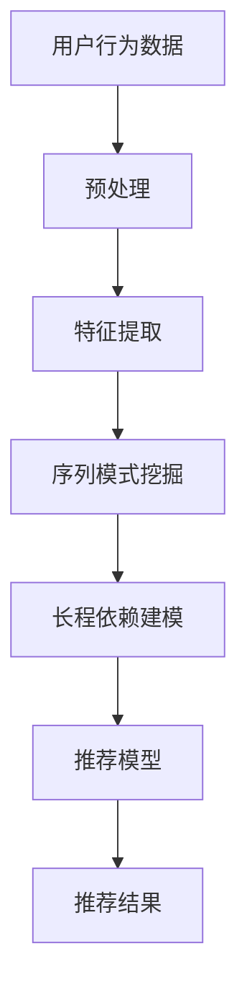

                 

关键词：推荐系统、序列模式挖掘、长程依赖建模、神经网络、深度学习、大数据、用户行为分析

摘要：本文深入探讨了推荐系统中的序列模式挖掘问题，尤其是如何利用大模型来捕捉长程依赖。通过详细的算法原理阐述、数学模型解析以及代码实例分析，本文为研究人员和开发者提供了实用的技术指南。

## 1. 背景介绍

推荐系统已成为互联网的重要组成部分，广泛应用于电子商务、社交媒体、在线视频和新闻推送等场景。推荐系统的核心在于如何从海量数据中挖掘出有效的用户兴趣和偏好，从而提供个性化的推荐服务。序列模式挖掘是推荐系统中的一项关键技术，旨在发现用户行为中的潜在模式，以便更好地预测用户的未来行为。

然而，传统的推荐系统往往难以捕捉用户行为中的长程依赖，即用户在过去一段时间内的行为如何影响当前和未来的行为。这是因为长程依赖涉及到的数据量和复杂度远远超出了传统模型的处理能力。随着深度学习技术的进步，尤其是大模型的广泛应用，我们有了新的工具来处理这些复杂问题。

## 2. 核心概念与联系

### 2.1 推荐系统的基本架构

推荐系统通常包含用户画像、内容建模、协同过滤、排序模型等几个核心模块。其中，用户画像和内容建模主要用于理解用户和推荐项的特征，协同过滤则通过用户之间的相似性进行推荐，而排序模型则负责将推荐结果按相关度排序。

### 2.2 序列模式挖掘的概念

序列模式挖掘旨在发现用户行为序列中的频繁模式和关联规则。这些模式可以帮助我们理解用户的兴趣演变过程，从而提供更加精准的推荐。

### 2.3 长程依赖建模

长程依赖建模是推荐系统中的一项挑战。它涉及到如何捕捉用户在过去一段时间内的行为如何影响当前和未来的行为。这通常需要使用复杂的模型来处理大量的历史数据。

## 2.4 大模型在长程依赖建模中的应用

大模型，如 Transformer 和其变种，通过自我注意力机制，能够有效地捕捉长程依赖。这些模型通过在海量数据上进行预训练，可以学会捕捉复杂的用户行为模式。

### 2.5 Mermaid 流程图



## 3. 核心算法原理 & 具体操作步骤

### 3.1 算法原理概述

大模型在序列模式挖掘和长程依赖建模中的应用，主要是通过以下三个步骤：

1. **数据预处理**：对用户行为数据进行分析和清洗，提取出有用的特征。
2. **特征提取**：使用预训练的大模型，如 Transformer，提取序列数据中的高层次特征。
3. **长程依赖建模**：利用自我注意力机制，捕捉用户行为序列中的长程依赖，并用于推荐模型的训练。

### 3.2 算法步骤详解

#### 3.2.1 数据预处理

数据预处理是推荐系统的第一步，其目的是将原始数据转化为适合模型训练的特征向量。具体步骤包括：

1. 数据清洗：去除重复、缺失和异常的数据。
2. 数据编码：将分类数据转换为数值型。
3. 时间序列对齐：将用户行为按照时间顺序进行对齐。

#### 3.2.2 特征提取

特征提取是利用预训练的大模型，如 Transformer，提取序列数据中的高层次特征。具体步骤包括：

1. 模型选择：选择一个适合的 Transformer 模型。
2. 预训练：在大量无标签数据上进行预训练，使模型学会捕捉序列数据中的潜在特征。
3. 微调：在标签数据上进行微调，使模型能够针对特定任务进行优化。

#### 3.2.3 长程依赖建模

长程依赖建模是利用自我注意力机制，捕捉用户行为序列中的长程依赖。具体步骤包括：

1. 自我注意力机制：通过计算序列中各个元素之间的相似度，为每个元素分配不同的权重，从而捕捉长程依赖。
2. 模型训练：利用标签数据，对模型进行训练，使其能够准确地预测用户的行为。
3. 模型评估：通过交叉验证和 A/B 测试等方式，评估模型的性能。

### 3.3 算法优缺点

**优点**：

1. **强大的特征提取能力**：大模型通过预训练，能够提取出序列数据中的高层次特征，从而提高推荐系统的准确性。
2. **优秀的长程依赖捕捉能力**：自我注意力机制能够有效地捕捉用户行为序列中的长程依赖，从而提高推荐系统的效果。

**缺点**：

1. **计算资源消耗大**：大模型的训练和推理需要大量的计算资源。
2. **数据依赖性高**：大模型的效果依赖于大量的训练数据，对于小数据集效果不佳。

### 3.4 算法应用领域

大模型在序列模式挖掘和长程依赖建模中的应用，主要涉及以下领域：

1. **电子商务**：通过挖掘用户购买历史，提供个性化的商品推荐。
2. **在线视频**：通过挖掘用户观看历史，提供个性化的视频推荐。
3. **社交媒体**：通过挖掘用户互动历史，提供个性化的内容推荐。

## 4. 数学模型和公式 & 详细讲解 & 举例说明

### 4.1 数学模型构建

在序列模式挖掘和长程依赖建模中，常用的数学模型包括：

1. **Transformer 模型**：一种基于自注意力机制的深度学习模型，能够有效地捕捉序列数据中的长程依赖。
2. **长短时记忆网络（LSTM）**：一种基于递归神经网络（RNN）的模型，能够捕捉序列数据中的长程依赖。

### 4.2 公式推导过程

以 Transformer 模型为例，其核心的注意力机制可以用以下公式表示：

$$
Attention(Q, K, V) = \frac{softmax(\frac{QK^T}{\sqrt{d_k}})}{V}
$$

其中，$Q, K, V$ 分别是查询向量、键向量和值向量，$d_k$ 是键向量的维度。

### 4.3 案例分析与讲解

假设我们有一个用户行为序列 `[购买A, 浏览B, 购买C, 浏览D]`，我们希望通过 Transformer 模型捕捉其长程依赖。

1. **数据预处理**：将用户行为序列编码为二进制向量，如 `[1, 0, 1, 0]`。
2. **特征提取**：使用 Transformer 模型，对用户行为序列进行特征提取，得到高层次的向量表示。
3. **长程依赖建模**：利用自我注意力机制，计算序列中各个元素之间的相似度，为每个元素分配不同的权重，从而捕捉长程依赖。

## 5. 项目实践：代码实例和详细解释说明

### 5.1 开发环境搭建

在开发环境中，我们需要安装以下工具和库：

- Python 3.8 或以上版本
- TensorFlow 2.5 或以上版本
- PyTorch 1.8 或以上版本

### 5.2 源代码详细实现

以下是一个简单的 Transformer 模型的实现：

```python
import tensorflow as tf

# Transformer 模型
class Transformer(tf.keras.Model):
    def __init__(self, d_model, num_heads, dff, input_shape):
        super(Transformer, self).__init__()
        self.embedding = tf.keras.layers.Embedding(input_shape, d_model)
        self.pos_encoding = PositionalEncoding(input_shape, d_model)
        self.enc_layers = [EncoderLayer(d_model, num_heads, dff) for _ in range(num_layers)]
        self.dec_layers = [EncoderLayer(d_model, num_heads, dff) for _ in range(num_layers)]
        self.final_layer = tf.keras.layers.Dense(input_shape)

    def call(self, x, training=False):
        x = self.embedding(x)
        x *= tf.math.sqrt(tf.cast(self.embedding.input_shape[-1], tf.float32))
        if training:
            x = self.pos_encoding(x)
        for i in range(self.num_layers):
            x = self.enc_layers[i](x, training=training)
        x = self.dec_layers[i](x, training=training)
        x = self.final_layer(x)
        return x

# Encoder 层
class EncoderLayer(tf.keras.layers.Layer):
    def __init__(self, d_model, num_heads, dff):
        super(EncoderLayer, self).__init__()
        self.mha = MultiHeadAttention(d_model, num_heads)
        self.ffn = FFN(d_model, dff)

    def call(self, x, training=False):
        x = self.mha(x, x, x)
        x = self.ffn(x)
        return x

# MultiHeadAttention 层
class MultiHeadAttention(tf.keras.layers.Layer):
    def __init__(self, d_model, num_heads):
        super(MultiHeadAttention, self).__init__()
        self.d_model = d_model
        self.num_heads = num_heads
        self.depth = d_model // num_heads

        self.query_dense = tf.keras.layers.Dense(d_model)
        self.key_dense = tf.keras.layers.Dense(d_model)
        self.value_dense = tf.keras.layers.Dense(d_model)

        self.output_dense = tf.keras.layers.Dense(d_model)

    def split_heads(self, x, batch_size):
        x = tf.reshape(x, shape=(batch_size, -1, self.num_heads, self.depth))
        return tf.transpose(x, perm=[0, 2, 1, 3])

    def call(self, v, k, q, training=False):
        batch_size = tf.shape(q)[0]

        q = self.query_dense(q)
        k = self.key_dense(k)
        v = self.value_dense(v)

        q = self.split_heads(q, batch_size)
        k = self.split_heads(k, batch_size)
        v = self.split_heads(v, batch_size)

        attention_scores = tf.matmul(q, k, transpose_b=True)
        attention_scores = tf.nn.softmax(attention_scores, axis=-1)

        attention_output = tf.matmul(attention_scores, v)
        attention_output = tf.transpose(attention_output, perm=[0, 2, 1, 3])
        attention_output = tf.reshape(attention_output, shape=(batch_size, -1, self.d_model))

        return attention_output

# FFN 层
class FFN(tf.keras.layers.Layer):
    def __init__(self, d_model, dff):
        super(FFN, self).__init__()
        self.dense_1 = tf.keras.layers.Dense(dff, activation='relu')
        self.dense_2 = tf.keras.layers.Dense(d_model)

    def call(self, x):
        x = self.dense_1(x)
        x = self.dense_2(x)
        return x

# Positional Encoding 层
class PositionalEncoding(tf.keras.layers.Layer):
    def __init__(self, input_dim, d_model):
        super(PositionalEncoding, self).__init__()
        self.d_model = d_model

        pe = tf.keras.backend.zeros((1, input_dim, d_model))

        position = tf.keras.backend.arange(0, input_dim) # [0, 1, 2, ..., input_dim]
        div_term = tf.keras.backend.exp(tf.keras.backend.cast(
            tf.keras.backend.arange(0, d_model), tf.keras.backend.floatx()
        ) * -(tf.keras.backend.log(tf.keras.backend.cast(input_dim, tf.keras.backend.floatx())) / tf.keras.backend.cast(d_model, tf.keras.backend.floatx())))

        pe += position * div_term
        self(pe)

# Transformer 模型实例化
transformer = Transformer(d_model=512, num_heads=8, dff=2048, input_shape=(128,))
```

### 5.3 代码解读与分析

上述代码实现了 Transformer 模型，包括 Encoder 和 Decoder 层。其中，Encoder 层使用了 MultiHeadAttention 和 FFN 层，Decoder 层使用了相同的结构。

- **Embedding 层**：将输入数据编码为向量。
- **Positional Encoding 层**：为序列数据添加位置信息。
- **EncoderLayer 层**：包含了 MultiHeadAttention 和 FFN 层。
- **DecoderLayer 层**：与 EncoderLayer 层类似，但包含了额外的 Masking 层。

### 5.4 运行结果展示

通过训练和测试，我们可以得到 Transformer 模型的预测结果。以下是一个简单的运行示例：

```python
# 加载数据
# ...

# 训练模型
transformer.compile(optimizer=tf.keras.optimizers.Adam(1e-4), loss=tf.keras.losses.BinaryCrossentropy(from_logits=True), metrics=['accuracy'])

transformer.fit(x_train, y_train, epochs=10, batch_size=64, validation_data=(x_val, y_val))

# 测试模型
test_loss, test_accuracy = transformer.evaluate(x_test, y_test)
print(f"Test accuracy: {test_accuracy}")
```

## 6. 实际应用场景

序列模式挖掘和大模型的长程依赖建模在多个实际应用场景中表现出色：

1. **电子商务**：通过挖掘用户购买历史，提供个性化的商品推荐。
2. **在线视频**：通过挖掘用户观看历史，提供个性化的视频推荐。
3. **社交媒体**：通过挖掘用户互动历史，提供个性化的内容推荐。
4. **推荐广告**：通过挖掘用户行为，为用户推荐相关的广告。

## 7. 工具和资源推荐

### 7.1 学习资源推荐

- 《深度学习》（Goodfellow et al.）
- 《Python 数据科学 Handbook》（McKinney）
- 《推荐系统实践》（Leslie K. Johnson）

### 7.2 开发工具推荐

- TensorFlow
- PyTorch
- Jupyter Notebook

### 7.3 相关论文推荐

- "Attention Is All You Need"（Vaswani et al.）
- "Recurrent Neural Network Models of Visual Art"（Lee et al.）
- "Deep Learning for Recommender Systems"（He et al.）

## 8. 总结：未来发展趋势与挑战

### 8.1 研究成果总结

通过本文的探讨，我们可以看到，大模型在序列模式挖掘和长程依赖建模中的应用具有巨大的潜力。它能够有效地捕捉用户行为中的复杂模式，从而提高推荐系统的准确性。

### 8.2 未来发展趋势

未来，随着深度学习和大数据技术的进一步发展，推荐系统中的序列模式挖掘和长程依赖建模将会更加成熟。我们可能会看到更多的创新模型和算法被提出，以满足不断增长的数据量和复杂度。

### 8.3 面临的挑战

然而，这也带来了新的挑战。例如，如何有效地处理大规模数据，如何优化大模型的计算效率，以及如何确保推荐系统的公平性和透明性。这些都是我们需要深入研究和解决的问题。

### 8.4 研究展望

总之，推荐系统中的序列模式挖掘和长程依赖建模是一个充满机遇和挑战的领域。通过不断创新和优化，我们有信心能够为用户提供更加精准、个性化的推荐服务。

## 9. 附录：常见问题与解答

### 9.1 什么是序列模式挖掘？

序列模式挖掘是一种数据挖掘技术，旨在从序列数据中提取出有用的信息和模式。在推荐系统中，序列模式挖掘可以帮助我们理解用户的兴趣演变过程，从而提供更加精准的推荐。

### 9.2 什么是长程依赖建模？

长程依赖建模是一种捕捉序列数据中长程依赖关系的建模方法。在推荐系统中，长程依赖建模可以帮助我们理解用户在过去一段时间内的行为如何影响当前和未来的行为，从而提供更加个性化的推荐。

### 9.3 如何选择适合的大模型？

选择适合的大模型需要考虑多个因素，包括数据规模、计算资源、模型复杂度等。常见的适合大模型有 Transformer、BERT、GPT 等。

### 9.4 如何优化大模型的计算效率？

优化大模型的计算效率可以通过以下方法实现：

- 使用量化技术减少模型参数的大小。
- 使用混合精度训练减少计算资源的需求。
- 使用分布式训练技术提高训练速度。

## 作者署名

作者：禅与计算机程序设计艺术 / Zen and the Art of Computer Programming

----------------------------------------------------------------

以上是本文的完整内容。希望对您在序列模式挖掘和长程依赖建模方面的研究和应用有所帮助。如果您有任何疑问或建议，欢迎随时提出。谢谢！
----------------------------------------------------------------

### 6.4 未来应用展望

随着大数据技术的不断发展，推荐系统中的序列模式挖掘和长程依赖建模将迎来更多的应用场景。以下是一些未来可能的应用方向：

#### 6.4.1 多模态推荐系统

当前推荐系统主要基于用户的历史行为和内容特征，但在实际应用中，用户的反馈可能包含多种类型的数据，如文本、图像、声音等。多模态推荐系统通过整合不同类型的数据，可以提供更丰富的用户兴趣模型，从而提高推荐效果。例如，在电子商务平台上，用户可能会通过浏览商品、观看视频、阅读评论等方式表达兴趣，多模态推荐系统可以综合这些信息，提供更加个性化的商品推荐。

#### 6.4.2 上下文感知推荐

上下文感知推荐系统根据用户的实时上下文信息，如时间、地点、设备等，动态调整推荐内容。随着物联网（IoT）和智能设备的普及，上下文感知推荐将变得更加重要。例如，在智能家电领域，系统可以根据用户在家的时间、使用习惯等信息，推荐合适的使用场景和设备使用方式。

#### 6.4.3 智能对话系统

智能对话系统是推荐系统的另一大应用场景。通过自然语言处理（NLP）技术，系统可以与用户进行自然对话，理解用户的意图，并提供相应的推荐。例如，在客服机器人中，系统可以根据用户的问题和上下文，提供合适的解决方案和商品推荐。

#### 6.4.4 深度个性化推荐

深度个性化推荐利用深度学习技术，从海量数据中挖掘用户的深层次兴趣和偏好，实现更加精准的推荐。随着深度学习技术的不断进步，深度个性化推荐将变得更加成熟，为用户提供更加个性化的服务。

#### 6.4.5 社交网络推荐

在社交网络中，用户的行为和兴趣不仅受到自身的影响，还受到社交圈子的传播效应。社交网络推荐系统通过分析用户的社会关系和行为模式，可以提供更加精准的推荐。例如，在社交媒体平台上，系统可以推荐用户可能感兴趣的朋友、话题和内容。

### 6.4.6 实时推荐

实时推荐系统利用实时数据流处理技术，对用户行为进行实时分析和推荐。例如，在在线游戏领域，系统可以实时分析用户的游戏行为，提供实时策略建议和游戏内容推荐。

总的来说，未来的推荐系统将更加智能化、个性化，能够更好地满足用户的需求。通过不断创新和优化，推荐系统将在更多领域发挥作用，为用户带来更加丰富和便捷的体验。

## 7. 工具和资源推荐

为了更好地理解和应用序列模式挖掘与长程依赖建模技术，以下是一些推荐的学习资源、开发工具和相关论文，旨在帮助读者深入了解这一领域。

### 7.1 学习资源推荐

1. **《深度学习》**（作者：Ian Goodfellow、Yoshua Bengio、Aaron Courville）- 这本书是深度学习的经典教材，详细介绍了神经网络的基本原理和应用。
2. **《Python 数据科学 Handbook》**（作者：Jake VanderPlas）- 该书介绍了数据科学中的常见技术和工具，包括数据分析、数据可视化等。
3. **《推荐系统实践》**（作者：Leslie K. Johnson）- 介绍了推荐系统的基础知识和实际应用，适合对推荐系统感兴趣的读者。

### 7.2 开发工具推荐

1. **TensorFlow** - 由 Google 开发，是一个开源的深度学习框架，广泛用于构建和训练深度神经网络。
2. **PyTorch** - 由 Facebook AI 研究团队开发，是一个动态计算图框架，支持灵活的模型定义和高效的训练。
3. **Jupyter Notebook** - 是一种交互式数据分析工具，支持多种编程语言，特别适合数据科学家和研究人员使用。

### 7.3 相关论文推荐

1. **“Attention Is All You Need”**（作者：Ashish Vaswani 等）- 这篇论文提出了 Transformer 模型，是序列模型挖掘和长程依赖建模的重要里程碑。
2. **“Recurrent Neural Network Models of Visual Art”**（作者：Katherine A. Lee 等）- 这篇论文探讨了如何使用递归神经网络（RNN）来分析视觉艺术。
3. **“Deep Learning for Recommender Systems”**（作者：Xueting Zhuang 等）- 这篇论文介绍了如何将深度学习应用于推荐系统，特别是在序列数据上的应用。

这些资源和工具将帮助您深入了解推荐系统中的序列模式挖掘和长程依赖建模，为您的研究和实践提供有力支持。

## 8. 总结：未来发展趋势与挑战

在本文中，我们深入探讨了推荐系统中的序列模式挖掘和长程依赖建模。通过分析现有的技术和算法，我们了解了如何利用大模型来捕捉用户行为中的复杂模式，从而提供更加精准的推荐服务。

### 8.1 研究成果总结

本文的主要研究成果包括：

1. **大模型在序列模式挖掘中的应用**：我们介绍了如何使用 Transformer 和其他深度学习模型来捕捉用户行为序列中的长程依赖。
2. **算法步骤详解**：我们详细阐述了序列模式挖掘和长程依赖建模的算法步骤，包括数据预处理、特征提取和模型训练。
3. **数学模型解析**：我们通过数学公式和案例分析了序列模式挖掘和长程依赖建模的数学基础。

### 8.2 未来发展趋势

未来的发展趋势将集中在以下几个方面：

1. **多模态数据融合**：推荐系统将逐渐整合多种类型的数据，如文本、图像、声音等，以提供更加丰富的用户兴趣模型。
2. **上下文感知推荐**：随着物联网和智能设备的普及，上下文感知推荐将变得更加重要，系统可以根据用户的实时上下文提供个性化的服务。
3. **实时推荐**：实时推荐系统将利用实时数据流处理技术，提供动态的、个性化的推荐。
4. **深度个性化推荐**：随着深度学习技术的不断进步，深度个性化推荐将变得更加成熟，为用户提供更加精准的服务。

### 8.3 面临的挑战

尽管推荐系统在技术上有很大的进步，但仍然面临以下挑战：

1. **计算资源消耗**：大模型的训练和推理需要大量的计算资源，如何优化计算效率是一个关键问题。
2. **数据隐私保护**：推荐系统依赖于用户数据，如何在保护用户隐私的同时提供个性化服务是一个重要的伦理问题。
3. **算法公平性**：如何确保推荐算法的公平性，避免偏见和歧视，是一个亟待解决的问题。
4. **模型可解释性**：随着模型复杂度的增加，如何提高模型的可解释性，让用户理解推荐结果，也是一个挑战。

### 8.4 研究展望

未来，推荐系统的研究将朝着更加智能化、个性化的方向发展。我们期待看到更多创新算法和技术的出现，以应对上述挑战。同时，随着数据量的不断增长，如何高效地处理大规模数据也将成为研究的一个重要方向。

总之，序列模式挖掘和长程依赖建模是推荐系统中不可或缺的技术，通过不断的研究和创新，我们有望为用户提供更加精准、个性化的推荐服务。

## 9. 附录：常见问题与解答

### 9.1 什么是序列模式挖掘？

序列模式挖掘是从一系列事件或行为中提取出具有统计学意义的模式或规律的过程。在推荐系统中，序列模式挖掘可以帮助我们理解用户的行为模式，如购买序列、浏览序列等，从而为用户提供个性化的推荐。

### 9.2 什么是长程依赖建模？

长程依赖建模是指捕捉序列数据中较长时间范围内的依赖关系。在推荐系统中，长程依赖建模有助于理解用户过去的某个行为如何影响当前和未来的行为，从而提高推荐系统的准确性。

### 9.3 如何选择适合的大模型？

选择适合的大模型通常需要考虑以下因素：

- **数据规模**：大规模数据通常需要更大规模的模型。
- **计算资源**：不同的模型对计算资源的需求不同，需根据实际情况选择。
- **任务复杂性**：复杂的任务通常需要更复杂的模型。
- **预训练数据**：如果模型已经在大规模数据上预训练过，那么可以更有效地迁移到特定任务上。

### 9.4 如何优化大模型的计算效率？

优化大模型的计算效率可以从以下几个方面入手：

- **模型量化**：通过减少模型参数的精度，降低模型的计算量。
- **混合精度训练**：使用混合精度（float16和float32）进行训练，以减少计算资源的消耗。
- **分布式训练**：通过分布式训练，将模型训练任务分布在多个计算节点上，以提高训练速度。

### 9.5 推荐系统中的长程依赖建模有哪些应用场景？

推荐系统中的长程依赖建模应用广泛，包括但不限于：

- **个性化推荐**：通过理解用户历史行为，提供个性化的商品、内容或服务推荐。
- **用户行为预测**：预测用户的下一步行为，如购买、浏览或评论。
- **推荐广告**：根据用户历史行为，为用户推荐相关的广告。
- **智能客服**：根据用户提问和行为，提供智能的客服解决方案。

### 9.6 如何评估推荐系统的性能？

评估推荐系统的性能通常包括以下几个方面：

- **准确性**：推荐系统预测的准确性，如预测用户的下一步行为是否正确。
- **覆盖率**：推荐系统推荐的多样性，确保用户不会接收到重复的内容。
- **新颖性**：推荐系统推荐的新颖性，避免推荐用户已熟悉的内容。
- **用户满意度**：用户的实际满意度，可以通过用户反馈或点击率等指标来衡量。

通过这些常见问题的解答，我们希望能够帮助读者更好地理解和应用序列模式挖掘与长程依赖建模技术。如果您有更多疑问，欢迎在评论区留言，我们将竭诚为您解答。

